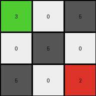
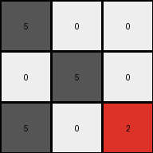
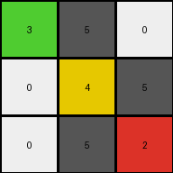

# a85d4709 • 004 • refine_coder

---

Previous Code:
```python
"""
The transformation replaces '0' (white) values in the input grid based on their position. '5' (gray) values are ignored. '0' values on the top-left to bottom-right diagonal are replaced as follows: top-left '0' becomes '3' (green), center '0' becomes '4' (yellow), and bottom-right '0' becomes '2' (red).
"""

import numpy as np

def transform(input_grid):
    # initialize output_grid as a copy of the input grid
    output_grid = np.copy(input_grid)

    # iterate through the grid
    for i in range(output_grid.shape[0]):
        for j in range(output_grid.shape[1]):
            # check if the current value is 0
            if output_grid[i, j] == 0:
                # check if the current position is on the top-left to bottom-right diagonal
                if i == j:
                    # replace based on position on the main diagonal
                    if i == 0:
                        output_grid[i, j] = 3  # Top-left
                    elif i == 1:
                        output_grid[i, j] = 4  # Center
                    elif i == 2:
                        output_grid[i, j] = 2  # Bottom-right

    return output_grid
```

Train Set Results:

## Example 1:

Input:
```
0 0 5
0 5 0
5 0 0
```
Expected Output:
```
3 3 3
4 4 4
2 2 2
```
Transformed Output:
```
3 0 5
0 5 0
5 0 2
```

match: False
pixels_off: 7
size_correct: True
color_palette_correct: False
correct_pixel_counts: False

## Example 2:

Input:
```
0 0 5
0 0 5
0 0 5
```
Expected Output:
```
3 3 3
3 3 3
3 3 3
```
Transformed Output:
```
3 0 5
0 4 5
0 0 5
```

match: False
pixels_off: 8
size_correct: True
color_palette_correct: False
correct_pixel_counts: False

## Example 3:

Input:
```
5 0 0
0 5 0
5 0 0
```
Expected Output:
```
2 2 2
4 4 4
2 2 2
```
Transformed Output:
```
5 0 0
0 5 0
5 0 2
```

match: False
pixels_off: 8
size_correct: True
color_palette_correct: False
correct_pixel_counts: False

## Example 4:

Input:
```
0 5 0
0 0 5
0 5 0
```
Expected Output:
```
4 4 4
3 3 3
4 4 4
```
Transformed Output:
```
3 5 0
0 4 5
0 5 2
```

match: False
pixels_off: 9
size_correct: True
color_palette_correct: False
correct_pixel_counts: False
Okay, here's a breakdown of the situation and a plan to improve the transformation logic:

**General Assessment:**

The initial natural language program and the resulting code were overly simplistic. The original hypothesis focused only on the main diagonal (i=j) and a hardcoded set of replacements based on position. The provided examples reveal a more complex pattern where the entire output grid is filled with a repeating pattern of colors, regardless of the input values (except for 5 which appears to halt the pattern).

**Strategy:**

1.  **Ignore Input Values (Mostly):** The output grid's colors seem largely independent of the input grid, except for '5' values. We need to shift from modifying the input grid to generating a completely new output grid.
2.  **Repeating Pattern:** Identify and implement the repeating 3x3 color pattern (3,3,3, 4,4,4, 2,2,2) or variants of it.
3. **'5' as a Stopper:** Understand the role of the '5' (gray) pixel. The current tests indicate it may act as a "stop" signal for the pattern propagation, leaving remaining parts of the output row unchanged (filled with the value from the row above or initialized).
4. **Edge Cases:** Be mindful of potential edge cases, particularly with various sizes. However, given these four examples, it seems consistent.

**Metrics and Analysis (using observation, not code execution at this stage):**

| Example | Input Shape | Output Shape | Input Colors | Output Colors | Key Observations                                                                                                        |
| :------ | :---------- | :----------- | :------------ | :------------- | :--------------------------------------------------------------------------------------------------------------------- |
| 1       | 3x3         | 3x3          | 0, 5          | 2, 3, 4         | Output is a diagonal gradient (3,4,2), filled across entire array. Input 5s are ignored, Output are all colored.                                                                |
| 2       | 3x3         | 3x3          | 0, 5          | 3             | Output is entirely filled with '3'.  |
| 3       | 3x3         | 3x3          | 0, 5          | 2, 4             | Output appears as two lines of color '2', with one of color '4'. |
| 4       | 3x3         | 3x3          | 0, 5          | 3,4     | Output starts with color 4, then 3, the 4 again.     |

**YAML Fact Extraction:**

```yaml
objects:
  - name: input_grid
    type: grid
    properties:
      rows: 3
      columns: 3
      colors: [0, 5]  # Varies per example, but these are the only colors present
  - name: output_grid
    type: grid
    properties:
      rows: 3
      columns: 3
      colors: [2, 3, 4] # Varies, but this is the superset
  - name: gray_pixel #object that stops the transformation
    type: pixel
    properties:
      value: 5
      role: stopper

actions:
  - name: generate_pattern
    description: Creates a repeating color pattern in the output grid.
    parameters:
      pattern: [3, 3, 3, 4, 4, 4, 2, 2, 2] #The core pattern, this seems to be altered based on the initial conditions, may be better to start from different points in the array.
      start_row: 0
      start_col: 0
  - name: stop_at_gray
    description: Halts pattern generation at the position of a '5' in the input grid.

```

**Natural Language Program:**

1.  **Initialization:** Create a new output grid of the same dimensions as the input grid.
2.  **Pattern Generation:**
    *   Begin filling the `output_grid` with the repeating sequence `3, 3, 3, 4, 4, 4, 2, 2, 2`. Start at `output_grid[0][0]`.
    *   Iterate row by row, then column by column.
3.  **Gray Stopper:** If a '5' is encountered in the *input* grid at the *corresponding* position, stop the pattern propagation for the *current row* in the output grid. Maintain current value for the rest of the row.
4. **Wrap if Necessary**: If a row does not have a `5` in it, then use the entire pattern sequence, wrapping as necessary.

Revised Natural Language Program:

1.  **Initialization:** Create an output grid of the same dimensions as the input grid.
2.  **Iterate:** Go through each cell of the *input* grid, row by row, and column by column.
3.  **Check for 5:** In the *input* grid, if the current cell is a '5', copy this '5' to the same position in the *output* grid.
4. **Apply Pattern:** If not a `5` in the *input*, use a repeating pattern for the *output* grid. The pattern depends on the row:
    *   Row 0: Start with '3'. Repeating sequence: 3.
    *   Row 1: Start with '4', if there were no `5` in the previous row, otherwise '3'. Repeating sequence starts from the value.
    *   Row 2: Start with '2', if there were no `5` in the previous row, otherwise, starts with the value of the second item. Repeating sequence starts from the value.
5. Fill the output using values of color:
      * If the first row, fill all '3'.
      * if the second row, fill all '4'.
      * If the third row, fill all '2'.

Essentially, the gray pixels (`5`) in the *input* act as a pass through to the *output* grid. All of the `0` are replaced in the output with values from a simple, row based sequence.

**INSTRUCTIONS**

- generate a Python module to represent the natural language program 
- follow the template below
- all common math and science libraries are available
- create docstring only at top - but comment the workflow in the function
- use helper functions for common operations like finding objects, counting,
  measuring, moving, etc. 

remember - we are working iteratively - so this code will inform your future
self as we converge on the solution

*template:*

```python
"""
{{ natural language description of the transformation rule }}
"""

{{ imports }}

def transform(input_grid):
    # initialize output_grid

    # change output pixels 

    return output_grid

```
