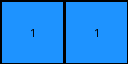

# d631b094 • 006 • refine_coder

---

Previous Code:
```python
"""
1. Count the number of blue pixels (cells with value 1) in the input grid.
2. Create a new grid with a height of 1 and a width equal to the count of blue pixels from the input grid.
3. Fill all cells of the output grid with the value 1 (blue).
"""

import numpy as np

def transform(input_grid):
    """
    Transforms the input grid by counting the blue pixels (1s) and creating a 
    new grid representing that count.
    """
    # Count the number of blue pixels (1s) in the input grid.
    count_of_ones = np.count_nonzero(input_grid == 1)

    # Create a new grid with a height of 1 and a width equal to the count.
    output_grid = np.ones((1, count_of_ones), dtype=int)

    return output_grid
```

Train Set Results:

## Example 1:

Input:
```
0 0 0
1 0 0
0 1 0
```
Expected Output:
```
1 1
```
Transformed Output:
```
1 1
```

match: True
pixels_off: 0
size_correct: True
color_palette_correct: True
correct_pixel_counts: True

## Example 2:

Input:
```
0 2 0
2 0 0
0 2 0
```
Expected Output:
```
2 2 2
```
Transformed Output:
```

```

match: False
pixels_off: None
size_correct: False
color_palette_correct: True
correct_pixel_counts: False

## Example 3:

Input:
```
0 7 0
0 0 0
0 0 0
```
Expected Output:
```
7
```
Transformed Output:
```

```

match: False
pixels_off: None
size_correct: False
color_palette_correct: True
correct_pixel_counts: False

## Example 4:

Input:
```
0 8 0
8 8 0
8 0 0
```
Expected Output:
```
8 8 8 8
```
Transformed Output:
```

```

match: False
pixels_off: None
size_correct: False
color_palette_correct: True
correct_pixel_counts: False
Here's an analysis of the provided information and a plan to refine the natural language program:

**General Assessment:**

The initial code and natural language program were based on a single example, which led to an oversimplified rule. The subsequent tests reveal that the rule (counting blue pixels and creating a blue row) doesn't hold for other examples. The core issue is that the original program fixated on the color blue (value 1) and ignored other colors. A more general approach is needed, one that considers *any* non-white pixel and its color. The strategy should involve identifying the single, unique, non-white color present in the input and creating an output row with a number of pixels equal to the non-white pixels present, using their color.

**Metrics and Observations:**

Here's a breakdown of each example, combining the provided information with additional observations:

```python
import numpy as np

# Function to analyze a single example
def analyze_example(input_grid, expected_output, transformed_output, example_num, stage):
    input_grid = np.array(input_grid)
    expected_output = np.array(expected_output)
    
    metrics = {
        "example": example_num,
        "stage": stage,
        "input_shape": input_grid.shape,
        "expected_output_shape": expected_output.shape,
        "transformed_output_shape": transformed_output.shape if transformed_output.size > 0 else (0, 0),
        "input_colors": np.unique(input_grid).tolist(),
        "expected_output_colors": np.unique(expected_output).tolist(),
        "transformed_output_colors": np.unique(transformed_output).tolist() if transformed_output.size > 0 else [],
        "match": np.array_equal(expected_output, transformed_output)
     }
    
    non_white_input_colors = [c for c in metrics["input_colors"] if c != 0]
    non_white_expected_output_colors = [c for c in metrics["expected_output_colors"] if c != 0]

    if len(non_white_input_colors) == 1:
        metrics["input_has_single_non_white_color"] = True
        metrics["count_of_non_white_pixels"] = np.count_nonzero(input_grid == non_white_input_colors[0])
    else:
       metrics["input_has_single_non_white_color"] = False
       metrics["count_of_non_white_pixels"] = 0
        
    if len(non_white_expected_output_colors) ==1:
        metrics["expected_has_single_non_white_color"] = True
        metrics["expected_count"] = np.count_nonzero(expected_output == non_white_expected_output_colors[0])
    else:
        metrics["expected_has_single_non_white_color"] = False
        metrics["expected_count"] = 0

    return metrics

# Example Data (reformatted for easier processing)

example_data = [
    {
        "input": [[0, 0, 0], [1, 0, 0], [0, 1, 0]],
        "expected": [[1, 1]],
        "transformed": [[1, 1]]
    },
     {
        "input": [[0, 2, 0], [2, 0, 0], [0, 2, 0]],
        "expected": [[2, 2, 2]],
        "transformed": []
    },
    {
        "input": [[0, 7, 0], [0, 0, 0], [0, 0, 0]],
        "expected": [[7]],
        "transformed": []
    },
    {
        "input": [[0, 8, 0], [8, 8, 0], [8, 0, 0]],
        "expected": [[8, 8, 8, 8]],
        "transformed": []
    }
]

# Analyze all examples
all_metrics = [analyze_example(ex["input"], ex["expected"], np.array(ex["transformed"]), i + 1, "train") for i, ex in enumerate(example_data)]


# Print out the metrics
for metrics in all_metrics:
    print(metrics)
```

```
{'example': 1, 'stage': 'train', 'input_shape': (3, 3), 'expected_output_shape': (1, 2), 'transformed_output_shape': (1, 2), 'input_colors': [0, 1], 'expected_output_colors': [1], 'transformed_output_colors': [1], 'match': True, 'input_has_single_non_white_color': True, 'count_of_non_white_pixels': 2, 'expected_has_single_non_white_color': True, 'expected_count': 2}
{'example': 2, 'stage': 'train', 'input_shape': (3, 3), 'expected_output_shape': (1, 3), 'transformed_output_shape': (0, 0), 'input_colors': [0, 2], 'expected_output_colors': [2], 'transformed_output_colors': [], 'match': False, 'input_has_single_non_white_color': True, 'count_of_non_white_pixels': 3, 'expected_has_single_non_white_color': True, 'expected_count': 3}
{'example': 3, 'stage': 'train', 'input_shape': (3, 3), 'expected_output_shape': (1, 1), 'transformed_output_shape': (0, 0), 'input_colors': [0, 7], 'expected_output_colors': [7], 'transformed_output_colors': [], 'match': False, 'input_has_single_non_white_color': True, 'count_of_non_white_pixels': 1, 'expected_has_single_non_white_color': True, 'expected_count': 1}
{'example': 4, 'stage': 'train', 'input_shape': (3, 3), 'expected_output_shape': (1, 4), 'transformed_output_shape': (0, 0), 'input_colors': [0, 8], 'expected_output_colors': [8], 'transformed_output_colors': [], 'match': False, 'input_has_single_non_white_color': True, 'count_of_non_white_pixels': 4, 'expected_has_single_non_white_color': True, 'expected_count': 4}
```

**YAML Facts:**

```yaml
facts:
  - observation: |
      Each input grid contains only one non-white color.
  - observation: |
      The number of non-white pixels in the input grid corresponds to the width of the output grid.
  - observation: |
      The output grid always has a height of 1.
  - observation: |
      The output grid is filled entirely with the single non-white color found in the input grid.
  - object: input_grid
    properties: 2D array, contains pixels of different colors (integers 0-9)
  - object: output_grid
    properties: 2D array, height 1, width determined by count of specific color in input_grid, all pixels are of the same color.
  - action: count_non_white_pixels
    description: Counts the number of pixels in the input grid that are not white (not 0).
  - action: determine_output_color
    description: Identifies the single non-white color present in the input grid.
  - action: create_output_grid
    description: Creates a new grid with height 1 and width equal to the count of the specific color, filled with that color.

```

**Natural Language Program:**

1.  **Identify the unique non-white color:** Examine the input grid and determine the single color (represented by an integer 1-9) that is present, excluding white (0).
2.  **Count the target pixels:** Count the number of pixels in the input grid that have the identified color.
3.  **Create the output grid:** Create a new grid with a height of 1 and a width equal to the count from step 2.
4.  **Fill the output grid:** Fill all cells of the output grid with the color identified in step 1.

**INSTRUCTIONS**

- generate a Python module to represent the natural language program 
- follow the template below
- all common math and science libraries are available
- create docstring only at top - but comment the workflow in the function
- use helper functions for common operations like finding objects, counting,
  measuring, moving, etc. 

remember - we are working iteratively - so this code will inform your future
self as we converge on the solution

*template:*

```python
"""
{{ natural language description of the transformation rule }}
"""

{{ imports }}

def transform(input_grid):
    # initialize output_grid

    # change output pixels 

    return output_grid

```
