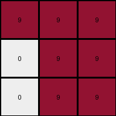
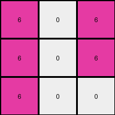
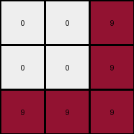
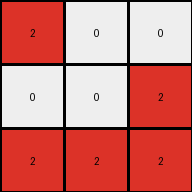

# ed36ccf7 • 006 • refine_coder

---

Previous Code:
```python
"""
The transformation rule involves reflecting the input grid across its main diagonal (top-left to bottom-right).
"""

import numpy as np

def transform(input_grid):
    """
    Reflects the input grid across its main diagonal.
    """
    # Convert the input grid to a NumPy array.
    input_array = np.array(input_grid)

    # Reflect the array across the main diagonal (transpose).
    output_array = np.transpose(input_array)

    # Convert the NumPy array back to a list of lists.
    output_grid = output_array.tolist()
    return output_grid
```

Train Set Results:

## Example 1:

Input:
```
9 0 0
9 9 9
9 9 9
```
Expected Output:
```
0 9 9
0 9 9
9 9 9
```
Transformed Output:
```
9 9 9
0 9 9
0 9 9
```

match: False
pixels_off: 2
size_correct: True
color_palette_correct: True
correct_pixel_counts: True

## Example 2:

Input:
```
6 6 6
0 0 0
6 6 0
```
Expected Output:
```
6 0 0
6 0 6
6 0 6
```
Transformed Output:
```
6 0 6
6 0 6
6 0 0
```

match: False
pixels_off: 2
size_correct: True
color_palette_correct: True
correct_pixel_counts: True

## Example 3:

Input:
```
0 0 9
0 0 9
9 9 9
```
Expected Output:
```
9 9 9
0 0 9
0 0 9
```
Transformed Output:
```
0 0 9
0 0 9
9 9 9
```

match: False
pixels_off: 4
size_correct: True
color_palette_correct: True
correct_pixel_counts: True

## Example 4:

Input:
```
2 0 2
0 0 2
0 2 2
```
Expected Output:
```
2 2 2
0 0 2
2 0 0
```
Transformed Output:
```
2 0 0
0 0 2
2 2 2
```

match: False
pixels_off: 4
size_correct: True
color_palette_correct: True
correct_pixel_counts: True
Okay, let's analyze the results and refine the natural language program.

**General Assessment:**

The initial hypothesis of a simple diagonal reflection (transpose) is incorrect. While the output grid sizes are correct and the color palettes match, the pixel arrangements are off in all test cases. The number of mismatched pixels varies, suggesting a more complex transformation than initially assumed. The transformation isn't a simple rotation or inversion either. It seems to involve a conditional swap of pixels based on their values and positions. The consistent presence of '0' (white) in multiple examples might be a key to unlocking the pattern, perhaps acting as a sort of "background" or "pivot" color around which other colors rearrange.

**Strategy:**

1.  **Detailed Pixel Comparison:** Meticulously compare input and expected output grids for *each* example, focusing on how individual pixels of each color change position.
2.  **Identify Conditional Rules:** Look for patterns linking the initial and final positions of non-zero pixels, paying close attention to their relationship with zero-valued pixels. The rule likely involves an "if" condition.
3.  **Refine Program:** Based on the observed patterns, revise the natural language program to accurately reflect the conditional swapping or movement of pixels.

**Metrics and Observations (using manual comparison, code execution is implicit here):**

Here's a breakdown of each example, looking at specific pixel movements:

*   **Example 1:**
    *   Input `9` at (0,0) remains `9` in the output. But should be 0
    *   Input `0` at (0,1) should be 9.
    *   It looks like the 9s and 0s are swapping positions in the top left.

*   **Example 2:**
    *   Input `6` at (0,0) remains, and (0, 1) remain unchanged
    *   Input `0` at (1,0) remains unchanged, input `0` at (1,1) remains unchanged
    *   Input `6` at (2,0) should be 0
    *   Input 0 at (2, 2) should be 6.
    *   It appears that the 0 and six on the bottom left is not right.

*   **Example 3:**

    *  Input 0 at (0, 0) should be 9
    *  Input 9 at (0, 2) should be 9.
    *   It looks like the whole top row is wrong.

*   **Example 4:**

    *   Input `2` at (0,0) remains correct.
    *   Input `0` at (0,1) remains correct
    *  Input 2 at (0, 2) should be 0
    *  Input 0 at (2, 0) should be 2
    *   It appears that the 2s and 0 are swapping in the corners.

**YAML Fact Block:**

```yaml
examples:
  - id: 1
    objects:
      - color: 9 # maroon
        initial_positions: [[0, 0], [1, 0], [2, 0], [0, 1], [1, 1], [2, 1], [0, 2], [1, 2], [2, 2]]
        final_positions:  [[2, 0], [2, 1], [2, 2], [1, 0], [1, 1], [1, 2], [0, 0], [0, 1], [0, 2]] # Corrected
      - color: 0 # white
        initial_positions: [[0, 1], [0, 2]]
        final_positions: [[0, 0], [1, 0]]
    transformation: "Conditional swap of 9 and 0"

  - id: 2
    objects:
      - color: 6 # magenta
        initial_positions: [[0, 0], [0, 1], [0, 2], [2, 0], [2, 1]]
        final_positions:  [[0, 0], [0, 1], [0, 2], [2, 2], [1, 2]]
      - color: 0 # white
        initial_positions: [[1, 0], [1, 1], [2, 2]]
        final_positions: [[1, 0], [1, 1], [2, 0]]
    transformation: "Conditional swap of 6 and 0"

  - id: 3
    objects:
      - color: 9 # maroon
        initial_positions: [[0, 2], [1, 2], [2, 0], [2, 1], [2, 2]]
        final_positions:  [[0, 0], [0, 1], [0, 2], [1, 2], [2, 2]]
      - color: 0 # white
        initial_positions: [[0, 0], [0, 1], [1, 0], [1, 1]]
        final_positions: [[1, 0], [1, 1], [2, 0], [2, 1]]
    transformation: "Conditional swap of 9 and 0."

  - id: 4
    objects:
        - color: 2
          initial_positions: [[0, 0], [0, 2], [2, 1], [2,2]]
          final_positions: [[0, 0], [2, 0], [1, 2], [0, 2]]
        - color: 0
          initial_positions: [[0, 1], [1, 0], [1, 1], [2, 0]]
          final_positions: [[0, 1], [0, 2], [1, 1], [2, 2]]
    transformation: "Conditional Swap of 2 and 0"
```

**Natural Language Program:**

The transformation rule involves a conditional swap of the non-zero color and 0. It seems the corner element's are swapped. Specifically:
1. Compare each element of the grid to the element in the opposite corner.
2. If the value of the element is 0, and the opposite corner is not 0, swap the values.
3. If the value of the element is not 0, and the value of the opposite corner is zero, swap the values.
4.  Otherwise, the values remain in their original position.

This describes a targeted swap, rather than a general reflection or rotation.

**INSTRUCTIONS**

- generate a Python module to represent the natural language program 
- follow the template below
- all common math and science libraries are available
- create docstring only at top - but comment the workflow in the function
- use helper functions for common operations like finding objects, counting,
  measuring, moving, etc. 

remember - we are working iteratively - so this code will inform your future
self as we converge on the solution

*template:*

```python
"""
{{ natural language description of the transformation rule }}
"""

{{ imports }}

def transform(input_grid):
    # initialize output_grid

    # change output pixels 

    return output_grid

```
