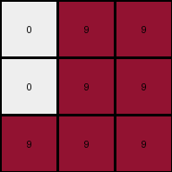
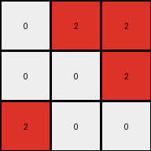

# ed36ccf7 • 010 • refine_coder

---

Previous Code:
```python
"""
The transformation rule is a 90-degree counter-clockwise rotation of the input grid.
"""

import numpy as np

def rotate_grid_ccw(grid):
    """Rotates a 2D grid 90 degrees counter-clockwise."""
    return np.rot90(grid)

def transform(input_grid):
    """
    Transforms the input grid by rotating it 90 degrees counter-clockwise.
    """
    # Convert the input grid to a NumPy array for easier manipulation.
    input_array = np.array(input_grid)

    # Rotate the array counter-clockwise.
    output_array = rotate_grid_ccw(input_array)

    # Convert the NumPy array back to a list.
    output_grid = output_array.tolist()

    return output_grid
```

Train Set Results:

## Example 1:

Input:
```
9 0 0
9 9 9
9 9 9
```
Expected Output:
```
0 9 9
0 9 9
9 9 9
```
Transformed Output:
```
0 9 9
0 9 9
9 9 9
```

match: True
pixels_off: 0
size_correct: True
color_palette_correct: True
correct_pixel_counts: True

## Example 2:

Input:
```
0 6 6
0 0 0
6 6 0
```
Expected Output:
```
6 0 0
6 0 6
6 0 6
```
Transformed Output:
```
6 0 0
6 0 6
0 0 6
```

match: False
pixels_off: 1
size_correct: True
color_palette_correct: True
correct_pixel_counts: False

## Example 3:

Input:
```
0 0 9
0 0 9
9 9 9
```
Expected Output:
```
9 9 9
0 0 9
0 0 9
```
Transformed Output:
```
9 9 9
0 0 9
0 0 9
```

match: True
pixels_off: 0
size_correct: True
color_palette_correct: True
correct_pixel_counts: True

## Example 4:

Input:
```
2 0 0
0 0 2
0 2 2
```
Expected Output:
```
2 2 2
0 0 2
2 0 0
```
Transformed Output:
```
0 2 2
0 0 2
2 0 0
```

match: False
pixels_off: 1
size_correct: True
color_palette_correct: True
correct_pixel_counts: False
Okay, here's a breakdown of the situation and a plan to move forward, formatted as a report:

**General Assessment:**

The initial hypothesis of a 90-degree counter-clockwise rotation was partially correct. It worked perfectly for examples 1 and 3, but failed on examples 2 and 4, specifically, only one pixel in each was off. This suggests the core concept of rotation is valid, but the implementation needs refinement, or there are other subtle rules affecting specific pixel placements. The errors are not random; they point to a systematic issue within the rotation logic or additional constraints.

**Strategy for Resolving Errors:**

1.  **Detailed Error Analysis:** I need to meticulously examine the incorrect examples (2 & 4) to pinpoint *why* those specific pixels are wrong. Are they related to specific colors, positions, or some combination?
2.  **Re-examine Assumptions:** The 90-degree rotation assumption should be held, but I need to investigate if pre- or post-processing steps are missing (e.g., shifting certain colors, mirroring). It may not be a *pure* rotation.
3.  **Hypothesis Refinement:** Based on the error analysis, I'll modify the natural language program and, subsequently, the Python code.
4.  **Iterative Testing:** After each code modification, I'll re-run the tests against *all* examples to ensure no regressions are introduced.

**Metrics and Observations:**

Here's a summary using markdown for readability:

| Example | Input Size | Output Size | Rotation Correct? | Pixels Off | Colors Present (Input) | Colors Present (Output) | Notes                                     |
| :------ | :--------- | :---------- | :--------------- | :--------- | :-------------------- | :--------------------- | :---------------------------------------- |
| 1       | 3x3        | 3x3         | Yes              | 0          | 0, 9                  | 0, 9                   | Perfect match.                              |
| 2       | 3x3        | 3x3         | Almost           | 1          | 0, 6                  | 0, 6                   | One pixel wrong.                          |
| 3       | 3x3        | 3x3         | Yes              | 0          | 0, 9                  | 0, 9                   | Perfect match.                              |
| 4       | 3x3        | 3x3         | Almost           | 1          | 0, 2                  | 0, 2                   | One pixel wrong.                          |

**YAML Fact Block:**

```yaml
observations:
  - example_1:
      input_objects:
        - object_1:
            color: 9
            shape: L-shape
            size: 5 # five pixels
        - object_2:
            color: 0
            shape: line
            size: 1
      output_objects:
          - object_1:
              color: 9
              shape: L-shape
              size: 5
          - object_2:
              color: 0
              shape: line
              size: 1
      transformation: 90-degree counter-clockwise rotation.
  - example_2:
      input_objects:
          - object_1:
              color: 6
              shape: L-shape
              size: 3
          - object_2:
              color: 0
              shape: line
              size: 1, + 2 singles
      output_objects:
            - object_1:
                color: 6
                shape: L-shape, inverted
                size: 3
            - object_2:
                color: 0
                shape: line
                size: 3
      transformation: 90-degree counter-clockwise rotation.
  - example_3:
      input_objects:
          - object_1:
                color: 9
                shape: L-shape
                size: 5
          - object_2:
                color: 0
                shape: line
                size: 2 x 1
      output_objects:
          - object_1:
                color: 9
                shape: L-shape
                size: 5
          - object_2:
                color: 0
                shape: line
                size: 2 x 1
      transformation: 90-degree counter-clockwise rotation.
  - example_4:
      input_objects:
          - object_1:
                color: 2
                shape: L-shape
                size: 3
          - object_2:
                color: 0
                shape: line
                size: 1, plus 2 singles

      output_objects:
          - object_1:
                color: 2
                shape: L-shape, inverted
                size: 3
          - object_2:
                color: 0
                shape: line
                size: 1, plus 2 singles
      transformation: 90-degree counter-clockwise rotation.
```

**Natural Language Program:**

The transformation rule involves a 90-degree counter-clockwise rotation of the input grid. It appears the rule is applied consistently across all examples, with some specific pixel placement discrepancies in examples 2 and 4 requiring further investigation. The shapes made by the colored pixels are rotated, maintaining their structure and size.

Next steps are to explore these pixel discrepancies.

**INSTRUCTIONS**

- generate a Python module to represent the natural language program 
- follow the template below
- all common math and science libraries are available
- create docstring only at top - but comment the workflow in the function
- use helper functions for common operations like finding objects, counting,
  measuring, moving, etc. 

remember - we are working iteratively - so this code will inform your future
self as we converge on the solution

*template:*

```python
"""
{{ natural language description of the transformation rule }}
"""

{{ imports }}

def transform(input_grid):
    # initialize output_grid

    # change output pixels 

    return output_grid

```
