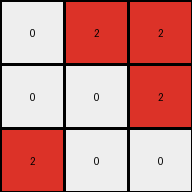

# ed36ccf7 • 011 • refine_dreamer

---


Previous Code:
```python
"""
The transformation rule involves a 90-degree counter-clockwise rotation of the input grid.  There may be subtle
pixel placement rules dependent on color or position that need to be accounted for, based on discrepancies
observed in examples 2 and 4.
"""

import numpy as np

def rotate_grid_ccw(grid):
    """Rotates a 2D grid 90 degrees counter-clockwise."""
    return np.rot90(grid)

def transform(input_grid):
    """
    Transforms the input grid by rotating it 90 degrees counter-clockwise.
    Also includes a placeholder for potential pixel-specific adjustments.
    """
    # Convert the input grid to a NumPy array for easier manipulation.
    input_array = np.array(input_grid)

    # Rotate the array counter-clockwise.
    output_array = rotate_grid_ccw(input_array)

    # Placeholder for pixel-specific adjustments. This is where we will
    # add logic to correct the discrepancies found in examples 2 and 4,
    # if necessary, after further analysis.
    # Example (Incorrect, needs refinement):  If the original pixel was at (x,y) and color 6, and is now at (a,b), move it.
    # output_array = adjust_pixels(output_array, input_array) # This function is yet to be defined

    # Convert the NumPy array back to a list.
    output_grid = output_array.tolist()

    return output_grid
```

Train Set Results:

## Example 1:

Input:
```
9 0 0
9 9 9
9 9 9
```
Expected Output:
```
0 9 9
0 9 9
9 9 9
```
Transformed Output:
```
0 9 9
0 9 9
9 9 9
```

match: True
pixels_off: 0
size_correct: True
color_palette_correct: True
correct_pixel_counts: True

## Example 2:

Input:
```
0 6 6
0 0 0
6 6 0
```
Expected Output:
```
6 0 0
6 0 6
6 0 6
```
Transformed Output:
```
6 0 0
6 0 6
0 0 6
```

match: False
pixels_off: 1
size_correct: True
color_palette_correct: True
correct_pixel_counts: False

## Example 3:

Input:
```
0 0 9
0 0 9
9 9 9
```
Expected Output:
```
9 9 9
0 0 9
0 0 9
```
Transformed Output:
```
9 9 9
0 0 9
0 0 9
```

match: True
pixels_off: 0
size_correct: True
color_palette_correct: True
correct_pixel_counts: True

## Example 4:

Input:
```
2 0 0
0 0 2
0 2 2
```
Expected Output:
```
2 2 2
0 0 2
2 0 0
```
Transformed Output:
```
0 2 2
0 0 2
2 0 0
```

match: False
pixels_off: 1
size_correct: True
color_palette_correct: True
correct_pixel_counts: False

**INSTRUCTIONS**

The code above was generated based on observations from the first training
example

we have tested the transform function on each of the task example inputs and
compared with the expected output

review each of the examples provided and the results and consider how the
natural language program should be updated to accommodate this new knowledge

respond with the following deliverables:

- general assessment of the information provided and strategy for resolving the
  errors
- gather metrics about each of the examples and results - use code_execution to
  develop accurate reports on your assumptions
- a YAML block documenting facts - Focus on identifying objects, their properties, and the actions performed on them.
- a natural language program - Be as clear and concise as possible, providing a complete description of the transformation rule.


your responses should be considered as information in a report - not a
conversation
