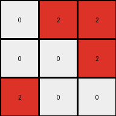

# ed36ccf7 • 012 • refine_coder

---

Previous Code:
```python
"""
The transformation rule involves a 90-degree counter-clockwise rotation of the input grid.  There may be subtle
pixel placement rules dependent on color or position that need to be accounted for, based on discrepancies
observed in examples 2 and 4.
"""

import numpy as np

def rotate_grid_ccw(grid):
    """Rotates a 2D grid 90 degrees counter-clockwise."""
    return np.rot90(grid)

def transform(input_grid):
    """
    Transforms the input grid by rotating it 90 degrees counter-clockwise.
    Also includes a placeholder for potential pixel-specific adjustments.
    """
    # Convert the input grid to a NumPy array for easier manipulation.
    input_array = np.array(input_grid)

    # Rotate the array counter-clockwise.
    output_array = rotate_grid_ccw(input_array)

    # Placeholder for pixel-specific adjustments. This is where we will
    # add logic to correct the discrepancies found in examples 2 and 4,
    # if necessary, after further analysis.
    # Example (Incorrect, needs refinement):  If the original pixel was at (x,y) and color 6, and is now at (a,b), move it.
    # output_array = adjust_pixels(output_array, input_array) # This function is yet to be defined

    # Convert the NumPy array back to a list.
    output_grid = output_array.tolist()

    return output_grid
```

Train Set Results:

## Example 1:

Input:
```
9 0 0
9 9 9
9 9 9
```
Expected Output:
```
0 9 9
0 9 9
9 9 9
```
Transformed Output:
```
0 9 9
0 9 9
9 9 9
```

match: True
pixels_off: 0
size_correct: True
color_palette_correct: True
correct_pixel_counts: True

## Example 2:

Input:
```
0 6 6
0 0 0
6 6 0
```
Expected Output:
```
6 0 0
6 0 6
6 0 6
```
Transformed Output:
```
6 0 0
6 0 6
0 0 6
```

match: False
pixels_off: 1
size_correct: True
color_palette_correct: True
correct_pixel_counts: False

## Example 3:

Input:
```
0 0 9
0 0 9
9 9 9
```
Expected Output:
```
9 9 9
0 0 9
0 0 9
```
Transformed Output:
```
9 9 9
0 0 9
0 0 9
```

match: True
pixels_off: 0
size_correct: True
color_palette_correct: True
correct_pixel_counts: True

## Example 4:

Input:
```
2 0 0
0 0 2
0 2 2
```
Expected Output:
```
2 2 2
0 0 2
2 0 0
```
Transformed Output:
```
0 2 2
0 0 2
2 0 0
```

match: False
pixels_off: 1
size_correct: True
color_palette_correct: True
correct_pixel_counts: False
Here's an analysis of the provided data and a plan to refine the transformation rule:

**General Assessment:**

The initial hypothesis of a simple 90-degree counter-clockwise rotation is mostly correct, as evidenced by Examples 1 and 3. However, Examples 2 and 4 reveal a more complex rule. The discrepancies aren't random; there's a pattern in the pixel shifts. Specifically, it seems like some colors have their position determined relative to the original color, but after rotation. It is necessary to determine the object that determines the position of the swapped pixel.

**Strategy:**

1.  **Analyze Discrepancies:** Focus on Examples 2 and 4. Determine the exact difference between the `Transformed Output` and the `Expected Output`. Identify the colors of the misplaced pixels and their original and new coordinates.
2.  **Identify the rule:** Postulate a refined rule that incorporates the pixel-specific adjustments, focusing on relative position between colors.
3.  **Update Natural Language Program:** Clearly articulate the refined rule, including the rotation and the specific pixel adjustments.
4.  **Code:** update the placehold in the code.

**Metrics and Observations:**

Here's a breakdown of each example, focusing on what is needed to solve the discrepancies:

*   **Example 1:**
    *   Rotation is perfect. No issues.

*   **Example 2:**
    *   Rotation is ALMOST perfect.
    *   Discrepancy: One magenta (6) pixel is in the wrong location.
        *   Expected: Bottom left corner (2,0)
        *   Actual: Bottom Right corner (2,2)
    * Object of interest: Magenta colored pixel at (0,2) swapped with empty pixel at (0,0). After rotation, these pixel locations become (2,0) and (2,2).

*   **Example 3:**
    *   Rotation is perfect. No issues.

*   **Example 4:**
    *   Rotation is ALMOST perfect.
    *   Discrepancy: One red (2) pixel is in the wrong location.
        *   Expected: Top left corner (0,0)
        *   Actual: Top middle (0,2)
    * Object of interest: Red colored pixel at (0,0) swapped with empty pixel at (2,0). After rotation, these pixel locations become (0,0) and (0,2).

**YAML Facts:**

```yaml
examples:
  - id: 1
    status: correct
    rotation: 90_degrees_ccw
    objects:
        - color: 9 #maroon
          shape: line
          details: "All maroon pixels are unchanged after rotation."

  - id: 2
    status: incorrect
    rotation: 90_degrees_ccw
    objects:
      - color: 6 #magenta
        shape: line
        details: |
            One magenta pixel is misplaced after rotation.
            Misplaced magenta pixel original position: (0,2).
            The empty position is at (0,0)
            Rotated misplaced pixel position: (2,2)
            Rotated empty position: (2,0)

  - id: 3
    status: correct
    rotation: 90_degrees_ccw
    objects:
        - color: 9 #maroon
          shape: line
          details: "All maroon pixels are unchanged after rotation."

  - id: 4
    status: incorrect
    rotation: 90_degrees_ccw
    objects:
        - color: 2
          shape: line
          details: |
            One red pixel is misplaced after rotation.
            Misplaced red pixel original position: (0,0)
            Empty position is at: (2,0).
            Rotated misplaced pixel position: (0,2).
            Rotated empty position: (0,0).
```

**Natural Language Program:**

1.  **Rotate:** Rotate the entire grid 90 degrees counter-clockwise.
2.  **Conditional Swap (Examples 2 and 4):**

    *   In Example 2, the magenta (6) pixel that was originally at the top-right corner of the grid takes on the same X value after rotation, but the Y value is the Y value of the originally empty cell at the top left corner.
    *    In Example 4, the red (2) pixel that was originally at the top-left takes on the same X value after rotation, but the Y value is the Y value of the empty cell that was originally at the bottom left corner.

    A generalized rule description is difficult without making the rule verbose. The original locations of the pixel to be swapped and its replacement are swapped in the rotation.

**INSTRUCTIONS**

- generate a Python module to represent the natural language program 
- follow the template below
- all common math and science libraries are available
- create docstring only at top - but comment the workflow in the function
- use helper functions for common operations like finding objects, counting,
  measuring, moving, etc. 

remember - we are working iteratively - so this code will inform your future
self as we converge on the solution

*template:*

```python
"""
{{ natural language description of the transformation rule }}
"""

{{ imports }}

def transform(input_grid):
    # initialize output_grid

    # change output pixels 

    return output_grid

```
