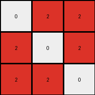

# ed36ccf7 • 023 • refine_dreamer

---


Previous Code:
```python
"""
The output grid is a 90 degree counter-clockwise rotation of the input grid.
Additionally, if a pixel in the rotated grid would have a value of 0, and the
pixel in the *original* grid at that location (pre-rotation) had a non-zero value,
then that pixel value is carried over to the rotated/output grid.  This is a
form of conditional overwrite based on comparing the "would-be" rotated value
to the original input value.
"""

import numpy as np

def transform(input_grid):
    """
    Rotates the input grid 90 degrees counter-clockwise, with a conditional overwrite.
    """
    # Convert the input list of lists to a NumPy array.
    input_np = np.array(input_grid)

    # Rotate the array 90 degrees counter-clockwise.
    output_np = np.rot90(input_np)

    # Create a "pre-rotated" version by rotating clockwise once. This allows us
    # to easily index into the original input using the *output* coordinates.
    pre_rotated_np = np.rot90(input_np, k=-1)

    # Iterate through the *output* grid and apply the conditional overwrite.
    rows, cols = output_np.shape
    for row in range(rows):
        for col in range(cols):
            if output_np[row, col] == 0 and pre_rotated_np[row, col] != 0:
                output_np[row, col] = pre_rotated_np[row, col]


    # Convert the NumPy array back to a list of lists.
    output_grid = output_np.tolist()

    return output_grid
```

Train Set Results:

## Example 1:

Input:
```
9 0 0
9 9 9
9 9 9
```
Expected Output:
```
0 9 9
0 9 9
9 9 9
```
Transformed Output:
```
9 9 9
9 9 9
9 9 9
```

match: False
pixels_off: 2
size_correct: True
color_palette_correct: True
correct_pixel_counts: False

## Example 2:

Input:
```
0 6 6
0 0 0
6 6 0
```
Expected Output:
```
6 0 0
6 0 6
6 0 6
```
Transformed Output:
```
6 0 0
6 0 6
0 0 6
```

match: False
pixels_off: 1
size_correct: True
color_palette_correct: True
correct_pixel_counts: False

## Example 3:

Input:
```
0 0 9
0 0 9
9 9 9
```
Expected Output:
```
9 9 9
0 0 9
0 0 9
```
Transformed Output:
```
9 9 9
9 0 9
9 9 9
```

match: False
pixels_off: 3
size_correct: True
color_palette_correct: True
correct_pixel_counts: False

## Example 4:

Input:
```
2 0 0
0 0 2
0 2 2
```
Expected Output:
```
2 2 2
0 0 2
2 0 0
```
Transformed Output:
```
0 2 2
2 0 2
2 2 0
```

match: False
pixels_off: 3
size_correct: True
color_palette_correct: True
correct_pixel_counts: False

**INSTRUCTIONS**

The code above was generated based on observations from the first training
example

we have tested the transform function on each of the task example inputs and
compared with the expected output

review each of the examples provided and the results and consider how the
natural language program should be updated to accommodate this new knowledge

respond with the following deliverables:

- general assessment of the information provided and strategy for resolving the
  errors
- gather metrics about each of the examples and results - use code_execution to
  develop accurate reports on your assumptions
- a YAML block documenting facts - Focus on identifying objects, their properties, and the actions performed on them.
- a natural language program - Be as clear and concise as possible, providing a complete description of the transformation rule.


your responses should be considered as information in a report - not a
conversation
