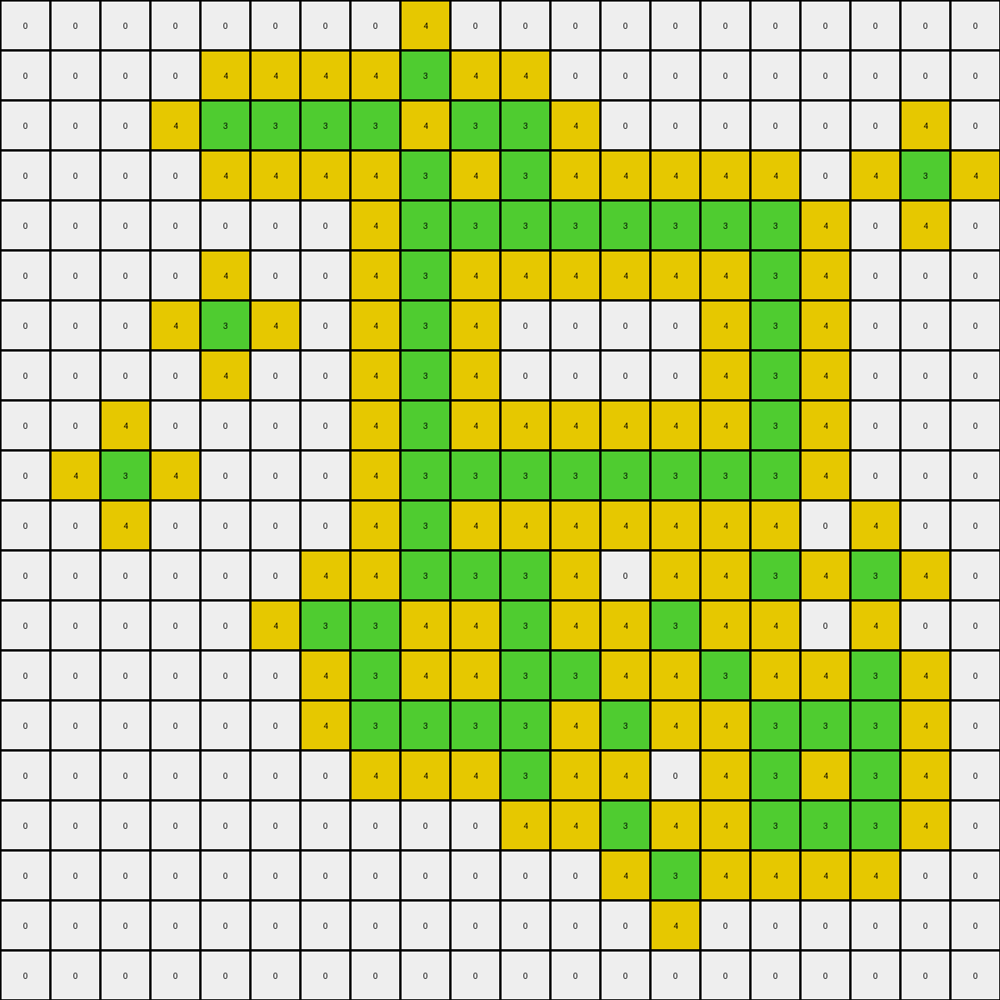

# 00d62c1b • 004 • refine_coder

---

Previous Code:
```python
"""
1.  **Identify** all green (3) pixels in the input grid.
2.  **Locate** all white (0) pixels that are directly adjacent (horizontally or vertically, but not diagonally) to any green pixel.
3.  **Change** the color of those located white pixels to yellow (4).
4.  **Keep** all the green and originally-non-adjacent white pixels.
5.  The output grid retains the same dimensions as the input grid.
"""

import numpy as np

def find_pixels_by_color(grid, color):
    # returns a list of (row, col) tuples for pixels matching the specified color
    return np.array(np.where(grid == color)).T.tolist()

def get_adjacent_pixels(grid, position):
    # returns a list of (row, col) tuples for pixels adjacent (horizontally or vertically) to a given position
    rows, cols = grid.shape
    row, col = position
    adjacent = []
    if row > 0:
        adjacent.append([row - 1, col])  # Up
    if row < rows - 1:
        adjacent.append([row + 1, col])  # Down
    if col > 0:
        adjacent.append([row, col - 1])  # Left
    if col < cols - 1:
        adjacent.append([row, col + 1])  # Right
    return adjacent

def transform(input_grid):
    # initialize output_grid as a copy of input_grid
    output_grid = np.copy(input_grid)
    
    # find all green pixels
    green_pixels = find_pixels_by_color(input_grid, 3)
    
    # find white pixels adjacent to green pixels and change their color to yellow
    for green_pixel in green_pixels:
        for adj_pixel in get_adjacent_pixels(input_grid, green_pixel):
            if input_grid[adj_pixel[0], adj_pixel[1]] == 0:
                output_grid[adj_pixel[0], adj_pixel[1]] = 4
                
    return output_grid
```

Train Set Results:

## Example 1:

Input:
```
0 0 0 0 0 0
0 0 3 0 0 0
0 3 0 3 0 0
0 0 3 0 3 0
0 0 0 3 0 0
0 0 0 0 0 0
```
Expected Output:
```
0 0 0 0 0 0
0 0 3 0 0 0
0 3 4 3 0 0
0 0 3 4 3 0
0 0 0 3 0 0
0 0 0 0 0 0
```
Transformed Output:
```
0 0 4 0 0 0
0 4 3 4 0 0
4 3 4 3 4 0
0 4 3 4 3 4
0 0 4 3 4 0
0 0 0 4 0 0
```

match: False
pixels_off: 10
size_correct: True
color_palette_correct: True
correct_pixel_counts: False

## Example 2:

Input:
```
0 0 0 0 0 0 0 0 0 0
0 0 3 0 3 0 0 0 0 0
0 0 0 3 0 3 0 0 0 0
0 0 3 0 0 0 3 0 0 0
0 0 0 0 0 3 0 3 0 0
0 0 0 3 0 3 3 0 0 0
0 0 3 3 3 0 0 0 0 0
0 0 0 3 0 0 0 0 0 0
0 0 0 0 0 0 0 0 0 0
0 0 0 0 0 0 0 0 0 0
```
Expected Output:
```
0 0 0 0 0 0 0 0 0 0
0 0 3 0 3 0 0 0 0 0
0 0 0 3 0 3 0 0 0 0
0 0 3 0 0 0 3 0 0 0
0 0 0 0 0 3 4 3 0 0
0 0 0 3 0 3 3 0 0 0
0 0 3 3 3 0 0 0 0 0
0 0 0 3 0 0 0 0 0 0
0 0 0 0 0 0 0 0 0 0
0 0 0 0 0 0 0 0 0 0
```
Transformed Output:
```
0 0 4 0 4 0 0 0 0 0
0 4 3 4 3 4 0 0 0 0
0 0 4 3 4 3 4 0 0 0
0 4 3 4 0 4 3 4 0 0
0 0 4 4 4 3 4 3 4 0
0 0 4 3 4 3 3 4 0 0
0 4 3 3 3 4 4 0 0 0
0 0 4 3 4 0 0 0 0 0
0 0 0 4 0 0 0 0 0 0
0 0 0 0 0 0 0 0 0 0
```

match: False
pixels_off: 25
size_correct: True
color_palette_correct: True
correct_pixel_counts: False

## Example 3:

Input:
```
0 0 0 0 0 3 0 0 0 0
0 0 0 0 3 0 0 0 0 0
0 3 3 0 3 3 0 3 0 0
3 0 0 3 0 0 3 0 3 0
0 0 0 3 0 0 3 3 0 0
0 0 0 3 0 0 3 0 0 0
0 0 0 3 0 0 3 0 0 0
0 0 0 0 3 3 0 3 0 0
0 0 0 0 0 0 0 0 3 0
0 0 0 0 0 0 0 0 0 0
```
Expected Output:
```
0 0 0 0 0 3 0 0 0 0
0 0 0 0 3 0 0 0 0 0
0 3 3 0 3 3 0 3 0 0
3 0 0 3 4 4 3 4 3 0
0 0 0 3 4 4 3 3 0 0
0 0 0 3 4 4 3 0 0 0
0 0 0 3 4 4 3 0 0 0
0 0 0 0 3 3 0 3 0 0
0 0 0 0 0 0 0 0 3 0
0 0 0 0 0 0 0 0 0 0
```
Transformed Output:
```
0 0 0 0 4 3 4 0 0 0
0 4 4 4 3 4 0 4 0 0
4 3 3 4 3 3 4 3 4 0
3 4 4 3 4 4 3 4 3 4
4 0 4 3 4 4 3 3 4 0
0 0 4 3 4 4 3 4 0 0
0 0 4 3 4 4 3 4 0 0
0 0 0 4 3 3 4 3 4 0
0 0 0 0 4 4 0 4 3 4
0 0 0 0 0 0 0 0 4 0
```

match: False
pixels_off: 29
size_correct: True
color_palette_correct: True
correct_pixel_counts: False

## Example 4:

Input:
```
0 0 0 0 0 0 0 0 0 0
0 0 3 3 3 3 0 0 0 0
0 0 3 0 0 3 0 0 0 0
0 0 3 0 0 3 0 3 0 0
0 0 3 3 3 3 3 3 3 0
0 0 0 3 0 0 0 0 3 0
0 0 0 3 0 0 0 3 3 0
0 0 0 3 3 0 0 3 0 3
0 0 0 3 0 3 0 0 3 0
0 0 0 0 3 0 0 0 0 0
```
Expected Output:
```
0 0 0 0 0 0 0 0 0 0
0 0 3 3 3 3 0 0 0 0
0 0 3 4 4 3 0 0 0 0
0 0 3 4 4 3 0 3 0 0
0 0 3 3 3 3 3 3 3 0
0 0 0 3 0 0 0 0 3 0
0 0 0 3 0 0 0 3 3 0
0 0 0 3 3 0 0 3 4 3
0 0 0 3 4 3 0 0 3 0
0 0 0 0 3 0 0 0 0 0
```
Transformed Output:
```
0 0 4 4 4 4 0 0 0 0
0 4 3 3 3 3 4 0 0 0
0 4 3 4 4 3 4 4 0 0
0 4 3 4 4 3 4 3 4 0
0 4 3 3 3 3 3 3 3 4
0 0 4 3 4 4 4 4 3 4
0 0 4 3 4 0 4 3 3 4
0 0 4 3 3 4 4 3 4 3
0 0 4 3 4 3 4 4 3 4
0 0 0 4 3 4 0 0 4 0
```

match: False
pixels_off: 34
size_correct: True
color_palette_correct: True
correct_pixel_counts: False

## Example 5:

Input:
```
0 0 0 0 0 0 0 0 0 0 0 0 0 0 0 0 0 0 0 0
0 0 0 0 0 0 0 0 3 0 0 0 0 0 0 0 0 0 0 0
0 0 0 0 3 3 3 3 0 3 3 0 0 0 0 0 0 0 0 0
0 0 0 0 0 0 0 0 3 0 3 0 0 0 0 0 0 0 3 0
0 0 0 0 0 0 0 0 3 3 3 3 3 3 3 3 0 0 0 0
0 0 0 0 0 0 0 0 3 0 0 0 0 0 0 3 0 0 0 0
0 0 0 0 3 0 0 0 3 0 0 0 0 0 0 3 0 0 0 0
0 0 0 0 0 0 0 0 3 0 0 0 0 0 0 3 0 0 0 0
0 0 0 0 0 0 0 0 3 0 0 0 0 0 0 3 0 0 0 0
0 0 3 0 0 0 0 0 3 3 3 3 3 3 3 3 0 0 0 0
0 0 0 0 0 0 0 0 3 0 0 0 0 0 0 0 0 0 0 0
0 0 0 0 0 0 0 0 3 3 3 0 0 0 0 3 0 3 0 0
0 0 0 0 0 0 3 3 0 0 3 0 0 3 0 0 0 0 0 0
0 0 0 0 0 0 0 3 0 0 3 3 0 0 3 0 0 3 0 0
0 0 0 0 0 0 0 3 3 3 3 0 3 0 0 3 3 3 0 0
0 0 0 0 0 0 0 0 0 0 3 0 0 0 0 3 0 3 0 0
0 0 0 0 0 0 0 0 0 0 0 0 3 0 0 3 3 3 0 0
0 0 0 0 0 0 0 0 0 0 0 0 0 3 0 0 0 0 0 0
0 0 0 0 0 0 0 0 0 0 0 0 0 0 0 0 0 0 0 0
0 0 0 0 0 0 0 0 0 0 0 0 0 0 0 0 0 0 0 0
```
Expected Output:
```
0 0 0 0 0 0 0 0 0 0 0 0 0 0 0 0 0 0 0 0
0 0 0 0 0 0 0 0 3 0 0 0 0 0 0 0 0 0 0 0
0 0 0 0 3 3 3 3 4 3 3 0 0 0 0 0 0 0 0 0
0 0 0 0 0 0 0 0 3 4 3 0 0 0 0 0 0 0 3 0
0 0 0 0 0 0 0 0 3 3 3 3 3 3 3 3 0 0 0 0
0 0 0 0 0 0 0 0 3 4 4 4 4 4 4 3 0 0 0 0
0 0 0 0 3 0 0 0 3 4 4 4 4 4 4 3 0 0 0 0
0 0 0 0 0 0 0 0 3 4 4 4 4 4 4 3 0 0 0 0
0 0 0 0 0 0 0 0 3 4 4 4 4 4 4 3 0 0 0 0
0 0 3 0 0 0 0 0 3 3 3 3 3 3 3 3 0 0 0 0
0 0 0 0 0 0 0 0 3 0 0 0 0 0 0 0 0 0 0 0
0 0 0 0 0 0 0 0 3 3 3 0 0 0 0 3 0 3 0 0
0 0 0 0 0 0 3 3 4 4 3 0 0 3 0 0 0 0 0 0
0 0 0 0 0 0 0 3 4 4 3 3 0 0 3 0 0 3 0 0
0 0 0 0 0 0 0 3 3 3 3 0 3 0 0 3 3 3 0 0
0 0 0 0 0 0 0 0 0 0 3 0 0 0 0 3 4 3 0 0
0 0 0 0 0 0 0 0 0 0 0 0 3 0 0 3 3 3 0 0
0 0 0 0 0 0 0 0 0 0 0 0 0 3 0 0 0 0 0 0
0 0 0 0 0 0 0 0 0 0 0 0 0 0 0 0 0 0 0 0
0 0 0 0 0 0 0 0 0 0 0 0 0 0 0 0 0 0 0 0
```
Transformed Output:
```
0 0 0 0 0 0 0 0 4 0 0 0 0 0 0 0 0 0 0 0
0 0 0 0 4 4 4 4 3 4 4 0 0 0 0 0 0 0 0 0
0 0 0 4 3 3 3 3 4 3 3 4 0 0 0 0 0 0 4 0
0 0 0 0 4 4 4 4 3 4 3 4 4 4 4 4 0 4 3 4
0 0 0 0 0 0 0 4 3 3 3 3 3 3 3 3 4 0 4 0
0 0 0 0 4 0 0 4 3 4 4 4 4 4 4 3 4 0 0 0
0 0 0 4 3 4 0 4 3 4 0 0 0 0 4 3 4 0 0 0
0 0 0 0 4 0 0 4 3 4 0 0 0 0 4 3 4 0 0 0
0 0 4 0 0 0 0 4 3 4 4 4 4 4 4 3 4 0 0 0
0 4 3 4 0 0 0 4 3 3 3 3 3 3 3 3 4 0 0 0
0 0 4 0 0 0 0 4 3 4 4 4 4 4 4 4 0 4 0 0
0 0 0 0 0 0 4 4 3 3 3 4 0 4 4 3 4 3 4 0
0 0 0 0 0 4 3 3 4 4 3 4 4 3 4 4 0 4 0 0
0 0 0 0 0 0 4 3 4 4 3 3 4 4 3 4 4 3 4 0
0 0 0 0 0 0 4 3 3 3 3 4 3 4 4 3 3 3 4 0
0 0 0 0 0 0 0 4 4 4 3 4 4 0 4 3 4 3 4 0
0 0 0 0 0 0 0 0 0 0 4 4 3 4 4 3 3 3 4 0
0 0 0 0 0 0 0 0 0 0 0 0 4 3 4 4 4 4 0 0
0 0 0 0 0 0 0 0 0 0 0 0 0 4 0 0 0 0 0 0
0 0 0 0 0 0 0 0 0 0 0 0 0 0 0 0 0 0 0 0
```

match: False
pixels_off: 101
size_correct: True
color_palette_correct: True
correct_pixel_counts: False
Okay, let's analyze the results of the provided code and develop a refined natural language program and strategy.

**General Assessment:**

The initial code correctly identifies green pixels and attempts to change adjacent white pixels to yellow. However, the results clearly show that the code's definition of "adjacent" is too broad. It's changing *all* neighboring white pixels to yellow, including those diagonally adjacent, which is incorrect according to the expected outputs. The code propagates the yellow color outwards from the green much further than it should.

**Strategy:**

The core issue is the `get_adjacent_pixels` function. It needs to be modified to strictly adhere to horizontal and vertical adjacency, excluding diagonals. We need to make this change in our definition of "adjacent", then update the natural language program.

**Metrics and Observations (per example):**

Here I assess each example and determine important information for debugging.

*   **Example 1:**
    *   **Observation:** Yellow extends diagonally. The central vertical and horizontal lines of white are correctly turned yellow.
    *   **Metrics:** 10 pixels differ.

*   **Example 2:**
    *   **Observation:** Similar to example 1, the yellow color propagates diagonally and also extends beyond the single adjacent layer.
    *    **Metrics:** 25 pixels differ.

*   **Example 3:**
    *   **Observation:** The yellow extends beyond the expected boundary again and combines with other yellow regions.
    *    **Metrics:** 29 pixels differ

*   **Example 4:**
    *    **Observation:** The effect is more pronounced, creating large connected components of yellow.
    *    **Metrics:** 34 pixels differ

*   **Example 5:**
    *    **Observation:** This largest example makes it most obvious, yellow is propagating out on all edges.
    *    **Metrics:** 101 pixels differ.

**YAML Fact Identification:**

```yaml
facts:
  - object: green_pixel
    color: green (3)
    description: The starting point for the transformation.
    action: Initiates adjacency check.

  - object: white_pixel
    color: white (0)
    description:  Potentially transformed if adjacent to a green pixel.
    action: Changes color to yellow if directly adjacent to green.

  - object: adjacent_pixel
    color: varies
    description: A pixel directly above, below, to the left, or to the right of another pixel. *Crucially, NOT diagonally adjacent.*
    action: Determines which white pixels are transformed.

  - object: other_pixel
    color: varies
    description: any pixel that is not green or is not adjacent to green.
    action: No action taken

  - transformation: color_change
    input: white_pixel
    output: yellow_pixel
    condition:  white_pixel is directly adjacent (horizontally or vertically) to a green_pixel.

  - grid_property: dimensions
    description: The height and width of the grid remain constant.
    action: Input and output grids have identical dimensions.
```

**Revised Natural Language Program:**

1.  **Identify** all green (3) pixels in the input grid.

2.  **Locate** all white (0) pixels that are directly adjacent (horizontally or vertically, *but not diagonally*) to any green pixel.

3.  **Change** the color of *only those* located white pixels to yellow (4).

4.  **Keep** all other pixels (green, and originally-non-adjacent white pixels, and any other colored pixels) unchanged.

5.  The output grid retains the same dimensions as the input grid.

**INSTRUCTIONS**

- generate a Python module to represent the natural language program 
- follow the template below
- all common math and science libraries are available
- create docstring only at top - but comment the workflow in the function
- use helper functions for common operations like finding objects, counting,
  measuring, moving, etc. 

remember - we are working iteratively - so this code will inform your future
self as we converge on the solution

*template:*

```python
"""
{{ natural language description of the transformation rule }}
"""

{{ imports }}

def transform(input_grid):
    # initialize output_grid

    # change output pixels 

    return output_grid

```
