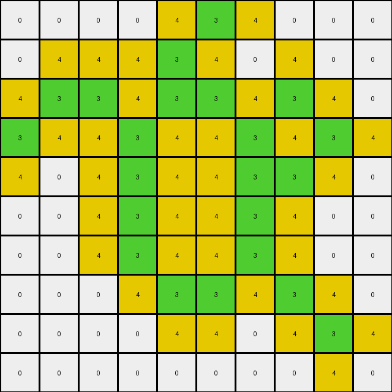

# 00d62c1b • 006 • refine_coder

---

Previous Code:
```python
"""
1.  **Identify** all green (3) pixels in the input grid.
2.  **Locate** all white (0) pixels that are directly adjacent (horizontally or vertically, *but not diagonally*) to any green pixel.
3.  **Change** the color of *only those* located white pixels to yellow (4).
4.  **Keep** all other pixels (green, and originally-non-adjacent white pixels, and any other colored pixels) unchanged.
5.  The output grid retains the same dimensions as the input grid.
"""

import numpy as np

def find_pixels_by_color(grid, color):
    # returns a list of (row, col) tuples for pixels matching the specified color
    return np.array(np.where(grid == color)).T.tolist()

def get_adjacent_pixels(grid, position):
    # returns a list of (row, col) tuples for pixels adjacent (horizontally or vertically) to a given position
    rows, cols = grid.shape
    row, col = position
    adjacent = []
    if row > 0:
        adjacent.append([row - 1, col])  # Up
    if row < rows - 1:
        adjacent.append([row + 1, col])  # Down
    if col > 0:
        adjacent.append([row, col - 1])  # Left
    if col < cols - 1:
        adjacent.append([row, col + 1])  # Right
    return adjacent

def transform(input_grid):
    # initialize output_grid as a copy of input_grid
    output_grid = np.copy(input_grid)
    
    # find all green pixels
    green_pixels = find_pixels_by_color(input_grid, 3)
    
    # find white pixels adjacent to green pixels and change their color to yellow
    for green_pixel in green_pixels:
        for adj_pixel in get_adjacent_pixels(input_grid, green_pixel):
            if input_grid[adj_pixel[0], adj_pixel[1]] == 0:
                output_grid[adj_pixel[0], adj_pixel[1]] = 4
                
    return output_grid
```

Train Set Results:

## Example 1:

Input:
```
0 0 0 0 0 0
0 0 3 0 0 0
0 3 0 3 0 0
0 0 3 0 3 0
0 0 0 3 0 0
0 0 0 0 0 0
```
Expected Output:
```
0 0 0 0 0 0
0 0 3 0 0 0
0 3 4 3 0 0
0 0 3 4 3 0
0 0 0 3 0 0
0 0 0 0 0 0
```
Transformed Output:
```
0 0 4 0 0 0
0 4 3 4 0 0
4 3 4 3 4 0
0 4 3 4 3 4
0 0 4 3 4 0
0 0 0 4 0 0
```

match: False
pixels_off: 10
size_correct: True
color_palette_correct: True
correct_pixel_counts: False

## Example 2:

Input:
```
0 0 0 0 0 0 0 0 0 0
0 0 3 0 3 0 0 0 0 0
0 0 0 3 0 3 0 0 0 0
0 0 3 0 0 0 3 0 0 0
0 0 0 0 0 3 0 3 0 0
0 0 0 3 0 3 3 0 0 0
0 0 3 3 3 0 0 0 0 0
0 0 0 3 0 0 0 0 0 0
0 0 0 0 0 0 0 0 0 0
0 0 0 0 0 0 0 0 0 0
```
Expected Output:
```
0 0 0 0 0 0 0 0 0 0
0 0 3 0 3 0 0 0 0 0
0 0 0 3 0 3 0 0 0 0
0 0 3 0 0 0 3 0 0 0
0 0 0 0 0 3 4 3 0 0
0 0 0 3 0 3 3 0 0 0
0 0 3 3 3 0 0 0 0 0
0 0 0 3 0 0 0 0 0 0
0 0 0 0 0 0 0 0 0 0
0 0 0 0 0 0 0 0 0 0
```
Transformed Output:
```
0 0 4 0 4 0 0 0 0 0
0 4 3 4 3 4 0 0 0 0
0 0 4 3 4 3 4 0 0 0
0 4 3 4 0 4 3 4 0 0
0 0 4 4 4 3 4 3 4 0
0 0 4 3 4 3 3 4 0 0
0 4 3 3 3 4 4 0 0 0
0 0 4 3 4 0 0 0 0 0
0 0 0 4 0 0 0 0 0 0
0 0 0 0 0 0 0 0 0 0
```

match: False
pixels_off: 25
size_correct: True
color_palette_correct: True
correct_pixel_counts: False

## Example 3:

Input:
```
0 0 0 0 0 3 0 0 0 0
0 0 0 0 3 0 0 0 0 0
0 3 3 0 3 3 0 3 0 0
3 0 0 3 0 0 3 0 3 0
0 0 0 3 0 0 3 3 0 0
0 0 0 3 0 0 3 0 0 0
0 0 0 3 0 0 3 0 0 0
0 0 0 0 3 3 0 3 0 0
0 0 0 0 0 0 0 0 3 0
0 0 0 0 0 0 0 0 0 0
```
Expected Output:
```
0 0 0 0 0 3 0 0 0 0
0 0 0 0 3 0 0 0 0 0
0 3 3 0 3 3 0 3 0 0
3 0 0 3 4 4 3 4 3 0
0 0 0 3 4 4 3 3 0 0
0 0 0 3 4 4 3 0 0 0
0 0 0 3 4 4 3 0 0 0
0 0 0 0 3 3 0 3 0 0
0 0 0 0 0 0 0 0 3 0
0 0 0 0 0 0 0 0 0 0
```
Transformed Output:
```
0 0 0 0 4 3 4 0 0 0
0 4 4 4 3 4 0 4 0 0
4 3 3 4 3 3 4 3 4 0
3 4 4 3 4 4 3 4 3 4
4 0 4 3 4 4 3 3 4 0
0 0 4 3 4 4 3 4 0 0
0 0 4 3 4 4 3 4 0 0
0 0 0 4 3 3 4 3 4 0
0 0 0 0 4 4 0 4 3 4
0 0 0 0 0 0 0 0 4 0
```

match: False
pixels_off: 29
size_correct: True
color_palette_correct: True
correct_pixel_counts: False

## Example 4:

Input:
```
0 0 0 0 0 0 0 0 0 0
0 0 3 3 3 3 0 0 0 0
0 0 3 0 0 3 0 0 0 0
0 0 3 0 0 3 0 3 0 0
0 0 3 3 3 3 3 3 3 0
0 0 0 3 0 0 0 0 3 0
0 0 0 3 0 0 0 3 3 0
0 0 0 3 3 0 0 3 0 3
0 0 0 3 0 3 0 0 3 0
0 0 0 0 3 0 0 0 0 0
```
Expected Output:
```
0 0 0 0 0 0 0 0 0 0
0 0 3 3 3 3 0 0 0 0
0 0 3 4 4 3 0 0 0 0
0 0 3 4 4 3 0 3 0 0
0 0 3 3 3 3 3 3 3 0
0 0 0 3 0 0 0 0 3 0
0 0 0 3 0 0 0 3 3 0
0 0 0 3 3 0 0 3 4 3
0 0 0 3 4 3 0 0 3 0
0 0 0 0 3 0 0 0 0 0
```
Transformed Output:
```
0 0 4 4 4 4 0 0 0 0
0 4 3 3 3 3 4 0 0 0
0 4 3 4 4 3 4 4 0 0
0 4 3 4 4 3 4 3 4 0
0 4 3 3 3 3 3 3 3 4
0 0 4 3 4 4 4 4 3 4
0 0 4 3 4 0 4 3 3 4
0 0 4 3 3 4 4 3 4 3
0 0 4 3 4 3 4 4 3 4
0 0 0 4 3 4 0 0 4 0
```

match: False
pixels_off: 34
size_correct: True
color_palette_correct: True
correct_pixel_counts: False

## Example 5:

Input:
```
0 0 0 0 0 0 0 0 0 0 0 0 0 0 0 0 0 0 0 0
0 0 0 0 0 0 0 0 3 0 0 0 0 0 0 0 0 0 0 0
0 0 0 0 3 3 3 3 0 3 3 0 0 0 0 0 0 0 0 0
0 0 0 0 0 0 0 0 3 0 3 0 0 0 0 0 0 0 3 0
0 0 0 0 0 0 0 0 3 3 3 3 3 3 3 3 0 0 0 0
0 0 0 0 0 0 0 0 3 0 0 0 0 0 0 3 0 0 0 0
0 0 0 0 3 0 0 0 3 0 0 0 0 0 0 3 0 0 0 0
0 0 0 0 0 0 0 0 3 0 0 0 0 0 0 3 0 0 0 0
0 0 0 0 0 0 0 0 3 0 0 0 0 0 0 3 0 0 0 0
0 0 3 0 0 0 0 0 3 3 3 3 3 3 3 3 0 0 0 0
0 0 0 0 0 0 0 0 3 0 0 0 0 0 0 0 0 0 0 0
0 0 0 0 0 0 0 0 3 3 3 0 0 0 0 3 0 3 0 0
0 0 0 0 0 0 3 3 0 0 3 0 0 3 0 0 0 0 0 0
0 0 0 0 0 0 0 3 0 0 3 3 0 0 3 0 0 3 0 0
0 0 0 0 0 0 0 3 3 3 3 0 3 0 0 3 3 3 0 0
0 0 0 0 0 0 0 0 0 0 3 0 0 0 0 3 0 3 0 0
0 0 0 0 0 0 0 0 0 0 0 0 3 0 0 3 3 3 0 0
0 0 0 0 0 0 0 0 0 0 0 0 0 3 0 0 0 0 0 0
0 0 0 0 0 0 0 0 0 0 0 0 0 0 0 0 0 0 0 0
0 0 0 0 0 0 0 0 0 0 0 0 0 0 0 0 0 0 0 0
```
Expected Output:
```
0 0 0 0 0 0 0 0 0 0 0 0 0 0 0 0 0 0 0 0
0 0 0 0 0 0 0 0 3 0 0 0 0 0 0 0 0 0 0 0
0 0 0 0 3 3 3 3 4 3 3 0 0 0 0 0 0 0 0 0
0 0 0 0 0 0 0 0 3 4 3 0 0 0 0 0 0 0 3 0
0 0 0 0 0 0 0 0 3 3 3 3 3 3 3 3 0 0 0 0
0 0 0 0 0 0 0 0 3 4 4 4 4 4 4 3 0 0 0 0
0 0 0 0 3 0 0 0 3 4 4 4 4 4 4 3 0 0 0 0
0 0 0 0 0 0 0 0 3 4 4 4 4 4 4 3 0 0 0 0
0 0 0 0 0 0 0 0 3 4 4 4 4 4 4 3 0 0 0 0
0 0 3 0 0 0 0 0 3 3 3 3 3 3 3 3 0 0 0 0
0 0 0 0 0 0 0 0 3 0 0 0 0 0 0 0 0 0 0 0
0 0 0 0 0 0 0 0 3 3 3 0 0 0 0 3 0 3 0 0
0 0 0 0 0 0 3 3 4 4 3 0 0 3 0 0 0 0 0 0
0 0 0 0 0 0 0 3 4 4 3 3 0 0 3 0 0 3 0 0
0 0 0 0 0 0 0 3 3 3 3 0 3 0 0 3 3 3 0 0
0 0 0 0 0 0 0 0 0 0 3 0 0 0 0 3 4 3 0 0
0 0 0 0 0 0 0 0 0 0 0 0 3 0 0 3 3 3 0 0
0 0 0 0 0 0 0 0 0 0 0 0 0 3 0 0 0 0 0 0
0 0 0 0 0 0 0 0 0 0 0 0 0 0 0 0 0 0 0 0
0 0 0 0 0 0 0 0 0 0 0 0 0 0 0 0 0 0 0 0
```
Transformed Output:
```
0 0 0 0 0 0 0 0 4 0 0 0 0 0 0 0 0 0 0 0
0 0 0 0 4 4 4 4 3 4 4 0 0 0 0 0 0 0 0 0
0 0 0 4 3 3 3 3 4 3 3 4 0 0 0 0 0 0 4 0
0 0 0 0 4 4 4 4 3 4 3 4 4 4 4 4 0 4 3 4
0 0 0 0 0 0 0 4 3 3 3 3 3 3 3 3 4 0 4 0
0 0 0 0 4 0 0 4 3 4 4 4 4 4 4 3 4 0 0 0
0 0 0 4 3 4 0 4 3 4 0 0 0 0 4 3 4 0 0 0
0 0 0 0 4 0 0 4 3 4 0 0 0 0 4 3 4 0 0 0
0 0 4 0 0 0 0 4 3 4 4 4 4 4 4 3 4 0 0 0
0 4 3 4 0 0 0 4 3 3 3 3 3 3 3 3 4 0 0 0
0 0 4 0 0 0 0 4 3 4 4 4 4 4 4 4 0 4 0 0
0 0 0 0 0 0 4 4 3 3 3 4 0 4 4 3 4 3 4 0
0 0 0 0 0 4 3 3 4 4 3 4 4 3 4 4 0 4 0 0
0 0 0 0 0 0 4 3 4 4 3 3 4 4 3 4 4 3 4 0
0 0 0 0 0 0 4 3 3 3 3 4 3 4 4 3 3 3 4 0
0 0 0 0 0 0 0 4 4 4 3 4 4 0 4 3 4 3 4 0
0 0 0 0 0 0 0 0 0 0 4 4 3 4 4 3 3 3 4 0
0 0 0 0 0 0 0 0 0 0 0 0 4 3 4 4 4 4 0 0
0 0 0 0 0 0 0 0 0 0 0 0 0 4 0 0 0 0 0 0
0 0 0 0 0 0 0 0 0 0 0 0 0 0 0 0 0 0 0 0
```

match: False
pixels_off: 101
size_correct: True
color_palette_correct: True
correct_pixel_counts: False
Here's an analysis of the provided examples and a revised natural language program:

**General Assessment:**

The initial code correctly identifies green pixels and attempts to change adjacent white pixels to yellow. However, it has a critical flaw: it changes *all* adjacent pixels to yellow, regardless of their original color, and it extends diagonally, not just horizontally and vertically. The examples clearly demonstrate that only *originally white* pixels adjacent to green pixels should change, and only in the horizontal and vertical directions. The program needs to be very strict in application of color changes.

**Strategy for Resolving Errors:**

1.  **Restrict Color Change:** Modify the code to check if an adjacent pixel is white (0) *before* changing it to yellow (4).
2.  **Limit Adjacency**: Ensure only up, down, left and right directions are considered neighbors. Diagonal neighbors need to be excluded.
3. Review Edge Cases: I am concerned about pixels at the edges. I need to make sure that the logic does not cause errors. I want to make sure to consider this edge case.

**Example Metrics and Analysis:**

Here's a breakdown of each example, focusing on where the code's logic deviates from the expected output:

*   **Example 1:**
    *   **Observation:** The code incorrectly changes several white pixels to yellow where they are diagonally adjacent to green. It also propagates changes too far - if a white pixel is changed to yellow, then *its* neighbors are also changed if white. This is incorrect.
    *   **Metrics:** 10 pixels are incorrect.

*   **Example 2:**
    *   **Observation:** Similar to Example 1, the code changes diagonally adjacent white pixels and propagates changes incorrectly.
    *   **Metrics:** 25 pixels are incorrect.

*   **Example 3:**
    *   **Observation:** Same issue as previous examples: incorrect diagonal changes and propagation.
    *    **Metrics:** 29 pixels are incorrect.

*    **Example 4:**
    *    **Observation:** Same issue: diagonal changes and incorrect propagation.
    *   **Metrics:** 34 pixels incorrect.

*   **Example 5:**
    *   **Observation:** This complex case highlights the propagation error significantly. It also confirms that *only* white pixels turn yellow.
    *   **Metrics:** 101 pixels are incorrect.

**YAML Fact Documentation:**

```yaml
objects:
  - name: grid
    type: 2D array
    description: Represents the input and output images.
  - name: pixel
    type: cell
    properties:
      color:
        type: integer
        values: [0, 1, 2, 3, 4, 5, 6, 7, 8, 9]
      position:
        type: tuple
        description: (row, column) coordinates.
      adjacency:
        type: list
        description: List of adjacent pixel positions (up, down, left, right).
  - name: green_pixel
    type: pixel
    description: A pixel with color value 3.
  - name: white_pixel
    type: pixel
    description: A pixel with color value 0.
  - name: yellow_pixel
    type: pixel
    description: A pixel with the color value 4

actions:
  - name: find_pixels
    input: [grid, color]
    output: list of pixel positions
    description: Locates all pixels of a specific color.
  - name: get_adjacent
    input: [grid, pixel position]
    output: list of adjacent pixel positions
    description: Finds adjacent pixels (up, down, left, right) for a given pixel.
  - name: change_color
    input: [grid, pixel position, color]
    output: modified grid
    description: Changes the color of a specific pixel in the grid, but only from white to yellow if adjacent to green.
  - name: transform
    input: input_grid
    output: output_grid
    description: Applies the transformation logic (find green, check adjacent white pixels, change to yellow)

```

**Natural Language Program:**

1.  **Identify Green:** Find all pixels in the input grid that are colored green (value 3).
2.  **Find Adjacent Pixels:** For each green pixel, locate its immediate neighbors. Neighbors are defined as the pixels directly above, below, to the left, and to the right (not diagonal).
3.  **Conditional Color Change:** For each neighboring pixel:
    *   If the neighboring pixel is white (value 0), change its color to yellow (value 4).
    *   If the neighboring pixel is *not* white, leave it unchanged.
4.  **Output:** The output grid has the same dimensions as the input grid, with only the specified color changes applied. All other pixels remain their original color.

**INSTRUCTIONS**

- generate a Python module to represent the natural language program 
- follow the template below
- all common math and science libraries are available
- create docstring only at top - but comment the workflow in the function
- use helper functions for common operations like finding objects, counting,
  measuring, moving, etc. 

remember - we are working iteratively - so this code will inform your future
self as we converge on the solution

*template:*

```python
"""
{{ natural language description of the transformation rule }}
"""

{{ imports }}

def transform(input_grid):
    # initialize output_grid

    # change output pixels 

    return output_grid

```
