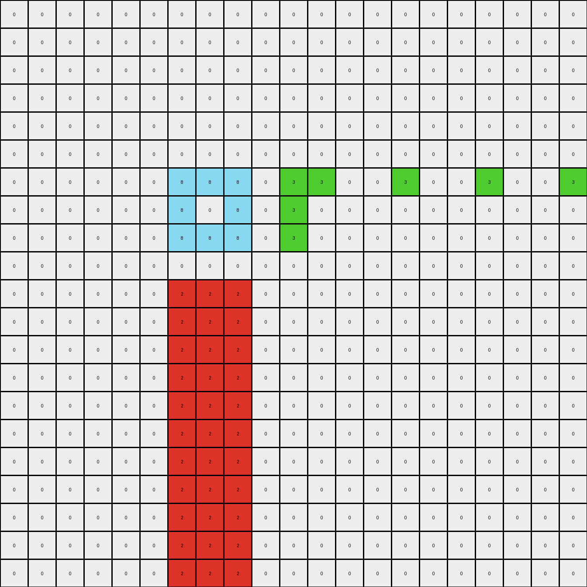
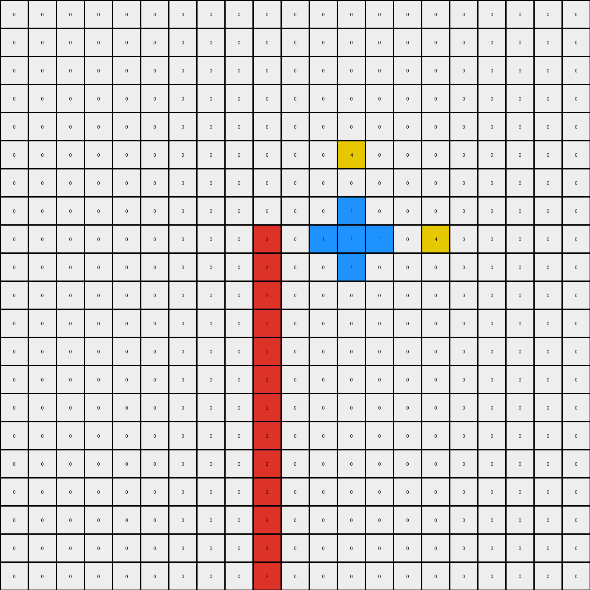

# 045e512c • 005 • refine_dreamer

---


Previous Code:
```python
"""
1.  **Identify Objects:** Find all distinct objects in the input grid. An object
    is a contiguous block of pixels of the same color. Objects of the same color
    are still distinct if not directly touching.
2. **Azure Rectangle:** If an azure rectangle exists, it remains unchanged.
3.  **Green Pixel:** For each green pixel, replicate it horizontally to the
    right edge of the grid. The replication should alternate between placing a
    green pixel and leaving a blank space (color 0).
4.  **Red Rectangle:** For each red rectangle, replicate it vertically
    downwards. The replication should alternate between the full rectangle and a
    "hollow" version of the rectangle. The hollow version has the same bounding
    box as the original but with the center pixel(s) removed (color 0).
5.  **Yellow and Blue:** Consider more complex shapes of yellow and blue. Replicate in patterns including horizontal, vertical and diagonal
6. **Magenta Objects:** Combine and replicate to a diagonal pattern.
"""

import numpy as np
from collections import deque

def find_objects(grid):
    """
    Finds all distinct objects in the grid.
    Returns a dictionary of objects keyed by color,
    where each object is a list of (row, col) coordinates.
    """
    objects = {}
    visited = set()
    rows, cols = grid.shape

    def bfs(start_row, start_col, color):
        obj = []
        queue = deque([(start_row, start_col)])
        visited.add((start_row, start_col))

        while queue:
            row, col = queue.popleft()
            obj.append((row, col))

            for dr, dc in [(0, 1), (1, 0), (0, -1), (-1, 0)]:
                new_row, new_col = row + dr, col + dc
                if 0 <= new_row < rows and 0 <= new_col < cols and \
                   grid[new_row, new_col] == color and (new_row, new_col) not in visited:
                    queue.append((new_row, new_col))
                    visited.add((new_row, new_col))
        return obj

    for row in range(rows):
        for col in range(cols):
            color = grid[row, col]
            if color != 0 and (row, col) not in visited:
                obj = bfs(row, col, color)
                if color not in objects:
                    objects[color] = []
                objects[color].append(obj)
    return objects

def get_object_bounds(obj):
  rows = [r for r, c in obj]
  cols = [c for r, c in obj]
  return min(rows), min(cols), max(rows), max(cols)

def replicate_green_horizontal_alternate(grid, green_objects):
    output_grid = np.copy(grid)
    for obj in green_objects:
      #since it is a pixel, use the first
      r, c = obj[0]
      current_col = c + 1

      while current_col < output_grid.shape[1]:
        output_grid[r,current_col] = 3
        current_col += 2
        if current_col < output_grid.shape[1]:
          output_grid[r,current_col] = 0
          current_col += 1

    return output_grid

def replicate_red_vertical_alternate_hollow(grid, red_objects):
    output_grid = np.copy(grid)
    for obj in red_objects:
        min_row, min_col, max_row, max_col = get_object_bounds(obj)
        height = max_row - min_row + 1
        width = max_col - min_col + 1
        row_cursor = max_row + 1

        while row_cursor + height <= output_grid.shape[0]:
            # Full rectangle
            for r in range(min_row, min_row + height):
                for c in range(min_col, min_col + width):
                    output_grid[row_cursor + (r - min_row), c] = 2

            row_cursor += height
            if row_cursor + height > output_grid.shape[0]:
                break

            # Hollow rectangle
            for r in range(min_row, min_row + height):
                for c in range(min_col, min_col + width):
                    curr_r = row_cursor + (r-min_row)
                    curr_c = c
                    if (height > 2 and width > 2 and  # Make sure it has center to remove
                        r > min_row and r < max_row and
                        c > min_col and c < max_col):
                      output_grid[curr_r,curr_c] = 0

                    else:
                        output_grid[curr_r, curr_c] = 2


            row_cursor += height
    return output_grid


def transform(input_grid):
    # initialize output_grid
    output_grid = np.copy(input_grid)
    objects = find_objects(input_grid)

    # Azure Rectangle - do nothing
    # Green Pixel
    if 3 in objects:
        output_grid = replicate_green_horizontal_alternate(output_grid, objects[3])
    # Red Rectangle
    if 2 in objects:
        output_grid = replicate_red_vertical_alternate_hollow(output_grid, objects[2])
    # Yellow and Blue

    # Magenta

    return output_grid
```

Train Set Results:

## Example 1:

Input:
```
0 0 0 0 0 0 0 0 0 0 0 0 0 0 0 0 0 0 0 0 0
0 0 0 0 0 0 0 0 0 0 0 0 0 0 0 0 0 0 0 0 0
0 0 0 0 0 0 0 0 0 0 0 0 0 0 0 0 0 0 0 0 0
0 0 0 0 0 0 0 0 0 0 0 0 0 0 0 0 0 0 0 0 0
0 0 0 0 0 0 0 0 0 0 0 0 0 0 0 0 0 0 0 0 0
0 0 0 0 0 0 0 0 0 0 0 0 0 0 0 0 0 0 0 0 0
0 0 0 0 0 0 8 8 8 0 3 0 0 0 0 0 0 0 0 0 0
0 0 0 0 0 0 8 0 8 0 3 0 0 0 0 0 0 0 0 0 0
0 0 0 0 0 0 8 8 8 0 3 0 0 0 0 0 0 0 0 0 0
0 0 0 0 0 0 0 0 0 0 0 0 0 0 0 0 0 0 0 0 0
0 0 0 0 0 0 2 2 2 0 0 0 0 0 0 0 0 0 0 0 0
0 0 0 0 0 0 0 0 0 0 0 0 0 0 0 0 0 0 0 0 0
0 0 0 0 0 0 0 0 0 0 0 0 0 0 0 0 0 0 0 0 0
0 0 0 0 0 0 0 0 0 0 0 0 0 0 0 0 0 0 0 0 0
0 0 0 0 0 0 0 0 0 0 0 0 0 0 0 0 0 0 0 0 0
0 0 0 0 0 0 0 0 0 0 0 0 0 0 0 0 0 0 0 0 0
0 0 0 0 0 0 0 0 0 0 0 0 0 0 0 0 0 0 0 0 0
0 0 0 0 0 0 0 0 0 0 0 0 0 0 0 0 0 0 0 0 0
0 0 0 0 0 0 0 0 0 0 0 0 0 0 0 0 0 0 0 0 0
0 0 0 0 0 0 0 0 0 0 0 0 0 0 0 0 0 0 0 0 0
0 0 0 0 0 0 0 0 0 0 0 0 0 0 0 0 0 0 0 0 0
```
Expected Output:
```
0 0 0 0 0 0 0 0 0 0 0 0 0 0 0 0 0 0 0 0 0
0 0 0 0 0 0 0 0 0 0 0 0 0 0 0 0 0 0 0 0 0
0 0 0 0 0 0 0 0 0 0 0 0 0 0 0 0 0 0 0 0 0
0 0 0 0 0 0 0 0 0 0 0 0 0 0 0 0 0 0 0 0 0
0 0 0 0 0 0 0 0 0 0 0 0 0 0 0 0 0 0 0 0 0
0 0 0 0 0 0 0 0 0 0 0 0 0 0 0 0 0 0 0 0 0
0 0 0 0 0 0 8 8 8 0 3 3 3 0 3 3 3 0 3 3 3
0 0 0 0 0 0 8 0 8 0 3 0 3 0 3 0 3 0 3 0 3
0 0 0 0 0 0 8 8 8 0 3 3 3 0 3 3 3 0 3 3 3
0 0 0 0 0 0 0 0 0 0 0 0 0 0 0 0 0 0 0 0 0
0 0 0 0 0 0 2 2 2 0 0 0 0 0 0 0 0 0 0 0 0
0 0 0 0 0 0 2 0 2 0 0 0 0 0 0 0 0 0 0 0 0
0 0 0 0 0 0 2 2 2 0 0 0 0 0 0 0 0 0 0 0 0
0 0 0 0 0 0 0 0 0 0 0 0 0 0 0 0 0 0 0 0 0
0 0 0 0 0 0 2 2 2 0 0 0 0 0 0 0 0 0 0 0 0
0 0 0 0 0 0 2 0 2 0 0 0 0 0 0 0 0 0 0 0 0
0 0 0 0 0 0 2 2 2 0 0 0 0 0 0 0 0 0 0 0 0
0 0 0 0 0 0 0 0 0 0 0 0 0 0 0 0 0 0 0 0 0
0 0 0 0 0 0 2 2 2 0 0 0 0 0 0 0 0 0 0 0 0
0 0 0 0 0 0 2 0 2 0 0 0 0 0 0 0 0 0 0 0 0
0 0 0 0 0 0 2 2 2 0 0 0 0 0 0 0 0 0 0 0 0
```
Transformed Output:
```
0 0 0 0 0 0 0 0 0 0 0 0 0 0 0 0 0 0 0 0 0
0 0 0 0 0 0 0 0 0 0 0 0 0 0 0 0 0 0 0 0 0
0 0 0 0 0 0 0 0 0 0 0 0 0 0 0 0 0 0 0 0 0
0 0 0 0 0 0 0 0 0 0 0 0 0 0 0 0 0 0 0 0 0
0 0 0 0 0 0 0 0 0 0 0 0 0 0 0 0 0 0 0 0 0
0 0 0 0 0 0 0 0 0 0 0 0 0 0 0 0 0 0 0 0 0
0 0 0 0 0 0 8 8 8 0 3 3 0 0 3 0 0 3 0 0 3
0 0 0 0 0 0 8 0 8 0 3 0 0 0 0 0 0 0 0 0 0
0 0 0 0 0 0 8 8 8 0 3 0 0 0 0 0 0 0 0 0 0
0 0 0 0 0 0 0 0 0 0 0 0 0 0 0 0 0 0 0 0 0
0 0 0 0 0 0 2 2 2 0 0 0 0 0 0 0 0 0 0 0 0
0 0 0 0 0 0 2 2 2 0 0 0 0 0 0 0 0 0 0 0 0
0 0 0 0 0 0 2 2 2 0 0 0 0 0 0 0 0 0 0 0 0
0 0 0 0 0 0 2 2 2 0 0 0 0 0 0 0 0 0 0 0 0
0 0 0 0 0 0 2 2 2 0 0 0 0 0 0 0 0 0 0 0 0
0 0 0 0 0 0 2 2 2 0 0 0 0 0 0 0 0 0 0 0 0
0 0 0 0 0 0 2 2 2 0 0 0 0 0 0 0 0 0 0 0 0
0 0 0 0 0 0 2 2 2 0 0 0 0 0 0 0 0 0 0 0 0
0 0 0 0 0 0 2 2 2 0 0 0 0 0 0 0 0 0 0 0 0
0 0 0 0 0 0 2 2 2 0 0 0 0 0 0 0 0 0 0 0 0
0 0 0 0 0 0 2 2 2 0 0 0 0 0 0 0 0 0 0 0 0
```

match: False
pixels_off: 28
size_correct: True
color_palette_correct: True
correct_pixel_counts: False

## Example 2:

Input:
```
0 0 0 0 0 0 0 0 0 0 0 0 0 0 0 0 0 0 0 0 0
0 0 0 0 0 0 0 0 0 0 0 0 0 0 0 0 0 0 0 0 0
0 0 0 0 0 0 0 0 0 0 0 0 0 0 0 0 0 0 0 0 0
0 0 0 0 0 0 0 0 0 0 0 0 0 0 0 0 0 0 0 0 0
0 0 0 0 0 0 0 0 0 0 0 0 0 0 0 0 0 0 0 0 0
0 0 0 0 0 0 0 0 0 0 0 0 4 0 0 0 0 0 0 0 0
0 0 0 0 0 0 0 0 0 0 0 0 0 0 0 0 0 0 0 0 0
0 0 0 0 0 0 0 0 0 0 0 0 1 0 0 0 0 0 0 0 0
0 0 0 0 0 0 0 0 0 2 0 1 1 1 0 4 0 0 0 0 0
0 0 0 0 0 0 0 0 0 0 0 0 1 0 0 0 0 0 0 0 0
0 0 0 0 0 0 0 0 0 0 0 0 0 0 0 0 0 0 0 0 0
0 0 0 0 0 0 0 0 0 0 0 0 0 0 0 0 0 0 0 0 0
0 0 0 0 0 0 0 0 0 0 0 0 0 0 0 0 0 0 0 0 0
0 0 0 0 0 0 0 0 0 0 0 0 0 0 0 0 0 0 0 0 0
0 0 0 0 0 0 0 0 0 0 0 0 0 0 0 0 0 0 0 0 0
0 0 0 0 0 0 0 0 0 0 0 0 0 0 0 0 0 0 0 0 0
0 0 0 0 0 0 0 0 0 0 0 0 0 0 0 0 0 0 0 0 0
0 0 0 0 0 0 0 0 0 0 0 0 0 0 0 0 0 0 0 0 0
0 0 0 0 0 0 0 0 0 0 0 0 0 0 0 0 0 0 0 0 0
0 0 0 0 0 0 0 0 0 0 0 0 0 0 0 0 0 0 0 0 0
0 0 0 0 0 0 0 0 0 0 0 0 0 0 0 0 0 0 0 0 0
```
Expected Output:
```
0 0 0 0 0 0 0 0 0 0 0 4 4 4 0 0 0 0 0 0 0
0 0 0 0 0 0 0 0 0 0 0 0 4 0 0 0 0 0 0 0 0
0 0 0 0 0 0 0 0 0 0 0 0 0 0 0 0 0 0 0 0 0
0 0 0 0 0 0 0 0 0 0 0 0 4 0 0 0 0 0 0 0 0
0 0 0 0 0 0 0 0 0 0 0 4 4 4 0 0 0 0 0 0 0
0 0 0 0 0 0 0 0 0 0 0 0 4 0 0 0 0 0 0 0 0
0 0 0 0 0 0 0 0 0 0 0 0 0 0 0 0 0 0 0 0 0
2 0 0 0 2 0 0 0 2 0 0 0 1 0 0 0 4 0 0 0 4
2 2 0 2 2 2 0 2 2 2 0 1 1 1 0 4 4 4 0 4 4
2 0 0 0 2 0 0 0 2 0 0 0 1 0 0 0 4 0 0 0 4
0 0 0 0 0 0 0 0 0 0 0 0 0 0 0 0 0 0 0 0 0
0 0 0 0 0 0 0 0 0 0 0 0 0 0 0 0 0 0 0 0 0
0 0 0 0 0 0 0 0 0 0 0 0 0 0 0 0 0 0 0 0 0
0 0 0 0 0 0 0 0 0 0 0 0 0 0 0 0 0 0 0 0 0
0 0 0 0 0 0 0 0 0 0 0 0 0 0 0 0 0 0 0 0 0
0 0 0 0 0 0 0 0 0 0 0 0 0 0 0 0 0 0 0 0 0
0 0 0 0 0 0 0 0 0 0 0 0 0 0 0 0 0 0 0 0 0
0 0 0 0 0 0 0 0 0 0 0 0 0 0 0 0 0 0 0 0 0
0 0 0 0 0 0 0 0 0 0 0 0 0 0 0 0 0 0 0 0 0
0 0 0 0 0 0 0 0 0 0 0 0 0 0 0 0 0 0 0 0 0
0 0 0 0 0 0 0 0 0 0 0 0 0 0 0 0 0 0 0 0 0
```
Transformed Output:
```
0 0 0 0 0 0 0 0 0 0 0 0 0 0 0 0 0 0 0 0 0
0 0 0 0 0 0 0 0 0 0 0 0 0 0 0 0 0 0 0 0 0
0 0 0 0 0 0 0 0 0 0 0 0 0 0 0 0 0 0 0 0 0
0 0 0 0 0 0 0 0 0 0 0 0 0 0 0 0 0 0 0 0 0
0 0 0 0 0 0 0 0 0 0 0 0 0 0 0 0 0 0 0 0 0
0 0 0 0 0 0 0 0 0 0 0 0 4 0 0 0 0 0 0 0 0
0 0 0 0 0 0 0 0 0 0 0 0 0 0 0 0 0 0 0 0 0
0 0 0 0 0 0 0 0 0 0 0 0 1 0 0 0 0 0 0 0 0
0 0 0 0 0 0 0 0 0 2 0 1 1 1 0 4 0 0 0 0 0
0 0 0 0 0 0 0 0 0 2 0 0 1 0 0 0 0 0 0 0 0
0 0 0 0 0 0 0 0 0 2 0 0 0 0 0 0 0 0 0 0 0
0 0 0 0 0 0 0 0 0 2 0 0 0 0 0 0 0 0 0 0 0
0 0 0 0 0 0 0 0 0 2 0 0 0 0 0 0 0 0 0 0 0
0 0 0 0 0 0 0 0 0 2 0 0 0 0 0 0 0 0 0 0 0
0 0 0 0 0 0 0 0 0 2 0 0 0 0 0 0 0 0 0 0 0
0 0 0 0 0 0 0 0 0 2 0 0 0 0 0 0 0 0 0 0 0
0 0 0 0 0 0 0 0 0 2 0 0 0 0 0 0 0 0 0 0 0
0 0 0 0 0 0 0 0 0 2 0 0 0 0 0 0 0 0 0 0 0
0 0 0 0 0 0 0 0 0 2 0 0 0 0 0 0 0 0 0 0 0
0 0 0 0 0 0 0 0 0 2 0 0 0 0 0 0 0 0 0 0 0
0 0 0 0 0 0 0 0 0 2 0 0 0 0 0 0 0 0 0 0 0
```

match: False
pixels_off: 41
size_correct: True
color_palette_correct: True
correct_pixel_counts: False

## Example 3:

Input:
```
0 0 0 0 0 0 0 0 0 0 0 0 0 0 0 0 0 0 0 0 0
0 0 0 0 0 0 0 0 0 0 0 0 0 0 0 0 0 0 0 0 0
0 0 0 0 0 0 0 0 0 0 0 0 0 0 0 0 0 0 0 0 0
0 0 0 0 0 0 0 0 0 0 0 0 0 0 0 0 0 0 0 0 0
0 0 0 0 0 0 0 0 0 0 6 0 0 0 0 0 0 0 0 0 0
0 0 0 0 0 0 0 0 0 0 0 6 0 0 0 0 0 0 0 0 0
0 0 0 0 0 0 0 0 0 0 0 0 0 0 0 0 0 0 0 0 0
0 0 0 0 0 0 5 5 0 0 0 0 0 0 0 0 0 0 0 0 0
0 0 0 0 0 0 5 0 5 0 0 0 0 0 0 0 0 0 0 0 0
0 0 0 0 0 0 0 5 5 0 0 0 0 0 0 0 0 0 0 0 0
0 0 0 0 0 0 0 0 0 0 0 0 0 0 0 0 0 0 0 0 0
0 0 0 0 0 0 0 0 0 0 1 1 0 0 0 0 0 0 0 0 0
0 0 0 0 0 0 0 0 0 0 1 0 0 0 0 0 0 0 0 0 0
0 0 0 0 0 0 0 0 0 0 0 0 0 0 0 0 0 0 0 0 0
0 0 0 0 0 0 0 0 0 0 0 0 0 0 0 0 0 0 0 0 0
0 0 0 0 0 0 0 0 0 0 0 0 0 0 0 0 0 0 0 0 0
0 0 0 0 0 0 0 0 0 0 0 0 0 0 0 0 0 0 0 0 0
0 0 0 0 0 0 0 0 0 0 0 0 0 0 0 0 0 0 0 0 0
0 0 0 0 0 0 0 0 0 0 0 0 0 0 0 0 0 0 0 0 0
0 0 0 0 0 0 0 0 0 0 0 0 0 0 0 0 0 0 0 0 0
0 0 0 0 0 0 0 0 0 0 0 0 0 0 0 0 0 0 0 0 0
```
Expected Output:
```
0 0 0 0 0 0 0 0 0 0 0 0 0 0 6 0 6 0 0 0 0
0 0 0 0 0 0 0 0 0 0 0 0 0 0 0 6 6 0 0 0 0
0 0 0 0 0 0 0 0 0 0 0 0 0 0 0 0 0 0 0 0 0
0 0 0 0 0 0 0 0 0 0 6 6 0 0 0 0 0 0 0 0 0
0 0 0 0 0 0 0 0 0 0 6 0 6 0 0 0 0 0 0 0 0
0 0 0 0 0 0 0 0 0 0 0 6 6 0 0 0 0 0 0 0 0
0 0 0 0 0 0 0 0 0 0 0 0 0 0 0 0 0 0 0 0 0
0 0 0 0 0 0 5 5 0 0 0 0 0 0 0 0 0 0 0 0 0
0 0 0 0 0 0 5 0 5 0 0 0 0 0 0 0 0 0 0 0 0
0 0 0 0 0 0 0 5 5 0 0 0 0 0 0 0 0 0 0 0 0
0 0 0 0 0 0 0 0 0 0 0 0 0 0 0 0 0 0 0 0 0
0 0 0 0 0 0 0 0 0 0 1 1 0 0 0 0 0 0 0 0 0
0 0 0 0 0 0 0 0 0 0 1 0 1 0 0 0 0 0 0 0 0
0 0 0 0 0 0 0 0 0 0 0 1 1 0 0 0 0 0 0 0 0
0 0 0 0 0 0 0 0 0 0 0 0 0 0 0 0 0 0 0 0 0
0 0 0 0 0 0 0 0 0 0 0 0 0 0 1 1 0 0 0 0 0
0 0 0 0 0 0 0 0 0 0 0 0 0 0 1 0 1 0 0 0 0
0 0 0 0 0 0 0 0 0 0 0 0 0 0 0 1 1 0 0 0 0
0 0 0 0 0 0 0 0 0 0 0 0 0 0 0 0 0 0 0 0 0
0 0 0 0 0 0 0 0 0 0 0 0 0 0 0 0 0 0 1 1 0
0 0 0 0 0 0 0 0 0 0 0 0 0 0 0 0 0 0 1 0 1
```
Transformed Output:
```
0 0 0 0 0 0 0 0 0 0 0 0 0 0 0 0 0 0 0 0 0
0 0 0 0 0 0 0 0 0 0 0 0 0 0 0 0 0 0 0 0 0
0 0 0 0 0 0 0 0 0 0 0 0 0 0 0 0 0 0 0 0 0
0 0 0 0 0 0 0 0 0 0 0 0 0 0 0 0 0 0 0 0 0
0 0 0 0 0 0 0 0 0 0 6 0 0 0 0 0 0 0 0 0 0
0 0 0 0 0 0 0 0 0 0 0 6 0 0 0 0 0 0 0 0 0
0 0 0 0 0 0 0 0 0 0 0 0 0 0 0 0 0 0 0 0 0
0 0 0 0 0 0 5 5 0 0 0 0 0 0 0 0 0 0 0 0 0
0 0 0 0 0 0 5 0 5 0 0 0 0 0 0 0 0 0 0 0 0
0 0 0 0 0 0 0 5 5 0 0 0 0 0 0 0 0 0 0 0 0
0 0 0 0 0 0 0 0 0 0 0 0 0 0 0 0 0 0 0 0 0
0 0 0 0 0 0 0 0 0 0 1 1 0 0 0 0 0 0 0 0 0
0 0 0 0 0 0 0 0 0 0 1 0 0 0 0 0 0 0 0 0 0
0 0 0 0 0 0 0 0 0 0 0 0 0 0 0 0 0 0 0 0 0
0 0 0 0 0 0 0 0 0 0 0 0 0 0 0 0 0 0 0 0 0
0 0 0 0 0 0 0 0 0 0 0 0 0 0 0 0 0 0 0 0 0
0 0 0 0 0 0 0 0 0 0 0 0 0 0 0 0 0 0 0 0 0
0 0 0 0 0 0 0 0 0 0 0 0 0 0 0 0 0 0 0 0 0
0 0 0 0 0 0 0 0 0 0 0 0 0 0 0 0 0 0 0 0 0
0 0 0 0 0 0 0 0 0 0 0 0 0 0 0 0 0 0 0 0 0
0 0 0 0 0 0 0 0 0 0 0 0 0 0 0 0 0 0 0 0 0
```

match: False
pixels_off: 21
size_correct: True
color_palette_correct: True
correct_pixel_counts: False

**INSTRUCTIONS**

The code above was generated based on observations from the first training
example

we have tested the transform function on each of the task example inputs and
compared with the expected output

review each of the examples provided and the results and consider how the
natural language program should be updated to accommodate this new knowledge

respond with the following deliverables:

- general assessment of the information provided and strategy for resolving the
  errors
- gather metrics about each of the examples and results - use code_execution to
  develop accurate reports on your assumptions
- a YAML block documenting facts - Focus on identifying objects, their properties, and the actions performed on them.
- a natural language program - Be as clear and concise as possible, providing a complete description of the transformation rule.


your responses should be considered as information in a report - not a
conversation
