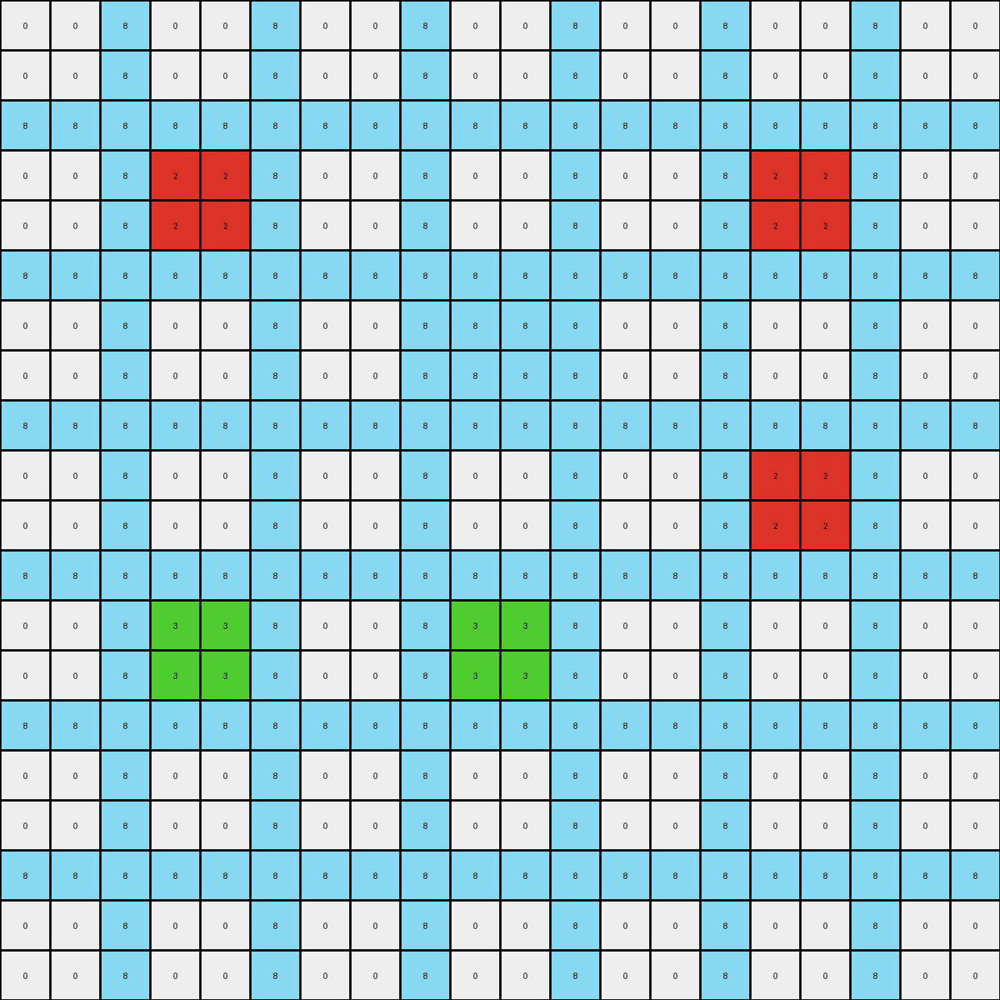
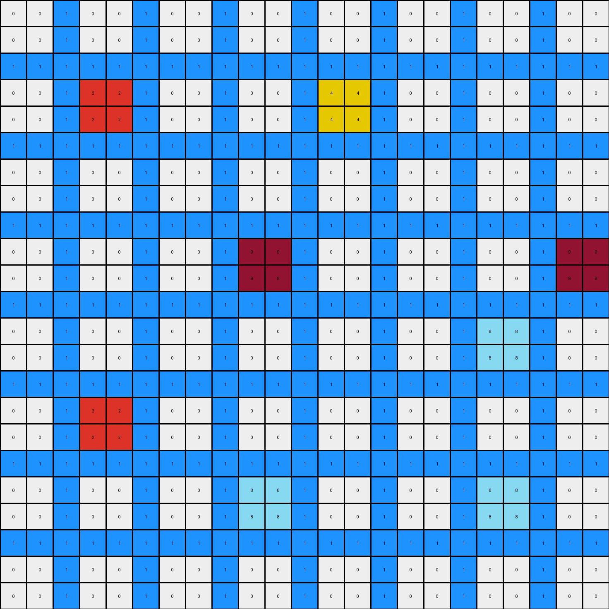

# 06df4c85 • 010 • refine_coder

---

Previous Code:
```python
"""
1. **Identify Colored Objects:** Locate all contiguous blocks of pixels with colors other than white (0) and blue (1). These are the initial "colored objects" (red, yellow, maroon, and azure).

2. **Horizontal Expansion:** Iterate through each row of the grid.
    *   If a pixel is blue (1) and is horizontally adjacent to the *same* colored object on *both* its left and right, change the blue pixel's color to match that of the object.
    * if a blue pixel has different colored objects to its left and right, then maintain its color

3.  **Iterate through colored objects:**
    * For the objects with the colors, maroon(9) and azure(8), expand the objects within their respective vertical sections in the entire column if there is an azure object.

4. **No vertical consideration:** The color propagation/modification of the blue pixel happens only horizontally within a row.
"""

import numpy as np

def find_objects(grid):
    """Finds contiguous objects of the same color, excluding white (0) and blue (1)."""
    objects = []
    visited = np.zeros_like(grid, dtype=bool)
    rows, cols = grid.shape

    def dfs(row, col, color, obj):
        if (row < 0 or row >= rows or col < 0 or col >= cols or
                visited[row, col] or grid[row, col] != color):
            return
        visited[row, col] = True
        obj.append((row, col))
        dfs(row + 1, col, color, obj)
        dfs(row - 1, col, color, obj)
        dfs(row, col + 1, color, obj)
        dfs(row, col - 1, color, obj)

    for row in range(rows):
        for col in range(cols):
            if not visited[row, col] and grid[row, col] not in [0, 1]:
                obj = []
                dfs(row, col, grid[row, col], obj)
                objects.append((grid[row, col], obj))  # Store color and object pixels
    return objects

def transform(input_grid):
    """Transforms the input grid according to the rules."""
    output_grid = np.copy(input_grid)
    rows, cols = output_grid.shape
    objects = find_objects(input_grid)

    # Horizontal Expansion
    for row in range(rows):
        for col in range(1, cols - 1):  # Iterate through inner columns
            if output_grid[row, col] == 1:
                left_color = output_grid[row, col - 1]
                right_color = output_grid[row, col + 1]
                if left_color == right_color and left_color not in [0, 1]:
                    output_grid[row, col] = left_color

    # Vertical Expansion of maroon(9) and azure(8) objects
    for color, obj_pixels in objects:
         if color in [8, 9]:
            obj_rows = [p[0] for p in obj_pixels]
            obj_cols = [p[1] for p in obj_pixels]

            min_col = min(obj_cols)
            max_col = max(obj_cols)

            
            for r in range(rows):
              for c in range(min_col, max_col+1):
                  if input_grid[r,c] == 1:
                    left_color = -1
                    right_color = -1

                    for i in range(c-1, -1, -1):
                      if input_grid[r,i] in [8,9]:
                        left_color = input_grid[r,i]
                        break
                    for i in range(c+1, cols):
                      if input_grid[r,i] in [8,9]:
                        right_color = input_grid[r,i]
                        break
                    if left_color == right_color and left_color == color:

                        output_grid[r,c] = color

    return output_grid
```

Train Set Results:

## Example 1:

Input:
```
0 0 8 0 0 8 0 0 8 0 0 8 0 0 8 0 0 8 0 0
0 0 8 0 0 8 0 0 8 0 0 8 0 0 8 0 0 8 0 0
8 8 8 8 8 8 8 8 8 8 8 8 8 8 8 8 8 8 8 8
0 0 8 2 2 8 0 0 8 0 0 8 0 0 8 2 2 8 0 0
0 0 8 2 2 8 0 0 8 0 0 8 0 0 8 2 2 8 0 0
8 8 8 8 8 8 8 8 8 8 8 8 8 8 8 8 8 8 8 8
0 0 8 0 0 8 0 0 8 1 1 8 0 0 8 0 0 8 0 0
0 0 8 0 0 8 0 0 8 1 1 8 0 0 8 0 0 8 0 0
8 8 8 8 8 8 8 8 8 8 8 8 8 8 8 8 8 8 8 8
0 0 8 0 0 8 0 0 8 0 0 8 0 0 8 2 2 8 0 0
0 0 8 0 0 8 0 0 8 0 0 8 0 0 8 2 2 8 0 0
8 8 8 8 8 8 8 8 8 8 8 8 8 8 8 8 8 8 8 8
0 0 8 3 3 8 0 0 8 3 3 8 0 0 8 0 0 8 0 0
0 0 8 3 3 8 0 0 8 3 3 8 0 0 8 0 0 8 0 0
8 8 8 8 8 8 8 8 8 8 8 8 8 8 8 8 8 8 8 8
0 0 8 0 0 8 0 0 8 0 0 8 0 0 8 0 0 8 0 0
0 0 8 0 0 8 0 0 8 0 0 8 0 0 8 0 0 8 0 0
8 8 8 8 8 8 8 8 8 8 8 8 8 8 8 8 8 8 8 8
0 0 8 0 0 8 0 0 8 0 0 8 0 0 8 0 0 8 0 0
0 0 8 0 0 8 0 0 8 0 0 8 0 0 8 0 0 8 0 0
```
Expected Output:
```
0 0 8 0 0 8 0 0 8 0 0 8 0 0 8 0 0 8 0 0
0 0 8 0 0 8 0 0 8 0 0 8 0 0 8 0 0 8 0 0
8 8 8 8 8 8 8 8 8 8 8 8 8 8 8 8 8 8 8 8
0 0 8 2 2 8 2 2 8 2 2 8 2 2 8 2 2 8 0 0
0 0 8 2 2 8 2 2 8 2 2 8 2 2 8 2 2 8 0 0
8 8 8 8 8 8 8 8 8 8 8 8 8 8 8 8 8 8 8 8
0 0 8 0 0 8 0 0 8 1 1 8 0 0 8 2 2 8 0 0
0 0 8 0 0 8 0 0 8 1 1 8 0 0 8 2 2 8 0 0
8 8 8 8 8 8 8 8 8 8 8 8 8 8 8 8 8 8 8 8
0 0 8 0 0 8 0 0 8 0 0 8 0 0 8 2 2 8 0 0
0 0 8 0 0 8 0 0 8 0 0 8 0 0 8 2 2 8 0 0
8 8 8 8 8 8 8 8 8 8 8 8 8 8 8 8 8 8 8 8
0 0 8 3 3 8 3 3 8 3 3 8 0 0 8 0 0 8 0 0
0 0 8 3 3 8 3 3 8 3 3 8 0 0 8 0 0 8 0 0
8 8 8 8 8 8 8 8 8 8 8 8 8 8 8 8 8 8 8 8
0 0 8 0 0 8 0 0 8 0 0 8 0 0 8 0 0 8 0 0
0 0 8 0 0 8 0 0 8 0 0 8 0 0 8 0 0 8 0 0
8 8 8 8 8 8 8 8 8 8 8 8 8 8 8 8 8 8 8 8
0 0 8 0 0 8 0 0 8 0 0 8 0 0 8 0 0 8 0 0
0 0 8 0 0 8 0 0 8 0 0 8 0 0 8 0 0 8 0 0
```
Transformed Output:
```
0 0 8 0 0 8 0 0 8 0 0 8 0 0 8 0 0 8 0 0
0 0 8 0 0 8 0 0 8 0 0 8 0 0 8 0 0 8 0 0
8 8 8 8 8 8 8 8 8 8 8 8 8 8 8 8 8 8 8 8
0 0 8 2 2 8 0 0 8 0 0 8 0 0 8 2 2 8 0 0
0 0 8 2 2 8 0 0 8 0 0 8 0 0 8 2 2 8 0 0
8 8 8 8 8 8 8 8 8 8 8 8 8 8 8 8 8 8 8 8
0 0 8 0 0 8 0 0 8 8 8 8 0 0 8 0 0 8 0 0
0 0 8 0 0 8 0 0 8 8 8 8 0 0 8 0 0 8 0 0
8 8 8 8 8 8 8 8 8 8 8 8 8 8 8 8 8 8 8 8
0 0 8 0 0 8 0 0 8 0 0 8 0 0 8 2 2 8 0 0
0 0 8 0 0 8 0 0 8 0 0 8 0 0 8 2 2 8 0 0
8 8 8 8 8 8 8 8 8 8 8 8 8 8 8 8 8 8 8 8
0 0 8 3 3 8 0 0 8 3 3 8 0 0 8 0 0 8 0 0
0 0 8 3 3 8 0 0 8 3 3 8 0 0 8 0 0 8 0 0
8 8 8 8 8 8 8 8 8 8 8 8 8 8 8 8 8 8 8 8
0 0 8 0 0 8 0 0 8 0 0 8 0 0 8 0 0 8 0 0
0 0 8 0 0 8 0 0 8 0 0 8 0 0 8 0 0 8 0 0
8 8 8 8 8 8 8 8 8 8 8 8 8 8 8 8 8 8 8 8
0 0 8 0 0 8 0 0 8 0 0 8 0 0 8 0 0 8 0 0
0 0 8 0 0 8 0 0 8 0 0 8 0 0 8 0 0 8 0 0
```

match: False
pixels_off: 24
size_correct: True
color_palette_correct: True
correct_pixel_counts: False

## Example 2:

Input:
```
0 0 1 0 0 1 0 0 1 0 0 1 0 0 1 0 0 1 0 0 1 0 0
0 0 1 0 0 1 0 0 1 0 0 1 0 0 1 0 0 1 0 0 1 0 0
1 1 1 1 1 1 1 1 1 1 1 1 1 1 1 1 1 1 1 1 1 1 1
0 0 1 2 2 1 0 0 1 0 0 1 4 4 1 0 0 1 0 0 1 0 0
0 0 1 2 2 1 0 0 1 0 0 1 4 4 1 0 0 1 0 0 1 0 0
1 1 1 1 1 1 1 1 1 1 1 1 1 1 1 1 1 1 1 1 1 1 1
0 0 1 0 0 1 0 0 1 0 0 1 0 0 1 0 0 1 0 0 1 0 0
0 0 1 0 0 1 0 0 1 0 0 1 0 0 1 0 0 1 0 0 1 0 0
1 1 1 1 1 1 1 1 1 1 1 1 1 1 1 1 1 1 1 1 1 1 1
0 0 1 0 0 1 0 0 1 9 9 1 0 0 1 0 0 1 0 0 1 9 9
0 0 1 0 0 1 0 0 1 9 9 1 0 0 1 0 0 1 0 0 1 9 9
1 1 1 1 1 1 1 1 1 1 1 1 1 1 1 1 1 1 1 1 1 1 1
0 0 1 0 0 1 0 0 1 0 0 1 0 0 1 0 0 1 8 8 1 0 0
0 0 1 0 0 1 0 0 1 0 0 1 0 0 1 0 0 1 8 8 1 0 0
1 1 1 1 1 1 1 1 1 1 1 1 1 1 1 1 1 1 1 1 1 1 1
0 0 1 2 2 1 0 0 1 0 0 1 0 0 1 0 0 1 0 0 1 0 0
0 0 1 2 2 1 0 0 1 0 0 1 0 0 1 0 0 1 0 0 1 0 0
1 1 1 1 1 1 1 1 1 1 1 1 1 1 1 1 1 1 1 1 1 1 1
0 0 1 0 0 1 0 0 1 8 8 1 0 0 1 0 0 1 8 8 1 0 0
0 0 1 0 0 1 0 0 1 8 8 1 0 0 1 0 0 1 8 8 1 0 0
1 1 1 1 1 1 1 1 1 1 1 1 1 1 1 1 1 1 1 1 1 1 1
0 0 1 0 0 1 0 0 1 0 0 1 0 0 1 0 0 1 0 0 1 0 0
0 0 1 0 0 1 0 0 1 0 0 1 0 0 1 0 0 1 0 0 1 0 0
```
Expected Output:
```
0 0 1 0 0 1 0 0 1 0 0 1 0 0 1 0 0 1 0 0 1 0 0
0 0 1 0 0 1 0 0 1 0 0 1 0 0 1 0 0 1 0 0 1 0 0
1 1 1 1 1 1 1 1 1 1 1 1 1 1 1 1 1 1 1 1 1 1 1
0 0 1 2 2 1 0 0 1 0 0 1 4 4 1 0 0 1 0 0 1 0 0
0 0 1 2 2 1 0 0 1 0 0 1 4 4 1 0 0 1 0 0 1 0 0
1 1 1 1 1 1 1 1 1 1 1 1 1 1 1 1 1 1 1 1 1 1 1
0 0 1 2 2 1 0 0 1 0 0 1 0 0 1 0 0 1 0 0 1 0 0
0 0 1 2 2 1 0 0 1 0 0 1 0 0 1 0 0 1 0 0 1 0 0
1 1 1 1 1 1 1 1 1 1 1 1 1 1 1 1 1 1 1 1 1 1 1
0 0 1 2 2 1 0 0 1 9 9 1 9 9 1 9 9 1 9 9 1 9 9
0 0 1 2 2 1 0 0 1 9 9 1 9 9 1 9 9 1 9 9 1 9 9
1 1 1 1 1 1 1 1 1 1 1 1 1 1 1 1 1 1 1 1 1 1 1
0 0 1 2 2 1 0 0 1 0 0 1 0 0 1 0 0 1 8 8 1 0 0
0 0 1 2 2 1 0 0 1 0 0 1 0 0 1 0 0 1 8 8 1 0 0
1 1 1 1 1 1 1 1 1 1 1 1 1 1 1 1 1 1 1 1 1 1 1
0 0 1 2 2 1 0 0 1 0 0 1 0 0 1 0 0 1 8 8 1 0 0
0 0 1 2 2 1 0 0 1 0 0 1 0 0 1 0 0 1 8 8 1 0 0
1 1 1 1 1 1 1 1 1 1 1 1 1 1 1 1 1 1 1 1 1 1 1
0 0 1 0 0 1 0 0 1 8 8 1 8 8 1 8 8 1 8 8 1 0 0
0 0 1 0 0 1 0 0 1 8 8 1 8 8 1 8 8 1 8 8 1 0 0
1 1 1 1 1 1 1 1 1 1 1 1 1 1 1 1 1 1 1 1 1 1 1
0 0 1 0 0 1 0 0 1 0 0 1 0 0 1 0 0 1 0 0 1 0 0
0 0 1 0 0 1 0 0 1 0 0 1 0 0 1 0 0 1 0 0 1 0 0
```
Transformed Output:
```
0 0 1 0 0 1 0 0 1 0 0 1 0 0 1 0 0 1 0 0 1 0 0
0 0 1 0 0 1 0 0 1 0 0 1 0 0 1 0 0 1 0 0 1 0 0
1 1 1 1 1 1 1 1 1 1 1 1 1 1 1 1 1 1 1 1 1 1 1
0 0 1 2 2 1 0 0 1 0 0 1 4 4 1 0 0 1 0 0 1 0 0
0 0 1 2 2 1 0 0 1 0 0 1 4 4 1 0 0 1 0 0 1 0 0
1 1 1 1 1 1 1 1 1 1 1 1 1 1 1 1 1 1 1 1 1 1 1
0 0 1 0 0 1 0 0 1 0 0 1 0 0 1 0 0 1 0 0 1 0 0
0 0 1 0 0 1 0 0 1 0 0 1 0 0 1 0 0 1 0 0 1 0 0
1 1 1 1 1 1 1 1 1 1 1 1 1 1 1 1 1 1 1 1 1 1 1
0 0 1 0 0 1 0 0 1 9 9 1 0 0 1 0 0 1 0 0 1 9 9
0 0 1 0 0 1 0 0 1 9 9 1 0 0 1 0 0 1 0 0 1 9 9
1 1 1 1 1 1 1 1 1 1 1 1 1 1 1 1 1 1 1 1 1 1 1
0 0 1 0 0 1 0 0 1 0 0 1 0 0 1 0 0 1 8 8 1 0 0
0 0 1 0 0 1 0 0 1 0 0 1 0 0 1 0 0 1 8 8 1 0 0
1 1 1 1 1 1 1 1 1 1 1 1 1 1 1 1 1 1 1 1 1 1 1
0 0 1 2 2 1 0 0 1 0 0 1 0 0 1 0 0 1 0 0 1 0 0
0 0 1 2 2 1 0 0 1 0 0 1 0 0 1 0 0 1 0 0 1 0 0
1 1 1 1 1 1 1 1 1 1 1 1 1 1 1 1 1 1 1 1 1 1 1
0 0 1 0 0 1 0 0 1 8 8 1 0 0 1 0 0 1 8 8 1 0 0
0 0 1 0 0 1 0 0 1 8 8 1 0 0 1 0 0 1 8 8 1 0 0
1 1 1 1 1 1 1 1 1 1 1 1 1 1 1 1 1 1 1 1 1 1 1
0 0 1 0 0 1 0 0 1 0 0 1 0 0 1 0 0 1 0 0 1 0 0
0 0 1 0 0 1 0 0 1 0 0 1 0 0 1 0 0 1 0 0 1 0 0
```

match: False
pixels_off: 36
size_correct: True
color_palette_correct: True
correct_pixel_counts: False

## Example 3:

Input:
```
0 0 4 0 0 4 0 0 4 0 0 4 0 0 4 0 0 4 0 0 4 0 0
0 0 4 0 0 4 0 0 4 0 0 4 0 0 4 0 0 4 0 0 4 0 0
4 4 4 4 4 4 4 4 4 4 4 4 4 4 4 4 4 4 4 4 4 4 4
0 0 4 3 3 4 0 0 4 0 0 4 0 0 4 2 2 4 0 0 4 0 0
0 0 4 3 3 4 0 0 4 0 0 4 0 0 4 2 2 4 0 0 4 0 0
4 4 4 4 4 4 4 4 4 4 4 4 4 4 4 4 4 4 4 4 4 4 4
0 0 4 0 0 4 0 0 4 0 0 4 0 0 4 0 0 4 0 0 4 0 0
0 0 4 0 0 4 0 0 4 0 0 4 0 0 4 0 0 4 0 0 4 0 0
4 4 4 4 4 4 4 4 4 4 4 4 4 4 4 4 4 4 4 4 4 4 4
0 0 4 0 0 4 0 0 4 2 2 4 0 0 4 0 0 4 2 2 4 0 0
0 0 4 0 0 4 0 0 4 2 2 4 0 0 4 0 0 4 2 2 4 0 0
4 4 4 4 4 4 4 4 4 4 4 4 4 4 4 4 4 4 4 4 4 4 4
0 0 4 0 0 4 0 0 4 0 0 4 0 0 4 0 0 4 0 0 4 0 0
0 0 4 0 0 4 0 0 4 0 0 4 0 0 4 0 0 4 0 0 4 0 0
4 4 4 4 4 4 4 4 4 4 4 4 4 4 4 4 4 4 4 4 4 4 4
0 0 4 0 0 4 0 0 4 0 0 4 0 0 4 0 0 4 0 0 4 0 0
0 0 4 0 0 4 0 0 4 0 0 4 0 0 4 0 0 4 0 0 4 0 0
4 4 4 4 4 4 4 4 4 4 4 4 4 4 4 4 4 4 4 4 4 4 4
0 0 4 3 3 4 0 0 4 0 0 4 0 0 4 3 3 4 0 0 4 0 0
0 0 4 3 3 4 0 0 4 0 0 4 0 0 4 3 3 4 0 0 4 0 0
4 4 4 4 4 4 4 4 4 4 4 4 4 4 4 4 4 4 4 4 4 4 4
0 0 4 0 0 4 0 0 4 0 0 4 0 0 4 0 0 4 0 0 4 0 0
0 0 4 0 0 4 0 0 4 0 0 4 0 0 4 0 0 4 0 0 4 0 0
```
Expected Output:
```
0 0 4 0 0 4 0 0 4 0 0 4 0 0 4 0 0 4 0 0 4 0 0
0 0 4 0 0 4 0 0 4 0 0 4 0 0 4 0 0 4 0 0 4 0 0
4 4 4 4 4 4 4 4 4 4 4 4 4 4 4 4 4 4 4 4 4 4 4
0 0 4 3 3 4 0 0 4 0 0 4 0 0 4 2 2 4 0 0 4 0 0
0 0 4 3 3 4 0 0 4 0 0 4 0 0 4 2 2 4 0 0 4 0 0
4 4 4 4 4 4 4 4 4 4 4 4 4 4 4 4 4 4 4 4 4 4 4
0 0 4 3 3 4 0 0 4 0 0 4 0 0 4 0 0 4 0 0 4 0 0
0 0 4 3 3 4 0 0 4 0 0 4 0 0 4 0 0 4 0 0 4 0 0
4 4 4 4 4 4 4 4 4 4 4 4 4 4 4 4 4 4 4 4 4 4 4
0 0 4 3 3 4 0 0 4 2 2 4 2 2 4 2 2 4 2 2 4 0 0
0 0 4 3 3 4 0 0 4 2 2 4 2 2 4 2 2 4 2 2 4 0 0
4 4 4 4 4 4 4 4 4 4 4 4 4 4 4 4 4 4 4 4 4 4 4
0 0 4 3 3 4 0 0 4 0 0 4 0 0 4 0 0 4 0 0 4 0 0
0 0 4 3 3 4 0 0 4 0 0 4 0 0 4 0 0 4 0 0 4 0 0
4 4 4 4 4 4 4 4 4 4 4 4 4 4 4 4 4 4 4 4 4 4 4
0 0 4 3 3 4 0 0 4 0 0 4 0 0 4 0 0 4 0 0 4 0 0
0 0 4 3 3 4 0 0 4 0 0 4 0 0 4 0 0 4 0 0 4 0 0
4 4 4 4 4 4 4 4 4 4 4 4 4 4 4 4 4 4 4 4 4 4 4
0 0 4 3 3 4 3 3 4 3 3 4 3 3 4 3 3 4 0 0 4 0 0
0 0 4 3 3 4 3 3 4 3 3 4 3 3 4 3 3 4 0 0 4 0 0
4 4 4 4 4 4 4 4 4 4 4 4 4 4 4 4 4 4 4 4 4 4 4
0 0 4 0 0 4 0 0 4 0 0 4 0 0 4 0 0 4 0 0 4 0 0
0 0 4 0 0 4 0 0 4 0 0 4 0 0 4 0 0 4 0 0 4 0 0
```
Transformed Output:
```
0 0 4 0 0 4 0 0 4 0 0 4 0 0 4 0 0 4 0 0 4 0 0
0 0 4 0 0 4 0 0 4 0 0 4 0 0 4 0 0 4 0 0 4 0 0
4 4 4 4 4 4 4 4 4 4 4 4 4 4 4 4 4 4 4 4 4 4 4
0 0 4 3 3 4 0 0 4 0 0 4 0 0 4 2 2 4 0 0 4 0 0
0 0 4 3 3 4 0 0 4 0 0 4 0 0 4 2 2 4 0 0 4 0 0
4 4 4 4 4 4 4 4 4 4 4 4 4 4 4 4 4 4 4 4 4 4 4
0 0 4 0 0 4 0 0 4 0 0 4 0 0 4 0 0 4 0 0 4 0 0
0 0 4 0 0 4 0 0 4 0 0 4 0 0 4 0 0 4 0 0 4 0 0
4 4 4 4 4 4 4 4 4 4 4 4 4 4 4 4 4 4 4 4 4 4 4
0 0 4 0 0 4 0 0 4 2 2 4 0 0 4 0 0 4 2 2 4 0 0
0 0 4 0 0 4 0 0 4 2 2 4 0 0 4 0 0 4 2 2 4 0 0
4 4 4 4 4 4 4 4 4 4 4 4 4 4 4 4 4 4 4 4 4 4 4
0 0 4 0 0 4 0 0 4 0 0 4 0 0 4 0 0 4 0 0 4 0 0
0 0 4 0 0 4 0 0 4 0 0 4 0 0 4 0 0 4 0 0 4 0 0
4 4 4 4 4 4 4 4 4 4 4 4 4 4 4 4 4 4 4 4 4 4 4
0 0 4 0 0 4 0 0 4 0 0 4 0 0 4 0 0 4 0 0 4 0 0
0 0 4 0 0 4 0 0 4 0 0 4 0 0 4 0 0 4 0 0 4 0 0
4 4 4 4 4 4 4 4 4 4 4 4 4 4 4 4 4 4 4 4 4 4 4
0 0 4 3 3 4 0 0 4 0 0 4 0 0 4 3 3 4 0 0 4 0 0
0 0 4 3 3 4 0 0 4 0 0 4 0 0 4 3 3 4 0 0 4 0 0
4 4 4 4 4 4 4 4 4 4 4 4 4 4 4 4 4 4 4 4 4 4 4
0 0 4 0 0 4 0 0 4 0 0 4 0 0 4 0 0 4 0 0 4 0 0
0 0 4 0 0 4 0 0 4 0 0 4 0 0 4 0 0 4 0 0 4 0 0
```

match: False
pixels_off: 36
size_correct: True
color_palette_correct: True
correct_pixel_counts: False
Okay, let's analyze the results from the three training examples and refine the natural language program and approach.

**General Assessment and Strategy**

The current code implements horizontal expansion of colors based on adjacency and attempts a limited vertical expansion for colors 8 (azure) and 9 (maroon). The results show consistent mismatches, indicating flaws in both the horizontal and vertical expansion logic. The primary issue seems to be an overly restrictive horizontal rule and an incorrect, overly complex and incomplete, vertical rule. It expands the area between max and min of object columns.

Here's the strategy:

1.  **Simplify and Correct Horizontal Expansion:** The horizontal rule needs to be more general. Instead of requiring the *same* color on both sides, we should propagate any non-white, non-blue color horizontally into a blue pixel if the blue pixel is *between* pixels of *any* two non-white, non-blue colors.
2.  **Revise Vertical Expansion:** The vertical expansion is clearly wrong. Vertical expansion must be applied to the *entire column* where the object is found and should consider the adjacent objects in the same column.
3. **Consider object shapes**: Analyze if the shapes are preserved or altered during the operation.
4.  **Iterative Improvement:** We'll focus on fixing the horizontal rule first, then tackle the vertical expansion, testing after each change.

**Metrics and Observations**

Here's a breakdown of each example:

*   **Example 1:**
    *   **Observation:** Horizontal expansion fails in rows with alternating colors (e.g., `8 2 2 8`). Vertical expansion of 8 is partially correct but doesn't fill the full column, missing some blue(1) pixels in the column.
    *   **Pixels Off:** 24. Indicates significant errors.
    *   **Shapes:** Shapes are altered; vertical strips are extended vertically.

*   **Example 2:**
    *   **Observation:** Similar issues to Example 1. Horizontal expansion only works for `2 2` and `4 4` but not in other instances. Vertical filling fails for both maroon(9) and azure(8).
    *    **Pixels Off:** 36. Worse than Example 1.
    *   **Shapes:** Shapes are altered; vertical strips are extended vertically.

*   **Example 3:**
    *   **Observation:** Horizontal expansion does not consider adjacent colors correctly.Vertical expansion of maroon and azure are not considered.
    *   **Pixels Off:** 36. Consistent with the incorrect vertical expansion.
    *   **Shapes:** Shapes are altered; vertical strips are extended vertically.

**YAML Fact Block**

```yaml
observations:
  - example: 1
    objects:
      - color: 8  # Azure
        shape: vertical_strip
        action: expand_vertically
      - color: 2  # Red
        shape: vertical_strip
        action: expand_horizontally, expand_vertically
      - color: 3 # Green
        shape: vertical_strip
        action: expand_horizontally, expand_vertically
    horizontal_expansion:
      rule: "If a blue pixel is between two non-white, non-blue pixels, change the blue pixel to match the color of adjacent non-white and non-blue."
      correct: false
    vertical_expansion:
      rule: "If a vertical_strip with color 8 is found, fill its whole column with color 8, if it is not blocked."
      correct: partially #only expands between min and max columns.
  - example: 2
    objects:
      - color: 2
        shape: vertical_strip
        action: expand_horizontally, expand_vertically
      - color: 4
        shape: vertical_strip
        action: expand_horizontally, expand_vertically
      - color: 9
        shape: vertical_strip
        action: expand_vertically
      - color: 8
        shape: vertical_strip
        action: expand_vertically
    horizontal_expansion:
      rule: "If a blue pixel is between two non-white, non-blue pixels, change the blue pixel to match the color of adjacent non-white and non-blue."
      correct: false
    vertical_expansion:
      rule: "If a vertical_strip with color 9 or 8 is found, fill its whole column with respective color, if it is not blocked."
      correct: false
  - example: 3
    objects:
      - color: 4
        shape: vertical_strip
        action: expand_vertically
      - color: 3
        shape: vertical_strip
        action: expand_horizontally, expand_vertically
      - color: 2
        shape: vertical_strip
        action: expand_horizontally, expand_vertically
    horizontal_expansion:
      rule: "If a blue pixel is between two non-white, non-blue pixels, change the blue pixel to match the color of adjacent non-white and non-blue."
      correct: false
    vertical_expansion:
      rule: "If a vertical_strip with certain colors is found, fill its whole column with respective color, if it is not blocked."
      correct: false
general_observations:
  - "Shapes are consistently altered to create vertically extended strips."
  - "Horizontal filling is context-dependent and incomplete."
  - "Vertical expansion logic is consistently misapplied in all given examples."
```

**Natural Language Program**

1.  **Identify Objects:** Locate all contiguous blocks of pixels of the same color, excluding white (0) and blue (1). These are initial colored objects and are vertical strips.

2.  **Horizontal Expansion:**
    *   Iterate through each row of the grid.
    *   If a blue (1) pixel is horizontally adjacent to non-white and non-blue colors, change the blue pixel's color to the color of the strip.

3.  **Vertical Expansion:**
    * Iterate through each column.
    *   If a column contains colored objects (excluding 0 and 1), extend those colors vertically to fill the entire column, replacing blue(1) pixels. If a column has multiple colored objects, then expand all of them within the column.

4. **Preservation:**
    * The horizontal and vertical lines with color white(0) are preserved.

**INSTRUCTIONS**

- generate a Python module to represent the natural language program 
- follow the template below
- all common math and science libraries are available
- create docstring only at top - but comment the workflow in the function
- use helper functions for common operations like finding objects, counting,
  measuring, moving, etc. 

remember - we are working iteratively - so this code will inform your future
self as we converge on the solution

*template:*

```python
"""
{{ natural language description of the transformation rule }}
"""

{{ imports }}

def transform(input_grid):
    # initialize output_grid

    # change output pixels 

    return output_grid

```
