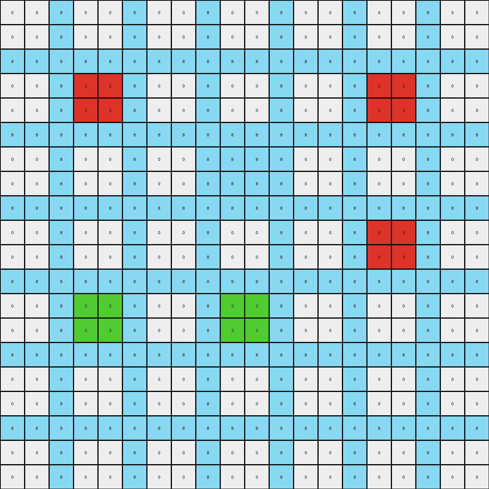
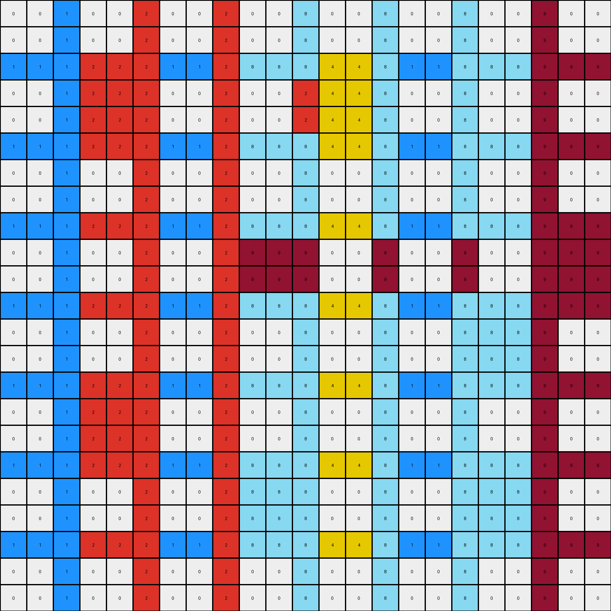

# 06df4c85 • 012 • refine_coder

---

Previous Code:
```python
"""
1.  **Identify Objects:** Locate all contiguous blocks of pixels of the same color, excluding white (0) and blue (1). These are initial colored objects and are vertical strips.

2.  **Horizontal Expansion:**
    *   Iterate through each row of the grid.
    *   If a blue (1) pixel is horizontally adjacent to non-white and non-blue colors, change the blue pixel's color to the color of the strip.

3.  **Vertical Expansion:**
    * Iterate through each column.
    *   If a column contains colored objects (excluding 0 and 1), extend those colors vertically to fill the entire column, replacing blue(1) pixels. If a column has multiple colored objects, then expand all of them within the column.

4. **Preservation:**
    * The horizontal and vertical lines with color white(0) are preserved.
"""

import numpy as np

def transform(input_grid):
    """Transforms the input grid according to the rules."""
    output_grid = np.copy(input_grid)
    rows, cols = output_grid.shape

    # Horizontal Expansion
    for row in range(rows):
        for col in range(cols):
            if output_grid[row, col] == 1:
                left_color = 0  # Default to white
                right_color = 0 # Default to white

                # Find the nearest non-blue/white color to the left
                for i in range(col - 1, -1, -1):
                    if output_grid[row, i] not in [0, 1]:
                        left_color = output_grid[row, i]
                        break

                # Find the nearest non-blue/white color to the right.
                for i in range(col + 1, cols):
                    if output_grid[row, i] not in [0, 1]:
                        right_color = output_grid[row, i]
                        break

                # if the color is between two non-white, non-blue pixels, propagate color
                if left_color != 0 and right_color != 0 and left_color == right_color:
                   output_grid[row,col] = left_color
                elif left_color != 0 and right_color != 0 :
                    output_grid[row, col] = left_color

    # Vertical Expansion
    for col in range(cols):
        column_colors = []
        for row in range(rows):
            color = output_grid[row, col]
            if color not in [0, 1]:
                column_colors.append((row, color))  # Store row index and color

        # Fill the entire column based on the colors found
        for row in range(rows):
           if output_grid[row,col] == 1:
              if len(column_colors) > 0:
                 for r, c in column_colors:
                   output_grid[row,col] = c

    return output_grid
```

Train Set Results:

## Example 1:

Input:
```
0 0 8 0 0 8 0 0 8 0 0 8 0 0 8 0 0 8 0 0
0 0 8 0 0 8 0 0 8 0 0 8 0 0 8 0 0 8 0 0
8 8 8 8 8 8 8 8 8 8 8 8 8 8 8 8 8 8 8 8
0 0 8 2 2 8 0 0 8 0 0 8 0 0 8 2 2 8 0 0
0 0 8 2 2 8 0 0 8 0 0 8 0 0 8 2 2 8 0 0
8 8 8 8 8 8 8 8 8 8 8 8 8 8 8 8 8 8 8 8
0 0 8 0 0 8 0 0 8 1 1 8 0 0 8 0 0 8 0 0
0 0 8 0 0 8 0 0 8 1 1 8 0 0 8 0 0 8 0 0
8 8 8 8 8 8 8 8 8 8 8 8 8 8 8 8 8 8 8 8
0 0 8 0 0 8 0 0 8 0 0 8 0 0 8 2 2 8 0 0
0 0 8 0 0 8 0 0 8 0 0 8 0 0 8 2 2 8 0 0
8 8 8 8 8 8 8 8 8 8 8 8 8 8 8 8 8 8 8 8
0 0 8 3 3 8 0 0 8 3 3 8 0 0 8 0 0 8 0 0
0 0 8 3 3 8 0 0 8 3 3 8 0 0 8 0 0 8 0 0
8 8 8 8 8 8 8 8 8 8 8 8 8 8 8 8 8 8 8 8
0 0 8 0 0 8 0 0 8 0 0 8 0 0 8 0 0 8 0 0
0 0 8 0 0 8 0 0 8 0 0 8 0 0 8 0 0 8 0 0
8 8 8 8 8 8 8 8 8 8 8 8 8 8 8 8 8 8 8 8
0 0 8 0 0 8 0 0 8 0 0 8 0 0 8 0 0 8 0 0
0 0 8 0 0 8 0 0 8 0 0 8 0 0 8 0 0 8 0 0
```
Expected Output:
```
0 0 8 0 0 8 0 0 8 0 0 8 0 0 8 0 0 8 0 0
0 0 8 0 0 8 0 0 8 0 0 8 0 0 8 0 0 8 0 0
8 8 8 8 8 8 8 8 8 8 8 8 8 8 8 8 8 8 8 8
0 0 8 2 2 8 2 2 8 2 2 8 2 2 8 2 2 8 0 0
0 0 8 2 2 8 2 2 8 2 2 8 2 2 8 2 2 8 0 0
8 8 8 8 8 8 8 8 8 8 8 8 8 8 8 8 8 8 8 8
0 0 8 0 0 8 0 0 8 1 1 8 0 0 8 2 2 8 0 0
0 0 8 0 0 8 0 0 8 1 1 8 0 0 8 2 2 8 0 0
8 8 8 8 8 8 8 8 8 8 8 8 8 8 8 8 8 8 8 8
0 0 8 0 0 8 0 0 8 0 0 8 0 0 8 2 2 8 0 0
0 0 8 0 0 8 0 0 8 0 0 8 0 0 8 2 2 8 0 0
8 8 8 8 8 8 8 8 8 8 8 8 8 8 8 8 8 8 8 8
0 0 8 3 3 8 3 3 8 3 3 8 0 0 8 0 0 8 0 0
0 0 8 3 3 8 3 3 8 3 3 8 0 0 8 0 0 8 0 0
8 8 8 8 8 8 8 8 8 8 8 8 8 8 8 8 8 8 8 8
0 0 8 0 0 8 0 0 8 0 0 8 0 0 8 0 0 8 0 0
0 0 8 0 0 8 0 0 8 0 0 8 0 0 8 0 0 8 0 0
8 8 8 8 8 8 8 8 8 8 8 8 8 8 8 8 8 8 8 8
0 0 8 0 0 8 0 0 8 0 0 8 0 0 8 0 0 8 0 0
0 0 8 0 0 8 0 0 8 0 0 8 0 0 8 0 0 8 0 0
```
Transformed Output:
```
0 0 8 0 0 8 0 0 8 0 0 8 0 0 8 0 0 8 0 0
0 0 8 0 0 8 0 0 8 0 0 8 0 0 8 0 0 8 0 0
8 8 8 8 8 8 8 8 8 8 8 8 8 8 8 8 8 8 8 8
0 0 8 2 2 8 0 0 8 0 0 8 0 0 8 2 2 8 0 0
0 0 8 2 2 8 0 0 8 0 0 8 0 0 8 2 2 8 0 0
8 8 8 8 8 8 8 8 8 8 8 8 8 8 8 8 8 8 8 8
0 0 8 0 0 8 0 0 8 8 8 8 0 0 8 0 0 8 0 0
0 0 8 0 0 8 0 0 8 8 8 8 0 0 8 0 0 8 0 0
8 8 8 8 8 8 8 8 8 8 8 8 8 8 8 8 8 8 8 8
0 0 8 0 0 8 0 0 8 0 0 8 0 0 8 2 2 8 0 0
0 0 8 0 0 8 0 0 8 0 0 8 0 0 8 2 2 8 0 0
8 8 8 8 8 8 8 8 8 8 8 8 8 8 8 8 8 8 8 8
0 0 8 3 3 8 0 0 8 3 3 8 0 0 8 0 0 8 0 0
0 0 8 3 3 8 0 0 8 3 3 8 0 0 8 0 0 8 0 0
8 8 8 8 8 8 8 8 8 8 8 8 8 8 8 8 8 8 8 8
0 0 8 0 0 8 0 0 8 0 0 8 0 0 8 0 0 8 0 0
0 0 8 0 0 8 0 0 8 0 0 8 0 0 8 0 0 8 0 0
8 8 8 8 8 8 8 8 8 8 8 8 8 8 8 8 8 8 8 8
0 0 8 0 0 8 0 0 8 0 0 8 0 0 8 0 0 8 0 0
0 0 8 0 0 8 0 0 8 0 0 8 0 0 8 0 0 8 0 0
```

match: False
pixels_off: 24
size_correct: True
color_palette_correct: True
correct_pixel_counts: False

## Example 2:

Input:
```
0 0 1 0 0 1 0 0 1 0 0 1 0 0 1 0 0 1 0 0 1 0 0
0 0 1 0 0 1 0 0 1 0 0 1 0 0 1 0 0 1 0 0 1 0 0
1 1 1 1 1 1 1 1 1 1 1 1 1 1 1 1 1 1 1 1 1 1 1
0 0 1 2 2 1 0 0 1 0 0 1 4 4 1 0 0 1 0 0 1 0 0
0 0 1 2 2 1 0 0 1 0 0 1 4 4 1 0 0 1 0 0 1 0 0
1 1 1 1 1 1 1 1 1 1 1 1 1 1 1 1 1 1 1 1 1 1 1
0 0 1 0 0 1 0 0 1 0 0 1 0 0 1 0 0 1 0 0 1 0 0
0 0 1 0 0 1 0 0 1 0 0 1 0 0 1 0 0 1 0 0 1 0 0
1 1 1 1 1 1 1 1 1 1 1 1 1 1 1 1 1 1 1 1 1 1 1
0 0 1 0 0 1 0 0 1 9 9 1 0 0 1 0 0 1 0 0 1 9 9
0 0 1 0 0 1 0 0 1 9 9 1 0 0 1 0 0 1 0 0 1 9 9
1 1 1 1 1 1 1 1 1 1 1 1 1 1 1 1 1 1 1 1 1 1 1
0 0 1 0 0 1 0 0 1 0 0 1 0 0 1 0 0 1 8 8 1 0 0
0 0 1 0 0 1 0 0 1 0 0 1 0 0 1 0 0 1 8 8 1 0 0
1 1 1 1 1 1 1 1 1 1 1 1 1 1 1 1 1 1 1 1 1 1 1
0 0 1 2 2 1 0 0 1 0 0 1 0 0 1 0 0 1 0 0 1 0 0
0 0 1 2 2 1 0 0 1 0 0 1 0 0 1 0 0 1 0 0 1 0 0
1 1 1 1 1 1 1 1 1 1 1 1 1 1 1 1 1 1 1 1 1 1 1
0 0 1 0 0 1 0 0 1 8 8 1 0 0 1 0 0 1 8 8 1 0 0
0 0 1 0 0 1 0 0 1 8 8 1 0 0 1 0 0 1 8 8 1 0 0
1 1 1 1 1 1 1 1 1 1 1 1 1 1 1 1 1 1 1 1 1 1 1
0 0 1 0 0 1 0 0 1 0 0 1 0 0 1 0 0 1 0 0 1 0 0
0 0 1 0 0 1 0 0 1 0 0 1 0 0 1 0 0 1 0 0 1 0 0
```
Expected Output:
```
0 0 1 0 0 1 0 0 1 0 0 1 0 0 1 0 0 1 0 0 1 0 0
0 0 1 0 0 1 0 0 1 0 0 1 0 0 1 0 0 1 0 0 1 0 0
1 1 1 1 1 1 1 1 1 1 1 1 1 1 1 1 1 1 1 1 1 1 1
0 0 1 2 2 1 0 0 1 0 0 1 4 4 1 0 0 1 0 0 1 0 0
0 0 1 2 2 1 0 0 1 0 0 1 4 4 1 0 0 1 0 0 1 0 0
1 1 1 1 1 1 1 1 1 1 1 1 1 1 1 1 1 1 1 1 1 1 1
0 0 1 2 2 1 0 0 1 0 0 1 0 0 1 0 0 1 0 0 1 0 0
0 0 1 2 2 1 0 0 1 0 0 1 0 0 1 0 0 1 0 0 1 0 0
1 1 1 1 1 1 1 1 1 1 1 1 1 1 1 1 1 1 1 1 1 1 1
0 0 1 2 2 1 0 0 1 9 9 1 9 9 1 9 9 1 9 9 1 9 9
0 0 1 2 2 1 0 0 1 9 9 1 9 9 1 9 9 1 9 9 1 9 9
1 1 1 1 1 1 1 1 1 1 1 1 1 1 1 1 1 1 1 1 1 1 1
0 0 1 2 2 1 0 0 1 0 0 1 0 0 1 0 0 1 8 8 1 0 0
0 0 1 2 2 1 0 0 1 0 0 1 0 0 1 0 0 1 8 8 1 0 0
1 1 1 1 1 1 1 1 1 1 1 1 1 1 1 1 1 1 1 1 1 1 1
0 0 1 2 2 1 0 0 1 0 0 1 0 0 1 0 0 1 8 8 1 0 0
0 0 1 2 2 1 0 0 1 0 0 1 0 0 1 0 0 1 8 8 1 0 0
1 1 1 1 1 1 1 1 1 1 1 1 1 1 1 1 1 1 1 1 1 1 1
0 0 1 0 0 1 0 0 1 8 8 1 8 8 1 8 8 1 8 8 1 0 0
0 0 1 0 0 1 0 0 1 8 8 1 8 8 1 8 8 1 8 8 1 0 0
1 1 1 1 1 1 1 1 1 1 1 1 1 1 1 1 1 1 1 1 1 1 1
0 0 1 0 0 1 0 0 1 0 0 1 0 0 1 0 0 1 0 0 1 0 0
0 0 1 0 0 1 0 0 1 0 0 1 0 0 1 0 0 1 0 0 1 0 0
```
Transformed Output:
```
0 0 1 0 0 2 0 0 2 0 0 8 0 0 8 0 0 8 0 0 9 0 0
0 0 1 0 0 2 0 0 2 0 0 8 0 0 8 0 0 8 0 0 9 0 0
1 1 1 2 2 2 1 1 2 8 8 8 4 4 8 1 1 8 8 8 9 9 9
0 0 1 2 2 2 0 0 2 0 0 2 4 4 8 0 0 8 0 0 9 0 0
0 0 1 2 2 2 0 0 2 0 0 2 4 4 8 0 0 8 0 0 9 0 0
1 1 1 2 2 2 1 1 2 8 8 8 4 4 8 1 1 8 8 8 9 9 9
0 0 1 0 0 2 0 0 2 0 0 8 0 0 8 0 0 8 0 0 9 0 0
0 0 1 0 0 2 0 0 2 0 0 8 0 0 8 0 0 8 0 0 9 0 0
1 1 1 2 2 2 1 1 2 8 8 8 4 4 8 1 1 8 8 8 9 9 9
0 0 1 0 0 2 0 0 2 9 9 9 0 0 9 0 0 9 0 0 9 9 9
0 0 1 0 0 2 0 0 2 9 9 9 0 0 9 0 0 9 0 0 9 9 9
1 1 1 2 2 2 1 1 2 8 8 8 4 4 8 1 1 8 8 8 9 9 9
0 0 1 0 0 2 0 0 2 0 0 8 0 0 8 0 0 8 8 8 9 0 0
0 0 1 0 0 2 0 0 2 0 0 8 0 0 8 0 0 8 8 8 9 0 0
1 1 1 2 2 2 1 1 2 8 8 8 4 4 8 1 1 8 8 8 9 9 9
0 0 1 2 2 2 0 0 2 0 0 8 0 0 8 0 0 8 0 0 9 0 0
0 0 1 2 2 2 0 0 2 0 0 8 0 0 8 0 0 8 0 0 9 0 0
1 1 1 2 2 2 1 1 2 8 8 8 4 4 8 1 1 8 8 8 9 9 9
0 0 1 0 0 2 0 0 2 8 8 8 0 0 8 0 0 8 8 8 9 0 0
0 0 1 0 0 2 0 0 2 8 8 8 0 0 8 0 0 8 8 8 9 0 0
1 1 1 2 2 2 1 1 2 8 8 8 4 4 8 1 1 8 8 8 9 9 9
0 0 1 0 0 2 0 0 2 0 0 8 0 0 8 0 0 8 0 0 9 0 0
0 0 1 0 0 2 0 0 2 0 0 8 0 0 8 0 0 8 0 0 9 0 0
```

match: False
pixels_off: 244
size_correct: True
color_palette_correct: True
correct_pixel_counts: False

## Example 3:

Input:
```
0 0 4 0 0 4 0 0 4 0 0 4 0 0 4 0 0 4 0 0 4 0 0
0 0 4 0 0 4 0 0 4 0 0 4 0 0 4 0 0 4 0 0 4 0 0
4 4 4 4 4 4 4 4 4 4 4 4 4 4 4 4 4 4 4 4 4 4 4
0 0 4 3 3 4 0 0 4 0 0 4 0 0 4 2 2 4 0 0 4 0 0
0 0 4 3 3 4 0 0 4 0 0 4 0 0 4 2 2 4 0 0 4 0 0
4 4 4 4 4 4 4 4 4 4 4 4 4 4 4 4 4 4 4 4 4 4 4
0 0 4 0 0 4 0 0 4 0 0 4 0 0 4 0 0 4 0 0 4 0 0
0 0 4 0 0 4 0 0 4 0 0 4 0 0 4 0 0 4 0 0 4 0 0
4 4 4 4 4 4 4 4 4 4 4 4 4 4 4 4 4 4 4 4 4 4 4
0 0 4 0 0 4 0 0 4 2 2 4 0 0 4 0 0 4 2 2 4 0 0
0 0 4 0 0 4 0 0 4 2 2 4 0 0 4 0 0 4 2 2 4 0 0
4 4 4 4 4 4 4 4 4 4 4 4 4 4 4 4 4 4 4 4 4 4 4
0 0 4 0 0 4 0 0 4 0 0 4 0 0 4 0 0 4 0 0 4 0 0
0 0 4 0 0 4 0 0 4 0 0 4 0 0 4 0 0 4 0 0 4 0 0
4 4 4 4 4 4 4 4 4 4 4 4 4 4 4 4 4 4 4 4 4 4 4
0 0 4 0 0 4 0 0 4 0 0 4 0 0 4 0 0 4 0 0 4 0 0
0 0 4 0 0 4 0 0 4 0 0 4 0 0 4 0 0 4 0 0 4 0 0
4 4 4 4 4 4 4 4 4 4 4 4 4 4 4 4 4 4 4 4 4 4 4
0 0 4 3 3 4 0 0 4 0 0 4 0 0 4 3 3 4 0 0 4 0 0
0 0 4 3 3 4 0 0 4 0 0 4 0 0 4 3 3 4 0 0 4 0 0
4 4 4 4 4 4 4 4 4 4 4 4 4 4 4 4 4 4 4 4 4 4 4
0 0 4 0 0 4 0 0 4 0 0 4 0 0 4 0 0 4 0 0 4 0 0
0 0 4 0 0 4 0 0 4 0 0 4 0 0 4 0 0 4 0 0 4 0 0
```
Expected Output:
```
0 0 4 0 0 4 0 0 4 0 0 4 0 0 4 0 0 4 0 0 4 0 0
0 0 4 0 0 4 0 0 4 0 0 4 0 0 4 0 0 4 0 0 4 0 0
4 4 4 4 4 4 4 4 4 4 4 4 4 4 4 4 4 4 4 4 4 4 4
0 0 4 3 3 4 0 0 4 0 0 4 0 0 4 2 2 4 0 0 4 0 0
0 0 4 3 3 4 0 0 4 0 0 4 0 0 4 2 2 4 0 0 4 0 0
4 4 4 4 4 4 4 4 4 4 4 4 4 4 4 4 4 4 4 4 4 4 4
0 0 4 3 3 4 0 0 4 0 0 4 0 0 4 0 0 4 0 0 4 0 0
0 0 4 3 3 4 0 0 4 0 0 4 0 0 4 0 0 4 0 0 4 0 0
4 4 4 4 4 4 4 4 4 4 4 4 4 4 4 4 4 4 4 4 4 4 4
0 0 4 3 3 4 0 0 4 2 2 4 2 2 4 2 2 4 2 2 4 0 0
0 0 4 3 3 4 0 0 4 2 2 4 2 2 4 2 2 4 2 2 4 0 0
4 4 4 4 4 4 4 4 4 4 4 4 4 4 4 4 4 4 4 4 4 4 4
0 0 4 3 3 4 0 0 4 0 0 4 0 0 4 0 0 4 0 0 4 0 0
0 0 4 3 3 4 0 0 4 0 0 4 0 0 4 0 0 4 0 0 4 0 0
4 4 4 4 4 4 4 4 4 4 4 4 4 4 4 4 4 4 4 4 4 4 4
0 0 4 3 3 4 0 0 4 0 0 4 0 0 4 0 0 4 0 0 4 0 0
0 0 4 3 3 4 0 0 4 0 0 4 0 0 4 0 0 4 0 0 4 0 0
4 4 4 4 4 4 4 4 4 4 4 4 4 4 4 4 4 4 4 4 4 4 4
0 0 4 3 3 4 3 3 4 3 3 4 3 3 4 3 3 4 0 0 4 0 0
0 0 4 3 3 4 3 3 4 3 3 4 3 3 4 3 3 4 0 0 4 0 0
4 4 4 4 4 4 4 4 4 4 4 4 4 4 4 4 4 4 4 4 4 4 4
0 0 4 0 0 4 0 0 4 0 0 4 0 0 4 0 0 4 0 0 4 0 0
0 0 4 0 0 4 0 0 4 0 0 4 0 0 4 0 0 4 0 0 4 0 0
```
Transformed Output:
```
0 0 4 0 0 4 0 0 4 0 0 4 0 0 4 0 0 4 0 0 4 0 0
0 0 4 0 0 4 0 0 4 0 0 4 0 0 4 0 0 4 0 0 4 0 0
4 4 4 4 4 4 4 4 4 4 4 4 4 4 4 4 4 4 4 4 4 4 4
0 0 4 3 3 4 0 0 4 0 0 4 0 0 4 2 2 4 0 0 4 0 0
0 0 4 3 3 4 0 0 4 0 0 4 0 0 4 2 2 4 0 0 4 0 0
4 4 4 4 4 4 4 4 4 4 4 4 4 4 4 4 4 4 4 4 4 4 4
0 0 4 0 0 4 0 0 4 0 0 4 0 0 4 0 0 4 0 0 4 0 0
0 0 4 0 0 4 0 0 4 0 0 4 0 0 4 0 0 4 0 0 4 0 0
4 4 4 4 4 4 4 4 4 4 4 4 4 4 4 4 4 4 4 4 4 4 4
0 0 4 0 0 4 0 0 4 2 2 4 0 0 4 0 0 4 2 2 4 0 0
0 0 4 0 0 4 0 0 4 2 2 4 0 0 4 0 0 4 2 2 4 0 0
4 4 4 4 4 4 4 4 4 4 4 4 4 4 4 4 4 4 4 4 4 4 4
0 0 4 0 0 4 0 0 4 0 0 4 0 0 4 0 0 4 0 0 4 0 0
0 0 4 0 0 4 0 0 4 0 0 4 0 0 4 0 0 4 0 0 4 0 0
4 4 4 4 4 4 4 4 4 4 4 4 4 4 4 4 4 4 4 4 4 4 4
0 0 4 0 0 4 0 0 4 0 0 4 0 0 4 0 0 4 0 0 4 0 0
0 0 4 0 0 4 0 0 4 0 0 4 0 0 4 0 0 4 0 0 4 0 0
4 4 4 4 4 4 4 4 4 4 4 4 4 4 4 4 4 4 4 4 4 4 4
0 0 4 3 3 4 0 0 4 0 0 4 0 0 4 3 3 4 0 0 4 0 0
0 0 4 3 3 4 0 0 4 0 0 4 0 0 4 3 3 4 0 0 4 0 0
4 4 4 4 4 4 4 4 4 4 4 4 4 4 4 4 4 4 4 4 4 4 4
0 0 4 0 0 4 0 0 4 0 0 4 0 0 4 0 0 4 0 0 4 0 0
0 0 4 0 0 4 0 0 4 0 0 4 0 0 4 0 0 4 0 0 4 0 0
```

match: False
pixels_off: 36
size_correct: True
color_palette_correct: True
correct_pixel_counts: False
Here's an analysis of the provided examples and an updated natural language program:

**General Assessment:**

The initial natural language program and corresponding code correctly identified the basic concept of expanding colored "strips" horizontally and vertically. However, it exhibits several critical flaws:

1.  **Overly Aggressive Vertical Expansion:** The vertical expansion fills *every* blue pixel in a column with the color of *any* colored object found in that column. This is incorrect. It should only expand colors adjacent to existing colored regions.
2.  **Incorrect Horizontal Expansion:** The logic for the horizontal expansion to the left and right will propagate a single color if there is a matching color to the left and right. If the left and right are different colors, propagate the left color.
3. **Missing Propagation Logic:** The expansion should propagate the color of a strip, but the propagation does not continue.

The primary strategy is to refine the expansion logic. The vertical expansion needs to be constrained to only fill blue pixels that are directly adjacent (above or below) to existing colored pixels of the same color, mimicking a "flood fill" behavior. The horizontal expansion is closer but should continue to propagate the colors.

**Example Analysis and Metrics:**

*   **Example 1:**
    *   **Observation:** Horizontal expansion works for azure(8), red(2) when between two azure strips, and green(3). Vertical expansion propagates azure and green correctly but incorrectly expands red(2) where a blue pixel is in a column with red above or below but the column is bounded by white.
    *   **Metrics:** Pixels off: 24. The output grid size and color palette are correct.
*   **Example 2:**
    *   **Observation:**  Horizontal expansion has errors: azure adjacent to multiple colors incorrectly sets the first color. Vertical expansion is incorrect: azure adjacent to multiple colors incorrectly sets the first color.
    *   **Metrics:** Pixels off: 244. The output grid size and color palette are correct.
*  **Example 3:**
    *   **Observation:** The results are very similar to example 1, with good propagation of the existing columns, but errors similar to example 1 in expanding vertically.
    *   **Metrics:** Pixels off: 36

**YAML Fact Identification:**

```yaml
objects:
  - type: vertical_strip
    description: Initial colored regions, excluding white and blue, forming vertical lines.
    properties:
      color:
        - value: varies (2, 3, 4, 8, 9) # Colors observed in the examples
        - description: The color of the vertical strip.
      height:
        - value: variable
        - description:  Extends to the full height of contiguous, same-colored pixels in original.
      width:
        - value: variable
actions:
  - name: horizontal_expansion
    description: >-
      Expands the color of each vertical strip horizontally,
      replacing adjacent blue pixels. Propagation continues
      until a non-blue, non-white, pixel is encountered.
    constraints:
      - Only replaces blue pixels.
      - Expands bidirectionally.
      - Stops at white or different-colored pixels
  - name: vertical_expansion
    description: >-
      Expands the color of each vertical strip and horizontally expanded
      pixels, replacing adjacent blue pixels.
    constraints:
      - Only replaces blue pixels.
      - Expands bidirectionally.
      - Stopts at white pixels
```

**Updated Natural Language Program:**

1.  **Identify Initial Objects:** Locate contiguous blocks of pixels of the same color (excluding white (0) and blue (1)) in the input grid. These form the initial "vertical strips."

2.  **Horizontal Expansion:**
    *   Iterate through each row of the grid.
    *   For each blue (1) pixel:
        *   Check horizontally adjacent pixels. If an adjacent pixel belongs to a colored strip (non-white and non-blue), change the blue pixel to that strip's color.
        *   Continue propagation: repeat the check for the newly colored pixel and propagate the change.

3.  **Vertical Expansion:**
    *   Iterate through each *newly colored* pixel (resulting from horizontal expansion).
    *   For each blue pixel directly above or below a newly colored pixel, change the blue pixel to the same color, but only if there is a pixel of the same color directly adjacent vertically.
    *   Continue propagation: repeat the check for the newly colored pixel and propagate the change.

4.  **Preservation:** White (0) pixels act as boundaries and should not be changed.

**INSTRUCTIONS**

- generate a Python module to represent the natural language program 
- follow the template below
- all common math and science libraries are available
- create docstring only at top - but comment the workflow in the function
- use helper functions for common operations like finding objects, counting,
  measuring, moving, etc. 

remember - we are working iteratively - so this code will inform your future
self as we converge on the solution

*template:*

```python
"""
{{ natural language description of the transformation rule }}
"""

{{ imports }}

def transform(input_grid):
    # initialize output_grid

    # change output pixels 

    return output_grid

```
