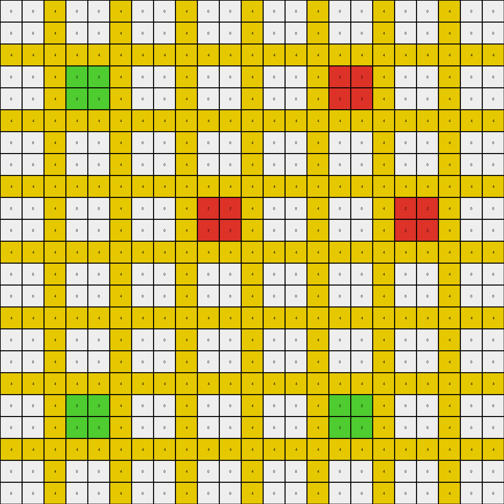

# 06df4c85 • 017 • refine_dreamer

---

Previous Code:
```python
"""
1.  **Identify Horizontal Bands:** Locate the horizontal bands of solid yellow (4) pixels. These bands are three pixels high.

2.  **Identify Islands:** Within each yellow band, identify "islands" of green (3) and red (2) pixels. These islands are 2x2 blocks.

3.  **Propagate Colors (Conditional):**
    *   If a 2x2 island is green (3): Expand the green color horizontally to the left and right *within* the yellow band. The expansion fills the yellow band, replacing any yellow (4) pixels.
    *   If a 2x2 island is red (2): Expand the red color horizontally to the left and right *within* the yellow band, replacing any yellow (4) pixels. Furthermore, if the row immediately above has green, do not replace yellow with red.

4.  **No Change Outside Bands:** Pixels outside the identified yellow bands remain unchanged.
"""

import numpy as np

def find_horizontal_bands(grid, band_color, band_height):
    bands = []
    rows, cols = grid.shape
    for r in range(rows - band_height + 1):
        is_band = True
        for i in range(band_height):
            if not np.all(grid[r + i, :] == band_color):
                is_band = False
                break
        if is_band:
            bands.append(r)
    return bands

def is_island(grid, r, c, color):
    rows, cols = grid.shape
    if r + 1 >= rows or c + 1 >= cols:
        return False
    return (grid[r, c] == color and
            grid[r + 1, c] == color and
            grid[r, c + 1] == color and
            grid[r + 1, c + 1] == color)

def propagate_color_in_band(grid, band_start_row, band_height, color):
    for r in range(band_start_row, band_start_row + band_height):
        for c in range(grid.shape[1]):
            if grid[r,c] == 4:  # Only replace yellow pixels
              grid[r, c] = color

def transform(input_grid):
    # Initialize output grid as a copy of the input grid
    output_grid = np.copy(input_grid)
    rows, cols = output_grid.shape

    # Find horizontal bands of yellow (4) with height 3
    yellow_bands = find_horizontal_bands(output_grid, 4, 3)

    # Iterate through each yellow band
    for band_start_row in yellow_bands:
        # Iterate within the band to find islands
        for r in range(band_start_row, band_start_row + 3):
            for c in range(cols):
                # Green island propagation
                if is_island(output_grid, r, c, 3):
                    propagate_color_in_band(output_grid, band_start_row, 3, 3)
                # Red island propagation
                elif is_island(output_grid, r, c, 2):
                    # Check for green in the row above
                    if r > band_start_row and 3 in output_grid[r - 1, :]:
                        continue  # Skip red propagation
                    else:
                        propagate_color_in_band(output_grid, band_start_row, 3, 2)

    return output_grid
```

Train Set Results:

## Example 1:

Input:
```
0 0 8 0 0 8 0 0 8 0 0 8 0 0 8 0 0 8 0 0
0 0 8 0 0 8 0 0 8 0 0 8 0 0 8 0 0 8 0 0
8 8 8 8 8 8 8 8 8 8 8 8 8 8 8 8 8 8 8 8
0 0 8 2 2 8 0 0 8 0 0 8 0 0 8 2 2 8 0 0
0 0 8 2 2 8 0 0 8 0 0 8 0 0 8 2 2 8 0 0
8 8 8 8 8 8 8 8 8 8 8 8 8 8 8 8 8 8 8 8
0 0 8 0 0 8 0 0 8 1 1 8 0 0 8 0 0 8 0 0
0 0 8 0 0 8 0 0 8 1 1 8 0 0 8 0 0 8 0 0
8 8 8 8 8 8 8 8 8 8 8 8 8 8 8 8 8 8 8 8
0 0 8 0 0 8 0 0 8 0 0 8 0 0 8 2 2 8 0 0
0 0 8 0 0 8 0 0 8 0 0 8 0 0 8 2 2 8 0 0
8 8 8 8 8 8 8 8 8 8 8 8 8 8 8 8 8 8 8 8
0 0 8 3 3 8 0 0 8 3 3 8 0 0 8 0 0 8 0 0
0 0 8 3 3 8 0 0 8 3 3 8 0 0 8 0 0 8 0 0
8 8 8 8 8 8 8 8 8 8 8 8 8 8 8 8 8 8 8 8
0 0 8 0 0 8 0 0 8 0 0 8 0 0 8 0 0 8 0 0
0 0 8 0 0 8 0 0 8 0 0 8 0 0 8 0 0 8 0 0
8 8 8 8 8 8 8 8 8 8 8 8 8 8 8 8 8 8 8 8
0 0 8 0 0 8 0 0 8 0 0 8 0 0 8 0 0 8 0 0
0 0 8 0 0 8 0 0 8 0 0 8 0 0 8 0 0 8 0 0
```
Expected Output:
```
0 0 8 0 0 8 0 0 8 0 0 8 0 0 8 0 0 8 0 0
0 0 8 0 0 8 0 0 8 0 0 8 0 0 8 0 0 8 0 0
8 8 8 8 8 8 8 8 8 8 8 8 8 8 8 8 8 8 8 8
0 0 8 2 2 8 2 2 8 2 2 8 2 2 8 2 2 8 0 0
0 0 8 2 2 8 2 2 8 2 2 8 2 2 8 2 2 8 0 0
8 8 8 8 8 8 8 8 8 8 8 8 8 8 8 8 8 8 8 8
0 0 8 0 0 8 0 0 8 1 1 8 0 0 8 2 2 8 0 0
0 0 8 0 0 8 0 0 8 1 1 8 0 0 8 2 2 8 0 0
8 8 8 8 8 8 8 8 8 8 8 8 8 8 8 8 8 8 8 8
0 0 8 0 0 8 0 0 8 0 0 8 0 0 8 2 2 8 0 0
0 0 8 0 0 8 0 0 8 0 0 8 0 0 8 2 2 8 0 0
8 8 8 8 8 8 8 8 8 8 8 8 8 8 8 8 8 8 8 8
0 0 8 3 3 8 3 3 8 3 3 8 0 0 8 0 0 8 0 0
0 0 8 3 3 8 3 3 8 3 3 8 0 0 8 0 0 8 0 0
8 8 8 8 8 8 8 8 8 8 8 8 8 8 8 8 8 8 8 8
0 0 8 0 0 8 0 0 8 0 0 8 0 0 8 0 0 8 0 0
0 0 8 0 0 8 0 0 8 0 0 8 0 0 8 0 0 8 0 0
8 8 8 8 8 8 8 8 8 8 8 8 8 8 8 8 8 8 8 8
0 0 8 0 0 8 0 0 8 0 0 8 0 0 8 0 0 8 0 0
0 0 8 0 0 8 0 0 8 0 0 8 0 0 8 0 0 8 0 0
```
Transformed Output:
```
0 0 8 0 0 8 0 0 8 0 0 8 0 0 8 0 0 8 0 0
0 0 8 0 0 8 0 0 8 0 0 8 0 0 8 0 0 8 0 0
8 8 8 8 8 8 8 8 8 8 8 8 8 8 8 8 8 8 8 8
0 0 8 2 2 8 0 0 8 0 0 8 0 0 8 2 2 8 0 0
0 0 8 2 2 8 0 0 8 0 0 8 0 0 8 2 2 8 0 0
8 8 8 8 8 8 8 8 8 8 8 8 8 8 8 8 8 8 8 8
0 0 8 0 0 8 0 0 8 1 1 8 0 0 8 0 0 8 0 0
0 0 8 0 0 8 0 0 8 1 1 8 0 0 8 0 0 8 0 0
8 8 8 8 8 8 8 8 8 8 8 8 8 8 8 8 8 8 8 8
0 0 8 0 0 8 0 0 8 0 0 8 0 0 8 2 2 8 0 0
0 0 8 0 0 8 0 0 8 0 0 8 0 0 8 2 2 8 0 0
8 8 8 8 8 8 8 8 8 8 8 8 8 8 8 8 8 8 8 8
0 0 8 3 3 8 0 0 8 3 3 8 0 0 8 0 0 8 0 0
0 0 8 3 3 8 0 0 8 3 3 8 0 0 8 0 0 8 0 0
8 8 8 8 8 8 8 8 8 8 8 8 8 8 8 8 8 8 8 8
0 0 8 0 0 8 0 0 8 0 0 8 0 0 8 0 0 8 0 0
0 0 8 0 0 8 0 0 8 0 0 8 0 0 8 0 0 8 0 0
8 8 8 8 8 8 8 8 8 8 8 8 8 8 8 8 8 8 8 8
0 0 8 0 0 8 0 0 8 0 0 8 0 0 8 0 0 8 0 0
0 0 8 0 0 8 0 0 8 0 0 8 0 0 8 0 0 8 0 0
```

match: False
pixels_off: 20
size_correct: True
color_palette_correct: True
correct_pixel_counts: False

## Example 2:

Input:
```
0 0 1 0 0 1 0 0 1 0 0 1 0 0 1 0 0 1 0 0 1 0 0
0 0 1 0 0 1 0 0 1 0 0 1 0 0 1 0 0 1 0 0 1 0 0
1 1 1 1 1 1 1 1 1 1 1 1 1 1 1 1 1 1 1 1 1 1 1
0 0 1 2 2 1 0 0 1 0 0 1 4 4 1 0 0 1 0 0 1 0 0
0 0 1 2 2 1 0 0 1 0 0 1 4 4 1 0 0 1 0 0 1 0 0
1 1 1 1 1 1 1 1 1 1 1 1 1 1 1 1 1 1 1 1 1 1 1
0 0 1 0 0 1 0 0 1 0 0 1 0 0 1 0 0 1 0 0 1 0 0
0 0 1 0 0 1 0 0 1 0 0 1 0 0 1 0 0 1 0 0 1 0 0
1 1 1 1 1 1 1 1 1 1 1 1 1 1 1 1 1 1 1 1 1 1 1
0 0 1 0 0 1 0 0 1 9 9 1 0 0 1 0 0 1 0 0 1 9 9
0 0 1 0 0 1 0 0 1 9 9 1 0 0 1 0 0 1 0 0 1 9 9
1 1 1 1 1 1 1 1 1 1 1 1 1 1 1 1 1 1 1 1 1 1 1
0 0 1 0 0 1 0 0 1 0 0 1 0 0 1 0 0 1 8 8 1 0 0
0 0 1 0 0 1 0 0 1 0 0 1 0 0 1 0 0 1 8 8 1 0 0
1 1 1 1 1 1 1 1 1 1 1 1 1 1 1 1 1 1 1 1 1 1 1
0 0 1 2 2 1 0 0 1 0 0 1 0 0 1 0 0 1 0 0 1 0 0
0 0 1 2 2 1 0 0 1 0 0 1 0 0 1 0 0 1 0 0 1 0 0
1 1 1 1 1 1 1 1 1 1 1 1 1 1 1 1 1 1 1 1 1 1 1
0 0 1 0 0 1 0 0 1 8 8 1 0 0 1 0 0 1 8 8 1 0 0
0 0 1 0 0 1 0 0 1 8 8 1 0 0 1 0 0 1 8 8 1 0 0
1 1 1 1 1 1 1 1 1 1 1 1 1 1 1 1 1 1 1 1 1 1 1
0 0 1 0 0 1 0 0 1 0 0 1 0 0 1 0 0 1 0 0 1 0 0
0 0 1 0 0 1 0 0 1 0 0 1 0 0 1 0 0 1 0 0 1 0 0
```
Expected Output:
```
0 0 1 0 0 1 0 0 1 0 0 1 0 0 1 0 0 1 0 0 1 0 0
0 0 1 0 0 1 0 0 1 0 0 1 0 0 1 0 0 1 0 0 1 0 0
1 1 1 1 1 1 1 1 1 1 1 1 1 1 1 1 1 1 1 1 1 1 1
0 0 1 2 2 1 0 0 1 0 0 1 4 4 1 0 0 1 0 0 1 0 0
0 0 1 2 2 1 0 0 1 0 0 1 4 4 1 0 0 1 0 0 1 0 0
1 1 1 1 1 1 1 1 1 1 1 1 1 1 1 1 1 1 1 1 1 1 1
0 0 1 2 2 1 0 0 1 0 0 1 0 0 1 0 0 1 0 0 1 0 0
0 0 1 2 2 1 0 0 1 0 0 1 0 0 1 0 0 1 0 0 1 0 0
1 1 1 1 1 1 1 1 1 1 1 1 1 1 1 1 1 1 1 1 1 1 1
0 0 1 2 2 1 0 0 1 9 9 1 9 9 1 9 9 1 9 9 1 9 9
0 0 1 2 2 1 0 0 1 9 9 1 9 9 1 9 9 1 9 9 1 9 9
1 1 1 1 1 1 1 1 1 1 1 1 1 1 1 1 1 1 1 1 1 1 1
0 0 1 2 2 1 0 0 1 0 0 1 0 0 1 0 0 1 8 8 1 0 0
0 0 1 2 2 1 0 0 1 0 0 1 0 0 1 0 0 1 8 8 1 0 0
1 1 1 1 1 1 1 1 1 1 1 1 1 1 1 1 1 1 1 1 1 1 1
0 0 1 2 2 1 0 0 1 0 0 1 0 0 1 0 0 1 8 8 1 0 0
0 0 1 2 2 1 0 0 1 0 0 1 0 0 1 0 0 1 8 8 1 0 0
1 1 1 1 1 1 1 1 1 1 1 1 1 1 1 1 1 1 1 1 1 1 1
0 0 1 0 0 1 0 0 1 8 8 1 8 8 1 8 8 1 8 8 1 0 0
0 0 1 0 0 1 0 0 1 8 8 1 8 8 1 8 8 1 8 8 1 0 0
1 1 1 1 1 1 1 1 1 1 1 1 1 1 1 1 1 1 1 1 1 1 1
0 0 1 0 0 1 0 0 1 0 0 1 0 0 1 0 0 1 0 0 1 0 0
0 0 1 0 0 1 0 0 1 0 0 1 0 0 1 0 0 1 0 0 1 0 0
```
Transformed Output:
```
0 0 1 0 0 1 0 0 1 0 0 1 0 0 1 0 0 1 0 0 1 0 0
0 0 1 0 0 1 0 0 1 0 0 1 0 0 1 0 0 1 0 0 1 0 0
1 1 1 1 1 1 1 1 1 1 1 1 1 1 1 1 1 1 1 1 1 1 1
0 0 1 2 2 1 0 0 1 0 0 1 4 4 1 0 0 1 0 0 1 0 0
0 0 1 2 2 1 0 0 1 0 0 1 4 4 1 0 0 1 0 0 1 0 0
1 1 1 1 1 1 1 1 1 1 1 1 1 1 1 1 1 1 1 1 1 1 1
0 0 1 0 0 1 0 0 1 0 0 1 0 0 1 0 0 1 0 0 1 0 0
0 0 1 0 0 1 0 0 1 0 0 1 0 0 1 0 0 1 0 0 1 0 0
1 1 1 1 1 1 1 1 1 1 1 1 1 1 1 1 1 1 1 1 1 1 1
0 0 1 0 0 1 0 0 1 9 9 1 0 0 1 0 0 1 0 0 1 9 9
0 0 1 0 0 1 0 0 1 9 9 1 0 0 1 0 0 1 0 0 1 9 9
1 1 1 1 1 1 1 1 1 1 1 1 1 1 1 1 1 1 1 1 1 1 1
0 0 1 0 0 1 0 0 1 0 0 1 0 0 1 0 0 1 8 8 1 0 0
0 0 1 0 0 1 0 0 1 0 0 1 0 0 1 0 0 1 8 8 1 0 0
1 1 1 1 1 1 1 1 1 1 1 1 1 1 1 1 1 1 1 1 1 1 1
0 0 1 2 2 1 0 0 1 0 0 1 0 0 1 0 0 1 0 0 1 0 0
0 0 1 2 2 1 0 0 1 0 0 1 0 0 1 0 0 1 0 0 1 0 0
1 1 1 1 1 1 1 1 1 1 1 1 1 1 1 1 1 1 1 1 1 1 1
0 0 1 0 0 1 0 0 1 8 8 1 0 0 1 0 0 1 8 8 1 0 0
0 0 1 0 0 1 0 0 1 8 8 1 0 0 1 0 0 1 8 8 1 0 0
1 1 1 1 1 1 1 1 1 1 1 1 1 1 1 1 1 1 1 1 1 1 1
0 0 1 0 0 1 0 0 1 0 0 1 0 0 1 0 0 1 0 0 1 0 0
0 0 1 0 0 1 0 0 1 0 0 1 0 0 1 0 0 1 0 0 1 0 0
```

match: False
pixels_off: 36
size_correct: True
color_palette_correct: True
correct_pixel_counts: False

## Example 3:

Input:
```
0 0 4 0 0 4 0 0 4 0 0 4 0 0 4 0 0 4 0 0 4 0 0
0 0 4 0 0 4 0 0 4 0 0 4 0 0 4 0 0 4 0 0 4 0 0
4 4 4 4 4 4 4 4 4 4 4 4 4 4 4 4 4 4 4 4 4 4 4
0 0 4 3 3 4 0 0 4 0 0 4 0 0 4 2 2 4 0 0 4 0 0
0 0 4 3 3 4 0 0 4 0 0 4 0 0 4 2 2 4 0 0 4 0 0
4 4 4 4 4 4 4 4 4 4 4 4 4 4 4 4 4 4 4 4 4 4 4
0 0 4 0 0 4 0 0 4 0 0 4 0 0 4 0 0 4 0 0 4 0 0
0 0 4 0 0 4 0 0 4 0 0 4 0 0 4 0 0 4 0 0 4 0 0
4 4 4 4 4 4 4 4 4 4 4 4 4 4 4 4 4 4 4 4 4 4 4
0 0 4 0 0 4 0 0 4 2 2 4 0 0 4 0 0 4 2 2 4 0 0
0 0 4 0 0 4 0 0 4 2 2 4 0 0 4 0 0 4 2 2 4 0 0
4 4 4 4 4 4 4 4 4 4 4 4 4 4 4 4 4 4 4 4 4 4 4
0 0 4 0 0 4 0 0 4 0 0 4 0 0 4 0 0 4 0 0 4 0 0
0 0 4 0 0 4 0 0 4 0 0 4 0 0 4 0 0 4 0 0 4 0 0
4 4 4 4 4 4 4 4 4 4 4 4 4 4 4 4 4 4 4 4 4 4 4
0 0 4 0 0 4 0 0 4 0 0 4 0 0 4 0 0 4 0 0 4 0 0
0 0 4 0 0 4 0 0 4 0 0 4 0 0 4 0 0 4 0 0 4 0 0
4 4 4 4 4 4 4 4 4 4 4 4 4 4 4 4 4 4 4 4 4 4 4
0 0 4 3 3 4 0 0 4 0 0 4 0 0 4 3 3 4 0 0 4 0 0
0 0 4 3 3 4 0 0 4 0 0 4 0 0 4 3 3 4 0 0 4 0 0
4 4 4 4 4 4 4 4 4 4 4 4 4 4 4 4 4 4 4 4 4 4 4
0 0 4 0 0 4 0 0 4 0 0 4 0 0 4 0 0 4 0 0 4 0 0
0 0 4 0 0 4 0 0 4 0 0 4 0 0 4 0 0 4 0 0 4 0 0
```
Expected Output:
```
0 0 4 0 0 4 0 0 4 0 0 4 0 0 4 0 0 4 0 0 4 0 0
0 0 4 0 0 4 0 0 4 0 0 4 0 0 4 0 0 4 0 0 4 0 0
4 4 4 4 4 4 4 4 4 4 4 4 4 4 4 4 4 4 4 4 4 4 4
0 0 4 3 3 4 0 0 4 0 0 4 0 0 4 2 2 4 0 0 4 0 0
0 0 4 3 3 4 0 0 4 0 0 4 0 0 4 2 2 4 0 0 4 0 0
4 4 4 4 4 4 4 4 4 4 4 4 4 4 4 4 4 4 4 4 4 4 4
0 0 4 3 3 4 0 0 4 0 0 4 0 0 4 0 0 4 0 0 4 0 0
0 0 4 3 3 4 0 0 4 0 0 4 0 0 4 0 0 4 0 0 4 0 0
4 4 4 4 4 4 4 4 4 4 4 4 4 4 4 4 4 4 4 4 4 4 4
0 0 4 3 3 4 0 0 4 2 2 4 2 2 4 2 2 4 2 2 4 0 0
0 0 4 3 3 4 0 0 4 2 2 4 2 2 4 2 2 4 2 2 4 0 0
4 4 4 4 4 4 4 4 4 4 4 4 4 4 4 4 4 4 4 4 4 4 4
0 0 4 3 3 4 0 0 4 0 0 4 0 0 4 0 0 4 0 0 4 0 0
0 0 4 3 3 4 0 0 4 0 0 4 0 0 4 0 0 4 0 0 4 0 0
4 4 4 4 4 4 4 4 4 4 4 4 4 4 4 4 4 4 4 4 4 4 4
0 0 4 3 3 4 0 0 4 0 0 4 0 0 4 0 0 4 0 0 4 0 0
0 0 4 3 3 4 0 0 4 0 0 4 0 0 4 0 0 4 0 0 4 0 0
4 4 4 4 4 4 4 4 4 4 4 4 4 4 4 4 4 4 4 4 4 4 4
0 0 4 3 3 4 3 3 4 3 3 4 3 3 4 3 3 4 0 0 4 0 0
0 0 4 3 3 4 3 3 4 3 3 4 3 3 4 3 3 4 0 0 4 0 0
4 4 4 4 4 4 4 4 4 4 4 4 4 4 4 4 4 4 4 4 4 4 4
0 0 4 0 0 4 0 0 4 0 0 4 0 0 4 0 0 4 0 0 4 0 0
0 0 4 0 0 4 0 0 4 0 0 4 0 0 4 0 0 4 0 0 4 0 0
```
Transformed Output:
```
0 0 4 0 0 4 0 0 4 0 0 4 0 0 4 0 0 4 0 0 4 0 0
0 0 4 0 0 4 0 0 4 0 0 4 0 0 4 0 0 4 0 0 4 0 0
4 4 4 4 4 4 4 4 4 4 4 4 4 4 4 4 4 4 4 4 4 4 4
0 0 4 3 3 4 0 0 4 0 0 4 0 0 4 2 2 4 0 0 4 0 0
0 0 4 3 3 4 0 0 4 0 0 4 0 0 4 2 2 4 0 0 4 0 0
4 4 4 4 4 4 4 4 4 4 4 4 4 4 4 4 4 4 4 4 4 4 4
0 0 4 0 0 4 0 0 4 0 0 4 0 0 4 0 0 4 0 0 4 0 0
0 0 4 0 0 4 0 0 4 0 0 4 0 0 4 0 0 4 0 0 4 0 0
4 4 4 4 4 4 4 4 4 4 4 4 4 4 4 4 4 4 4 4 4 4 4
0 0 4 0 0 4 0 0 4 2 2 4 0 0 4 0 0 4 2 2 4 0 0
0 0 4 0 0 4 0 0 4 2 2 4 0 0 4 0 0 4 2 2 4 0 0
4 4 4 4 4 4 4 4 4 4 4 4 4 4 4 4 4 4 4 4 4 4 4
0 0 4 0 0 4 0 0 4 0 0 4 0 0 4 0 0 4 0 0 4 0 0
0 0 4 0 0 4 0 0 4 0 0 4 0 0 4 0 0 4 0 0 4 0 0
4 4 4 4 4 4 4 4 4 4 4 4 4 4 4 4 4 4 4 4 4 4 4
0 0 4 0 0 4 0 0 4 0 0 4 0 0 4 0 0 4 0 0 4 0 0
0 0 4 0 0 4 0 0 4 0 0 4 0 0 4 0 0 4 0 0 4 0 0
4 4 4 4 4 4 4 4 4 4 4 4 4 4 4 4 4 4 4 4 4 4 4
0 0 4 3 3 4 0 0 4 0 0 4 0 0 4 3 3 4 0 0 4 0 0
0 0 4 3 3 4 0 0 4 0 0 4 0 0 4 3 3 4 0 0 4 0 0
4 4 4 4 4 4 4 4 4 4 4 4 4 4 4 4 4 4 4 4 4 4 4
0 0 4 0 0 4 0 0 4 0 0 4 0 0 4 0 0 4 0 0 4 0 0
0 0 4 0 0 4 0 0 4 0 0 4 0 0 4 0 0 4 0 0 4 0 0
```

match: False
pixels_off: 36
size_correct: True
color_palette_correct: True
correct_pixel_counts: False
**INSTRUCTIONS**

The code above was generated based on observations from the first training
example

we have tested the transform function on each of the task example inputs and
compared with the expected output

review each of the examples provided and the results and consider how the
natural language program should be updated to accommodate this new knowledge

respond with the following deliverables:

- general assessment of the information provided and strategy for resolving the
  errors
- gather metrics about each of the examples and results - use code_execution to
  develop accurate reports on your assumptions
- a YAML block documenting facts - Focus on identifying objects, their properties, and the actions performed on them.
- a natural language program - Be as clear and concise as possible, providing a complete description of the transformation rule.


your responses should be considered as information in a report - not a
conversation
