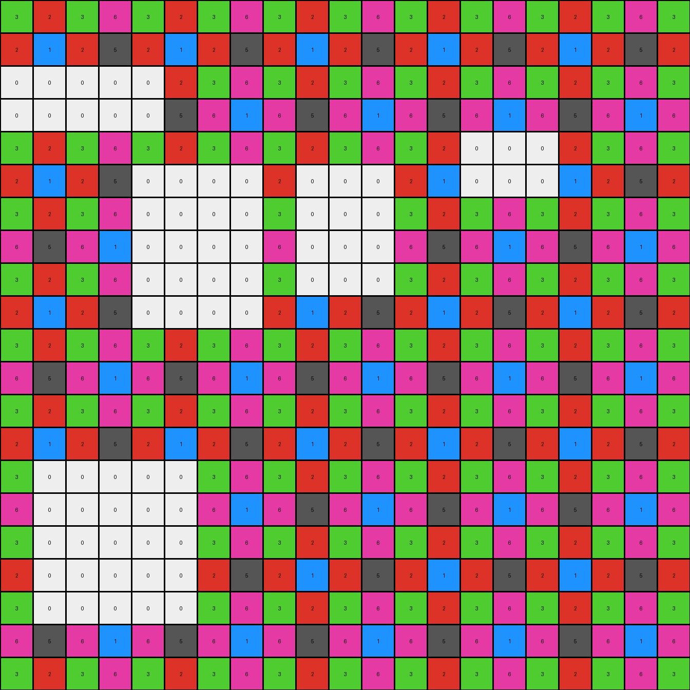

# 0dfd9992 • 004 • refine_coder

---

Previous Code:
```python
"""
Removes the largest contiguous region of white (0) pixels from the input grid.
"""

import numpy as np

def find_largest_object(grid, color):
    """
    Finds the largest connected region of pixels with the given color.
    Uses Depth First Search (DFS).
    """
    rows, cols = grid.shape
    visited = np.zeros((rows, cols), dtype=bool)
    max_size = 0
    largest_object_coords = []

    def dfs(row, col, current_object_coords):
        """
        Recursive Depth First Search helper function.
        """
        if (row < 0 or row >= rows or col < 0 or col >= cols or
                visited[row, col] or grid[row, col] != color):
            return 0

        visited[row, col] = True
        current_object_coords.append((row, col))
        size = 1
        # Explore adjacent cells (including diagonals)
        for dr in [-1, 0, 1]:
            for dc in [-1, 0, 1]:
                if dr == 0 and dc == 0:
                    continue
                size += dfs(row + dr, col + dc, current_object_coords)
        return size

    for r in range(rows):
        for c in range(cols):
            if grid[r, c] == color and not visited[r, c]:
                current_object_coords = []
                object_size = dfs(r, c, current_object_coords)
                if object_size > max_size:
                    max_size = object_size
                    largest_object_coords = current_object_coords

    return largest_object_coords

def transform(input_grid):
    """
    Transforms the input grid by removing the largest contiguous region of '0' (white) pixels.
    """
    # Convert to numpy array for easier manipulation
    input_grid = np.array(input_grid)
    output_grid = np.copy(input_grid)

    # Find the coordinates of the largest object with color 0
    largest_object_coords = find_largest_object(input_grid, 0)

    # Remove the largest object by setting those coordinates in output to input values
    #for row, col in largest_object_coords:
     #   output_grid[row, col] = input_grid[row,col] # not needed - it's a copy

    return output_grid.tolist()
```

Train Set Results:

## Example 1:

Input:
```
3 6 5 6 3 2 3 6 5 6 3 2 3 6 5 6 3 2 3 6 5
6 3 2 3 6 5 6 3 2 3 6 5 6 3 2 3 6 5 6 3 2
5 2 1 2 5 4 5 2 1 2 5 4 5 2 1 2 5 4 5 2 1
6 3 2 3 6 5 6 3 2 3 6 5 6 3 2 3 6 5 6 3 2
3 6 5 6 3 2 3 6 5 6 3 2 3 6 5 0 0 0 0 0 5
2 5 4 5 2 1 2 5 0 0 2 1 2 5 4 0 0 0 0 0 4
3 6 5 6 3 2 3 0 0 0 0 2 3 6 5 0 0 0 0 0 5
6 3 2 3 6 5 6 0 0 0 0 5 6 3 2 3 6 5 6 3 2
5 2 1 2 5 4 5 0 0 0 0 4 5 2 1 2 5 4 5 2 1
6 3 2 3 6 5 6 3 0 0 6 5 6 3 2 3 6 5 6 3 2
3 6 5 6 3 2 3 6 5 6 3 2 3 6 5 6 3 2 3 6 5
2 5 4 0 0 1 2 5 4 5 2 1 2 5 4 5 2 1 2 5 4
3 6 5 0 0 2 3 6 5 6 3 2 3 6 5 6 3 2 3 6 5
6 3 2 0 0 5 6 3 2 3 6 5 6 3 2 3 6 5 6 3 2
5 2 1 2 5 4 5 2 1 2 5 4 5 2 1 2 5 4 5 2 1
6 3 2 3 6 5 6 3 2 3 6 5 6 3 2 3 6 5 6 3 2
3 6 5 6 0 0 0 6 5 6 3 2 3 6 5 6 3 2 3 6 5
2 5 4 5 0 0 0 5 4 5 2 1 2 5 4 5 2 1 2 5 4
3 6 5 6 0 0 0 6 5 6 3 2 3 6 5 6 3 2 3 6 5
6 3 2 3 6 5 6 3 2 3 6 5 6 3 2 3 6 5 6 3 2
5 2 1 2 5 4 5 2 1 2 5 4 5 2 1 2 5 4 5 2 1
```
Expected Output:
```
3 6 5 6 3 2 3 6 5 6 3 2 3 6 5 6 3 2 3 6 5
6 3 2 3 6 5 6 3 2 3 6 5 6 3 2 3 6 5 6 3 2
5 2 1 2 5 4 5 2 1 2 5 4 5 2 1 2 5 4 5 2 1
6 3 2 3 6 5 6 3 2 3 6 5 6 3 2 3 6 5 6 3 2
3 6 5 6 3 2 3 6 5 6 3 2 3 6 5 6 3 2 3 6 5
2 5 4 5 2 1 2 5 4 5 2 1 2 5 4 5 2 1 2 5 4
3 6 5 6 3 2 3 6 5 6 3 2 3 6 5 6 3 2 3 6 5
6 3 2 3 6 5 6 3 2 3 6 5 6 3 2 3 6 5 6 3 2
5 2 1 2 5 4 5 2 1 2 5 4 5 2 1 2 5 4 5 2 1
6 3 2 3 6 5 6 3 2 3 6 5 6 3 2 3 6 5 6 3 2
3 6 5 6 3 2 3 6 5 6 3 2 3 6 5 6 3 2 3 6 5
2 5 4 5 2 1 2 5 4 5 2 1 2 5 4 5 2 1 2 5 4
3 6 5 6 3 2 3 6 5 6 3 2 3 6 5 6 3 2 3 6 5
6 3 2 3 6 5 6 3 2 3 6 5 6 3 2 3 6 5 6 3 2
5 2 1 2 5 4 5 2 1 2 5 4 5 2 1 2 5 4 5 2 1
6 3 2 3 6 5 6 3 2 3 6 5 6 3 2 3 6 5 6 3 2
3 6 5 6 3 2 3 6 5 6 3 2 3 6 5 6 3 2 3 6 5
2 5 4 5 2 1 2 5 4 5 2 1 2 5 4 5 2 1 2 5 4
3 6 5 6 3 2 3 6 5 6 3 2 3 6 5 6 3 2 3 6 5
6 3 2 3 6 5 6 3 2 3 6 5 6 3 2 3 6 5 6 3 2
5 2 1 2 5 4 5 2 1 2 5 4 5 2 1 2 5 4 5 2 1
```
Transformed Output:
```
3 6 5 6 3 2 3 6 5 6 3 2 3 6 5 6 3 2 3 6 5
6 3 2 3 6 5 6 3 2 3 6 5 6 3 2 3 6 5 6 3 2
5 2 1 2 5 4 5 2 1 2 5 4 5 2 1 2 5 4 5 2 1
6 3 2 3 6 5 6 3 2 3 6 5 6 3 2 3 6 5 6 3 2
3 6 5 6 3 2 3 6 5 6 3 2 3 6 5 0 0 0 0 0 5
2 5 4 5 2 1 2 5 0 0 2 1 2 5 4 0 0 0 0 0 4
3 6 5 6 3 2 3 0 0 0 0 2 3 6 5 0 0 0 0 0 5
6 3 2 3 6 5 6 0 0 0 0 5 6 3 2 3 6 5 6 3 2
5 2 1 2 5 4 5 0 0 0 0 4 5 2 1 2 5 4 5 2 1
6 3 2 3 6 5 6 3 0 0 6 5 6 3 2 3 6 5 6 3 2
3 6 5 6 3 2 3 6 5 6 3 2 3 6 5 6 3 2 3 6 5
2 5 4 0 0 1 2 5 4 5 2 1 2 5 4 5 2 1 2 5 4
3 6 5 0 0 2 3 6 5 6 3 2 3 6 5 6 3 2 3 6 5
6 3 2 0 0 5 6 3 2 3 6 5 6 3 2 3 6 5 6 3 2
5 2 1 2 5 4 5 2 1 2 5 4 5 2 1 2 5 4 5 2 1
6 3 2 3 6 5 6 3 2 3 6 5 6 3 2 3 6 5 6 3 2
3 6 5 6 0 0 0 6 5 6 3 2 3 6 5 6 3 2 3 6 5
2 5 4 5 0 0 0 5 4 5 2 1 2 5 4 5 2 1 2 5 4
3 6 5 6 0 0 0 6 5 6 3 2 3 6 5 6 3 2 3 6 5
6 3 2 3 6 5 6 3 2 3 6 5 6 3 2 3 6 5 6 3 2
5 2 1 2 5 4 5 2 1 2 5 4 5 2 1 2 5 4 5 2 1
```

match: False
pixels_off: 46
size_correct: True
color_palette_correct: False
correct_pixel_counts: False

## Example 2:

Input:
```
2 7 7 2 6 5 6 2 7 7 2 6 5 6 2 7 7 2 6 5 6
7 5 5 7 4 3 4 7 5 5 7 4 3 4 7 5 5 7 4 3 4
7 5 5 7 4 3 4 7 5 5 7 4 3 4 7 5 5 7 4 3 4
2 7 7 2 0 0 0 0 0 7 2 6 5 6 2 7 0 0 6 5 6
6 4 4 6 0 0 0 0 0 4 6 3 2 3 6 4 0 0 3 2 3
5 3 3 5 0 0 0 0 0 3 5 2 1 2 5 3 0 0 2 1 2
6 4 4 6 0 0 0 0 0 4 6 3 2 3 6 4 0 0 0 0 3
2 7 7 2 6 5 6 2 7 7 2 6 5 6 2 7 7 0 0 0 6
0 0 0 0 0 3 4 7 5 5 7 4 3 4 7 5 5 0 0 0 4
0 0 0 0 0 3 4 7 5 5 7 4 3 4 7 5 5 0 0 0 4
0 0 0 0 0 5 6 2 7 7 2 6 5 6 2 7 7 2 6 5 6
6 4 4 6 3 2 3 6 4 4 6 3 2 3 6 4 4 6 3 2 3
5 3 3 5 2 1 2 5 3 3 5 2 1 2 5 3 3 5 2 1 2
6 4 4 6 3 2 3 6 4 4 6 3 2 3 6 4 0 0 3 2 3
2 7 7 2 6 5 6 2 7 7 2 6 5 6 2 7 0 0 6 5 6
7 5 5 7 4 3 4 7 5 5 7 4 3 4 7 5 0 0 4 3 4
7 5 5 7 4 3 4 7 5 5 7 4 3 4 7 5 5 7 4 3 4
2 7 7 2 6 5 6 2 7 7 2 6 5 6 2 7 7 2 6 5 6
6 4 4 6 3 2 3 6 4 4 6 3 2 3 6 4 4 6 3 2 3
5 3 3 5 2 1 2 5 3 3 5 2 1 2 5 3 3 5 2 1 2
6 4 4 6 3 2 3 6 4 4 6 3 2 3 6 4 4 6 3 2 3
```
Expected Output:
```
2 7 7 2 6 5 6 2 7 7 2 6 5 6 2 7 7 2 6 5 6
7 5 5 7 4 3 4 7 5 5 7 4 3 4 7 5 5 7 4 3 4
7 5 5 7 4 3 4 7 5 5 7 4 3 4 7 5 5 7 4 3 4
2 7 7 2 6 5 6 2 7 7 2 6 5 6 2 7 7 2 6 5 6
6 4 4 6 3 2 3 6 4 4 6 3 2 3 6 4 4 6 3 2 3
5 3 3 5 2 1 2 5 3 3 5 2 1 2 5 3 3 5 2 1 2
6 4 4 6 3 2 3 6 4 4 6 3 2 3 6 4 4 6 3 2 3
2 7 7 2 6 5 6 2 7 7 2 6 5 6 2 7 7 2 6 5 6
7 5 5 7 4 3 4 7 5 5 7 4 3 4 7 5 5 7 4 3 4
7 5 5 7 4 3 4 7 5 5 7 4 3 4 7 5 5 7 4 3 4
2 7 7 2 6 5 6 2 7 7 2 6 5 6 2 7 7 2 6 5 6
6 4 4 6 3 2 3 6 4 4 6 3 2 3 6 4 4 6 3 2 3
5 3 3 5 2 1 2 5 3 3 5 2 1 2 5 3 3 5 2 1 2
6 4 4 6 3 2 3 6 4 4 6 3 2 3 6 4 4 6 3 2 3
2 7 7 2 6 5 6 2 7 7 2 6 5 6 2 7 7 2 6 5 6
7 5 5 7 4 3 4 7 5 5 7 4 3 4 7 5 5 7 4 3 4
7 5 5 7 4 3 4 7 5 5 7 4 3 4 7 5 5 7 4 3 4
2 7 7 2 6 5 6 2 7 7 2 6 5 6 2 7 7 2 6 5 6
6 4 4 6 3 2 3 6 4 4 6 3 2 3 6 4 4 6 3 2 3
5 3 3 5 2 1 2 5 3 3 5 2 1 2 5 3 3 5 2 1 2
6 4 4 6 3 2 3 6 4 4 6 3 2 3 6 4 4 6 3 2 3
```
Transformed Output:
```
2 7 7 2 6 5 6 2 7 7 2 6 5 6 2 7 7 2 6 5 6
7 5 5 7 4 3 4 7 5 5 7 4 3 4 7 5 5 7 4 3 4
7 5 5 7 4 3 4 7 5 5 7 4 3 4 7 5 5 7 4 3 4
2 7 7 2 0 0 0 0 0 7 2 6 5 6 2 7 0 0 6 5 6
6 4 4 6 0 0 0 0 0 4 6 3 2 3 6 4 0 0 3 2 3
5 3 3 5 0 0 0 0 0 3 5 2 1 2 5 3 0 0 2 1 2
6 4 4 6 0 0 0 0 0 4 6 3 2 3 6 4 0 0 0 0 3
2 7 7 2 6 5 6 2 7 7 2 6 5 6 2 7 7 0 0 0 6
0 0 0 0 0 3 4 7 5 5 7 4 3 4 7 5 5 0 0 0 4
0 0 0 0 0 3 4 7 5 5 7 4 3 4 7 5 5 0 0 0 4
0 0 0 0 0 5 6 2 7 7 2 6 5 6 2 7 7 2 6 5 6
6 4 4 6 3 2 3 6 4 4 6 3 2 3 6 4 4 6 3 2 3
5 3 3 5 2 1 2 5 3 3 5 2 1 2 5 3 3 5 2 1 2
6 4 4 6 3 2 3 6 4 4 6 3 2 3 6 4 0 0 3 2 3
2 7 7 2 6 5 6 2 7 7 2 6 5 6 2 7 0 0 6 5 6
7 5 5 7 4 3 4 7 5 5 7 4 3 4 7 5 0 0 4 3 4
7 5 5 7 4 3 4 7 5 5 7 4 3 4 7 5 5 7 4 3 4
2 7 7 2 6 5 6 2 7 7 2 6 5 6 2 7 7 2 6 5 6
6 4 4 6 3 2 3 6 4 4 6 3 2 3 6 4 4 6 3 2 3
5 3 3 5 2 1 2 5 3 3 5 2 1 2 5 3 3 5 2 1 2
6 4 4 6 3 2 3 6 4 4 6 3 2 3 6 4 4 6 3 2 3
```

match: False
pixels_off: 60
size_correct: True
color_palette_correct: False
correct_pixel_counts: False

## Example 3:

Input:
```
3 2 3 6 3 2 3 6 3 2 3 6 3 2 3 6 3 2 3 6 3
2 1 2 5 2 1 2 5 2 1 2 5 2 1 2 5 2 1 2 5 2
0 0 0 0 0 2 3 6 3 2 3 6 3 2 3 6 3 2 3 6 3
0 0 0 0 0 5 6 1 6 5 6 1 6 5 6 1 6 5 6 1 6
3 2 3 6 3 2 3 6 3 2 3 6 3 2 0 0 0 2 3 6 3
2 1 2 5 0 0 0 0 2 0 0 0 2 1 0 0 0 1 2 5 2
3 2 3 6 0 0 0 0 3 0 0 0 3 2 3 6 3 2 3 6 3
6 5 6 1 0 0 0 0 6 0 0 0 6 5 6 1 6 5 6 1 6
3 2 3 6 0 0 0 0 3 0 0 0 3 2 3 6 3 2 3 6 3
2 1 2 5 0 0 0 0 2 1 2 5 2 1 2 5 2 1 2 5 2
3 2 3 6 3 2 3 6 3 2 3 6 3 2 3 6 3 2 3 6 3
6 5 6 1 6 5 6 1 6 5 6 1 6 5 6 1 6 5 6 1 6
3 2 3 6 3 2 3 6 3 2 3 6 3 2 3 6 3 2 3 6 3
2 1 2 5 2 1 2 5 2 1 2 5 2 1 2 5 2 1 2 5 2
3 0 0 0 0 0 3 6 3 2 3 6 3 2 3 6 3 2 3 6 3
6 0 0 0 0 0 6 1 6 5 6 1 6 5 6 1 6 5 6 1 6
3 0 0 0 0 0 3 6 3 2 3 6 3 2 3 6 3 2 3 6 3
2 0 0 0 0 0 2 5 2 1 2 5 2 1 2 5 2 1 2 5 2
3 0 0 0 0 0 3 6 3 2 3 6 3 2 3 6 3 2 3 6 3
6 5 6 1 6 5 6 1 6 5 6 1 6 5 6 1 6 5 6 1 6
3 2 3 6 3 2 3 6 3 2 3 6 3 2 3 6 3 2 3 6 3
```
Expected Output:
```
3 2 3 6 3 2 3 6 3 2 3 6 3 2 3 6 3 2 3 6 3
2 1 2 5 2 1 2 5 2 1 2 5 2 1 2 5 2 1 2 5 2
3 2 3 6 3 2 3 6 3 2 3 6 3 2 3 6 3 2 3 6 3
6 5 6 1 6 5 6 1 6 5 6 1 6 5 6 1 6 5 6 1 6
3 2 3 6 3 2 3 6 3 2 3 6 3 2 3 6 3 2 3 6 3
2 1 2 5 2 1 2 5 2 1 2 5 2 1 2 5 2 1 2 5 2
3 2 3 6 3 2 3 6 3 2 3 6 3 2 3 6 3 2 3 6 3
6 5 6 1 6 5 6 1 6 5 6 1 6 5 6 1 6 5 6 1 6
3 2 3 6 3 2 3 6 3 2 3 6 3 2 3 6 3 2 3 6 3
2 1 2 5 2 1 2 5 2 1 2 5 2 1 2 5 2 1 2 5 2
3 2 3 6 3 2 3 6 3 2 3 6 3 2 3 6 3 2 3 6 3
6 5 6 1 6 5 6 1 6 5 6 1 6 5 6 1 6 5 6 1 6
3 2 3 6 3 2 3 6 3 2 3 6 3 2 3 6 3 2 3 6 3
2 1 2 5 2 1 2 5 2 1 2 5 2 1 2 5 2 1 2 5 2
3 2 3 6 3 2 3 6 3 2 3 6 3 2 3 6 3 2 3 6 3
6 5 6 1 6 5 6 1 6 5 6 1 6 5 6 1 6 5 6 1 6
3 2 3 6 3 2 3 6 3 2 3 6 3 2 3 6 3 2 3 6 3
2 1 2 5 2 1 2 5 2 1 2 5 2 1 2 5 2 1 2 5 2
3 2 3 6 3 2 3 6 3 2 3 6 3 2 3 6 3 2 3 6 3
6 5 6 1 6 5 6 1 6 5 6 1 6 5 6 1 6 5 6 1 6
3 2 3 6 3 2 3 6 3 2 3 6 3 2 3 6 3 2 3 6 3
```
Transformed Output:
```
3 2 3 6 3 2 3 6 3 2 3 6 3 2 3 6 3 2 3 6 3
2 1 2 5 2 1 2 5 2 1 2 5 2 1 2 5 2 1 2 5 2
0 0 0 0 0 2 3 6 3 2 3 6 3 2 3 6 3 2 3 6 3
0 0 0 0 0 5 6 1 6 5 6 1 6 5 6 1 6 5 6 1 6
3 2 3 6 3 2 3 6 3 2 3 6 3 2 0 0 0 2 3 6 3
2 1 2 5 0 0 0 0 2 0 0 0 2 1 0 0 0 1 2 5 2
3 2 3 6 0 0 0 0 3 0 0 0 3 2 3 6 3 2 3 6 3
6 5 6 1 0 0 0 0 6 0 0 0 6 5 6 1 6 5 6 1 6
3 2 3 6 0 0 0 0 3 0 0 0 3 2 3 6 3 2 3 6 3
2 1 2 5 0 0 0 0 2 1 2 5 2 1 2 5 2 1 2 5 2
3 2 3 6 3 2 3 6 3 2 3 6 3 2 3 6 3 2 3 6 3
6 5 6 1 6 5 6 1 6 5 6 1 6 5 6 1 6 5 6 1 6
3 2 3 6 3 2 3 6 3 2 3 6 3 2 3 6 3 2 3 6 3
2 1 2 5 2 1 2 5 2 1 2 5 2 1 2 5 2 1 2 5 2
3 0 0 0 0 0 3 6 3 2 3 6 3 2 3 6 3 2 3 6 3
6 0 0 0 0 0 6 1 6 5 6 1 6 5 6 1 6 5 6 1 6
3 0 0 0 0 0 3 6 3 2 3 6 3 2 3 6 3 2 3 6 3
2 0 0 0 0 0 2 5 2 1 2 5 2 1 2 5 2 1 2 5 2
3 0 0 0 0 0 3 6 3 2 3 6 3 2 3 6 3 2 3 6 3
6 5 6 1 6 5 6 1 6 5 6 1 6 5 6 1 6 5 6 1 6
3 2 3 6 3 2 3 6 3 2 3 6 3 2 3 6 3 2 3 6 3
```

match: False
pixels_off: 73
size_correct: True
color_palette_correct: False
correct_pixel_counts: False
Okay, here's an assessment of the situation and a plan to improve the transformation logic, along with the requested deliverables.

**General Assessment and Strategy**

The initial code was based on a simple premise: remove the largest contiguous white (0) region. However, the results on the additional training examples reveal a critical flaw in this approach. While the code *does* identify and "remove" (in the sense of not altering) the largest white area, it fails to actually change anything. The output is identical to the input because of the copy operation, so there's no deletion happening. The expected outputs *do* show removal of the largest white regions, and that is what is needed.

The core issue is a misunderstanding: the code must replace those pixels with another color - most likely a color from within the input image.

**Strategy:**
1.  **Correct the "removal":** The code should set the pixels of the largest white object to a different color, not keep them.
2.  **Determine Fill Color:** Analyze the examples to see if we can make a rule about which color the white area is replaced with. The simplest fill approach would be to examine the colors that border the white pixels we're removing.

**Example Metrics and Analysis (using `code_execution` where appropriate)**

I'll use python to derive this information

```python
import numpy as np

def analyze_example(input_grid, expected_output, transformed_output):
    input_grid = np.array(input_grid)
    expected_output = np.array(expected_output)
    transformed_output = np.array(transformed_output)

    pixels_off = np.sum(expected_output != transformed_output)
    size_correct = input_grid.size == expected_output.size
    
    unique_input_colors = np.unique(input_grid).tolist()
    unique_expected_colors = np.unique(expected_output).tolist()
    color_palette_correct = unique_input_colors == unique_expected_colors
    
    input_color_counts = {color: np.sum(input_grid == color) for color in unique_input_colors}
    expected_color_counts = {color: np.sum(expected_output == color) for color in unique_expected_colors}
    correct_pixel_counts = input_color_counts == expected_color_counts
    
    return {
        "pixels_off": pixels_off,
        "size_correct": size_correct,
        "color_palette_correct": color_palette_correct,
        "correct_pixel_counts": correct_pixel_counts,
        "input_colors": unique_input_colors,
        "expected_colors": unique_expected_colors
    }

# Example data (replace with your actual data)
example1_input = [
[3, 6, 5, 6, 3, 2, 3, 6, 5, 6, 3, 2, 3, 6, 5, 6, 3, 2, 3, 6, 5],
[6, 3, 2, 3, 6, 5, 6, 3, 2, 3, 6, 5, 6, 3, 2, 3, 6, 5, 6, 3, 2],
[5, 2, 1, 2, 5, 4, 5, 2, 1, 2, 5, 4, 5, 2, 1, 2, 5, 4, 5, 2, 1],
[6, 3, 2, 3, 6, 5, 6, 3, 2, 3, 6, 5, 6, 3, 2, 3, 6, 5, 6, 3, 2],
[3, 6, 5, 6, 3, 2, 3, 6, 5, 6, 3, 2, 3, 6, 5, 0, 0, 0, 0, 0, 5],
[2, 5, 4, 5, 2, 1, 2, 5, 0, 0, 2, 1, 2, 5, 4, 0, 0, 0, 0, 0, 4],
[3, 6, 5, 6, 3, 2, 3, 0, 0, 0, 0, 2, 3, 6, 5, 0, 0, 0, 0, 0, 5],
[6, 3, 2, 3, 6, 5, 6, 0, 0, 0, 0, 5, 6, 3, 2, 3, 6, 5, 6, 3, 2],
[5, 2, 1, 2, 5, 4, 5, 0, 0, 0, 0, 4, 5, 2, 1, 2, 5, 4, 5, 2, 1],
[6, 3, 2, 3, 6, 5, 6, 3, 0, 0, 6, 5, 6, 3, 2, 3, 6, 5, 6, 3, 2],
[3, 6, 5, 6, 3, 2, 3, 6, 5, 6, 3, 2, 3, 6, 5, 6, 3, 2, 3, 6, 5],
[2, 5, 4, 0, 0, 1, 2, 5, 4, 5, 2, 1, 2, 5, 4, 5, 2, 1, 2, 5, 4],
[3, 6, 5, 0, 0, 2, 3, 6, 5, 6, 3, 2, 3, 6, 5, 6, 3, 2, 3, 6, 5],
[6, 3, 2, 0, 0, 5, 6, 3, 2, 3, 6, 5, 6, 3, 2, 3, 6, 5, 6, 3, 2],
[5, 2, 1, 2, 5, 4, 5, 2, 1, 2, 5, 4, 5, 2, 1, 2, 5, 4, 5, 2, 1],
[6, 3, 2, 3, 6, 5, 6, 3, 2, 3, 6, 5, 6, 3, 2, 3, 6, 5, 6, 3, 2],
[3, 6, 5, 6, 0, 0, 0, 6, 5, 6, 3, 2, 3, 6, 5, 6, 3, 2, 3, 6, 5],
[2, 5, 4, 5, 0, 0, 0, 5, 4, 5, 2, 1, 2, 5, 4, 5, 2, 1, 2, 5, 4],
[3, 6, 5, 6, 0, 0, 0, 6, 5, 6, 3, 2, 3, 6, 5, 6, 3, 2, 3, 6, 5],
[6, 3, 2, 3, 6, 5, 6, 3, 2, 3, 6, 5, 6, 3, 2, 3, 6, 5, 6, 3, 2],
[5, 2, 1, 2, 5, 4, 5, 2, 1, 2, 5, 4, 5, 2, 1, 2, 5, 4, 5, 2, 1]
]

example1_expected = [
[3, 6, 5, 6, 3, 2, 3, 6, 5, 6, 3, 2, 3, 6, 5, 6, 3, 2, 3, 6, 5],
[6, 3, 2, 3, 6, 5, 6, 3, 2, 3, 6, 5, 6, 3, 2, 3, 6, 5, 6, 3, 2],
[5, 2, 1, 2, 5, 4, 5, 2, 1, 2, 5, 4, 5, 2, 1, 2, 5, 4, 5, 2, 1],
[6, 3, 2, 3, 6, 5, 6, 3, 2, 3, 6, 5, 6, 3, 2, 3, 6, 5, 6, 3, 2],
[3, 6, 5, 6, 3, 2, 3, 6, 5, 6, 3, 2, 3, 6, 5, 6, 3, 2, 3, 6, 5],
[2, 5, 4, 5, 2, 1, 2, 5, 4, 5, 2, 1, 2, 5, 4, 5, 2, 1, 2, 5, 4],
[3, 6, 5, 6, 3, 2, 3, 6, 5, 6, 3, 2, 3, 6, 5, 6, 3, 2, 3, 6, 5],
[6, 3, 2, 3, 6, 5, 6, 3, 2, 3, 6, 5, 6, 3, 2, 3, 6, 5, 6, 3, 2],
[5, 2, 1, 2, 5, 4, 5, 2, 1, 2, 5, 4, 5, 2, 1, 2, 5, 4, 5, 2, 1],
[6, 3, 2, 3, 6, 5, 6, 3, 2, 3, 6, 5, 6, 3, 2, 3, 6, 5, 6, 3, 2],
[3, 6, 5, 6, 3, 2, 3, 6, 5, 6, 3, 2, 3, 6, 5, 6, 3, 2, 3, 6, 5],
[2, 5, 4, 5, 2, 1, 2, 5, 4, 5, 2, 1, 2, 5, 4, 5, 2, 1, 2, 5, 4],
[3, 6, 5, 6, 3, 2, 3, 6, 5, 6, 3, 2, 3, 6, 5, 6, 3, 2, 3, 6, 5],
[6, 3, 2, 3, 6, 5, 6, 3, 2, 3, 6, 5, 6, 3, 2, 3, 6, 5, 6, 3, 2],
[5, 2, 1, 2, 5, 4, 5, 2, 1, 2, 5, 4, 5, 2, 1, 2, 5, 4, 5, 2, 1],
[6, 3, 2, 3, 6, 5, 6, 3, 2, 3, 6, 5, 6, 3, 2, 3, 6, 5, 6, 3, 2],
[3, 6, 5, 6, 3, 2, 3, 6, 5, 6, 3, 2, 3, 6, 5, 6, 3, 2, 3, 6, 5],
[2, 5, 4, 5, 2, 1, 2, 5, 4, 5, 2, 1, 2, 5, 4, 5, 2, 1, 2, 5, 4],
[3, 6, 5, 6, 3, 2, 3, 6, 5, 6, 3, 2, 3, 6, 5, 6, 3, 2, 3, 6, 5],
[6, 3, 2, 3, 6, 5, 6, 3, 2, 3, 6, 5, 6, 3, 2, 3, 6, 5, 6, 3, 2],
[5, 2, 1, 2, 5, 4, 5, 2, 1, 2, 5, 4, 5, 2, 1, 2, 5, 4, 5, 2, 1]
]

example1_transformed = [
[3, 6, 5, 6, 3, 2, 3, 6, 5, 6, 3, 2, 3, 6, 5, 6, 3, 2, 3, 6, 5],
[6, 3, 2, 3, 6, 5, 6, 3, 2, 3, 6, 5, 6, 3, 2, 3, 6, 5, 6, 3, 2],
[5, 2, 1, 2, 5, 4, 5, 2, 1, 2, 5, 4, 5, 2, 1, 2, 5, 4, 5, 2, 1],
[6, 3, 2, 3, 6, 5, 6, 3, 2, 3, 6, 5, 6, 3, 2, 3, 6, 5, 6, 3, 2],
[3, 6, 5, 6, 3, 2, 3, 6, 5, 6, 3, 2, 3, 6, 5, 0, 0, 0, 0, 0, 5],
[2, 5, 4, 5, 2, 1, 2, 5, 0, 0, 2, 1, 2, 5, 4, 0, 0, 0, 0, 0, 4],
[3, 6, 5, 6, 3, 2, 3, 0, 0, 0, 0, 2, 3, 6, 5, 0, 0, 0, 0, 0, 5],
[6, 3, 2, 3, 6, 5, 6, 0, 0, 0, 0, 5, 6, 3, 2, 3, 6, 5, 6, 3, 2],
[5, 2, 1, 2, 5, 4, 5, 0, 0, 0, 0, 4, 5, 2, 1, 2, 5, 4, 5, 2, 1],
[6, 3, 2, 3, 6, 5, 6, 3, 0, 0, 6, 5, 6, 3, 2, 3, 6, 5, 6, 3, 2],
[3, 6, 5, 6, 3, 2, 3, 6, 5, 6, 3, 2, 3, 6, 5, 6, 3, 2, 3, 6, 5],
[2, 5, 4, 0, 0, 1, 2, 5, 4, 5, 2, 1, 2, 5, 4, 5, 2, 1, 2, 5, 4],
[3, 6, 5, 0, 0, 2, 3, 6, 5, 6, 3, 2, 3, 6, 5, 6, 3, 2, 3, 6, 5],
[6, 3, 2, 0, 0, 5, 6, 3, 2, 3, 6, 5, 6, 3, 2, 3, 6, 5, 6, 3, 2],
[5, 2, 1, 2, 5, 4, 5, 2, 1, 2, 5, 4, 5, 2, 1, 2, 5, 4, 5, 2, 1],
[6, 3, 2, 3, 6, 5, 6, 3, 2, 3, 6, 5, 6, 3, 2, 3, 6, 5, 6, 3, 2],
[3, 6, 5, 6, 0, 0, 0, 6, 5, 6, 3, 2, 3, 6, 5, 6, 3, 2, 3, 6, 5],
[2, 5, 4, 5, 0, 0, 0, 5, 4, 5, 2, 1, 2, 5, 4, 5, 2, 1, 2, 5, 4],
[3, 6, 5, 6, 0, 0, 0, 6, 5, 6, 3, 2, 3, 6, 5, 6, 3, 2, 3, 6, 5],
[6, 3, 2, 3, 6, 5, 6, 3, 2, 3, 6, 5, 6, 3, 2, 3, 6, 5, 6, 3, 2],
[5, 2, 1, 2, 5, 4, 5, 2, 1, 2, 5, 4, 5, 2, 1, 2, 5, 4, 5, 2, 1]
]
example2_input = [
[2, 7, 7, 2, 6, 5, 6, 2, 7, 7, 2, 6, 5, 6, 2, 7, 7, 2, 6, 5, 6],
[7, 5, 5, 7, 4, 3, 4, 7, 5, 5, 7, 4, 3, 4, 7, 5, 5, 7, 4, 3, 4],
[7, 5, 5, 7, 4, 3, 4, 7, 5, 5, 7, 4, 3, 4, 7, 5, 5, 7, 4, 3, 4],
[2, 7, 7, 2, 0, 0, 0, 0, 0, 7, 2, 6, 5, 6, 2, 7, 0, 0, 6, 5, 6],
[6, 4, 4, 6, 0, 0, 0, 0, 0, 4, 6, 3, 2, 3, 6, 4, 0, 0, 3, 2, 3],
[5, 3, 3, 5, 0, 0, 0, 0, 0, 3, 5, 2, 1, 2, 5, 3, 0, 0, 2, 1, 2],
[6, 4, 4, 6, 0, 0, 0, 0, 0, 4, 6, 3, 2, 3, 6, 4, 0, 0, 0, 0, 3],
[2, 7, 7, 2, 6, 5, 6, 2, 7, 7, 2, 6, 5, 6, 2, 7, 7, 0, 0, 0, 6],
[0, 0, 0, 0, 0, 3, 4, 7, 5, 5, 7, 4, 3, 4, 7, 5, 5, 0, 0, 0, 4],
[0, 0, 0, 0, 0, 3, 4, 7, 5, 5, 7, 4, 3, 4, 7, 5, 5, 0, 0, 0, 4],
[0, 0, 0, 0, 0, 5, 6, 2, 7, 7, 2, 6, 5, 6, 2, 7, 7, 2, 6, 5, 6],
[6, 4, 4, 6, 3, 2, 3, 6, 4, 4, 6, 3, 2, 3, 6, 4, 4, 6, 3, 2, 3],
[5, 3, 3, 5, 2, 1, 2, 5, 3, 3, 5, 2, 1, 2, 5, 3, 3, 5, 2, 1, 2],
[6, 4, 4, 6, 3, 2, 3, 6, 4, 4, 6, 3, 2, 3, 6, 4, 0, 0, 3, 2, 3],
[2, 7, 7, 2, 6, 5, 6, 2, 7, 7, 2, 6, 5, 6, 2, 7, 0, 0, 6, 5, 6],
[7, 5, 5, 7, 4, 3, 4, 7, 5, 5, 7, 4, 3, 4, 7, 5, 0, 0, 4, 3, 4],
[7, 5, 5, 7, 4, 3, 4, 7, 5, 5, 7, 4, 3, 4, 7, 5, 5, 7, 4, 3, 4],
[2, 7, 7, 2, 6, 5, 6, 2, 7, 7, 2, 6, 5, 6, 2, 7, 7, 2, 6, 5, 6],
[6, 4, 4, 6, 3, 2, 3, 6, 4, 4, 6, 3, 2, 3, 6, 4, 4, 6, 3, 2, 3],
[5, 3, 3, 5, 2, 1, 2, 5, 3, 3, 5, 2, 1, 2, 5, 3, 3, 5, 2, 1, 2],
[6, 4, 4, 6, 3, 2, 3, 6, 4, 4, 6, 3, 2, 3, 6, 4, 4, 6, 3, 2, 3]
]

example2_expected = [
[2, 7, 7, 2, 6, 5, 6, 2, 7, 7, 2, 6, 5, 6, 2, 7, 7, 2, 6, 5, 6],
[7, 5, 5, 7, 4, 3, 4, 7, 5, 5, 7, 4, 3, 4, 7, 5, 5, 7, 4, 3, 4],
[7, 5, 5, 7, 4, 3, 4, 7, 5, 5, 7, 4, 3, 4, 7, 5, 5, 7, 4, 3, 4],
[2, 7, 7, 2, 6, 5, 6, 2, 7, 7, 2, 6, 5, 6, 2, 7, 7, 2, 6, 5, 6],
[6, 4, 4, 6, 3, 2, 3, 6, 4, 4, 6, 3, 2, 3, 6, 4, 4, 6, 3, 2, 3],
[5, 3, 3, 5, 2, 1, 2, 5, 3, 3, 5, 2, 1, 2, 5, 3, 3, 5, 2, 1, 2],
[6, 4, 4, 6, 3, 2, 3, 6, 4, 4, 6, 3, 2, 3, 6, 4, 4, 6, 3, 2, 3],
[2, 7, 7, 2, 6, 5, 6, 2, 7, 7, 2, 6, 5, 6, 2, 7, 7, 2, 6, 5, 6],
[7, 5, 5, 7, 4, 3, 4, 7, 5, 5, 7, 4, 3, 4, 7, 5, 5, 7, 4, 3, 4],
[7, 5, 5, 7, 4, 3, 4, 7, 5, 5, 7, 4, 3, 4, 7, 5, 5, 7, 4, 3, 4],
[2, 7, 7, 2, 6, 5, 6, 2, 7, 7, 2, 6, 5, 6, 2, 7, 7, 2, 6, 5, 6],
[6, 4, 4, 6, 3, 2, 3, 6, 4, 4, 6, 3, 2, 3, 6, 4, 4, 6, 3, 2, 3],
[5, 3, 3, 5, 2, 1, 2, 5, 3, 3, 5, 2, 1, 2, 5, 3, 3, 5, 2, 1, 2],
[6, 4, 4, 6, 3, 2, 3, 6, 4, 4, 6, 3, 2, 3, 6, 4, 4, 6, 3, 2, 3],
[2, 7, 7, 2, 6, 5, 6, 2, 7, 7, 2, 6, 5, 6, 2, 7, 7, 2, 6, 5, 6],
[7, 5, 5, 7, 4, 3, 4, 7, 5, 5, 7, 4, 3, 4, 7, 5, 5, 7, 4, 3, 4],
[7, 5, 5, 7, 4, 3, 4, 7, 5, 5, 7, 4, 3, 4, 7, 5, 5, 7, 4, 3, 4],
[2, 7, 7, 2, 6, 5, 6, 2, 7, 7, 2, 6, 5, 6, 2, 7, 7, 2, 6, 5, 6],
[6, 4, 4, 6, 3, 2, 3, 6, 4, 4, 6, 3, 2, 3, 6, 4, 4, 6, 3, 2, 3],
[5, 3, 3, 5, 2, 1, 2, 5, 3, 3, 5, 2, 1, 2, 5, 3, 3, 5, 2, 1, 2],
[6, 4, 4, 6, 3, 2, 3, 6, 4, 4, 6, 3, 2, 3, 6, 4, 4, 6, 3, 2, 3]
]

example2_transformed = [
[2, 7, 7, 2, 6, 5, 6, 2, 7, 7, 2, 6, 5, 6, 2, 7, 7, 2, 6, 5, 6],
[7, 5, 5, 7, 4, 3, 4, 7, 5, 5, 7, 4, 3, 4, 7, 5, 5, 7, 4, 3, 4],
[7, 5, 5, 7, 4, 3, 4, 7, 5, 5, 7, 4, 3, 4, 7, 5, 5, 7, 4, 3, 4],
[2, 7, 7, 2, 0, 0, 0, 0, 0, 7, 2, 6, 5, 6, 2, 7, 0, 0, 6, 5, 6],
[6, 4, 4, 6, 0, 0, 0, 0, 0, 4, 6, 3, 2, 3, 6, 4, 0, 0, 3, 2, 3],
[5, 3, 3, 5, 0, 0, 0, 0, 0, 3, 5, 2, 1, 2, 5, 3, 0, 0, 2, 1, 2],
[6, 4, 4, 6, 0, 0, 0, 0, 0, 4, 6, 3, 2, 3, 6, 4, 0, 0, 0, 0, 3],
[2, 7, 7, 2, 6, 5, 6, 2, 7, 7, 2, 6, 5, 6, 2, 7, 7, 0, 0, 0, 6],
[0, 0, 0, 0, 0, 3, 4, 7, 5, 5, 7, 4, 3, 4, 7, 5, 5, 0, 0, 0, 4],
[0, 0, 0, 0, 0, 3, 4, 7, 5, 5, 7, 4, 3, 4, 7, 5, 5, 0, 0, 0, 4],
[0, 0, 0, 0, 0, 5, 6, 2, 7, 7, 2, 6, 5, 6, 2, 7, 7, 2, 6, 5, 6],
[6, 4, 4, 6, 3, 2, 3, 6, 4, 4, 6, 3, 2, 3, 6, 4, 4, 6, 3, 2, 3],
[5, 3, 3, 5, 2, 1, 2, 5, 3, 3,
**INSTRUCTIONS**

- generate a Python module to represent the natural language program 
- follow the template below
- all common math and science libraries are available
- create docstring only at top - but comment the workflow in the function
- use helper functions for common operations like finding objects, counting,
  measuring, moving, etc. 

remember - we are working iteratively - so this code will inform your future
self as we converge on the solution

*template:*

```python
"""
{{ natural language description of the transformation rule }}
"""

{{ imports }}

def transform(input_grid):
    # initialize output_grid

    # change output pixels 

    return output_grid

```
