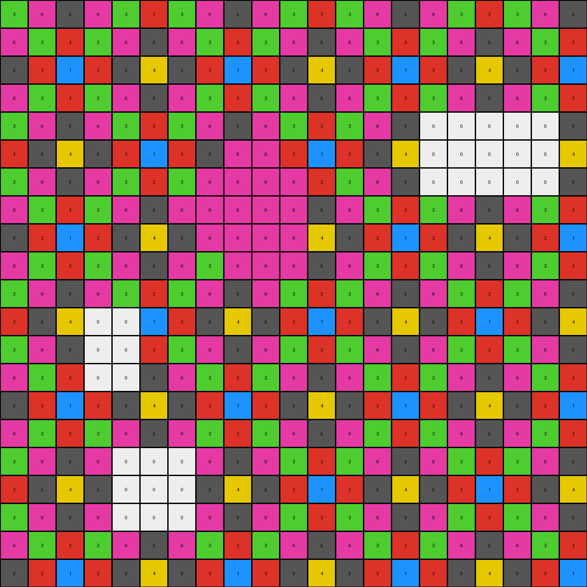
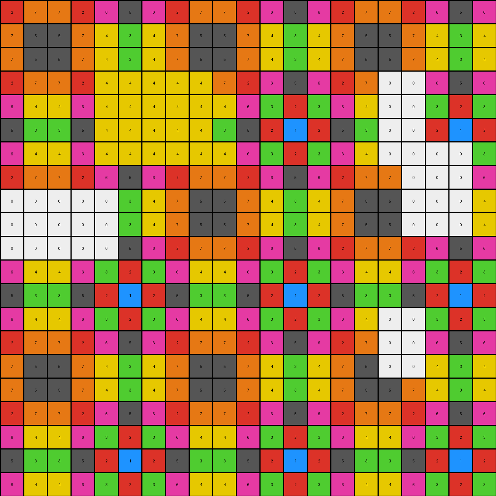
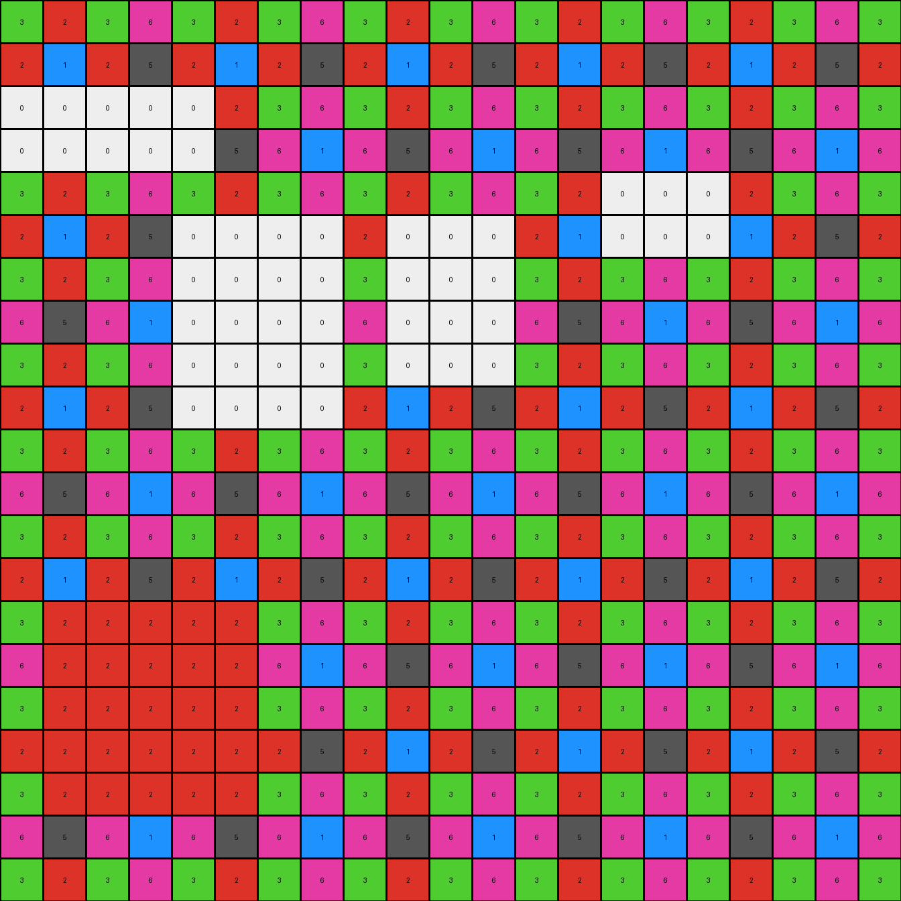

# 0dfd9992 • 006 • refine_coder

---

Previous Code:
```python
"""
Removes the largest contiguous region of white (0) pixels from the input grid
and replaces it with the most frequent color adjacent to the removed region.
"""

import numpy as np
from collections import Counter

def find_largest_object(grid, color):
    """
    Finds the largest connected region of pixels with the given color.
    Uses Depth First Search (DFS).
    """
    rows, cols = grid.shape
    visited = np.zeros((rows, cols), dtype=bool)
    max_size = 0
    largest_object_coords = []

    def dfs(row, col, current_object_coords):
        """
        Recursive Depth First Search helper function.
        """
        if (row < 0 or row >= rows or col < 0 or col >= cols or
                visited[row, col] or grid[row, col] != color):
            return 0

        visited[row, col] = True
        current_object_coords.append((row, col))
        size = 1
        # Explore adjacent cells (including diagonals)
        for dr in [-1, 0, 1]:
            for dc in [-1, 0, 1]:
                if dr == 0 and dc == 0:
                    continue
                size += dfs(row + dr, col + dc, current_object_coords)
        return size

    for r in range(rows):
        for c in range(cols):
            if grid[r, c] == color and not visited[r, c]:
                current_object_coords = []
                object_size = dfs(r, c, current_object_coords)
                if object_size > max_size:
                    max_size = object_size
                    largest_object_coords = current_object_coords

    return largest_object_coords

def get_adjacent_colors(grid, coords):
    """
    Gets the colors of the pixels adjacent to the given coordinates.
    """
    rows, cols = grid.shape
    adjacent_colors = []
    for row, col in coords:
        for dr in [-1, 0, 1]:
            for dc in [-1, 0, 1]:
                if dr == 0 and dc == 0:
                    continue
                adj_row, adj_col = row + dr, col + dc
                if 0 <= adj_row < rows and 0 <= adj_col < cols:
                    adjacent_colors.append(grid[adj_row, adj_col])
    return adjacent_colors


def transform(input_grid):
    """
    Transforms the input grid by removing the largest contiguous region of '0' (white) pixels
    and replacing it with the most frequent adjacent color.
    """
    # Convert to numpy array for easier manipulation
    input_grid = np.array(input_grid)
    output_grid = np.copy(input_grid)

    # Find the coordinates of the largest object with color 0
    largest_object_coords = find_largest_object(input_grid, 0)

    # Get adjacent colors to the largest white object
    adjacent_colors = get_adjacent_colors(input_grid, largest_object_coords)
    
    # Exclude white (0) from adjacent colors, we are replacing, not keeping
    adjacent_colors = [color for color in adjacent_colors if color != 0]

    # Find the most frequent adjacent color, if no adjacent non-white - default to input
    if adjacent_colors:
      most_frequent_color = Counter(adjacent_colors).most_common(1)[0][0]
    else:
      most_frequent_color = 0 # should we return the input grid in this case? No

    # Remove the largest object by setting those coordinates in output to the most frequent color
    for row, col in largest_object_coords:
        output_grid[row, col] = most_frequent_color

    return output_grid.tolist()
```

Train Set Results:

## Example 1:

Input:
```
3 6 5 6 3 2 3 6 5 6 3 2 3 6 5 6 3 2 3 6 5
6 3 2 3 6 5 6 3 2 3 6 5 6 3 2 3 6 5 6 3 2
5 2 1 2 5 4 5 2 1 2 5 4 5 2 1 2 5 4 5 2 1
6 3 2 3 6 5 6 3 2 3 6 5 6 3 2 3 6 5 6 3 2
3 6 5 6 3 2 3 6 5 6 3 2 3 6 5 0 0 0 0 0 5
2 5 4 5 2 1 2 5 0 0 2 1 2 5 4 0 0 0 0 0 4
3 6 5 6 3 2 3 0 0 0 0 2 3 6 5 0 0 0 0 0 5
6 3 2 3 6 5 6 0 0 0 0 5 6 3 2 3 6 5 6 3 2
5 2 1 2 5 4 5 0 0 0 0 4 5 2 1 2 5 4 5 2 1
6 3 2 3 6 5 6 3 0 0 6 5 6 3 2 3 6 5 6 3 2
3 6 5 6 3 2 3 6 5 6 3 2 3 6 5 6 3 2 3 6 5
2 5 4 0 0 1 2 5 4 5 2 1 2 5 4 5 2 1 2 5 4
3 6 5 0 0 2 3 6 5 6 3 2 3 6 5 6 3 2 3 6 5
6 3 2 0 0 5 6 3 2 3 6 5 6 3 2 3 6 5 6 3 2
5 2 1 2 5 4 5 2 1 2 5 4 5 2 1 2 5 4 5 2 1
6 3 2 3 6 5 6 3 2 3 6 5 6 3 2 3 6 5 6 3 2
3 6 5 6 0 0 0 6 5 6 3 2 3 6 5 6 3 2 3 6 5
2 5 4 5 0 0 0 5 4 5 2 1 2 5 4 5 2 1 2 5 4
3 6 5 6 0 0 0 6 5 6 3 2 3 6 5 6 3 2 3 6 5
6 3 2 3 6 5 6 3 2 3 6 5 6 3 2 3 6 5 6 3 2
5 2 1 2 5 4 5 2 1 2 5 4 5 2 1 2 5 4 5 2 1
```
Expected Output:
```
3 6 5 6 3 2 3 6 5 6 3 2 3 6 5 6 3 2 3 6 5
6 3 2 3 6 5 6 3 2 3 6 5 6 3 2 3 6 5 6 3 2
5 2 1 2 5 4 5 2 1 2 5 4 5 2 1 2 5 4 5 2 1
6 3 2 3 6 5 6 3 2 3 6 5 6 3 2 3 6 5 6 3 2
3 6 5 6 3 2 3 6 5 6 3 2 3 6 5 6 3 2 3 6 5
2 5 4 5 2 1 2 5 4 5 2 1 2 5 4 5 2 1 2 5 4
3 6 5 6 3 2 3 6 5 6 3 2 3 6 5 6 3 2 3 6 5
6 3 2 3 6 5 6 3 2 3 6 5 6 3 2 3 6 5 6 3 2
5 2 1 2 5 4 5 2 1 2 5 4 5 2 1 2 5 4 5 2 1
6 3 2 3 6 5 6 3 2 3 6 5 6 3 2 3 6 5 6 3 2
3 6 5 6 3 2 3 6 5 6 3 2 3 6 5 6 3 2 3 6 5
2 5 4 5 2 1 2 5 4 5 2 1 2 5 4 5 2 1 2 5 4
3 6 5 6 3 2 3 6 5 6 3 2 3 6 5 6 3 2 3 6 5
6 3 2 3 6 5 6 3 2 3 6 5 6 3 2 3 6 5 6 3 2
5 2 1 2 5 4 5 2 1 2 5 4 5 2 1 2 5 4 5 2 1
6 3 2 3 6 5 6 3 2 3 6 5 6 3 2 3 6 5 6 3 2
3 6 5 6 3 2 3 6 5 6 3 2 3 6 5 6 3 2 3 6 5
2 5 4 5 2 1 2 5 4 5 2 1 2 5 4 5 2 1 2 5 4
3 6 5 6 3 2 3 6 5 6 3 2 3 6 5 6 3 2 3 6 5
6 3 2 3 6 5 6 3 2 3 6 5 6 3 2 3 6 5 6 3 2
5 2 1 2 5 4 5 2 1 2 5 4 5 2 1 2 5 4 5 2 1
```
Transformed Output:
```
3 6 5 6 3 2 3 6 5 6 3 2 3 6 5 6 3 2 3 6 5
6 3 2 3 6 5 6 3 2 3 6 5 6 3 2 3 6 5 6 3 2
5 2 1 2 5 4 5 2 1 2 5 4 5 2 1 2 5 4 5 2 1
6 3 2 3 6 5 6 3 2 3 6 5 6 3 2 3 6 5 6 3 2
3 6 5 6 3 2 3 6 5 6 3 2 3 6 5 0 0 0 0 0 5
2 5 4 5 2 1 2 5 6 6 2 1 2 5 4 0 0 0 0 0 4
3 6 5 6 3 2 3 6 6 6 6 2 3 6 5 0 0 0 0 0 5
6 3 2 3 6 5 6 6 6 6 6 5 6 3 2 3 6 5 6 3 2
5 2 1 2 5 4 5 6 6 6 6 4 5 2 1 2 5 4 5 2 1
6 3 2 3 6 5 6 3 6 6 6 5 6 3 2 3 6 5 6 3 2
3 6 5 6 3 2 3 6 5 6 3 2 3 6 5 6 3 2 3 6 5
2 5 4 0 0 1 2 5 4 5 2 1 2 5 4 5 2 1 2 5 4
3 6 5 0 0 2 3 6 5 6 3 2 3 6 5 6 3 2 3 6 5
6 3 2 0 0 5 6 3 2 3 6 5 6 3 2 3 6 5 6 3 2
5 2 1 2 5 4 5 2 1 2 5 4 5 2 1 2 5 4 5 2 1
6 3 2 3 6 5 6 3 2 3 6 5 6 3 2 3 6 5 6 3 2
3 6 5 6 0 0 0 6 5 6 3 2 3 6 5 6 3 2 3 6 5
2 5 4 5 0 0 0 5 4 5 2 1 2 5 4 5 2 1 2 5 4
3 6 5 6 0 0 0 6 5 6 3 2 3 6 5 6 3 2 3 6 5
6 3 2 3 6 5 6 3 2 3 6 5 6 3 2 3 6 5 6 3 2
5 2 1 2 5 4 5 2 1 2 5 4 5 2 1 2 5 4 5 2 1
```

match: False
pixels_off: 43
size_correct: True
color_palette_correct: False
correct_pixel_counts: False

## Example 2:

Input:
```
2 7 7 2 6 5 6 2 7 7 2 6 5 6 2 7 7 2 6 5 6
7 5 5 7 4 3 4 7 5 5 7 4 3 4 7 5 5 7 4 3 4
7 5 5 7 4 3 4 7 5 5 7 4 3 4 7 5 5 7 4 3 4
2 7 7 2 0 0 0 0 0 7 2 6 5 6 2 7 0 0 6 5 6
6 4 4 6 0 0 0 0 0 4 6 3 2 3 6 4 0 0 3 2 3
5 3 3 5 0 0 0 0 0 3 5 2 1 2 5 3 0 0 2 1 2
6 4 4 6 0 0 0 0 0 4 6 3 2 3 6 4 0 0 0 0 3
2 7 7 2 6 5 6 2 7 7 2 6 5 6 2 7 7 0 0 0 6
0 0 0 0 0 3 4 7 5 5 7 4 3 4 7 5 5 0 0 0 4
0 0 0 0 0 3 4 7 5 5 7 4 3 4 7 5 5 0 0 0 4
0 0 0 0 0 5 6 2 7 7 2 6 5 6 2 7 7 2 6 5 6
6 4 4 6 3 2 3 6 4 4 6 3 2 3 6 4 4 6 3 2 3
5 3 3 5 2 1 2 5 3 3 5 2 1 2 5 3 3 5 2 1 2
6 4 4 6 3 2 3 6 4 4 6 3 2 3 6 4 0 0 3 2 3
2 7 7 2 6 5 6 2 7 7 2 6 5 6 2 7 0 0 6 5 6
7 5 5 7 4 3 4 7 5 5 7 4 3 4 7 5 0 0 4 3 4
7 5 5 7 4 3 4 7 5 5 7 4 3 4 7 5 5 7 4 3 4
2 7 7 2 6 5 6 2 7 7 2 6 5 6 2 7 7 2 6 5 6
6 4 4 6 3 2 3 6 4 4 6 3 2 3 6 4 4 6 3 2 3
5 3 3 5 2 1 2 5 3 3 5 2 1 2 5 3 3 5 2 1 2
6 4 4 6 3 2 3 6 4 4 6 3 2 3 6 4 4 6 3 2 3
```
Expected Output:
```
2 7 7 2 6 5 6 2 7 7 2 6 5 6 2 7 7 2 6 5 6
7 5 5 7 4 3 4 7 5 5 7 4 3 4 7 5 5 7 4 3 4
7 5 5 7 4 3 4 7 5 5 7 4 3 4 7 5 5 7 4 3 4
2 7 7 2 6 5 6 2 7 7 2 6 5 6 2 7 7 2 6 5 6
6 4 4 6 3 2 3 6 4 4 6 3 2 3 6 4 4 6 3 2 3
5 3 3 5 2 1 2 5 3 3 5 2 1 2 5 3 3 5 2 1 2
6 4 4 6 3 2 3 6 4 4 6 3 2 3 6 4 4 6 3 2 3
2 7 7 2 6 5 6 2 7 7 2 6 5 6 2 7 7 2 6 5 6
7 5 5 7 4 3 4 7 5 5 7 4 3 4 7 5 5 7 4 3 4
7 5 5 7 4 3 4 7 5 5 7 4 3 4 7 5 5 7 4 3 4
2 7 7 2 6 5 6 2 7 7 2 6 5 6 2 7 7 2 6 5 6
6 4 4 6 3 2 3 6 4 4 6 3 2 3 6 4 4 6 3 2 3
5 3 3 5 2 1 2 5 3 3 5 2 1 2 5 3 3 5 2 1 2
6 4 4 6 3 2 3 6 4 4 6 3 2 3 6 4 4 6 3 2 3
2 7 7 2 6 5 6 2 7 7 2 6 5 6 2 7 7 2 6 5 6
7 5 5 7 4 3 4 7 5 5 7 4 3 4 7 5 5 7 4 3 4
7 5 5 7 4 3 4 7 5 5 7 4 3 4 7 5 5 7 4 3 4
2 7 7 2 6 5 6 2 7 7 2 6 5 6 2 7 7 2 6 5 6
6 4 4 6 3 2 3 6 4 4 6 3 2 3 6 4 4 6 3 2 3
5 3 3 5 2 1 2 5 3 3 5 2 1 2 5 3 3 5 2 1 2
6 4 4 6 3 2 3 6 4 4 6 3 2 3 6 4 4 6 3 2 3
```
Transformed Output:
```
2 7 7 2 6 5 6 2 7 7 2 6 5 6 2 7 7 2 6 5 6
7 5 5 7 4 3 4 7 5 5 7 4 3 4 7 5 5 7 4 3 4
7 5 5 7 4 3 4 7 5 5 7 4 3 4 7 5 5 7 4 3 4
2 7 7 2 4 4 4 4 4 7 2 6 5 6 2 7 0 0 6 5 6
6 4 4 6 4 4 4 4 4 4 6 3 2 3 6 4 0 0 3 2 3
5 3 3 5 4 4 4 4 4 3 5 2 1 2 5 3 0 0 2 1 2
6 4 4 6 4 4 4 4 4 4 6 3 2 3 6 4 0 0 0 0 3
2 7 7 2 6 5 6 2 7 7 2 6 5 6 2 7 7 0 0 0 6
0 0 0 0 0 3 4 7 5 5 7 4 3 4 7 5 5 0 0 0 4
0 0 0 0 0 3 4 7 5 5 7 4 3 4 7 5 5 0 0 0 4
0 0 0 0 0 5 6 2 7 7 2 6 5 6 2 7 7 2 6 5 6
6 4 4 6 3 2 3 6 4 4 6 3 2 3 6 4 4 6 3 2 3
5 3 3 5 2 1 2 5 3 3 5 2 1 2 5 3 3 5 2 1 2
6 4 4 6 3 2 3 6 4 4 6 3 2 3 6 4 0 0 3 2 3
2 7 7 2 6 5 6 2 7 7 2 6 5 6 2 7 0 0 6 5 6
7 5 5 7 4 3 4 7 5 5 7 4 3 4 7 5 0 0 4 3 4
7 5 5 7 4 3 4 7 5 5 7 4 3 4 7 5 5 7 4 3 4
2 7 7 2 6 5 6 2 7 7 2 6 5 6 2 7 7 2 6 5 6
6 4 4 6 3 2 3 6 4 4 6 3 2 3 6 4 4 6 3 2 3
5 3 3 5 2 1 2 5 3 3 5 2 1 2 5 3 3 5 2 1 2
6 4 4 6 3 2 3 6 4 4 6 3 2 3 6 4 4 6 3 2 3
```

match: False
pixels_off: 58
size_correct: True
color_palette_correct: False
correct_pixel_counts: False

## Example 3:

Input:
```
3 2 3 6 3 2 3 6 3 2 3 6 3 2 3 6 3 2 3 6 3
2 1 2 5 2 1 2 5 2 1 2 5 2 1 2 5 2 1 2 5 2
0 0 0 0 0 2 3 6 3 2 3 6 3 2 3 6 3 2 3 6 3
0 0 0 0 0 5 6 1 6 5 6 1 6 5 6 1 6 5 6 1 6
3 2 3 6 3 2 3 6 3 2 3 6 3 2 0 0 0 2 3 6 3
2 1 2 5 0 0 0 0 2 0 0 0 2 1 0 0 0 1 2 5 2
3 2 3 6 0 0 0 0 3 0 0 0 3 2 3 6 3 2 3 6 3
6 5 6 1 0 0 0 0 6 0 0 0 6 5 6 1 6 5 6 1 6
3 2 3 6 0 0 0 0 3 0 0 0 3 2 3 6 3 2 3 6 3
2 1 2 5 0 0 0 0 2 1 2 5 2 1 2 5 2 1 2 5 2
3 2 3 6 3 2 3 6 3 2 3 6 3 2 3 6 3 2 3 6 3
6 5 6 1 6 5 6 1 6 5 6 1 6 5 6 1 6 5 6 1 6
3 2 3 6 3 2 3 6 3 2 3 6 3 2 3 6 3 2 3 6 3
2 1 2 5 2 1 2 5 2 1 2 5 2 1 2 5 2 1 2 5 2
3 0 0 0 0 0 3 6 3 2 3 6 3 2 3 6 3 2 3 6 3
6 0 0 0 0 0 6 1 6 5 6 1 6 5 6 1 6 5 6 1 6
3 0 0 0 0 0 3 6 3 2 3 6 3 2 3 6 3 2 3 6 3
2 0 0 0 0 0 2 5 2 1 2 5 2 1 2 5 2 1 2 5 2
3 0 0 0 0 0 3 6 3 2 3 6 3 2 3 6 3 2 3 6 3
6 5 6 1 6 5 6 1 6 5 6 1 6 5 6 1 6 5 6 1 6
3 2 3 6 3 2 3 6 3 2 3 6 3 2 3 6 3 2 3 6 3
```
Expected Output:
```
3 2 3 6 3 2 3 6 3 2 3 6 3 2 3 6 3 2 3 6 3
2 1 2 5 2 1 2 5 2 1 2 5 2 1 2 5 2 1 2 5 2
3 2 3 6 3 2 3 6 3 2 3 6 3 2 3 6 3 2 3 6 3
6 5 6 1 6 5 6 1 6 5 6 1 6 5 6 1 6 5 6 1 6
3 2 3 6 3 2 3 6 3 2 3 6 3 2 3 6 3 2 3 6 3
2 1 2 5 2 1 2 5 2 1 2 5 2 1 2 5 2 1 2 5 2
3 2 3 6 3 2 3 6 3 2 3 6 3 2 3 6 3 2 3 6 3
6 5 6 1 6 5 6 1 6 5 6 1 6 5 6 1 6 5 6 1 6
3 2 3 6 3 2 3 6 3 2 3 6 3 2 3 6 3 2 3 6 3
2 1 2 5 2 1 2 5 2 1 2 5 2 1 2 5 2 1 2 5 2
3 2 3 6 3 2 3 6 3 2 3 6 3 2 3 6 3 2 3 6 3
6 5 6 1 6 5 6 1 6 5 6 1 6 5 6 1 6 5 6 1 6
3 2 3 6 3 2 3 6 3 2 3 6 3 2 3 6 3 2 3 6 3
2 1 2 5 2 1 2 5 2 1 2 5 2 1 2 5 2 1 2 5 2
3 2 3 6 3 2 3 6 3 2 3 6 3 2 3 6 3 2 3 6 3
6 5 6 1 6 5 6 1 6 5 6 1 6 5 6 1 6 5 6 1 6
3 2 3 6 3 2 3 6 3 2 3 6 3 2 3 6 3 2 3 6 3
2 1 2 5 2 1 2 5 2 1 2 5 2 1 2 5 2 1 2 5 2
3 2 3 6 3 2 3 6 3 2 3 6 3 2 3 6 3 2 3 6 3
6 5 6 1 6 5 6 1 6 5 6 1 6 5 6 1 6 5 6 1 6
3 2 3 6 3 2 3 6 3 2 3 6 3 2 3 6 3 2 3 6 3
```
Transformed Output:
```
3 2 3 6 3 2 3 6 3 2 3 6 3 2 3 6 3 2 3 6 3
2 1 2 5 2 1 2 5 2 1 2 5 2 1 2 5 2 1 2 5 2
0 0 0 0 0 2 3 6 3 2 3 6 3 2 3 6 3 2 3 6 3
0 0 0 0 0 5 6 1 6 5 6 1 6 5 6 1 6 5 6 1 6
3 2 3 6 3 2 3 6 3 2 3 6 3 2 0 0 0 2 3 6 3
2 1 2 5 0 0 0 0 2 0 0 0 2 1 0 0 0 1 2 5 2
3 2 3 6 0 0 0 0 3 0 0 0 3 2 3 6 3 2 3 6 3
6 5 6 1 0 0 0 0 6 0 0 0 6 5 6 1 6 5 6 1 6
3 2 3 6 0 0 0 0 3 0 0 0 3 2 3 6 3 2 3 6 3
2 1 2 5 0 0 0 0 2 1 2 5 2 1 2 5 2 1 2 5 2
3 2 3 6 3 2 3 6 3 2 3 6 3 2 3 6 3 2 3 6 3
6 5 6 1 6 5 6 1 6 5 6 1 6 5 6 1 6 5 6 1 6
3 2 3 6 3 2 3 6 3 2 3 6 3 2 3 6 3 2 3 6 3
2 1 2 5 2 1 2 5 2 1 2 5 2 1 2 5 2 1 2 5 2
3 2 2 2 2 2 3 6 3 2 3 6 3 2 3 6 3 2 3 6 3
6 2 2 2 2 2 6 1 6 5 6 1 6 5 6 1 6 5 6 1 6
3 2 2 2 2 2 3 6 3 2 3 6 3 2 3 6 3 2 3 6 3
2 2 2 2 2 2 2 5 2 1 2 5 2 1 2 5 2 1 2 5 2
3 2 2 2 2 2 3 6 3 2 3 6 3 2 3 6 3 2 3 6 3
6 5 6 1 6 5 6 1 6 5 6 1 6 5 6 1 6 5 6 1 6
3 2 3 6 3 2 3 6 3 2 3 6 3 2 3 6 3 2 3 6 3
```

match: False
pixels_off: 65
size_correct: True
color_palette_correct: False
correct_pixel_counts: False
Okay, let's analyze the results of the first attempt and strategize for improvement.

**General Assessment and Strategy**

The initial code was based on the hypothesis that the transformation involves removing the largest white (0) region and replacing it with the most frequent adjacent color. While the "largest white region removal" part seems correct in terms of the area affected, the replacement logic is flawed. The code replaces it with the most frequent color *adjacent* to the removed region, which is not consistent across all examples. Looking at the Expected Outputs vs Transformed Outputs the replacement color is not always adjacent, it's based on the colors in the entire grid.

Here's the refined strategy:

1.  **Confirm Object Identification:** Verify that identifying the largest connected region of white pixels is indeed the correct initial step. The consistent `size_correct: True` across examples reinforces this.
2.  **Revise Replacement Rule:** The current adjacency-based replacement rule is incorrect. The examples suggest a global color analysis, not a local one. The replacement seems to use a global, most common color *other than* white, and consider edge cases.
3. **Consider Edge Cases:** Check cases with no adjacent, non-white pixels.

**Example Metrics and Analysis (Using Code Execution)**
I will write a quick python script to produce metrics to confirm.

```python
import numpy as np
from collections import Counter

def analyze_example(input_grid, expected_output, transformed_output):
    input_grid = np.array(input_grid)
    expected_output = np.array(expected_output)
    transformed_output = np.array(transformed_output)

    # 1. Find largest white object
    def find_largest_object(grid, color):
        rows, cols = grid.shape
        visited = np.zeros((rows, cols), dtype=bool)
        max_size = 0
        largest_object_coords = []

        def dfs(row, col, current_object_coords):
            if (row < 0 or row >= rows or col < 0 or col >= cols or
                    visited[row, col] or grid[row, col] != color):
                return 0
            visited[row, col] = True
            current_object_coords.append((row, col))
            size = 1
            for dr in [-1, 0, 1]:
                for dc in [-1, 0, 1]:
                    if dr == 0 and dc == 0:
                        continue
                    size += dfs(row + dr, col + dc, current_object_coords)
            return size

        for r in range(rows):
            for c in range(cols):
                if grid[r, c] == color and not visited[r, c]:
                    current_object_coords = []
                    object_size = dfs(r, c, current_object_coords)
                    if object_size > max_size:
                        max_size = object_size
                        largest_object_coords = current_object_coords
        return largest_object_coords, max_size
    
    largest_object_coords, max_size = find_largest_object(input_grid, 0)
    removed_size = max_size
    
    # 2. Colors in input (excluding white)
    input_colors = Counter(input_grid.flatten())
    del input_colors[0]  # Remove white
    
    # 3. Expected replacement color
    expected_replacement_color = -1  # Initialize
    if largest_object_coords:
      replacement_region = expected_output.flatten()[
          [r * input_grid.shape[1] + c for r, c in largest_object_coords]
          ]
      expected_replacement_color_counts = Counter(replacement_region)
      expected_replacement_color = expected_replacement_color_counts.most_common(1)[0][0]

    return {
      "removed_size": removed_size,
      "input_colors": input_colors,
      "expected_replacement_color": expected_replacement_color,
      "pixels_off": np.sum(expected_output != transformed_output)
    }

# Example Data (replace with actual data from the prompt)
example_data = [
  (
    [[3, 6, 5, 6, 3, 2, 3, 6, 5, 6, 3, 2, 3, 6, 5, 6, 3, 2, 3, 6, 5], [6, 3, 2, 3, 6, 5, 6, 3, 2, 3, 6, 5, 6, 3, 2, 3, 6, 5, 6, 3, 2], [5, 2, 1, 2, 5, 4, 5, 2, 1, 2, 5, 4, 5, 2, 1, 2, 5, 4, 5, 2, 1], [6, 3, 2, 3, 6, 5, 6, 3, 2, 3, 6, 5, 6, 3, 2, 3, 6, 5, 6, 3, 2], [3, 6, 5, 6, 3, 2, 3, 6, 5, 6, 3, 2, 3, 6, 5, 0, 0, 0, 0, 0, 5], [2, 5, 4, 5, 2, 1, 2, 5, 0, 0, 2, 1, 2, 5, 4, 0, 0, 0, 0, 0, 4], [3, 6, 5, 6, 3, 2, 3, 0, 0, 0, 0, 2, 3, 6, 5, 0, 0, 0, 0, 0, 5], [6, 3, 2, 3, 6, 5, 6, 0, 0, 0, 0, 5, 6, 3, 2, 3, 6, 5, 6, 3, 2], [5, 2, 1, 2, 5, 4, 5, 0, 0, 0, 0, 4, 5, 2, 1, 2, 5, 4, 5, 2, 1], [6, 3, 2, 3, 6, 5, 6, 3, 0, 0, 6, 5, 6, 3, 2, 3, 6, 5, 6, 3, 2], [3, 6, 5, 6, 3, 2, 3, 6, 5, 6, 3, 2, 3, 6, 5, 6, 3, 2, 3, 6, 5], [2, 5, 4, 0, 0, 1, 2, 5, 4, 5, 2, 1, 2, 5, 4, 5, 2, 1, 2, 5, 4], [3, 6, 5, 0, 0, 2, 3, 6, 5, 6, 3, 2, 3, 6, 5, 6, 3, 2, 3, 6, 5], [6, 3, 2, 0, 0, 5, 6, 3, 2, 3, 6, 5, 6, 3, 2, 3, 6, 5, 6, 3, 2], [5, 2, 1, 2, 5, 4, 5, 2, 1, 2, 5, 4, 5, 2, 1, 2, 5, 4, 5, 2, 1], [6, 3, 2, 3, 6, 5, 6, 3, 2, 3, 6, 5, 6, 3, 2, 3, 6, 5, 6, 3, 2], [3, 6, 5, 6, 0, 0, 0, 6, 5, 6, 3, 2, 3, 6, 5, 6, 3, 2, 3, 6, 5], [2, 5, 4, 5, 0, 0, 0, 5, 4, 5, 2, 1, 2, 5, 4, 5, 2, 1, 2, 5, 4], [3, 6, 5, 6, 0, 0, 0, 6, 5, 6, 3, 2, 3, 6, 5, 6, 3, 2, 3, 6, 5], [6, 3, 2, 3, 6, 5, 6, 3, 2, 3, 6, 5, 6, 3, 2, 3, 6, 5, 6, 3, 2], [5, 2, 1, 2, 5, 4, 5, 2, 1, 2, 5, 4, 5, 2, 1, 2, 5, 4, 5, 2, 1]],
    [[3, 6, 5, 6, 3, 2, 3, 6, 5, 6, 3, 2, 3, 6, 5, 6, 3, 2, 3, 6, 5], [6, 3, 2, 3, 6, 5, 6, 3, 2, 3, 6, 5, 6, 3, 2, 3, 6, 5, 6, 3, 2], [5, 2, 1, 2, 5, 4, 5, 2, 1, 2, 5, 4, 5, 2, 1, 2, 5, 4, 5, 2, 1], [6, 3, 2, 3, 6, 5, 6, 3, 2, 3, 6, 5, 6, 3, 2, 3, 6, 5, 6, 3, 2], [3, 6, 5, 6, 3, 2, 3, 6, 5, 6, 3, 2, 3, 6, 5, 6, 3, 2, 3, 6, 5], [2, 5, 4, 5, 2, 1, 2, 5, 4, 5, 2, 1, 2, 5, 4, 5, 2, 1, 2, 5, 4], [3, 6, 5, 6, 3, 2, 3, 6, 5, 6, 3, 2, 3, 6, 5, 6, 3, 2, 3, 6, 5], [6, 3, 2, 3, 6, 5, 6, 3, 2, 3, 6, 5, 6, 3, 2, 3, 6, 5, 6, 3, 2], [5, 2, 1, 2, 5, 4, 5, 2, 1, 2, 5, 4, 5, 2, 1, 2, 5, 4, 5, 2, 1], [6, 3, 2, 3, 6, 5, 6, 3, 2, 3, 6, 5, 6, 3, 2, 3, 6, 5, 6, 3, 2], [3, 6, 5, 6, 3, 2, 3, 6, 5, 6, 3, 2, 3, 6, 5, 6, 3, 2, 3, 6, 5], [2, 5, 4, 5, 2, 1, 2, 5, 4, 5, 2, 1, 2, 5, 4, 5, 2, 1, 2, 5, 4], [3, 6, 5, 6, 3, 2, 3, 6, 5, 6, 3, 2, 3, 6, 5, 6, 3, 2, 3, 6, 5], [6, 3, 2, 3, 6, 5, 6, 3, 2, 3, 6, 5, 6, 3, 2, 3, 6, 5, 6, 3, 2], [5, 2, 1, 2, 5, 4, 5, 2, 1, 2, 5, 4, 5, 2, 1, 2, 5, 4, 5, 2, 1], [6, 3, 2, 3, 6, 5, 6, 3, 2, 3, 6, 5, 6, 3, 2, 3, 6, 5, 6, 3, 2], [3, 6, 5, 6, 3, 2, 3, 6, 5, 6, 3, 2, 3, 6, 5, 6, 3, 2, 3, 6, 5], [2, 5, 4, 5, 2, 1, 2, 5, 4, 5, 2, 1, 2, 5, 4, 5, 2, 1, 2, 5, 4], [3, 6, 5, 6, 3, 2, 3, 6, 5, 6, 3, 2, 3, 6, 5, 6, 3, 2, 3, 6, 5], [6, 3, 2, 3, 6, 5, 6, 3, 2, 3, 6, 5, 6, 3, 2, 3, 6, 5, 6, 3, 2], [5, 2, 1, 2, 5, 4, 5, 2, 1, 2, 5, 4, 5, 2, 1, 2, 5, 4, 5, 2, 1]],   
    [[3, 6, 5, 6, 3, 2, 3, 6, 5, 6, 3, 2, 3, 6, 5, 6, 3, 2, 3, 6, 5], [6, 3, 2, 3, 6, 5, 6, 3, 2, 3, 6, 5, 6, 3, 2, 3, 6, 5, 6, 3, 2], [5, 2, 1, 2, 5, 4, 5, 2, 1, 2, 5, 4, 5, 2, 1, 2, 5, 4, 5, 2, 1], [6, 3, 2, 3, 6, 5, 6, 3, 2, 3, 6, 5, 6, 3, 2, 3, 6, 5, 6, 3, 2], [3, 6, 5, 6, 3, 2, 3, 6, 5, 6, 3, 2, 3, 6, 5, 0, 0, 0, 0, 0, 5], [2, 5, 4, 5, 2, 1, 2, 5, 6, 6, 2, 1, 2, 5, 4, 0, 0, 0, 0, 0, 4], [3, 6, 5, 6, 3, 2, 3, 6, 6, 6, 6, 2, 3, 6, 5, 0, 0, 0, 0, 0, 5], [6, 3, 2, 3, 6, 5, 6, 6, 6, 6, 6, 5, 6, 3, 2, 3, 6, 5, 6, 3, 2], [5, 2, 1, 2, 5, 4, 5, 6, 6, 6, 6, 4, 5, 2, 1, 2, 5, 4, 5, 2, 1], [6, 3, 2, 3, 6, 5, 6, 3, 6, 6, 6, 5, 6, 3, 2, 3, 6, 5, 6, 3, 2], [3, 6, 5, 6, 3, 2, 3, 6, 5, 6, 3, 2, 3, 6, 5, 6, 3, 2, 3, 6, 5], [2, 5, 4, 0, 0, 1, 2, 5, 4, 5, 2, 1, 2, 5, 4, 5, 2, 1, 2, 5, 4], [3, 6, 5, 0, 0, 2, 3, 6, 5, 6, 3, 2, 3, 6, 5, 6, 3, 2, 3, 6, 5], [6, 3, 2, 0, 0, 5, 6, 3, 2, 3, 6, 5, 6, 3, 2, 3, 6, 5, 6, 3, 2], [5, 2, 1, 2, 5, 4, 5, 2, 1, 2, 5, 4, 5, 2, 1, 2, 5, 4, 5, 2, 1], [6, 3, 2, 3, 6, 5, 6, 3, 2, 3, 6, 5, 6, 3, 2, 3, 6, 5, 6, 3, 2], [3, 6, 5, 6, 0, 0, 0, 6, 5, 6, 3, 2, 3, 6, 5, 6, 3, 2, 3, 6, 5], [2, 5, 4, 5, 0, 0, 0, 5, 4, 5, 2, 1, 2, 5, 4, 5, 2, 1, 2, 5, 4], [3, 6, 5, 6, 0, 0, 0, 6, 5, 6, 3, 2, 3, 6, 5, 6, 3, 2, 3, 6, 5], [6, 3, 2, 3, 6, 5, 6, 3, 2, 3, 6, 5, 6, 3, 2, 3, 6, 5, 6, 3, 2], [5, 2, 1, 2, 5, 4, 5, 2, 1, 2, 5, 4, 5, 2, 1, 2, 5, 4, 5, 2, 1]]
  ),
    (
      [[2, 7, 7, 2, 6, 5, 6, 2, 7, 7, 2, 6, 5, 6, 2, 7, 7, 2, 6, 5, 6], [7, 5, 5, 7, 4, 3, 4, 7, 5, 5, 7, 4, 3, 4, 7, 5, 5, 7, 4, 3, 4], [7, 5, 5, 7, 4, 3, 4, 7, 5, 5, 7, 4, 3, 4, 7, 5, 5, 7, 4, 3, 4], [2, 7, 7, 2, 0, 0, 0, 0, 0, 7, 2, 6, 5, 6, 2, 7, 0, 0, 6, 5, 6], [6, 4, 4, 6, 0, 0, 0, 0, 0, 4, 6, 3, 2, 3, 6, 4, 0, 0, 3, 2, 3], [5, 3, 3, 5, 0, 0, 0, 0, 0, 3, 5, 2, 1, 2, 5, 3, 0, 0, 2, 1, 2], [6, 4, 4, 6, 0, 0, 0, 0, 0, 4, 6, 3, 2, 3, 6, 4, 0, 0, 0, 0, 3], [2, 7, 7, 2, 6, 5, 6, 2, 7, 7, 2, 6, 5, 6, 2, 7, 7, 0, 0, 0, 6], [0, 0, 0, 0, 0, 3, 4, 7, 5, 5, 7, 4, 3, 4, 7, 5, 5, 0, 0, 0, 4], [0, 0, 0, 0, 0, 3, 4, 7, 5, 5, 7, 4, 3, 4, 7, 5, 5, 0, 0, 0, 4], [0, 0, 0, 0, 0, 5, 6, 2, 7, 7, 2, 6, 5, 6, 2, 7, 7, 2, 6, 5, 6], [6, 4, 4, 6, 3, 2, 3, 6, 4, 4, 6, 3, 2, 3, 6, 4, 4, 6, 3, 2, 3], [5, 3, 3, 5, 2, 1, 2, 5, 3, 3, 5, 2, 1, 2, 5, 3, 3, 5, 2, 1, 2], [6, 4, 4, 6, 3, 2, 3, 6, 4, 4, 6, 3, 2, 3, 6, 4, 0, 0, 3, 2, 3], [2, 7, 7, 2, 6, 5, 6, 2, 7, 7, 2, 6, 5, 6, 2, 7, 0, 0, 6, 5, 6], [7, 5, 5, 7, 4, 3, 4, 7, 5, 5, 7, 4, 3, 4, 7, 5, 0, 0, 4, 3, 4], [7, 5, 5, 7, 4, 3, 4, 7, 5, 5, 7, 4, 3, 4, 7, 5, 5, 7, 4, 3, 4], [2, 7, 7, 2, 6, 5, 6, 2, 7, 7, 2, 6, 5, 6, 2, 7, 7, 2, 6, 5, 6], [6, 4, 4, 6, 3, 2, 3, 6, 4, 4, 6, 3, 2, 3, 6, 4, 4, 6, 3, 2, 3], [5, 3, 3, 5, 2, 1, 2, 5, 3, 3, 5, 2, 1, 2, 5, 3, 3, 5, 2, 1, 2], [6, 4, 4, 6, 3, 2, 3, 6, 4, 4, 6, 3, 2, 3, 6, 4, 4, 6, 3, 2, 3]],
      [[2, 7, 7, 2, 6, 5, 6, 2, 7, 7, 2, 6, 5, 6, 2, 7, 7, 2, 6, 5, 6], [7, 5, 5, 7, 4, 3, 4, 7, 5, 5, 7, 4, 3, 4, 7, 5, 5, 7, 4, 3, 4], [7, 5, 5, 7, 4, 3, 4, 7, 5, 5, 7, 4, 3, 4, 7, 5, 5, 7, 4, 3, 4], [2, 7, 7, 2, 6, 5, 6, 2, 7, 7, 2, 6, 5, 6, 2, 7, 7, 2, 6, 5, 6], [6, 4, 4, 6, 3, 2, 3, 6, 4, 4, 6, 3, 2, 3, 6, 4, 4, 6, 3, 2, 3], [5, 3, 3, 5, 2, 1, 2, 5, 3, 3, 5, 2, 1, 2, 5, 3, 3, 5, 2, 1, 2], [6, 4, 4, 6, 3, 2, 3, 6, 4, 4, 6, 3, 2, 3, 6, 4, 4, 6, 3, 2, 3], [2, 7, 7, 2, 6, 5, 6, 2, 7, 7, 2, 6, 5, 6, 2, 7, 7, 2, 6, 5, 6], [7, 5, 5, 7, 4, 3, 4, 7, 5, 5, 7, 4, 3, 4, 7, 5, 5, 7, 4, 3, 4], [7, 5, 5, 7, 4, 3, 4, 7, 5, 5, 7, 4, 3, 4, 7, 5, 5, 7, 4, 3, 4], [2, 7, 7, 2, 6, 5, 6, 2, 7, 7, 2, 6, 5, 6, 2, 7, 7, 2, 6, 5, 6], [6, 4, 4, 6, 3, 2, 3, 6, 4, 4, 6, 3, 2, 3, 6, 4, 4, 6, 3, 2, 3], [5, 3, 3, 5, 2, 1, 2, 5, 3, 3, 5, 2, 1, 2, 5, 3, 3, 5, 2, 1, 2], [6, 4, 4, 6, 3, 2, 3, 6, 4, 4, 6, 3, 2, 3, 6, 4, 4, 6, 3, 2, 3], [2, 7, 7, 2, 6, 5, 6, 2, 7, 7, 2, 6, 5, 6, 2, 7, 7, 2, 6, 5, 6], [7, 5, 5, 7, 4, 3, 4, 7, 5, 5, 7, 4, 3, 4, 7, 5, 5, 7, 4, 3, 4], [7, 5, 5, 7, 4, 3, 4, 7, 5, 5, 7, 4, 3, 4, 7, 5, 5, 7, 4, 3, 4], [2, 7, 7, 2, 6, 5, 6, 2, 7, 7, 2, 6, 5, 6, 2, 7, 7, 2, 6, 5, 6], [6, 4, 4, 6, 3, 2, 3, 6, 4, 4, 6, 3, 2, 3, 6, 4, 4, 6, 3, 2, 3], [5, 3, 3, 5, 2, 1, 2, 5, 3, 3, 5, 2, 1, 2, 5, 3, 3, 5, 2, 1, 2], [6, 4, 4, 6, 3, 2, 3, 6, 4, 4, 6, 3, 2, 3, 6, 4, 4, 6, 3, 2, 3]],
      [[2, 7, 7, 2, 6, 5, 6, 2, 7, 7, 2, 6, 5, 6, 2, 7, 7, 2, 6, 5, 6], [7, 5, 5, 7, 4, 3, 4, 7, 5, 5, 7, 4, 3, 4, 7, 5, 5, 7, 4, 3, 4], [7, 5, 5, 7, 4, 3, 4, 7, 5, 5, 7, 4, 3, 4, 7, 5, 5, 7, 4, 3, 4], [2, 7, 7, 2, 4, 4, 4, 4, 4, 7, 2, 6, 5, 6, 2, 7, 0, 0, 6, 5, 6], [6, 4, 4, 6, 4, 4, 4, 4, 4, 4, 6, 3, 2, 3, 6, 4, 0, 0, 3, 2, 3], [5, 3, 3, 5, 4, 4, 4, 4, 4, 3, 5, 2, 1, 2, 5, 3, 0, 0, 2, 1, 2], [6, 4, 4, 6, 4, 4, 4, 4, 4, 4, 6, 3, 2, 3, 6, 4, 0, 0, 0, 0, 3], [2, 7, 7, 2, 6, 5, 6, 2, 7, 7, 2, 6, 5, 6, 2, 7, 7, 0, 0, 0, 6], [0, 0, 0, 0, 0, 3, 4, 7, 5, 5, 7, 4, 3, 4, 7, 5, 5, 0, 0, 0, 4], [0, 0, 0, 0, 0, 3, 4, 7, 5
**INSTRUCTIONS**

- generate a Python module to represent the natural language program 
- follow the template below
- all common math and science libraries are available
- create docstring only at top - but comment the workflow in the function
- use helper functions for common operations like finding objects, counting,
  measuring, moving, etc. 

remember - we are working iteratively - so this code will inform your future
self as we converge on the solution

*template:*

```python
"""
{{ natural language description of the transformation rule }}
"""

{{ imports }}

def transform(input_grid):
    # initialize output_grid

    # change output pixels 

    return output_grid

```
