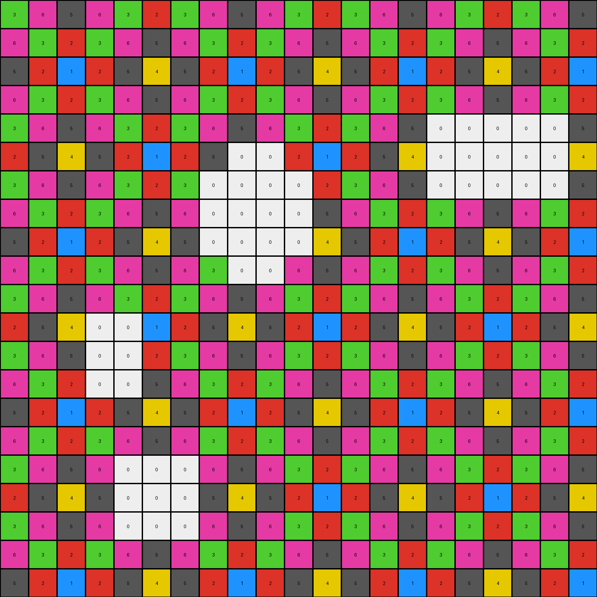

# 0dfd9992 • 009 • refine_dreamer

---


Previous Code:
```python
"""
The transformation rule is an identity operation. The output grid is an exact copy of the input grid. There are no changes to pixel colors, positions, or the overall grid structure.
"""

import numpy as np

def transform(input_grid):
    """
    Transforms the input grid according to the identified rule.
    In this case, it performs an identity transformation (output = input).

    Args:
        input_grid (list of lists): The input 2D grid.

    Returns:
        list of lists: The transformed 2D grid (identical to input).
    """
    # Convert the input grid to a NumPy array for easier handling (if it's not already).
    input_array = np.array(input_grid)

    # Create a deep copy of the input array to serve as the output.  This ensures
    # that any modifications (even if in-place) wouldn't affect the original
    # input data.
    output_array = np.copy(input_array)
    # Convert to list and return.
    output_grid = output_array.tolist()

    return output_grid
```

Train Set Results:

## Example 1:

Input:
```
3 6 5 6 3 2 3 6 5 6 3 2 3 6 5 6 3 2 3 6 5
6 3 2 3 6 5 6 3 2 3 6 5 6 3 2 3 6 5 6 3 2
5 2 1 2 5 4 5 2 1 2 5 4 5 2 1 2 5 4 5 2 1
6 3 2 3 6 5 6 3 2 3 6 5 6 3 2 3 6 5 6 3 2
3 6 5 6 3 2 3 6 5 6 3 2 3 6 5 0 0 0 0 0 5
2 5 4 5 2 1 2 5 0 0 2 1 2 5 4 0 0 0 0 0 4
3 6 5 6 3 2 3 0 0 0 0 2 3 6 5 0 0 0 0 0 5
6 3 2 3 6 5 6 0 0 0 0 5 6 3 2 3 6 5 6 3 2
5 2 1 2 5 4 5 0 0 0 0 4 5 2 1 2 5 4 5 2 1
6 3 2 3 6 5 6 3 0 0 6 5 6 3 2 3 6 5 6 3 2
3 6 5 6 3 2 3 6 5 6 3 2 3 6 5 6 3 2 3 6 5
2 5 4 0 0 1 2 5 4 5 2 1 2 5 4 5 2 1 2 5 4
3 6 5 0 0 2 3 6 5 6 3 2 3 6 5 6 3 2 3 6 5
6 3 2 0 0 5 6 3 2 3 6 5 6 3 2 3 6 5 6 3 2
5 2 1 2 5 4 5 2 1 2 5 4 5 2 1 2 5 4 5 2 1
6 3 2 3 6 5 6 3 2 3 6 5 6 3 2 3 6 5 6 3 2
3 6 5 6 0 0 0 6 5 6 3 2 3 6 5 6 3 2 3 6 5
2 5 4 5 0 0 0 5 4 5 2 1 2 5 4 5 2 1 2 5 4
3 6 5 6 0 0 0 6 5 6 3 2 3 6 5 6 3 2 3 6 5
6 3 2 3 6 5 6 3 2 3 6 5 6 3 2 3 6 5 6 3 2
5 2 1 2 5 4 5 2 1 2 5 4 5 2 1 2 5 4 5 2 1
```
Expected Output:
```
3 6 5 6 3 2 3 6 5 6 3 2 3 6 5 6 3 2 3 6 5
6 3 2 3 6 5 6 3 2 3 6 5 6 3 2 3 6 5 6 3 2
5 2 1 2 5 4 5 2 1 2 5 4 5 2 1 2 5 4 5 2 1
6 3 2 3 6 5 6 3 2 3 6 5 6 3 2 3 6 5 6 3 2
3 6 5 6 3 2 3 6 5 6 3 2 3 6 5 6 3 2 3 6 5
2 5 4 5 2 1 2 5 4 5 2 1 2 5 4 5 2 1 2 5 4
3 6 5 6 3 2 3 6 5 6 3 2 3 6 5 6 3 2 3 6 5
6 3 2 3 6 5 6 3 2 3 6 5 6 3 2 3 6 5 6 3 2
5 2 1 2 5 4 5 2 1 2 5 4 5 2 1 2 5 4 5 2 1
6 3 2 3 6 5 6 3 2 3 6 5 6 3 2 3 6 5 6 3 2
3 6 5 6 3 2 3 6 5 6 3 2 3 6 5 6 3 2 3 6 5
2 5 4 5 2 1 2 5 4 5 2 1 2 5 4 5 2 1 2 5 4
3 6 5 6 3 2 3 6 5 6 3 2 3 6 5 6 3 2 3 6 5
6 3 2 3 6 5 6 3 2 3 6 5 6 3 2 3 6 5 6 3 2
5 2 1 2 5 4 5 2 1 2 5 4 5 2 1 2 5 4 5 2 1
6 3 2 3 6 5 6 3 2 3 6 5 6 3 2 3 6 5 6 3 2
3 6 5 6 3 2 3 6 5 6 3 2 3 6 5 6 3 2 3 6 5
2 5 4 5 2 1 2 5 4 5 2 1 2 5 4 5 2 1 2 5 4
3 6 5 6 3 2 3 6 5 6 3 2 3 6 5 6 3 2 3 6 5
6 3 2 3 6 5 6 3 2 3 6 5 6 3 2 3 6 5 6 3 2
5 2 1 2 5 4 5 2 1 2 5 4 5 2 1 2 5 4 5 2 1
```
Transformed Output:
```
3 6 5 6 3 2 3 6 5 6 3 2 3 6 5 6 3 2 3 6 5
6 3 2 3 6 5 6 3 2 3 6 5 6 3 2 3 6 5 6 3 2
5 2 1 2 5 4 5 2 1 2 5 4 5 2 1 2 5 4 5 2 1
6 3 2 3 6 5 6 3 2 3 6 5 6 3 2 3 6 5 6 3 2
3 6 5 6 3 2 3 6 5 6 3 2 3 6 5 0 0 0 0 0 5
2 5 4 5 2 1 2 5 0 0 2 1 2 5 4 0 0 0 0 0 4
3 6 5 6 3 2 3 0 0 0 0 2 3 6 5 0 0 0 0 0 5
6 3 2 3 6 5 6 0 0 0 0 5 6 3 2 3 6 5 6 3 2
5 2 1 2 5 4 5 0 0 0 0 4 5 2 1 2 5 4 5 2 1
6 3 2 3 6 5 6 3 0 0 6 5 6 3 2 3 6 5 6 3 2
3 6 5 6 3 2 3 6 5 6 3 2 3 6 5 6 3 2 3 6 5
2 5 4 0 0 1 2 5 4 5 2 1 2 5 4 5 2 1 2 5 4
3 6 5 0 0 2 3 6 5 6 3 2 3 6 5 6 3 2 3 6 5
6 3 2 0 0 5 6 3 2 3 6 5 6 3 2 3 6 5 6 3 2
5 2 1 2 5 4 5 2 1 2 5 4 5 2 1 2 5 4 5 2 1
6 3 2 3 6 5 6 3 2 3 6 5 6 3 2 3 6 5 6 3 2
3 6 5 6 0 0 0 6 5 6 3 2 3 6 5 6 3 2 3 6 5
2 5 4 5 0 0 0 5 4 5 2 1 2 5 4 5 2 1 2 5 4
3 6 5 6 0 0 0 6 5 6 3 2 3 6 5 6 3 2 3 6 5
6 3 2 3 6 5 6 3 2 3 6 5 6 3 2 3 6 5 6 3 2
5 2 1 2 5 4 5 2 1 2 5 4 5 2 1 2 5 4 5 2 1
```

match: False
pixels_off: 46
size_correct: True
color_palette_correct: False
correct_pixel_counts: False

## Example 2:

Input:
```
2 7 7 2 6 5 6 2 7 7 2 6 5 6 2 7 7 2 6 5 6
7 5 5 7 4 3 4 7 5 5 7 4 3 4 7 5 5 7 4 3 4
7 5 5 7 4 3 4 7 5 5 7 4 3 4 7 5 5 7 4 3 4
2 7 7 2 0 0 0 0 0 7 2 6 5 6 2 7 0 0 6 5 6
6 4 4 6 0 0 0 0 0 4 6 3 2 3 6 4 0 0 3 2 3
5 3 3 5 0 0 0 0 0 3 5 2 1 2 5 3 0 0 2 1 2
6 4 4 6 0 0 0 0 0 4 6 3 2 3 6 4 0 0 0 0 3
2 7 7 2 6 5 6 2 7 7 2 6 5 6 2 7 7 0 0 0 6
0 0 0 0 0 3 4 7 5 5 7 4 3 4 7 5 5 0 0 0 4
0 0 0 0 0 3 4 7 5 5 7 4 3 4 7 5 5 0 0 0 4
0 0 0 0 0 5 6 2 7 7 2 6 5 6 2 7 7 2 6 5 6
6 4 4 6 3 2 3 6 4 4 6 3 2 3 6 4 4 6 3 2 3
5 3 3 5 2 1 2 5 3 3 5 2 1 2 5 3 3 5 2 1 2
6 4 4 6 3 2 3 6 4 4 6 3 2 3 6 4 0 0 3 2 3
2 7 7 2 6 5 6 2 7 7 2 6 5 6 2 7 0 0 6 5 6
7 5 5 7 4 3 4 7 5 5 7 4 3 4 7 5 0 0 4 3 4
7 5 5 7 4 3 4 7 5 5 7 4 3 4 7 5 5 7 4 3 4
2 7 7 2 6 5 6 2 7 7 2 6 5 6 2 7 7 2 6 5 6
6 4 4 6 3 2 3 6 4 4 6 3 2 3 6 4 4 6 3 2 3
5 3 3 5 2 1 2 5 3 3 5 2 1 2 5 3 3 5 2 1 2
6 4 4 6 3 2 3 6 4 4 6 3 2 3 6 4 4 6 3 2 3
```
Expected Output:
```
2 7 7 2 6 5 6 2 7 7 2 6 5 6 2 7 7 2 6 5 6
7 5 5 7 4 3 4 7 5 5 7 4 3 4 7 5 5 7 4 3 4
7 5 5 7 4 3 4 7 5 5 7 4 3 4 7 5 5 7 4 3 4
2 7 7 2 6 5 6 2 7 7 2 6 5 6 2 7 7 2 6 5 6
6 4 4 6 3 2 3 6 4 4 6 3 2 3 6 4 4 6 3 2 3
5 3 3 5 2 1 2 5 3 3 5 2 1 2 5 3 3 5 2 1 2
6 4 4 6 3 2 3 6 4 4 6 3 2 3 6 4 4 6 3 2 3
2 7 7 2 6 5 6 2 7 7 2 6 5 6 2 7 7 2 6 5 6
7 5 5 7 4 3 4 7 5 5 7 4 3 4 7 5 5 7 4 3 4
7 5 5 7 4 3 4 7 5 5 7 4 3 4 7 5 5 7 4 3 4
2 7 7 2 6 5 6 2 7 7 2 6 5 6 2 7 7 2 6 5 6
6 4 4 6 3 2 3 6 4 4 6 3 2 3 6 4 4 6 3 2 3
5 3 3 5 2 1 2 5 3 3 5 2 1 2 5 3 3 5 2 1 2
6 4 4 6 3 2 3 6 4 4 6 3 2 3 6 4 4 6 3 2 3
2 7 7 2 6 5 6 2 7 7 2 6 5 6 2 7 7 2 6 5 6
7 5 5 7 4 3 4 7 5 5 7 4 3 4 7 5 5 7 4 3 4
7 5 5 7 4 3 4 7 5 5 7 4 3 4 7 5 5 7 4 3 4
2 7 7 2 6 5 6 2 7 7 2 6 5 6 2 7 7 2 6 5 6
6 4 4 6 3 2 3 6 4 4 6 3 2 3 6 4 4 6 3 2 3
5 3 3 5 2 1 2 5 3 3 5 2 1 2 5 3 3 5 2 1 2
6 4 4 6 3 2 3 6 4 4 6 3 2 3 6 4 4 6 3 2 3
```
Transformed Output:
```
2 7 7 2 6 5 6 2 7 7 2 6 5 6 2 7 7 2 6 5 6
7 5 5 7 4 3 4 7 5 5 7 4 3 4 7 5 5 7 4 3 4
7 5 5 7 4 3 4 7 5 5 7 4 3 4 7 5 5 7 4 3 4
2 7 7 2 0 0 0 0 0 7 2 6 5 6 2 7 0 0 6 5 6
6 4 4 6 0 0 0 0 0 4 6 3 2 3 6 4 0 0 3 2 3
5 3 3 5 0 0 0 0 0 3 5 2 1 2 5 3 0 0 2 1 2
6 4 4 6 0 0 0 0 0 4 6 3 2 3 6 4 0 0 0 0 3
2 7 7 2 6 5 6 2 7 7 2 6 5 6 2 7 7 0 0 0 6
0 0 0 0 0 3 4 7 5 5 7 4 3 4 7 5 5 0 0 0 4
0 0 0 0 0 3 4 7 5 5 7 4 3 4 7 5 5 0 0 0 4
0 0 0 0 0 5 6 2 7 7 2 6 5 6 2 7 7 2 6 5 6
6 4 4 6 3 2 3 6 4 4 6 3 2 3 6 4 4 6 3 2 3
5 3 3 5 2 1 2 5 3 3 5 2 1 2 5 3 3 5 2 1 2
6 4 4 6 3 2 3 6 4 4 6 3 2 3 6 4 0 0 3 2 3
2 7 7 2 6 5 6 2 7 7 2 6 5 6 2 7 0 0 6 5 6
7 5 5 7 4 3 4 7 5 5 7 4 3 4 7 5 0 0 4 3 4
7 5 5 7 4 3 4 7 5 5 7 4 3 4 7 5 5 7 4 3 4
2 7 7 2 6 5 6 2 7 7 2 6 5 6 2 7 7 2 6 5 6
6 4 4 6 3 2 3 6 4 4 6 3 2 3 6 4 4 6 3 2 3
5 3 3 5 2 1 2 5 3 3 5 2 1 2 5 3 3 5 2 1 2
6 4 4 6 3 2 3 6 4 4 6 3 2 3 6 4 4 6 3 2 3
```

match: False
pixels_off: 60
size_correct: True
color_palette_correct: False
correct_pixel_counts: False

## Example 3:

Input:
```
3 2 3 6 3 2 3 6 3 2 3 6 3 2 3 6 3 2 3 6 3
2 1 2 5 2 1 2 5 2 1 2 5 2 1 2 5 2 1 2 5 2
0 0 0 0 0 2 3 6 3 2 3 6 3 2 3 6 3 2 3 6 3
0 0 0 0 0 5 6 1 6 5 6 1 6 5 6 1 6 5 6 1 6
3 2 3 6 3 2 3 6 3 2 3 6 3 2 0 0 0 2 3 6 3
2 1 2 5 0 0 0 0 2 0 0 0 2 1 0 0 0 1 2 5 2
3 2 3 6 0 0 0 0 3 0 0 0 3 2 3 6 3 2 3 6 3
6 5 6 1 0 0 0 0 6 0 0 0 6 5 6 1 6 5 6 1 6
3 2 3 6 0 0 0 0 3 0 0 0 3 2 3 6 3 2 3 6 3
2 1 2 5 0 0 0 0 2 1 2 5 2 1 2 5 2 1 2 5 2
3 2 3 6 3 2 3 6 3 2 3 6 3 2 3 6 3 2 3 6 3
6 5 6 1 6 5 6 1 6 5 6 1 6 5 6 1 6 5 6 1 6
3 2 3 6 3 2 3 6 3 2 3 6 3 2 3 6 3 2 3 6 3
2 1 2 5 2 1 2 5 2 1 2 5 2 1 2 5 2 1 2 5 2
3 0 0 0 0 0 3 6 3 2 3 6 3 2 3 6 3 2 3 6 3
6 0 0 0 0 0 6 1 6 5 6 1 6 5 6 1 6 5 6 1 6
3 0 0 0 0 0 3 6 3 2 3 6 3 2 3 6 3 2 3 6 3
2 0 0 0 0 0 2 5 2 1 2 5 2 1 2 5 2 1 2 5 2
3 0 0 0 0 0 3 6 3 2 3 6 3 2 3 6 3 2 3 6 3
6 5 6 1 6 5 6 1 6 5 6 1 6 5 6 1 6 5 6 1 6
3 2 3 6 3 2 3 6 3 2 3 6 3 2 3 6 3 2 3 6 3
```
Expected Output:
```
3 2 3 6 3 2 3 6 3 2 3 6 3 2 3 6 3 2 3 6 3
2 1 2 5 2 1 2 5 2 1 2 5 2 1 2 5 2 1 2 5 2
3 2 3 6 3 2 3 6 3 2 3 6 3 2 3 6 3 2 3 6 3
6 5 6 1 6 5 6 1 6 5 6 1 6 5 6 1 6 5 6 1 6
3 2 3 6 3 2 3 6 3 2 3 6 3 2 3 6 3 2 3 6 3
2 1 2 5 2 1 2 5 2 1 2 5 2 1 2 5 2 1 2 5 2
3 2 3 6 3 2 3 6 3 2 3 6 3 2 3 6 3 2 3 6 3
6 5 6 1 6 5 6 1 6 5 6 1 6 5 6 1 6 5 6 1 6
3 2 3 6 3 2 3 6 3 2 3 6 3 2 3 6 3 2 3 6 3
2 1 2 5 2 1 2 5 2 1 2 5 2 1 2 5 2 1 2 5 2
3 2 3 6 3 2 3 6 3 2 3 6 3 2 3 6 3 2 3 6 3
6 5 6 1 6 5 6 1 6 5 6 1 6 5 6 1 6 5 6 1 6
3 2 3 6 3 2 3 6 3 2 3 6 3 2 3 6 3 2 3 6 3
2 1 2 5 2 1 2 5 2 1 2 5 2 1 2 5 2 1 2 5 2
3 2 3 6 3 2 3 6 3 2 3 6 3 2 3 6 3 2 3 6 3
6 5 6 1 6 5 6 1 6 5 6 1 6 5 6 1 6 5 6 1 6
3 2 3 6 3 2 3 6 3 2 3 6 3 2 3 6 3 2 3 6 3
2 1 2 5 2 1 2 5 2 1 2 5 2 1 2 5 2 1 2 5 2
3 2 3 6 3 2 3 6 3 2 3 6 3 2 3 6 3 2 3 6 3
6 5 6 1 6 5 6 1 6 5 6 1 6 5 6 1 6 5 6 1 6
3 2 3 6 3 2 3 6 3 2 3 6 3 2 3 6 3 2 3 6 3
```
Transformed Output:
```
3 2 3 6 3 2 3 6 3 2 3 6 3 2 3 6 3 2 3 6 3
2 1 2 5 2 1 2 5 2 1 2 5 2 1 2 5 2 1 2 5 2
0 0 0 0 0 2 3 6 3 2 3 6 3 2 3 6 3 2 3 6 3
0 0 0 0 0 5 6 1 6 5 6 1 6 5 6 1 6 5 6 1 6
3 2 3 6 3 2 3 6 3 2 3 6 3 2 0 0 0 2 3 6 3
2 1 2 5 0 0 0 0 2 0 0 0 2 1 0 0 0 1 2 5 2
3 2 3 6 0 0 0 0 3 0 0 0 3 2 3 6 3 2 3 6 3
6 5 6 1 0 0 0 0 6 0 0 0 6 5 6 1 6 5 6 1 6
3 2 3 6 0 0 0 0 3 0 0 0 3 2 3 6 3 2 3 6 3
2 1 2 5 0 0 0 0 2 1 2 5 2 1 2 5 2 1 2 5 2
3 2 3 6 3 2 3 6 3 2 3 6 3 2 3 6 3 2 3 6 3
6 5 6 1 6 5 6 1 6 5 6 1 6 5 6 1 6 5 6 1 6
3 2 3 6 3 2 3 6 3 2 3 6 3 2 3 6 3 2 3 6 3
2 1 2 5 2 1 2 5 2 1 2 5 2 1 2 5 2 1 2 5 2
3 0 0 0 0 0 3 6 3 2 3 6 3 2 3 6 3 2 3 6 3
6 0 0 0 0 0 6 1 6 5 6 1 6 5 6 1 6 5 6 1 6
3 0 0 0 0 0 3 6 3 2 3 6 3 2 3 6 3 2 3 6 3
2 0 0 0 0 0 2 5 2 1 2 5 2 1 2 5 2 1 2 5 2
3 0 0 0 0 0 3 6 3 2 3 6 3 2 3 6 3 2 3 6 3
6 5 6 1 6 5 6 1 6 5 6 1 6 5 6 1 6 5 6 1 6
3 2 3 6 3 2 3 6 3 2 3 6 3 2 3 6 3 2 3 6 3
```

match: False
pixels_off: 73
size_correct: True
color_palette_correct: False
correct_pixel_counts: False

**INSTRUCTIONS**

The code above was generated based on observations from the first training
example

we have tested the transform function on each of the task example inputs and
compared with the expected output

review each of the examples provided and the results and consider how the
natural language program should be updated to accommodate this new knowledge

respond with the following deliverables:

- general assessment of the information provided and strategy for resolving the
  errors
- gather metrics about each of the examples and results - use code_execution to
  develop accurate reports on your assumptions
- a YAML block documenting facts - Focus on identifying objects, their properties, and the actions performed on them.
- a natural language program - Be as clear and concise as possible, providing a complete description of the transformation rule.


your responses should be considered as information in a report - not a
conversation
