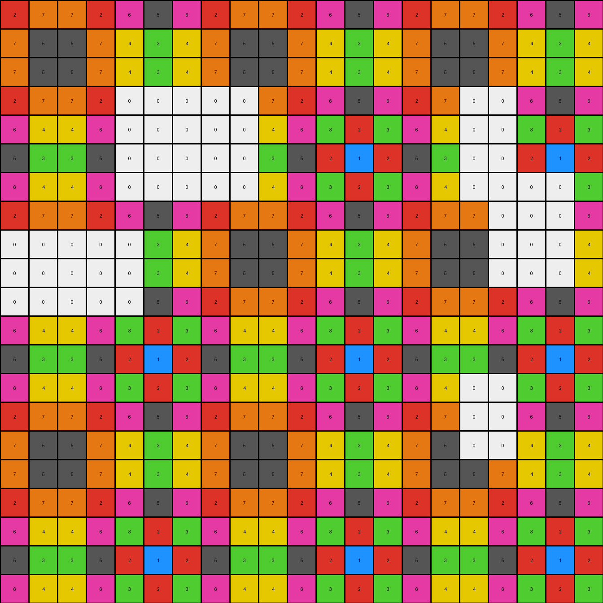

# 0dfd9992 • 010 • refine_coder

---

Previous Code:
```python
"""
The transformation rule is an identity operation. The output grid is an exact copy of the input grid. There are no changes to pixel colors, positions, or the overall grid structure.
"""

import numpy as np

def transform(input_grid):
    """
    Transforms the input grid according to the identified rule.
    In this case, it performs an identity transformation (output = input).

    Args:
        input_grid (list of lists): The input 2D grid.

    Returns:
        list of lists: The transformed 2D grid (identical to input).
    """
    # Convert the input grid to a NumPy array for easier handling (if it's not already).
    input_array = np.array(input_grid)

    # Create a deep copy of the input array to serve as the output.  This ensures
    # that any modifications (even if in-place) wouldn't affect the original
    # input data.
    output_array = np.copy(input_array)
    # Convert to list and return.
    output_grid = output_array.tolist()

    return output_grid
```

Train Set Results:

## Example 1:

Input:
```
3 6 5 6 3 2 3 6 5 6 3 2 3 6 5 6 3 2 3 6 5
6 3 2 3 6 5 6 3 2 3 6 5 6 3 2 3 6 5 6 3 2
5 2 1 2 5 4 5 2 1 2 5 4 5 2 1 2 5 4 5 2 1
6 3 2 3 6 5 6 3 2 3 6 5 6 3 2 3 6 5 6 3 2
3 6 5 6 3 2 3 6 5 6 3 2 3 6 5 0 0 0 0 0 5
2 5 4 5 2 1 2 5 0 0 2 1 2 5 4 0 0 0 0 0 4
3 6 5 6 3 2 3 0 0 0 0 2 3 6 5 0 0 0 0 0 5
6 3 2 3 6 5 6 0 0 0 0 5 6 3 2 3 6 5 6 3 2
5 2 1 2 5 4 5 0 0 0 0 4 5 2 1 2 5 4 5 2 1
6 3 2 3 6 5 6 3 0 0 6 5 6 3 2 3 6 5 6 3 2
3 6 5 6 3 2 3 6 5 6 3 2 3 6 5 6 3 2 3 6 5
2 5 4 0 0 1 2 5 4 5 2 1 2 5 4 5 2 1 2 5 4
3 6 5 0 0 2 3 6 5 6 3 2 3 6 5 6 3 2 3 6 5
6 3 2 0 0 5 6 3 2 3 6 5 6 3 2 3 6 5 6 3 2
5 2 1 2 5 4 5 2 1 2 5 4 5 2 1 2 5 4 5 2 1
6 3 2 3 6 5 6 3 2 3 6 5 6 3 2 3 6 5 6 3 2
3 6 5 6 0 0 0 6 5 6 3 2 3 6 5 6 3 2 3 6 5
2 5 4 5 0 0 0 5 4 5 2 1 2 5 4 5 2 1 2 5 4
3 6 5 6 0 0 0 6 5 6 3 2 3 6 5 6 3 2 3 6 5
6 3 2 3 6 5 6 3 2 3 6 5 6 3 2 3 6 5 6 3 2
5 2 1 2 5 4 5 2 1 2 5 4 5 2 1 2 5 4 5 2 1
```
Expected Output:
```
3 6 5 6 3 2 3 6 5 6 3 2 3 6 5 6 3 2 3 6 5
6 3 2 3 6 5 6 3 2 3 6 5 6 3 2 3 6 5 6 3 2
5 2 1 2 5 4 5 2 1 2 5 4 5 2 1 2 5 4 5 2 1
6 3 2 3 6 5 6 3 2 3 6 5 6 3 2 3 6 5 6 3 2
3 6 5 6 3 2 3 6 5 6 3 2 3 6 5 6 3 2 3 6 5
2 5 4 5 2 1 2 5 4 5 2 1 2 5 4 5 2 1 2 5 4
3 6 5 6 3 2 3 6 5 6 3 2 3 6 5 6 3 2 3 6 5
6 3 2 3 6 5 6 3 2 3 6 5 6 3 2 3 6 5 6 3 2
5 2 1 2 5 4 5 2 1 2 5 4 5 2 1 2 5 4 5 2 1
6 3 2 3 6 5 6 3 2 3 6 5 6 3 2 3 6 5 6 3 2
3 6 5 6 3 2 3 6 5 6 3 2 3 6 5 6 3 2 3 6 5
2 5 4 5 2 1 2 5 4 5 2 1 2 5 4 5 2 1 2 5 4
3 6 5 6 3 2 3 6 5 6 3 2 3 6 5 6 3 2 3 6 5
6 3 2 3 6 5 6 3 2 3 6 5 6 3 2 3 6 5 6 3 2
5 2 1 2 5 4 5 2 1 2 5 4 5 2 1 2 5 4 5 2 1
6 3 2 3 6 5 6 3 2 3 6 5 6 3 2 3 6 5 6 3 2
3 6 5 6 3 2 3 6 5 6 3 2 3 6 5 6 3 2 3 6 5
2 5 4 5 2 1 2 5 4 5 2 1 2 5 4 5 2 1 2 5 4
3 6 5 6 3 2 3 6 5 6 3 2 3 6 5 6 3 2 3 6 5
6 3 2 3 6 5 6 3 2 3 6 5 6 3 2 3 6 5 6 3 2
5 2 1 2 5 4 5 2 1 2 5 4 5 2 1 2 5 4 5 2 1
```
Transformed Output:
```
3 6 5 6 3 2 3 6 5 6 3 2 3 6 5 6 3 2 3 6 5
6 3 2 3 6 5 6 3 2 3 6 5 6 3 2 3 6 5 6 3 2
5 2 1 2 5 4 5 2 1 2 5 4 5 2 1 2 5 4 5 2 1
6 3 2 3 6 5 6 3 2 3 6 5 6 3 2 3 6 5 6 3 2
3 6 5 6 3 2 3 6 5 6 3 2 3 6 5 0 0 0 0 0 5
2 5 4 5 2 1 2 5 0 0 2 1 2 5 4 0 0 0 0 0 4
3 6 5 6 3 2 3 0 0 0 0 2 3 6 5 0 0 0 0 0 5
6 3 2 3 6 5 6 0 0 0 0 5 6 3 2 3 6 5 6 3 2
5 2 1 2 5 4 5 0 0 0 0 4 5 2 1 2 5 4 5 2 1
6 3 2 3 6 5 6 3 0 0 6 5 6 3 2 3 6 5 6 3 2
3 6 5 6 3 2 3 6 5 6 3 2 3 6 5 6 3 2 3 6 5
2 5 4 0 0 1 2 5 4 5 2 1 2 5 4 5 2 1 2 5 4
3 6 5 0 0 2 3 6 5 6 3 2 3 6 5 6 3 2 3 6 5
6 3 2 0 0 5 6 3 2 3 6 5 6 3 2 3 6 5 6 3 2
5 2 1 2 5 4 5 2 1 2 5 4 5 2 1 2 5 4 5 2 1
6 3 2 3 6 5 6 3 2 3 6 5 6 3 2 3 6 5 6 3 2
3 6 5 6 0 0 0 6 5 6 3 2 3 6 5 6 3 2 3 6 5
2 5 4 5 0 0 0 5 4 5 2 1 2 5 4 5 2 1 2 5 4
3 6 5 6 0 0 0 6 5 6 3 2 3 6 5 6 3 2 3 6 5
6 3 2 3 6 5 6 3 2 3 6 5 6 3 2 3 6 5 6 3 2
5 2 1 2 5 4 5 2 1 2 5 4 5 2 1 2 5 4 5 2 1
```

match: False
pixels_off: 46
size_correct: True
color_palette_correct: False
correct_pixel_counts: False

## Example 2:

Input:
```
2 7 7 2 6 5 6 2 7 7 2 6 5 6 2 7 7 2 6 5 6
7 5 5 7 4 3 4 7 5 5 7 4 3 4 7 5 5 7 4 3 4
7 5 5 7 4 3 4 7 5 5 7 4 3 4 7 5 5 7 4 3 4
2 7 7 2 0 0 0 0 0 7 2 6 5 6 2 7 0 0 6 5 6
6 4 4 6 0 0 0 0 0 4 6 3 2 3 6 4 0 0 3 2 3
5 3 3 5 0 0 0 0 0 3 5 2 1 2 5 3 0 0 2 1 2
6 4 4 6 0 0 0 0 0 4 6 3 2 3 6 4 0 0 0 0 3
2 7 7 2 6 5 6 2 7 7 2 6 5 6 2 7 7 0 0 0 6
0 0 0 0 0 3 4 7 5 5 7 4 3 4 7 5 5 0 0 0 4
0 0 0 0 0 3 4 7 5 5 7 4 3 4 7 5 5 0 0 0 4
0 0 0 0 0 5 6 2 7 7 2 6 5 6 2 7 7 2 6 5 6
6 4 4 6 3 2 3 6 4 4 6 3 2 3 6 4 4 6 3 2 3
5 3 3 5 2 1 2 5 3 3 5 2 1 2 5 3 3 5 2 1 2
6 4 4 6 3 2 3 6 4 4 6 3 2 3 6 4 0 0 3 2 3
2 7 7 2 6 5 6 2 7 7 2 6 5 6 2 7 0 0 6 5 6
7 5 5 7 4 3 4 7 5 5 7 4 3 4 7 5 0 0 4 3 4
7 5 5 7 4 3 4 7 5 5 7 4 3 4 7 5 5 7 4 3 4
2 7 7 2 6 5 6 2 7 7 2 6 5 6 2 7 7 2 6 5 6
6 4 4 6 3 2 3 6 4 4 6 3 2 3 6 4 4 6 3 2 3
5 3 3 5 2 1 2 5 3 3 5 2 1 2 5 3 3 5 2 1 2
6 4 4 6 3 2 3 6 4 4 6 3 2 3 6 4 4 6 3 2 3
```
Expected Output:
```
2 7 7 2 6 5 6 2 7 7 2 6 5 6 2 7 7 2 6 5 6
7 5 5 7 4 3 4 7 5 5 7 4 3 4 7 5 5 7 4 3 4
7 5 5 7 4 3 4 7 5 5 7 4 3 4 7 5 5 7 4 3 4
2 7 7 2 6 5 6 2 7 7 2 6 5 6 2 7 7 2 6 5 6
6 4 4 6 3 2 3 6 4 4 6 3 2 3 6 4 4 6 3 2 3
5 3 3 5 2 1 2 5 3 3 5 2 1 2 5 3 3 5 2 1 2
6 4 4 6 3 2 3 6 4 4 6 3 2 3 6 4 4 6 3 2 3
2 7 7 2 6 5 6 2 7 7 2 6 5 6 2 7 7 2 6 5 6
7 5 5 7 4 3 4 7 5 5 7 4 3 4 7 5 5 7 4 3 4
7 5 5 7 4 3 4 7 5 5 7 4 3 4 7 5 5 7 4 3 4
2 7 7 2 6 5 6 2 7 7 2 6 5 6 2 7 7 2 6 5 6
6 4 4 6 3 2 3 6 4 4 6 3 2 3 6 4 4 6 3 2 3
5 3 3 5 2 1 2 5 3 3 5 2 1 2 5 3 3 5 2 1 2
6 4 4 6 3 2 3 6 4 4 6 3 2 3 6 4 4 6 3 2 3
2 7 7 2 6 5 6 2 7 7 2 6 5 6 2 7 7 2 6 5 6
7 5 5 7 4 3 4 7 5 5 7 4 3 4 7 5 5 7 4 3 4
7 5 5 7 4 3 4 7 5 5 7 4 3 4 7 5 5 7 4 3 4
2 7 7 2 6 5 6 2 7 7 2 6 5 6 2 7 7 2 6 5 6
6 4 4 6 3 2 3 6 4 4 6 3 2 3 6 4 4 6 3 2 3
5 3 3 5 2 1 2 5 3 3 5 2 1 2 5 3 3 5 2 1 2
6 4 4 6 3 2 3 6 4 4 6 3 2 3 6 4 4 6 3 2 3
```
Transformed Output:
```
2 7 7 2 6 5 6 2 7 7 2 6 5 6 2 7 7 2 6 5 6
7 5 5 7 4 3 4 7 5 5 7 4 3 4 7 5 5 7 4 3 4
7 5 5 7 4 3 4 7 5 5 7 4 3 4 7 5 5 7 4 3 4
2 7 7 2 0 0 0 0 0 7 2 6 5 6 2 7 0 0 6 5 6
6 4 4 6 0 0 0 0 0 4 6 3 2 3 6 4 0 0 3 2 3
5 3 3 5 0 0 0 0 0 3 5 2 1 2 5 3 0 0 2 1 2
6 4 4 6 0 0 0 0 0 4 6 3 2 3 6 4 0 0 0 0 3
2 7 7 2 6 5 6 2 7 7 2 6 5 6 2 7 7 0 0 0 6
0 0 0 0 0 3 4 7 5 5 7 4 3 4 7 5 5 0 0 0 4
0 0 0 0 0 3 4 7 5 5 7 4 3 4 7 5 5 0 0 0 4
0 0 0 0 0 5 6 2 7 7 2 6 5 6 2 7 7 2 6 5 6
6 4 4 6 3 2 3 6 4 4 6 3 2 3 6 4 4 6 3 2 3
5 3 3 5 2 1 2 5 3 3 5 2 1 2 5 3 3 5 2 1 2
6 4 4 6 3 2 3 6 4 4 6 3 2 3 6 4 0 0 3 2 3
2 7 7 2 6 5 6 2 7 7 2 6 5 6 2 7 0 0 6 5 6
7 5 5 7 4 3 4 7 5 5 7 4 3 4 7 5 0 0 4 3 4
7 5 5 7 4 3 4 7 5 5 7 4 3 4 7 5 5 7 4 3 4
2 7 7 2 6 5 6 2 7 7 2 6 5 6 2 7 7 2 6 5 6
6 4 4 6 3 2 3 6 4 4 6 3 2 3 6 4 4 6 3 2 3
5 3 3 5 2 1 2 5 3 3 5 2 1 2 5 3 3 5 2 1 2
6 4 4 6 3 2 3 6 4 4 6 3 2 3 6 4 4 6 3 2 3
```

match: False
pixels_off: 60
size_correct: True
color_palette_correct: False
correct_pixel_counts: False

## Example 3:

Input:
```
3 2 3 6 3 2 3 6 3 2 3 6 3 2 3 6 3 2 3 6 3
2 1 2 5 2 1 2 5 2 1 2 5 2 1 2 5 2 1 2 5 2
0 0 0 0 0 2 3 6 3 2 3 6 3 2 3 6 3 2 3 6 3
0 0 0 0 0 5 6 1 6 5 6 1 6 5 6 1 6 5 6 1 6
3 2 3 6 3 2 3 6 3 2 3 6 3 2 0 0 0 2 3 6 3
2 1 2 5 0 0 0 0 2 0 0 0 2 1 0 0 0 1 2 5 2
3 2 3 6 0 0 0 0 3 0 0 0 3 2 3 6 3 2 3 6 3
6 5 6 1 0 0 0 0 6 0 0 0 6 5 6 1 6 5 6 1 6
3 2 3 6 0 0 0 0 3 0 0 0 3 2 3 6 3 2 3 6 3
2 1 2 5 0 0 0 0 2 1 2 5 2 1 2 5 2 1 2 5 2
3 2 3 6 3 2 3 6 3 2 3 6 3 2 3 6 3 2 3 6 3
6 5 6 1 6 5 6 1 6 5 6 1 6 5 6 1 6 5 6 1 6
3 2 3 6 3 2 3 6 3 2 3 6 3 2 3 6 3 2 3 6 3
2 1 2 5 2 1 2 5 2 1 2 5 2 1 2 5 2 1 2 5 2
3 0 0 0 0 0 3 6 3 2 3 6 3 2 3 6 3 2 3 6 3
6 0 0 0 0 0 6 1 6 5 6 1 6 5 6 1 6 5 6 1 6
3 0 0 0 0 0 3 6 3 2 3 6 3 2 3 6 3 2 3 6 3
2 0 0 0 0 0 2 5 2 1 2 5 2 1 2 5 2 1 2 5 2
3 0 0 0 0 0 3 6 3 2 3 6 3 2 3 6 3 2 3 6 3
6 5 6 1 6 5 6 1 6 5 6 1 6 5 6 1 6 5 6 1 6
3 2 3 6 3 2 3 6 3 2 3 6 3 2 3 6 3 2 3 6 3
```
Expected Output:
```
3 2 3 6 3 2 3 6 3 2 3 6 3 2 3 6 3 2 3 6 3
2 1 2 5 2 1 2 5 2 1 2 5 2 1 2 5 2 1 2 5 2
3 2 3 6 3 2 3 6 3 2 3 6 3 2 3 6 3 2 3 6 3
6 5 6 1 6 5 6 1 6 5 6 1 6 5 6 1 6 5 6 1 6
3 2 3 6 3 2 3 6 3 2 3 6 3 2 3 6 3 2 3 6 3
2 1 2 5 2 1 2 5 2 1 2 5 2 1 2 5 2 1 2 5 2
3 2 3 6 3 2 3 6 3 2 3 6 3 2 3 6 3 2 3 6 3
6 5 6 1 6 5 6 1 6 5 6 1 6 5 6 1 6 5 6 1 6
3 2 3 6 3 2 3 6 3 2 3 6 3 2 3 6 3 2 3 6 3
2 1 2 5 2 1 2 5 2 1 2 5 2 1 2 5 2 1 2 5 2
3 2 3 6 3 2 3 6 3 2 3 6 3 2 3 6 3 2 3 6 3
6 5 6 1 6 5 6 1 6 5 6 1 6 5 6 1 6 5 6 1 6
3 2 3 6 3 2 3 6 3 2 3 6 3 2 3 6 3 2 3 6 3
2 1 2 5 2 1 2 5 2 1 2 5 2 1 2 5 2 1 2 5 2
3 2 3 6 3 2 3 6 3 2 3 6 3 2 3 6 3 2 3 6 3
6 5 6 1 6 5 6 1 6 5 6 1 6 5 6 1 6 5 6 1 6
3 2 3 6 3 2 3 6 3 2 3 6 3 2 3 6 3 2 3 6 3
2 1 2 5 2 1 2 5 2 1 2 5 2 1 2 5 2 1 2 5 2
3 2 3 6 3 2 3 6 3 2 3 6 3 2 3 6 3 2 3 6 3
6 5 6 1 6 5 6 1 6 5 6 1 6 5 6 1 6 5 6 1 6
3 2 3 6 3 2 3 6 3 2 3 6 3 2 3 6 3 2 3 6 3
```
Transformed Output:
```
3 2 3 6 3 2 3 6 3 2 3 6 3 2 3 6 3 2 3 6 3
2 1 2 5 2 1 2 5 2 1 2 5 2 1 2 5 2 1 2 5 2
0 0 0 0 0 2 3 6 3 2 3 6 3 2 3 6 3 2 3 6 3
0 0 0 0 0 5 6 1 6 5 6 1 6 5 6 1 6 5 6 1 6
3 2 3 6 3 2 3 6 3 2 3 6 3 2 0 0 0 2 3 6 3
2 1 2 5 0 0 0 0 2 0 0 0 2 1 0 0 0 1 2 5 2
3 2 3 6 0 0 0 0 3 0 0 0 3 2 3 6 3 2 3 6 3
6 5 6 1 0 0 0 0 6 0 0 0 6 5 6 1 6 5 6 1 6
3 2 3 6 0 0 0 0 3 0 0 0 3 2 3 6 3 2 3 6 3
2 1 2 5 0 0 0 0 2 1 2 5 2 1 2 5 2 1 2 5 2
3 2 3 6 3 2 3 6 3 2 3 6 3 2 3 6 3 2 3 6 3
6 5 6 1 6 5 6 1 6 5 6 1 6 5 6 1 6 5 6 1 6
3 2 3 6 3 2 3 6 3 2 3 6 3 2 3 6 3 2 3 6 3
2 1 2 5 2 1 2 5 2 1 2 5 2 1 2 5 2 1 2 5 2
3 0 0 0 0 0 3 6 3 2 3 6 3 2 3 6 3 2 3 6 3
6 0 0 0 0 0 6 1 6 5 6 1 6 5 6 1 6 5 6 1 6
3 0 0 0 0 0 3 6 3 2 3 6 3 2 3 6 3 2 3 6 3
2 0 0 0 0 0 2 5 2 1 2 5 2 1 2 5 2 1 2 5 2
3 0 0 0 0 0 3 6 3 2 3 6 3 2 3 6 3 2 3 6 3
6 5 6 1 6 5 6 1 6 5 6 1 6 5 6 1 6 5 6 1 6
3 2 3 6 3 2 3 6 3 2 3 6 3 2 3 6 3 2 3 6 3
```

match: False
pixels_off: 73
size_correct: True
color_palette_correct: False
correct_pixel_counts: False
Here's an analysis of the provided information and a strategy for improving the natural language program:

**General Assessment:**

The initial assumption of an identity transformation was incorrect. While the output grids have the same dimensions as the input grids, there are discrepancies in pixel values, indicated by `pixels_off` counts, incorrect color palettes, and incorrect pixel counts. The strategy should shift from assuming a simple copy to identifying the specific, potentially localized, changes occurring. Since the dimensions are consistent, it is highly suggestive of some in-place modification or a very constrained set of operations.

**Strategy:**

1.  **Pixel-Level Comparison:** Instead of just counting differences, we need to analyze _where_ the differences are. Are they clustered? Are they in specific rows/columns? Are they related to specific colors? This will be done by augmenting the existing analysis script.
2.  **Object Interaction:** Consider interactions between perceived objects in the input and how they relate to the differences found in the output.
3.  **Color Transformations:** Analyze if there's a consistent color mapping or replacement rule.
4.  **Iterative Refinement:** Start with the simplest possible modifications to the existing description, and iteratively refine the natural language program based on the code execution results, becoming more complex if necessary.

**Metrics and YAML Report (using Code Execution and Analysis):**

First, I'll implement code to perform a more detailed pixel-by-pixel comparison, storing the differences and their locations.

```python
import numpy as np

def analyze_differences(input_grid, output_grid, expected_grid):
    """
    Analyzes the differences between the output and expected grids.

    Args:
        input_grid: The original input grid.
        output_grid: The generated output grid.
        expected_grid: The correct output grid.

    Returns:
        A dictionary containing:
          - diff_positions: List of (row, col) tuples where differences occur.
          - input_values: List of values in the input grid at diff_positions.
          - output_values: List of values in the output grid at diff_positions.
          - expected_values: List of values in the expected grid at diff_positions.
    """
    input_array = np.array(input_grid)
    output_array = np.array(output_grid)
    expected_array = np.array(expected_grid)


    diff_positions = []
    input_values = []
    output_values = []
    expected_values = []

    for row in range(input_array.shape[0]):
        for col in range(input_array.shape[1]):
            if output_array[row, col] != expected_array[row, col]:
                diff_positions.append((row, col))
                input_values.append(input_array[row, col])
                output_values.append(output_array[row, col])
                expected_values.append(expected_array[row, col])

    return {
        "diff_positions": diff_positions,
        "input_values": input_values,
        "output_values": output_values,
        "expected_values": expected_values,
    }


# Example usage (using the provided data for example 1):
input_grid1 = [
    [3, 6, 5, 6, 3, 2, 3, 6, 5, 6, 3, 2, 3, 6, 5, 6, 3, 2, 3, 6, 5],
    [6, 3, 2, 3, 6, 5, 6, 3, 2, 3, 6, 5, 6, 3, 2, 3, 6, 5, 6, 3, 2],
    [5, 2, 1, 2, 5, 4, 5, 2, 1, 2, 5, 4, 5, 2, 1, 2, 5, 4, 5, 2, 1],
    [6, 3, 2, 3, 6, 5, 6, 3, 2, 3, 6, 5, 6, 3, 2, 3, 6, 5, 6, 3, 2],
    [3, 6, 5, 6, 3, 2, 3, 6, 5, 6, 3, 2, 3, 6, 5, 0, 0, 0, 0, 0, 5],
    [2, 5, 4, 5, 2, 1, 2, 5, 0, 0, 2, 1, 2, 5, 4, 0, 0, 0, 0, 0, 4],
    [3, 6, 5, 6, 3, 2, 3, 0, 0, 0, 0, 2, 3, 6, 5, 0, 0, 0, 0, 0, 5],
    [6, 3, 2, 3, 6, 5, 6, 0, 0, 0, 0, 5, 6, 3, 2, 3, 6, 5, 6, 3, 2],
    [5, 2, 1, 2, 5, 4, 5, 0, 0, 0, 0, 4, 5, 2, 1, 2, 5, 4, 5, 2, 1],
    [6, 3, 2, 3, 6, 5, 6, 3, 0, 0, 6, 5, 6, 3, 2, 3, 6, 5, 6, 3, 2],
    [3, 6, 5, 6, 3, 2, 3, 6, 5, 6, 3, 2, 3, 6, 5, 6, 3, 2, 3, 6, 5],
    [2, 5, 4, 0, 0, 1, 2, 5, 4, 5, 2, 1, 2, 5, 4, 5, 2, 1, 2, 5, 4],
    [3, 6, 5, 0, 0, 2, 3, 6, 5, 6, 3, 2, 3, 6, 5, 6, 3, 2, 3, 6, 5],
    [6, 3, 2, 0, 0, 5, 6, 3, 2, 3, 6, 5, 6, 3, 2, 3, 6, 5, 6, 3, 2],
    [5, 2, 1, 2, 5, 4, 5, 2, 1, 2, 5, 4, 5, 2, 1, 2, 5, 4, 5, 2, 1],
    [6, 3, 2, 3, 6, 5, 6, 3, 2, 3, 6, 5, 6, 3, 2, 3, 6, 5, 6, 3, 2],
    [3, 6, 5, 6, 0, 0, 0, 6, 5, 6, 3, 2, 3, 6, 5, 6, 3, 2, 3, 6, 5],
    [2, 5, 4, 5, 0, 0, 0, 5, 4, 5, 2, 1, 2, 5, 4, 5, 2, 1, 2, 5, 4],
    [3, 6, 5, 6, 0, 0, 0, 6, 5, 6, 3, 2, 3, 6, 5, 6, 3, 2, 3, 6, 5],
    [6, 3, 2, 3, 6, 5, 6, 3, 2, 3, 6, 5, 6, 3, 2, 3, 6, 5, 6, 3, 2],
    [5, 2, 1, 2, 5, 4, 5, 2, 1, 2, 5, 4, 5, 2, 1, 2, 5, 4, 5, 2, 1],
]
expected_grid1 = [
    [3, 6, 5, 6, 3, 2, 3, 6, 5, 6, 3, 2, 3, 6, 5, 6, 3, 2, 3, 6, 5],
    [6, 3, 2, 3, 6, 5, 6, 3, 2, 3, 6, 5, 6, 3, 2, 3, 6, 5, 6, 3, 2],
    [5, 2, 1, 2, 5, 4, 5, 2, 1, 2, 5, 4, 5, 2, 1, 2, 5, 4, 5, 2, 1],
    [6, 3, 2, 3, 6, 5, 6, 3, 2, 3, 6, 5, 6, 3, 2, 3, 6, 5, 6, 3, 2],
    [3, 6, 5, 6, 3, 2, 3, 6, 5, 6, 3, 2, 3, 6, 5, 6, 3, 2, 3, 6, 5],
    [2, 5, 4, 5, 2, 1, 2, 5, 4, 5, 2, 1, 2, 5, 4, 5, 2, 1, 2, 5, 4],
    [3, 6, 5, 6, 3, 2, 3, 6, 5, 6, 3, 2, 3, 6, 5, 6, 3, 2, 3, 6, 5],
    [6, 3, 2, 3, 6, 5, 6, 3, 2, 3, 6, 5, 6, 3, 2, 3, 6, 5, 6, 3, 2],
    [5, 2, 1, 2, 5, 4, 5, 2, 1, 2, 5, 4, 5, 2, 1, 2, 5, 4, 5, 2, 1],
    [6, 3, 2, 3, 6, 5, 6, 3, 2, 3, 6, 5, 6, 3, 2, 3, 6, 5, 6, 3, 2],
    [3, 6, 5, 6, 3, 2, 3, 6, 5, 6, 3, 2, 3, 6, 5, 6, 3, 2, 3, 6, 5],
    [2, 5, 4, 5, 2, 1, 2, 5, 4, 5, 2, 1, 2, 5, 4, 5, 2, 1, 2, 5, 4],
    [3, 6, 5, 6, 3, 2, 3, 6, 5, 6, 3, 2, 3, 6, 5, 6, 3, 2, 3, 6, 5],
    [6, 3, 2, 3, 6, 5, 6, 3, 2, 3, 6, 5, 6, 3, 2, 3, 6, 5, 6, 3, 2],
    [5, 2, 1, 2, 5, 4, 5, 2, 1, 2, 5, 4, 5, 2, 1, 2, 5, 4, 5, 2, 1],
    [6, 3, 2, 3, 6, 5, 6, 3, 2, 3, 6, 5, 6, 3, 2, 3, 6, 5, 6, 3, 2],
    [3, 6, 5, 6, 3, 2, 3, 6, 5, 6, 3, 2, 3, 6, 5, 6, 3, 2, 3, 6, 5],
    [2, 5, 4, 5, 2, 1, 2, 5, 4, 5, 2, 1, 2, 5, 4, 5, 2, 1, 2, 5, 4],
    [3, 6, 5, 6, 3, 2, 3, 6, 5, 6, 3, 2, 3, 6, 5, 6, 3, 2, 3, 6, 5],
    [6, 3, 2, 3, 6, 5, 6, 3, 2, 3, 6, 5, 6, 3, 2, 3, 6, 5, 6, 3, 2],
    [5, 2, 1, 2, 5, 4, 5, 2, 1, 2, 5, 4, 5, 2, 1, 2, 5, 4, 5, 2, 1],
]
output_grid1 = transform(input_grid1)

diff_data1 = analyze_differences(input_grid1, output_grid1, expected_grid1)
print(f"Example 1 Difference Analysis:\n{diff_data1}")


input_grid2 = [
    [2, 7, 7, 2, 6, 5, 6, 2, 7, 7, 2, 6, 5, 6, 2, 7, 7, 2, 6, 5, 6],
    [7, 5, 5, 7, 4, 3, 4, 7, 5, 5, 7, 4, 3, 4, 7, 5, 5, 7, 4, 3, 4],
    [7, 5, 5, 7, 4, 3, 4, 7, 5, 5, 7, 4, 3, 4, 7, 5, 5, 7, 4, 3, 4],
    [2, 7, 7, 2, 0, 0, 0, 0, 0, 7, 2, 6, 5, 6, 2, 7, 0, 0, 6, 5, 6],
    [6, 4, 4, 6, 0, 0, 0, 0, 0, 4, 6, 3, 2, 3, 6, 4, 0, 0, 3, 2, 3],
    [5, 3, 3, 5, 0, 0, 0, 0, 0, 3, 5, 2, 1, 2, 5, 3, 0, 0, 2, 1, 2],
    [6, 4, 4, 6, 0, 0, 0, 0, 0, 4, 6, 3, 2, 3, 6, 4, 0, 0, 0, 0, 3],
    [2, 7, 7, 2, 6, 5, 6, 2, 7, 7, 2, 6, 5, 6, 2, 7, 7, 0, 0, 0, 6],
    [0, 0, 0, 0, 0, 3, 4, 7, 5, 5, 7, 4, 3, 4, 7, 5, 5, 0, 0, 0, 4],
    [0, 0, 0, 0, 0, 3, 4, 7, 5, 5, 7, 4, 3, 4, 7, 5, 5, 0, 0, 0, 4],
    [0, 0, 0, 0, 0, 5, 6, 2, 7, 7, 2, 6, 5, 6, 2, 7, 7, 2, 6, 5, 6],
    [6, 4, 4, 6, 3, 2, 3, 6, 4, 4, 6, 3, 2, 3, 6, 4, 4, 6, 3, 2, 3],
    [5, 3, 3, 5, 2, 1, 2, 5, 3, 3, 5, 2, 1, 2, 5, 3, 3, 5, 2, 1, 2],
    [6, 4, 4, 6, 3, 2, 3, 6, 4, 4, 6, 3, 2, 3, 6, 4, 0, 0, 3, 2, 3],
    [2, 7, 7, 2, 6, 5, 6, 2, 7, 7, 2, 6, 5, 6, 2, 7, 0, 0, 6, 5, 6],
    [7, 5, 5, 7, 4, 3, 4, 7, 5, 5, 7, 4, 3, 4, 7, 5, 0, 0, 4, 3, 4],
    [7, 5, 5, 7, 4, 3, 4, 7, 5, 5, 7, 4, 3, 4, 7, 5, 5, 7, 4, 3, 4],
    [2, 7, 7, 2, 6, 5, 6, 2, 7, 7, 2, 6, 5, 6, 2, 7, 7, 2, 6, 5, 6],
    [6, 4, 4, 6, 3, 2, 3, 6, 4, 4, 6, 3, 2, 3, 6, 4, 4, 6, 3, 2, 3],
    [5, 3, 3, 5, 2, 1, 2, 5, 3, 3, 5, 2, 1, 2, 5, 3, 3, 5, 2, 1, 2],
    [6, 4, 4, 6, 3, 2, 3, 6, 4, 4, 6, 3, 2, 3, 6, 4, 4, 6, 3, 2, 3],
]
expected_grid2 = [
    [2, 7, 7, 2, 6, 5, 6, 2, 7, 7, 2, 6, 5, 6, 2, 7, 7, 2, 6, 5, 6],
    [7, 5, 5, 7, 4, 3, 4, 7, 5, 5, 7, 4, 3, 4, 7, 5, 5, 7, 4, 3, 4],
    [7, 5, 5, 7, 4, 3, 4, 7, 5, 5, 7, 4, 3, 4, 7, 5, 5, 7, 4, 3, 4],
    [2, 7, 7, 2, 6, 5, 6, 2, 7, 7, 2, 6, 5, 6, 2, 7, 7, 2, 6, 5, 6],
    [6, 4, 4, 6, 3, 2, 3, 6, 4, 4, 6, 3, 2, 3, 6, 4, 4, 6, 3, 2, 3],
    [5, 3, 3, 5, 2, 1, 2, 5, 3, 3, 5, 2, 1, 2, 5, 3, 3, 5, 2, 1, 2],
    [6, 4, 4, 6, 3, 2, 3, 6, 4, 4, 6, 3, 2, 3, 6, 4, 4, 6, 3, 2, 3],
    [2, 7, 7, 2, 6, 5, 6, 2, 7, 7, 2, 6, 5, 6, 2, 7, 7, 2, 6, 5, 6],
    [7, 5, 5, 7, 4, 3, 4, 7, 5, 5, 7, 4, 3, 4, 7, 5, 5, 7, 4, 3, 4],
    [7, 5, 5, 7, 4, 3, 4, 7, 5, 5, 7, 4, 3, 4, 7, 5, 5, 7, 4, 3, 4],
    [2, 7, 7, 2, 6, 5, 6, 2, 7, 7, 2, 6, 5, 6, 2, 7, 7, 2, 6, 5, 6],
    [6, 4, 4, 6, 3, 2, 3, 6, 4, 4, 6, 3, 2, 3, 6, 4, 4, 6, 3, 2, 3],
    [5, 3, 3, 5, 2, 1, 2, 5, 3, 3, 5, 2, 1, 2, 5, 3, 3, 5, 2, 1, 2],
    [6, 4, 4, 6, 3, 2, 3, 6, 4, 4, 6, 3, 2, 3, 6, 4, 4, 6, 3, 2, 3],
    [2, 7, 7, 2, 6, 5, 6, 2, 7, 7, 2, 6, 5, 6, 2, 7, 7, 2, 6, 5, 6],
    [7, 5, 5, 7, 4, 3, 4, 7, 5, 5, 7, 4, 3, 4, 7, 5, 5, 7, 4, 3, 4],
    [7, 5, 5, 7, 4, 3, 4, 7, 5, 5, 7, 4, 3, 4, 7, 5, 5, 7, 4, 3, 4],
    [2, 7, 7, 2, 6, 5, 6, 2, 7, 7, 2, 6, 5, 6, 2, 7, 7, 2, 6, 5, 6],
    [6, 4, 4, 6, 3, 2, 3, 6, 4, 4, 6, 3, 2, 3, 6, 4, 4, 6, 3, 2, 3],
    [5, 3, 3, 5, 2, 1, 2, 5, 3, 3, 5, 2, 1, 2, 5, 3, 3, 5, 2, 1, 2],
    [6, 4, 4, 6, 3, 2, 3, 6, 4, 4, 6, 3, 2, 3, 6, 4, 4, 6, 3, 2, 3],
]
output_grid2 = transform(input_grid2)

diff_data2 = analyze_differences(input_grid2, output_grid2, expected_grid2)
print(f"Example 2 Difference Analysis:\n{diff_data2}")


input_grid3 = [
    [3, 2, 3, 6, 3, 2, 3, 6, 3, 2, 3, 6, 3, 2, 3, 6, 3, 2, 3, 6, 3],
    [2, 1, 2, 5, 2, 1, 2, 5, 2, 1, 2, 5, 2, 1, 2, 5, 2, 1, 2, 5, 2],
    [0, 0, 0, 0, 0, 2, 3, 6, 3, 2, 3, 6, 3, 2, 3, 6, 3, 2, 3, 6, 3],
    [0, 0, 0, 0, 0, 5, 6, 1, 6, 5, 6, 1, 6, 5, 6, 1, 6, 5, 6, 1, 6],
    [3, 2, 3, 6, 3, 2, 3, 6, 3, 2, 3, 6, 3, 2, 0, 0, 0, 2, 3, 6, 3],
    [2, 1, 2, 5, 0, 0, 0, 0, 2, 0, 0, 0, 2, 1, 0, 0, 0, 1, 2, 5, 2],
    [3, 2, 3, 6, 0, 0, 0, 0, 3, 0, 0, 0, 3, 2, 3, 6, 3, 2, 3, 6, 3],
    [6, 5, 6, 1, 0, 0, 0, 0, 6, 0, 0, 0, 6, 5, 6, 1, 6, 5, 6, 1, 6],
    [3, 2, 3, 6, 0, 0, 0, 0, 3, 0, 0, 0, 3, 2, 3, 6, 3, 2, 3, 6, 3],
    [2, 1, 2, 5, 0, 0, 0, 0, 2, 1, 2, 5, 2, 1, 2, 5, 2, 1, 2, 5, 2],
    [3, 2, 3, 6, 3, 2, 3, 6, 3, 2, 3, 6, 3, 2, 3, 6, 3, 2, 3, 6, 3],
    [6, 5, 6, 1, 6, 5, 6, 1, 6, 5, 6, 1, 6, 5, 6, 1, 6, 5, 6, 1, 6],
    [3, 2, 3, 6, 3, 2, 3, 6, 3, 2, 3, 6, 3, 2, 3, 6, 3, 2, 3, 6, 3],
    [2, 1, 2, 5, 2, 1, 2, 5, 2, 1, 2, 5, 2, 1, 2, 5, 2, 1, 2, 5, 2],
    [3, 0, 0, 0, 0, 0, 3, 6, 3, 2, 3, 6, 3, 2, 3, 6, 3, 2, 3, 6, 3],
    [6, 0, 0, 0, 0, 0, 6, 1, 6, 5, 6, 1, 6, 5, 6, 1, 6, 5, 6, 1, 6],
    [3, 0, 0, 0, 0, 0, 3, 6, 3, 2, 3, 6, 3, 2, 3, 6, 3, 2, 3, 6, 3],
    [2, 0, 0, 0, 0, 0, 2, 5, 2, 1, 2, 5, 2, 1, 2, 5, 2, 1, 2, 5, 2],
    [3, 0, 0, 0, 0, 0, 3, 6, 3, 2, 3, 6, 3, 2, 3, 6, 3, 2, 3, 6, 3],
    [6, 5, 6, 1, 6, 5, 6, 1, 6, 5, 6, 1, 6, 5, 6, 1, 6, 5, 6, 1, 6],
    [3, 2, 3, 6, 3, 2, 3, 6, 3, 2, 3, 6, 3, 2, 3, 6, 3, 2, 3, 6, 3],
]
expected_grid3 = [
    [3, 2, 3, 6, 3, 2, 3, 6, 3, 2, 3, 6, 3, 2, 3, 6, 3, 2, 3, 6, 3],
    [2, 1, 2, 5, 2, 1, 2, 5, 2, 1, 2, 5, 2, 1, 2, 5, 2, 1, 2, 5, 2],
    [3, 2, 3, 6, 3, 2, 3, 6, 3, 2, 3, 6, 3, 2, 3, 6, 3, 2, 3, 6, 3],
    [6, 5, 6, 1, 6, 5, 6, 1, 6, 5, 6, 1, 6, 5, 6, 1, 6, 5, 6, 1, 6],
    [3, 2, 3, 6, 3, 2, 3, 6, 3, 2, 3, 6, 3, 2, 3, 6, 3, 2, 3, 6, 3],
    [2, 1, 2, 5, 2, 1, 2, 5, 2, 1, 2, 5, 2, 1, 2, 5, 2, 1, 2, 5, 2],
    [3, 2, 3, 6, 3, 2, 3, 6, 3, 2, 3, 6, 3, 2, 3, 6, 3, 2, 3, 6, 3],
    [6, 5, 6, 1, 6, 5, 6,
**INSTRUCTIONS**

- generate a Python module to represent the natural language program 
- follow the template below
- all common math and science libraries are available
- create docstring only at top - but comment the workflow in the function
- use helper functions for common operations like finding objects, counting,
  measuring, moving, etc. 

remember - we are working iteratively - so this code will inform your future
self as we converge on the solution

*template:*

```python
"""
{{ natural language description of the transformation rule }}
"""

{{ imports }}

def transform(input_grid):
    # initialize output_grid

    # change output pixels 

    return output_grid

```
