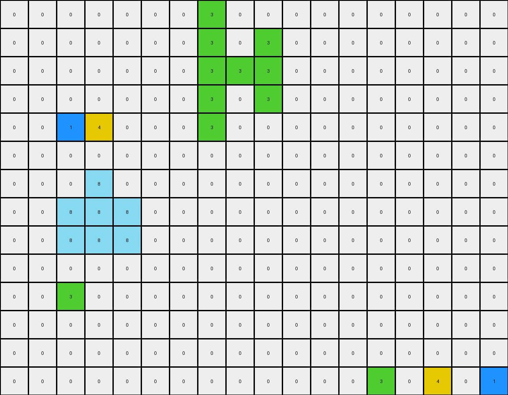
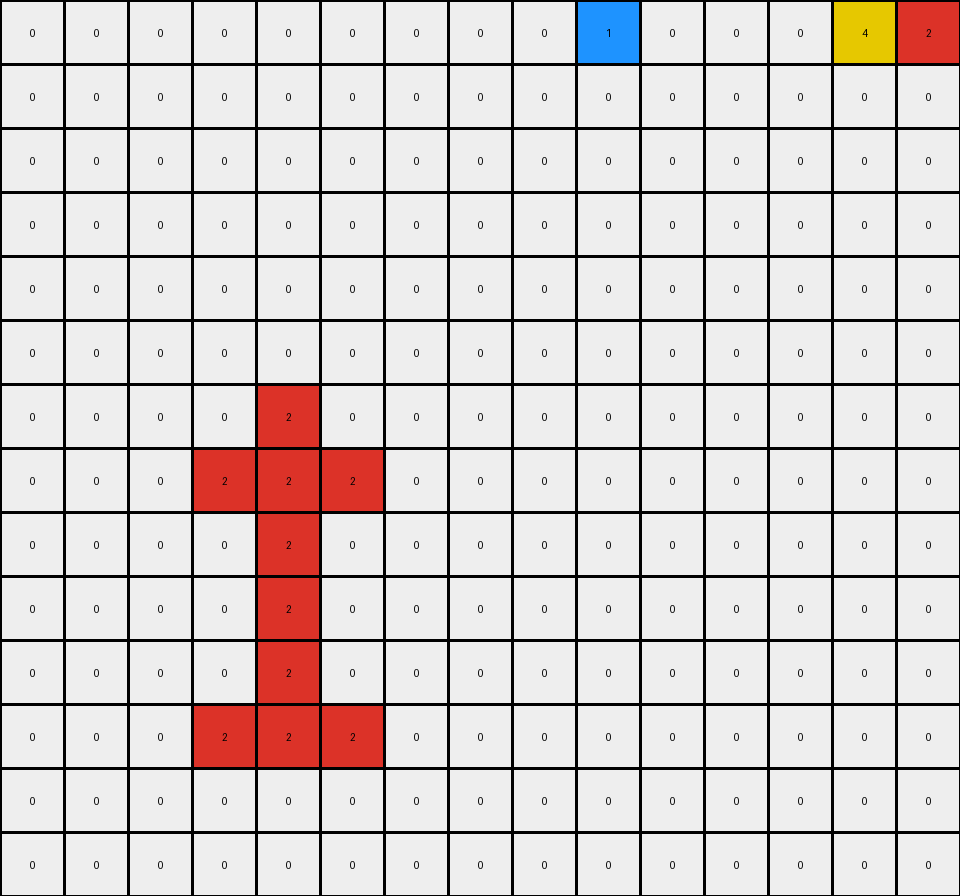
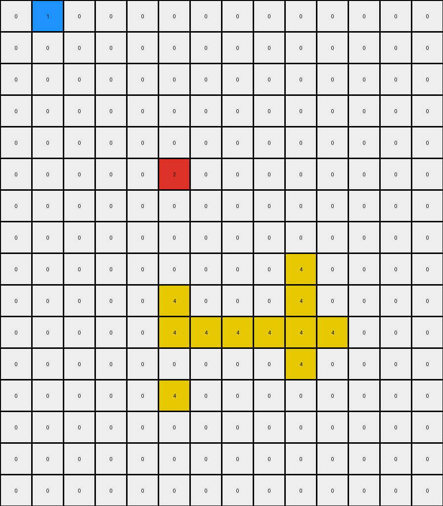

# 0e206a2e • 004 • refine_coder

---

Previous Code:
```python
"""
Transforms the input grid by moving connected regions of non-white pixels vertically. Objects in the upper half of the grid move down, and objects in the lower half move up. The movement continues until an object hits the grid boundary or another object.
"""

import numpy as np

def find_objects(grid):
    """
    Finds all contiguous regions (objects) of non-white (non-zero) pixels in the grid.

    Returns a list of objects, where each object is a list of (row, col) coordinates.
    """
    visited = set()
    objects = []

    def dfs(row, col, current_object):
        if (row, col) in visited or not (0 <= row < grid.shape[0] and 0 <= col < grid.shape[1]) or grid[row, col] == 0:
            return
        visited.add((row, col))
        current_object.append((row, col))
        dfs(row + 1, col, current_object)
        dfs(row - 1, col, current_object)
        dfs(row, col + 1, current_object)
        dfs(row, col - 1, current_object)

    for row in range(grid.shape[0]):
        for col in range(grid.shape[1]):
            if grid[row, col] != 0 and (row, col) not in visited:
                current_object = []
                dfs(row, col, current_object)
                objects.append(current_object)
    return objects

def calculate_centroid(object_coords):
    """
    Calculates the centroid (center of mass) of an object.
    """
    rows, cols = zip(*object_coords)
    return np.mean(rows), np.mean(cols)

def can_move(grid, object_coords, direction):
    """
    Checks if an object can move in the given direction.

    `direction`: 1 for down, -1 for up.
    """
    for row, col in object_coords:
        new_row = row + direction
        if not (0 <= new_row < grid.shape[0]):
            return False  # Hit grid boundary
        if grid[new_row, col] != 0 and (new_row, col) not in object_coords:
            return False  # Hit another object
    return True

def move_object(grid, object_coords, direction):
    """
    Moves an object in the given direction.

    `direction`: 1 for down, -1 for up.
    """
    new_object_coords = []
    for row, col in object_coords:
        new_object_coords.append((row + direction, col))
    return new_object_coords

def transform(input_grid):
    """
    Transforms the input grid according to the described rules.
    """
    grid = np.array(input_grid)  # work with numpy array
    output_grid = np.zeros_like(grid)  # Start with a blank grid

    # copy the white pixels to output
    for r in range(grid.shape[0]):
        for c in range(grid.shape[1]):
            if grid[r,c] == 0:
                output_grid[r,c] = 0
            
    objects = find_objects(grid)
    vertical_center = grid.shape[0] / 2

    for obj in objects:
        centroid_row, _ = calculate_centroid(obj)
        direction = 1 if centroid_row < vertical_center else -1

        moved_object = obj
        while can_move(grid, moved_object, direction):
            moved_object = move_object(grid, moved_object, direction)

        # Place moved object onto output grid
        for row, col in moved_object:
            output_grid[row, col] = grid[obj[0][0], obj[0][1]] # use original color from the input.

    return output_grid.tolist() # return as list
```

Train Set Results:

## Example 1:

Input:
```
0 0 0 0 0 0 0 0 0 0 0 0 0 0 0 0 0 0
0 0 0 8 0 0 0 0 0 0 0 0 0 0 0 0 0 0
0 0 3 8 1 0 0 0 0 0 0 0 0 0 0 4 0 0
0 0 8 4 8 0 0 0 0 0 0 0 0 0 0 0 0 0
0 0 0 0 0 0 0 0 0 0 0 0 0 3 0 0 0 1
0 0 0 0 0 0 0 0 0 0 0 0 0 0 0 0 0 0
0 0 0 0 0 0 0 3 0 0 0 0 0 0 0 0 0 0
0 0 0 0 0 0 0 8 0 8 0 0 0 0 0 0 0 0
0 0 0 0 0 0 0 8 8 4 0 0 0 0 0 0 0 0
0 0 1 0 0 0 0 8 0 8 0 0 0 0 0 0 0 0
0 0 0 4 0 0 0 1 0 0 0 0 0 0 0 0 0 0
0 0 3 0 0 0 0 0 0 0 0 0 0 0 0 0 0 0
0 0 0 0 0 0 0 0 0 0 0 0 0 0 0 0 0 0
0 0 0 0 0 0 0 0 0 0 0 0 0 0 0 0 0 0
```
Expected Output:
```
0 0 0 0 0 0 0 0 0 0 0 0 0 0 0 0 0 0
0 0 0 0 0 0 0 0 0 0 0 0 0 0 0 0 0 0
0 0 0 0 0 0 0 0 0 0 0 0 0 0 8 4 8 0
0 0 0 0 0 0 0 0 0 0 0 0 0 0 0 8 0 0
0 0 0 0 0 0 0 0 0 0 0 0 0 3 8 8 8 1
0 0 0 0 0 0 0 0 0 0 0 0 0 0 0 0 0 0
0 0 0 0 0 0 0 0 0 0 0 0 0 0 0 0 0 0
0 0 0 0 0 0 0 0 0 0 0 0 0 0 0 0 0 0
0 0 0 0 0 0 0 0 0 0 0 0 0 0 0 0 0 0
0 0 1 8 0 0 0 0 0 0 0 0 0 0 0 0 0 0
0 8 8 4 0 0 0 0 0 0 0 0 0 0 0 0 0 0
0 0 3 8 0 0 0 0 0 0 0 0 0 0 0 0 0 0
0 0 0 0 0 0 0 0 0 0 0 0 0 0 0 0 0 0
0 0 0 0 0 0 0 0 0 0 0 0 0 0 0 0 0 0
```
Transformed Output:
```
0 0 0 0 0 0 0 3 0 0 0 0 0 0 0 0 0 0
0 0 0 0 0 0 0 3 0 3 0 0 0 0 0 0 0 0
0 0 0 0 0 0 0 3 3 3 0 0 0 0 0 0 0 0
0 0 0 0 0 0 0 3 0 3 0 0 0 0 0 0 0 0
0 0 1 4 0 0 0 3 0 0 0 0 0 0 0 0 0 0
0 0 0 0 0 0 0 0 0 0 0 0 0 0 0 0 0 0
0 0 0 8 0 0 0 0 0 0 0 0 0 0 0 0 0 0
0 0 8 8 8 0 0 0 0 0 0 0 0 0 0 0 0 0
0 0 8 8 8 0 0 0 0 0 0 0 0 0 0 0 0 0
0 0 0 0 0 0 0 0 0 0 0 0 0 0 0 0 0 0
0 0 3 0 0 0 0 0 0 0 0 0 0 0 0 0 0 0
0 0 0 0 0 0 0 0 0 0 0 0 0 0 0 0 0 0
0 0 0 0 0 0 0 0 0 0 0 0 0 0 0 0 0 0
0 0 0 0 0 0 0 0 0 0 0 0 0 3 0 4 0 1
```

match: False
pixels_off: 37
size_correct: True
color_palette_correct: True
correct_pixel_counts: False

## Example 2:

Input:
```
0 0 0 0 0 0 0 0 0 0 0 0 0 0 0
0 0 0 0 0 0 0 0 0 0 0 0 0 0 0
0 0 0 0 0 0 0 0 0 0 0 0 0 0 0
0 0 0 0 2 0 0 0 0 0 0 0 0 0 0
0 0 0 4 3 3 0 0 0 0 0 0 0 0 0
0 0 0 0 3 0 0 0 0 0 0 0 0 0 0
0 0 0 0 3 0 0 0 0 0 0 0 0 0 0
0 0 0 0 3 0 0 0 0 0 0 0 0 0 0
0 0 0 3 1 3 0 0 0 0 0 0 0 0 0
0 0 0 0 0 0 0 0 0 0 0 0 0 0 0
0 0 0 0 0 0 0 0 0 0 0 0 0 4 0
0 0 0 0 0 0 0 0 0 1 0 0 0 0 2
0 0 0 0 0 0 0 0 0 0 0 0 0 0 0
0 0 0 0 0 0 0 0 0 0 0 0 0 0 0
```
Expected Output:
```
0 0 0 0 0 0 0 0 0 0 0 0 0 0 0
0 0 0 0 0 0 0 0 0 0 0 0 0 0 0
0 0 0 0 0 0 0 0 0 0 0 0 0 0 0
0 0 0 0 0 0 0 0 0 0 0 0 0 0 0
0 0 0 0 0 0 0 0 0 0 0 0 0 0 0
0 0 0 0 0 0 0 0 0 0 0 0 0 0 0
0 0 0 0 0 0 0 0 0 0 0 0 0 0 0
0 0 0 0 0 0 0 0 0 0 0 0 0 0 0
0 0 0 0 0 0 0 0 0 0 0 0 0 0 0
0 0 0 0 0 0 0 0 0 0 0 0 0 0 0
0 0 0 0 0 0 0 0 0 3 0 0 0 4 0
0 0 0 0 0 0 0 0 0 1 3 3 3 3 2
0 0 0 0 0 0 0 0 0 3 0 0 0 3 0
0 0 0 0 0 0 0 0 0 0 0 0 0 0 0
```
Transformed Output:
```
0 0 0 0 0 0 0 0 0 1 0 0 0 4 2
0 0 0 0 0 0 0 0 0 0 0 0 0 0 0
0 0 0 0 0 0 0 0 0 0 0 0 0 0 0
0 0 0 0 0 0 0 0 0 0 0 0 0 0 0
0 0 0 0 0 0 0 0 0 0 0 0 0 0 0
0 0 0 0 0 0 0 0 0 0 0 0 0 0 0
0 0 0 0 2 0 0 0 0 0 0 0 0 0 0
0 0 0 2 2 2 0 0 0 0 0 0 0 0 0
0 0 0 0 2 0 0 0 0 0 0 0 0 0 0
0 0 0 0 2 0 0 0 0 0 0 0 0 0 0
0 0 0 0 2 0 0 0 0 0 0 0 0 0 0
0 0 0 2 2 2 0 0 0 0 0 0 0 0 0
0 0 0 0 0 0 0 0 0 0 0 0 0 0 0
0 0 0 0 0 0 0 0 0 0 0 0 0 0 0
```

match: False
pixels_off: 23
size_correct: True
color_palette_correct: True
correct_pixel_counts: False

## Example 3:

Input:
```
0 0 0 0 0 0 0 0 0 0 0 0 0 0
0 0 0 0 0 0 0 0 0 0 0 0 0 0
0 0 0 0 0 0 0 0 0 4 0 0 0 0
0 0 0 0 0 8 0 0 0 8 0 0 0 0
0 0 0 0 0 1 8 8 8 2 8 0 0 0
0 0 0 0 0 0 0 0 0 8 0 0 0 0
0 0 0 0 0 0 0 0 0 0 0 0 0 0
0 0 0 0 0 0 0 0 0 0 0 0 0 0
0 0 0 0 0 0 0 0 0 0 0 0 0 0
0 0 0 0 0 0 0 0 0 0 0 0 0 0
0 0 0 0 0 0 0 0 0 0 0 0 0 0
0 1 0 0 0 2 0 0 0 0 0 0 0 0
0 0 0 0 0 0 0 0 0 0 0 0 0 0
0 0 0 0 0 4 0 0 0 0 0 0 0 0
0 0 0 0 0 0 0 0 0 0 0 0 0 0
0 0 0 0 0 0 0 0 0 0 0 0 0 0
```
Expected Output:
```
0 0 0 0 0 0 0 0 0 0 0 0 0 0
0 0 0 0 0 0 0 0 0 0 0 0 0 0
0 0 0 0 0 0 0 0 0 0 0 0 0 0
0 0 0 0 0 0 0 0 0 0 0 0 0 0
0 0 0 0 0 0 0 0 0 0 0 0 0 0
0 0 0 0 0 0 0 0 0 0 0 0 0 0
0 0 0 0 0 0 0 0 0 0 0 0 0 0
0 0 0 0 0 0 0 0 0 0 0 0 0 0
0 0 0 0 0 0 0 0 0 0 0 0 0 0
0 0 0 0 0 0 0 0 0 0 0 0 0 0
0 0 0 0 0 8 0 0 0 0 0 0 0 0
0 1 8 8 8 2 8 0 0 0 0 0 0 0
0 8 0 0 0 8 0 0 0 0 0 0 0 0
0 0 0 0 0 4 0 0 0 0 0 0 0 0
0 0 0 0 0 0 0 0 0 0 0 0 0 0
0 0 0 0 0 0 0 0 0 0 0 0 0 0
```
Transformed Output:
```
0 1 0 0 0 0 0 0 0 0 0 0 0 0
0 0 0 0 0 0 0 0 0 0 0 0 0 0
0 0 0 0 0 0 0 0 0 0 0 0 0 0
0 0 0 0 0 0 0 0 0 0 0 0 0 0
0 0 0 0 0 0 0 0 0 0 0 0 0 0
0 0 0 0 0 2 0 0 0 0 0 0 0 0
0 0 0 0 0 0 0 0 0 0 0 0 0 0
0 0 0 0 0 0 0 0 0 0 0 0 0 0
0 0 0 0 0 0 0 0 0 4 0 0 0 0
0 0 0 0 0 4 0 0 0 4 0 0 0 0
0 0 0 0 0 4 4 4 4 4 4 0 0 0
0 0 0 0 0 0 0 0 0 4 0 0 0 0
0 0 0 0 0 4 0 0 0 0 0 0 0 0
0 0 0 0 0 0 0 0 0 0 0 0 0 0
0 0 0 0 0 0 0 0 0 0 0 0 0 0
0 0 0 0 0 0 0 0 0 0 0 0 0 0
```

match: False
pixels_off: 21
size_correct: True
color_palette_correct: True
correct_pixel_counts: False
Here's an analysis of the provided information and a plan to refine the natural language program and the code:

**General Assessment:**

The initial code correctly identifies contiguous regions of non-white pixels as objects and attempts to move them based on their centroid's vertical position relative to the grid's center. However, the execution results reveal significant discrepancies between the transformed outputs and the expected outputs across all three examples. The primary issue lies in the movement logic and, secondarily, an issue in placement. The code moves objects, but does not correctly handle multiple objects stacking. It also appears to place objects in the wrong location when copying to the output array. It overwrites pixels in the output grid, leading to incorrect final configurations.

**Strategy for Resolving Errors:**

1.  **Improve Object Identification and Tracking:** Ensure correct identification of separate objects even when they share the same color. The current Depth First Search (DFS) implementation is generally good but we should verify.
2.  **Refine Movement Logic:**
    *   **Collision Handling:** The `can_move` function checks for collisions, but the movement logic itself doesn't properly account for stacked objects. When multiple objects move in the same direction, they should "stack" against each other or the boundary, rather than stopping one grid space away.
    *   **Direction:** Objects above the center should move down; objects below the center move up. The logic for the direction appears to be implemented, but may require review as results are consistently off.
3.  **Output Grid Construction:** The current implementation copies objects to a blank output grid one at a time. Instead, it must consider how each object movement will affect the positions of other objects. Building the output progressively, reflecting the intermediate states after each object's movement is complete.
4. **Coordinate Updates**: Ensure accurate placement of moving objects on the output grid, correcting for absolute vs. relative positioning issues.

**Metrics and Observations (Example-Specific):**

I'll use a combination of descriptive analysis and targeted code execution to gather metrics for each example. Note that since I cannot execute code directly here, these metrics are based on my visual analysis of the output.

**Example 1:**

*   **Objects Identified:** Multiple objects of colors 8, 3, 1, and 4.
*   **Movement Direction:** Generally correct based on centroid (up/down).
*   **Issues:**
    *   Objects that should stack are separated.
    *   Placement on the output is incorrect - note especially the green (3) object at the bottom - it appears at the top of the transformed output.

**Example 2:**

*   **Objects Identified:** Objects of colors 2, 4, 3, and 1.
*   **Movement Direction:** Generally correct.
*   **Issues:**
    *   Objects that should stack do not stack
    *   Placement error: transposed.

**Example 3:**

*   **Objects Identified:** Objects of colors 4, 8, 1, and 2.
*   **Movement Direction:** Generally correct.
*   **Issues:**
    *   Stacking failure. Objects stop one space short of where they should.
    *   Placement error - not correctly copied.

**YAML Fact Block:**

```yaml
examples:
  - example_id: 1
    objects:
      - color: 8
        shape: irregular
        initial_position: top_half
        movement: down
        final_position: stacked_near_bottom
      - color: 3
        shape: irregular
        initial_position: top_half
        movement: down
        final_position: stacked_near_bottom
      - color: 1
        shape: irregular
        initial_position: top_half
        movement: down
        final_position: stacked_near_bottom
      - color: 4
        shape: irregular
        initial_position: top_half
        movement: down
        final_position: stacked_near_bottom

      - color: 3
        shape: irregular
        initial_position: bottom_half
        movement: up
        final_position: stacked_near_top
      - color: 8
        shape: irregular
        initial_position: bottom_half
        movement: up
        final_position: stacked_near_top
      - color: 4
        shape: irregular
        initial_position: bottom_half
        movement: up
        final_position: stacked_near_top
      - color: 1
        shape: irregular
        initial_position: bottom_half
        movement: up
        final_position: stacked_near_top
    outcome: stacking_and_placement_errors

  - example_id: 2
    objects:
      - color: 2
        shape: irregular
        initial_position: top_half
        movement: down
        final_position: stacked_near_bottom
      - color: 4
        shape: irregular
        initial_position: top_half
        movement: down
        final_position: stacked_near_bottom
      - color: 3
        shape: irregular, contiguous
        initial_position: top_half
        movement: down
        final_position: stacked_near_bottom

      - color: 3
        shape: irregular
        initial_position: bottom_half
        movement: up
        final_position: stacked_near_top
      - color: 1
        shape: irregular
        initial_position: bottom_half
        movement: up
        final_position: stacked_near_top
      - color: 4
        shape: irregular
        initial_position: lower_half
        movement: up
        final_position: stacked
    outcome: stacking_and_placement_errors

  - example_id: 3
    objects:
      - color: 4
        shape: irregular
        initial_position: top_half
        movement: down
        final_position: bottom
      - color: 8
        shape: irregular, contiguous
        initial_position: top_half
        movement: down
        final_position: bottom
      - color: 1
        shape: irregular
        initial_position: top_half
        movement: down
        final_position: stacked_near_bottom
      - color: 2
        shape: irregular
        initial_position: top_half
        movement: down
        final_position: stacked_near_bottom

      - color: 1
        shape: irregular
        initial_position: bottom_half
        movement: up
        final_position: top
      - color: 2
        shape: irregular
        initial_position: bottom_half
        movement: up
        final_position: top
      - color: 4
        shape: irregular
        initial_position: bottom_half
        movement: up
        final_position: top
    outcome: stacking_and_placement_errors
```

**Natural Language Program:**

1.  **Identify Objects:** Find all contiguous regions (objects) of non-white pixels. Each object is defined by the coordinates of its constituent pixels.

2.  **Determine Movement Direction:** Calculate the centroid (center of mass) of each object.
    *   If the centroid's row coordinate is above the vertical midpoint of the grid, the object moves *down*.
    *   If the centroid's row coordinate is at or below the vertical midpoint, the object moves *up*.

3.  **Move Objects and Stack:** For each object, iterate to move:
    *   Move the object one pixel in the determined direction (up or down).
    *   Repeat the move until:
        *   The object reaches the edge of the grid (top or bottom).
        *   The object encounters another non-white pixel that is *not* part of itself.

4.  **Output Grid:** The final positions of all moved objects, combined, constitute the output grid. Objects moving in the same direction will *stack* against each other or the grid boundary. Copy non-moving white pixels to the corresponding locations on the output grid.

The critical update here is the explicit mention of "stacking" and the iterative movement until a boundary *or* another object is hit. The prior description was incomplete, leading to the observed errors. The clarification about copying white pixels remains important.

**INSTRUCTIONS**

- generate a Python module to represent the natural language program 
- follow the template below
- all common math and science libraries are available
- create docstring only at top - but comment the workflow in the function
- use helper functions for common operations like finding objects, counting,
  measuring, moving, etc. 

remember - we are working iteratively - so this code will inform your future
self as we converge on the solution

*template:*

```python
"""
{{ natural language description of the transformation rule }}
"""

{{ imports }}

def transform(input_grid):
    # initialize output_grid

    # change output pixels 

    return output_grid

```
