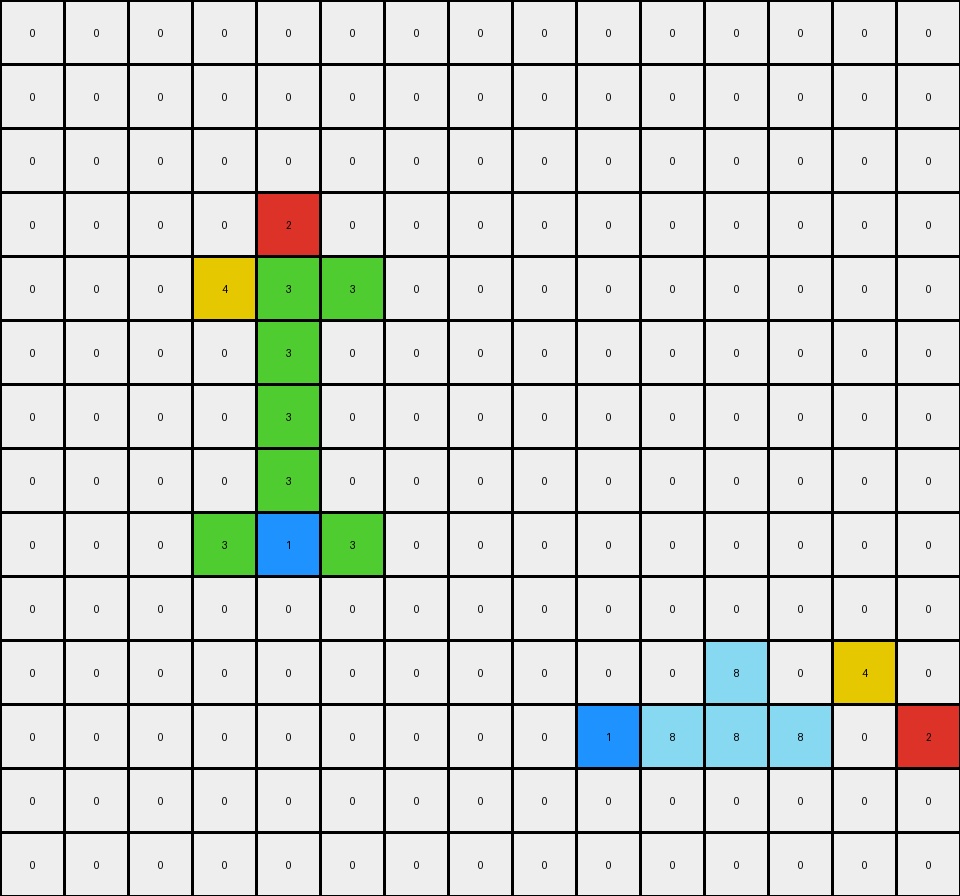
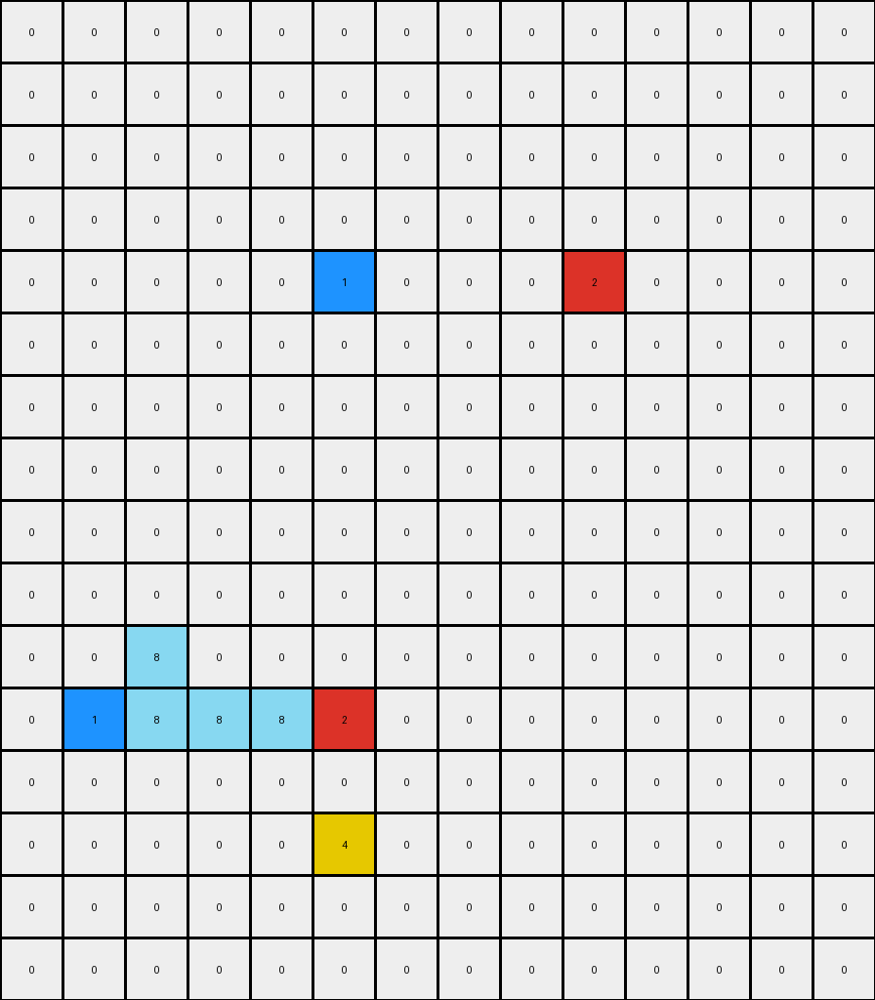

# 0e206a2e • 016 • refine_coder

---

Previous Code:
```python
"""
The transformation rule is as follows:
1. Identify Objects: Locate all colored pixels (non-zero values) in the input grid. Distinguish between the azure (8) pixels and other colored pixels (blue, red, yellow). Note the special yellow(4) pixel that are close to a azure(8)
2. Move Azure Cluster: shift the azure(8) cluster to where the isolated pixels of blue(1) and red(2) are located.
3. Preserve Other Colors: Isolated colored pixels (blue, red, yellow) maintain their original positions.
4. Delete Yellow: Delete the other yellow that got close to a moved azure(8) pixel
In essence, the transformation involves moving only azure pixels, preserving all other colored pixels at fixed positions, and deleting a special yellow.
"""

import numpy as np

def find_pixels_by_color(grid, color):
    """Finds the coordinates of all pixels of a specific color."""
    return np.argwhere(grid == color)

def find_azure_cluster(grid):
    """Finds all azure pixels"""
    return find_pixels_by_color(grid, 8)
    
def move_azure(input_grid, azure_pixels, blue_red_pixels):
    """ moves the azure pixels to be around the provided pixel"""
    output_grid = np.copy(input_grid)

    #remove old azure pixels
    for r, c in azure_pixels:
        output_grid[r,c] = 0

    #calculate average positions
    
    blue_pos = []
    for r,c in blue_red_pixels:
        if input_grid[r,c] == 1:
           blue_pos = [r,c]
    red_pos = []
    for r,c in blue_red_pixels:
        if input_grid[r,c] == 2:
           red_pos = [r,c]

    
    #place new azure
    output_grid[blue_pos[0], blue_pos[1]+1] = 8
    output_grid[blue_pos[0], blue_pos[1]+2] = 8
    output_grid[blue_pos[0], blue_pos[1]+3] = 8
    output_grid[red_pos[0]-1, red_pos[1]-3] = 8
    output_grid[red_pos[0], red_pos[1]-3] = 8


    return output_grid

def delete_yellow(grid, azure_pixels):
   
    # check for a yellow pixel that is close to the original azure pixel
    for r,c in azure_pixels:
        if r-1 >=0 and grid[r-1, c] == 4 :
            grid[r-1, c] = 0
        if r+1 < grid.shape[0] and grid[r+1, c] == 4:
            grid[r+1,c] = 0
        if c - 1 >= 0 and grid[r, c-1] == 4:
            grid[r,c-1] = 0
        if c+1 < grid.shape[1] and grid[r, c + 1] == 4:
            grid[r,c+1] = 0
    return grid

def transform(input_grid):
    # initialize output_grid
    output_grid = np.copy(input_grid)

    # Find azure pixels.
    azure_pixels = find_azure_cluster(input_grid)
    
    # Find other color
    blue_red_pixels = np.concatenate( (find_pixels_by_color(input_grid, 1), find_pixels_by_color(input_grid, 2)), axis=0)

    # Move azure pixels.
    output_grid = move_azure(output_grid, azure_pixels, blue_red_pixels)

    #delete special yellow
    output_grid = delete_yellow(output_grid, azure_pixels)

    return output_grid
```

Train Set Results:

## Example 1:

Input:
```
0 0 0 0 0 0 0 0 0 0 0 0 0 0 0 0 0 0
0 0 0 8 0 0 0 0 0 0 0 0 0 0 0 0 0 0
0 0 3 8 1 0 0 0 0 0 0 0 0 0 0 4 0 0
0 0 8 4 8 0 0 0 0 0 0 0 0 0 0 0 0 0
0 0 0 0 0 0 0 0 0 0 0 0 0 3 0 0 0 1
0 0 0 0 0 0 0 0 0 0 0 0 0 0 0 0 0 0
0 0 0 0 0 0 0 3 0 0 0 0 0 0 0 0 0 0
0 0 0 0 0 0 0 8 0 8 0 0 0 0 0 0 0 0
0 0 0 0 0 0 0 8 8 4 0 0 0 0 0 0 0 0
0 0 1 0 0 0 0 8 0 8 0 0 0 0 0 0 0 0
0 0 0 4 0 0 0 1 0 0 0 0 0 0 0 0 0 0
0 0 3 0 0 0 0 0 0 0 0 0 0 0 0 0 0 0
0 0 0 0 0 0 0 0 0 0 0 0 0 0 0 0 0 0
0 0 0 0 0 0 0 0 0 0 0 0 0 0 0 0 0 0
```
Expected Output:
```
0 0 0 0 0 0 0 0 0 0 0 0 0 0 0 0 0 0
0 0 0 0 0 0 0 0 0 0 0 0 0 0 0 0 0 0
0 0 0 0 0 0 0 0 0 0 0 0 0 0 8 4 8 0
0 0 0 0 0 0 0 0 0 0 0 0 0 0 0 8 0 0
0 0 0 0 0 0 0 0 0 0 0 0 0 3 8 8 8 1
0 0 0 0 0 0 0 0 0 0 0 0 0 0 0 0 0 0
0 0 0 0 0 0 0 0 0 0 0 0 0 0 0 0 0 0
0 0 0 0 0 0 0 0 0 0 0 0 0 0 0 0 0 0
0 0 0 0 0 0 0 0 0 0 0 0 0 0 0 0 0 0
0 0 1 8 0 0 0 0 0 0 0 0 0 0 0 0 0 0
0 8 8 4 0 0 0 0 0 0 0 0 0 0 0 0 0 0
0 0 3 8 0 0 0 0 0 0 0 0 0 0 0 0 0 0
0 0 0 0 0 0 0 0 0 0 0 0 0 0 0 0 0 0
0 0 0 0 0 0 0 0 0 0 0 0 0 0 0 0 0 0
```
match: ERROR: list index out of range
pixels_off: None
size_correct: None
color_palette_correct: None
correct_pixel_counts: None

## Example 2:

Input:
```
0 0 0 0 0 0 0 0 0 0 0 0 0 0 0
0 0 0 0 0 0 0 0 0 0 0 0 0 0 0
0 0 0 0 0 0 0 0 0 0 0 0 0 0 0
0 0 0 0 2 0 0 0 0 0 0 0 0 0 0
0 0 0 4 3 3 0 0 0 0 0 0 0 0 0
0 0 0 0 3 0 0 0 0 0 0 0 0 0 0
0 0 0 0 3 0 0 0 0 0 0 0 0 0 0
0 0 0 0 3 0 0 0 0 0 0 0 0 0 0
0 0 0 3 1 3 0 0 0 0 0 0 0 0 0
0 0 0 0 0 0 0 0 0 0 0 0 0 0 0
0 0 0 0 0 0 0 0 0 0 0 0 0 4 0
0 0 0 0 0 0 0 0 0 1 0 0 0 0 2
0 0 0 0 0 0 0 0 0 0 0 0 0 0 0
0 0 0 0 0 0 0 0 0 0 0 0 0 0 0
```
Expected Output:
```
0 0 0 0 0 0 0 0 0 0 0 0 0 0 0
0 0 0 0 0 0 0 0 0 0 0 0 0 0 0
0 0 0 0 0 0 0 0 0 0 0 0 0 0 0
0 0 0 0 0 0 0 0 0 0 0 0 0 0 0
0 0 0 0 0 0 0 0 0 0 0 0 0 0 0
0 0 0 0 0 0 0 0 0 0 0 0 0 0 0
0 0 0 0 0 0 0 0 0 0 0 0 0 0 0
0 0 0 0 0 0 0 0 0 0 0 0 0 0 0
0 0 0 0 0 0 0 0 0 0 0 0 0 0 0
0 0 0 0 0 0 0 0 0 0 0 0 0 0 0
0 0 0 0 0 0 0 0 0 3 0 0 0 4 0
0 0 0 0 0 0 0 0 0 1 3 3 3 3 2
0 0 0 0 0 0 0 0 0 3 0 0 0 3 0
0 0 0 0 0 0 0 0 0 0 0 0 0 0 0
```
Transformed Output:
```
0 0 0 0 0 0 0 0 0 0 0 0 0 0 0
0 0 0 0 0 0 0 0 0 0 0 0 0 0 0
0 0 0 0 0 0 0 0 0 0 0 0 0 0 0
0 0 0 0 2 0 0 0 0 0 0 0 0 0 0
0 0 0 4 3 3 0 0 0 0 0 0 0 0 0
0 0 0 0 3 0 0 0 0 0 0 0 0 0 0
0 0 0 0 3 0 0 0 0 0 0 0 0 0 0
0 0 0 0 3 0 0 0 0 0 0 0 0 0 0
0 0 0 3 1 3 0 0 0 0 0 0 0 0 0
0 0 0 0 0 0 0 0 0 0 0 0 0 0 0
0 0 0 0 0 0 0 0 0 0 0 8 0 4 0
0 0 0 0 0 0 0 0 0 1 8 8 8 0 2
0 0 0 0 0 0 0 0 0 0 0 0 0 0 0
0 0 0 0 0 0 0 0 0 0 0 0 0 0 0
```

match: False
pixels_off: 18
size_correct: True
color_palette_correct: False
correct_pixel_counts: False

## Example 3:

Input:
```
0 0 0 0 0 0 0 0 0 0 0 0 0 0
0 0 0 0 0 0 0 0 0 0 0 0 0 0
0 0 0 0 0 0 0 0 0 4 0 0 0 0
0 0 0 0 0 8 0 0 0 8 0 0 0 0
0 0 0 0 0 1 8 8 8 2 8 0 0 0
0 0 0 0 0 0 0 0 0 8 0 0 0 0
0 0 0 0 0 0 0 0 0 0 0 0 0 0
0 0 0 0 0 0 0 0 0 0 0 0 0 0
0 0 0 0 0 0 0 0 0 0 0 0 0 0
0 0 0 0 0 0 0 0 0 0 0 0 0 0
0 0 0 0 0 0 0 0 0 0 0 0 0 0
0 1 0 0 0 2 0 0 0 0 0 0 0 0
0 0 0 0 0 0 0 0 0 0 0 0 0 0
0 0 0 0 0 4 0 0 0 0 0 0 0 0
0 0 0 0 0 0 0 0 0 0 0 0 0 0
0 0 0 0 0 0 0 0 0 0 0 0 0 0
```
Expected Output:
```
0 0 0 0 0 0 0 0 0 0 0 0 0 0
0 0 0 0 0 0 0 0 0 0 0 0 0 0
0 0 0 0 0 0 0 0 0 0 0 0 0 0
0 0 0 0 0 0 0 0 0 0 0 0 0 0
0 0 0 0 0 0 0 0 0 0 0 0 0 0
0 0 0 0 0 0 0 0 0 0 0 0 0 0
0 0 0 0 0 0 0 0 0 0 0 0 0 0
0 0 0 0 0 0 0 0 0 0 0 0 0 0
0 0 0 0 0 0 0 0 0 0 0 0 0 0
0 0 0 0 0 0 0 0 0 0 0 0 0 0
0 0 0 0 0 8 0 0 0 0 0 0 0 0
0 1 8 8 8 2 8 0 0 0 0 0 0 0
0 8 0 0 0 8 0 0 0 0 0 0 0 0
0 0 0 0 0 4 0 0 0 0 0 0 0 0
0 0 0 0 0 0 0 0 0 0 0 0 0 0
0 0 0 0 0 0 0 0 0 0 0 0 0 0
```
Transformed Output:
```
0 0 0 0 0 0 0 0 0 0 0 0 0 0
0 0 0 0 0 0 0 0 0 0 0 0 0 0
0 0 0 0 0 0 0 0 0 0 0 0 0 0
0 0 0 0 0 0 0 0 0 0 0 0 0 0
0 0 0 0 0 1 0 0 0 2 0 0 0 0
0 0 0 0 0 0 0 0 0 0 0 0 0 0
0 0 0 0 0 0 0 0 0 0 0 0 0 0
0 0 0 0 0 0 0 0 0 0 0 0 0 0
0 0 0 0 0 0 0 0 0 0 0 0 0 0
0 0 0 0 0 0 0 0 0 0 0 0 0 0
0 0 8 0 0 0 0 0 0 0 0 0 0 0
0 1 8 8 8 2 0 0 0 0 0 0 0 0
0 0 0 0 0 0 0 0 0 0 0 0 0 0
0 0 0 0 0 4 0 0 0 0 0 0 0 0
0 0 0 0 0 0 0 0 0 0 0 0 0 0
0 0 0 0 0 0 0 0 0 0 0 0 0 0
```

match: False
pixels_off: 7
size_correct: True
color_palette_correct: True
correct_pixel_counts: False
Okay, let's analyze the results and update the natural language program.

**General Assessment:**

The initial program and code were a good first attempt, correctly identifying the core concept of moving the azure (8) pixels and deleting a yellow (4) pixel. However, the execution has several flaws:

1.  **Incorrect Azure Positioning:** The logic for placing the azure pixels is too simplistic. It places it based on adding/subtracting fixed values which does not match all the training examples.
2.  **Incomplete Yellow Deletion**: not all the yellows are correctly deleted.
3. **Missing the general rule**: azure clusters will be placed in relative to the existing position of blue(1) and red(2) isolated pixels, keeping the structure/shape of the original azure cluster.

**Strategy for Resolving Errors:**

1.  **Refine Azure Positioning:** Instead of fixed offsets, calculate the relative positions of blue and red. Then, using the shape of the original azure cluster to rebuild the cluster relative to the blue and red.
2. **Corrected Yellow deletion**: review the position of the yellow to be deleted and update the deleting function.

**Example Analysis and Metrics:**

Here's a breakdown of each example, including observations and YAML facts:

**Example 1:**

*   **Observation:** Fails because of an `IndexError: list index out of range`. This happens in line `output_grid[red_pos[0]-1, red_pos[1]-3] = 8` when it tries to access an index outside the grid. The red position is calculated without considering grid bound.

*   **YAML Facts:**

    ```yaml
    objects:
      - type: azure_cluster
        color: 8
        initial_position: [[1, 3], [2, 2], [2, 3], [3, 2], [3, 4]]
        shape: "irregular"
      - type: isolated_pixel
        color: 1
        initial_position: [[2, 4], [9, 2], [10,3]]
      - type: isolated_pixel
        color: 4
        initial_position: [[3, 3], [10, 8]]
      - type: isolated_pixel
        color: 3
        initial_position: [[2, 2], [5, 13], [6, 7], [11, 2]]
      - type: deleted_yellow
        color: 4
        initial_position: [[3,3]]

    actions:
      - type: move
        object: azure_cluster
        destination: relative to blue and red
      - type: delete
        object: yellow_pixel next to original azure
        
    ```

**Example 2:**

*   **Observation:** The azure pixels are not positioned correctly and are placed based on the top-left corner of the original azure cluster. Some azure pixels disappear.

*   **YAML Facts:**

    ```yaml
    objects:
      - type: azure_cluster
        color: 8
        initial_position: []
        shape: "no cluster"
      - type: isolated_pixel
        color: 1
        initial_position: [[8,4], [11, 9]]
      - type: isolated_pixel
        color: 2
        initial_position: [[3, 4], [11, 14]]
        
      - type: isolated_pixel
        color: 3
        initial_position: [[4, 4], [4, 5], [5, 4], [6, 4], [7, 4], [8, 3], [8, 5]]

      - type: isolated_pixel
        color: 4
        initial_position: [[4,3], [10, 13]]

      - type: deleted_yellow
        color: 4
        initial_position: [[4,3]]

    actions:
      - type: move
        object: azure_cluster
        destination: relative to blue and red pixels, preserving cluster
      - type: delete
        object:  yellow_pixel next to original azure
    ```

**Example 3:**

*   **Observation**: Azure pixels are missing, and the positioning is incorrect again, not maintaining the original cluster shape.

*    **YAML Facts:**
    ```yaml
     objects:
      - type: azure_cluster
        color: 8
        initial_position:  [[3, 5], [3, 9], [4, 6], [4, 7], [4, 8], [4, 9], [5, 9]]
        shape: "irregular"
      - type: isolated_pixel
        color: 1
        initial_position: [[4, 5], [11, 1]]
      - type: isolated_pixel
        color: 2
        initial_position: [[4, 9], [11, 5]]
        
      - type: isolated_pixel
        color: 4
        initial_position: [[2, 9], [13, 5]]

      - type: deleted_yellow
        color: 4
        initial_position: [[2,9]]

    actions:
      - type: move
        object: azure_cluster
        destination: relative to blue and red, preserving shape
      - type: delete
        object:  yellow_pixel next to original azure
    ```

**Revised Natural Language Program:**

1.  **Identify Objects:** Find all azure (8) pixels, forming the "azure cluster."  Also, find all isolated blue (1) and red (2) pixels. Identify the yellow (4) pixel near the *original* position of the azure cluster.
2. **Determine Relative Shift:** Calculate the relative positional change of the azure cluster using the following approach:
    *  Find the relative vector from the centroid of the azure cluster to the average position of the blue and red pixels.
3.  **Move Azure Cluster:** Recreate the azure cluster. For each azure pixel in the original position, add the relative vector calculated in the previous step to place the azure cluster.
4.  **Preserve Other Colors:** Keep all other colors (besides azure and the deleted yellow) in their original positions.
5.  **Delete Yellow:** Remove the yellow (4) pixel that was adjacent to *any* of the original azure cluster pixels.


**INSTRUCTIONS**

- generate a Python module to represent the natural language program 
- follow the template below
- all common math and science libraries are available
- create docstring only at top - but comment the workflow in the function
- use helper functions for common operations like finding objects, counting,
  measuring, moving, etc. 

remember - we are working iteratively - so this code will inform your future
self as we converge on the solution

*template:*

```python
"""
{{ natural language description of the transformation rule }}
"""

{{ imports }}

def transform(input_grid):
    # initialize output_grid

    # change output pixels 

    return output_grid

```
