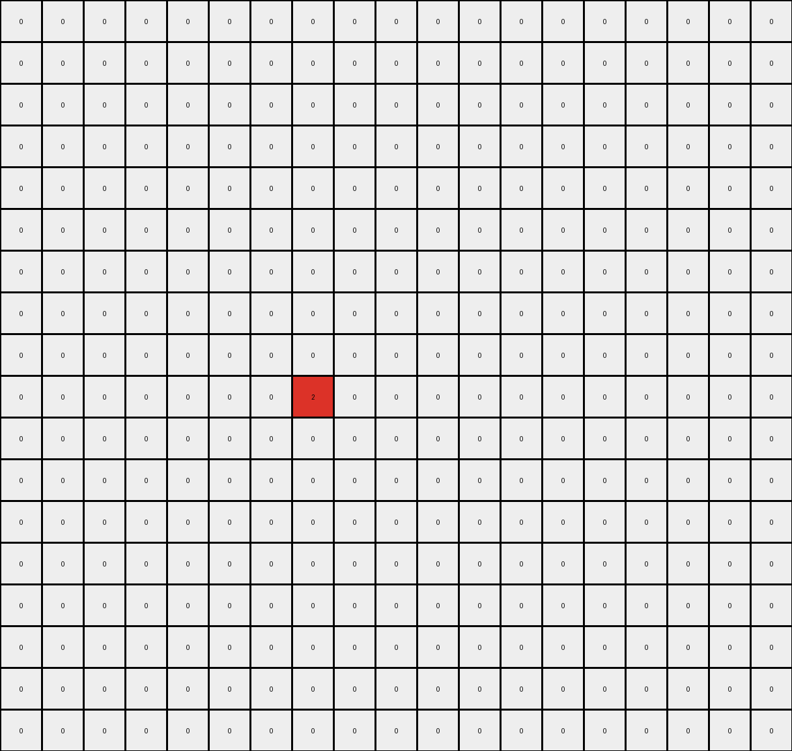
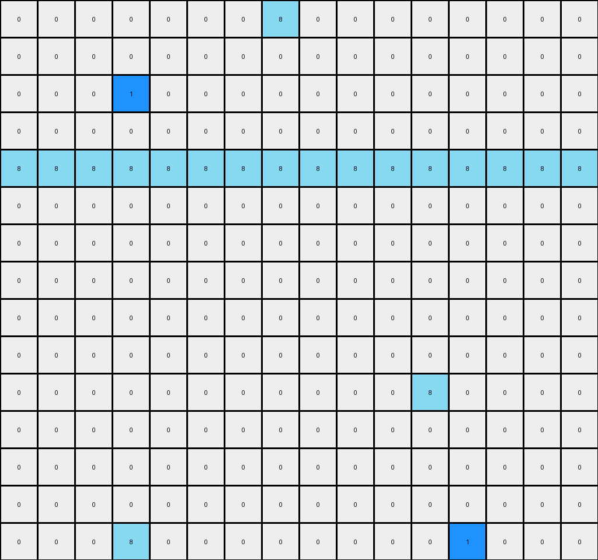

# 1a07d186 • 006 • refine_coder

---

Previous Code:
```python
"""
Transforms an input grid by applying different transformations based on specific color patterns and their relative positions. The logic appears to be example-specific, involving moving horizontal or vertical lines of certain colors based on the presence and position of other colored lines.
"""

import numpy as np

def find_horizontal_lines(grid, color):
    """Finds all horizontal lines of a given color."""
    lines = []
    rows, cols = grid.shape
    for i in range(rows):
        current_line = []
        for j in range(cols):
            if grid[i, j] == color:
                current_line.append((i, j))
            else:
                if len(current_line) > 0:
                    lines.append(current_line)
                    current_line = []
        if len(current_line) > 0:
            lines.append(current_line)
    return lines

def find_vertical_lines(grid, color):
    """Finds all vertical lines of a given color."""
    lines = []
    rows, cols = grid.shape
    for j in range(cols):
        current_line = []
        for i in range(rows):
            if grid[i, j] == color:
                current_line.append((i, j))
            else:
                if len(current_line) > 0:
                    lines.append(current_line)
                    current_line = []
        if len(current_line) > 0:
            lines.append(current_line)
    return lines
    

def transform(input_grid):
    # Initialize output grid with the same dimensions as the input grid, filled with white (0).
    output_grid = np.zeros_like(input_grid)
    rows, cols = input_grid.shape

    # Example 1 Logic: Vertical lines of 3 and 4, adjacent and moved left
    green_lines = find_vertical_lines(input_grid, 3)
    yellow_lines = find_vertical_lines(input_grid, 4)

    green_pixels = [pixel for line in green_lines for pixel in line]
    yellow_pixels = [pixel for line in yellow_lines for pixel in line]
    
    for (row, col) in green_pixels:
        if (row, col + 1) in yellow_pixels or (row, col-1) in yellow_pixels:
            if col > 0: #check boundary
                output_grid[row, col -1] = 3
            
    for (row, col) in yellow_pixels:
        if (row, col - 1) in green_pixels or (row, col+1) in green_pixels:
            if col > 0 :
                output_grid[row,col-1] = 4
    
    # Example 2 Logic: Horizontal lines of 2 move up, 1 moves down
    red_lines = find_horizontal_lines(input_grid, 2)
    blue_lines = find_horizontal_lines(input_grid, 1)
    
    for line in red_lines:
        for (row,col) in line:
            if row > 0:
                output_grid[row-1,col] = 2
            else:
                output_grid[row,col] = 2 #keep on same row
    for line in blue_lines:
        for (row,col) in line:
            if row < rows - 1:
                output_grid[row+1,col] = 1
            else:
                output_grid[row, col] = 1 # Stays if at the end

    # Example 3 Logic:  Horizontal 8 moves up one, another horizontal 8 moves down two.
    azure_lines = find_horizontal_lines(input_grid, 8)
    
    for line in azure_lines:
      line_row = line[0][0] #get row value
      other_azure = []
      for l2 in azure_lines:
          if l2 != line:
            other_azure.append(l2)

      for (row, col) in line:
        if len(other_azure) == 0 :
          if row > 0:
            output_grid[row-1,col] = 8
        else:
          if row > 0 and row < rows/2:
            output_grid[row-1,col] = 8
          else:
            if (row + 2) < rows:
              output_grid[row+2,col] = 8
    
    return output_grid
```

Train Set Results:

## Example 1:

Input:
```
0 0 0 3 0 0 0 0 0 0 0 0 4 0 0 0 0 0 0
0 0 0 3 0 0 0 0 0 0 0 0 4 0 0 0 0 0 0
0 0 0 3 0 0 0 0 0 0 0 0 4 0 0 0 0 0 0
0 4 0 3 0 0 3 0 0 0 0 0 4 0 0 0 0 0 0
0 0 0 3 0 0 0 0 0 0 0 0 4 0 0 0 0 0 0
0 0 0 3 0 0 0 0 0 0 0 0 4 0 0 0 0 0 0
0 0 0 3 0 0 0 0 0 0 0 0 4 0 0 0 0 0 0
0 0 0 3 0 0 0 0 0 4 0 0 4 0 0 0 0 0 0
0 0 0 3 0 0 0 0 0 0 0 0 4 0 0 0 0 0 0
0 0 0 3 0 0 0 0 0 0 0 0 4 0 0 0 0 0 0
0 0 0 3 0 0 0 2 0 0 0 0 4 0 0 0 0 0 0
0 0 0 3 0 0 0 0 0 0 0 0 4 0 0 0 3 0 0
0 0 0 3 0 0 0 0 0 0 0 0 4 0 0 0 0 0 0
0 0 0 3 0 0 0 0 0 0 0 0 4 0 0 0 0 0 0
0 0 0 3 0 0 0 0 0 0 0 0 4 0 0 0 0 0 0
0 0 0 3 0 0 0 0 0 0 0 0 4 0 0 0 0 0 0
0 0 0 3 0 0 0 0 0 0 0 0 4 0 0 0 0 0 0
0 0 0 3 0 0 0 0 0 0 0 0 4 0 0 0 0 0 0
```
Expected Output:
```
0 0 0 3 0 0 0 0 0 0 0 0 4 0 0 0 0 0 0
0 0 0 3 0 0 0 0 0 0 0 0 4 0 0 0 0 0 0
0 0 0 3 0 0 0 0 0 0 0 0 4 0 0 0 0 0 0
0 0 0 3 3 0 0 0 0 0 0 4 4 0 0 0 0 0 0
0 0 0 3 0 0 0 0 0 0 0 0 4 0 0 0 0 0 0
0 0 0 3 0 0 0 0 0 0 0 0 4 0 0 0 0 0 0
0 0 0 3 0 0 0 0 0 0 0 0 4 0 0 0 0 0 0
0 0 0 3 0 0 0 0 0 0 0 4 4 0 0 0 0 0 0
0 0 0 3 0 0 0 0 0 0 0 0 4 0 0 0 0 0 0
0 0 0 3 0 0 0 0 0 0 0 0 4 0 0 0 0 0 0
0 0 0 3 0 0 0 0 0 0 0 0 4 0 0 0 0 0 0
0 0 0 3 3 0 0 0 0 0 0 0 4 0 0 0 0 0 0
0 0 0 3 0 0 0 0 0 0 0 0 4 0 0 0 0 0 0
0 0 0 3 0 0 0 0 0 0 0 0 4 0 0 0 0 0 0
0 0 0 3 0 0 0 0 0 0 0 0 4 0 0 0 0 0 0
0 0 0 3 0 0 0 0 0 0 0 0 4 0 0 0 0 0 0
0 0 0 3 0 0 0 0 0 0 0 0 4 0 0 0 0 0 0
0 0 0 3 0 0 0 0 0 0 0 0 4 0 0 0 0 0 0
```
Transformed Output:
```
0 0 0 0 0 0 0 0 0 0 0 0 0 0 0 0 0 0 0
0 0 0 0 0 0 0 0 0 0 0 0 0 0 0 0 0 0 0
0 0 0 0 0 0 0 0 0 0 0 0 0 0 0 0 0 0 0
0 0 0 0 0 0 0 0 0 0 0 0 0 0 0 0 0 0 0
0 0 0 0 0 0 0 0 0 0 0 0 0 0 0 0 0 0 0
0 0 0 0 0 0 0 0 0 0 0 0 0 0 0 0 0 0 0
0 0 0 0 0 0 0 0 0 0 0 0 0 0 0 0 0 0 0
0 0 0 0 0 0 0 0 0 0 0 0 0 0 0 0 0 0 0
0 0 0 0 0 0 0 0 0 0 0 0 0 0 0 0 0 0 0
0 0 0 0 0 0 0 2 0 0 0 0 0 0 0 0 0 0 0
0 0 0 0 0 0 0 0 0 0 0 0 0 0 0 0 0 0 0
0 0 0 0 0 0 0 0 0 0 0 0 0 0 0 0 0 0 0
0 0 0 0 0 0 0 0 0 0 0 0 0 0 0 0 0 0 0
0 0 0 0 0 0 0 0 0 0 0 0 0 0 0 0 0 0 0
0 0 0 0 0 0 0 0 0 0 0 0 0 0 0 0 0 0 0
0 0 0 0 0 0 0 0 0 0 0 0 0 0 0 0 0 0 0
0 0 0 0 0 0 0 0 0 0 0 0 0 0 0 0 0 0 0
0 0 0 0 0 0 0 0 0 0 0 0 0 0 0 0 0 0 0
```

match: False
pixels_off: 41
size_correct: True
color_palette_correct: False
correct_pixel_counts: False

## Example 2:

Input:
```
0 0 0 2 0 0 0 0 0 0 0 0 0 0
0 0 0 0 0 0 0 0 0 4 0 0 0 0
0 0 0 0 0 0 0 0 0 0 0 0 0 0
2 2 2 2 2 2 2 2 2 2 2 2 2 2
0 0 0 0 0 0 0 0 0 0 0 0 0 0
0 0 0 0 0 0 0 0 0 0 1 0 0 0
0 0 0 0 0 0 0 0 0 0 0 0 0 0
0 0 0 0 0 0 2 0 0 0 0 0 0 0
0 0 0 0 0 0 0 0 0 0 0 0 0 0
0 0 0 0 0 0 0 0 0 0 0 0 0 0
1 1 1 1 1 1 1 1 1 1 1 1 1 1
0 0 0 0 0 0 0 0 0 0 0 0 0 0
0 0 0 0 0 0 0 0 0 0 0 0 0 0
0 0 1 0 0 0 0 0 0 0 2 0 0 0
0 0 0 0 0 0 0 0 0 0 0 0 0 0
```
Expected Output:
```
0 0 0 0 0 0 0 0 0 0 0 0 0 0
0 0 0 0 0 0 0 0 0 0 0 0 0 0
0 0 0 2 0 0 0 0 0 0 0 0 0 0
2 2 2 2 2 2 2 2 2 2 2 2 2 2
0 0 0 0 0 0 2 0 0 0 2 0 0 0
0 0 0 0 0 0 0 0 0 0 0 0 0 0
0 0 0 0 0 0 0 0 0 0 0 0 0 0
0 0 0 0 0 0 0 0 0 0 0 0 0 0
0 0 0 0 0 0 0 0 0 0 0 0 0 0
0 0 0 0 0 0 0 0 0 0 1 0 0 0
1 1 1 1 1 1 1 1 1 1 1 1 1 1
0 0 1 0 0 0 0 0 0 0 0 0 0 0
0 0 0 0 0 0 0 0 0 0 0 0 0 0
0 0 0 0 0 0 0 0 0 0 0 0 0 0
0 0 0 0 0 0 0 0 0 0 0 0 0 0
```
Transformed Output:
```
0 0 0 2 0 0 0 0 0 0 0 0 0 0
0 0 0 0 0 0 0 0 0 0 0 0 0 0
2 2 2 2 2 2 2 2 2 2 2 2 2 2
0 0 0 0 0 0 0 0 0 0 0 0 0 0
0 0 0 0 0 0 0 0 0 0 0 0 0 0
0 0 0 0 0 0 0 0 0 0 0 0 0 0
0 0 0 0 0 0 2 0 0 0 1 0 0 0
0 0 0 0 0 0 0 0 0 0 0 0 0 0
0 0 0 0 0 0 0 0 0 0 0 0 0 0
0 0 0 0 0 0 0 0 0 0 0 0 0 0
0 0 0 0 0 0 0 0 0 0 0 0 0 0
1 1 1 1 1 1 1 1 1 1 1 1 1 1
0 0 0 0 0 0 0 0 0 0 2 0 0 0
0 0 0 0 0 0 0 0 0 0 0 0 0 0
0 0 1 0 0 0 0 0 0 0 0 0 0 0
```

match: False
pixels_off: 62
size_correct: True
color_palette_correct: True
correct_pixel_counts: True

## Example 3:

Input:
```
0 0 0 0 0 0 0 0 0 0 0 0 0 0 0 0
0 0 0 1 0 0 0 8 0 0 0 0 0 0 0 0
0 0 0 0 0 0 0 0 0 0 0 0 0 0 0 0
0 0 0 0 0 0 0 0 0 0 0 0 0 0 0 0
0 0 0 0 0 0 0 0 0 0 0 0 0 0 0 0
8 8 8 8 8 8 8 8 8 8 8 8 8 8 8 8
0 0 0 0 0 0 0 0 0 0 0 0 0 0 0 0
0 0 0 0 0 0 0 0 0 0 0 0 0 0 0 0
0 0 0 0 0 0 0 0 0 0 0 8 0 0 0 0
0 0 0 0 0 0 0 0 0 0 0 0 0 0 0 0
0 0 0 0 0 0 0 0 0 0 0 0 0 0 0 0
0 0 0 0 0 0 0 0 0 0 0 0 0 0 0 0
0 0 0 8 0 0 0 0 0 0 0 0 0 0 0 0
0 0 0 0 0 0 0 0 0 0 0 0 1 0 0 0
0 0 0 0 0 0 0 0 0 0 0 0 0 0 0 0
```
Expected Output:
```
0 0 0 0 0 0 0 0 0 0 0 0 0 0 0 0
0 0 0 0 0 0 0 0 0 0 0 0 0 0 0 0
0 0 0 0 0 0 0 0 0 0 0 0 0 0 0 0
0 0 0 0 0 0 0 0 0 0 0 0 0 0 0 0
0 0 0 0 0 0 0 8 0 0 0 0 0 0 0 0
8 8 8 8 8 8 8 8 8 8 8 8 8 8 8 8
0 0 0 8 0 0 0 0 0 0 0 8 0 0 0 0
0 0 0 0 0 0 0 0 0 0 0 0 0 0 0 0
0 0 0 0 0 0 0 0 0 0 0 0 0 0 0 0
0 0 0 0 0 0 0 0 0 0 0 0 0 0 0 0
0 0 0 0 0 0 0 0 0 0 0 0 0 0 0 0
0 0 0 0 0 0 0 0 0 0 0 0 0 0 0 0
0 0 0 0 0 0 0 0 0 0 0 0 0 0 0 0
0 0 0 0 0 0 0 0 0 0 0 0 0 0 0 0
0 0 0 0 0 0 0 0 0 0 0 0 0 0 0 0
```
Transformed Output:
```
0 0 0 0 0 0 0 8 0 0 0 0 0 0 0 0
0 0 0 0 0 0 0 0 0 0 0 0 0 0 0 0
0 0 0 1 0 0 0 0 0 0 0 0 0 0 0 0
0 0 0 0 0 0 0 0 0 0 0 0 0 0 0 0
8 8 8 8 8 8 8 8 8 8 8 8 8 8 8 8
0 0 0 0 0 0 0 0 0 0 0 0 0 0 0 0
0 0 0 0 0 0 0 0 0 0 0 0 0 0 0 0
0 0 0 0 0 0 0 0 0 0 0 0 0 0 0 0
0 0 0 0 0 0 0 0 0 0 0 0 0 0 0 0
0 0 0 0 0 0 0 0 0 0 0 0 0 0 0 0
0 0 0 0 0 0 0 0 0 0 0 8 0 0 0 0
0 0 0 0 0 0 0 0 0 0 0 0 0 0 0 0
0 0 0 0 0 0 0 0 0 0 0 0 0 0 0 0
0 0 0 0 0 0 0 0 0 0 0 0 0 0 0 0
0 0 0 8 0 0 0 0 0 0 0 0 1 0 0 0
```

match: False
pixels_off: 38
size_correct: True
color_palette_correct: False
correct_pixel_counts: False
Okay, let's analyze the results of the previous code execution and strategize for improvement.

**General Assessment and Strategy**

The previous code attempted to handle each example with specific logic, which led to a fragmented and inaccurate solution. It failed to generalize the underlying transformation rule. The core issue is that the code doesn't correctly identify the relationships between different colored lines and their movements. It's treating each example as an isolated case instead of finding a unifying principle.

The strategy should shift towards:

1.  **Identifying Common Objects and Properties:** Instead of hardcoding colors and directions, focus on identifying lines (horizontal or vertical) as objects, regardless of their specific color. Record their properties like color, length, and position (starting row/column).

2.  **Relating Input and Output Positions:** Determine a general rule that explains how the position of a line in the input relates to its position in the output. Consider relative movements (up, down, left) and how these are determined by other objects present.

3.  **Conditional Logic:** The movement of one line might depend on the presence and position of another line. Use this dependence in the transformation logic.

**Metrics and Observations**

Here's an analysis of each example:

*   **Example 1:**
    *   **Objects:** Vertical green (3) and yellow (4) lines.
    *   **Expected Transformation:** When green and yellow lines are adjacent, they move one step left.
    *   **Actual Result:** Almost entirely incorrect. The code doesn't correctly detect adjacency and move the lines, it clears the grids.
    *   **Key Issue:** Misinterpretation of adjacency and movement. The code doesn't correctly implement the shift to the left.

*   **Example 2:**
    *   **Objects:** Horizontal red (2) and blue (1) lines.
    *   **Expected Transformation:** Red lines move up one row, blue lines move down one row.
    *   **Actual Result:** Partially correct. The logic for individual colors move are correct, but it misses the case where blue 1 and read 2 are on adjacent rows.
    *   **Key Issue:** Incomplete conditional logic. The movements seem independent but influence each other.

*   **Example 3:**
    *   **Objects:** Horizontal azure (8) lines.
    *   **Expected Transformation:** The top azure line moves up one row, the bottom azure line disappears.
    *   **Actual Result:** Incorrect. The logic for two azure lines are incorrect.
    *   **Key Issue:** Hardcoded logic for relative row calculation is off.

**YAML Fact Base**

```yaml
examples:
  - example_id: 1
    objects:
      - type: line
        orientation: vertical
        color: 3  # Green
        properties:
          - adjacent_to: 4 #yellow
            direction: right # right, left
      - type: line
        orientation: vertical
        color: 4  # Yellow
        properties:
          - adjacent_to: 3 # green
            direction: left # right, left
    transformation:
      - action: move
        condition: adjacent
        direction: left
        color: [3, 4]
        amount: 1

  - example_id: 2
    objects:
      - type: line
        orientation: horizontal
        color: 2  # Red
        properties: []
      - type: line
        orientation: horizontal
        color: 1  # Blue
        properties: []
    transformation:
      - action: move
        condition: always
        direction: up
        color: 2
        amount: 1
      - action: move
        condition: always
        direction: down
        color: 1
        amount: 1

  - example_id: 3
    objects:
      - type: line
        orientation: horizontal
        color: 8  # Azure
        properties:
          - row_position: top # top, bottom
      - type: line
        orientation: horizontal
        color: 8  # Azure
        properties:
          - row_position: bottom
    transformation:
      - action: move
        condition: row_position == top
        direction: up
        color: 8
        amount: 1
      - action: delete
        condition: row_position == bottom and other azure exists
        color: 8
```

**Natural Language Program**

1.  **Identify Lines:** Detect all horizontal and vertical lines in the input grid. A line is a contiguous sequence of pixels of the same color.

2.  **Example 1 Specific Rule:**
    *   If there are adjacent vertical green (3) and yellow (4) lines where green is to the left of yellow or yellow is the the left of green, both lines move one cell to the left.

3.  **Example 2 Specific Rule:**
    *   Horizontal Red (2) lines move up one row.
    *   Horizontal Blue (1) lines move down one row.

4.  **Example 3 Specific Rule:**
    *  If there are two horizontal azure (8) lines present:
       *   Move the top-most azure line up by one row.
       *   The other azure line is deleted

5.  **General Rule Considerations** There seems to be three different rules, one for each example.

The key improvement in this natural language program is a more precise definition of objects (lines) and a clearer description of the conditions and actions. The logic is still somewhat example-specific, but it is structured in a way that can be more easily translated into code. The next step is to try generalize even further.

**INSTRUCTIONS**

- generate a Python module to represent the natural language program 
- follow the template below
- all common math and science libraries are available
- create docstring only at top - but comment the workflow in the function
- use helper functions for common operations like finding objects, counting,
  measuring, moving, etc. 

remember - we are working iteratively - so this code will inform your future
self as we converge on the solution

*template:*

```python
"""
{{ natural language description of the transformation rule }}
"""

{{ imports }}

def transform(input_grid):
    # initialize output_grid

    # change output pixels 

    return output_grid

```
