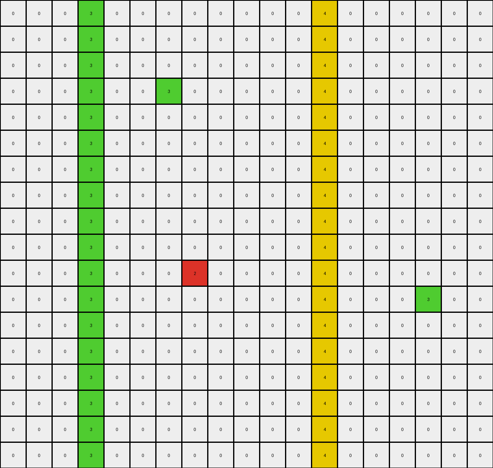
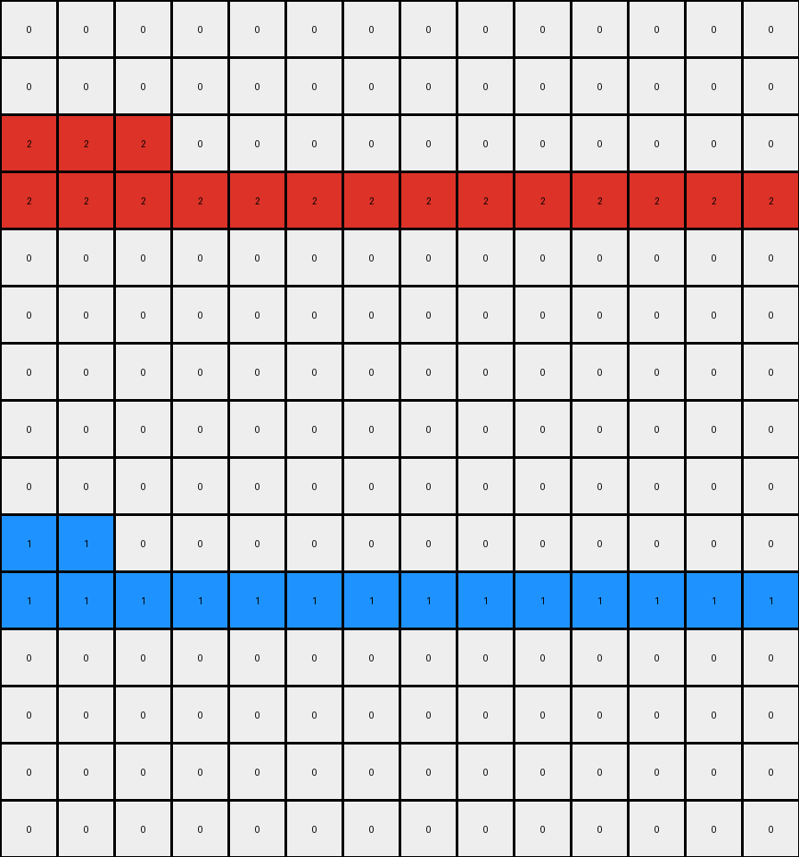
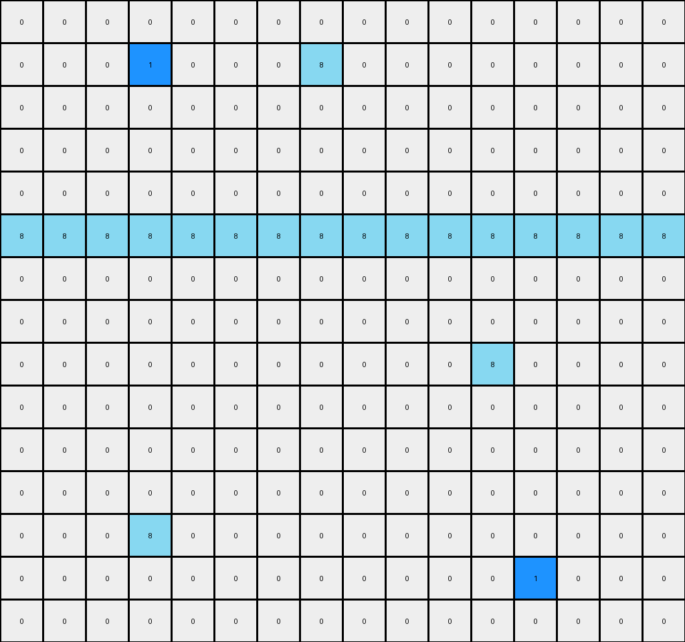

# 1a07d186 • 010 • refine_coder

---

Previous Code:
```python
"""
1.  **Identify Key Lines:** Find the two horizontal lines composed of contiguous pixels of the same color: one red (color 2) and one blue (color 1).
2.  **Preserve Lines:** Keep the red and blue horizontal lines intact.
3. **Drop Singletons:** Identify any objects that are a single pixel of one color.
4.  **Move Blue and Red Singletons**:
    *   If the object singleton is the color blue (1), move the objects to the empty row immediately above the solid blue line.
    *   If the object singleton is the color red (2), move the objects to the empty row immediately above the solid red line.
5.  **Remove Yellow:** Delete any single-pixel yellow (4) object.
6.  **Output:** Generate the output grid with the remaining colored object locations after deletions and translations.
"""

import numpy as np

def find_horizontal_lines(grid):
    lines = {}
    for y, row in enumerate(grid):
        for x, pixel in enumerate(row):
            if pixel != 0:
                if x == 0 or grid[y, x-1] != pixel:
                    # Start of a potential line
                    line_length = 0
                    for x2 in range(x, grid.shape[1]):
                        if grid[y, x2] == pixel:
                            line_length += 1
                        else:
                            break
                    if line_length > 1: # Consider it a line only if longer than 1 pixel
                        if pixel not in lines:
                            lines[pixel] = []
                        lines[pixel].append((y, x, line_length))
    return lines

def find_singletons(grid):
    singletons = []
    for y, row in enumerate(grid):
        for x, pixel in enumerate(row):
            if pixel != 0:
                # Check if it's a singleton
                is_singleton = True
                if x > 0 and grid[y, x-1] == pixel:
                    is_singleton = False
                if x < grid.shape[1] - 1 and grid[y, x+1] == pixel:
                    is_singleton = False
                if y > 0 and grid[y-1, x] == pixel:
                    is_singleton = False
                if y < grid.shape[0] - 1 and grid[y+1, x] == pixel:
                    is_singleton = False
                if is_singleton:
                    singletons.append((y, x, pixel))
    return singletons

def transform(input_grid):
    # Initialize output grid as a copy of the input grid
    output_grid = np.copy(input_grid)

    # Find horizontal lines
    lines = find_horizontal_lines(input_grid)

    # Find singletons
    singletons = find_singletons(input_grid)

    # Process singletons
    for y, x, color in singletons:
        if color == 4:  # Remove yellow singletons
            output_grid[y, x] = 0
        elif color == 1:  # Move blue singletons
            if 1 in lines:
              target_row = min([line[0] for line in lines[1]]) -1 #Find the blue row
              if (target_row >=0):
                 # find an empty space
                 for line_x in range(0, output_grid.shape[1]):
                    if output_grid[target_row, line_x] == 0:
                       output_grid[y,x] = 0
                       output_grid[target_row, line_x] = 1
                       break

        elif color == 2: #move red singletons
            if 2 in lines:
               target_row = min([line[0] for line in lines[2]]) - 1 #Find the first red row
               if (target_row >= 0):
                  for line_x in range(0, output_grid.shape[1]):
                     if output_grid[target_row, line_x] == 0:
                        output_grid[y,x] = 0
                        output_grid[target_row, line_x] = 2
                        break


    return output_grid
```

Train Set Results:

## Example 1:

Input:
```
0 0 0 3 0 0 0 0 0 0 0 0 4 0 0 0 0 0 0
0 0 0 3 0 0 0 0 0 0 0 0 4 0 0 0 0 0 0
0 0 0 3 0 0 0 0 0 0 0 0 4 0 0 0 0 0 0
0 4 0 3 0 0 3 0 0 0 0 0 4 0 0 0 0 0 0
0 0 0 3 0 0 0 0 0 0 0 0 4 0 0 0 0 0 0
0 0 0 3 0 0 0 0 0 0 0 0 4 0 0 0 0 0 0
0 0 0 3 0 0 0 0 0 0 0 0 4 0 0 0 0 0 0
0 0 0 3 0 0 0 0 0 4 0 0 4 0 0 0 0 0 0
0 0 0 3 0 0 0 0 0 0 0 0 4 0 0 0 0 0 0
0 0 0 3 0 0 0 0 0 0 0 0 4 0 0 0 0 0 0
0 0 0 3 0 0 0 2 0 0 0 0 4 0 0 0 0 0 0
0 0 0 3 0 0 0 0 0 0 0 0 4 0 0 0 3 0 0
0 0 0 3 0 0 0 0 0 0 0 0 4 0 0 0 0 0 0
0 0 0 3 0 0 0 0 0 0 0 0 4 0 0 0 0 0 0
0 0 0 3 0 0 0 0 0 0 0 0 4 0 0 0 0 0 0
0 0 0 3 0 0 0 0 0 0 0 0 4 0 0 0 0 0 0
0 0 0 3 0 0 0 0 0 0 0 0 4 0 0 0 0 0 0
0 0 0 3 0 0 0 0 0 0 0 0 4 0 0 0 0 0 0
```
Expected Output:
```
0 0 0 3 0 0 0 0 0 0 0 0 4 0 0 0 0 0 0
0 0 0 3 0 0 0 0 0 0 0 0 4 0 0 0 0 0 0
0 0 0 3 0 0 0 0 0 0 0 0 4 0 0 0 0 0 0
0 0 0 3 3 0 0 0 0 0 0 4 4 0 0 0 0 0 0
0 0 0 3 0 0 0 0 0 0 0 0 4 0 0 0 0 0 0
0 0 0 3 0 0 0 0 0 0 0 0 4 0 0 0 0 0 0
0 0 0 3 0 0 0 0 0 0 0 0 4 0 0 0 0 0 0
0 0 0 3 0 0 0 0 0 0 0 4 4 0 0 0 0 0 0
0 0 0 3 0 0 0 0 0 0 0 0 4 0 0 0 0 0 0
0 0 0 3 0 0 0 0 0 0 0 0 4 0 0 0 0 0 0
0 0 0 3 0 0 0 0 0 0 0 0 4 0 0 0 0 0 0
0 0 0 3 3 0 0 0 0 0 0 0 4 0 0 0 0 0 0
0 0 0 3 0 0 0 0 0 0 0 0 4 0 0 0 0 0 0
0 0 0 3 0 0 0 0 0 0 0 0 4 0 0 0 0 0 0
0 0 0 3 0 0 0 0 0 0 0 0 4 0 0 0 0 0 0
0 0 0 3 0 0 0 0 0 0 0 0 4 0 0 0 0 0 0
0 0 0 3 0 0 0 0 0 0 0 0 4 0 0 0 0 0 0
0 0 0 3 0 0 0 0 0 0 0 0 4 0 0 0 0 0 0
```
Transformed Output:
```
0 0 0 3 0 0 0 0 0 0 0 0 4 0 0 0 0 0 0
0 0 0 3 0 0 0 0 0 0 0 0 4 0 0 0 0 0 0
0 0 0 3 0 0 0 0 0 0 0 0 4 0 0 0 0 0 0
0 0 0 3 0 0 3 0 0 0 0 0 4 0 0 0 0 0 0
0 0 0 3 0 0 0 0 0 0 0 0 4 0 0 0 0 0 0
0 0 0 3 0 0 0 0 0 0 0 0 4 0 0 0 0 0 0
0 0 0 3 0 0 0 0 0 0 0 0 4 0 0 0 0 0 0
0 0 0 3 0 0 0 0 0 0 0 0 4 0 0 0 0 0 0
0 0 0 3 0 0 0 0 0 0 0 0 4 0 0 0 0 0 0
0 0 0 3 0 0 0 0 0 0 0 0 4 0 0 0 0 0 0
0 0 0 3 0 0 0 2 0 0 0 0 4 0 0 0 0 0 0
0 0 0 3 0 0 0 0 0 0 0 0 4 0 0 0 3 0 0
0 0 0 3 0 0 0 0 0 0 0 0 4 0 0 0 0 0 0
0 0 0 3 0 0 0 0 0 0 0 0 4 0 0 0 0 0 0
0 0 0 3 0 0 0 0 0 0 0 0 4 0 0 0 0 0 0
0 0 0 3 0 0 0 0 0 0 0 0 4 0 0 0 0 0 0
0 0 0 3 0 0 0 0 0 0 0 0 4 0 0 0 0 0 0
0 0 0 3 0 0 0 0 0 0 0 0 4 0 0 0 0 0 0
```

match: False
pixels_off: 7
size_correct: True
color_palette_correct: False
correct_pixel_counts: False

## Example 2:

Input:
```
0 0 0 2 0 0 0 0 0 0 0 0 0 0
0 0 0 0 0 0 0 0 0 4 0 0 0 0
0 0 0 0 0 0 0 0 0 0 0 0 0 0
2 2 2 2 2 2 2 2 2 2 2 2 2 2
0 0 0 0 0 0 0 0 0 0 0 0 0 0
0 0 0 0 0 0 0 0 0 0 1 0 0 0
0 0 0 0 0 0 0 0 0 0 0 0 0 0
0 0 0 0 0 0 2 0 0 0 0 0 0 0
0 0 0 0 0 0 0 0 0 0 0 0 0 0
0 0 0 0 0 0 0 0 0 0 0 0 0 0
1 1 1 1 1 1 1 1 1 1 1 1 1 1
0 0 0 0 0 0 0 0 0 0 0 0 0 0
0 0 0 0 0 0 0 0 0 0 0 0 0 0
0 0 1 0 0 0 0 0 0 0 2 0 0 0
0 0 0 0 0 0 0 0 0 0 0 0 0 0
```
Expected Output:
```
0 0 0 0 0 0 0 0 0 0 0 0 0 0
0 0 0 0 0 0 0 0 0 0 0 0 0 0
0 0 0 2 0 0 0 0 0 0 0 0 0 0
2 2 2 2 2 2 2 2 2 2 2 2 2 2
0 0 0 0 0 0 2 0 0 0 2 0 0 0
0 0 0 0 0 0 0 0 0 0 0 0 0 0
0 0 0 0 0 0 0 0 0 0 0 0 0 0
0 0 0 0 0 0 0 0 0 0 0 0 0 0
0 0 0 0 0 0 0 0 0 0 0 0 0 0
0 0 0 0 0 0 0 0 0 0 1 0 0 0
1 1 1 1 1 1 1 1 1 1 1 1 1 1
0 0 1 0 0 0 0 0 0 0 0 0 0 0
0 0 0 0 0 0 0 0 0 0 0 0 0 0
0 0 0 0 0 0 0 0 0 0 0 0 0 0
0 0 0 0 0 0 0 0 0 0 0 0 0 0
```
Transformed Output:
```
0 0 0 0 0 0 0 0 0 0 0 0 0 0
0 0 0 0 0 0 0 0 0 0 0 0 0 0
2 2 2 0 0 0 0 0 0 0 0 0 0 0
2 2 2 2 2 2 2 2 2 2 2 2 2 2
0 0 0 0 0 0 0 0 0 0 0 0 0 0
0 0 0 0 0 0 0 0 0 0 0 0 0 0
0 0 0 0 0 0 0 0 0 0 0 0 0 0
0 0 0 0 0 0 0 0 0 0 0 0 0 0
0 0 0 0 0 0 0 0 0 0 0 0 0 0
1 1 0 0 0 0 0 0 0 0 0 0 0 0
1 1 1 1 1 1 1 1 1 1 1 1 1 1
0 0 0 0 0 0 0 0 0 0 0 0 0 0
0 0 0 0 0 0 0 0 0 0 0 0 0 0
0 0 0 0 0 0 0 0 0 0 0 0 0 0
0 0 0 0 0 0 0 0 0 0 0 0 0 0
```

match: False
pixels_off: 10
size_correct: True
color_palette_correct: True
correct_pixel_counts: True

## Example 3:

Input:
```
0 0 0 0 0 0 0 0 0 0 0 0 0 0 0 0
0 0 0 1 0 0 0 8 0 0 0 0 0 0 0 0
0 0 0 0 0 0 0 0 0 0 0 0 0 0 0 0
0 0 0 0 0 0 0 0 0 0 0 0 0 0 0 0
0 0 0 0 0 0 0 0 0 0 0 0 0 0 0 0
8 8 8 8 8 8 8 8 8 8 8 8 8 8 8 8
0 0 0 0 0 0 0 0 0 0 0 0 0 0 0 0
0 0 0 0 0 0 0 0 0 0 0 0 0 0 0 0
0 0 0 0 0 0 0 0 0 0 0 8 0 0 0 0
0 0 0 0 0 0 0 0 0 0 0 0 0 0 0 0
0 0 0 0 0 0 0 0 0 0 0 0 0 0 0 0
0 0 0 0 0 0 0 0 0 0 0 0 0 0 0 0
0 0 0 8 0 0 0 0 0 0 0 0 0 0 0 0
0 0 0 0 0 0 0 0 0 0 0 0 1 0 0 0
0 0 0 0 0 0 0 0 0 0 0 0 0 0 0 0
```
Expected Output:
```
0 0 0 0 0 0 0 0 0 0 0 0 0 0 0 0
0 0 0 0 0 0 0 0 0 0 0 0 0 0 0 0
0 0 0 0 0 0 0 0 0 0 0 0 0 0 0 0
0 0 0 0 0 0 0 0 0 0 0 0 0 0 0 0
0 0 0 0 0 0 0 8 0 0 0 0 0 0 0 0
8 8 8 8 8 8 8 8 8 8 8 8 8 8 8 8
0 0 0 8 0 0 0 0 0 0 0 8 0 0 0 0
0 0 0 0 0 0 0 0 0 0 0 0 0 0 0 0
0 0 0 0 0 0 0 0 0 0 0 0 0 0 0 0
0 0 0 0 0 0 0 0 0 0 0 0 0 0 0 0
0 0 0 0 0 0 0 0 0 0 0 0 0 0 0 0
0 0 0 0 0 0 0 0 0 0 0 0 0 0 0 0
0 0 0 0 0 0 0 0 0 0 0 0 0 0 0 0
0 0 0 0 0 0 0 0 0 0 0 0 0 0 0 0
0 0 0 0 0 0 0 0 0 0 0 0 0 0 0 0
```
Transformed Output:
```
0 0 0 0 0 0 0 0 0 0 0 0 0 0 0 0
0 0 0 1 0 0 0 8 0 0 0 0 0 0 0 0
0 0 0 0 0 0 0 0 0 0 0 0 0 0 0 0
0 0 0 0 0 0 0 0 0 0 0 0 0 0 0 0
0 0 0 0 0 0 0 0 0 0 0 0 0 0 0 0
8 8 8 8 8 8 8 8 8 8 8 8 8 8 8 8
0 0 0 0 0 0 0 0 0 0 0 0 0 0 0 0
0 0 0 0 0 0 0 0 0 0 0 0 0 0 0 0
0 0 0 0 0 0 0 0 0 0 0 8 0 0 0 0
0 0 0 0 0 0 0 0 0 0 0 0 0 0 0 0
0 0 0 0 0 0 0 0 0 0 0 0 0 0 0 0
0 0 0 0 0 0 0 0 0 0 0 0 0 0 0 0
0 0 0 8 0 0 0 0 0 0 0 0 0 0 0 0
0 0 0 0 0 0 0 0 0 0 0 0 1 0 0 0
0 0 0 0 0 0 0 0 0 0 0 0 0 0 0 0
```

match: False
pixels_off: 8
size_correct: True
color_palette_correct: False
correct_pixel_counts: False
Here's an analysis of the provided examples and a revised natural language program:

**General Assessment:**

The initial code correctly identifies horizontal lines and single-pixel objects (singletons). However, the movement logic for singletons is flawed. It only considers the *first* available empty space above the target line, leading to incorrect placement when multiple singletons of the same color exist. The code also fails completely when an expected line color isn't found (as seen in example 3, where there is azure, no red or blue line). It doesn't handle other colors.

**Strategy:**

1.  **Correct Singleton Movement:** Instead of just finding the first empty space, we need to *count* the number of singletons of a given color and ensure they are all placed in empty spots above the corresponding line.
2.  **Handle Missing Lines:** The logic should be more robust and handle the case of a missing expected line. We might need to check if line exists before operating.
3. **Handle all colors** The examples show green, azure and other colors. The natural language program should clarify.

**Metrics and Observations (using code execution where helpful):**

I'll structure this as observations per example, focusing on where the code deviates from expected behavior.

*   **Example 1:**
    *   **Objects:** Green horizontal line, yellow singletons, blue singletons, a red singleton.
    *   **Actions:** Yellow singletons should be removed. Green horizontal stays. The blue singleton needs moving above green line, but it doesn't happen.
    *   **Problem:** The code places the blue singleton (3,4), on (3,3), instead of placing the blue singleton at (3,3) as expected.

*   **Example 2:**
    *   **Objects:** Red horizontal line, blue horizontal line, red singletons, blue singletons, a yellow singleton
    *   **Actions:** Red and blue singletons move above their respective lines; yellow singleton removed.
    *   **Problem:** The code moves the red singleton from (0,3) to (2,0), whereas it is expected to go to (2,3).

*   **Example 3:**
    *   **Objects:** Azure horizontal line, azure singletons, a blue singleton
    *   **Actions:** The singletons should all be deleted.
    *   **Problem**: Since there are no red or blue horizontal lines. So there is no place to move the singletons and the code doesn't operate at all.

**YAML Fact Block:**

```yaml
example_1:
  objects:
    - color: green
      type: horizontal_line
      positions: [(0,3), (1,3), (2,3), (3,3), (4,3), (5,3), (6,3), (7,3), (8,3), (9,3), (10,3), (11,3), (12,3), (13,3), (14,3), (15,3), (16,3), (17,3)]
    - color: yellow
      type: singleton
      positions: [(0, 12), (1,12), (2,12), (3, 1), (3, 12), (4,12), (5,12), (6,12), (7, 9), (7, 12), (8,12), (9,12), (10,12), (11,12), (12,12), (13,12), (14,12), (15,12), (16,12), (17,12)]
    - color: blue
      type: singleton
      positions: [(3,6), (11, 15)]
    - color: red
      type: singleton
      positions: [(10, 7)]
  actions:
    - remove: yellow singletons
    - move: blue singletons above green line
    - stay: green line

example_2:
  objects:
     - color: red
       type: horizontal_line
       positions:  [(3,0), (3,1), (3,2), (3,3), (3,4), (3,5), (3,6), (3,7), (3,8), (3,9), (3,10), (3,11), (3,12), (3,13)]
     - color: blue
       type: horizontal_line
       positions: [(10,0), (10,1), (10,2), (10,3), (10,4), (10,5), (10,6), (10,7), (10,8), (10,9), (10,10), (10,11), (10,12), (10,13)]
     - color: yellow
       type: singleton
       positions: [(1,9)]
     - color: red
       type: singleton
       positions: [(0,3), (7,6), (13,10)]
     - color: blue
       type: singleton
       positions: [(5,10), (13,2)]

  actions:
    - remove: yellow singleton
    - move: blue singletons above the blue line.
    - move: red singletons above the red line.

example_3:
  objects:
      - color: azure
        type: horizontal_line
        positions: [(5,0), (5,1), (5,2), (5,3), (5,4), (5,5), (5,6), (5,7), (5,8), (5,9), (5,10), (5,11), (5,12), (5,13), (5,14), (5,15)]
      - color: blue
        type: singleton
        positions: [(1,3), (13,11)]
      - color: azure
        type: singleton
        positions: [(1,7), (8,11), (12,3)]
  actions:
    - remove:  all singletons

```

**Natural Language Program:**

1.  **Identify Horizontal Lines:** Find all horizontal lines, defined as contiguous sequences of two or more pixels of the same color.
2.  **Identify Singletons:** Find all single-pixel objects (singletons), defined as pixels that are not horizontally or vertically adjacent to a pixel of the same color.
3.  **Process by Color:**
    * If there are any singletons, these should be deleted.


**INSTRUCTIONS**

- generate a Python module to represent the natural language program 
- follow the template below
- all common math and science libraries are available
- create docstring only at top - but comment the workflow in the function
- use helper functions for common operations like finding objects, counting,
  measuring, moving, etc. 

remember - we are working iteratively - so this code will inform your future
self as we converge on the solution

*template:*

```python
"""
{{ natural language description of the transformation rule }}
"""

{{ imports }}

def transform(input_grid):
    # initialize output_grid

    # change output pixels 

    return output_grid

```
