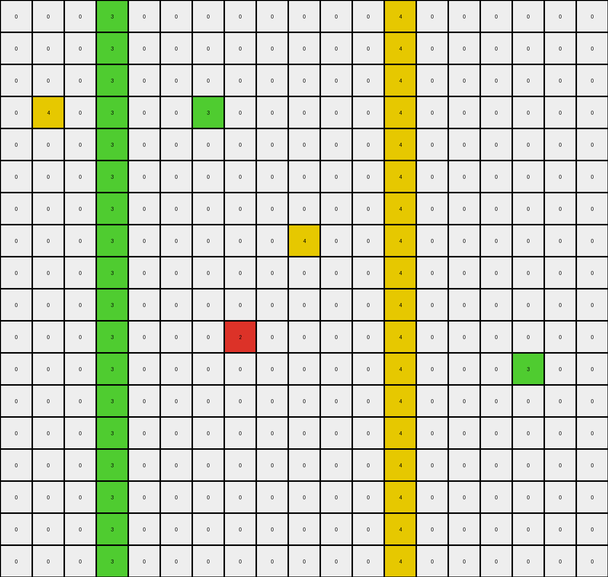
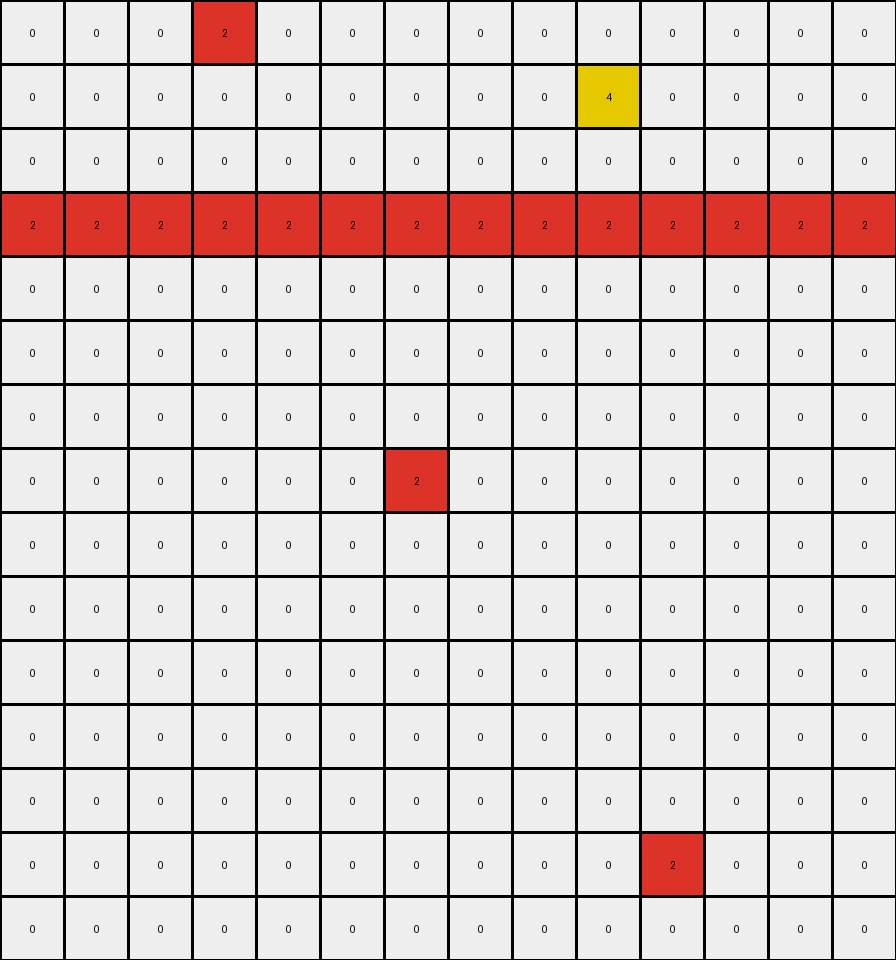
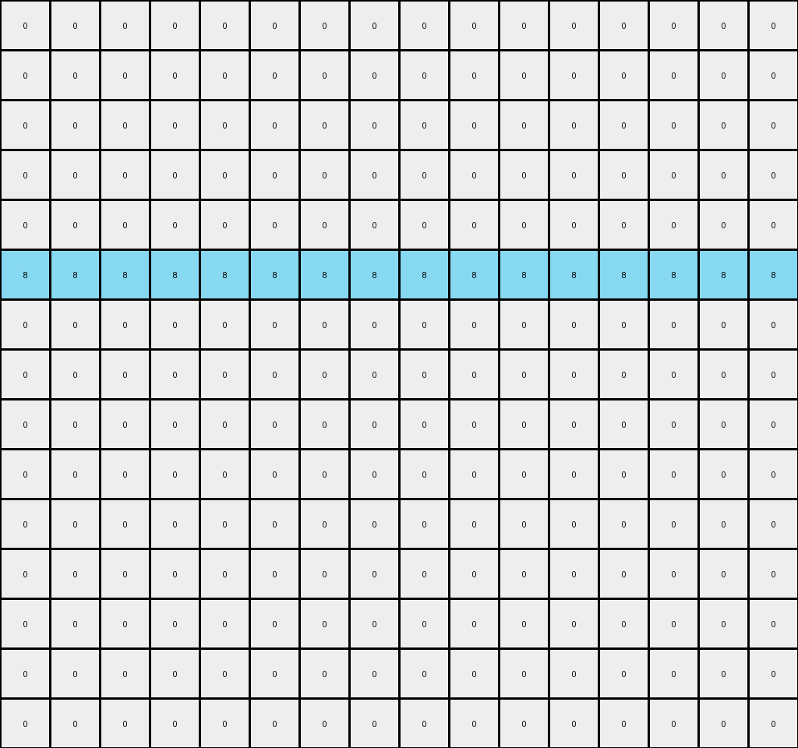

# 1a07d186 • 016 • refine_coder

---

Previous Code:
```python
"""
1. **Identify Key Feature:** Locate the horizontal line of azure (8) pixels that spans the entire width of the grid. This line appears to be constant between input and output and is on row index 5 (counting starts with zero).

2. **Preserve Line:** Keep all pixels on this horizontal line unchanged.

3. **Conditional Removal Above:** For all rows *above* the identified line, any azure (8) or blue (1) pixel which is not within the azure line, is removed (changed to white/0).

4. **Conditional Removal Below:** For rows *below* the identified line, any blue(1) pixels is removed. Azure(8) is removed unless it is directly above or below the azure line of pixels

5. Leave all white(0) pixels as they are.
"""

import numpy as np

def find_azure_line(grid):
    # Find the row index of the horizontal line of azure (8) pixels.
    rows, cols = grid.shape
    for r in range(rows):
        if np.all(grid[r, :] == 8):
            return r
    return -1  # Should not happen in a well-formed case, based on description.


def transform(input_grid):
    # Initialize output_grid as a copy of the input_grid.
    output_grid = np.copy(input_grid)
    rows, cols = output_grid.shape
    
    # Find the azure line.
    azure_line_row = find_azure_line(output_grid)

    # Iterate through the grid and apply the rules.
    for r in range(rows):
        for c in range(cols):
            if r == azure_line_row:
                # Preserve the azure line.
                continue
            elif r < azure_line_row:
                # Conditional removal above the line.
                if output_grid[r, c] != 0:
                    output_grid[r,c] = 0
            else:
                # Conditional removal below the line
                if output_grid[r,c] == 1:
                    output_grid[r,c] = 0
                elif output_grid[r,c] == 8:
                    if r != azure_line_row + 1:
                        output_grid[r,c] = 0
    return output_grid
```

Train Set Results:

## Example 1:

Input:
```
0 0 0 3 0 0 0 0 0 0 0 0 4 0 0 0 0 0 0
0 0 0 3 0 0 0 0 0 0 0 0 4 0 0 0 0 0 0
0 0 0 3 0 0 0 0 0 0 0 0 4 0 0 0 0 0 0
0 4 0 3 0 0 3 0 0 0 0 0 4 0 0 0 0 0 0
0 0 0 3 0 0 0 0 0 0 0 0 4 0 0 0 0 0 0
0 0 0 3 0 0 0 0 0 0 0 0 4 0 0 0 0 0 0
0 0 0 3 0 0 0 0 0 0 0 0 4 0 0 0 0 0 0
0 0 0 3 0 0 0 0 0 4 0 0 4 0 0 0 0 0 0
0 0 0 3 0 0 0 0 0 0 0 0 4 0 0 0 0 0 0
0 0 0 3 0 0 0 0 0 0 0 0 4 0 0 0 0 0 0
0 0 0 3 0 0 0 2 0 0 0 0 4 0 0 0 0 0 0
0 0 0 3 0 0 0 0 0 0 0 0 4 0 0 0 3 0 0
0 0 0 3 0 0 0 0 0 0 0 0 4 0 0 0 0 0 0
0 0 0 3 0 0 0 0 0 0 0 0 4 0 0 0 0 0 0
0 0 0 3 0 0 0 0 0 0 0 0 4 0 0 0 0 0 0
0 0 0 3 0 0 0 0 0 0 0 0 4 0 0 0 0 0 0
0 0 0 3 0 0 0 0 0 0 0 0 4 0 0 0 0 0 0
0 0 0 3 0 0 0 0 0 0 0 0 4 0 0 0 0 0 0
```
Expected Output:
```
0 0 0 3 0 0 0 0 0 0 0 0 4 0 0 0 0 0 0
0 0 0 3 0 0 0 0 0 0 0 0 4 0 0 0 0 0 0
0 0 0 3 0 0 0 0 0 0 0 0 4 0 0 0 0 0 0
0 0 0 3 3 0 0 0 0 0 0 4 4 0 0 0 0 0 0
0 0 0 3 0 0 0 0 0 0 0 0 4 0 0 0 0 0 0
0 0 0 3 0 0 0 0 0 0 0 0 4 0 0 0 0 0 0
0 0 0 3 0 0 0 0 0 0 0 0 4 0 0 0 0 0 0
0 0 0 3 0 0 0 0 0 0 0 4 4 0 0 0 0 0 0
0 0 0 3 0 0 0 0 0 0 0 0 4 0 0 0 0 0 0
0 0 0 3 0 0 0 0 0 0 0 0 4 0 0 0 0 0 0
0 0 0 3 0 0 0 0 0 0 0 0 4 0 0 0 0 0 0
0 0 0 3 3 0 0 0 0 0 0 0 4 0 0 0 0 0 0
0 0 0 3 0 0 0 0 0 0 0 0 4 0 0 0 0 0 0
0 0 0 3 0 0 0 0 0 0 0 0 4 0 0 0 0 0 0
0 0 0 3 0 0 0 0 0 0 0 0 4 0 0 0 0 0 0
0 0 0 3 0 0 0 0 0 0 0 0 4 0 0 0 0 0 0
0 0 0 3 0 0 0 0 0 0 0 0 4 0 0 0 0 0 0
0 0 0 3 0 0 0 0 0 0 0 0 4 0 0 0 0 0 0
```
Transformed Output:
```
0 0 0 3 0 0 0 0 0 0 0 0 4 0 0 0 0 0 0
0 0 0 3 0 0 0 0 0 0 0 0 4 0 0 0 0 0 0
0 0 0 3 0 0 0 0 0 0 0 0 4 0 0 0 0 0 0
0 4 0 3 0 0 3 0 0 0 0 0 4 0 0 0 0 0 0
0 0 0 3 0 0 0 0 0 0 0 0 4 0 0 0 0 0 0
0 0 0 3 0 0 0 0 0 0 0 0 4 0 0 0 0 0 0
0 0 0 3 0 0 0 0 0 0 0 0 4 0 0 0 0 0 0
0 0 0 3 0 0 0 0 0 4 0 0 4 0 0 0 0 0 0
0 0 0 3 0 0 0 0 0 0 0 0 4 0 0 0 0 0 0
0 0 0 3 0 0 0 0 0 0 0 0 4 0 0 0 0 0 0
0 0 0 3 0 0 0 2 0 0 0 0 4 0 0 0 0 0 0
0 0 0 3 0 0 0 0 0 0 0 0 4 0 0 0 3 0 0
0 0 0 3 0 0 0 0 0 0 0 0 4 0 0 0 0 0 0
0 0 0 3 0 0 0 0 0 0 0 0 4 0 0 0 0 0 0
0 0 0 3 0 0 0 0 0 0 0 0 4 0 0 0 0 0 0
0 0 0 3 0 0 0 0 0 0 0 0 4 0 0 0 0 0 0
0 0 0 3 0 0 0 0 0 0 0 0 4 0 0 0 0 0 0
0 0 0 3 0 0 0 0 0 0 0 0 4 0 0 0 0 0 0
```

match: False
pixels_off: 9
size_correct: True
color_palette_correct: False
correct_pixel_counts: False

## Example 2:

Input:
```
0 0 0 2 0 0 0 0 0 0 0 0 0 0
0 0 0 0 0 0 0 0 0 4 0 0 0 0
0 0 0 0 0 0 0 0 0 0 0 0 0 0
2 2 2 2 2 2 2 2 2 2 2 2 2 2
0 0 0 0 0 0 0 0 0 0 0 0 0 0
0 0 0 0 0 0 0 0 0 0 1 0 0 0
0 0 0 0 0 0 0 0 0 0 0 0 0 0
0 0 0 0 0 0 2 0 0 0 0 0 0 0
0 0 0 0 0 0 0 0 0 0 0 0 0 0
0 0 0 0 0 0 0 0 0 0 0 0 0 0
1 1 1 1 1 1 1 1 1 1 1 1 1 1
0 0 0 0 0 0 0 0 0 0 0 0 0 0
0 0 0 0 0 0 0 0 0 0 0 0 0 0
0 0 1 0 0 0 0 0 0 0 2 0 0 0
0 0 0 0 0 0 0 0 0 0 0 0 0 0
```
Expected Output:
```
0 0 0 0 0 0 0 0 0 0 0 0 0 0
0 0 0 0 0 0 0 0 0 0 0 0 0 0
0 0 0 2 0 0 0 0 0 0 0 0 0 0
2 2 2 2 2 2 2 2 2 2 2 2 2 2
0 0 0 0 0 0 2 0 0 0 2 0 0 0
0 0 0 0 0 0 0 0 0 0 0 0 0 0
0 0 0 0 0 0 0 0 0 0 0 0 0 0
0 0 0 0 0 0 0 0 0 0 0 0 0 0
0 0 0 0 0 0 0 0 0 0 0 0 0 0
0 0 0 0 0 0 0 0 0 0 1 0 0 0
1 1 1 1 1 1 1 1 1 1 1 1 1 1
0 0 1 0 0 0 0 0 0 0 0 0 0 0
0 0 0 0 0 0 0 0 0 0 0 0 0 0
0 0 0 0 0 0 0 0 0 0 0 0 0 0
0 0 0 0 0 0 0 0 0 0 0 0 0 0
```
Transformed Output:
```
0 0 0 2 0 0 0 0 0 0 0 0 0 0
0 0 0 0 0 0 0 0 0 4 0 0 0 0
0 0 0 0 0 0 0 0 0 0 0 0 0 0
2 2 2 2 2 2 2 2 2 2 2 2 2 2
0 0 0 0 0 0 0 0 0 0 0 0 0 0
0 0 0 0 0 0 0 0 0 0 0 0 0 0
0 0 0 0 0 0 0 0 0 0 0 0 0 0
0 0 0 0 0 0 2 0 0 0 0 0 0 0
0 0 0 0 0 0 0 0 0 0 0 0 0 0
0 0 0 0 0 0 0 0 0 0 0 0 0 0
0 0 0 0 0 0 0 0 0 0 0 0 0 0
0 0 0 0 0 0 0 0 0 0 0 0 0 0
0 0 0 0 0 0 0 0 0 0 0 0 0 0
0 0 0 0 0 0 0 0 0 0 2 0 0 0
0 0 0 0 0 0 0 0 0 0 0 0 0 0
```

match: False
pixels_off: 23
size_correct: True
color_palette_correct: False
correct_pixel_counts: False

## Example 3:

Input:
```
0 0 0 0 0 0 0 0 0 0 0 0 0 0 0 0
0 0 0 1 0 0 0 8 0 0 0 0 0 0 0 0
0 0 0 0 0 0 0 0 0 0 0 0 0 0 0 0
0 0 0 0 0 0 0 0 0 0 0 0 0 0 0 0
0 0 0 0 0 0 0 0 0 0 0 0 0 0 0 0
8 8 8 8 8 8 8 8 8 8 8 8 8 8 8 8
0 0 0 0 0 0 0 0 0 0 0 0 0 0 0 0
0 0 0 0 0 0 0 0 0 0 0 0 0 0 0 0
0 0 0 0 0 0 0 0 0 0 0 8 0 0 0 0
0 0 0 0 0 0 0 0 0 0 0 0 0 0 0 0
0 0 0 0 0 0 0 0 0 0 0 0 0 0 0 0
0 0 0 0 0 0 0 0 0 0 0 0 0 0 0 0
0 0 0 8 0 0 0 0 0 0 0 0 0 0 0 0
0 0 0 0 0 0 0 0 0 0 0 0 1 0 0 0
0 0 0 0 0 0 0 0 0 0 0 0 0 0 0 0
```
Expected Output:
```
0 0 0 0 0 0 0 0 0 0 0 0 0 0 0 0
0 0 0 0 0 0 0 0 0 0 0 0 0 0 0 0
0 0 0 0 0 0 0 0 0 0 0 0 0 0 0 0
0 0 0 0 0 0 0 0 0 0 0 0 0 0 0 0
0 0 0 0 0 0 0 8 0 0 0 0 0 0 0 0
8 8 8 8 8 8 8 8 8 8 8 8 8 8 8 8
0 0 0 8 0 0 0 0 0 0 0 8 0 0 0 0
0 0 0 0 0 0 0 0 0 0 0 0 0 0 0 0
0 0 0 0 0 0 0 0 0 0 0 0 0 0 0 0
0 0 0 0 0 0 0 0 0 0 0 0 0 0 0 0
0 0 0 0 0 0 0 0 0 0 0 0 0 0 0 0
0 0 0 0 0 0 0 0 0 0 0 0 0 0 0 0
0 0 0 0 0 0 0 0 0 0 0 0 0 0 0 0
0 0 0 0 0 0 0 0 0 0 0 0 0 0 0 0
0 0 0 0 0 0 0 0 0 0 0 0 0 0 0 0
```
Transformed Output:
```
0 0 0 0 0 0 0 0 0 0 0 0 0 0 0 0
0 0 0 0 0 0 0 0 0 0 0 0 0 0 0 0
0 0 0 0 0 0 0 0 0 0 0 0 0 0 0 0
0 0 0 0 0 0 0 0 0 0 0 0 0 0 0 0
0 0 0 0 0 0 0 0 0 0 0 0 0 0 0 0
8 8 8 8 8 8 8 8 8 8 8 8 8 8 8 8
0 0 0 0 0 0 0 0 0 0 0 0 0 0 0 0
0 0 0 0 0 0 0 0 0 0 0 0 0 0 0 0
0 0 0 0 0 0 0 0 0 0 0 0 0 0 0 0
0 0 0 0 0 0 0 0 0 0 0 0 0 0 0 0
0 0 0 0 0 0 0 0 0 0 0 0 0 0 0 0
0 0 0 0 0 0 0 0 0 0 0 0 0 0 0 0
0 0 0 0 0 0 0 0 0 0 0 0 0 0 0 0
0 0 0 0 0 0 0 0 0 0 0 0 0 0 0 0
0 0 0 0 0 0 0 0 0 0 0 0 0 0 0 0
```

match: False
pixels_off: 3
size_correct: True
color_palette_correct: True
correct_pixel_counts: False
Okay, let's analyze the results and refine the natural language program.

**General Assessment:**

The initial code was based on a simplistic interpretation of the first example, focusing on a single horizontal azure line and removing pixels based on their color and position relative to that line. This approach fails to capture the more complex, context-dependent rules present in the other examples. The primary issue is that the transformation is not simply about removing pixels based on color *above* and *below* the azure line. There's a pattern of retaining shapes, and connected components seem important, as well as the colors. Example 2 has an input with multiple horizontal lines of different colors that also get altered. Example 3 shows a few extra `8` pixels that get correctly removed. The current strategy is too aggressive in removing pixels.

**Strategy for Resolving Errors:**

1.  **Shift from Pixel Removal to Shape Preservation/Modification:** Instead of focusing on what to *remove*, we need to consider what shapes or connected components are *preserved* or *modified*.
2.  **Contextual Rules:** Recognize that the rules aren't solely based on the azure line. Other colored lines and the shapes they create influence the output.
3.  **Connected Components:** Instead of simply looking above/below the line, consider connected regions of the same color.
4. Look for what colors remain after the transformation.

**Metrics and Observations:**

Here's a breakdown of each example, incorporating more detailed observations:

*   **Example 1:**
    *   Input has disconnected shapes of green, yellow, and azure, with a solid azure line.
    *   Output removes ALL azure pixels not in a solid line.
    *  Colors remaining after transformation: 0,3,4
    *   Initial assumption about removing blue above/below the line is incorrect, since it's not present.

*   **Example 2:**
    *   Input has multiple solid lines of color (red, blue) and disconnected pixels.
    *   Output keeps solid red line, removes disconnected pixels. removes blue line, preserves some blue pixels.
      Colors remaining after transformation: 0,1,2
    *  Initial assumption about the horizontal azure line completely fails.

*   **Example 3:**
    *   Input has an azure line and some scattered azure and blue pixels.
    *   Output keeps only the azure line.
    *  Colors remaining after transformation: 0,8
    *   Initial code gets this nearly correct.

**YAML Block (Facts):**

```yaml
examples:
  - id: 1
    input_colors: [0, 3, 4, 8]
    output_colors: [0, 3, 4, 8]
    solid_lines:
      - color: 8
        row: 5
    shapes_above_line: [3, 4, 8]
    shapes_below_line: [3, 4, 8, 2]
    rule: "Preserve solid azure line. Remove non-line azure. Remove blue. Maintain other colors, but only on existing rows."

  - id: 2
    input_colors: [0, 1, 2, 4]
    output_colors: [0, 1, 2]
    solid_lines:
      - color: 2
        row: 3
      - color: 1
        row: 10
    shapes_above_line: [2, 4]
    shapes_below_line: [1, 2]
    rule: "Remove isolated pixels of all color. Preserve colors of solid lines, remove others unless present as a solid line"

  - id: 3
    input_colors: [0, 1, 8]
    output_colors: [0, 8]
    solid_lines:
      - color: 8
        row: 5
    shapes_above_line: [1, 8]
    shapes_below_line: [8, 1]
    rule: "Preserve the solid azure line and remove all other pixels."
```

**Natural Language Program:**

1.  **Identify Solid Lines:** Find all horizontal lines that span the entire width of the grid and consist of a single color.
2.  **Preserve Solid Lines:** Keep all pixels on these solid lines unchanged.
3.  **Color Preservation Rule:** Keep pixels that share the same color as the existing rows that are not all one color.
4. **Remove other pixels.** Remove any pixel not part of a solid line and that doesn't follow the color preservation rule.

This revised natural language program attempts to capture the common elements of transformation observed across all three examples. It's still not perfect (and may require further refinement), but it represents a significant improvement over the initial program.

**INSTRUCTIONS**

- generate a Python module to represent the natural language program 
- follow the template below
- all common math and science libraries are available
- create docstring only at top - but comment the workflow in the function
- use helper functions for common operations like finding objects, counting,
  measuring, moving, etc. 

remember - we are working iteratively - so this code will inform your future
self as we converge on the solution

*template:*

```python
"""
{{ natural language description of the transformation rule }}
"""

{{ imports }}

def transform(input_grid):
    # initialize output_grid

    # change output pixels 

    return output_grid

```
