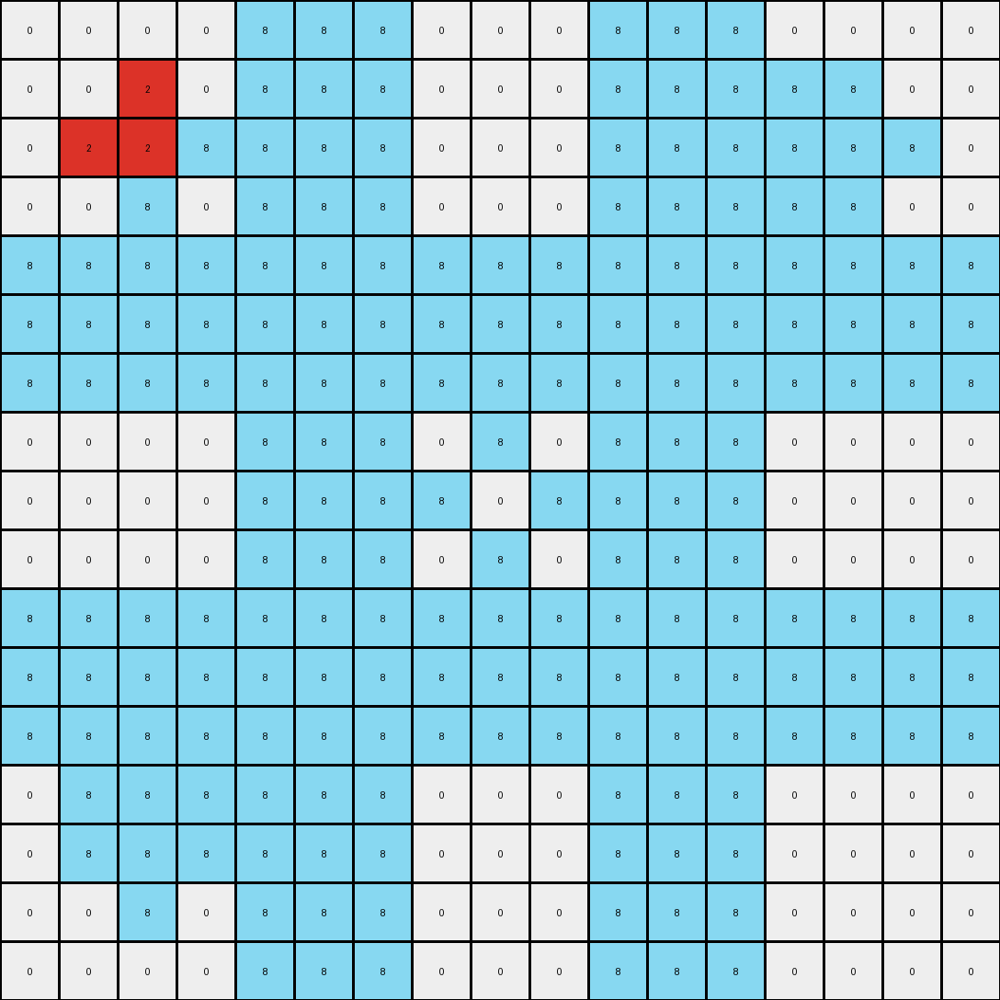
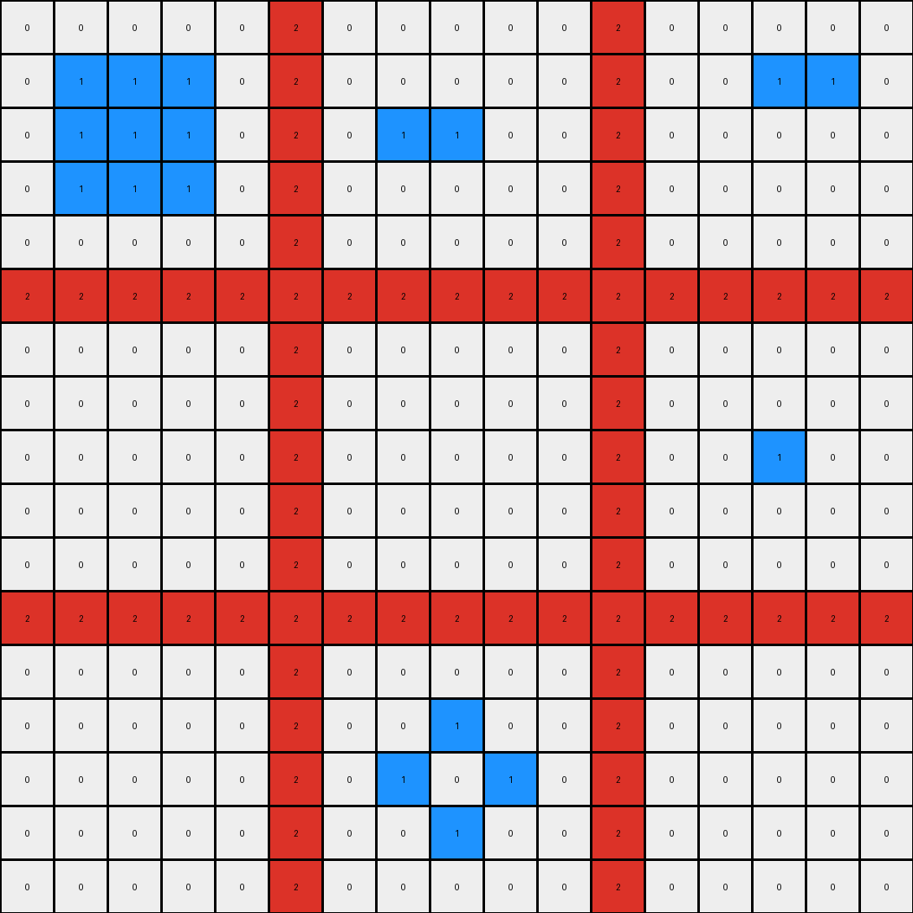
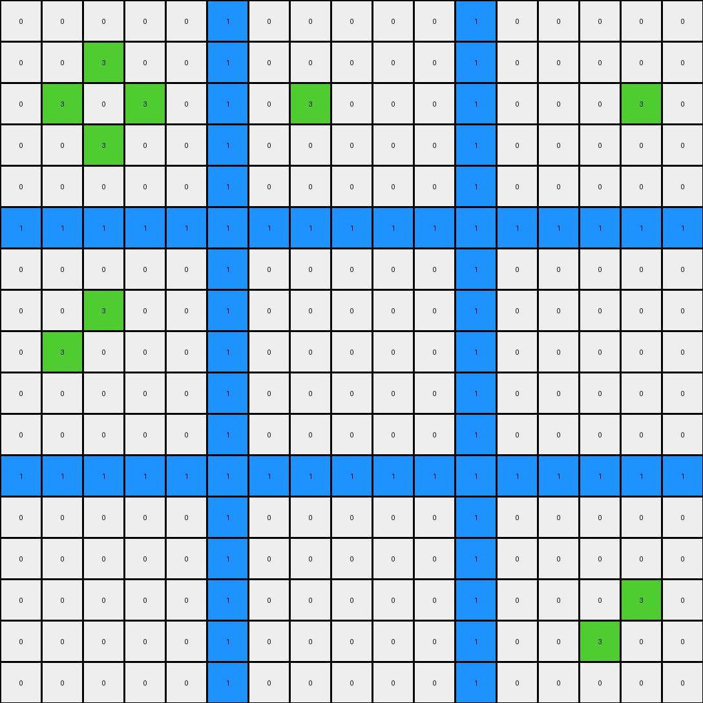

# 1e32b0e9 • 003 • refine_dreamer

---


Previous Code:
```python
"""
Transforms an input grid by expanding azure (8) pixels.  Azure pixels expand 
by one layer around existing azure pixels. If an azure pixel is adjacent to a 
red (2) pixel, the azure region expands by adding azure pixels to *all*
adjacencies of the azure pixel.
"""

import numpy as np

def get_neighbors(grid, row, col):
    """Gets the valid neighboring coordinates of a cell."""
    rows, cols = grid.shape
    neighbors = []
    for dr, dc in [(-1, 0), (1, 0), (0, -1), (0, 1)]:  # Up, Down, Left, Right
        new_row, new_col = row + dr, col + dc
        if 0 <= new_row < rows and 0 <= new_col < cols:
            neighbors.append((new_row, new_col))
    return neighbors

def transform(input_grid):
    """Transforms the input grid according to the described rules."""
    output_grid = np.copy(input_grid)
    rows, cols = input_grid.shape

    # 1. & 2. Iterate through existing azure pixels and expand
    azure_pixels = np.argwhere(input_grid == 8)
    for row, col in azure_pixels:
        neighbors = get_neighbors(input_grid, row, col)
        for nr, nc in neighbors:
            if output_grid[nr, nc] == 0:  # If neighbor is white
                output_grid[nr, nc] = 8

    #3. & 4. Iterate through each red pixel
    red_pixels = np.argwhere(input_grid == 2)
    for row, col in red_pixels:
      neighbors = get_neighbors(input_grid, row, col)
      for nr, nc in neighbors:
        if output_grid[nr, nc] == 8:
          # 5. Expand azure, adjacent to red
          azure_neighbors = get_neighbors(input_grid, nr, nc)
          for anr, anc in azure_neighbors:
            output_grid[anr, anc] = 8


    return output_grid
```

Train Set Results:

## Example 1:

Input:
```
0 0 0 0 0 8 0 0 0 0 0 8 0 0 0 0 0
0 0 2 0 0 8 0 0 0 0 0 8 0 0 0 0 0
0 2 2 2 0 8 0 0 0 0 0 8 0 2 2 2 0
0 0 2 0 0 8 0 0 0 0 0 8 0 0 0 0 0
0 0 0 0 0 8 0 0 0 0 0 8 0 0 0 0 0
8 8 8 8 8 8 8 8 8 8 8 8 8 8 8 8 8
0 0 0 0 0 8 0 0 0 0 0 8 0 0 0 0 0
0 0 0 0 0 8 0 0 2 0 0 8 0 0 0 0 0
0 0 0 0 0 8 0 2 0 2 0 8 0 0 0 0 0
0 0 0 0 0 8 0 0 2 0 0 8 0 0 0 0 0
0 0 0 0 0 8 0 0 0 0 0 8 0 0 0 0 0
8 8 8 8 8 8 8 8 8 8 8 8 8 8 8 8 8
0 0 0 0 0 8 0 0 0 0 0 8 0 0 0 0 0
0 0 2 0 0 8 0 0 0 0 0 8 0 0 0 0 0
0 2 2 2 0 8 0 0 0 0 0 8 0 0 0 0 0
0 0 2 0 0 8 0 0 0 0 0 8 0 0 0 0 0
0 0 0 0 0 8 0 0 0 0 0 8 0 0 0 0 0
```
Expected Output:
```
0 0 0 0 0 8 0 0 0 0 0 8 0 0 0 0 0
0 0 2 0 0 8 0 0 8 0 0 8 0 0 8 0 0
0 2 2 2 0 8 0 8 8 8 0 8 0 2 2 2 0
0 0 2 0 0 8 0 0 8 0 0 8 0 0 8 0 0
0 0 0 0 0 8 0 0 0 0 0 8 0 0 0 0 0
8 8 8 8 8 8 8 8 8 8 8 8 8 8 8 8 8
0 0 0 0 0 8 0 0 0 0 0 8 0 0 0 0 0
0 0 8 0 0 8 0 0 2 0 0 8 0 0 8 0 0
0 8 8 8 0 8 0 2 8 2 0 8 0 8 8 8 0
0 0 8 0 0 8 0 0 2 0 0 8 0 0 8 0 0
0 0 0 0 0 8 0 0 0 0 0 8 0 0 0 0 0
8 8 8 8 8 8 8 8 8 8 8 8 8 8 8 8 8
0 0 0 0 0 8 0 0 0 0 0 8 0 0 0 0 0
0 0 2 0 0 8 0 0 8 0 0 8 0 0 8 0 0
0 2 2 2 0 8 0 8 8 8 0 8 0 8 8 8 0
0 0 2 0 0 8 0 0 8 0 0 8 0 0 8 0 0
0 0 0 0 0 8 0 0 0 0 0 8 0 0 0 0 0
```
Transformed Output:
```
0 0 0 0 8 8 8 0 0 0 8 8 8 0 0 0 0
0 0 2 0 8 8 8 0 0 0 8 8 8 8 8 0 0
0 2 2 8 8 8 8 0 0 0 8 8 8 8 8 8 0
0 0 8 0 8 8 8 0 0 0 8 8 8 8 8 0 0
8 8 8 8 8 8 8 8 8 8 8 8 8 8 8 8 8
8 8 8 8 8 8 8 8 8 8 8 8 8 8 8 8 8
8 8 8 8 8 8 8 8 8 8 8 8 8 8 8 8 8
0 0 0 0 8 8 8 0 8 0 8 8 8 0 0 0 0
0 0 0 0 8 8 8 8 0 8 8 8 8 0 0 0 0
0 0 0 0 8 8 8 0 8 0 8 8 8 0 0 0 0
8 8 8 8 8 8 8 8 8 8 8 8 8 8 8 8 8
8 8 8 8 8 8 8 8 8 8 8 8 8 8 8 8 8
8 8 8 8 8 8 8 8 8 8 8 8 8 8 8 8 8
0 8 8 8 8 8 8 0 0 0 8 8 8 0 0 0 0
0 8 8 8 8 8 8 0 0 0 8 8 8 0 0 0 0
0 0 8 0 8 8 8 0 0 0 8 8 8 0 0 0 0
0 0 0 0 8 8 8 0 0 0 8 8 8 0 0 0 0
```

match: False
pixels_off: 148
size_correct: True
color_palette_correct: True
correct_pixel_counts: False

## Example 2:

Input:
```
0 0 0 0 0 2 0 0 0 0 0 2 0 0 0 0 0
0 1 1 1 0 2 0 0 0 0 0 2 0 0 1 1 0
0 1 1 1 0 2 0 1 1 0 0 2 0 0 0 0 0
0 1 1 1 0 2 0 0 0 0 0 2 0 0 0 0 0
0 0 0 0 0 2 0 0 0 0 0 2 0 0 0 0 0
2 2 2 2 2 2 2 2 2 2 2 2 2 2 2 2 2
0 0 0 0 0 2 0 0 0 0 0 2 0 0 0 0 0
0 0 0 0 0 2 0 0 0 0 0 2 0 0 0 0 0
0 0 0 0 0 2 0 0 0 0 0 2 0 0 1 0 0
0 0 0 0 0 2 0 0 0 0 0 2 0 0 0 0 0
0 0 0 0 0 2 0 0 0 0 0 2 0 0 0 0 0
2 2 2 2 2 2 2 2 2 2 2 2 2 2 2 2 2
0 0 0 0 0 2 0 0 0 0 0 2 0 0 0 0 0
0 0 0 0 0 2 0 0 1 0 0 2 0 0 0 0 0
0 0 0 0 0 2 0 1 0 1 0 2 0 0 0 0 0
0 0 0 0 0 2 0 0 1 0 0 2 0 0 0 0 0
0 0 0 0 0 2 0 0 0 0 0 2 0 0 0 0 0
```
Expected Output:
```
0 0 0 0 0 2 0 0 0 0 0 2 0 0 0 0 0
0 1 1 1 0 2 0 2 2 2 0 2 0 2 1 1 0
0 1 1 1 0 2 0 1 1 2 0 2 0 2 2 2 0
0 1 1 1 0 2 0 2 2 2 0 2 0 2 2 2 0
0 0 0 0 0 2 0 0 0 0 0 2 0 0 0 0 0
2 2 2 2 2 2 2 2 2 2 2 2 2 2 2 2 2
0 0 0 0 0 2 0 0 0 0 0 2 0 0 0 0 0
0 2 2 2 0 2 0 2 2 2 0 2 0 2 2 2 0
0 2 2 2 0 2 0 2 2 2 0 2 0 2 1 2 0
0 2 2 2 0 2 0 2 2 2 0 2 0 2 2 2 0
0 0 0 0 0 2 0 0 0 0 0 2 0 0 0 0 0
2 2 2 2 2 2 2 2 2 2 2 2 2 2 2 2 2
0 0 0 0 0 2 0 0 0 0 0 2 0 0 0 0 0
0 2 2 2 0 2 0 2 1 2 0 2 0 2 2 2 0
0 2 2 2 0 2 0 1 2 1 0 2 0 2 2 2 0
0 2 2 2 0 2 0 2 1 2 0 2 0 2 2 2 0
0 0 0 0 0 2 0 0 0 0 0 2 0 0 0 0 0
```
Transformed Output:
```
0 0 0 0 0 2 0 0 0 0 0 2 0 0 0 0 0
0 1 1 1 0 2 0 0 0 0 0 2 0 0 1 1 0
0 1 1 1 0 2 0 1 1 0 0 2 0 0 0 0 0
0 1 1 1 0 2 0 0 0 0 0 2 0 0 0 0 0
0 0 0 0 0 2 0 0 0 0 0 2 0 0 0 0 0
2 2 2 2 2 2 2 2 2 2 2 2 2 2 2 2 2
0 0 0 0 0 2 0 0 0 0 0 2 0 0 0 0 0
0 0 0 0 0 2 0 0 0 0 0 2 0 0 0 0 0
0 0 0 0 0 2 0 0 0 0 0 2 0 0 1 0 0
0 0 0 0 0 2 0 0 0 0 0 2 0 0 0 0 0
0 0 0 0 0 2 0 0 0 0 0 2 0 0 0 0 0
2 2 2 2 2 2 2 2 2 2 2 2 2 2 2 2 2
0 0 0 0 0 2 0 0 0 0 0 2 0 0 0 0 0
0 0 0 0 0 2 0 0 1 0 0 2 0 0 0 0 0
0 0 0 0 0 2 0 1 0 1 0 2 0 0 0 0 0
0 0 0 0 0 2 0 0 1 0 0 2 0 0 0 0 0
0 0 0 0 0 2 0 0 0 0 0 2 0 0 0 0 0
```

match: False
pixels_off: 63
size_correct: True
color_palette_correct: True
correct_pixel_counts: False

## Example 3:

Input:
```
0 0 0 0 0 1 0 0 0 0 0 1 0 0 0 0 0
0 0 3 0 0 1 0 0 0 0 0 1 0 0 0 0 0
0 3 0 3 0 1 0 3 0 0 0 1 0 0 0 3 0
0 0 3 0 0 1 0 0 0 0 0 1 0 0 0 0 0
0 0 0 0 0 1 0 0 0 0 0 1 0 0 0 0 0
1 1 1 1 1 1 1 1 1 1 1 1 1 1 1 1 1
0 0 0 0 0 1 0 0 0 0 0 1 0 0 0 0 0
0 0 3 0 0 1 0 0 0 0 0 1 0 0 0 0 0
0 3 0 0 0 1 0 0 0 0 0 1 0 0 0 0 0
0 0 0 0 0 1 0 0 0 0 0 1 0 0 0 0 0
0 0 0 0 0 1 0 0 0 0 0 1 0 0 0 0 0
1 1 1 1 1 1 1 1 1 1 1 1 1 1 1 1 1
0 0 0 0 0 1 0 0 0 0 0 1 0 0 0 0 0
0 0 0 0 0 1 0 0 0 0 0 1 0 0 0 0 0
0 0 0 0 0 1 0 0 0 0 0 1 0 0 0 3 0
0 0 0 0 0 1 0 0 0 0 0 1 0 0 3 0 0
0 0 0 0 0 1 0 0 0 0 0 1 0 0 0 0 0
```
Expected Output:
```
0 0 0 0 0 1 0 0 0 0 0 1 0 0 0 0 0
0 0 3 0 0 1 0 0 1 0 0 1 0 0 1 0 0
0 3 0 3 0 1 0 3 0 1 0 1 0 1 0 3 0
0 0 3 0 0 1 0 0 1 0 0 1 0 0 1 0 0
0 0 0 0 0 1 0 0 0 0 0 1 0 0 0 0 0
1 1 1 1 1 1 1 1 1 1 1 1 1 1 1 1 1
0 0 0 0 0 1 0 0 0 0 0 1 0 0 0 0 0
0 0 3 0 0 1 0 0 1 0 0 1 0 0 1 0 0
0 3 0 1 0 1 0 1 0 1 0 1 0 1 0 1 0
0 0 1 0 0 1 0 0 1 0 0 1 0 0 1 0 0
0 0 0 0 0 1 0 0 0 0 0 1 0 0 0 0 0
1 1 1 1 1 1 1 1 1 1 1 1 1 1 1 1 1
0 0 0 0 0 1 0 0 0 0 0 1 0 0 0 0 0
0 0 1 0 0 1 0 0 1 0 0 1 0 0 1 0 0
0 1 0 1 0 1 0 1 0 1 0 1 0 1 0 3 0
0 0 1 0 0 1 0 0 1 0 0 1 0 0 3 0 0
0 0 0 0 0 1 0 0 0 0 0 1 0 0 0 0 0
```
Transformed Output:
```
0 0 0 0 0 1 0 0 0 0 0 1 0 0 0 0 0
0 0 3 0 0 1 0 0 0 0 0 1 0 0 0 0 0
0 3 0 3 0 1 0 3 0 0 0 1 0 0 0 3 0
0 0 3 0 0 1 0 0 0 0 0 1 0 0 0 0 0
0 0 0 0 0 1 0 0 0 0 0 1 0 0 0 0 0
1 1 1 1 1 1 1 1 1 1 1 1 1 1 1 1 1
0 0 0 0 0 1 0 0 0 0 0 1 0 0 0 0 0
0 0 3 0 0 1 0 0 0 0 0 1 0 0 0 0 0
0 3 0 0 0 1 0 0 0 0 0 1 0 0 0 0 0
0 0 0 0 0 1 0 0 0 0 0 1 0 0 0 0 0
0 0 0 0 0 1 0 0 0 0 0 1 0 0 0 0 0
1 1 1 1 1 1 1 1 1 1 1 1 1 1 1 1 1
0 0 0 0 0 1 0 0 0 0 0 1 0 0 0 0 0
0 0 0 0 0 1 0 0 0 0 0 1 0 0 0 0 0
0 0 0 0 0 1 0 0 0 0 0 1 0 0 0 3 0
0 0 0 0 0 1 0 0 0 0 0 1 0 0 3 0 0
0 0 0 0 0 1 0 0 0 0 0 1 0 0 0 0 0
```

match: False
pixels_off: 26
size_correct: True
color_palette_correct: True
correct_pixel_counts: False

**INSTRUCTIONS**

The code above was generated based on observations from the first training
example

we have tested the transform function on each of the task example inputs and
compared with the expected output

review each of the examples provided and the results and consider how the
natural language program should be updated to accommodate this new knowledge

respond with the following deliverables:

- general assessment of the information provided and strategy for resolving the
  errors
- gather metrics about each of the examples and results - use code_execution to
  develop accurate reports on your assumptions
- a YAML block documenting facts - Focus on identifying objects, their properties, and the actions performed on them.
- a natural language program - Be as clear and concise as possible, providing a complete description of the transformation rule.


your responses should be considered as information in a report - not a
conversation
