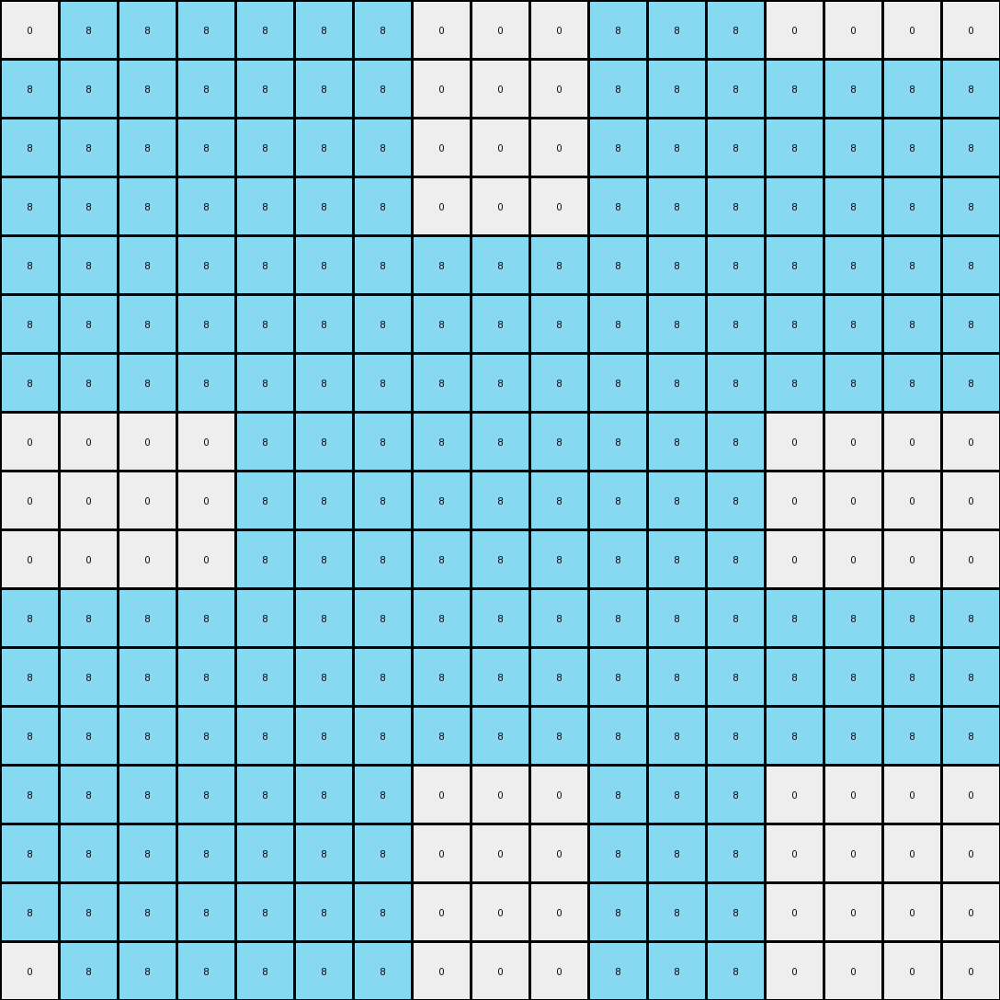
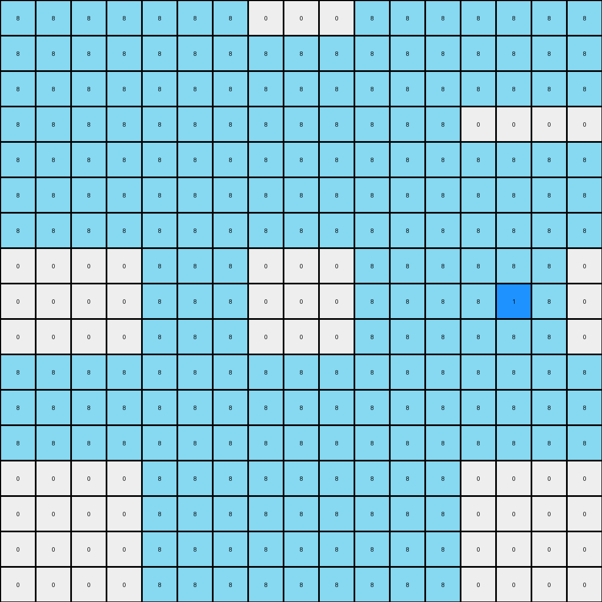
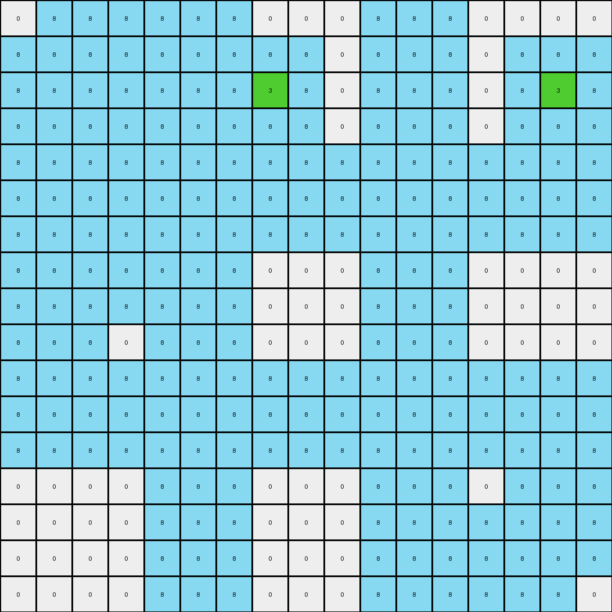

# 1e32b0e9 • 005 • refine_dreamer

---

Previous Code:
```python
"""
Transforms an input grid by replacing all pixels adjacent to a "target" color
with azure (8). The target color is any color other than 0 in the input grid.
"""

import numpy as np

def get_all_neighbors(grid, row, col):
    """Gets the valid neighboring coordinates of a cell, including diagonals."""
    rows, cols = grid.shape
    neighbors = []
    for dr in [-1, 0, 1]:
        for dc in [-1, 0, 1]:
            if dr == 0 and dc == 0:
                continue  # Skip the cell itself
            new_row, new_col = row + dr, col + dc
            if 0 <= new_row < rows and 0 <= new_col < cols:
                neighbors.append((new_row, new_col))
    return neighbors

def transform(input_grid):
    """Transforms the input grid according to the described rules."""
    output_grid = np.copy(input_grid)
    rows, cols = input_grid.shape

    # 1. Find "target" pixels (any non-0 color)
    target_pixels = np.argwhere(input_grid != 0)

    # 2. Iterate through neighbors of target pixels and change color
    for row, col in target_pixels:
      neighbors = get_all_neighbors(input_grid, row, col)
      for nr, nc in neighbors:
          output_grid[nr, nc] = 8  # Change to azure

    return output_grid
```

Train Set Results:

## Example 1:

Input:
```
0 0 0 0 0 8 0 0 0 0 0 8 0 0 0 0 0
0 0 2 0 0 8 0 0 0 0 0 8 0 0 0 0 0
0 2 2 2 0 8 0 0 0 0 0 8 0 2 2 2 0
0 0 2 0 0 8 0 0 0 0 0 8 0 0 0 0 0
0 0 0 0 0 8 0 0 0 0 0 8 0 0 0 0 0
8 8 8 8 8 8 8 8 8 8 8 8 8 8 8 8 8
0 0 0 0 0 8 0 0 0 0 0 8 0 0 0 0 0
0 0 0 0 0 8 0 0 2 0 0 8 0 0 0 0 0
0 0 0 0 0 8 0 2 0 2 0 8 0 0 0 0 0
0 0 0 0 0 8 0 0 2 0 0 8 0 0 0 0 0
0 0 0 0 0 8 0 0 0 0 0 8 0 0 0 0 0
8 8 8 8 8 8 8 8 8 8 8 8 8 8 8 8 8
0 0 0 0 0 8 0 0 0 0 0 8 0 0 0 0 0
0 0 2 0 0 8 0 0 0 0 0 8 0 0 0 0 0
0 2 2 2 0 8 0 0 0 0 0 8 0 0 0 0 0
0 0 2 0 0 8 0 0 0 0 0 8 0 0 0 0 0
0 0 0 0 0 8 0 0 0 0 0 8 0 0 0 0 0
```
Expected Output:
```
0 0 0 0 0 8 0 0 0 0 0 8 0 0 0 0 0
0 0 2 0 0 8 0 0 8 0 0 8 0 0 8 0 0
0 2 2 2 0 8 0 8 8 8 0 8 0 2 2 2 0
0 0 2 0 0 8 0 0 8 0 0 8 0 0 8 0 0
0 0 0 0 0 8 0 0 0 0 0 8 0 0 0 0 0
8 8 8 8 8 8 8 8 8 8 8 8 8 8 8 8 8
0 0 0 0 0 8 0 0 0 0 0 8 0 0 0 0 0
0 0 8 0 0 8 0 0 2 0 0 8 0 0 8 0 0
0 8 8 8 0 8 0 2 8 2 0 8 0 8 8 8 0
0 0 8 0 0 8 0 0 2 0 0 8 0 0 8 0 0
0 0 0 0 0 8 0 0 0 0 0 8 0 0 0 0 0
8 8 8 8 8 8 8 8 8 8 8 8 8 8 8 8 8
0 0 0 0 0 8 0 0 0 0 0 8 0 0 0 0 0
0 0 2 0 0 8 0 0 8 0 0 8 0 0 8 0 0
0 2 2 2 0 8 0 8 8 8 0 8 0 8 8 8 0
0 0 2 0 0 8 0 0 8 0 0 8 0 0 8 0 0
0 0 0 0 0 8 0 0 0 0 0 8 0 0 0 0 0
```
Transformed Output:
```
0 8 8 8 8 8 8 0 0 0 8 8 8 0 0 0 0
8 8 8 8 8 8 8 0 0 0 8 8 8 8 8 8 8
8 8 8 8 8 8 8 0 0 0 8 8 8 8 8 8 8
8 8 8 8 8 8 8 0 0 0 8 8 8 8 8 8 8
8 8 8 8 8 8 8 8 8 8 8 8 8 8 8 8 8
8 8 8 8 8 8 8 8 8 8 8 8 8 8 8 8 8
8 8 8 8 8 8 8 8 8 8 8 8 8 8 8 8 8
0 0 0 0 8 8 8 8 8 8 8 8 8 0 0 0 0
0 0 0 0 8 8 8 8 8 8 8 8 8 0 0 0 0
0 0 0 0 8 8 8 8 8 8 8 8 8 0 0 0 0
8 8 8 8 8 8 8 8 8 8 8 8 8 8 8 8 8
8 8 8 8 8 8 8 8 8 8 8 8 8 8 8 8 8
8 8 8 8 8 8 8 8 8 8 8 8 8 8 8 8 8
8 8 8 8 8 8 8 0 0 0 8 8 8 0 0 0 0
8 8 8 8 8 8 8 0 0 0 8 8 8 0 0 0 0
8 8 8 8 8 8 8 0 0 0 8 8 8 0 0 0 0
0 8 8 8 8 8 8 0 0 0 8 8 8 0 0 0 0
```

match: False
pixels_off: 177
size_correct: True
color_palette_correct: True
correct_pixel_counts: False

## Example 2:

Input:
```
0 0 0 0 0 2 0 0 0 0 0 2 0 0 0 0 0
0 1 1 1 0 2 0 0 0 0 0 2 0 0 1 1 0
0 1 1 1 0 2 0 1 1 0 0 2 0 0 0 0 0
0 1 1 1 0 2 0 0 0 0 0 2 0 0 0 0 0
0 0 0 0 0 2 0 0 0 0 0 2 0 0 0 0 0
2 2 2 2 2 2 2 2 2 2 2 2 2 2 2 2 2
0 0 0 0 0 2 0 0 0 0 0 2 0 0 0 0 0
0 0 0 0 0 2 0 0 0 0 0 2 0 0 0 0 0
0 0 0 0 0 2 0 0 0 0 0 2 0 0 1 0 0
0 0 0 0 0 2 0 0 0 0 0 2 0 0 0 0 0
0 0 0 0 0 2 0 0 0 0 0 2 0 0 0 0 0
2 2 2 2 2 2 2 2 2 2 2 2 2 2 2 2 2
0 0 0 0 0 2 0 0 0 0 0 2 0 0 0 0 0
0 0 0 0 0 2 0 0 1 0 0 2 0 0 0 0 0
0 0 0 0 0 2 0 1 0 1 0 2 0 0 0 0 0
0 0 0 0 0 2 0 0 1 0 0 2 0 0 0 0 0
0 0 0 0 0 2 0 0 0 0 0 2 0 0 0 0 0
```
Expected Output:
```
0 0 0 0 0 2 0 0 0 0 0 2 0 0 0 0 0
0 1 1 1 0 2 0 2 2 2 0 2 0 2 1 1 0
0 1 1 1 0 2 0 1 1 2 0 2 0 2 2 2 0
0 1 1 1 0 2 0 2 2 2 0 2 0 2 2 2 0
0 0 0 0 0 2 0 0 0 0 0 2 0 0 0 0 0
2 2 2 2 2 2 2 2 2 2 2 2 2 2 2 2 2
0 0 0 0 0 2 0 0 0 0 0 2 0 0 0 0 0
0 2 2 2 0 2 0 2 2 2 0 2 0 2 2 2 0
0 2 2 2 0 2 0 2 2 2 0 2 0 2 1 2 0
0 2 2 2 0 2 0 2 2 2 0 2 0 2 2 2 0
0 0 0 0 0 2 0 0 0 0 0 2 0 0 0 0 0
2 2 2 2 2 2 2 2 2 2 2 2 2 2 2 2 2
0 0 0 0 0 2 0 0 0 0 0 2 0 0 0 0 0
0 2 2 2 0 2 0 2 1 2 0 2 0 2 2 2 0
0 2 2 2 0 2 0 1 2 1 0 2 0 2 2 2 0
0 2 2 2 0 2 0 2 1 2 0 2 0 2 2 2 0
0 0 0 0 0 2 0 0 0 0 0 2 0 0 0 0 0
```
Transformed Output:
```
8 8 8 8 8 8 8 0 0 0 8 8 8 8 8 8 8
8 8 8 8 8 8 8 8 8 8 8 8 8 8 8 8 8
8 8 8 8 8 8 8 8 8 8 8 8 8 8 8 8 8
8 8 8 8 8 8 8 8 8 8 8 8 8 0 0 0 0
8 8 8 8 8 8 8 8 8 8 8 8 8 8 8 8 8
8 8 8 8 8 8 8 8 8 8 8 8 8 8 8 8 8
8 8 8 8 8 8 8 8 8 8 8 8 8 8 8 8 8
0 0 0 0 8 8 8 0 0 0 8 8 8 8 8 8 0
0 0 0 0 8 8 8 0 0 0 8 8 8 8 1 8 0
0 0 0 0 8 8 8 0 0 0 8 8 8 8 8 8 0
8 8 8 8 8 8 8 8 8 8 8 8 8 8 8 8 8
8 8 8 8 8 8 8 8 8 8 8 8 8 8 8 8 8
8 8 8 8 8 8 8 8 8 8 8 8 8 8 8 8 8
0 0 0 0 8 8 8 8 8 8 8 8 8 0 0 0 0
0 0 0 0 8 8 8 8 8 8 8 8 8 0 0 0 0
0 0 0 0 8 8 8 8 8 8 8 8 8 0 0 0 0
0 0 0 0 8 8 8 8 8 8 8 8 8 0 0 0 0
```

match: False
pixels_off: 264
size_correct: True
color_palette_correct: False
correct_pixel_counts: False

## Example 3:

Input:
```
0 0 0 0 0 1 0 0 0 0 0 1 0 0 0 0 0
0 0 3 0 0 1 0 0 0 0 0 1 0 0 0 0 0
0 3 0 3 0 1 0 3 0 0 0 1 0 0 0 3 0
0 0 3 0 0 1 0 0 0 0 0 1 0 0 0 0 0
0 0 0 0 0 1 0 0 0 0 0 1 0 0 0 0 0
1 1 1 1 1 1 1 1 1 1 1 1 1 1 1 1 1
0 0 0 0 0 1 0 0 0 0 0 1 0 0 0 0 0
0 0 3 0 0 1 0 0 0 0 0 1 0 0 0 0 0
0 3 0 0 0 1 0 0 0 0 0 1 0 0 0 0 0
0 0 0 0 0 1 0 0 0 0 0 1 0 0 0 0 0
0 0 0 0 0 1 0 0 0 0 0 1 0 0 0 0 0
1 1 1 1 1 1 1 1 1 1 1 1 1 1 1 1 1
0 0 0 0 0 1 0 0 0 0 0 1 0 0 0 0 0
0 0 0 0 0 1 0 0 0 0 0 1 0 0 0 0 0
0 0 0 0 0 1 0 0 0 0 0 1 0 0 0 3 0
0 0 0 0 0 1 0 0 0 0 0 1 0 0 3 0 0
0 0 0 0 0 1 0 0 0 0 0 1 0 0 0 0 0
```
Expected Output:
```
0 0 0 0 0 1 0 0 0 0 0 1 0 0 0 0 0
0 0 3 0 0 1 0 0 1 0 0 1 0 0 1 0 0
0 3 0 3 0 1 0 3 0 1 0 1 0 1 0 3 0
0 0 3 0 0 1 0 0 1 0 0 1 0 0 1 0 0
0 0 0 0 0 1 0 0 0 0 0 1 0 0 0 0 0
1 1 1 1 1 1 1 1 1 1 1 1 1 1 1 1 1
0 0 0 0 0 1 0 0 0 0 0 1 0 0 0 0 0
0 0 3 0 0 1 0 0 1 0 0 1 0 0 1 0 0
0 3 0 1 0 1 0 1 0 1 0 1 0 1 0 1 0
0 0 1 0 0 1 0 0 1 0 0 1 0 0 1 0 0
0 0 0 0 0 1 0 0 0 0 0 1 0 0 0 0 0
1 1 1 1 1 1 1 1 1 1 1 1 1 1 1 1 1
0 0 0 0 0 1 0 0 0 0 0 1 0 0 0 0 0
0 0 1 0 0 1 0 0 1 0 0 1 0 0 1 0 0
0 1 0 1 0 1 0 1 0 1 0 1 0 1 0 3 0
0 0 1 0 0 1 0 0 1 0 0 1 0 0 3 0 0
0 0 0 0 0 1 0 0 0 0 0 1 0 0 0 0 0
```
Transformed Output:
```
0 8 8 8 8 8 8 0 0 0 8 8 8 0 0 0 0
8 8 8 8 8 8 8 8 8 0 8 8 8 0 8 8 8
8 8 8 8 8 8 8 3 8 0 8 8 8 0 8 3 8
8 8 8 8 8 8 8 8 8 0 8 8 8 0 8 8 8
8 8 8 8 8 8 8 8 8 8 8 8 8 8 8 8 8
8 8 8 8 8 8 8 8 8 8 8 8 8 8 8 8 8
8 8 8 8 8 8 8 8 8 8 8 8 8 8 8 8 8
8 8 8 8 8 8 8 0 0 0 8 8 8 0 0 0 0
8 8 8 8 8 8 8 0 0 0 8 8 8 0 0 0 0
8 8 8 0 8 8 8 0 0 0 8 8 8 0 0 0 0
8 8 8 8 8 8 8 8 8 8 8 8 8 8 8 8 8
8 8 8 8 8 8 8 8 8 8 8 8 8 8 8 8 8
8 8 8 8 8 8 8 8 8 8 8 8 8 8 8 8 8
0 0 0 0 8 8 8 0 0 0 8 8 8 0 8 8 8
0 0 0 0 8 8 8 0 0 0 8 8 8 8 8 8 8
0 0 0 0 8 8 8 0 0 0 8 8 8 8 8 8 8
0 0 0 0 8 8 8 0 0 0 8 8 8 8 8 8 0
```

match: False
pixels_off: 239
size_correct: True
color_palette_correct: False
correct_pixel_counts: False
**INSTRUCTIONS**

The code above was generated based on observations from the first training
example

we have tested the transform function on each of the task example inputs and
compared with the expected output

review each of the examples provided and the results and consider how the
natural language program should be updated to accommodate this new knowledge

respond with the following deliverables:

- general assessment of the information provided and strategy for resolving the
  errors
- gather metrics about each of the examples and results - use code_execution to
  develop accurate reports on your assumptions
- a YAML block documenting facts - Focus on identifying objects, their properties, and the actions performed on them.
- a natural language program - Be as clear and concise as possible, providing a complete description of the transformation rule.


your responses should be considered as information in a report - not a
conversation
