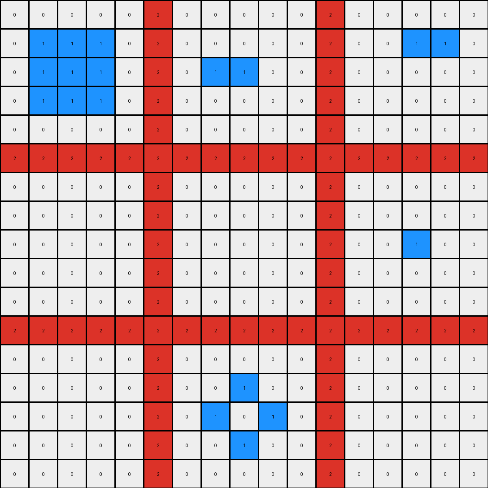

# 1e32b0e9 • 009 • refine_dreamer

---


Previous Code:
```python
"""
1. **Identify Stable Structures:** The two horizontal lines of red (2) pixels spanning the entire width of the grid on rows 6 and 12 remain unchanged. Consider these lines as "barriers" or "fixed" components.

2. **Blue Pixel Influence:**  Focus on the blue (1) pixels in the input grid.

3. **Red Pixel Modification, but not with Knight's Move Adjacency:**
   -  Examine red (2) pixels directly *above, below, or the to sides* (NOT diagonally or by Knight's move) of each blue pixel.
   -  If the "influence" (adjacency) extends past a barrier row, those influenced red (2) pixels will not be changed. For example:
        - Consider the isolated '1' pixel in the input grid, third to last row, column 9:
            - The red pixels *above, below, left, and right* are changed
        - Consider the isolated '1' pixel in the input grid, row 2, column 15:
           - The red pixels *above, below, and left* are changed, but NOT to the right
        - Consider the 3x1 block of '1' pixels in the input grid, rows 2-4, column 2:
            - The red pixels *below, left, and right* are changed.

4. **No Other Changes:** All other pixels, including white (0) pixels and red (2) pixels not adjacent to blue (1) pixels and not influenced past a red (2) barrier, remain unchanged.
"""

import numpy as np

def get_adjacent_pixels(grid, row, col):
    """Gets directly adjacent pixels (up, down, left, right)."""
    rows, cols = grid.shape
    adjacent = []
    if row > 0:
        adjacent.append((row - 1, col))  # Up
    if row < rows - 1:
        adjacent.append((row + 1, col))  # Down
    if col > 0:
        adjacent.append((row, col - 1))  # Left
    if col < cols - 1:
        adjacent.append((row, col + 1))  # Right
    return adjacent

def transform(input_grid):
    """Transforms the input grid according to the rules."""
    output_grid = np.copy(input_grid)
    rows, cols = input_grid.shape
    
    # Identify barrier rows (rows 6 and 12, but 0-indexed as 5 and 11)
    barrier_rows = [5, 11]

    # Find blue pixels
    blue_pixels = [(r, c) for r in range(rows) for c in range(cols) if input_grid[r, c] == 1]

    # Modify red pixels based on blue pixel adjacency and barriers
    for r, c in blue_pixels:
        adjacent_reds = []
        for ar, ac in get_adjacent_pixels(input_grid, r, c):
            if input_grid[ar, ac] == 2:
                # Check for barrier crossing
                crosses_barrier = False
                if r < ar: # adjacent is below
                    for barrier_row in barrier_rows:
                        if r < barrier_row < ar:
                            crosses_barrier = True
                            break
                elif r > ar: # adjacent is above
                     for barrier_row in barrier_rows:
                        if ar < barrier_row < r:
                            crosses_barrier = True
                            break               
                if not crosses_barrier:
                    adjacent_reds.append((ar, ac))


        for ar, ac in adjacent_reds:
            output_grid[ar, ac] = 2 # Keep the value as 2

    return output_grid
```

Train Set Results:

## Example 1:

Input:
```
0 0 0 0 0 8 0 0 0 0 0 8 0 0 0 0 0
0 0 2 0 0 8 0 0 0 0 0 8 0 0 0 0 0
0 2 2 2 0 8 0 0 0 0 0 8 0 2 2 2 0
0 0 2 0 0 8 0 0 0 0 0 8 0 0 0 0 0
0 0 0 0 0 8 0 0 0 0 0 8 0 0 0 0 0
8 8 8 8 8 8 8 8 8 8 8 8 8 8 8 8 8
0 0 0 0 0 8 0 0 0 0 0 8 0 0 0 0 0
0 0 0 0 0 8 0 0 2 0 0 8 0 0 0 0 0
0 0 0 0 0 8 0 2 0 2 0 8 0 0 0 0 0
0 0 0 0 0 8 0 0 2 0 0 8 0 0 0 0 0
0 0 0 0 0 8 0 0 0 0 0 8 0 0 0 0 0
8 8 8 8 8 8 8 8 8 8 8 8 8 8 8 8 8
0 0 0 0 0 8 0 0 0 0 0 8 0 0 0 0 0
0 0 2 0 0 8 0 0 0 0 0 8 0 0 0 0 0
0 2 2 2 0 8 0 0 0 0 0 8 0 0 0 0 0
0 0 2 0 0 8 0 0 0 0 0 8 0 0 0 0 0
0 0 0 0 0 8 0 0 0 0 0 8 0 0 0 0 0
```
Expected Output:
```
0 0 0 0 0 8 0 0 0 0 0 8 0 0 0 0 0
0 0 2 0 0 8 0 0 8 0 0 8 0 0 8 0 0
0 2 2 2 0 8 0 8 8 8 0 8 0 2 2 2 0
0 0 2 0 0 8 0 0 8 0 0 8 0 0 8 0 0
0 0 0 0 0 8 0 0 0 0 0 8 0 0 0 0 0
8 8 8 8 8 8 8 8 8 8 8 8 8 8 8 8 8
0 0 0 0 0 8 0 0 0 0 0 8 0 0 0 0 0
0 0 8 0 0 8 0 0 2 0 0 8 0 0 8 0 0
0 8 8 8 0 8 0 2 8 2 0 8 0 8 8 8 0
0 0 8 0 0 8 0 0 2 0 0 8 0 0 8 0 0
0 0 0 0 0 8 0 0 0 0 0 8 0 0 0 0 0
8 8 8 8 8 8 8 8 8 8 8 8 8 8 8 8 8
0 0 0 0 0 8 0 0 0 0 0 8 0 0 0 0 0
0 0 2 0 0 8 0 0 8 0 0 8 0 0 8 0 0
0 2 2 2 0 8 0 8 8 8 0 8 0 8 8 8 0
0 0 2 0 0 8 0 0 8 0 0 8 0 0 8 0 0
0 0 0 0 0 8 0 0 0 0 0 8 0 0 0 0 0
```
Transformed Output:
```
0 0 0 0 0 8 0 0 0 0 0 8 0 0 0 0 0
0 0 2 0 0 8 0 0 0 0 0 8 0 0 0 0 0
0 2 2 2 0 8 0 0 0 0 0 8 0 2 2 2 0
0 0 2 0 0 8 0 0 0 0 0 8 0 0 0 0 0
0 0 0 0 0 8 0 0 0 0 0 8 0 0 0 0 0
8 8 8 8 8 8 8 8 8 8 8 8 8 8 8 8 8
0 0 0 0 0 8 0 0 0 0 0 8 0 0 0 0 0
0 0 0 0 0 8 0 0 2 0 0 8 0 0 0 0 0
0 0 0 0 0 8 0 2 0 2 0 8 0 0 0 0 0
0 0 0 0 0 8 0 0 2 0 0 8 0 0 0 0 0
0 0 0 0 0 8 0 0 0 0 0 8 0 0 0 0 0
8 8 8 8 8 8 8 8 8 8 8 8 8 8 8 8 8
0 0 0 0 0 8 0 0 0 0 0 8 0 0 0 0 0
0 0 2 0 0 8 0 0 0 0 0 8 0 0 0 0 0
0 2 2 2 0 8 0 0 0 0 0 8 0 0 0 0 0
0 0 2 0 0 8 0 0 0 0 0 8 0 0 0 0 0
0 0 0 0 0 8 0 0 0 0 0 8 0 0 0 0 0
```

match: False
pixels_off: 28
size_correct: True
color_palette_correct: True
correct_pixel_counts: False

## Example 2:

Input:
```
0 0 0 0 0 2 0 0 0 0 0 2 0 0 0 0 0
0 1 1 1 0 2 0 0 0 0 0 2 0 0 1 1 0
0 1 1 1 0 2 0 1 1 0 0 2 0 0 0 0 0
0 1 1 1 0 2 0 0 0 0 0 2 0 0 0 0 0
0 0 0 0 0 2 0 0 0 0 0 2 0 0 0 0 0
2 2 2 2 2 2 2 2 2 2 2 2 2 2 2 2 2
0 0 0 0 0 2 0 0 0 0 0 2 0 0 0 0 0
0 0 0 0 0 2 0 0 0 0 0 2 0 0 0 0 0
0 0 0 0 0 2 0 0 0 0 0 2 0 0 1 0 0
0 0 0 0 0 2 0 0 0 0 0 2 0 0 0 0 0
0 0 0 0 0 2 0 0 0 0 0 2 0 0 0 0 0
2 2 2 2 2 2 2 2 2 2 2 2 2 2 2 2 2
0 0 0 0 0 2 0 0 0 0 0 2 0 0 0 0 0
0 0 0 0 0 2 0 0 1 0 0 2 0 0 0 0 0
0 0 0 0 0 2 0 1 0 1 0 2 0 0 0 0 0
0 0 0 0 0 2 0 0 1 0 0 2 0 0 0 0 0
0 0 0 0 0 2 0 0 0 0 0 2 0 0 0 0 0
```
Expected Output:
```
0 0 0 0 0 2 0 0 0 0 0 2 0 0 0 0 0
0 1 1 1 0 2 0 2 2 2 0 2 0 2 1 1 0
0 1 1 1 0 2 0 1 1 2 0 2 0 2 2 2 0
0 1 1 1 0 2 0 2 2 2 0 2 0 2 2 2 0
0 0 0 0 0 2 0 0 0 0 0 2 0 0 0 0 0
2 2 2 2 2 2 2 2 2 2 2 2 2 2 2 2 2
0 0 0 0 0 2 0 0 0 0 0 2 0 0 0 0 0
0 2 2 2 0 2 0 2 2 2 0 2 0 2 2 2 0
0 2 2 2 0 2 0 2 2 2 0 2 0 2 1 2 0
0 2 2 2 0 2 0 2 2 2 0 2 0 2 2 2 0
0 0 0 0 0 2 0 0 0 0 0 2 0 0 0 0 0
2 2 2 2 2 2 2 2 2 2 2 2 2 2 2 2 2
0 0 0 0 0 2 0 0 0 0 0 2 0 0 0 0 0
0 2 2 2 0 2 0 2 1 2 0 2 0 2 2 2 0
0 2 2 2 0 2 0 1 2 1 0 2 0 2 2 2 0
0 2 2 2 0 2 0 2 1 2 0 2 0 2 2 2 0
0 0 0 0 0 2 0 0 0 0 0 2 0 0 0 0 0
```
Transformed Output:
```
0 0 0 0 0 2 0 0 0 0 0 2 0 0 0 0 0
0 1 1 1 0 2 0 0 0 0 0 2 0 0 1 1 0
0 1 1 1 0 2 0 1 1 0 0 2 0 0 0 0 0
0 1 1 1 0 2 0 0 0 0 0 2 0 0 0 0 0
0 0 0 0 0 2 0 0 0 0 0 2 0 0 0 0 0
2 2 2 2 2 2 2 2 2 2 2 2 2 2 2 2 2
0 0 0 0 0 2 0 0 0 0 0 2 0 0 0 0 0
0 0 0 0 0 2 0 0 0 0 0 2 0 0 0 0 0
0 0 0 0 0 2 0 0 0 0 0 2 0 0 1 0 0
0 0 0 0 0 2 0 0 0 0 0 2 0 0 0 0 0
0 0 0 0 0 2 0 0 0 0 0 2 0 0 0 0 0
2 2 2 2 2 2 2 2 2 2 2 2 2 2 2 2 2
0 0 0 0 0 2 0 0 0 0 0 2 0 0 0 0 0
0 0 0 0 0 2 0 0 1 0 0 2 0 0 0 0 0
0 0 0 0 0 2 0 1 0 1 0 2 0 0 0 0 0
0 0 0 0 0 2 0 0 1 0 0 2 0 0 0 0 0
0 0 0 0 0 2 0 0 0 0 0 2 0 0 0 0 0
```

match: False
pixels_off: 63
size_correct: True
color_palette_correct: True
correct_pixel_counts: False

## Example 3:

Input:
```
0 0 0 0 0 1 0 0 0 0 0 1 0 0 0 0 0
0 0 3 0 0 1 0 0 0 0 0 1 0 0 0 0 0
0 3 0 3 0 1 0 3 0 0 0 1 0 0 0 3 0
0 0 3 0 0 1 0 0 0 0 0 1 0 0 0 0 0
0 0 0 0 0 1 0 0 0 0 0 1 0 0 0 0 0
1 1 1 1 1 1 1 1 1 1 1 1 1 1 1 1 1
0 0 0 0 0 1 0 0 0 0 0 1 0 0 0 0 0
0 0 3 0 0 1 0 0 0 0 0 1 0 0 0 0 0
0 3 0 0 0 1 0 0 0 0 0 1 0 0 0 0 0
0 0 0 0 0 1 0 0 0 0 0 1 0 0 0 0 0
0 0 0 0 0 1 0 0 0 0 0 1 0 0 0 0 0
1 1 1 1 1 1 1 1 1 1 1 1 1 1 1 1 1
0 0 0 0 0 1 0 0 0 0 0 1 0 0 0 0 0
0 0 0 0 0 1 0 0 0 0 0 1 0 0 0 0 0
0 0 0 0 0 1 0 0 0 0 0 1 0 0 0 3 0
0 0 0 0 0 1 0 0 0 0 0 1 0 0 3 0 0
0 0 0 0 0 1 0 0 0 0 0 1 0 0 0 0 0
```
Expected Output:
```
0 0 0 0 0 1 0 0 0 0 0 1 0 0 0 0 0
0 0 3 0 0 1 0 0 1 0 0 1 0 0 1 0 0
0 3 0 3 0 1 0 3 0 1 0 1 0 1 0 3 0
0 0 3 0 0 1 0 0 1 0 0 1 0 0 1 0 0
0 0 0 0 0 1 0 0 0 0 0 1 0 0 0 0 0
1 1 1 1 1 1 1 1 1 1 1 1 1 1 1 1 1
0 0 0 0 0 1 0 0 0 0 0 1 0 0 0 0 0
0 0 3 0 0 1 0 0 1 0 0 1 0 0 1 0 0
0 3 0 1 0 1 0 1 0 1 0 1 0 1 0 1 0
0 0 1 0 0 1 0 0 1 0 0 1 0 0 1 0 0
0 0 0 0 0 1 0 0 0 0 0 1 0 0 0 0 0
1 1 1 1 1 1 1 1 1 1 1 1 1 1 1 1 1
0 0 0 0 0 1 0 0 0 0 0 1 0 0 0 0 0
0 0 1 0 0 1 0 0 1 0 0 1 0 0 1 0 0
0 1 0 1 0 1 0 1 0 1 0 1 0 1 0 3 0
0 0 1 0 0 1 0 0 1 0 0 1 0 0 3 0 0
0 0 0 0 0 1 0 0 0 0 0 1 0 0 0 0 0
```
Transformed Output:
```
0 0 0 0 0 1 0 0 0 0 0 1 0 0 0 0 0
0 0 3 0 0 1 0 0 0 0 0 1 0 0 0 0 0
0 3 0 3 0 1 0 3 0 0 0 1 0 0 0 3 0
0 0 3 0 0 1 0 0 0 0 0 1 0 0 0 0 0
0 0 0 0 0 1 0 0 0 0 0 1 0 0 0 0 0
1 1 1 1 1 1 1 1 1 1 1 1 1 1 1 1 1
0 0 0 0 0 1 0 0 0 0 0 1 0 0 0 0 0
0 0 3 0 0 1 0 0 0 0 0 1 0 0 0 0 0
0 3 0 0 0 1 0 0 0 0 0 1 0 0 0 0 0
0 0 0 0 0 1 0 0 0 0 0 1 0 0 0 0 0
0 0 0 0 0 1 0 0 0 0 0 1 0 0 0 0 0
1 1 1 1 1 1 1 1 1 1 1 1 1 1 1 1 1
0 0 0 0 0 1 0 0 0 0 0 1 0 0 0 0 0
0 0 0 0 0 1 0 0 0 0 0 1 0 0 0 0 0
0 0 0 0 0 1 0 0 0 0 0 1 0 0 0 3 0
0 0 0 0 0 1 0 0 0 0 0 1 0 0 3 0 0
0 0 0 0 0 1 0 0 0 0 0 1 0 0 0 0 0
```

match: False
pixels_off: 26
size_correct: True
color_palette_correct: True
correct_pixel_counts: False

**INSTRUCTIONS**

The code above was generated based on observations from the first training
example

we have tested the transform function on each of the task example inputs and
compared with the expected output

review each of the examples provided and the results and consider how the
natural language program should be updated to accommodate this new knowledge

respond with the following deliverables:

- general assessment of the information provided and strategy for resolving the
  errors
- gather metrics about each of the examples and results - use code_execution to
  develop accurate reports on your assumptions
- a YAML block documenting facts - Focus on identifying objects, their properties, and the actions performed on them.
- a natural language program - Be as clear and concise as possible, providing a complete description of the transformation rule.


your responses should be considered as information in a report - not a
conversation
