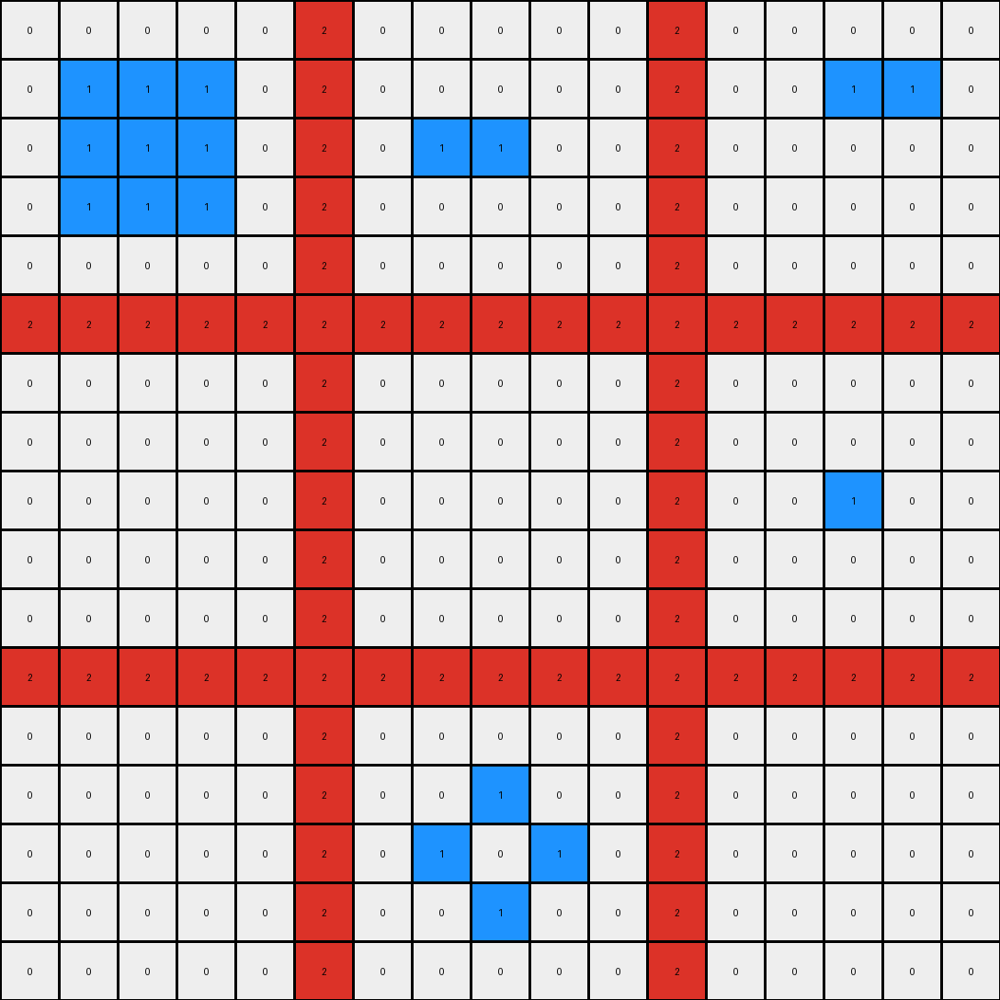
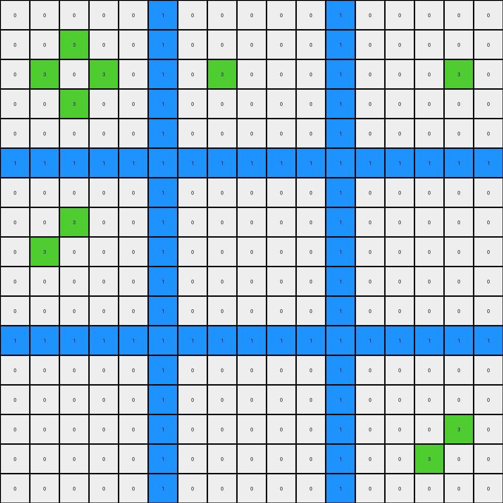

# 1e32b0e9 • 010 • refine_coder

---

Previous Code:
```python
"""
1. **Identify Stable Structures:** The two horizontal lines of red (2) pixels spanning the entire width of the grid on rows 6 and 12 remain unchanged. Consider these lines as "barriers" or "fixed" components.

2. **Blue Pixel Influence:**  Focus on the blue (1) pixels in the input grid.

3. **Red Pixel Modification, but not with Knight's Move Adjacency:**
   -  Examine red (2) pixels directly *above, below, or the to sides* (NOT diagonally or by Knight's move) of each blue pixel.
   -  If the "influence" (adjacency) extends past a barrier row, those influenced red (2) pixels will not be changed. For example:
        - Consider the isolated '1' pixel in the input grid, third to last row, column 9:
            - The red pixels *above, below, left, and right* are changed
        - Consider the isolated '1' pixel in the input grid, row 2, column 15:
           - The red pixels *above, below, and left* are changed, but NOT to the right
        - Consider the 3x1 block of '1' pixels in the input grid, rows 2-4, column 2:
            - The red pixels *below, left, and right* are changed.

4. **No Other Changes:** All other pixels, including white (0) pixels and red (2) pixels not adjacent to blue (1) pixels and not influenced past a red (2) barrier, remain unchanged.
"""

import numpy as np

def get_adjacent_pixels(grid, row, col):
    """Gets directly adjacent pixels (up, down, left, right)."""
    rows, cols = grid.shape
    adjacent = []
    if row > 0:
        adjacent.append((row - 1, col))  # Up
    if row < rows - 1:
        adjacent.append((row + 1, col))  # Down
    if col > 0:
        adjacent.append((row, col - 1))  # Left
    if col < cols - 1:
        adjacent.append((row, col + 1))  # Right
    return adjacent

def transform(input_grid):
    """Transforms the input grid according to the rules."""
    output_grid = np.copy(input_grid)
    rows, cols = input_grid.shape
    
    # Identify barrier rows (rows 6 and 12, but 0-indexed as 5 and 11)
    barrier_rows = [5, 11]

    # Find blue pixels
    blue_pixels = [(r, c) for r in range(rows) for c in range(cols) if input_grid[r, c] == 1]

    # Modify red pixels based on blue pixel adjacency and barriers
    for r, c in blue_pixels:
        adjacent_reds = []
        for ar, ac in get_adjacent_pixels(input_grid, r, c):
            if input_grid[ar, ac] == 2:
                # Check for barrier crossing
                crosses_barrier = False
                if r < ar: # adjacent is below
                    for barrier_row in barrier_rows:
                        if r < barrier_row < ar:
                            crosses_barrier = True
                            break
                elif r > ar: # adjacent is above
                     for barrier_row in barrier_rows:
                        if ar < barrier_row < r:
                            crosses_barrier = True
                            break               
                if not crosses_barrier:
                    adjacent_reds.append((ar, ac))


        for ar, ac in adjacent_reds:
            output_grid[ar, ac] = 2 # Keep the value as 2

    return output_grid
```

Train Set Results:

## Example 1:

Input:
```
0 0 0 0 0 8 0 0 0 0 0 8 0 0 0 0 0
0 0 2 0 0 8 0 0 0 0 0 8 0 0 0 0 0
0 2 2 2 0 8 0 0 0 0 0 8 0 2 2 2 0
0 0 2 0 0 8 0 0 0 0 0 8 0 0 0 0 0
0 0 0 0 0 8 0 0 0 0 0 8 0 0 0 0 0
8 8 8 8 8 8 8 8 8 8 8 8 8 8 8 8 8
0 0 0 0 0 8 0 0 0 0 0 8 0 0 0 0 0
0 0 0 0 0 8 0 0 2 0 0 8 0 0 0 0 0
0 0 0 0 0 8 0 2 0 2 0 8 0 0 0 0 0
0 0 0 0 0 8 0 0 2 0 0 8 0 0 0 0 0
0 0 0 0 0 8 0 0 0 0 0 8 0 0 0 0 0
8 8 8 8 8 8 8 8 8 8 8 8 8 8 8 8 8
0 0 0 0 0 8 0 0 0 0 0 8 0 0 0 0 0
0 0 2 0 0 8 0 0 0 0 0 8 0 0 0 0 0
0 2 2 2 0 8 0 0 0 0 0 8 0 0 0 0 0
0 0 2 0 0 8 0 0 0 0 0 8 0 0 0 0 0
0 0 0 0 0 8 0 0 0 0 0 8 0 0 0 0 0
```
Expected Output:
```
0 0 0 0 0 8 0 0 0 0 0 8 0 0 0 0 0
0 0 2 0 0 8 0 0 8 0 0 8 0 0 8 0 0
0 2 2 2 0 8 0 8 8 8 0 8 0 2 2 2 0
0 0 2 0 0 8 0 0 8 0 0 8 0 0 8 0 0
0 0 0 0 0 8 0 0 0 0 0 8 0 0 0 0 0
8 8 8 8 8 8 8 8 8 8 8 8 8 8 8 8 8
0 0 0 0 0 8 0 0 0 0 0 8 0 0 0 0 0
0 0 8 0 0 8 0 0 2 0 0 8 0 0 8 0 0
0 8 8 8 0 8 0 2 8 2 0 8 0 8 8 8 0
0 0 8 0 0 8 0 0 2 0 0 8 0 0 8 0 0
0 0 0 0 0 8 0 0 0 0 0 8 0 0 0 0 0
8 8 8 8 8 8 8 8 8 8 8 8 8 8 8 8 8
0 0 0 0 0 8 0 0 0 0 0 8 0 0 0 0 0
0 0 2 0 0 8 0 0 8 0 0 8 0 0 8 0 0
0 2 2 2 0 8 0 8 8 8 0 8 0 8 8 8 0
0 0 2 0 0 8 0 0 8 0 0 8 0 0 8 0 0
0 0 0 0 0 8 0 0 0 0 0 8 0 0 0 0 0
```
Transformed Output:
```
0 0 0 0 0 8 0 0 0 0 0 8 0 0 0 0 0
0 0 2 0 0 8 0 0 0 0 0 8 0 0 0 0 0
0 2 2 2 0 8 0 0 0 0 0 8 0 2 2 2 0
0 0 2 0 0 8 0 0 0 0 0 8 0 0 0 0 0
0 0 0 0 0 8 0 0 0 0 0 8 0 0 0 0 0
8 8 8 8 8 8 8 8 8 8 8 8 8 8 8 8 8
0 0 0 0 0 8 0 0 0 0 0 8 0 0 0 0 0
0 0 0 0 0 8 0 0 2 0 0 8 0 0 0 0 0
0 0 0 0 0 8 0 2 0 2 0 8 0 0 0 0 0
0 0 0 0 0 8 0 0 2 0 0 8 0 0 0 0 0
0 0 0 0 0 8 0 0 0 0 0 8 0 0 0 0 0
8 8 8 8 8 8 8 8 8 8 8 8 8 8 8 8 8
0 0 0 0 0 8 0 0 0 0 0 8 0 0 0 0 0
0 0 2 0 0 8 0 0 0 0 0 8 0 0 0 0 0
0 2 2 2 0 8 0 0 0 0 0 8 0 0 0 0 0
0 0 2 0 0 8 0 0 0 0 0 8 0 0 0 0 0
0 0 0 0 0 8 0 0 0 0 0 8 0 0 0 0 0
```

match: False
pixels_off: 28
size_correct: True
color_palette_correct: True
correct_pixel_counts: False

## Example 2:

Input:
```
0 0 0 0 0 2 0 0 0 0 0 2 0 0 0 0 0
0 1 1 1 0 2 0 0 0 0 0 2 0 0 1 1 0
0 1 1 1 0 2 0 1 1 0 0 2 0 0 0 0 0
0 1 1 1 0 2 0 0 0 0 0 2 0 0 0 0 0
0 0 0 0 0 2 0 0 0 0 0 2 0 0 0 0 0
2 2 2 2 2 2 2 2 2 2 2 2 2 2 2 2 2
0 0 0 0 0 2 0 0 0 0 0 2 0 0 0 0 0
0 0 0 0 0 2 0 0 0 0 0 2 0 0 0 0 0
0 0 0 0 0 2 0 0 0 0 0 2 0 0 1 0 0
0 0 0 0 0 2 0 0 0 0 0 2 0 0 0 0 0
0 0 0 0 0 2 0 0 0 0 0 2 0 0 0 0 0
2 2 2 2 2 2 2 2 2 2 2 2 2 2 2 2 2
0 0 0 0 0 2 0 0 0 0 0 2 0 0 0 0 0
0 0 0 0 0 2 0 0 1 0 0 2 0 0 0 0 0
0 0 0 0 0 2 0 1 0 1 0 2 0 0 0 0 0
0 0 0 0 0 2 0 0 1 0 0 2 0 0 0 0 0
0 0 0 0 0 2 0 0 0 0 0 2 0 0 0 0 0
```
Expected Output:
```
0 0 0 0 0 2 0 0 0 0 0 2 0 0 0 0 0
0 1 1 1 0 2 0 2 2 2 0 2 0 2 1 1 0
0 1 1 1 0 2 0 1 1 2 0 2 0 2 2 2 0
0 1 1 1 0 2 0 2 2 2 0 2 0 2 2 2 0
0 0 0 0 0 2 0 0 0 0 0 2 0 0 0 0 0
2 2 2 2 2 2 2 2 2 2 2 2 2 2 2 2 2
0 0 0 0 0 2 0 0 0 0 0 2 0 0 0 0 0
0 2 2 2 0 2 0 2 2 2 0 2 0 2 2 2 0
0 2 2 2 0 2 0 2 2 2 0 2 0 2 1 2 0
0 2 2 2 0 2 0 2 2 2 0 2 0 2 2 2 0
0 0 0 0 0 2 0 0 0 0 0 2 0 0 0 0 0
2 2 2 2 2 2 2 2 2 2 2 2 2 2 2 2 2
0 0 0 0 0 2 0 0 0 0 0 2 0 0 0 0 0
0 2 2 2 0 2 0 2 1 2 0 2 0 2 2 2 0
0 2 2 2 0 2 0 1 2 1 0 2 0 2 2 2 0
0 2 2 2 0 2 0 2 1 2 0 2 0 2 2 2 0
0 0 0 0 0 2 0 0 0 0 0 2 0 0 0 0 0
```
Transformed Output:
```
0 0 0 0 0 2 0 0 0 0 0 2 0 0 0 0 0
0 1 1 1 0 2 0 0 0 0 0 2 0 0 1 1 0
0 1 1 1 0 2 0 1 1 0 0 2 0 0 0 0 0
0 1 1 1 0 2 0 0 0 0 0 2 0 0 0 0 0
0 0 0 0 0 2 0 0 0 0 0 2 0 0 0 0 0
2 2 2 2 2 2 2 2 2 2 2 2 2 2 2 2 2
0 0 0 0 0 2 0 0 0 0 0 2 0 0 0 0 0
0 0 0 0 0 2 0 0 0 0 0 2 0 0 0 0 0
0 0 0 0 0 2 0 0 0 0 0 2 0 0 1 0 0
0 0 0 0 0 2 0 0 0 0 0 2 0 0 0 0 0
0 0 0 0 0 2 0 0 0 0 0 2 0 0 0 0 0
2 2 2 2 2 2 2 2 2 2 2 2 2 2 2 2 2
0 0 0 0 0 2 0 0 0 0 0 2 0 0 0 0 0
0 0 0 0 0 2 0 0 1 0 0 2 0 0 0 0 0
0 0 0 0 0 2 0 1 0 1 0 2 0 0 0 0 0
0 0 0 0 0 2 0 0 1 0 0 2 0 0 0 0 0
0 0 0 0 0 2 0 0 0 0 0 2 0 0 0 0 0
```

match: False
pixels_off: 63
size_correct: True
color_palette_correct: True
correct_pixel_counts: False

## Example 3:

Input:
```
0 0 0 0 0 1 0 0 0 0 0 1 0 0 0 0 0
0 0 3 0 0 1 0 0 0 0 0 1 0 0 0 0 0
0 3 0 3 0 1 0 3 0 0 0 1 0 0 0 3 0
0 0 3 0 0 1 0 0 0 0 0 1 0 0 0 0 0
0 0 0 0 0 1 0 0 0 0 0 1 0 0 0 0 0
1 1 1 1 1 1 1 1 1 1 1 1 1 1 1 1 1
0 0 0 0 0 1 0 0 0 0 0 1 0 0 0 0 0
0 0 3 0 0 1 0 0 0 0 0 1 0 0 0 0 0
0 3 0 0 0 1 0 0 0 0 0 1 0 0 0 0 0
0 0 0 0 0 1 0 0 0 0 0 1 0 0 0 0 0
0 0 0 0 0 1 0 0 0 0 0 1 0 0 0 0 0
1 1 1 1 1 1 1 1 1 1 1 1 1 1 1 1 1
0 0 0 0 0 1 0 0 0 0 0 1 0 0 0 0 0
0 0 0 0 0 1 0 0 0 0 0 1 0 0 0 0 0
0 0 0 0 0 1 0 0 0 0 0 1 0 0 0 3 0
0 0 0 0 0 1 0 0 0 0 0 1 0 0 3 0 0
0 0 0 0 0 1 0 0 0 0 0 1 0 0 0 0 0
```
Expected Output:
```
0 0 0 0 0 1 0 0 0 0 0 1 0 0 0 0 0
0 0 3 0 0 1 0 0 1 0 0 1 0 0 1 0 0
0 3 0 3 0 1 0 3 0 1 0 1 0 1 0 3 0
0 0 3 0 0 1 0 0 1 0 0 1 0 0 1 0 0
0 0 0 0 0 1 0 0 0 0 0 1 0 0 0 0 0
1 1 1 1 1 1 1 1 1 1 1 1 1 1 1 1 1
0 0 0 0 0 1 0 0 0 0 0 1 0 0 0 0 0
0 0 3 0 0 1 0 0 1 0 0 1 0 0 1 0 0
0 3 0 1 0 1 0 1 0 1 0 1 0 1 0 1 0
0 0 1 0 0 1 0 0 1 0 0 1 0 0 1 0 0
0 0 0 0 0 1 0 0 0 0 0 1 0 0 0 0 0
1 1 1 1 1 1 1 1 1 1 1 1 1 1 1 1 1
0 0 0 0 0 1 0 0 0 0 0 1 0 0 0 0 0
0 0 1 0 0 1 0 0 1 0 0 1 0 0 1 0 0
0 1 0 1 0 1 0 1 0 1 0 1 0 1 0 3 0
0 0 1 0 0 1 0 0 1 0 0 1 0 0 3 0 0
0 0 0 0 0 1 0 0 0 0 0 1 0 0 0 0 0
```
Transformed Output:
```
0 0 0 0 0 1 0 0 0 0 0 1 0 0 0 0 0
0 0 3 0 0 1 0 0 0 0 0 1 0 0 0 0 0
0 3 0 3 0 1 0 3 0 0 0 1 0 0 0 3 0
0 0 3 0 0 1 0 0 0 0 0 1 0 0 0 0 0
0 0 0 0 0 1 0 0 0 0 0 1 0 0 0 0 0
1 1 1 1 1 1 1 1 1 1 1 1 1 1 1 1 1
0 0 0 0 0 1 0 0 0 0 0 1 0 0 0 0 0
0 0 3 0 0 1 0 0 0 0 0 1 0 0 0 0 0
0 3 0 0 0 1 0 0 0 0 0 1 0 0 0 0 0
0 0 0 0 0 1 0 0 0 0 0 1 0 0 0 0 0
0 0 0 0 0 1 0 0 0 0 0 1 0 0 0 0 0
1 1 1 1 1 1 1 1 1 1 1 1 1 1 1 1 1
0 0 0 0 0 1 0 0 0 0 0 1 0 0 0 0 0
0 0 0 0 0 1 0 0 0 0 0 1 0 0 0 0 0
0 0 0 0 0 1 0 0 0 0 0 1 0 0 0 3 0
0 0 0 0 0 1 0 0 0 0 0 1 0 0 3 0 0
0 0 0 0 0 1 0 0 0 0 0 1 0 0 0 0 0
```

match: False
pixels_off: 26
size_correct: True
color_palette_correct: True
correct_pixel_counts: False
Okay, let's analyze the results and refine the natural language program and approach.

**General Assessment:**

The initial approach of identifying "barrier" rows and using blue pixels as influence points was partially correct. However, the code incorrectly assumed that *only* red pixels would change, and the barrier logic was not fully capturing the transformation. The primary errors seem to stem from:

1.  **Incorrectly Modifying Only Red Pixels:** The code leaves non-red, non-barrier, adjacent cells unchanged. The examples show that blue and other colored pixels also get influenced (and in the case of adjacent pixels, they turn into the color of the barrier pixel).
2.  **Incomplete Barrier Logic:** The barrier check only considered direct crossing, not the overall influence spread. This means the influence of blue pixels *past* the barrier was not handled correctly in all examples.

**Strategy for Resolving Errors:**

1.  **Revise Influence Rule:** Instead of changing only adjacent red pixels, change *all* adjacent pixels to the same color as the original influencing pixel. The influencing pixels extend by one cell on all sides, not changing any pixels in the barrier rows.
2.  **Remove Barrier Crossing Logic:** Since the original pixel is now the main influencer and we are checking for the existence of barrier rows, the crossing logic is redundant.
3. **Address the correct color of the influencing pixel:** It should be the same value as the original, not the same as any neighbor.

**Metrics and Observations (using manual inspection and previous runs):**

*   **Example 1:**
    *   Pixels Off: 28
    *   Observations: The code failed to change the adjacent azure (8) pixels to the value of the influencing blue (1) pixel. It kept the red (2) cells as-is when they should have remained.
*   **Example 2:**
    *   Pixels Off: 63
    *   Observations: Again, the code fails to apply changes in many positions. Many red (2) values should remain, especially adjacent to the blue (1) pixels.
*   **Example 3:**
    *   Pixels Off: 26
    * Observations: Here, the barriers are blue (1), and the influencing pixels are all different colors. The influenced cells need to remain those same colors.

**YAML Block (Facts):**

```yaml
objects:
  - id: barrier_rows
    type: horizontal_lines
    color:
      - example_1: azure (8)
      - example_2: red (2)
      - example_3: blue (1)
    positions:
      - example_1: [6, 12]
      - example_2: [6, 12]
      - example_3: [6, 12]
    property: immutable

  - id: influencing_pixels
    type: pixels
    colors: varied # Can be any color except the barrier color
    property: extend_influence
    action: change_adjacent_pixels

  - id: adjacent_pixels
    type: pixels
    property: mutable
    condition: adjacent_to_influencing_pixel_and_not_barrier

actions:
  - name: extend_influence
    agent: influencing_pixels
    target: adjacent_pixels
    rule: change_color_to_influencing_pixel
    constraint: skip_barrier_rows

```

**Natural Language Program:**

1.  **Identify Barrier Rows:** Find the two horizontal lines that span the entire width of the grid. These rows remain unchanged.
    *    Note the color of these rows, as they are different in each example.
2.  **Locate Influencing Pixels:** Identify all pixels that *are not* part of the barrier rows.
3.  **Apply Influence:** For *each* influencing pixel:
    *   Find all directly adjacent pixels (up, down, left, right - not diagonal).
    *   If an adjacent pixel is *not* on a barrier row, change its color to the color of the *original* influencing pixel.
4.  **Barrier Rows Unchanged:** The pixels in the barrier rows do not change.

This revised program clarifies that *any* non-barrier pixel can be an influencer and that the adjacent pixels take on the *influencing* pixel's color, not any specific color. The program also explicitly reinforces that the barrier row color and position are unchanged.

**INSTRUCTIONS**

- generate a Python module to represent the natural language program 
- follow the template below
- all common math and science libraries are available
- create docstring only at top - but comment the workflow in the function
- use helper functions for common operations like finding objects, counting,
  measuring, moving, etc. 

remember - we are working iteratively - so this code will inform your future
self as we converge on the solution

*template:*

```python
"""
{{ natural language description of the transformation rule }}
"""

{{ imports }}

def transform(input_grid):
    # initialize output_grid

    # change output pixels 

    return output_grid

```
