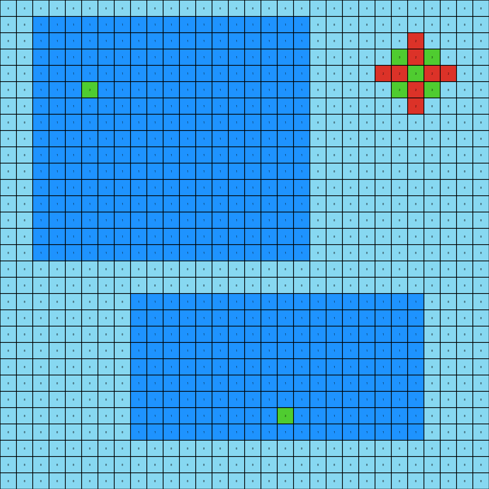
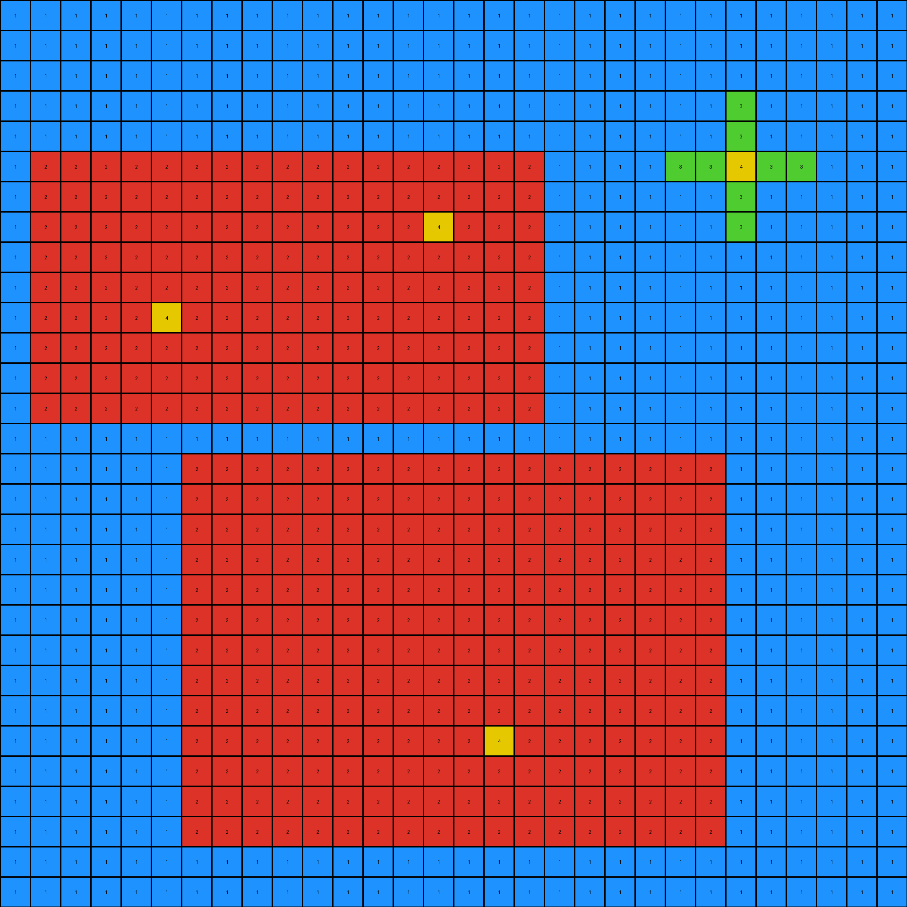
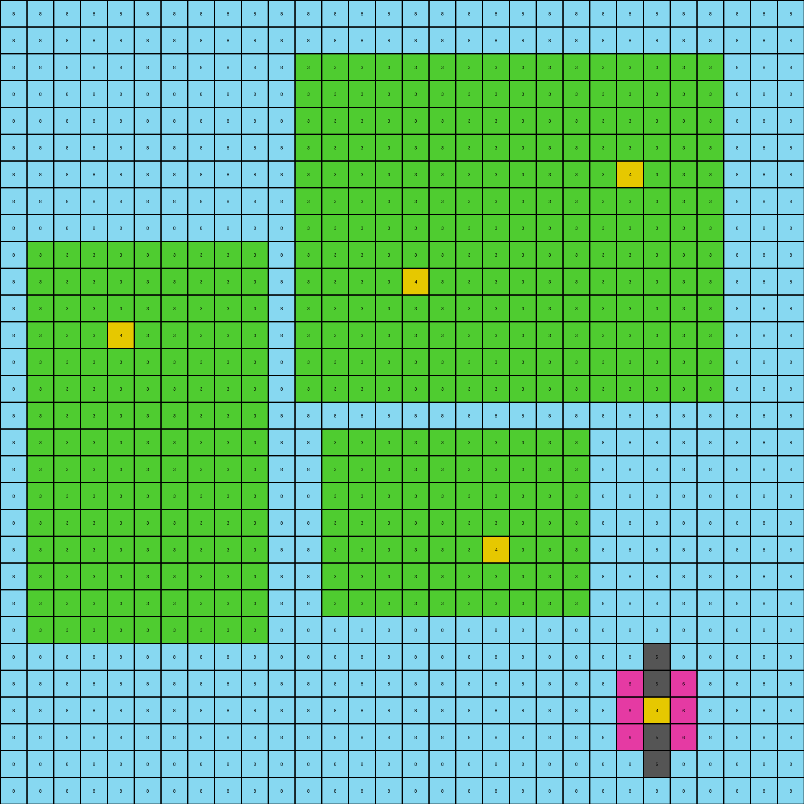

# 264363fd • 009 • refine_dreamer

---


Previous Code:
```python
"""
1.  **Identify** all red (2) rectangular objects in the input grid.
2.  **Locate** all yellow (4) pixels within each red rectangle.
3.  For each red rectangle, **draw** a horizontal green (3) stripe that passes through the y-coordinate of the yellow pixel, extending to the edges of the red rectangle.
4.  For each red rectangle, **draw** a vertical green (3) stripe that passes through the x-coordinate of the yellow pixel, extending to the edges of the red rectangle.
5.  The rest of the elements including small "cross" remain at their place.
6. The small green cross like shape with yellow pixels inside one part does not interact with the red rectangles.
"""

import numpy as np

def find_objects(grid, color):
    # Find all objects of a specific color
    objects = []
    visited = np.zeros_like(grid, dtype=bool)

    def dfs(row, col, current_object):
        if (
            row < 0
            or row >= grid.shape[0]
            or col < 0
            or col >= grid.shape[1]
            or visited[row, col]
            or grid[row, col] != color
        ):
            return
        visited[row, col] = True
        current_object.append((row, col))
        dfs(row + 1, col, current_object)
        dfs(row - 1, col, current_object)
        dfs(row, col + 1, current_object)
        dfs(row, col - 1, current_object)

    for row in range(grid.shape[0]):
        for col in range(grid.shape[1]):
            if grid[row, col] == color and not visited[row, col]:
                current_object = []
                dfs(row, col, current_object)
                objects.append(current_object)
    return objects

def is_rectangle(object_pixels):
    #checks if a set of pixels form a rectangle
    rows = [p[0] for p in object_pixels]
    cols = [p[1] for p in object_pixels]
    min_row, max_row = min(rows), max(rows)
    min_col, max_col = min(cols), max(cols)

    expected_size = (max_row - min_row + 1) * (max_col - min_col + 1)
    return len(object_pixels) == expected_size

def find_yellow_pixels_in_object(grid, object_pixels):
    #finds the yellow pixel in the rectangle
    yellow_pixels = []
    for r, c in object_pixels:
        if grid[r,c] == 4:
            yellow_pixels.append((r,c))
    return yellow_pixels

def transform(input_grid):
    # initialize output_grid
    output_grid = np.copy(input_grid)
    # Find all red rectangles
    red_objects = find_objects(input_grid, 2)
    red_rectangles = [obj for obj in red_objects if is_rectangle(obj)]


    for rectangle in red_rectangles:
        #find yellow pixels within the rectangle
        yellow_pixels = find_yellow_pixels_in_object(input_grid, rectangle)

        for yellow_pixel in yellow_pixels:
            yellow_row, yellow_col = yellow_pixel

            # Draw horizontal green stripe
            for col in [p[1] for p in rectangle]:
                output_grid[yellow_row, col] = 3

            # Draw vertical green stripe
            for row in [p[0] for p in rectangle]:
                output_grid[row, yellow_col] = 3

    return output_grid
```

Train Set Results:

## Example 1:

Input:
```
8 8 8 8 8 8 8 8 8 8 8 8 8 8 8 8 8 8 8 8 8 8 8 8 8 8 8 8 8 8
8 8 1 1 1 1 1 1 1 1 1 1 1 1 1 1 1 1 1 8 8 8 8 8 8 8 8 8 8 8
8 8 1 1 1 1 1 1 1 1 1 1 1 1 1 1 1 1 1 8 8 8 8 8 8 2 8 8 8 8
8 8 1 1 1 1 1 1 1 1 1 1 1 1 1 1 1 1 1 8 8 8 8 8 3 2 3 8 8 8
8 8 1 1 1 1 1 1 1 1 1 1 1 1 1 1 1 1 1 8 8 8 8 2 2 3 2 2 8 8
8 8 1 1 1 3 1 1 1 1 1 1 1 1 1 1 1 1 1 8 8 8 8 8 3 2 3 8 8 8
8 8 1 1 1 1 1 1 1 1 1 1 1 1 1 1 1 1 1 8 8 8 8 8 8 2 8 8 8 8
8 8 1 1 1 1 1 1 1 1 1 1 1 1 1 1 1 1 1 8 8 8 8 8 8 8 8 8 8 8
8 8 1 1 1 1 1 1 1 1 1 1 1 1 1 1 1 1 1 8 8 8 8 8 8 8 8 8 8 8
8 8 1 1 1 1 1 1 1 1 1 1 1 1 1 1 1 1 1 8 8 8 8 8 8 8 8 8 8 8
8 8 1 1 1 1 1 1 1 1 1 1 1 1 1 1 1 1 1 8 8 8 8 8 8 8 8 8 8 8
8 8 1 1 1 1 1 1 1 1 1 1 1 1 1 1 1 1 1 8 8 8 8 8 8 8 8 8 8 8
8 8 1 1 1 1 1 1 1 1 1 1 1 1 1 1 1 1 1 8 8 8 8 8 8 8 8 8 8 8
8 8 1 1 1 1 1 1 1 1 1 1 1 1 1 1 1 1 1 8 8 8 8 8 8 8 8 8 8 8
8 8 1 1 1 1 1 1 1 1 1 1 1 1 1 1 1 1 1 8 8 8 8 8 8 8 8 8 8 8
8 8 1 1 1 1 1 1 1 1 1 1 1 1 1 1 1 1 1 8 8 8 8 8 8 8 8 8 8 8
8 8 8 8 8 8 8 8 8 8 8 8 8 8 8 8 8 8 8 8 8 8 8 8 8 8 8 8 8 8
8 8 8 8 8 8 8 8 8 8 8 8 8 8 8 8 8 8 8 8 8 8 8 8 8 8 8 8 8 8
8 8 8 8 8 8 8 8 1 1 1 1 1 1 1 1 1 1 1 1 1 1 1 1 1 1 8 8 8 8
8 8 8 8 8 8 8 8 1 1 1 1 1 1 1 1 1 1 1 1 1 1 1 1 1 1 8 8 8 8
8 8 8 8 8 8 8 8 1 1 1 1 1 1 1 1 1 1 1 1 1 1 1 1 1 1 8 8 8 8
8 8 8 8 8 8 8 8 1 1 1 1 1 1 1 1 1 1 1 1 1 1 1 1 1 1 8 8 8 8
8 8 8 8 8 8 8 8 1 1 1 1 1 1 1 1 1 1 1 1 1 1 1 1 1 1 8 8 8 8
8 8 8 8 8 8 8 8 1 1 1 1 1 1 1 1 1 1 1 1 1 1 1 1 1 1 8 8 8 8
8 8 8 8 8 8 8 8 1 1 1 1 1 1 1 1 1 1 1 1 1 1 1 1 1 1 8 8 8 8
8 8 8 8 8 8 8 8 1 1 1 1 1 1 1 1 1 3 1 1 1 1 1 1 1 1 8 8 8 8
8 8 8 8 8 8 8 8 1 1 1 1 1 1 1 1 1 1 1 1 1 1 1 1 1 1 8 8 8 8
8 8 8 8 8 8 8 8 8 8 8 8 8 8 8 8 8 8 8 8 8 8 8 8 8 8 8 8 8 8
8 8 8 8 8 8 8 8 8 8 8 8 8 8 8 8 8 8 8 8 8 8 8 8 8 8 8 8 8 8
8 8 8 8 8 8 8 8 8 8 8 8 8 8 8 8 8 8 8 8 8 8 8 8 8 8 8 8 8 8
```
Expected Output:
```
8 8 8 8 8 8 8 8 8 8 8 8 8 8 8 8 8 8 8 8 8 8 8 8 8 8 8 8 8 8
8 8 1 1 1 2 1 1 1 1 1 1 1 1 1 1 1 1 1 8 8 8 8 8 8 8 8 8 8 8
8 8 1 1 1 2 1 1 1 1 1 1 1 1 1 1 1 1 1 8 8 8 8 8 8 8 8 8 8 8
8 8 1 1 1 2 1 1 1 1 1 1 1 1 1 1 1 1 1 8 8 8 8 8 8 8 8 8 8 8
8 8 1 1 3 2 3 1 1 1 1 1 1 1 1 1 1 1 1 8 8 8 8 8 8 8 8 8 8 8
8 8 2 2 2 3 2 2 2 2 2 2 2 2 2 2 2 2 2 8 8 8 8 8 8 8 8 8 8 8
8 8 1 1 3 2 3 1 1 1 1 1 1 1 1 1 1 1 1 8 8 8 8 8 8 8 8 8 8 8
8 8 1 1 1 2 1 1 1 1 1 1 1 1 1 1 1 1 1 8 8 8 8 8 8 8 8 8 8 8
8 8 1 1 1 2 1 1 1 1 1 1 1 1 1 1 1 1 1 8 8 8 8 8 8 8 8 8 8 8
8 8 1 1 1 2 1 1 1 1 1 1 1 1 1 1 1 1 1 8 8 8 8 8 8 8 8 8 8 8
8 8 1 1 1 2 1 1 1 1 1 1 1 1 1 1 1 1 1 8 8 8 8 8 8 8 8 8 8 8
8 8 1 1 1 2 1 1 1 1 1 1 1 1 1 1 1 1 1 8 8 8 8 8 8 8 8 8 8 8
8 8 1 1 1 2 1 1 1 1 1 1 1 1 1 1 1 1 1 8 8 8 8 8 8 8 8 8 8 8
8 8 1 1 1 2 1 1 1 1 1 1 1 1 1 1 1 1 1 8 8 8 8 8 8 8 8 8 8 8
8 8 1 1 1 2 1 1 1 1 1 1 1 1 1 1 1 1 1 8 8 8 8 8 8 8 8 8 8 8
8 8 1 1 1 2 1 1 1 1 1 1 1 1 1 1 1 1 1 8 8 8 8 8 8 8 8 8 8 8
8 8 8 8 8 8 8 8 8 8 8 8 8 8 8 8 8 8 8 8 8 8 8 8 8 8 8 8 8 8
8 8 8 8 8 8 8 8 8 8 8 8 8 8 8 8 8 8 8 8 8 8 8 8 8 8 8 8 8 8
8 8 8 8 8 8 8 8 1 1 1 1 1 1 1 1 1 2 1 1 1 1 1 1 1 1 8 8 8 8
8 8 8 8 8 8 8 8 1 1 1 1 1 1 1 1 1 2 1 1 1 1 1 1 1 1 8 8 8 8
8 8 8 8 8 8 8 8 1 1 1 1 1 1 1 1 1 2 1 1 1 1 1 1 1 1 8 8 8 8
8 8 8 8 8 8 8 8 1 1 1 1 1 1 1 1 1 2 1 1 1 1 1 1 1 1 8 8 8 8
8 8 8 8 8 8 8 8 1 1 1 1 1 1 1 1 1 2 1 1 1 1 1 1 1 1 8 8 8 8
8 8 8 8 8 8 8 8 1 1 1 1 1 1 1 1 1 2 1 1 1 1 1 1 1 1 8 8 8 8
8 8 8 8 8 8 8 8 1 1 1 1 1 1 1 1 3 2 3 1 1 1 1 1 1 1 8 8 8 8
8 8 8 8 8 8 8 8 2 2 2 2 2 2 2 2 2 3 2 2 2 2 2 2 2 2 8 8 8 8
8 8 8 8 8 8 8 8 1 1 1 1 1 1 1 1 3 2 3 1 1 1 1 1 1 1 8 8 8 8
8 8 8 8 8 8 8 8 8 8 8 8 8 8 8 8 8 8 8 8 8 8 8 8 8 8 8 8 8 8
8 8 8 8 8 8 8 8 8 8 8 8 8 8 8 8 8 8 8 8 8 8 8 8 8 8 8 8 8 8
8 8 8 8 8 8 8 8 8 8 8 8 8 8 8 8 8 8 8 8 8 8 8 8 8 8 8 8 8 8
```
Transformed Output:
```
8 8 8 8 8 8 8 8 8 8 8 8 8 8 8 8 8 8 8 8 8 8 8 8 8 8 8 8 8 8
8 8 1 1 1 1 1 1 1 1 1 1 1 1 1 1 1 1 1 8 8 8 8 8 8 8 8 8 8 8
8 8 1 1 1 1 1 1 1 1 1 1 1 1 1 1 1 1 1 8 8 8 8 8 8 2 8 8 8 8
8 8 1 1 1 1 1 1 1 1 1 1 1 1 1 1 1 1 1 8 8 8 8 8 3 2 3 8 8 8
8 8 1 1 1 1 1 1 1 1 1 1 1 1 1 1 1 1 1 8 8 8 8 2 2 3 2 2 8 8
8 8 1 1 1 3 1 1 1 1 1 1 1 1 1 1 1 1 1 8 8 8 8 8 3 2 3 8 8 8
8 8 1 1 1 1 1 1 1 1 1 1 1 1 1 1 1 1 1 8 8 8 8 8 8 2 8 8 8 8
8 8 1 1 1 1 1 1 1 1 1 1 1 1 1 1 1 1 1 8 8 8 8 8 8 8 8 8 8 8
8 8 1 1 1 1 1 1 1 1 1 1 1 1 1 1 1 1 1 8 8 8 8 8 8 8 8 8 8 8
8 8 1 1 1 1 1 1 1 1 1 1 1 1 1 1 1 1 1 8 8 8 8 8 8 8 8 8 8 8
8 8 1 1 1 1 1 1 1 1 1 1 1 1 1 1 1 1 1 8 8 8 8 8 8 8 8 8 8 8
8 8 1 1 1 1 1 1 1 1 1 1 1 1 1 1 1 1 1 8 8 8 8 8 8 8 8 8 8 8
8 8 1 1 1 1 1 1 1 1 1 1 1 1 1 1 1 1 1 8 8 8 8 8 8 8 8 8 8 8
8 8 1 1 1 1 1 1 1 1 1 1 1 1 1 1 1 1 1 8 8 8 8 8 8 8 8 8 8 8
8 8 1 1 1 1 1 1 1 1 1 1 1 1 1 1 1 1 1 8 8 8 8 8 8 8 8 8 8 8
8 8 1 1 1 1 1 1 1 1 1 1 1 1 1 1 1 1 1 8 8 8 8 8 8 8 8 8 8 8
8 8 8 8 8 8 8 8 8 8 8 8 8 8 8 8 8 8 8 8 8 8 8 8 8 8 8 8 8 8
8 8 8 8 8 8 8 8 8 8 8 8 8 8 8 8 8 8 8 8 8 8 8 8 8 8 8 8 8 8
8 8 8 8 8 8 8 8 1 1 1 1 1 1 1 1 1 1 1 1 1 1 1 1 1 1 8 8 8 8
8 8 8 8 8 8 8 8 1 1 1 1 1 1 1 1 1 1 1 1 1 1 1 1 1 1 8 8 8 8
8 8 8 8 8 8 8 8 1 1 1 1 1 1 1 1 1 1 1 1 1 1 1 1 1 1 8 8 8 8
8 8 8 8 8 8 8 8 1 1 1 1 1 1 1 1 1 1 1 1 1 1 1 1 1 1 8 8 8 8
8 8 8 8 8 8 8 8 1 1 1 1 1 1 1 1 1 1 1 1 1 1 1 1 1 1 8 8 8 8
8 8 8 8 8 8 8 8 1 1 1 1 1 1 1 1 1 1 1 1 1 1 1 1 1 1 8 8 8 8
8 8 8 8 8 8 8 8 1 1 1 1 1 1 1 1 1 1 1 1 1 1 1 1 1 1 8 8 8 8
8 8 8 8 8 8 8 8 1 1 1 1 1 1 1 1 1 3 1 1 1 1 1 1 1 1 8 8 8 8
8 8 8 8 8 8 8 8 1 1 1 1 1 1 1 1 1 1 1 1 1 1 1 1 1 1 8 8 8 8
8 8 8 8 8 8 8 8 8 8 8 8 8 8 8 8 8 8 8 8 8 8 8 8 8 8 8 8 8 8
8 8 8 8 8 8 8 8 8 8 8 8 8 8 8 8 8 8 8 8 8 8 8 8 8 8 8 8 8 8
8 8 8 8 8 8 8 8 8 8 8 8 8 8 8 8 8 8 8 8 8 8 8 8 8 8 8 8 8 8
```

match: False
pixels_off: 76
size_correct: True
color_palette_correct: True
correct_pixel_counts: False

## Example 2:

Input:
```
1 1 1 1 1 1 1 1 1 1 1 1 1 1 1 1 1 1 1 1 1 1 1 1 1 1 1 1 1 1
1 1 1 1 1 1 1 1 1 1 1 1 1 1 1 1 1 1 1 1 1 1 1 1 1 1 1 1 1 1
1 1 1 1 1 1 1 1 1 1 1 1 1 1 1 1 1 1 1 1 1 1 1 1 1 1 1 1 1 1
1 1 1 1 1 1 1 1 1 1 1 1 1 1 1 1 1 1 1 1 1 1 1 1 3 1 1 1 1 1
1 1 1 1 1 1 1 1 1 1 1 1 1 1 1 1 1 1 1 1 1 1 1 1 3 1 1 1 1 1
1 2 2 2 2 2 2 2 2 2 2 2 2 2 2 2 2 2 1 1 1 1 3 3 4 3 3 1 1 1
1 2 2 2 2 2 2 2 2 2 2 2 2 2 2 2 2 2 1 1 1 1 1 1 3 1 1 1 1 1
1 2 2 2 2 2 2 2 2 2 2 2 2 2 4 2 2 2 1 1 1 1 1 1 3 1 1 1 1 1
1 2 2 2 2 2 2 2 2 2 2 2 2 2 2 2 2 2 1 1 1 1 1 1 1 1 1 1 1 1
1 2 2 2 2 2 2 2 2 2 2 2 2 2 2 2 2 2 1 1 1 1 1 1 1 1 1 1 1 1
1 2 2 2 2 4 2 2 2 2 2 2 2 2 2 2 2 2 1 1 1 1 1 1 1 1 1 1 1 1
1 2 2 2 2 2 2 2 2 2 2 2 2 2 2 2 2 2 1 1 1 1 1 1 1 1 1 1 1 1
1 2 2 2 2 2 2 2 2 2 2 2 2 2 2 2 2 2 1 1 1 1 1 1 1 1 1 1 1 1
1 2 2 2 2 2 2 2 2 2 2 2 2 2 2 2 2 2 1 1 1 1 1 1 1 1 1 1 1 1
1 1 1 1 1 1 1 1 1 1 1 1 1 1 1 1 1 1 1 1 1 1 1 1 1 1 1 1 1 1
1 1 1 1 1 1 2 2 2 2 2 2 2 2 2 2 2 2 2 2 2 2 2 2 1 1 1 1 1 1
1 1 1 1 1 1 2 2 2 2 2 2 2 2 2 2 2 2 2 2 2 2 2 2 1 1 1 1 1 1
1 1 1 1 1 1 2 2 2 2 2 2 2 2 2 2 2 2 2 2 2 2 2 2 1 1 1 1 1 1
1 1 1 1 1 1 2 2 2 2 2 2 2 2 2 2 2 2 2 2 2 2 2 2 1 1 1 1 1 1
1 1 1 1 1 1 2 2 2 2 2 2 2 2 2 2 2 2 2 2 2 2 2 2 1 1 1 1 1 1
1 1 1 1 1 1 2 2 2 2 2 2 2 2 2 2 2 2 2 2 2 2 2 2 1 1 1 1 1 1
1 1 1 1 1 1 2 2 2 2 2 2 2 2 2 2 2 2 2 2 2 2 2 2 1 1 1 1 1 1
1 1 1 1 1 1 2 2 2 2 2 2 2 2 2 2 2 2 2 2 2 2 2 2 1 1 1 1 1 1
1 1 1 1 1 1 2 2 2 2 2 2 2 2 2 2 2 2 2 2 2 2 2 2 1 1 1 1 1 1
1 1 1 1 1 1 2 2 2 2 2 2 2 2 2 2 4 2 2 2 2 2 2 2 1 1 1 1 1 1
1 1 1 1 1 1 2 2 2 2 2 2 2 2 2 2 2 2 2 2 2 2 2 2 1 1 1 1 1 1
1 1 1 1 1 1 2 2 2 2 2 2 2 2 2 2 2 2 2 2 2 2 2 2 1 1 1 1 1 1
1 1 1 1 1 1 2 2 2 2 2 2 2 2 2 2 2 2 2 2 2 2 2 2 1 1 1 1 1 1
1 1 1 1 1 1 1 1 1 1 1 1 1 1 1 1 1 1 1 1 1 1 1 1 1 1 1 1 1 1
1 1 1 1 1 1 1 1 1 1 1 1 1 1 1 1 1 1 1 1 1 1 1 1 1 1 1 1 1 1
```
Expected Output:
```
1 1 1 1 1 1 1 1 1 1 1 1 1 1 1 1 1 1 1 1 1 1 1 1 1 1 1 1 1 1
1 1 1 1 1 1 1 1 1 1 1 1 1 1 1 1 1 1 1 1 1 1 1 1 1 1 1 1 1 1
1 1 1 1 1 1 1 1 1 1 1 1 1 1 1 1 1 1 1 1 1 1 1 1 1 1 1 1 1 1
1 1 1 1 1 1 1 1 1 1 1 1 1 1 1 1 1 1 1 1 1 1 1 1 1 1 1 1 1 1
1 1 1 1 1 1 1 1 1 1 1 1 1 1 1 1 1 1 1 1 1 1 1 1 1 1 1 1 1 1
1 2 2 2 2 3 2 2 2 2 2 2 2 2 3 2 2 2 1 1 1 1 1 1 1 1 1 1 1 1
1 2 2 2 2 3 2 2 2 2 2 2 2 2 3 2 2 2 1 1 1 1 1 1 1 1 1 1 1 1
1 3 3 3 3 3 3 3 3 3 3 3 3 3 4 3 3 3 1 1 1 1 1 1 1 1 1 1 1 1
1 2 2 2 2 3 2 2 2 2 2 2 2 2 3 2 2 2 1 1 1 1 1 1 1 1 1 1 1 1
1 2 2 2 2 3 2 2 2 2 2 2 2 2 3 2 2 2 1 1 1 1 1 1 1 1 1 1 1 1
1 3 3 3 3 4 3 3 3 3 3 3 3 3 3 3 3 3 1 1 1 1 1 1 1 1 1 1 1 1
1 2 2 2 2 3 2 2 2 2 2 2 2 2 3 2 2 2 1 1 1 1 1 1 1 1 1 1 1 1
1 2 2 2 2 3 2 2 2 2 2 2 2 2 3 2 2 2 1 1 1 1 1 1 1 1 1 1 1 1
1 2 2 2 2 3 2 2 2 2 2 2 2 2 3 2 2 2 1 1 1 1 1 1 1 1 1 1 1 1
1 1 1 1 1 1 1 1 1 1 1 1 1 1 1 1 1 1 1 1 1 1 1 1 1 1 1 1 1 1
1 1 1 1 1 1 2 2 2 2 2 2 2 2 2 2 3 2 2 2 2 2 2 2 1 1 1 1 1 1
1 1 1 1 1 1 2 2 2 2 2 2 2 2 2 2 3 2 2 2 2 2 2 2 1 1 1 1 1 1
1 1 1 1 1 1 2 2 2 2 2 2 2 2 2 2 3 2 2 2 2 2 2 2 1 1 1 1 1 1
1 1 1 1 1 1 2 2 2 2 2 2 2 2 2 2 3 2 2 2 2 2 2 2 1 1 1 1 1 1
1 1 1 1 1 1 2 2 2 2 2 2 2 2 2 2 3 2 2 2 2 2 2 2 1 1 1 1 1 1
1 1 1 1 1 1 2 2 2 2 2 2 2 2 2 2 3 2 2 2 2 2 2 2 1 1 1 1 1 1
1 1 1 1 1 1 2 2 2 2 2 2 2 2 2 2 3 2 2 2 2 2 2 2 1 1 1 1 1 1
1 1 1 1 1 1 2 2 2 2 2 2 2 2 2 2 3 2 2 2 2 2 2 2 1 1 1 1 1 1
1 1 1 1 1 1 2 2 2 2 2 2 2 2 2 2 3 2 2 2 2 2 2 2 1 1 1 1 1 1
1 1 1 1 1 1 3 3 3 3 3 3 3 3 3 3 4 3 3 3 3 3 3 3 1 1 1 1 1 1
1 1 1 1 1 1 2 2 2 2 2 2 2 2 2 2 3 2 2 2 2 2 2 2 1 1 1 1 1 1
1 1 1 1 1 1 2 2 2 2 2 2 2 2 2 2 3 2 2 2 2 2 2 2 1 1 1 1 1 1
1 1 1 1 1 1 2 2 2 2 2 2 2 2 2 2 3 2 2 2 2 2 2 2 1 1 1 1 1 1
1 1 1 1 1 1 1 1 1 1 1 1 1 1 1 1 1 1 1 1 1 1 1 1 1 1 1 1 1 1
1 1 1 1 1 1 1 1 1 1 1 1 1 1 1 1 1 1 1 1 1 1 1 1 1 1 1 1 1 1
```
Transformed Output:
```
1 1 1 1 1 1 1 1 1 1 1 1 1 1 1 1 1 1 1 1 1 1 1 1 1 1 1 1 1 1
1 1 1 1 1 1 1 1 1 1 1 1 1 1 1 1 1 1 1 1 1 1 1 1 1 1 1 1 1 1
1 1 1 1 1 1 1 1 1 1 1 1 1 1 1 1 1 1 1 1 1 1 1 1 1 1 1 1 1 1
1 1 1 1 1 1 1 1 1 1 1 1 1 1 1 1 1 1 1 1 1 1 1 1 3 1 1 1 1 1
1 1 1 1 1 1 1 1 1 1 1 1 1 1 1 1 1 1 1 1 1 1 1 1 3 1 1 1 1 1
1 2 2 2 2 2 2 2 2 2 2 2 2 2 2 2 2 2 1 1 1 1 3 3 4 3 3 1 1 1
1 2 2 2 2 2 2 2 2 2 2 2 2 2 2 2 2 2 1 1 1 1 1 1 3 1 1 1 1 1
1 2 2 2 2 2 2 2 2 2 2 2 2 2 4 2 2 2 1 1 1 1 1 1 3 1 1 1 1 1
1 2 2 2 2 2 2 2 2 2 2 2 2 2 2 2 2 2 1 1 1 1 1 1 1 1 1 1 1 1
1 2 2 2 2 2 2 2 2 2 2 2 2 2 2 2 2 2 1 1 1 1 1 1 1 1 1 1 1 1
1 2 2 2 2 4 2 2 2 2 2 2 2 2 2 2 2 2 1 1 1 1 1 1 1 1 1 1 1 1
1 2 2 2 2 2 2 2 2 2 2 2 2 2 2 2 2 2 1 1 1 1 1 1 1 1 1 1 1 1
1 2 2 2 2 2 2 2 2 2 2 2 2 2 2 2 2 2 1 1 1 1 1 1 1 1 1 1 1 1
1 2 2 2 2 2 2 2 2 2 2 2 2 2 2 2 2 2 1 1 1 1 1 1 1 1 1 1 1 1
1 1 1 1 1 1 1 1 1 1 1 1 1 1 1 1 1 1 1 1 1 1 1 1 1 1 1 1 1 1
1 1 1 1 1 1 2 2 2 2 2 2 2 2 2 2 2 2 2 2 2 2 2 2 1 1 1 1 1 1
1 1 1 1 1 1 2 2 2 2 2 2 2 2 2 2 2 2 2 2 2 2 2 2 1 1 1 1 1 1
1 1 1 1 1 1 2 2 2 2 2 2 2 2 2 2 2 2 2 2 2 2 2 2 1 1 1 1 1 1
1 1 1 1 1 1 2 2 2 2 2 2 2 2 2 2 2 2 2 2 2 2 2 2 1 1 1 1 1 1
1 1 1 1 1 1 2 2 2 2 2 2 2 2 2 2 2 2 2 2 2 2 2 2 1 1 1 1 1 1
1 1 1 1 1 1 2 2 2 2 2 2 2 2 2 2 2 2 2 2 2 2 2 2 1 1 1 1 1 1
1 1 1 1 1 1 2 2 2 2 2 2 2 2 2 2 2 2 2 2 2 2 2 2 1 1 1 1 1 1
1 1 1 1 1 1 2 2 2 2 2 2 2 2 2 2 2 2 2 2 2 2 2 2 1 1 1 1 1 1
1 1 1 1 1 1 2 2 2 2 2 2 2 2 2 2 2 2 2 2 2 2 2 2 1 1 1 1 1 1
1 1 1 1 1 1 2 2 2 2 2 2 2 2 2 2 4 2 2 2 2 2 2 2 1 1 1 1 1 1
1 1 1 1 1 1 2 2 2 2 2 2 2 2 2 2 2 2 2 2 2 2 2 2 1 1 1 1 1 1
1 1 1 1 1 1 2 2 2 2 2 2 2 2 2 2 2 2 2 2 2 2 2 2 1 1 1 1 1 1
1 1 1 1 1 1 2 2 2 2 2 2 2 2 2 2 2 2 2 2 2 2 2 2 1 1 1 1 1 1
1 1 1 1 1 1 1 1 1 1 1 1 1 1 1 1 1 1 1 1 1 1 1 1 1 1 1 1 1 1
1 1 1 1 1 1 1 1 1 1 1 1 1 1 1 1 1 1 1 1 1 1 1 1 1 1 1 1 1 1
```

match: False
pixels_off: 84
size_correct: True
color_palette_correct: True
correct_pixel_counts: False

## Example 3:

Input:
```
8 8 8 8 8 8 8 8 8 8 8 8 8 8 8 8 8 8 8 8 8 8 8 8 8 8 8 8 8 8
8 8 8 8 8 8 8 8 8 8 8 8 8 8 8 8 8 8 8 8 8 8 8 8 8 8 8 8 8 8
8 8 8 8 8 8 8 8 8 8 8 3 3 3 3 3 3 3 3 3 3 3 3 3 3 3 3 8 8 8
8 8 8 8 8 8 8 8 8 8 8 3 3 3 3 3 3 3 3 3 3 3 3 3 3 3 3 8 8 8
8 8 8 8 8 8 8 8 8 8 8 3 3 3 3 3 3 3 3 3 3 3 3 3 3 3 3 8 8 8
8 8 8 8 8 8 8 8 8 8 8 3 3 3 3 3 3 3 3 3 3 3 3 3 3 3 3 8 8 8
8 8 8 8 8 8 8 8 8 8 8 3 3 3 3 3 3 3 3 3 3 3 3 4 3 3 3 8 8 8
8 8 8 8 8 8 8 8 8 8 8 3 3 3 3 3 3 3 3 3 3 3 3 3 3 3 3 8 8 8
8 8 8 8 8 8 8 8 8 8 8 3 3 3 3 3 3 3 3 3 3 3 3 3 3 3 3 8 8 8
8 3 3 3 3 3 3 3 3 3 8 3 3 3 3 3 3 3 3 3 3 3 3 3 3 3 3 8 8 8
8 3 3 3 3 3 3 3 3 3 8 3 3 3 3 4 3 3 3 3 3 3 3 3 3 3 3 8 8 8
8 3 3 3 3 3 3 3 3 3 8 3 3 3 3 3 3 3 3 3 3 3 3 3 3 3 3 8 8 8
8 3 3 3 4 3 3 3 3 3 8 3 3 3 3 3 3 3 3 3 3 3 3 3 3 3 3 8 8 8
8 3 3 3 3 3 3 3 3 3 8 3 3 3 3 3 3 3 3 3 3 3 3 3 3 3 3 8 8 8
8 3 3 3 3 3 3 3 3 3 8 3 3 3 3 3 3 3 3 3 3 3 3 3 3 3 3 8 8 8
8 3 3 3 3 3 3 3 3 3 8 8 8 8 8 8 8 8 8 8 8 8 8 8 8 8 8 8 8 8
8 3 3 3 3 3 3 3 3 3 8 8 3 3 3 3 3 3 3 3 3 3 8 8 8 8 8 8 8 8
8 3 3 3 3 3 3 3 3 3 8 8 3 3 3 3 3 3 3 3 3 3 8 8 8 8 8 8 8 8
8 3 3 3 3 3 3 3 3 3 8 8 3 3 3 3 3 3 3 3 3 3 8 8 8 8 8 8 8 8
8 3 3 3 3 3 3 3 3 3 8 8 3 3 3 3 3 3 3 3 3 3 8 8 8 8 8 8 8 8
8 3 3 3 3 3 3 3 3 3 8 8 3 3 3 3 3 3 4 3 3 3 8 8 8 8 8 8 8 8
8 3 3 3 3 3 3 3 3 3 8 8 3 3 3 3 3 3 3 3 3 3 8 8 8 8 8 8 8 8
8 3 3 3 3 3 3 3 3 3 8 8 3 3 3 3 3 3 3 3 3 3 8 8 8 8 8 8 8 8
8 3 3 3 3 3 3 3 3 3 8 8 8 8 8 8 8 8 8 8 8 8 8 8 8 8 8 8 8 8
8 8 8 8 8 8 8 8 8 8 8 8 8 8 8 8 8 8 8 8 8 8 8 8 5 8 8 8 8 8
8 8 8 8 8 8 8 8 8 8 8 8 8 8 8 8 8 8 8 8 8 8 8 6 5 6 8 8 8 8
8 8 8 8 8 8 8 8 8 8 8 8 8 8 8 8 8 8 8 8 8 8 8 6 4 6 8 8 8 8
8 8 8 8 8 8 8 8 8 8 8 8 8 8 8 8 8 8 8 8 8 8 8 6 5 6 8 8 8 8
8 8 8 8 8 8 8 8 8 8 8 8 8 8 8 8 8 8 8 8 8 8 8 8 5 8 8 8 8 8
8 8 8 8 8 8 8 8 8 8 8 8 8 8 8 8 8 8 8 8 8 8 8 8 8 8 8 8 8 8
```
Expected Output:
```
8 8 8 8 8 8 8 8 8 8 8 8 8 8 8 8 8 8 8 8 8 8 8 8 8 8 8 8 8 8
8 8 8 8 8 8 8 8 8 8 8 8 8 8 8 8 8 8 8 8 8 8 8 8 8 8 8 8 8 8
8 8 8 8 8 8 8 8 8 8 8 3 3 3 3 5 3 3 3 3 3 3 3 5 3 3 3 8 8 8
8 8 8 8 8 8 8 8 8 8 8 3 3 3 3 5 3 3 3 3 3 3 3 5 3 3 3 8 8 8
8 8 8 8 8 8 8 8 8 8 8 3 3 3 3 5 3 3 3 3 3 3 3 5 3 3 3 8 8 8
8 8 8 8 8 8 8 8 8 8 8 3 3 3 3 5 3 3 3 3 3 3 6 5 6 3 3 8 8 8
8 8 8 8 8 8 8 8 8 8 8 3 3 3 3 5 3 3 3 3 3 3 6 4 6 3 3 8 8 8
8 8 8 8 8 8 8 8 8 8 8 3 3 3 3 5 3 3 3 3 3 3 6 5 6 3 3 8 8 8
8 8 8 8 8 8 8 8 8 8 8 3 3 3 3 5 3 3 3 3 3 3 3 5 3 3 3 8 8 8
8 3 3 3 5 3 3 3 3 3 8 3 3 3 6 5 6 3 3 3 3 3 3 5 3 3 3 8 8 8
8 3 3 3 5 3 3 3 3 3 8 3 3 3 6 4 6 3 3 3 3 3 3 5 3 3 3 8 8 8
8 3 3 6 5 6 3 3 3 3 8 3 3 3 6 5 6 3 3 3 3 3 3 5 3 3 3 8 8 8
8 3 3 6 4 6 3 3 3 3 8 3 3 3 3 5 3 3 3 3 3 3 3 5 3 3 3 8 8 8
8 3 3 6 5 6 3 3 3 3 8 3 3 3 3 5 3 3 3 3 3 3 3 5 3 3 3 8 8 8
8 3 3 3 5 3 3 3 3 3 8 3 3 3 3 5 3 3 3 3 3 3 3 5 3 3 3 8 8 8
8 3 3 3 5 3 3 3 3 3 8 8 8 8 8 8 8 8 8 8 8 8 8 8 8 8 8 8 8 8
8 3 3 3 5 3 3 3 3 3 8 8 3 3 3 3 3 3 5 3 3 3 8 8 8 8 8 8 8 8
8 3 3 3 5 3 3 3 3 3 8 8 3 3 3 3 3 3 5 3 3 3 8 8 8 8 8 8 8 8
8 3 3 3 5 3 3 3 3 3 8 8 3 3 3 3 3 3 5 3 3 3 8 8 8 8 8 8 8 8
8 3 3 3 5 3 3 3 3 3 8 8 3 3 3 3 3 6 5 6 3 3 8 8 8 8 8 8 8 8
8 3 3 3 5 3 3 3 3 3 8 8 3 3 3 3 3 6 4 6 3 3 8 8 8 8 8 8 8 8
8 3 3 3 5 3 3 3 3 3 8 8 3 3 3 3 3 6 5 6 3 3 8 8 8 8 8 8 8 8
8 3 3 3 5 3 3 3 3 3 8 8 3 3 3 3 3 3 5 3 3 3 8 8 8 8 8 8 8 8
8 3 3 3 5 3 3 3 3 3 8 8 8 8 8 8 8 8 8 8 8 8 8 8 8 8 8 8 8 8
8 8 8 8 8 8 8 8 8 8 8 8 8 8 8 8 8 8 8 8 8 8 8 8 8 8 8 8 8 8
8 8 8 8 8 8 8 8 8 8 8 8 8 8 8 8 8 8 8 8 8 8 8 8 8 8 8 8 8 8
8 8 8 8 8 8 8 8 8 8 8 8 8 8 8 8 8 8 8 8 8 8 8 8 8 8 8 8 8 8
8 8 8 8 8 8 8 8 8 8 8 8 8 8 8 8 8 8 8 8 8 8 8 8 8 8 8 8 8 8
8 8 8 8 8 8 8 8 8 8 8 8 8 8 8 8 8 8 8 8 8 8 8 8 8 8 8 8 8 8
8 8 8 8 8 8 8 8 8 8 8 8 8 8 8 8 8 8 8 8 8 8 8 8 8 8 8 8 8 8
```
Transformed Output:
```
8 8 8 8 8 8 8 8 8 8 8 8 8 8 8 8 8 8 8 8 8 8 8 8 8 8 8 8 8 8
8 8 8 8 8 8 8 8 8 8 8 8 8 8 8 8 8 8 8 8 8 8 8 8 8 8 8 8 8 8
8 8 8 8 8 8 8 8 8 8 8 3 3 3 3 3 3 3 3 3 3 3 3 3 3 3 3 8 8 8
8 8 8 8 8 8 8 8 8 8 8 3 3 3 3 3 3 3 3 3 3 3 3 3 3 3 3 8 8 8
8 8 8 8 8 8 8 8 8 8 8 3 3 3 3 3 3 3 3 3 3 3 3 3 3 3 3 8 8 8
8 8 8 8 8 8 8 8 8 8 8 3 3 3 3 3 3 3 3 3 3 3 3 3 3 3 3 8 8 8
8 8 8 8 8 8 8 8 8 8 8 3 3 3 3 3 3 3 3 3 3 3 3 4 3 3 3 8 8 8
8 8 8 8 8 8 8 8 8 8 8 3 3 3 3 3 3 3 3 3 3 3 3 3 3 3 3 8 8 8
8 8 8 8 8 8 8 8 8 8 8 3 3 3 3 3 3 3 3 3 3 3 3 3 3 3 3 8 8 8
8 3 3 3 3 3 3 3 3 3 8 3 3 3 3 3 3 3 3 3 3 3 3 3 3 3 3 8 8 8
8 3 3 3 3 3 3 3 3 3 8 3 3 3 3 4 3 3 3 3 3 3 3 3 3 3 3 8 8 8
8 3 3 3 3 3 3 3 3 3 8 3 3 3 3 3 3 3 3 3 3 3 3 3 3 3 3 8 8 8
8 3 3 3 4 3 3 3 3 3 8 3 3 3 3 3 3 3 3 3 3 3 3 3 3 3 3 8 8 8
8 3 3 3 3 3 3 3 3 3 8 3 3 3 3 3 3 3 3 3 3 3 3 3 3 3 3 8 8 8
8 3 3 3 3 3 3 3 3 3 8 3 3 3 3 3 3 3 3 3 3 3 3 3 3 3 3 8 8 8
8 3 3 3 3 3 3 3 3 3 8 8 8 8 8 8 8 8 8 8 8 8 8 8 8 8 8 8 8 8
8 3 3 3 3 3 3 3 3 3 8 8 3 3 3 3 3 3 3 3 3 3 8 8 8 8 8 8 8 8
8 3 3 3 3 3 3 3 3 3 8 8 3 3 3 3 3 3 3 3 3 3 8 8 8 8 8 8 8 8
8 3 3 3 3 3 3 3 3 3 8 8 3 3 3 3 3 3 3 3 3 3 8 8 8 8 8 8 8 8
8 3 3 3 3 3 3 3 3 3 8 8 3 3 3 3 3 3 3 3 3 3 8 8 8 8 8 8 8 8
8 3 3 3 3 3 3 3 3 3 8 8 3 3 3 3 3 3 4 3 3 3 8 8 8 8 8 8 8 8
8 3 3 3 3 3 3 3 3 3 8 8 3 3 3 3 3 3 3 3 3 3 8 8 8 8 8 8 8 8
8 3 3 3 3 3 3 3 3 3 8 8 3 3 3 3 3 3 3 3 3 3 8 8 8 8 8 8 8 8
8 3 3 3 3 3 3 3 3 3 8 8 8 8 8 8 8 8 8 8 8 8 8 8 8 8 8 8 8 8
8 8 8 8 8 8 8 8 8 8 8 8 8 8 8 8 8 8 8 8 8 8 8 8 5 8 8 8 8 8
8 8 8 8 8 8 8 8 8 8 8 8 8 8 8 8 8 8 8 8 8 8 8 6 5 6 8 8 8 8
8 8 8 8 8 8 8 8 8 8 8 8 8 8 8 8 8 8 8 8 8 8 8 6 4 6 8 8 8 8
8 8 8 8 8 8 8 8 8 8 8 8 8 8 8 8 8 8 8 8 8 8 8 6 5 6 8 8 8 8
8 8 8 8 8 8 8 8 8 8 8 8 8 8 8 8 8 8 8 8 8 8 8 8 5 8 8 8 8 8
8 8 8 8 8 8 8 8 8 8 8 8 8 8 8 8 8 8 8 8 8 8 8 8 8 8 8 8 8 8
```

match: False
pixels_off: 79
size_correct: True
color_palette_correct: True
correct_pixel_counts: False

**INSTRUCTIONS**

The code above was generated based on observations from the first training
example

we have tested the transform function on each of the task example inputs and
compared with the expected output

review each of the examples provided and the results and consider how the
natural language program should be updated to accommodate this new knowledge

respond with the following deliverables:

- general assessment of the information provided and strategy for resolving the
  errors
- gather metrics about each of the examples and results - use code_execution to
  develop accurate reports on your assumptions
- a YAML block documenting facts - Focus on identifying objects, their properties, and the actions performed on them.
- a natural language program - Be as clear and concise as possible, providing a complete description of the transformation rule.


your responses should be considered as information in a report - not a
conversation
