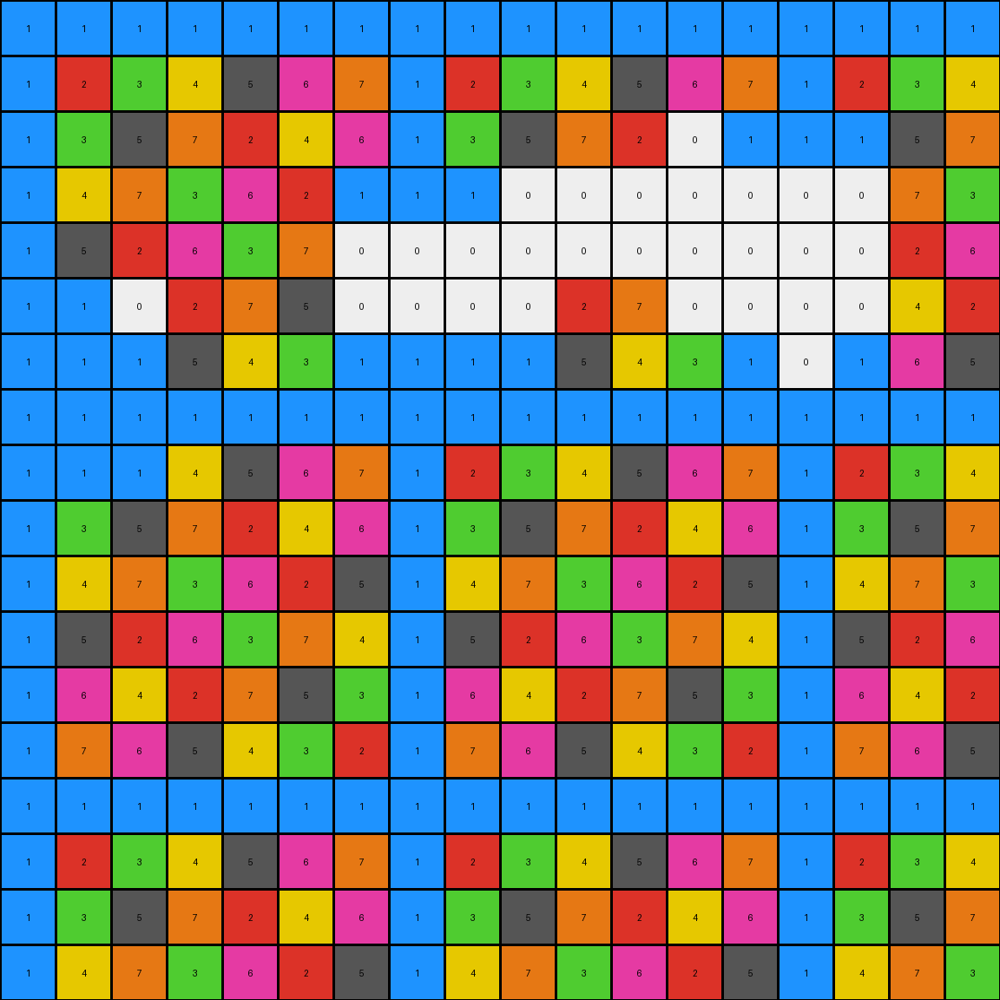
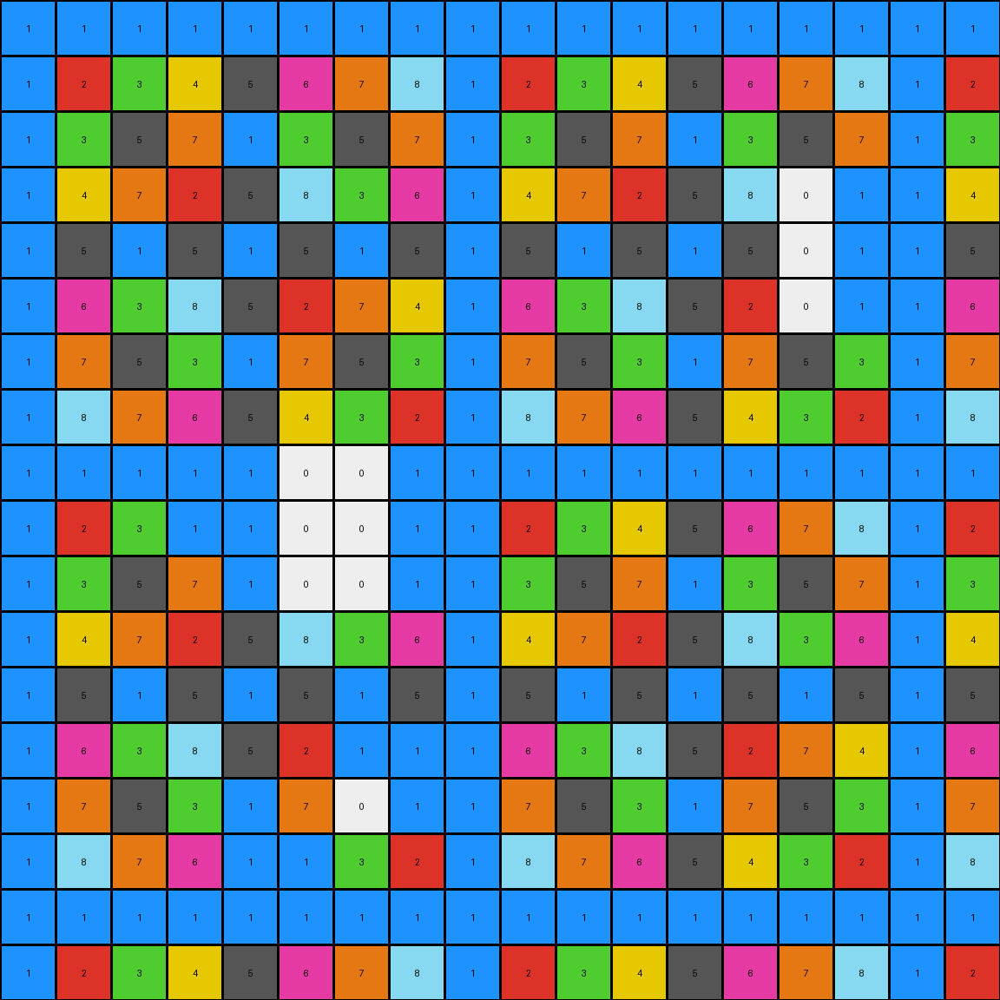

# 29ec7d0e • 006 • refine_coder

---

Previous Code:
```python
"""
The transformation identifies blue (1) regions and extends them by converting adjacent white (0) pixels to blue (1).
Non-white and non-blue pixels are preserved. If two separate blue regions can be connected by setting only
white pixels to blue, then change those white pixels to blue.
"""

import numpy as np
from scipy.ndimage import label, find_objects

def get_neighbors(r, c, rows, cols):
    """
    Returns the valid neighbors of a cell (r, c) in a grid of size (rows, cols).
    """
    neighbors = []
    for i in range(max(0, r - 1), min(rows, r + 2)):
        for j in range(max(0, c - 1), min(cols, c + 2)):
            if (i, j) != (r, c):
                neighbors.append((i, j))
    return neighbors

def transform(input_grid):
    """
    Transforms the input grid according to the described rule.
    """
    output_grid = np.copy(input_grid)
    rows, cols = input_grid.shape

    # 1. Preserve non-white pixels.
    # (This is implicit since we're copying the input_grid and only modifying white pixels)

    # 2. Identify blue regions and extend them.
    for r in range(rows):
        for c in range(cols):
            if input_grid[r, c] == 0:  # Check if it's a white pixel
                neighbors = get_neighbors(r, c, rows, cols)
                for nr, nc in neighbors:
                    if input_grid[nr, nc] == 1:  # If adjacent to blue
                        output_grid[r, c] = 1  # Set to blue
                        break  # Move to the next white pixel
    
    #3. Identify and Connect separate blue regions
    labeled_grid, num_features = label(output_grid == 1)  
    slices = find_objects(labeled_grid)

    for i in range(len(slices)):
        for j in range(i+1, len(slices)):
            if slices[i] is not None and slices[j] is not None:  # if not none
                # Bounding box coordinates
                r1_min, c1_min = slices[i][0].start, slices[i][1].start
                r1_max, c1_max = slices[i][0].stop -1, slices[i][1].stop -1
                r2_min, c2_min = slices[j][0].start, slices[j][1].start
                r2_max, c2_max = slices[j][0].stop -1, slices[j][1].stop -1

                # calculate manhattan distance
                dist_row = abs(r1_max-r2_min) + abs(r1_min - r2_max)
                dist_col = abs(c1_max-c2_min) + abs(c1_min- c2_max)
                dist =  min(dist_col, dist_row)

                if dist < 10: # arbitrary small number to connect
                    # Check for direct horizontal or vertical paths
                    if r1_min <= r2_max and r1_max >= r2_min: # overlap in rows
                        for c in range(min(c1_max,c2_max)+1, max(c1_min, c2_min)):
                            all_white = True
                            for r in range(min(r1_min,r2_min), max(r1_max, r2_max)+1):
                                if output_grid[r,c] != 0 and output_grid[r,c] != 1:
                                    all_white = False
                                    break
                            if all_white:
                                for r in range(min(r1_min,r2_min), max(r1_max, r2_max)+1):
                                     output_grid[r,c] = 1

                    elif c1_min <= c2_max and c1_max >= c2_min: # col overlap
                        for r in range(min(r1_max, r2_max)+1, max(r1_min, r2_min)):
                            all_white = True
                            for c in range(min(c1_min, c2_min), max(c1_max, c2_max)+1):
                                if output_grid[r,c] != 0 and output_grid[r,c] != 1:
                                    all_white = False
                                    break
                            if all_white:
                                for c in range(min(c1_min, c2_min), max(c1_max, c2_max)+1):
                                    output_grid[r,c] = 1


    return output_grid
```

Train Set Results:

## Example 1:

Input:
```
1 1 1 0 0 1 1 1 1 1 1 1 1 1 1 1 1 1
1 2 3 0 0 1 2 3 4 5 1 2 3 4 5 1 2 3
1 3 5 0 0 1 3 5 2 4 0 0 5 2 4 1 3 5
1 4 2 5 3 1 4 2 5 3 0 0 2 5 3 1 4 2
1 5 4 3 2 1 0 0 3 2 1 5 4 3 2 1 5 4
1 1 1 1 1 1 0 0 1 1 1 0 0 0 1 1 1 1
1 2 3 4 5 1 2 3 4 5 1 0 0 0 5 1 2 3
1 3 5 2 4 1 3 5 2 4 1 3 5 2 4 1 3 5
1 4 2 5 3 1 4 2 5 3 1 4 2 5 3 1 4 2
1 5 4 3 2 1 5 4 3 2 1 5 4 3 2 1 5 4
0 0 0 0 1 1 1 1 1 1 1 1 1 1 1 1 1 1
0 0 0 0 5 1 2 3 4 5 1 2 3 4 5 1 2 3
0 0 0 0 4 1 3 5 2 4 1 3 5 2 4 1 3 5
1 4 2 5 3 1 4 2 5 3 1 4 2 5 3 1 4 2
1 5 4 3 2 1 5 4 3 2 1 5 4 3 2 1 5 4
1 1 1 1 1 1 1 1 1 1 1 1 1 1 1 1 1 1
1 2 3 4 5 1 2 3 4 5 1 2 3 4 5 1 2 3
1 3 5 2 4 1 3 5 2 4 1 3 5 2 4 1 3 5
```
Expected Output:
```
1 1 1 1 1 1 1 1 1 1 1 1 1 1 1 1 1 1
1 2 3 4 5 1 2 3 4 5 1 2 3 4 5 1 2 3
1 3 5 2 4 1 3 5 2 4 1 3 5 2 4 1 3 5
1 4 2 5 3 1 4 2 5 3 1 4 2 5 3 1 4 2
1 5 4 3 2 1 5 4 3 2 1 5 4 3 2 1 5 4
1 1 1 1 1 1 1 1 1 1 1 1 1 1 1 1 1 1
1 2 3 4 5 1 2 3 4 5 1 2 3 4 5 1 2 3
1 3 5 2 4 1 3 5 2 4 1 3 5 2 4 1 3 5
1 4 2 5 3 1 4 2 5 3 1 4 2 5 3 1 4 2
1 5 4 3 2 1 5 4 3 2 1 5 4 3 2 1 5 4
1 1 1 1 1 1 1 1 1 1 1 1 1 1 1 1 1 1
1 2 3 4 5 1 2 3 4 5 1 2 3 4 5 1 2 3
1 3 5 2 4 1 3 5 2 4 1 3 5 2 4 1 3 5
1 4 2 5 3 1 4 2 5 3 1 4 2 5 3 1 4 2
1 5 4 3 2 1 5 4 3 2 1 5 4 3 2 1 5 4
1 1 1 1 1 1 1 1 1 1 1 1 1 1 1 1 1 1
1 2 3 4 5 1 2 3 4 5 1 2 3 4 5 1 2 3
1 3 5 2 4 1 3 5 2 4 1 3 5 2 4 1 3 5
```
Transformed Output:
```
1 1 1 1 1 1 1 1 1 1 1 1 1 1 1 1 1 1
1 2 3 1 1 1 2 3 4 5 1 2 3 4 5 1 2 3
1 3 5 0 1 1 3 5 2 4 1 1 5 2 4 1 3 5
1 4 2 5 3 1 4 2 5 3 1 1 2 5 3 1 4 2
1 5 4 3 2 1 1 1 3 2 1 5 4 3 2 1 5 4
1 1 1 1 1 1 1 1 1 1 1 1 0 1 1 1 1 1
1 2 3 4 5 1 2 3 4 5 1 1 0 1 5 1 2 3
1 3 5 2 4 1 3 5 2 4 1 3 5 2 4 1 3 5
1 4 2 5 3 1 4 2 5 3 1 4 2 5 3 1 4 2
1 5 4 3 2 1 5 4 3 2 1 5 4 3 2 1 5 4
1 1 0 1 1 1 1 1 1 1 1 1 1 1 1 1 1 1
0 0 0 1 5 1 2 3 4 5 1 2 3 4 5 1 2 3
1 1 0 0 4 1 3 5 2 4 1 3 5 2 4 1 3 5
1 4 2 5 3 1 4 2 5 3 1 4 2 5 3 1 4 2
1 5 4 3 2 1 5 4 3 2 1 5 4 3 2 1 5 4
1 1 1 1 1 1 1 1 1 1 1 1 1 1 1 1 1 1
1 2 3 4 5 1 2 3 4 5 1 2 3 4 5 1 2 3
1 3 5 2 4 1 3 5 2 4 1 3 5 2 4 1 3 5
```

match: False
pixels_off: 20
size_correct: True
color_palette_correct: False
correct_pixel_counts: False

## Example 2:

Input:
```
1 1 1 1 1 1 1 0 0 0 1 1 1 1 1 1 1 1
1 2 3 4 5 6 1 0 0 0 5 6 1 2 3 4 5 6
1 3 5 1 3 5 1 0 0 0 3 5 1 3 5 1 3 5
1 4 1 4 1 4 1 0 0 0 1 4 1 4 1 4 1 4
1 5 3 1 5 3 1 5 3 1 5 0 0 0 3 1 5 3
1 6 5 0 0 0 0 6 5 4 3 0 0 0 5 4 3 2
1 1 1 0 0 0 0 1 1 1 1 1 1 1 1 1 1 1
1 2 3 0 0 0 0 2 3 4 5 6 1 2 3 4 5 6
1 3 5 1 3 5 1 3 5 1 3 5 1 3 5 1 3 5
1 4 1 4 1 4 1 4 1 4 1 4 1 4 1 4 1 4
1 5 3 1 5 3 1 5 3 1 5 3 1 5 3 1 5 3
1 6 5 4 3 2 1 0 0 0 3 2 0 0 0 0 3 2
1 1 1 1 1 1 1 0 0 0 1 1 0 0 0 0 1 1
1 2 3 4 5 6 1 0 0 0 5 6 0 0 0 0 5 6
1 3 5 1 3 5 1 3 5 1 3 5 1 3 5 1 3 5
1 4 1 4 1 4 1 4 1 4 1 4 1 4 1 4 1 4
1 5 3 1 5 3 1 5 3 1 5 3 1 5 3 1 5 3
1 6 5 4 3 2 1 6 5 4 3 2 1 6 5 4 3 2
```
Expected Output:
```
1 1 1 1 1 1 1 1 1 1 1 1 1 1 1 1 1 1
1 2 3 4 5 6 1 2 3 4 5 6 1 2 3 4 5 6
1 3 5 1 3 5 1 3 5 1 3 5 1 3 5 1 3 5
1 4 1 4 1 4 1 4 1 4 1 4 1 4 1 4 1 4
1 5 3 1 5 3 1 5 3 1 5 3 1 5 3 1 5 3
1 6 5 4 3 2 1 6 5 4 3 2 1 6 5 4 3 2
1 1 1 1 1 1 1 1 1 1 1 1 1 1 1 1 1 1
1 2 3 4 5 6 1 2 3 4 5 6 1 2 3 4 5 6
1 3 5 1 3 5 1 3 5 1 3 5 1 3 5 1 3 5
1 4 1 4 1 4 1 4 1 4 1 4 1 4 1 4 1 4
1 5 3 1 5 3 1 5 3 1 5 3 1 5 3 1 5 3
1 6 5 4 3 2 1 6 5 4 3 2 1 6 5 4 3 2
1 1 1 1 1 1 1 1 1 1 1 1 1 1 1 1 1 1
1 2 3 4 5 6 1 2 3 4 5 6 1 2 3 4 5 6
1 3 5 1 3 5 1 3 5 1 3 5 1 3 5 1 3 5
1 4 1 4 1 4 1 4 1 4 1 4 1 4 1 4 1 4
1 5 3 1 5 3 1 5 3 1 5 3 1 5 3 1 5 3
1 6 5 4 3 2 1 6 5 4 3 2 1 6 5 4 3 2
```
Transformed Output:
```
1 1 1 1 1 1 1 1 0 1 1 1 1 1 1 1 1 1
1 2 3 4 5 6 1 1 0 1 5 6 1 2 3 4 5 6
1 3 5 1 3 5 1 1 1 1 3 5 1 3 5 1 3 5
1 4 1 4 1 4 1 1 1 1 1 4 1 4 1 4 1 4
1 5 3 1 5 3 1 5 3 1 5 1 1 1 3 1 5 3
1 6 5 1 1 1 1 6 5 4 3 1 1 1 5 4 3 2
1 1 1 1 1 0 1 1 1 1 1 1 1 1 1 1 1 1
1 2 3 1 1 1 1 2 3 4 5 6 1 2 3 4 5 6
1 3 5 1 3 5 1 3 5 1 3 5 1 3 5 1 3 5
1 4 1 4 1 4 1 4 1 4 1 4 1 4 1 4 1 4
1 5 3 1 5 3 1 5 3 1 5 3 1 5 3 1 5 3
1 6 5 4 3 2 1 1 1 1 3 2 1 1 1 1 3 2
1 1 1 1 1 1 1 1 1 1 1 1 1 0 1 1 1 1
1 2 3 4 5 6 1 1 1 1 5 6 1 1 1 1 5 6
1 3 5 1 3 5 1 3 5 1 3 5 1 3 5 1 3 5
1 4 1 4 1 4 1 4 1 4 1 4 1 4 1 4 1 4
1 5 3 1 5 3 1 5 3 1 5 3 1 5 3 1 5 3
1 6 5 4 3 2 1 6 5 4 3 2 1 6 5 4 3 2
```

match: False
pixels_off: 32
size_correct: True
color_palette_correct: False
correct_pixel_counts: False

## Example 3:

Input:
```
1 1 1 1 1 1 1 1 1 1 1 1 1 1 1 1 1 1
1 2 3 4 5 6 7 1 2 3 4 5 6 7 1 2 3 4
1 3 5 7 2 4 6 1 3 5 7 2 0 0 0 0 5 7
1 4 7 3 6 2 0 0 0 0 0 0 0 0 0 0 7 3
1 5 2 6 3 7 0 0 0 0 0 0 0 0 0 0 2 6
1 0 0 2 7 5 0 0 0 0 2 7 0 0 0 0 4 2
1 0 0 5 4 3 0 0 0 0 5 4 3 0 0 0 6 5
1 0 0 1 1 1 1 1 1 1 1 1 1 0 0 0 1 1
1 0 0 4 5 6 7 1 2 3 4 5 6 7 1 2 3 4
1 3 5 7 2 4 6 1 3 5 7 2 4 6 1 3 5 7
1 4 7 3 6 2 5 1 4 7 3 6 2 5 1 4 7 3
1 5 2 6 3 7 4 1 5 2 6 3 7 4 1 5 2 6
1 6 4 2 7 5 3 1 6 4 2 7 5 3 1 6 4 2
1 7 6 5 4 3 2 1 7 6 5 4 3 2 1 7 6 5
1 1 1 1 1 1 1 1 1 1 1 1 1 1 1 1 1 1
1 2 3 4 5 6 7 1 2 3 4 5 6 7 1 2 3 4
1 3 5 7 2 4 6 1 3 5 7 2 4 6 1 3 5 7
1 4 7 3 6 2 5 1 4 7 3 6 2 5 1 4 7 3
```
Expected Output:
```
1 1 1 1 1 1 1 1 1 1 1 1 1 1 1 1 1 1
1 2 3 4 5 6 7 1 2 3 4 5 6 7 1 2 3 4
1 3 5 7 2 4 6 1 3 5 7 2 4 6 1 3 5 7
1 4 7 3 6 2 5 1 4 7 3 6 2 5 1 4 7 3
1 5 2 6 3 7 4 1 5 2 6 3 7 4 1 5 2 6
1 6 4 2 7 5 3 1 6 4 2 7 5 3 1 6 4 2
1 7 6 5 4 3 2 1 7 6 5 4 3 2 1 7 6 5
1 1 1 1 1 1 1 1 1 1 1 1 1 1 1 1 1 1
1 2 3 4 5 6 7 1 2 3 4 5 6 7 1 2 3 4
1 3 5 7 2 4 6 1 3 5 7 2 4 6 1 3 5 7
1 4 7 3 6 2 5 1 4 7 3 6 2 5 1 4 7 3
1 5 2 6 3 7 4 1 5 2 6 3 7 4 1 5 2 6
1 6 4 2 7 5 3 1 6 4 2 7 5 3 1 6 4 2
1 7 6 5 4 3 2 1 7 6 5 4 3 2 1 7 6 5
1 1 1 1 1 1 1 1 1 1 1 1 1 1 1 1 1 1
1 2 3 4 5 6 7 1 2 3 4 5 6 7 1 2 3 4
1 3 5 7 2 4 6 1 3 5 7 2 4 6 1 3 5 7
1 4 7 3 6 2 5 1 4 7 3 6 2 5 1 4 7 3
```
Transformed Output:
```
1 1 1 1 1 1 1 1 1 1 1 1 1 1 1 1 1 1
1 2 3 4 5 6 7 1 2 3 4 5 6 7 1 2 3 4
1 3 5 7 2 4 6 1 3 5 7 2 0 1 1 1 5 7
1 4 7 3 6 2 1 1 1 0 0 0 0 0 0 0 7 3
1 5 2 6 3 7 0 0 0 0 0 0 0 0 0 0 2 6
1 1 0 2 7 5 0 0 0 0 2 7 0 0 0 0 4 2
1 1 1 5 4 3 1 1 1 1 5 4 3 1 0 1 6 5
1 1 1 1 1 1 1 1 1 1 1 1 1 1 1 1 1 1
1 1 1 4 5 6 7 1 2 3 4 5 6 7 1 2 3 4
1 3 5 7 2 4 6 1 3 5 7 2 4 6 1 3 5 7
1 4 7 3 6 2 5 1 4 7 3 6 2 5 1 4 7 3
1 5 2 6 3 7 4 1 5 2 6 3 7 4 1 5 2 6
1 6 4 2 7 5 3 1 6 4 2 7 5 3 1 6 4 2
1 7 6 5 4 3 2 1 7 6 5 4 3 2 1 7 6 5
1 1 1 1 1 1 1 1 1 1 1 1 1 1 1 1 1 1
1 2 3 4 5 6 7 1 2 3 4 5 6 7 1 2 3 4
1 3 5 7 2 4 6 1 3 5 7 2 4 6 1 3 5 7
1 4 7 3 6 2 5 1 4 7 3 6 2 5 1 4 7 3
```

match: False
pixels_off: 42
size_correct: True
color_palette_correct: False
correct_pixel_counts: False

## Example 4:

Input:
```
1 1 1 1 1 1 1 1 1 1 1 1 1 1 1 1 1 1
1 2 3 4 5 6 7 8 1 2 3 4 5 6 7 8 1 2
1 3 5 7 1 3 5 7 1 3 5 7 1 3 5 7 1 3
1 4 7 2 5 8 3 6 1 4 7 2 5 8 0 0 1 4
1 5 1 5 1 5 1 5 1 5 1 5 1 5 0 0 1 5
1 6 3 8 5 2 7 4 1 6 3 8 5 2 0 0 1 6
1 7 5 3 1 7 5 3 1 7 5 3 1 7 5 3 1 7
1 8 7 6 5 4 3 2 1 8 7 6 5 4 3 2 1 8
1 1 1 0 0 0 0 0 1 1 1 1 1 1 1 1 1 1
1 2 3 0 0 0 0 0 1 2 3 4 5 6 7 8 1 2
1 3 5 7 0 0 0 0 1 3 5 7 1 3 5 7 1 3
1 4 7 2 5 8 3 6 1 4 7 2 5 8 3 6 1 4
1 5 1 5 1 5 1 5 1 5 1 5 1 5 1 5 1 5
1 6 3 8 5 2 0 0 1 6 3 8 5 2 7 4 1 6
1 7 5 3 1 7 0 0 1 7 5 3 1 7 5 3 1 7
1 8 7 6 0 0 3 2 1 8 7 6 5 4 3 2 1 8
1 1 1 1 0 0 1 1 1 1 1 1 1 1 1 1 1 1
1 2 3 4 5 6 7 8 1 2 3 4 5 6 7 8 1 2
```
Expected Output:
```
1 1 1 1 1 1 1 1 1 1 1 1 1 1 1 1 1 1
1 2 3 4 5 6 7 8 1 2 3 4 5 6 7 8 1 2
1 3 5 7 1 3 5 7 1 3 5 7 1 3 5 7 1 3
1 4 7 2 5 8 3 6 1 4 7 2 5 8 3 6 1 4
1 5 1 5 1 5 1 5 1 5 1 5 1 5 1 5 1 5
1 6 3 8 5 2 7 4 1 6 3 8 5 2 7 4 1 6
1 7 5 3 1 7 5 3 1 7 5 3 1 7 5 3 1 7
1 8 7 6 5 4 3 2 1 8 7 6 5 4 3 2 1 8
1 1 1 1 1 1 1 1 1 1 1 1 1 1 1 1 1 1
1 2 3 4 5 6 7 8 1 2 3 4 5 6 7 8 1 2
1 3 5 7 1 3 5 7 1 3 5 7 1 3 5 7 1 3
1 4 7 2 5 8 3 6 1 4 7 2 5 8 3 6 1 4
1 5 1 5 1 5 1 5 1 5 1 5 1 5 1 5 1 5
1 6 3 8 5 2 7 4 1 6 3 8 5 2 7 4 1 6
1 7 5 3 1 7 5 3 1 7 5 3 1 7 5 3 1 7
1 8 7 6 5 4 3 2 1 8 7 6 5 4 3 2 1 8
1 1 1 1 1 1 1 1 1 1 1 1 1 1 1 1 1 1
1 2 3 4 5 6 7 8 1 2 3 4 5 6 7 8 1 2
```
Transformed Output:
```
1 1 1 1 1 1 1 1 1 1 1 1 1 1 1 1 1 1
1 2 3 4 5 6 7 8 1 2 3 4 5 6 7 8 1 2
1 3 5 7 1 3 5 7 1 3 5 7 1 3 5 7 1 3
1 4 7 2 5 8 3 6 1 4 7 2 5 8 0 1 1 4
1 5 1 5 1 5 1 5 1 5 1 5 1 5 0 1 1 5
1 6 3 8 5 2 7 4 1 6 3 8 5 2 0 1 1 6
1 7 5 3 1 7 5 3 1 7 5 3 1 7 5 3 1 7
1 8 7 6 5 4 3 2 1 8 7 6 5 4 3 2 1 8
1 1 1 1 1 0 0 1 1 1 1 1 1 1 1 1 1 1
1 2 3 1 1 0 0 1 1 2 3 4 5 6 7 8 1 2
1 3 5 7 1 0 0 1 1 3 5 7 1 3 5 7 1 3
1 4 7 2 5 8 3 6 1 4 7 2 5 8 3 6 1 4
1 5 1 5 1 5 1 5 1 5 1 5 1 5 1 5 1 5
1 6 3 8 5 2 1 1 1 6 3 8 5 2 7 4 1 6
1 7 5 3 1 7 0 1 1 7 5 3 1 7 5 3 1 7
1 8 7 6 1 1 3 2 1 8 7 6 5 4 3 2 1 8
1 1 1 1 1 1 1 1 1 1 1 1 1 1 1 1 1 1
1 2 3 4 5 6 7 8 1 2 3 4 5 6 7 8 1 2
```

match: False
pixels_off: 22
size_correct: True
color_palette_correct: False
correct_pixel_counts: False
Okay, let's analyze the results of the provided code and develop an updated natural language program and supporting information.

**General Assessment and Strategy**

The initial natural language program and the generated code were on the right track, focusing on the expansion of blue (1) pixels. However, the code fails to correctly handle several cases, especially regarding when and how far to extend the blue regions, and under what conditions to connect blue regions, leading to many mismatched pixels. The primary issues are:

1.  **Overly Aggressive Initial Expansion**: The initial expansion converts any white pixel adjacent to a blue pixel to blue. This is too broad and doesn't consider the overall structure or intended outcome.
2.  **Inconsistent Region Connection:** The existing region joining algorithm is very limited. It considers the manhattan distance between the bounding boxes and if there is a "white only" gap. This is not sufficient based on these examples.
3. The program doesn't seem to take into account the other numbers, but assumes white should be replaced by blue. In several cases, the white stays as white in the correct answer.

The strategy to resolve these errors involves these key steps:

1.  **Refine Expansion Logic:** Instead of immediately expanding to all adjacent white pixels, we should establish more specific criteria. This will likely involve looking at multiple neighbors or considering the "shape" being formed.
2.  **Improve Region Connection Heuristic:** We should look more deeply into when the regions should connect or not.

**Metrics and Observations**

Here's a summary of each example, including an assessment:

*   **Example 1:** Many pixels incorrectly changed. Blue regions are extended inconsistently, some white stay white and some are changed to blue seemingly without clear rules.
*   **Example 2:** Similar problems to Example 1. Blue regions extend too far in some places and not far enough in others. Some, but not all white are converted to blue.
*   **Example 3:** Again, expansion is inconsistent, converting some white to blue, but not all in a non-systematic fashion.
*   **Example 4:** Shows more errors, indicating the limitations of the neighbor-based expansion and simple connection strategy. Some white should not be converted to blue.

**YAML Block - Facts and Observations**

```yaml
observations:
  - task_id: 004-py_02
  - example_1:
      objects:
        - color: 1  # Blue
          type: region
          initial_state: Scattered regions and lines
          final_state: Expanded and connected into solid blocks, sometimes
          notes: Expands to adjacent white (0) pixels, under specific rules, connecting them.
        - color: 0  # White
          type: background
          initial_state: Background and gaps between blue regions
          final_state: Partially filled by expanding blue regions
          notes: Acts as a connector between blue regions
        - color: 2-9 # Other colors
          type: other
          initial_state: present
          final_state: unchanged
          notes: these pixels never change

      actions:
        - name: expand_blue
          description: Blue regions grow by converting adjacent white pixels.
          conditions: |
            White pixels are converted to blue if they are adjacent to existing blue pixels,
             *and* if they connect two blue regions *and* all changed pixels are either blue or
            white. Other non-blue pixels are unchanged.
          constraints: |
            Expansion and connection occur until distinct blue regions form larger, connected shapes.
            Expansion does not extend beyond filling gaps to join other regions.
  - example_2:
      objects:
        - color: 1  # Blue
          type: region
          initial_state: Scattered regions and lines
          final_state: Expanded regions but not connected, sometimes
        - color: 0  # White
          type: background
          initial_state: Background and gaps between blue regions
          final_state: Partially filled by expanding blue regions, sometimes.
        - color: 2-9
          type: other
          initial_state: present
          final_state: unchanged

      actions:
        - name: expand_blue
          description: Blue regions grow, but not as aggressively as example 1.

  - example_3:
       objects:
        - color: 1  # Blue
          type: region
          initial_state: Scattered regions and lines
          final_state: Expanded regions but not connected, sometimes
        - color: 0  # White
          type: background
          initial_state: Background and gaps between blue regions
          final_state: Partially filled by expanding blue regions, sometimes.
        - color: 2-9
          type: other
          initial_state: present
          final_state: unchanged

       actions:
        - name: expand_blue
          description: Blue regions grow, but not as aggressively as example 1.

  - example_4:
       objects:
        - color: 1  # Blue
          type: region
          initial_state: Scattered regions and lines
          final_state: Expanded regions but not connected, sometimes
        - color: 0  # White
          type: background
          initial_state: Background and gaps between blue regions
          final_state: Partially filled by expanding blue regions, sometimes.
        - color: 2-9
          type: other
          initial_state: present
          final_state: unchanged

       actions:
        - name: expand_blue
          description: Blue regions grow, but not as aggressively as example 1.

```

**Natural Language Program**

1.  **Preserve Non-Blue and Non-White Pixels**: Pixels that are not blue (1) or white (0) in the input grid remain unchanged in the output grid.

2.  **Conditional Blue Expansion:**
    - Identify all blue (1) pixels
    - Identify all white pixels (0)
    - Iterate through each white pixel. If a white pixel is adjacent to a blue region and changing that pixel from white to blue creates a connection between separate blue regions, *and* it does not change any non-white, non-blue, pixels then change that white pixel to blue.

3.  **Iterative Application:** Repeat Step 2. Blue regions can grow.

In short: The program identifies blue regions and selectively fills in white pixels between blue regions, only if the white pixel is connecting two blue regions. Other colored pixels are left untouched.

**INSTRUCTIONS**

- generate a Python module to represent the natural language program 
- follow the template below
- all common math and science libraries are available
- create docstring only at top - but comment the workflow in the function
- use helper functions for common operations like finding objects, counting,
  measuring, moving, etc. 

remember - we are working iteratively - so this code will inform your future
self as we converge on the solution

*template:*

```python
"""
{{ natural language description of the transformation rule }}
"""

{{ imports }}

def transform(input_grid):
    # initialize output_grid

    # change output pixels 

    return output_grid

```
