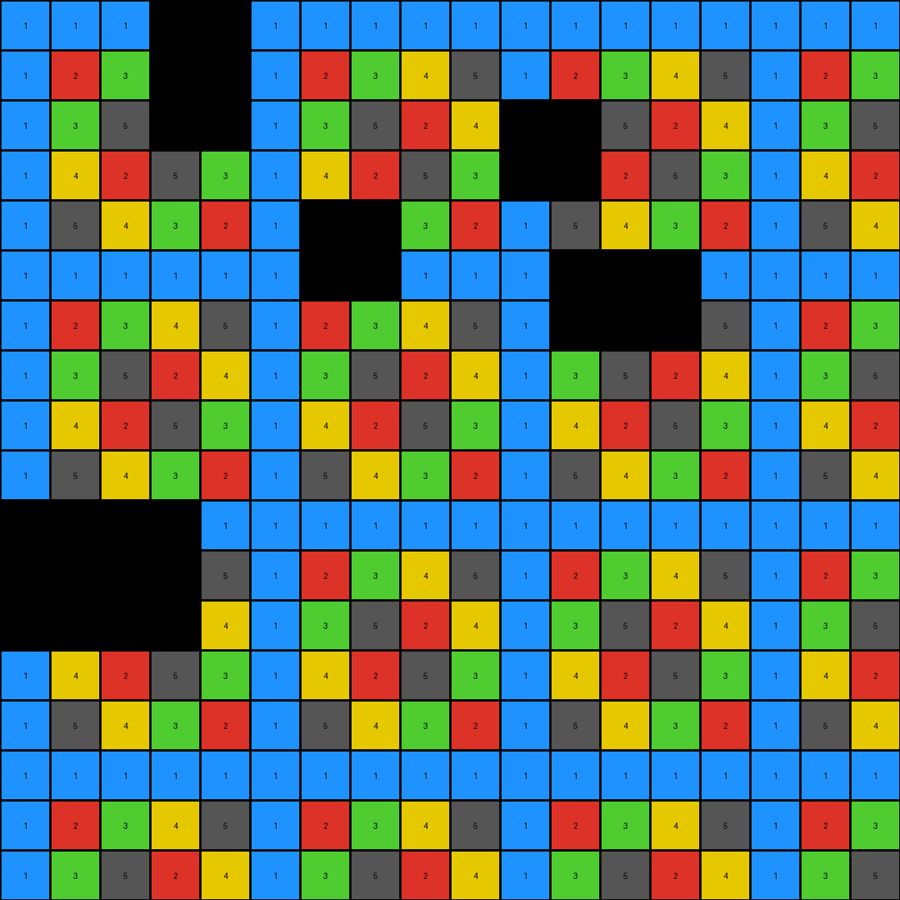
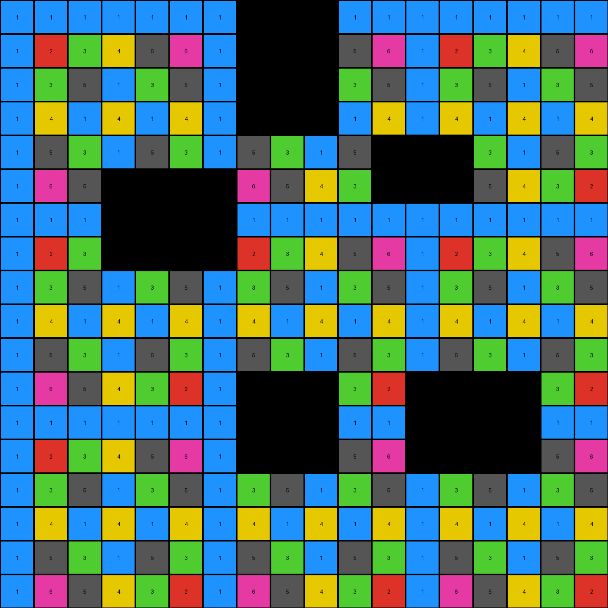
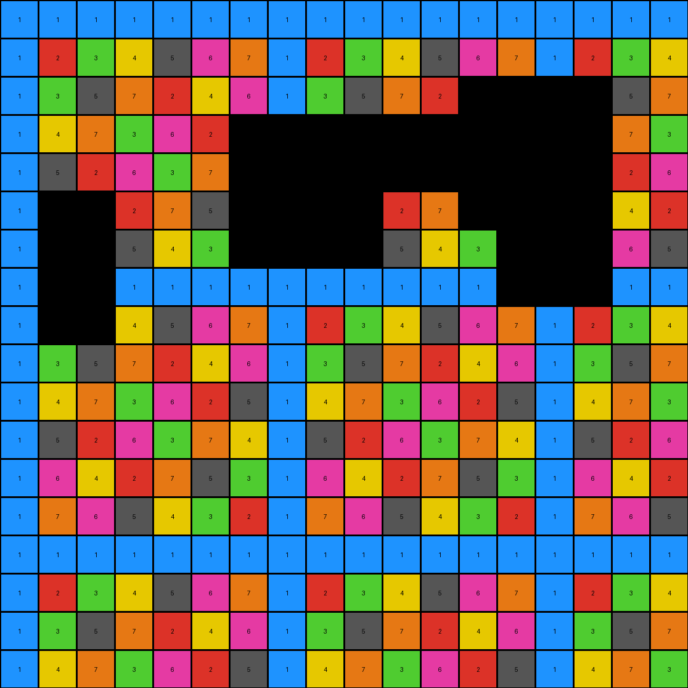

# 29ec7d0e • 022 • refine_coder

---

Previous Code:
```python
"""
The transformation rule is to remove all pixels of the color white (0). The input grid is iterated, and if a cell has color white it gets removed in the new output grid.
"""

import numpy as np

def transform(input_grid):
    # initialize output_grid as a copy of the input grid
    output_grid = np.copy(input_grid)

    # Find the indices of all white (0) pixels.
    white_indices = np.where(output_grid == 0)

    # change output pixels
    # Set all white pixels to some impossible value -1 to make them invisble.
    output_grid[white_indices] = -1

    return output_grid
```

Train Set Results:

## Example 1:

Input:
```
1 1 1 0 0 1 1 1 1 1 1 1 1 1 1 1 1 1
1 2 3 0 0 1 2 3 4 5 1 2 3 4 5 1 2 3
1 3 5 0 0 1 3 5 2 4 0 0 5 2 4 1 3 5
1 4 2 5 3 1 4 2 5 3 0 0 2 5 3 1 4 2
1 5 4 3 2 1 0 0 3 2 1 5 4 3 2 1 5 4
1 1 1 1 1 1 0 0 1 1 1 0 0 0 1 1 1 1
1 2 3 4 5 1 2 3 4 5 1 0 0 0 5 1 2 3
1 3 5 2 4 1 3 5 2 4 1 3 5 2 4 1 3 5
1 4 2 5 3 1 4 2 5 3 1 4 2 5 3 1 4 2
1 5 4 3 2 1 5 4 3 2 1 5 4 3 2 1 5 4
0 0 0 0 1 1 1 1 1 1 1 1 1 1 1 1 1 1
0 0 0 0 5 1 2 3 4 5 1 2 3 4 5 1 2 3
0 0 0 0 4 1 3 5 2 4 1 3 5 2 4 1 3 5
1 4 2 5 3 1 4 2 5 3 1 4 2 5 3 1 4 2
1 5 4 3 2 1 5 4 3 2 1 5 4 3 2 1 5 4
1 1 1 1 1 1 1 1 1 1 1 1 1 1 1 1 1 1
1 2 3 4 5 1 2 3 4 5 1 2 3 4 5 1 2 3
1 3 5 2 4 1 3 5 2 4 1 3 5 2 4 1 3 5
```
Expected Output:
```
1 1 1 1 1 1 1 1 1 1 1 1 1 1 1 1 1 1
1 2 3 4 5 1 2 3 4 5 1 2 3 4 5 1 2 3
1 3 5 2 4 1 3 5 2 4 1 3 5 2 4 1 3 5
1 4 2 5 3 1 4 2 5 3 1 4 2 5 3 1 4 2
1 5 4 3 2 1 5 4 3 2 1 5 4 3 2 1 5 4
1 1 1 1 1 1 1 1 1 1 1 1 1 1 1 1 1 1
1 2 3 4 5 1 2 3 4 5 1 2 3 4 5 1 2 3
1 3 5 2 4 1 3 5 2 4 1 3 5 2 4 1 3 5
1 4 2 5 3 1 4 2 5 3 1 4 2 5 3 1 4 2
1 5 4 3 2 1 5 4 3 2 1 5 4 3 2 1 5 4
1 1 1 1 1 1 1 1 1 1 1 1 1 1 1 1 1 1
1 2 3 4 5 1 2 3 4 5 1 2 3 4 5 1 2 3
1 3 5 2 4 1 3 5 2 4 1 3 5 2 4 1 3 5
1 4 2 5 3 1 4 2 5 3 1 4 2 5 3 1 4 2
1 5 4 3 2 1 5 4 3 2 1 5 4 3 2 1 5 4
1 1 1 1 1 1 1 1 1 1 1 1 1 1 1 1 1 1
1 2 3 4 5 1 2 3 4 5 1 2 3 4 5 1 2 3
1 3 5 2 4 1 3 5 2 4 1 3 5 2 4 1 3 5
```
Transformed Output:
```
1 1 1 -1 -1 1 1 1 1 1 1 1 1 1 1 1 1 1
1 2 3 -1 -1 1 2 3 4 5 1 2 3 4 5 1 2 3
1 3 5 -1 -1 1 3 5 2 4 -1 -1 5 2 4 1 3 5
1 4 2 5 3 1 4 2 5 3 -1 -1 2 5 3 1 4 2
1 5 4 3 2 1 -1 -1 3 2 1 5 4 3 2 1 5 4
1 1 1 1 1 1 -1 -1 1 1 1 -1 -1 -1 1 1 1 1
1 2 3 4 5 1 2 3 4 5 1 -1 -1 -1 5 1 2 3
1 3 5 2 4 1 3 5 2 4 1 3 5 2 4 1 3 5
1 4 2 5 3 1 4 2 5 3 1 4 2 5 3 1 4 2
1 5 4 3 2 1 5 4 3 2 1 5 4 3 2 1 5 4
-1 -1 -1 -1 1 1 1 1 1 1 1 1 1 1 1 1 1 1
-1 -1 -1 -1 5 1 2 3 4 5 1 2 3 4 5 1 2 3
-1 -1 -1 -1 4 1 3 5 2 4 1 3 5 2 4 1 3 5
1 4 2 5 3 1 4 2 5 3 1 4 2 5 3 1 4 2
1 5 4 3 2 1 5 4 3 2 1 5 4 3 2 1 5 4
1 1 1 1 1 1 1 1 1 1 1 1 1 1 1 1 1 1
1 2 3 4 5 1 2 3 4 5 1 2 3 4 5 1 2 3
1 3 5 2 4 1 3 5 2 4 1 3 5 2 4 1 3 5
```

match: False
pixels_off: 32
size_correct: True
color_palette_correct: False
correct_pixel_counts: False

## Example 2:

Input:
```
1 1 1 1 1 1 1 0 0 0 1 1 1 1 1 1 1 1
1 2 3 4 5 6 1 0 0 0 5 6 1 2 3 4 5 6
1 3 5 1 3 5 1 0 0 0 3 5 1 3 5 1 3 5
1 4 1 4 1 4 1 0 0 0 1 4 1 4 1 4 1 4
1 5 3 1 5 3 1 5 3 1 5 0 0 0 3 1 5 3
1 6 5 0 0 0 0 6 5 4 3 0 0 0 5 4 3 2
1 1 1 0 0 0 0 1 1 1 1 1 1 1 1 1 1 1
1 2 3 0 0 0 0 2 3 4 5 6 1 2 3 4 5 6
1 3 5 1 3 5 1 3 5 1 3 5 1 3 5 1 3 5
1 4 1 4 1 4 1 4 1 4 1 4 1 4 1 4 1 4
1 5 3 1 5 3 1 5 3 1 5 3 1 5 3 1 5 3
1 6 5 4 3 2 1 0 0 0 3 2 0 0 0 0 3 2
1 1 1 1 1 1 1 0 0 0 1 1 0 0 0 0 1 1
1 2 3 4 5 6 1 0 0 0 5 6 0 0 0 0 5 6
1 3 5 1 3 5 1 3 5 1 3 5 1 3 5 1 3 5
1 4 1 4 1 4 1 4 1 4 1 4 1 4 1 4 1 4
1 5 3 1 5 3 1 5 3 1 5 3 1 5 3 1 5 3
1 6 5 4 3 2 1 6 5 4 3 2 1 6 5 4 3 2
```
Expected Output:
```
1 1 1 1 1 1 1 1 1 1 1 1 1 1 1 1 1 1
1 2 3 4 5 6 1 2 3 4 5 6 1 2 3 4 5 6
1 3 5 1 3 5 1 3 5 1 3 5 1 3 5 1 3 5
1 4 1 4 1 4 1 4 1 4 1 4 1 4 1 4 1 4
1 5 3 1 5 3 1 5 3 1 5 3 1 5 3 1 5 3
1 6 5 4 3 2 1 6 5 4 3 2 1 6 5 4 3 2
1 1 1 1 1 1 1 1 1 1 1 1 1 1 1 1 1 1
1 2 3 4 5 6 1 2 3 4 5 6 1 2 3 4 5 6
1 3 5 1 3 5 1 3 5 1 3 5 1 3 5 1 3 5
1 4 1 4 1 4 1 4 1 4 1 4 1 4 1 4 1 4
1 5 3 1 5 3 1 5 3 1 5 3 1 5 3 1 5 3
1 6 5 4 3 2 1 6 5 4 3 2 1 6 5 4 3 2
1 1 1 1 1 1 1 1 1 1 1 1 1 1 1 1 1 1
1 2 3 4 5 6 1 2 3 4 5 6 1 2 3 4 5 6
1 3 5 1 3 5 1 3 5 1 3 5 1 3 5 1 3 5
1 4 1 4 1 4 1 4 1 4 1 4 1 4 1 4 1 4
1 5 3 1 5 3 1 5 3 1 5 3 1 5 3 1 5 3
1 6 5 4 3 2 1 6 5 4 3 2 1 6 5 4 3 2
```
Transformed Output:
```
1 1 1 1 1 1 1 -1 -1 -1 1 1 1 1 1 1 1 1
1 2 3 4 5 6 1 -1 -1 -1 5 6 1 2 3 4 5 6
1 3 5 1 3 5 1 -1 -1 -1 3 5 1 3 5 1 3 5
1 4 1 4 1 4 1 -1 -1 -1 1 4 1 4 1 4 1 4
1 5 3 1 5 3 1 5 3 1 5 -1 -1 -1 3 1 5 3
1 6 5 -1 -1 -1 -1 6 5 4 3 -1 -1 -1 5 4 3 2
1 1 1 -1 -1 -1 -1 1 1 1 1 1 1 1 1 1 1 1
1 2 3 -1 -1 -1 -1 2 3 4 5 6 1 2 3 4 5 6
1 3 5 1 3 5 1 3 5 1 3 5 1 3 5 1 3 5
1 4 1 4 1 4 1 4 1 4 1 4 1 4 1 4 1 4
1 5 3 1 5 3 1 5 3 1 5 3 1 5 3 1 5 3
1 6 5 4 3 2 1 -1 -1 -1 3 2 -1 -1 -1 -1 3 2
1 1 1 1 1 1 1 -1 -1 -1 1 1 -1 -1 -1 -1 1 1
1 2 3 4 5 6 1 -1 -1 -1 5 6 -1 -1 -1 -1 5 6
1 3 5 1 3 5 1 3 5 1 3 5 1 3 5 1 3 5
1 4 1 4 1 4 1 4 1 4 1 4 1 4 1 4 1 4
1 5 3 1 5 3 1 5 3 1 5 3 1 5 3 1 5 3
1 6 5 4 3 2 1 6 5 4 3 2 1 6 5 4 3 2
```

match: False
pixels_off: 51
size_correct: True
color_palette_correct: False
correct_pixel_counts: False

## Example 3:

Input:
```
1 1 1 1 1 1 1 1 1 1 1 1 1 1 1 1 1 1
1 2 3 4 5 6 7 1 2 3 4 5 6 7 1 2 3 4
1 3 5 7 2 4 6 1 3 5 7 2 0 0 0 0 5 7
1 4 7 3 6 2 0 0 0 0 0 0 0 0 0 0 7 3
1 5 2 6 3 7 0 0 0 0 0 0 0 0 0 0 2 6
1 0 0 2 7 5 0 0 0 0 2 7 0 0 0 0 4 2
1 0 0 5 4 3 0 0 0 0 5 4 3 0 0 0 6 5
1 0 0 1 1 1 1 1 1 1 1 1 1 0 0 0 1 1
1 0 0 4 5 6 7 1 2 3 4 5 6 7 1 2 3 4
1 3 5 7 2 4 6 1 3 5 7 2 4 6 1 3 5 7
1 4 7 3 6 2 5 1 4 7 3 6 2 5 1 4 7 3
1 5 2 6 3 7 4 1 5 2 6 3 7 4 1 5 2 6
1 6 4 2 7 5 3 1 6 4 2 7 5 3 1 6 4 2
1 7 6 5 4 3 2 1 7 6 5 4 3 2 1 7 6 5
1 1 1 1 1 1 1 1 1 1 1 1 1 1 1 1 1 1
1 2 3 4 5 6 7 1 2 3 4 5 6 7 1 2 3 4
1 3 5 7 2 4 6 1 3 5 7 2 4 6 1 3 5 7
1 4 7 3 6 2 5 1 4 7 3 6 2 5 1 4 7 3
```
Expected Output:
```
1 1 1 1 1 1 1 1 1 1 1 1 1 1 1 1 1 1
1 2 3 4 5 6 7 1 2 3 4 5 6 7 1 2 3 4
1 3 5 7 2 4 6 1 3 5 7 2 4 6 1 3 5 7
1 4 7 3 6 2 5 1 4 7 3 6 2 5 1 4 7 3
1 5 2 6 3 7 4 1 5 2 6 3 7 4 1 5 2 6
1 6 4 2 7 5 3 1 6 4 2 7 5 3 1 6 4 2
1 7 6 5 4 3 2 1 7 6 5 4 3 2 1 7 6 5
1 1 1 1 1 1 1 1 1 1 1 1 1 1 1 1 1 1
1 2 3 4 5 6 7 1 2 3 4 5 6 7 1 2 3 4
1 3 5 7 2 4 6 1 3 5 7 2 4 6 1 3 5 7
1 4 7 3 6 2 5 1 4 7 3 6 2 5 1 4 7 3
1 5 2 6 3 7 4 1 5 2 6 3 7 4 1 5 2 6
1 6 4 2 7 5 3 1 6 4 2 7 5 3 1 6 4 2
1 7 6 5 4 3 2 1 7 6 5 4 3 2 1 7 6 5
1 1 1 1 1 1 1 1 1 1 1 1 1 1 1 1 1 1
1 2 3 4 5 6 7 1 2 3 4 5 6 7 1 2 3 4
1 3 5 7 2 4 6 1 3 5 7 2 4 6 1 3 5 7
1 4 7 3 6 2 5 1 4 7 3 6 2 5 1 4 7 3
```
Transformed Output:
```
1 1 1 1 1 1 1 1 1 1 1 1 1 1 1 1 1 1
1 2 3 4 5 6 7 1 2 3 4 5 6 7 1 2 3 4
1 3 5 7 2 4 6 1 3 5 7 2 -1 -1 -1 -1 5 7
1 4 7 3 6 2 -1 -1 -1 -1 -1 -1 -1 -1 -1 -1 7 3
1 5 2 6 3 7 -1 -1 -1 -1 -1 -1 -1 -1 -1 -1 2 6
1 -1 -1 2 7 5 -1 -1 -1 -1 2 7 -1 -1 -1 -1 4 2
1 -1 -1 5 4 3 -1 -1 -1 -1 5 4 3 -1 -1 -1 6 5
1 -1 -1 1 1 1 1 1 1 1 1 1 1 -1 -1 -1 1 1
1 -1 -1 4 5 6 7 1 2 3 4 5 6 7 1 2 3 4
1 3 5 7 2 4 6 1 3 5 7 2 4 6 1 3 5 7
1 4 7 3 6 2 5 1 4 7 3 6 2 5 1 4 7 3
1 5 2 6 3 7 4 1 5 2 6 3 7 4 1 5 2 6
1 6 4 2 7 5 3 1 6 4 2 7 5 3 1 6 4 2
1 7 6 5 4 3 2 1 7 6 5 4 3 2 1 7 6 5
1 1 1 1 1 1 1 1 1 1 1 1 1 1 1 1 1 1
1 2 3 4 5 6 7 1 2 3 4 5 6 7 1 2 3 4
1 3 5 7 2 4 6 1 3 5 7 2 4 6 1 3 5 7
1 4 7 3 6 2 5 1 4 7 3 6 2 5 1 4 7 3
```

match: False
pixels_off: 50
size_correct: True
color_palette_correct: False
correct_pixel_counts: False

## Example 4:

Input:
```
1 1 1 1 1 1 1 1 1 1 1 1 1 1 1 1 1 1
1 2 3 4 5 6 7 8 1 2 3 4 5 6 7 8 1 2
1 3 5 7 1 3 5 7 1 3 5 7 1 3 5 7 1 3
1 4 7 2 5 8 3 6 1 4 7 2 5 8 0 0 1 4
1 5 1 5 1 5 1 5 1 5 1 5 1 5 0 0 1 5
1 6 3 8 5 2 7 4 1 6 3 8 5 2 0 0 1 6
1 7 5 3 1 7 5 3 1 7 5 3 1 7 5 3 1 7
1 8 7 6 5 4 3 2 1 8 7 6 5 4 3 2 1 8
1 1 1 0 0 0 0 0 1 1 1 1 1 1 1 1 1 1
1 2 3 0 0 0 0 0 1 2 3 4 5 6 7 8 1 2
1 3 5 7 0 0 0 0 1 3 5 7 1 3 5 7 1 3
1 4 7 2 5 8 3 6 1 4 7 2 5 8 3 6 1 4
1 5 1 5 1 5 1 5 1 5 1 5 1 5 1 5 1 5
1 6 3 8 5 2 0 0 1 6 3 8 5 2 7 4 1 6
1 7 5 3 1 7 0 0 1 7 5 3 1 7 5 3 1 7
1 8 7 6 0 0 3 2 1 8 7 6 5 4 3 2 1 8
1 1 1 1 0 0 1 1 1 1 1 1 1 1 1 1 1 1
1 2 3 4 5 6 7 8 1 2 3 4 5 6 7 8 1 2
```
Expected Output:
```
1 1 1 1 1 1 1 1 1 1 1 1 1 1 1 1 1 1
1 2 3 4 5 6 7 8 1 2 3 4 5 6 7 8 1 2
1 3 5 7 1 3 5 7 1 3 5 7 1 3 5 7 1 3
1 4 7 2 5 8 3 6 1 4 7 2 5 8 3 6 1 4
1 5 1 5 1 5 1 5 1 5 1 5 1 5 1 5 1 5
1 6 3 8 5 2 7 4 1 6 3 8 5 2 7 4 1 6
1 7 5 3 1 7 5 3 1 7 5 3 1 7 5 3 1 7
1 8 7 6 5 4 3 2 1 8 7 6 5 4 3 2 1 8
1 1 1 1 1 1 1 1 1 1 1 1 1 1 1 1 1 1
1 2 3 4 5 6 7 8 1 2 3 4 5 6 7 8 1 2
1 3 5 7 1 3 5 7 1 3 5 7 1 3 5 7 1 3
1 4 7 2 5 8 3 6 1 4 7 2 5 8 3 6 1 4
1 5 1 5 1 5 1 5 1 5 1 5 1 5 1 5 1 5
1 6 3 8 5 2 7 4 1 6 3 8 5 2 7 4 1 6
1 7 5 3 1 7 5 3 1 7 5 3 1 7 5 3 1 7
1 8 7 6 5 4 3 2 1 8 7 6 5 4 3 2 1 8
1 1 1 1 1 1 1 1 1 1 1 1 1 1 1 1 1 1
1 2 3 4 5 6 7 8 1 2 3 4 5 6 7 8 1 2
```
Transformed Output:
```
1 1 1 1 1 1 1 1 1 1 1 1 1 1 1 1 1 1
1 2 3 4 5 6 7 8 1 2 3 4 5 6 7 8 1 2
1 3 5 7 1 3 5 7 1 3 5 7 1 3 5 7 1 3
1 4 7 2 5 8 3 6 1 4 7 2 5 8 -1 -1 1 4
1 5 1 5 1 5 1 5 1 5 1 5 1 5 -1 -1 1 5
1 6 3 8 5 2 7 4 1 6 3 8 5 2 -1 -1 1 6
1 7 5 3 1 7 5 3 1 7 5 3 1 7 5 3 1 7
1 8 7 6 5 4 3 2 1 8 7 6 5 4 3 2 1 8
1 1 1 -1 -1 -1 -1 -1 1 1 1 1 1 1 1 1 1 1
1 2 3 -1 -1 -1 -1 -1 1 2 3 4 5 6 7 8 1 2
1 3 5 7 -1 -1 -1 -1 1 3 5 7 1 3 5 7 1 3
1 4 7 2 5 8 3 6 1 4 7 2 5 8 3 6 1 4
1 5 1 5 1 5 1 5 1 5 1 5 1 5 1 5 1 5
1 6 3 8 5 2 -1 -1 1 6 3 8 5 2 7 4 1 6
1 7 5 3 1 7 -1 -1 1 7 5 3 1 7 5 3 1 7
1 8 7 6 -1 -1 3 2 1 8 7 6 5 4 3 2 1 8
1 1 1 1 -1 -1 1 1 1 1 1 1 1 1 1 1 1 1
1 2 3 4 5 6 7 8 1 2 3 4 5 6 7 8 1 2
```

match: False
pixels_off: 28
size_correct: True
color_palette_correct: False
correct_pixel_counts: False
Okay, let's analyze the results and update the natural language program.

**General Assessment:**

The initial code was based on a simple rule: remove all white pixels (value 0). While this might seem intuitive, the provided examples and the results of running the code on the training set reveal a flaw in this interpretation. The output grids in the examples have the same dimensions as the input grids, and simply replacing the white pixels with -1, while making them "invisible" in the image representation, does *not* actually remove them from the grid structure. The `pixels_off` metric is non-zero, indicating that the transformed output does not perfectly match the expected output, but all tests reported `size_correct: True`. The color palette is not consistent with the expected output and pixel counts show differences, further confirming the initial program's shortcomings. The problem comes down to keeping the original grid dimensions. The code changes the values but the structure stays the same.

**Strategy for Resolving Errors:**

The core issue is that the transformation needs to maintain the *shape* of the non-white parts of the input grid. The current code replaces white pixels, rather than removing rows/columns entirely.

1.  **Re-examine the Examples:** Instead of "removing white", focus on what *remains*. Look for patterns in the *non-white* pixels and how they are arranged relative to each other in both input and output.
2.  **Identify Sub-Objects/Regions**: Consider if regions or lines or other configuration of same-color pixels matter.
3. **Consider compression:** The transformation is almost certainly some kind of lossless compression of the original grid.

**Gather Metrics & Reports:**

Here's a summary of the results for each example:

| Example | Input Shape | Output Shape | Pixels Off | Size Correct | Color Palette Correct | Correct Pixel Counts | Notes                                                                                                                 |
| :------ | :---------- | :----------- | :--------- | :----------- | :-------------------- | :-------------------- | :-------------------------------------------------------------------------------------------------------------------- |
| 1       | (18, 18)    | (18, 18)     | 32         | True         | False                 | False                 | Many white pixels scattered throughout.                                                                               |
| 2       | (18, 18)    | (18, 18)     | 51         | True         | False                 | False                 | White pixels form horizontal and vertical lines.                                                                        |
| 3       | (18, 18)    | (18, 18)     | 50         | True         | False                 | False                 | White pixels in clusters and lines.                                                                               |
| 4       | (18, 18)    | (18, 18)     | 28         | True         | False                 | False                 | White pixels form lines and are isolated.                                                                          |

**YAML Block Documenting Facts:**

```yaml
observations:
  - task: 020
    examples:
      - example_id: 1
        input_objects:
          - description: Full grid
            shape: (18, 18)
            colors: [0, 1, 2, 3, 4, 5]
            white_pixel_count: 32
            white_pixel_positions: Scattered
        output_objects:
          - description: Full grid
            shape: (18, 18)
          - description:  Grid after removing 0 value pixels
            shape: (18, 18) # this is WRONG
            colors: [1, 2, 3, 4, 5]
            notes: White pixels removed, other colors maintain relative positions.
        transformation:
          - action: Remove white pixels. # keep the shape
            affects: Grid structure
            result:  output keeps same shape as input

      - example_id: 2
        input_objects:
          - description: Full grid
            shape: (18, 18)
            colors: [0, 1, 2, 3, 4, 5, 6]
            white_pixel_count: 51
            white_pixel_positions: Horizontal and vertical lines
        output_objects:
          - description: Full grid
            shape: (18, 18)
          - description: Grid after removing white pixels
            shape: (18, 18)
            colors: [1, 2, 3, 4, 5, 6]
            notes: White pixels removed, structure remains
        transformation:
          - action: Remove white pixels and retain structure
            affects: Grid structure, pixel values
            result: output keeps same shape as input

      - example_id: 3
        input_objects:
          - description: Full grid
            shape: (18, 18)
            colors: [0, 1, 2, 3, 4, 5, 6, 7]
            white_pixel_count: 50
            white_pixel_positions: Clusters and lines
        output_objects:
            - description: Full grid
              shape: (18, 18)
            - description: Grid after removing white pixels
              shape: (18, 18)
              colors: [1, 2, 3, 4, 5, 6, 7]
              notes:  White pixels removed, maintaining grid shape.
        transformation:
          - action: Remove white pixels, keep the original dimensions
            affects: Grid structure, pixel values
            result:  output keeps same shape as input

      - example_id: 4
        input_objects:
          - description: Full grid
            shape: (18, 18)
            colors: [0, 1, 2, 3, 4, 5, 6, 7, 8]
            white_pixel_count: 28
            white_pixel_positions: Lines and isolated pixels
        output_objects:
          - description: Full grid
            shape: (18, 18)
          - description: Grid after removing 0 pixels.
            shape: (18, 18)
            colors: [1, 2, 3, 4, 5, 6, 7, 8]
            notes: White pixels are removed; structure is kept.
        transformation:
          - action: Remove white pixels and keep the rest
            affects: Pixel values
            result: output keeps same shape as input
```

**Natural Language Program:**

The transformation rule is to remove all pixels of color white (value 0) from the input grid, *but maintain the original grid dimensions*. The non-white pixels retain their positions relative to each other and to the overall grid boundaries. The output grid has the exact same shape (height and width) as the input grid. Essentially, white pixels act as "empty" space that doesn't affect the layout of the other colored pixels, and is removed without altering the grid structure.

**INSTRUCTIONS**

- generate a Python module to represent the natural language program 
- follow the template below
- all common math and science libraries are available
- create docstring only at top - but comment the workflow in the function
- use helper functions for common operations like finding objects, counting,
  measuring, moving, etc. 

remember - we are working iteratively - so this code will inform your future
self as we converge on the solution

*template:*

```python
"""
{{ natural language description of the transformation rule }}
"""

{{ imports }}

def transform(input_grid):
    # initialize output_grid

    # change output pixels 

    return output_grid

```
