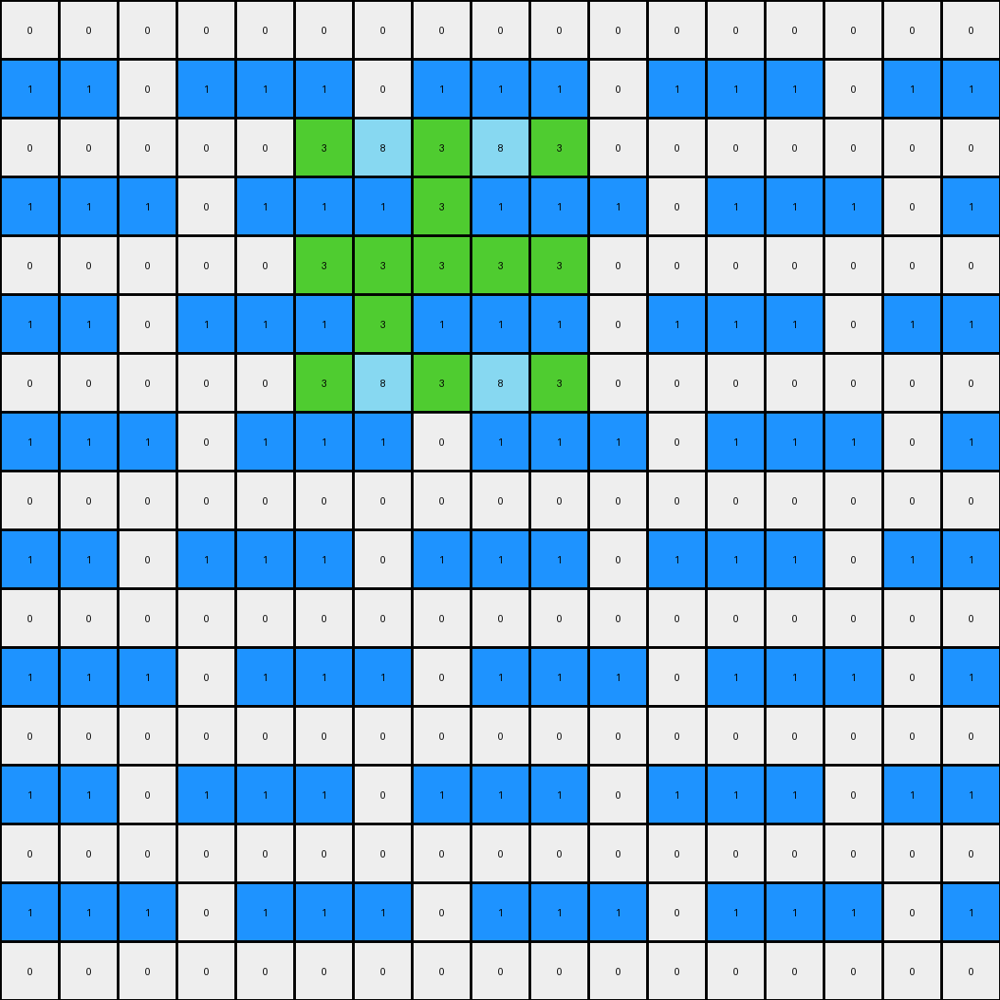
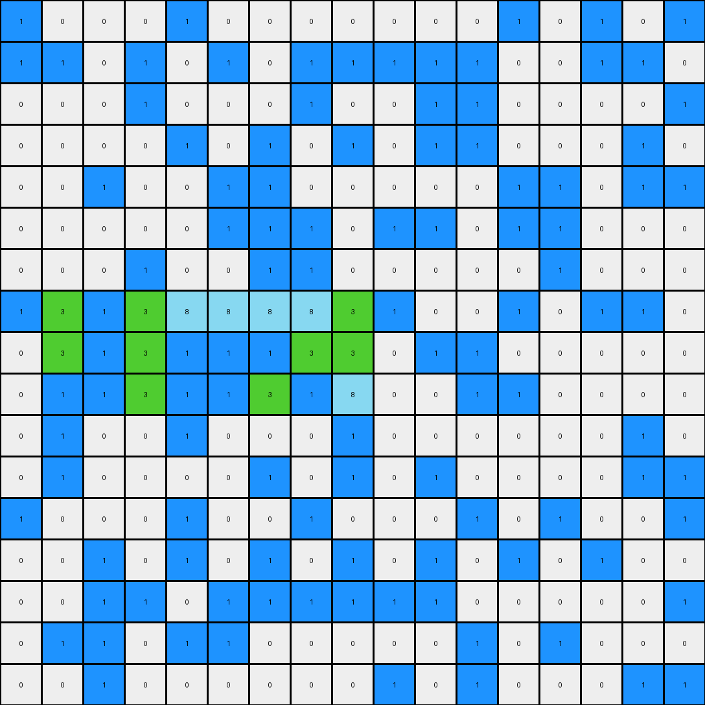
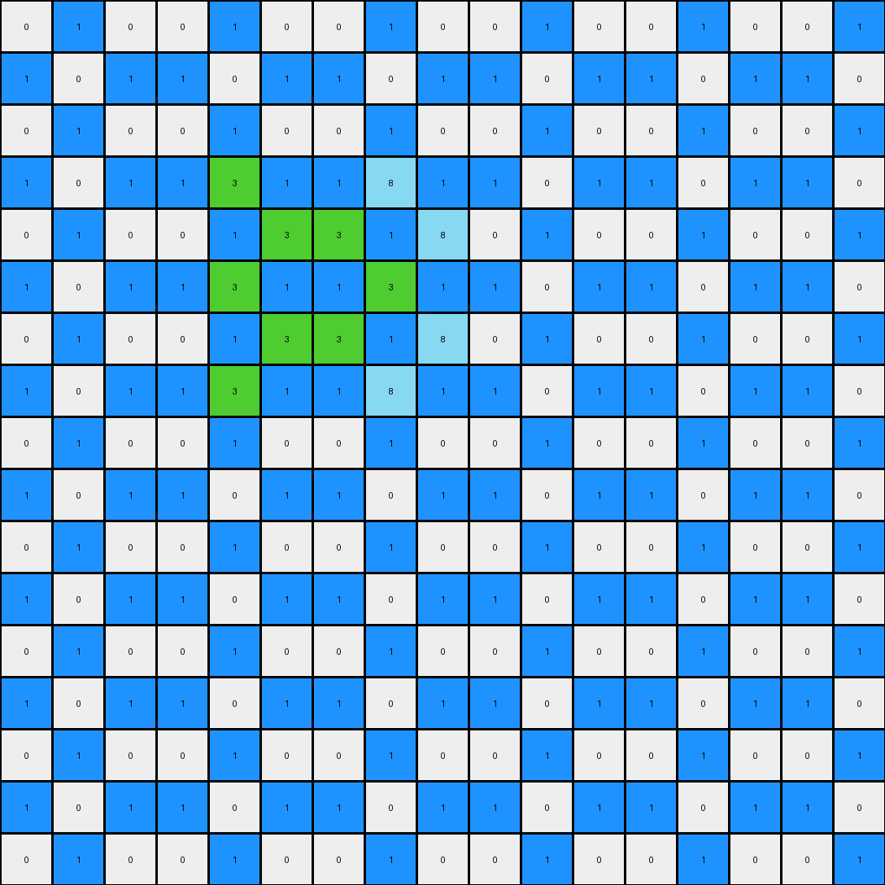

# 32597951 • 011 • refine_dreamer

---

Previous Code:
```python
"""
The input is a grid of pixels with values 0-9. A contiguous region of '8' (azure) pixels is identified. Within this region, specific '8' pixels are changed to '3' (green) based on their relative position, creating a cross or "X" pattern inside the azure object. Pixels with values '0' (white) and '1' (blue) are preserved.
"""

import numpy as np

def find_contiguous_region(grid, value):
    # Find the coordinates of all cells with the specified value.
    coords = np.argwhere(grid == value)
    if coords.size == 0:
        return None, None

    # Find top-left and bottom-right using min/max of the coordinates
    min_row = coords[:, 0].min()
    max_row = coords[:, 0].max()
    min_col = coords[:, 1].min()
    max_col = coords[:, 1].max()

    return (min_row, min_col), (max_row, max_col)

def transform(input_grid):
    # Initialize output grid as a copy of the input grid
    output_grid = np.copy(input_grid)
    input_grid_np = np.array(input_grid)

    # Find the contiguous region of '8's
    top_left, bottom_right = find_contiguous_region(input_grid_np, 8)

    if top_left is None :
      return output_grid

    # Calculate the dimensions of the region.
    height = bottom_right[0] - top_left[0] + 1
    width = bottom_right[1] - top_left[1] + 1

    # Iterate through the '8' region and change to '3' based on relative position.
    for row in range(top_left[0], bottom_right[0] + 1):
        for col in range(top_left[1], bottom_right[1] + 1):
            if output_grid[row, col] == 8:
                rel_row = row - top_left[0]
                rel_col = col - top_left[1]

                # Check for diagonal pattern (X-pattern).
                if (rel_row == rel_col) or (rel_row + rel_col == height -1 ) or (rel_row + rel_col == width - 1):
                   output_grid[row, col] = 3
                #Check the "cross" condition
                elif (height % 2 == 1 and rel_row == height // 2) or \
                     (width % 2 == 1 and rel_col == width // 2 )  :
                        output_grid[row,col] = 3


    return output_grid.tolist()
```

Train Set Results:

## Example 1:

Input:
```
0 0 0 0 0 0 0 0 0 0 0 0 0 0 0 0 0
1 1 0 1 1 1 0 1 1 1 0 1 1 1 0 1 1
0 0 0 0 0 8 8 8 8 8 0 0 0 0 0 0 0
1 1 1 0 1 1 1 8 1 1 1 0 1 1 1 0 1
0 0 0 0 0 8 8 8 8 8 0 0 0 0 0 0 0
1 1 0 1 1 1 8 1 1 1 0 1 1 1 0 1 1
0 0 0 0 0 8 8 8 8 8 0 0 0 0 0 0 0
1 1 1 0 1 1 1 0 1 1 1 0 1 1 1 0 1
0 0 0 0 0 0 0 0 0 0 0 0 0 0 0 0 0
1 1 0 1 1 1 0 1 1 1 0 1 1 1 0 1 1
0 0 0 0 0 0 0 0 0 0 0 0 0 0 0 0 0
1 1 1 0 1 1 1 0 1 1 1 0 1 1 1 0 1
0 0 0 0 0 0 0 0 0 0 0 0 0 0 0 0 0
1 1 0 1 1 1 0 1 1 1 0 1 1 1 0 1 1
0 0 0 0 0 0 0 0 0 0 0 0 0 0 0 0 0
1 1 1 0 1 1 1 0 1 1 1 0 1 1 1 0 1
0 0 0 0 0 0 0 0 0 0 0 0 0 0 0 0 0
```
Expected Output:
```
0 0 0 0 0 0 0 0 0 0 0 0 0 0 0 0 0
1 1 0 1 1 1 0 1 1 1 0 1 1 1 0 1 1
0 0 0 0 0 8 8 8 8 8 0 0 0 0 0 0 0
1 1 1 0 1 3 3 8 3 3 1 0 1 1 1 0 1
0 0 0 0 0 8 8 8 8 8 0 0 0 0 0 0 0
1 1 0 1 1 3 8 3 3 3 0 1 1 1 0 1 1
0 0 0 0 0 8 8 8 8 8 0 0 0 0 0 0 0
1 1 1 0 1 1 1 0 1 1 1 0 1 1 1 0 1
0 0 0 0 0 0 0 0 0 0 0 0 0 0 0 0 0
1 1 0 1 1 1 0 1 1 1 0 1 1 1 0 1 1
0 0 0 0 0 0 0 0 0 0 0 0 0 0 0 0 0
1 1 1 0 1 1 1 0 1 1 1 0 1 1 1 0 1
0 0 0 0 0 0 0 0 0 0 0 0 0 0 0 0 0
1 1 0 1 1 1 0 1 1 1 0 1 1 1 0 1 1
0 0 0 0 0 0 0 0 0 0 0 0 0 0 0 0 0
1 1 1 0 1 1 1 0 1 1 1 0 1 1 1 0 1
0 0 0 0 0 0 0 0 0 0 0 0 0 0 0 0 0
```
Transformed Output:
```
0 0 0 0 0 0 0 0 0 0 0 0 0 0 0 0 0
1 1 0 1 1 1 0 1 1 1 0 1 1 1 0 1 1
0 0 0 0 0 3 8 3 8 3 0 0 0 0 0 0 0
1 1 1 0 1 1 1 3 1 1 1 0 1 1 1 0 1
0 0 0 0 0 3 3 3 3 3 0 0 0 0 0 0 0
1 1 0 1 1 1 3 1 1 1 0 1 1 1 0 1 1
0 0 0 0 0 3 8 3 8 3 0 0 0 0 0 0 0
1 1 1 0 1 1 1 0 1 1 1 0 1 1 1 0 1
0 0 0 0 0 0 0 0 0 0 0 0 0 0 0 0 0
1 1 0 1 1 1 0 1 1 1 0 1 1 1 0 1 1
0 0 0 0 0 0 0 0 0 0 0 0 0 0 0 0 0
1 1 1 0 1 1 1 0 1 1 1 0 1 1 1 0 1
0 0 0 0 0 0 0 0 0 0 0 0 0 0 0 0 0
1 1 0 1 1 1 0 1 1 1 0 1 1 1 0 1 1
0 0 0 0 0 0 0 0 0 0 0 0 0 0 0 0 0
1 1 1 0 1 1 1 0 1 1 1 0 1 1 1 0 1
0 0 0 0 0 0 0 0 0 0 0 0 0 0 0 0 0
```

match: False
pixels_off: 21
size_correct: True
color_palette_correct: True
correct_pixel_counts: False

## Example 2:

Input:
```
1 0 0 0 1 0 0 0 0 0 0 0 1 0 1 0 1
1 1 0 1 0 1 0 1 1 1 1 1 0 0 1 1 0
0 0 0 1 0 0 0 1 0 0 1 1 0 0 0 0 1
0 0 0 0 1 0 1 0 1 0 1 1 0 0 0 1 0
0 0 1 0 0 1 1 0 0 0 0 0 1 1 0 1 1
0 0 0 0 0 1 1 1 0 1 1 0 1 1 0 0 0
0 0 0 1 0 0 1 1 0 0 0 0 0 1 0 0 0
1 8 1 8 8 8 8 8 8 1 0 0 1 0 1 1 0
0 8 1 8 1 1 1 8 8 0 1 1 0 0 0 0 0
0 1 1 8 1 1 8 1 8 0 0 1 1 0 0 0 0
0 1 0 0 1 0 0 0 1 0 0 0 0 0 0 1 0
0 1 0 0 0 0 1 0 1 0 1 0 0 0 0 1 1
1 0 0 0 1 0 0 1 0 0 0 1 0 1 0 0 1
0 0 1 0 1 0 1 0 1 0 1 0 1 0 1 0 0
0 0 1 1 0 1 1 1 1 1 1 0 0 0 0 0 1
0 1 1 0 1 1 0 0 0 0 0 1 0 1 0 0 0
0 0 1 0 0 0 0 0 0 1 0 1 0 0 0 1 1
```
Expected Output:
```
1 0 0 0 1 0 0 0 0 0 0 0 1 0 1 0 1
1 1 0 1 0 1 0 1 1 1 1 1 0 0 1 1 0
0 0 0 1 0 0 0 1 0 0 1 1 0 0 0 0 1
0 0 0 0 1 0 1 0 1 0 1 1 0 0 0 1 0
0 0 1 0 0 1 1 0 0 0 0 0 1 1 0 1 1
0 0 0 0 0 1 1 1 0 1 1 0 1 1 0 0 0
0 0 0 1 0 0 1 1 0 0 0 0 0 1 0 0 0
1 8 3 8 8 8 8 8 8 1 0 0 1 0 1 1 0
0 8 3 8 3 3 3 8 8 0 1 1 0 0 0 0 0
0 3 3 8 3 3 8 3 8 0 0 1 1 0 0 0 0
0 1 0 0 1 0 0 0 1 0 0 0 0 0 0 1 0
0 1 0 0 0 0 1 0 1 0 1 0 0 0 0 1 1
1 0 0 0 1 0 0 1 0 0 0 1 0 1 0 0 1
0 0 1 0 1 0 1 0 1 0 1 0 1 0 1 0 0
0 0 1 1 0 1 1 1 1 1 1 0 0 0 0 0 1
0 1 1 0 1 1 0 0 0 0 0 1 0 1 0 0 0
0 0 1 0 0 0 0 0 0 1 0 1 0 0 0 1 1
```
Transformed Output:
```
1 0 0 0 1 0 0 0 0 0 0 0 1 0 1 0 1
1 1 0 1 0 1 0 1 1 1 1 1 0 0 1 1 0
0 0 0 1 0 0 0 1 0 0 1 1 0 0 0 0 1
0 0 0 0 1 0 1 0 1 0 1 1 0 0 0 1 0
0 0 1 0 0 1 1 0 0 0 0 0 1 1 0 1 1
0 0 0 0 0 1 1 1 0 1 1 0 1 1 0 0 0
0 0 0 1 0 0 1 1 0 0 0 0 0 1 0 0 0
1 3 1 3 8 8 8 8 3 1 0 0 1 0 1 1 0
0 3 1 3 1 1 1 3 3 0 1 1 0 0 0 0 0
0 1 1 3 1 1 3 1 8 0 0 1 1 0 0 0 0
0 1 0 0 1 0 0 0 1 0 0 0 0 0 0 1 0
0 1 0 0 0 0 1 0 1 0 1 0 0 0 0 1 1
1 0 0 0 1 0 0 1 0 0 0 1 0 1 0 0 1
0 0 1 0 1 0 1 0 1 0 1 0 1 0 1 0 0
0 0 1 1 0 1 1 1 1 1 1 0 0 0 0 0 1
0 1 1 0 1 1 0 0 0 0 0 1 0 1 0 0 0
0 0 1 0 0 0 0 0 0 1 0 1 0 0 0 1 1
```

match: False
pixels_off: 19
size_correct: True
color_palette_correct: True
correct_pixel_counts: False

## Example 3:

Input:
```
0 1 0 0 1 0 0 1 0 0 1 0 0 1 0 0 1
1 0 1 1 0 1 1 0 1 1 0 1 1 0 1 1 0
0 1 0 0 1 0 0 1 0 0 1 0 0 1 0 0 1
1 0 1 1 8 1 1 8 1 1 0 1 1 0 1 1 0
0 1 0 0 1 8 8 1 8 0 1 0 0 1 0 0 1
1 0 1 1 8 1 1 8 1 1 0 1 1 0 1 1 0
0 1 0 0 1 8 8 1 8 0 1 0 0 1 0 0 1
1 0 1 1 8 1 1 8 1 1 0 1 1 0 1 1 0
0 1 0 0 1 0 0 1 0 0 1 0 0 1 0 0 1
1 0 1 1 0 1 1 0 1 1 0 1 1 0 1 1 0
0 1 0 0 1 0 0 1 0 0 1 0 0 1 0 0 1
1 0 1 1 0 1 1 0 1 1 0 1 1 0 1 1 0
0 1 0 0 1 0 0 1 0 0 1 0 0 1 0 0 1
1 0 1 1 0 1 1 0 1 1 0 1 1 0 1 1 0
0 1 0 0 1 0 0 1 0 0 1 0 0 1 0 0 1
1 0 1 1 0 1 1 0 1 1 0 1 1 0 1 1 0
0 1 0 0 1 0 0 1 0 0 1 0 0 1 0 0 1
```
Expected Output:
```
0 1 0 0 1 0 0 1 0 0 1 0 0 1 0 0 1
1 0 1 1 0 1 1 0 1 1 0 1 1 0 1 1 0
0 1 0 0 1 0 0 1 0 0 1 0 0 1 0 0 1
1 0 1 1 8 3 3 8 3 1 0 1 1 0 1 1 0
0 1 0 0 3 8 8 3 8 0 1 0 0 1 0 0 1
1 0 1 1 8 3 3 8 3 1 0 1 1 0 1 1 0
0 1 0 0 3 8 8 3 8 0 1 0 0 1 0 0 1
1 0 1 1 8 3 3 8 3 1 0 1 1 0 1 1 0
0 1 0 0 1 0 0 1 0 0 1 0 0 1 0 0 1
1 0 1 1 0 1 1 0 1 1 0 1 1 0 1 1 0
0 1 0 0 1 0 0 1 0 0 1 0 0 1 0 0 1
1 0 1 1 0 1 1 0 1 1 0 1 1 0 1 1 0
0 1 0 0 1 0 0 1 0 0 1 0 0 1 0 0 1
1 0 1 1 0 1 1 0 1 1 0 1 1 0 1 1 0
0 1 0 0 1 0 0 1 0 0 1 0 0 1 0 0 1
1 0 1 1 0 1 1 0 1 1 0 1 1 0 1 1 0
0 1 0 0 1 0 0 1 0 0 1 0 0 1 0 0 1
```
Transformed Output:
```
0 1 0 0 1 0 0 1 0 0 1 0 0 1 0 0 1
1 0 1 1 0 1 1 0 1 1 0 1 1 0 1 1 0
0 1 0 0 1 0 0 1 0 0 1 0 0 1 0 0 1
1 0 1 1 3 1 1 8 1 1 0 1 1 0 1 1 0
0 1 0 0 1 3 3 1 8 0 1 0 0 1 0 0 1
1 0 1 1 3 1 1 3 1 1 0 1 1 0 1 1 0
0 1 0 0 1 3 3 1 8 0 1 0 0 1 0 0 1
1 0 1 1 3 1 1 8 1 1 0 1 1 0 1 1 0
0 1 0 0 1 0 0 1 0 0 1 0 0 1 0 0 1
1 0 1 1 0 1 1 0 1 1 0 1 1 0 1 1 0
0 1 0 0 1 0 0 1 0 0 1 0 0 1 0 0 1
1 0 1 1 0 1 1 0 1 1 0 1 1 0 1 1 0
0 1 0 0 1 0 0 1 0 0 1 0 0 1 0 0 1
1 0 1 1 0 1 1 0 1 1 0 1 1 0 1 1 0
0 1 0 0 1 0 0 1 0 0 1 0 0 1 0 0 1
1 0 1 1 0 1 1 0 1 1 0 1 1 0 1 1 0
0 1 0 0 1 0 0 1 0 0 1 0 0 1 0 0 1
```

match: False
pixels_off: 21
size_correct: True
color_palette_correct: True
correct_pixel_counts: False
**INSTRUCTIONS**

The code above was generated based on observations from the first training
example

we have tested the transform function on each of the task example inputs and
compared with the expected output

review each of the examples provided and the results and consider how the
natural language program should be updated to accommodate this new knowledge

respond with the following deliverables:

- general assessment of the information provided and strategy for resolving the
  errors
- gather metrics about each of the examples and results - use code_execution to
  develop accurate reports on your assumptions
- a YAML block documenting facts - Focus on identifying objects, their properties, and the actions performed on them.
- a natural language program - Be as clear and concise as possible, providing a complete description of the transformation rule.


your responses should be considered as information in a report - not a
conversation
