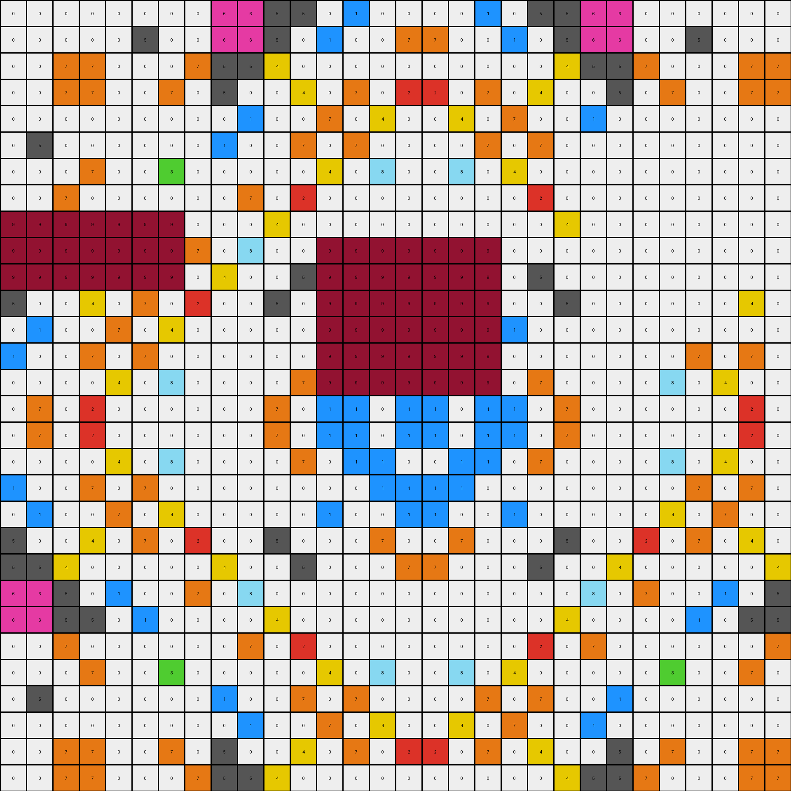
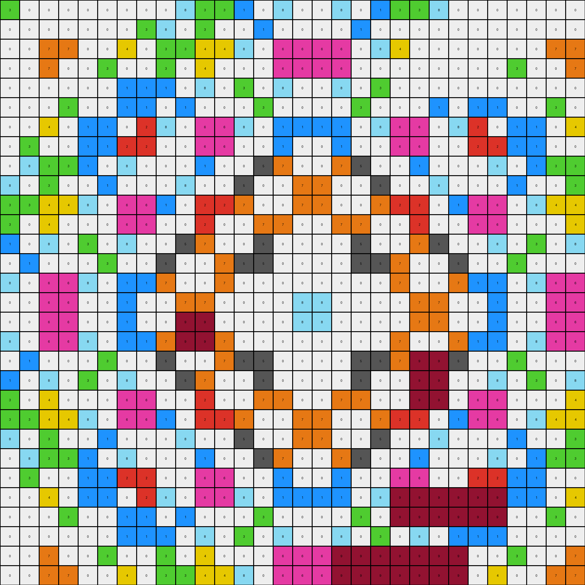
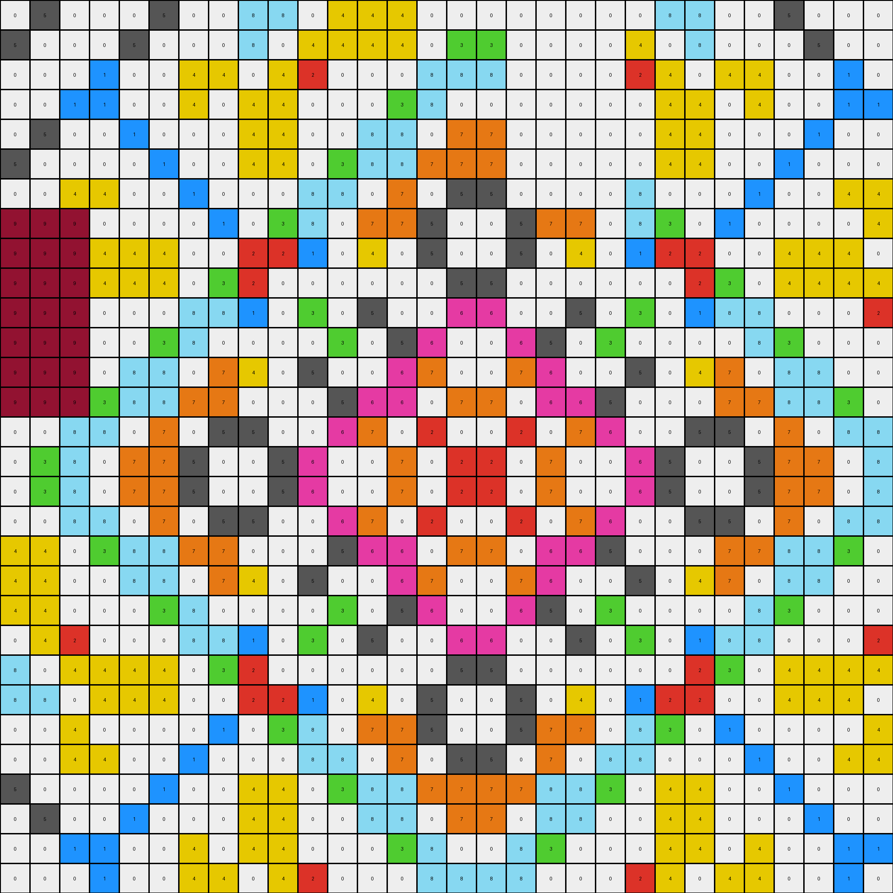
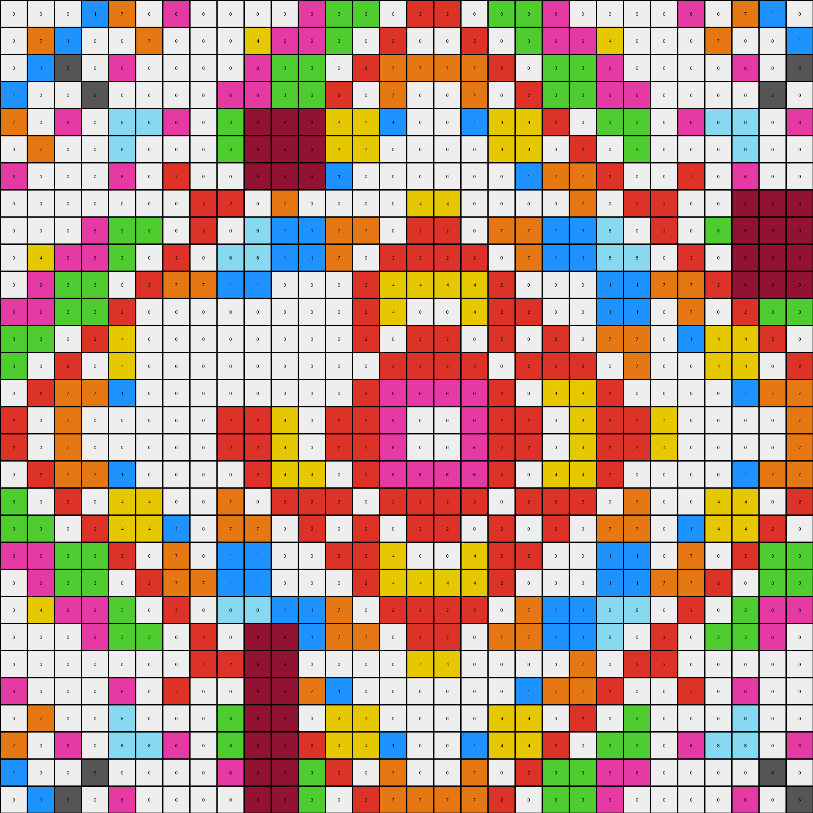

# 3631a71a • 004 • refine_coder

---

Previous Code:
```python
"""
1.  **Identify the target region:** Find the largest contiguous region of maroon (color value 9) pixels within the input grid.
2.  **Remove the region:** Change the color value of all pixels within the identified maroon region to white (color value 0).
3.  **Preserve the rest:** All other pixels in the grid remain unchanged.
"""

import numpy as np
from scipy.ndimage import label

def find_largest_contiguous_region(grid, color_value):
    """
    Finds the largest contiguous region of a specific color in a grid.

    Args:
        grid: The input grid (NumPy array).
        color_value: The color value to search for.

    Returns:
        A mask representing the largest contiguous region, or None if no region of the specified color is found.
    """
    colored_pixels = (grid == color_value).astype(int)
    labeled_array, num_features = label(colored_pixels)
    
    if num_features == 0:
        return None
    
    sizes = np.bincount(labeled_array.ravel())
    largest_label = np.argmax(sizes[1:]) + 1  # +1 because 0 is the background
    largest_region_mask = (labeled_array == largest_label)
    return largest_region_mask

def transform(input_grid):
    """
    Transforms the input grid by removing the largest contiguous region of maroon (9) pixels.
    """
    # initialize output_grid
    output_grid = np.copy(input_grid)

    # Find the largest contiguous region of maroon pixels
    maroon_mask = find_largest_contiguous_region(input_grid, 9)

    # change output pixels 
    if maroon_mask is not None:
      output_grid[maroon_mask] = 0

    return output_grid
```

Train Set Results:

## Example 1:

Input:
```
0 0 0 0 0 0 0 0 6 6 5 5 0 1 0 0 0 0 1 0 5 5 6 6 0 0 0 0 0 0
0 0 0 0 0 5 0 0 6 6 5 0 1 0 0 7 7 0 0 1 0 5 6 6 0 0 5 0 0 0
0 0 7 7 0 0 0 7 5 5 4 0 0 0 0 0 0 0 0 0 0 4 5 5 7 0 0 0 7 7
0 0 7 7 0 0 7 0 5 0 0 4 0 7 0 2 2 0 7 0 4 0 0 5 0 7 0 0 7 7
0 0 0 0 0 0 0 0 0 1 0 0 7 0 4 0 0 4 0 7 0 0 1 0 0 0 0 0 0 0
0 5 0 0 0 0 0 0 1 0 0 7 0 7 0 0 0 0 7 0 7 0 9 9 9 9 9 9 9 9
0 0 0 7 0 0 3 0 0 0 0 0 4 0 8 0 0 8 0 4 0 0 9 9 9 9 9 9 9 9
0 0 7 0 0 0 0 0 0 7 0 2 0 0 0 0 0 0 0 0 2 0 9 9 9 9 9 9 9 9
9 9 9 9 9 9 9 0 0 0 4 0 0 0 0 0 0 0 0 0 0 4 9 9 9 9 9 9 9 9
9 9 9 9 9 9 9 7 0 8 0 0 9 9 9 9 9 9 9 0 0 0 9 9 9 9 9 9 9 9
9 9 9 9 9 9 9 0 4 0 0 5 9 9 9 9 9 9 9 0 5 0 9 9 9 9 9 9 9 9
5 0 0 4 0 7 0 2 0 0 5 0 9 9 9 9 9 9 9 0 0 5 9 9 9 9 9 9 4 0
0 1 0 0 7 0 4 0 0 0 0 0 9 9 9 9 9 9 9 1 0 0 9 9 9 9 9 9 0 0
1 0 0 7 0 7 0 0 0 0 0 0 9 9 9 9 9 9 9 0 0 0 0 0 0 0 7 0 7 0
0 0 0 0 4 0 8 0 0 0 0 7 9 9 9 9 9 9 9 0 7 0 0 0 0 8 0 4 0 0
0 7 0 2 0 0 0 0 0 0 7 0 1 1 0 1 1 0 1 1 0 7 0 0 0 0 0 0 2 0
0 7 0 2 0 0 0 0 0 0 7 0 1 1 0 1 1 0 1 1 0 7 0 0 0 0 0 0 2 0
0 0 0 0 4 0 8 0 0 0 0 7 0 1 1 0 0 1 1 0 7 0 0 0 0 8 0 4 0 0
1 0 0 7 0 7 0 0 0 0 0 0 0 0 1 1 1 1 0 0 0 0 0 0 0 0 7 0 7 0
0 1 0 0 7 0 4 0 0 0 0 0 1 0 0 1 1 0 0 1 0 0 0 0 0 4 0 7 0 0
5 0 0 4 0 7 0 2 0 0 5 0 0 0 7 0 0 7 0 0 0 5 0 0 2 0 7 0 4 0
5 5 4 0 0 0 0 0 4 0 0 5 0 0 0 7 7 0 0 0 5 0 0 4 0 0 0 0 0 4
6 6 5 0 1 0 0 7 0 8 0 0 0 0 0 0 0 0 0 0 0 0 8 0 7 0 0 1 0 5
6 6 5 5 0 1 0 0 0 0 4 0 0 0 0 0 0 0 0 0 0 4 0 0 0 0 1 0 5 5
0 0 7 0 0 0 0 0 0 7 0 2 0 0 0 0 0 0 0 0 2 0 7 0 0 0 0 0 0 7
0 0 0 7 0 0 3 0 0 0 0 0 4 0 8 0 0 8 0 4 0 0 0 0 0 3 0 0 7 0
0 5 0 0 0 0 0 0 1 0 0 7 0 7 0 0 0 0 7 0 7 0 0 1 0 0 0 0 0 0
0 0 0 0 0 0 0 0 0 1 0 0 7 0 4 0 0 4 0 7 0 0 1 0 0 0 0 0 0 0
0 0 7 7 0 0 7 0 5 0 0 4 0 7 0 2 2 0 7 0 4 0 0 5 0 7 0 0 7 7
0 0 7 7 0 0 0 7 5 5 4 0 0 0 0 0 0 0 0 0 0 4 5 5 7 0 0 0 7 7
```
Expected Output:
```
0 0 0 0 0 0 0 0 6 6 5 5 0 1 0 0 0 0 1 0 5 5 6 6 0 0 0 0 0 0
0 0 0 0 0 5 0 0 6 6 5 0 1 0 0 7 7 0 0 1 0 5 6 6 0 0 5 0 0 0
0 0 7 7 0 0 0 7 5 5 4 0 0 0 0 0 0 0 0 0 0 4 5 5 7 0 0 0 7 7
0 0 7 7 0 0 7 0 5 0 0 4 0 7 0 2 2 0 7 0 4 0 0 5 0 7 0 0 7 7
0 0 0 0 0 0 0 0 0 1 0 0 7 0 4 0 0 4 0 7 0 0 1 0 0 0 0 0 0 0
0 5 0 0 0 0 0 0 1 0 0 7 0 7 0 0 0 0 7 0 7 0 0 1 0 0 0 0 0 0
0 0 0 7 0 0 3 0 0 0 0 0 4 0 8 0 0 8 0 4 0 0 0 0 0 3 0 0 7 0
0 0 7 0 0 0 0 0 0 7 0 2 0 0 0 0 0 0 0 0 2 0 7 0 0 0 0 0 0 7
6 6 5 5 0 1 0 0 0 0 4 0 0 0 0 0 0 0 0 0 0 4 0 0 0 0 1 0 5 5
6 6 5 0 1 0 0 7 0 8 0 0 0 0 0 0 0 0 0 0 0 0 8 0 7 0 0 1 0 5
5 5 4 0 0 0 0 0 4 0 0 5 0 0 0 7 7 0 0 0 5 0 0 4 0 0 0 0 0 4
5 0 0 4 0 7 0 2 0 0 5 0 0 0 7 0 0 7 0 0 0 5 0 0 2 0 7 0 4 0
0 1 0 0 7 0 4 0 0 0 0 0 1 0 0 1 1 0 0 1 0 0 0 0 0 4 0 7 0 0
1 0 0 7 0 7 0 0 0 0 0 0 0 0 1 1 1 1 0 0 0 0 0 0 0 0 7 0 7 0
0 0 0 0 4 0 8 0 0 0 0 7 0 1 1 0 0 1 1 0 7 0 0 0 0 8 0 4 0 0
0 7 0 2 0 0 0 0 0 0 7 0 1 1 0 1 1 0 1 1 0 7 0 0 0 0 0 0 2 0
0 7 0 2 0 0 0 0 0 0 7 0 1 1 0 1 1 0 1 1 0 7 0 0 0 0 0 0 2 0
0 0 0 0 4 0 8 0 0 0 0 7 0 1 1 0 0 1 1 0 7 0 0 0 0 8 0 4 0 0
1 0 0 7 0 7 0 0 0 0 0 0 0 0 1 1 1 1 0 0 0 0 0 0 0 0 7 0 7 0
0 1 0 0 7 0 4 0 0 0 0 0 1 0 0 1 1 0 0 1 0 0 0 0 0 4 0 7 0 0
5 0 0 4 0 7 0 2 0 0 5 0 0 0 7 0 0 7 0 0 0 5 0 0 2 0 7 0 4 0
5 5 4 0 0 0 0 0 4 0 0 5 0 0 0 7 7 0 0 0 5 0 0 4 0 0 0 0 0 4
6 6 5 0 1 0 0 7 0 8 0 0 0 0 0 0 0 0 0 0 0 0 8 0 7 0 0 1 0 5
6 6 5 5 0 1 0 0 0 0 4 0 0 0 0 0 0 0 0 0 0 4 0 0 0 0 1 0 5 5
0 0 7 0 0 0 0 0 0 7 0 2 0 0 0 0 0 0 0 0 2 0 7 0 0 0 0 0 0 7
0 0 0 7 0 0 3 0 0 0 0 0 4 0 8 0 0 8 0 4 0 0 0 0 0 3 0 0 7 0
0 5 0 0 0 0 0 0 1 0 0 7 0 7 0 0 0 0 7 0 7 0 0 1 0 0 0 0 0 0
0 0 0 0 0 0 0 0 0 1 0 0 7 0 4 0 0 4 0 7 0 0 1 0 0 0 0 0 0 0
0 0 7 7 0 0 7 0 5 0 0 4 0 7 0 2 2 0 7 0 4 0 0 5 0 7 0 0 7 7
0 0 7 7 0 0 0 7 5 5 4 0 0 0 0 0 0 0 0 0 0 4 5 5 7 0 0 0 7 7
```
Transformed Output:
```
0 0 0 0 0 0 0 0 6 6 5 5 0 1 0 0 0 0 1 0 5 5 6 6 0 0 0 0 0 0
0 0 0 0 0 5 0 0 6 6 5 0 1 0 0 7 7 0 0 1 0 5 6 6 0 0 5 0 0 0
0 0 7 7 0 0 0 7 5 5 4 0 0 0 0 0 0 0 0 0 0 4 5 5 7 0 0 0 7 7
0 0 7 7 0 0 7 0 5 0 0 4 0 7 0 2 2 0 7 0 4 0 0 5 0 7 0 0 7 7
0 0 0 0 0 0 0 0 0 1 0 0 7 0 4 0 0 4 0 7 0 0 1 0 0 0 0 0 0 0
0 5 0 0 0 0 0 0 1 0 0 7 0 7 0 0 0 0 7 0 7 0 0 0 0 0 0 0 0 0
0 0 0 7 0 0 3 0 0 0 0 0 4 0 8 0 0 8 0 4 0 0 0 0 0 0 0 0 0 0
0 0 7 0 0 0 0 0 0 7 0 2 0 0 0 0 0 0 0 0 2 0 0 0 0 0 0 0 0 0
9 9 9 9 9 9 9 0 0 0 4 0 0 0 0 0 0 0 0 0 0 4 0 0 0 0 0 0 0 0
9 9 9 9 9 9 9 7 0 8 0 0 9 9 9 9 9 9 9 0 0 0 0 0 0 0 0 0 0 0
9 9 9 9 9 9 9 0 4 0 0 5 9 9 9 9 9 9 9 0 5 0 0 0 0 0 0 0 0 0
5 0 0 4 0 7 0 2 0 0 5 0 9 9 9 9 9 9 9 0 0 5 0 0 0 0 0 0 4 0
0 1 0 0 7 0 4 0 0 0 0 0 9 9 9 9 9 9 9 1 0 0 0 0 0 0 0 0 0 0
1 0 0 7 0 7 0 0 0 0 0 0 9 9 9 9 9 9 9 0 0 0 0 0 0 0 7 0 7 0
0 0 0 0 4 0 8 0 0 0 0 7 9 9 9 9 9 9 9 0 7 0 0 0 0 8 0 4 0 0
0 7 0 2 0 0 0 0 0 0 7 0 1 1 0 1 1 0 1 1 0 7 0 0 0 0 0 0 2 0
0 7 0 2 0 0 0 0 0 0 7 0 1 1 0 1 1 0 1 1 0 7 0 0 0 0 0 0 2 0
0 0 0 0 4 0 8 0 0 0 0 7 0 1 1 0 0 1 1 0 7 0 0 0 0 8 0 4 0 0
1 0 0 7 0 7 0 0 0 0 0 0 0 0 1 1 1 1 0 0 0 0 0 0 0 0 7 0 7 0
0 1 0 0 7 0 4 0 0 0 0 0 1 0 0 1 1 0 0 1 0 0 0 0 0 4 0 7 0 0
5 0 0 4 0 7 0 2 0 0 5 0 0 0 7 0 0 7 0 0 0 5 0 0 2 0 7 0 4 0
5 5 4 0 0 0 0 0 4 0 0 5 0 0 0 7 7 0 0 0 5 0 0 4 0 0 0 0 0 4
6 6 5 0 1 0 0 7 0 8 0 0 0 0 0 0 0 0 0 0 0 0 8 0 7 0 0 1 0 5
6 6 5 5 0 1 0 0 0 0 4 0 0 0 0 0 0 0 0 0 0 4 0 0 0 0 1 0 5 5
0 0 7 0 0 0 0 0 0 7 0 2 0 0 0 0 0 0 0 0 2 0 7 0 0 0 0 0 0 7
0 0 0 7 0 0 3 0 0 0 0 0 4 0 8 0 0 8 0 4 0 0 0 0 0 3 0 0 7 0
0 5 0 0 0 0 0 0 1 0 0 7 0 7 0 0 0 0 7 0 7 0 0 1 0 0 0 0 0 0
0 0 0 0 0 0 0 0 0 1 0 0 7 0 4 0 0 4 0 7 0 0 1 0 0 0 0 0 0 0
0 0 7 7 0 0 7 0 5 0 0 4 0 7 0 2 2 0 7 0 4 0 0 5 0 7 0 0 7 7
0 0 7 7 0 0 0 7 5 5 4 0 0 0 0 0 0 0 0 0 0 4 5 5 7 0 0 0 7 7
```

match: False
pixels_off: 81
size_correct: True
color_palette_correct: False
correct_pixel_counts: False

## Example 2:

Input:
```
3 0 0 0 0 0 0 0 0 8 3 3 1 0 8 0 0 8 0 1 3 3 8 0 0 0 0 0 0 0
0 0 0 0 0 0 0 3 8 0 3 0 0 1 0 0 0 0 1 0 0 9 9 9 9 9 0 0 0 0
0 0 7 7 0 0 4 0 3 3 4 4 8 0 6 6 6 6 0 8 4 9 9 9 9 9 0 0 7 7
0 0 7 0 0 3 0 0 3 0 4 0 0 0 6 6 6 6 0 0 0 9 9 9 9 9 3 0 0 7
0 0 0 0 0 0 1 1 1 0 8 0 3 0 8 0 0 8 0 3 0 9 9 9 9 9 0 0 0 0
0 0 0 3 0 0 1 1 0 1 0 0 0 3 0 0 0 0 3 0 0 0 1 0 1 1 0 0 3 0
0 0 4 0 1 1 0 2 8 0 6 6 8 0 1 1 1 1 0 8 6 6 0 8 2 0 1 1 0 4
0 3 0 0 1 1 2 2 0 0 6 6 0 0 1 0 0 1 0 0 6 6 0 0 2 2 1 1 0 0
0 8 3 3 1 0 8 0 0 0 1 0 0 5 7 0 0 7 5 0 0 1 0 0 0 8 0 1 3 3
8 0 3 0 0 1 0 0 0 8 0 0 5 0 0 7 7 0 0 5 0 0 8 0 0 0 1 0 0 3
3 3 4 4 8 0 6 6 1 0 2 2 7 0 0 7 7 0 0 7 2 2 0 1 6 6 0 8 4 4
3 0 4 0 0 0 6 6 0 0 2 0 0 7 7 0 0 7 7 0 0 2 0 0 6 6 0 0 0 4
1 0 8 0 3 0 8 0 0 5 7 0 0 5 0 0 0 0 5 0 0 7 5 0 0 8 0 3 0 8
0 1 0 0 0 3 0 0 5 0 0 7 5 5 0 0 0 0 5 5 7 0 0 5 0 0 3 0 0 0
8 0 6 6 8 0 1 1 7 0 0 7 0 0 0 0 0 0 0 0 7 0 0 7 1 1 0 8 6 6
0 0 6 6 0 0 1 0 0 7 7 0 0 0 0 8 8 0 0 0 0 7 7 0 0 1 0 0 6 6
0 0 6 6 0 0 1 0 0 9 9 0 0 0 0 8 8 0 0 0 0 7 7 0 0 1 0 0 6 6
8 0 6 6 8 0 1 1 7 9 9 7 0 0 0 0 0 0 0 0 7 0 0 7 1 1 0 8 6 6
0 1 0 0 0 3 0 0 5 0 0 7 5 5 0 0 0 0 5 5 7 9 9 5 0 0 3 0 0 0
1 0 8 0 3 0 8 0 0 5 7 0 0 5 0 0 0 0 5 0 0 9 9 0 0 8 0 3 0 8
3 0 4 0 0 0 6 6 0 0 2 0 0 7 7 0 0 7 7 0 0 9 9 0 6 6 0 0 0 4
3 3 4 4 8 0 6 6 1 0 2 2 7 0 0 7 7 0 0 7 2 2 0 1 6 6 0 8 4 4
8 0 3 0 0 1 0 0 0 8 0 0 5 0 0 7 7 0 0 5 0 0 8 0 0 0 1 0 0 3
0 8 3 3 1 0 8 0 0 0 1 0 0 5 7 0 0 7 5 0 0 1 0 0 0 8 0 1 3 3
0 3 0 0 1 1 2 2 0 0 6 6 0 0 1 0 0 1 0 0 6 6 0 0 2 2 1 1 0 0
0 0 4 0 1 1 0 2 8 0 6 6 8 0 1 1 1 1 0 8 9 9 9 9 9 9 1 1 0 4
0 0 0 3 0 0 1 1 0 1 0 0 0 3 0 0 0 0 3 0 9 9 9 9 9 9 0 0 3 0
0 0 0 0 0 0 1 1 1 0 8 0 3 0 8 0 0 8 0 3 0 8 0 1 1 1 0 0 0 0
0 0 7 0 0 3 0 0 3 0 4 0 0 0 6 6 6 9 9 9 9 9 9 9 0 0 3 0 0 7
0 0 7 7 0 0 4 0 3 3 4 4 8 0 6 6 6 9 9 9 9 9 9 9 0 4 0 0 7 7
```
Expected Output:
```
3 0 0 0 0 0 0 0 0 8 3 3 1 0 8 0 0 8 0 1 3 3 8 0 0 0 0 0 0 0
0 0 0 0 0 0 0 3 8 0 3 0 0 1 0 0 0 0 1 0 0 3 0 8 3 0 0 0 0 0
0 0 7 7 0 0 4 0 3 3 4 4 8 0 6 6 6 6 0 8 4 4 3 3 0 4 0 0 7 7
0 0 7 0 0 3 0 0 3 0 4 0 0 0 6 6 6 6 0 0 0 4 0 3 0 0 3 0 0 7
0 0 0 0 0 0 1 1 1 0 8 0 3 0 8 0 0 8 0 3 0 8 0 1 1 1 0 0 0 0
0 0 0 3 0 0 1 1 0 1 0 0 0 3 0 0 0 0 3 0 0 0 1 0 1 1 0 0 3 0
0 0 4 0 1 1 0 2 8 0 6 6 8 0 1 1 1 1 0 8 6 6 0 8 2 0 1 1 0 4
0 3 0 0 1 1 2 2 0 0 6 6 0 0 1 0 0 1 0 0 6 6 0 0 2 2 1 1 0 0
0 8 3 3 1 0 8 0 0 0 1 0 0 5 7 0 0 7 5 0 0 1 0 0 0 8 0 1 3 3
8 0 3 0 0 1 0 0 0 8 0 0 5 0 0 7 7 0 0 5 0 0 8 0 0 0 1 0 0 3
3 3 4 4 8 0 6 6 1 0 2 2 7 0 0 7 7 0 0 7 2 2 0 1 6 6 0 8 4 4
3 0 4 0 0 0 6 6 0 0 2 0 0 7 7 0 0 7 7 0 0 2 0 0 6 6 0 0 0 4
1 0 8 0 3 0 8 0 0 5 7 0 0 5 0 0 0 0 5 0 0 7 5 0 0 8 0 3 0 8
0 1 0 0 0 3 0 0 5 0 0 7 5 5 0 0 0 0 5 5 7 0 0 5 0 0 3 0 0 0
8 0 6 6 8 0 1 1 7 0 0 7 0 0 0 0 0 0 0 0 7 0 0 7 1 1 0 8 6 6
0 0 6 6 0 0 1 0 0 7 7 0 0 0 0 8 8 0 0 0 0 7 7 0 0 1 0 0 6 6
0 0 6 6 0 0 1 0 0 7 7 0 0 0 0 8 8 0 0 0 0 7 7 0 0 1 0 0 6 6
8 0 6 6 8 0 1 1 7 0 0 7 0 0 0 0 0 0 0 0 7 0 0 7 1 1 0 8 6 6
0 1 0 0 0 3 0 0 5 0 0 7 5 5 0 0 0 0 5 5 7 0 0 5 0 0 3 0 0 0
1 0 8 0 3 0 8 0 0 5 7 0 0 5 0 0 0 0 5 0 0 7 5 0 0 8 0 3 0 8
3 0 4 0 0 0 6 6 0 0 2 0 0 7 7 0 0 7 7 0 0 2 0 0 6 6 0 0 0 4
3 3 4 4 8 0 6 6 1 0 2 2 7 0 0 7 7 0 0 7 2 2 0 1 6 6 0 8 4 4
8 0 3 0 0 1 0 0 0 8 0 0 5 0 0 7 7 0 0 5 0 0 8 0 0 0 1 0 0 3
0 8 3 3 1 0 8 0 0 0 1 0 0 5 7 0 0 7 5 0 0 1 0 0 0 8 0 1 3 3
0 3 0 0 1 1 2 2 0 0 6 6 0 0 1 0 0 1 0 0 6 6 0 0 2 2 1 1 0 0
0 0 4 0 1 1 0 2 8 0 6 6 8 0 1 1 1 1 0 8 6 6 0 8 2 0 1 1 0 4
0 0 0 3 0 0 1 1 0 1 0 0 0 3 0 0 0 0 3 0 0 0 1 0 1 1 0 0 3 0
0 0 0 0 0 0 1 1 1 0 8 0 3 0 8 0 0 8 0 3 0 8 0 1 1 1 0 0 0 0
0 0 7 0 0 3 0 0 3 0 4 0 0 0 6 6 6 6 0 0 0 4 0 3 0 0 3 0 0 7
0 0 7 7 0 0 4 0 3 3 4 4 8 0 6 6 6 6 0 8 4 4 3 3 0 4 0 0 7 7
```
Transformed Output:
```
3 0 0 0 0 0 0 0 0 8 3 3 1 0 8 0 0 8 0 1 3 3 8 0 0 0 0 0 0 0
0 0 0 0 0 0 0 3 8 0 3 0 0 1 0 0 0 0 1 0 0 0 0 0 0 0 0 0 0 0
0 0 7 7 0 0 4 0 3 3 4 4 8 0 6 6 6 6 0 8 4 0 0 0 0 0 0 0 7 7
0 0 7 0 0 3 0 0 3 0 4 0 0 0 6 6 6 6 0 0 0 0 0 0 0 0 3 0 0 7
0 0 0 0 0 0 1 1 1 0 8 0 3 0 8 0 0 8 0 3 0 0 0 0 0 0 0 0 0 0
0 0 0 3 0 0 1 1 0 1 0 0 0 3 0 0 0 0 3 0 0 0 1 0 1 1 0 0 3 0
0 0 4 0 1 1 0 2 8 0 6 6 8 0 1 1 1 1 0 8 6 6 0 8 2 0 1 1 0 4
0 3 0 0 1 1 2 2 0 0 6 6 0 0 1 0 0 1 0 0 6 6 0 0 2 2 1 1 0 0
0 8 3 3 1 0 8 0 0 0 1 0 0 5 7 0 0 7 5 0 0 1 0 0 0 8 0 1 3 3
8 0 3 0 0 1 0 0 0 8 0 0 5 0 0 7 7 0 0 5 0 0 8 0 0 0 1 0 0 3
3 3 4 4 8 0 6 6 1 0 2 2 7 0 0 7 7 0 0 7 2 2 0 1 6 6 0 8 4 4
3 0 4 0 0 0 6 6 0 0 2 0 0 7 7 0 0 7 7 0 0 2 0 0 6 6 0 0 0 4
1 0 8 0 3 0 8 0 0 5 7 0 0 5 0 0 0 0 5 0 0 7 5 0 0 8 0 3 0 8
0 1 0 0 0 3 0 0 5 0 0 7 5 5 0 0 0 0 5 5 7 0 0 5 0 0 3 0 0 0
8 0 6 6 8 0 1 1 7 0 0 7 0 0 0 0 0 0 0 0 7 0 0 7 1 1 0 8 6 6
0 0 6 6 0 0 1 0 0 7 7 0 0 0 0 8 8 0 0 0 0 7 7 0 0 1 0 0 6 6
0 0 6 6 0 0 1 0 0 9 9 0 0 0 0 8 8 0 0 0 0 7 7 0 0 1 0 0 6 6
8 0 6 6 8 0 1 1 7 9 9 7 0 0 0 0 0 0 0 0 7 0 0 7 1 1 0 8 6 6
0 1 0 0 0 3 0 0 5 0 0 7 5 5 0 0 0 0 5 5 7 9 9 5 0 0 3 0 0 0
1 0 8 0 3 0 8 0 0 5 7 0 0 5 0 0 0 0 5 0 0 9 9 0 0 8 0 3 0 8
3 0 4 0 0 0 6 6 0 0 2 0 0 7 7 0 0 7 7 0 0 9 9 0 6 6 0 0 0 4
3 3 4 4 8 0 6 6 1 0 2 2 7 0 0 7 7 0 0 7 2 2 0 1 6 6 0 8 4 4
8 0 3 0 0 1 0 0 0 8 0 0 5 0 0 7 7 0 0 5 0 0 8 0 0 0 1 0 0 3
0 8 3 3 1 0 8 0 0 0 1 0 0 5 7 0 0 7 5 0 0 1 0 0 0 8 0 1 3 3
0 3 0 0 1 1 2 2 0 0 6 6 0 0 1 0 0 1 0 0 6 6 0 0 2 2 1 1 0 0
0 0 4 0 1 1 0 2 8 0 6 6 8 0 1 1 1 1 0 8 9 9 9 9 9 9 1 1 0 4
0 0 0 3 0 0 1 1 0 1 0 0 0 3 0 0 0 0 3 0 9 9 9 9 9 9 0 0 3 0
0 0 0 0 0 0 1 1 1 0 8 0 3 0 8 0 0 8 0 3 0 8 0 1 1 1 0 0 0 0
0 0 7 0 0 3 0 0 3 0 4 0 0 0 6 6 6 9 9 9 9 9 9 9 0 0 3 0 0 7
0 0 7 7 0 0 4 0 3 3 4 4 8 0 6 6 6 9 9 9 9 9 9 9 0 4 0 0 7 7
```

match: False
pixels_off: 49
size_correct: True
color_palette_correct: False
correct_pixel_counts: False

## Example 3:

Input:
```
0 5 0 0 0 5 0 0 8 8 0 4 4 4 0 0 0 9 9 9 9 0 8 8 0 0 5 0 0 0
5 0 0 0 5 0 0 0 8 0 4 4 4 4 0 3 3 9 9 9 9 4 0 8 0 0 0 5 0 0
0 0 0 1 0 0 4 4 0 4 2 0 0 0 8 8 8 9 9 9 9 2 4 0 4 4 0 0 1 0
0 0 1 1 0 0 4 0 4 4 0 0 0 3 8 0 0 9 9 9 9 0 4 4 0 4 0 0 1 1
0 5 0 0 1 0 0 0 4 4 0 0 8 8 0 7 7 9 9 9 9 0 4 4 0 0 0 1 0 0
5 0 0 0 0 1 0 0 4 4 0 3 8 8 7 7 7 9 9 9 9 0 4 4 0 0 1 0 0 0
0 0 4 4 0 0 1 0 0 0 8 8 0 7 0 5 5 9 9 9 9 8 0 0 0 1 0 0 4 4
9 9 9 0 0 0 0 1 0 3 8 0 7 7 5 0 0 5 7 7 0 8 3 0 1 0 0 0 0 4
9 9 9 4 4 4 0 0 2 2 1 0 4 0 5 0 0 5 0 4 0 1 2 2 0 0 4 4 4 0
9 9 9 4 4 4 0 3 2 0 0 0 0 0 0 5 5 0 0 0 0 0 0 2 3 0 4 4 4 4
9 9 9 0 0 0 8 8 1 0 3 0 5 0 0 6 6 0 0 5 0 3 0 1 8 8 0 0 0 2
9 9 9 0 0 3 8 0 0 0 0 3 0 5 6 0 0 6 5 0 3 0 0 0 0 8 3 0 0 0
9 9 9 0 8 8 0 7 4 0 5 0 0 6 7 0 0 7 6 0 0 5 0 4 7 0 8 8 0 0
9 9 9 3 8 8 7 7 0 0 0 5 6 6 0 7 7 0 6 6 5 0 0 0 7 7 8 8 3 0
0 0 8 8 0 7 0 5 5 0 0 6 7 0 2 0 0 2 0 7 6 0 0 5 5 0 7 0 8 8
0 3 8 0 7 7 5 0 0 5 6 0 0 7 0 2 2 0 7 0 0 6 5 0 0 5 7 7 0 8
0 3 8 0 7 7 5 0 0 5 6 0 0 7 0 2 2 0 7 0 0 6 5 0 0 5 7 7 0 8
0 0 8 8 0 7 0 5 5 0 0 6 7 0 2 0 0 2 0 7 6 0 0 5 5 0 7 0 8 8
4 4 0 3 8 8 7 7 0 0 0 5 6 6 0 7 7 0 6 6 5 0 0 0 7 7 8 8 3 0
4 4 0 0 8 8 0 7 4 0 5 0 0 6 7 0 0 7 6 0 0 5 0 4 7 0 8 8 0 0
4 4 0 0 0 3 8 0 0 0 0 3 0 5 6 0 0 6 5 0 3 0 0 0 0 8 3 0 0 0
0 4 2 0 0 0 8 8 1 0 3 0 5 0 0 6 6 0 0 5 0 3 0 1 8 8 0 0 0 2
8 0 4 4 4 4 0 3 2 0 0 0 0 0 0 5 5 0 0 0 0 0 0 2 3 0 4 4 4 4
8 8 0 4 4 4 0 0 2 2 1 0 4 0 5 0 0 5 0 4 0 1 2 2 0 0 4 4 4 0
0 0 4 0 0 0 0 1 0 3 8 0 7 7 5 0 0 5 7 7 0 8 3 0 1 0 0 0 0 4
0 0 4 4 0 0 1 0 0 0 8 8 0 7 0 5 5 0 7 0 8 8 0 0 0 1 0 0 4 4
5 0 0 0 0 1 0 0 4 4 0 3 8 8 7 7 7 7 8 8 3 0 4 4 0 0 1 0 0 0
0 5 0 0 1 0 0 0 4 4 0 0 8 8 0 7 7 0 8 8 0 0 4 4 0 0 0 1 0 0
0 0 1 1 0 0 4 0 4 4 0 0 0 3 8 0 0 8 3 0 0 0 4 4 0 4 0 0 1 1
0 0 0 1 0 0 4 4 0 4 2 0 0 0 8 8 8 8 0 0 0 2 4 0 4 4 0 0 1 0
```
Expected Output:
```
0 5 0 0 0 5 0 0 8 8 0 4 4 4 0 0 0 0 4 4 4 0 8 8 0 0 5 0 0 0
5 0 0 0 5 0 0 0 8 0 4 4 4 4 0 3 3 0 4 4 4 4 0 8 0 0 0 5 0 0
0 0 0 1 0 0 4 4 0 4 2 0 0 0 8 8 8 8 0 0 0 2 4 0 4 4 0 0 1 0
0 0 1 1 0 0 4 0 4 4 0 0 0 3 8 0 0 8 3 0 0 0 4 4 0 4 0 0 1 1
0 5 0 0 1 0 0 0 4 4 0 0 8 8 0 7 7 0 8 8 0 0 4 4 0 0 0 1 0 0
5 0 0 0 0 1 0 0 4 4 0 3 8 8 7 7 7 7 8 8 3 0 4 4 0 0 1 0 0 0
0 0 4 4 0 0 1 0 0 0 8 8 0 7 0 5 5 0 7 0 8 8 0 0 0 1 0 0 4 4
0 0 4 0 0 0 0 1 0 3 8 0 7 7 5 0 0 5 7 7 0 8 3 0 1 0 0 0 0 4
8 8 0 4 4 4 0 0 2 2 1 0 4 0 5 0 0 5 0 4 0 1 2 2 0 0 4 4 4 0
8 0 4 4 4 4 0 3 2 0 0 0 0 0 0 5 5 0 0 0 0 0 0 2 3 0 4 4 4 4
0 4 2 0 0 0 8 8 1 0 3 0 5 0 0 6 6 0 0 5 0 3 0 1 8 8 0 0 0 2
4 4 0 0 0 3 8 0 0 0 0 3 0 5 6 0 0 6 5 0 3 0 0 0 0 8 3 0 0 0
4 4 0 0 8 8 0 7 4 0 5 0 0 6 7 0 0 7 6 0 0 5 0 4 7 0 8 8 0 0
4 4 0 3 8 8 7 7 0 0 0 5 6 6 0 7 7 0 6 6 5 0 0 0 7 7 8 8 3 0
0 0 8 8 0 7 0 5 5 0 0 6 7 0 2 0 0 2 0 7 6 0 0 5 5 0 7 0 8 8
0 3 8 0 7 7 5 0 0 5 6 0 0 7 0 2 2 0 7 0 0 6 5 0 0 5 7 7 0 8
0 3 8 0 7 7 5 0 0 5 6 0 0 7 0 2 2 0 7 0 0 6 5 0 0 5 7 7 0 8
0 0 8 8 0 7 0 5 5 0 0 6 7 0 2 0 0 2 0 7 6 0 0 5 5 0 7 0 8 8
4 4 0 3 8 8 7 7 0 0 0 5 6 6 0 7 7 0 6 6 5 0 0 0 7 7 8 8 3 0
4 4 0 0 8 8 0 7 4 0 5 0 0 6 7 0 0 7 6 0 0 5 0 4 7 0 8 8 0 0
4 4 0 0 0 3 8 0 0 0 0 3 0 5 6 0 0 6 5 0 3 0 0 0 0 8 3 0 0 0
0 4 2 0 0 0 8 8 1 0 3 0 5 0 0 6 6 0 0 5 0 3 0 1 8 8 0 0 0 2
8 0 4 4 4 4 0 3 2 0 0 0 0 0 0 5 5 0 0 0 0 0 0 2 3 0 4 4 4 4
8 8 0 4 4 4 0 0 2 2 1 0 4 0 5 0 0 5 0 4 0 1 2 2 0 0 4 4 4 0
0 0 4 0 0 0 0 1 0 3 8 0 7 7 5 0 0 5 7 7 0 8 3 0 1 0 0 0 0 4
0 0 4 4 0 0 1 0 0 0 8 8 0 7 0 5 5 0 7 0 8 8 0 0 0 1 0 0 4 4
5 0 0 0 0 1 0 0 4 4 0 3 8 8 7 7 7 7 8 8 3 0 4 4 0 0 1 0 0 0
0 5 0 0 1 0 0 0 4 4 0 0 8 8 0 7 7 0 8 8 0 0 4 4 0 0 0 1 0 0
0 0 1 1 0 0 4 0 4 4 0 0 0 3 8 0 0 8 3 0 0 0 4 4 0 4 0 0 1 1
0 0 0 1 0 0 4 4 0 4 2 0 0 0 8 8 8 8 0 0 0 2 4 0 4 4 0 0 1 0
```
Transformed Output:
```
0 5 0 0 0 5 0 0 8 8 0 4 4 4 0 0 0 0 0 0 0 0 8 8 0 0 5 0 0 0
5 0 0 0 5 0 0 0 8 0 4 4 4 4 0 3 3 0 0 0 0 4 0 8 0 0 0 5 0 0
0 0 0 1 0 0 4 4 0 4 2 0 0 0 8 8 8 0 0 0 0 2 4 0 4 4 0 0 1 0
0 0 1 1 0 0 4 0 4 4 0 0 0 3 8 0 0 0 0 0 0 0 4 4 0 4 0 0 1 1
0 5 0 0 1 0 0 0 4 4 0 0 8 8 0 7 7 0 0 0 0 0 4 4 0 0 0 1 0 0
5 0 0 0 0 1 0 0 4 4 0 3 8 8 7 7 7 0 0 0 0 0 4 4 0 0 1 0 0 0
0 0 4 4 0 0 1 0 0 0 8 8 0 7 0 5 5 0 0 0 0 8 0 0 0 1 0 0 4 4
9 9 9 0 0 0 0 1 0 3 8 0 7 7 5 0 0 5 7 7 0 8 3 0 1 0 0 0 0 4
9 9 9 4 4 4 0 0 2 2 1 0 4 0 5 0 0 5 0 4 0 1 2 2 0 0 4 4 4 0
9 9 9 4 4 4 0 3 2 0 0 0 0 0 0 5 5 0 0 0 0 0 0 2 3 0 4 4 4 4
9 9 9 0 0 0 8 8 1 0 3 0 5 0 0 6 6 0 0 5 0 3 0 1 8 8 0 0 0 2
9 9 9 0 0 3 8 0 0 0 0 3 0 5 6 0 0 6 5 0 3 0 0 0 0 8 3 0 0 0
9 9 9 0 8 8 0 7 4 0 5 0 0 6 7 0 0 7 6 0 0 5 0 4 7 0 8 8 0 0
9 9 9 3 8 8 7 7 0 0 0 5 6 6 0 7 7 0 6 6 5 0 0 0 7 7 8 8 3 0
0 0 8 8 0 7 0 5 5 0 0 6 7 0 2 0 0 2 0 7 6 0 0 5 5 0 7 0 8 8
0 3 8 0 7 7 5 0 0 5 6 0 0 7 0 2 2 0 7 0 0 6 5 0 0 5 7 7 0 8
0 3 8 0 7 7 5 0 0 5 6 0 0 7 0 2 2 0 7 0 0 6 5 0 0 5 7 7 0 8
0 0 8 8 0 7 0 5 5 0 0 6 7 0 2 0 0 2 0 7 6 0 0 5 5 0 7 0 8 8
4 4 0 3 8 8 7 7 0 0 0 5 6 6 0 7 7 0 6 6 5 0 0 0 7 7 8 8 3 0
4 4 0 0 8 8 0 7 4 0 5 0 0 6 7 0 0 7 6 0 0 5 0 4 7 0 8 8 0 0
4 4 0 0 0 3 8 0 0 0 0 3 0 5 6 0 0 6 5 0 3 0 0 0 0 8 3 0 0 0
0 4 2 0 0 0 8 8 1 0 3 0 5 0 0 6 6 0 0 5 0 3 0 1 8 8 0 0 0 2
8 0 4 4 4 4 0 3 2 0 0 0 0 0 0 5 5 0 0 0 0 0 0 2 3 0 4 4 4 4
8 8 0 4 4 4 0 0 2 2 1 0 4 0 5 0 0 5 0 4 0 1 2 2 0 0 4 4 4 0
0 0 4 0 0 0 0 1 0 3 8 0 7 7 5 0 0 5 7 7 0 8 3 0 1 0 0 0 0 4
0 0 4 4 0 0 1 0 0 0 8 8 0 7 0 5 5 0 7 0 8 8 0 0 0 1 0 0 4 4
5 0 0 0 0 1 0 0 4 4 0 3 8 8 7 7 7 7 8 8 3 0 4 4 0 0 1 0 0 0
0 5 0 0 1 0 0 0 4 4 0 0 8 8 0 7 7 0 8 8 0 0 4 4 0 0 0 1 0 0
0 0 1 1 0 0 4 0 4 4 0 0 0 3 8 0 0 8 3 0 0 0 4 4 0 4 0 0 1 1
0 0 0 1 0 0 4 4 0 4 2 0 0 0 8 8 8 8 0 0 0 2 4 0 4 4 0 0 1 0
```

match: False
pixels_off: 38
size_correct: True
color_palette_correct: False
correct_pixel_counts: False

## Example 4:

Input:
```
0 0 0 1 7 0 6 0 0 0 0 6 3 3 0 2 2 0 3 3 6 0 0 0 0 6 0 7 1 0
0 7 1 0 0 7 0 0 0 4 6 6 3 0 2 0 0 2 0 3 6 6 4 0 0 0 7 0 0 1
0 1 5 0 6 0 0 0 0 6 3 3 0 2 7 7 7 7 2 0 3 3 6 0 0 0 0 6 0 5
1 0 0 5 0 0 0 0 6 6 3 3 2 0 7 0 0 7 0 2 3 3 6 6 0 0 0 0 5 0
7 0 6 0 8 8 6 0 3 9 9 9 4 4 1 0 0 1 4 4 2 0 3 3 0 6 8 8 0 6
0 7 0 0 8 0 0 0 3 9 9 9 4 4 0 0 0 0 4 4 0 2 0 3 0 0 0 8 0 0
6 0 0 0 6 0 2 0 0 9 9 9 1 0 0 0 0 0 0 1 7 7 2 0 0 2 0 6 0 0
0 0 0 0 0 0 0 2 2 0 7 0 0 0 0 4 4 0 0 0 0 7 0 2 2 0 0 9 9 9
0 0 0 6 3 3 0 2 0 8 1 1 7 7 0 2 2 0 7 7 1 1 8 0 2 0 3 9 9 9
0 4 6 6 3 0 2 0 8 8 1 1 7 0 2 2 2 2 0 7 1 1 8 8 0 2 0 9 9 9
0 6 3 3 0 2 7 7 1 1 0 0 0 2 4 4 4 4 2 0 0 0 1 1 7 7 2 9 9 9
6 6 3 3 2 9 9 9 9 9 9 9 9 2 4 0 0 4 2 2 0 0 1 1 0 7 0 2 3 3
3 3 0 2 4 9 9 9 9 9 9 9 9 2 0 2 2 0 2 0 2 0 7 7 0 1 4 4 2 0
3 0 2 0 4 9 9 9 9 9 9 9 9 0 2 2 2 2 0 2 2 2 0 7 0 0 4 4 0 2
0 2 7 7 1 9 9 9 9 9 9 9 9 2 6 6 6 6 2 0 4 4 2 0 0 0 0 1 7 7
2 0 7 0 0 9 9 9 2 2 4 0 2 2 6 0 0 6 2 2 0 4 2 2 4 0 0 0 0 7
2 0 7 0 0 9 9 9 2 2 4 0 2 2 6 0 0 6 2 2 0 4 2 2 4 0 0 0 0 7
0 2 7 7 1 9 9 9 0 2 4 4 0 2 6 6 6 6 2 0 4 4 2 0 0 0 0 1 7 7
3 0 2 0 4 4 0 0 7 0 2 2 2 0 2 2 2 2 0 2 2 2 0 7 0 0 4 4 0 2
3 3 0 2 4 4 1 0 7 7 0 2 0 2 0 2 2 0 2 0 2 0 7 7 0 1 4 4 2 0
6 6 3 3 2 0 7 0 1 1 0 0 2 2 4 0 0 4 2 2 0 0 1 1 0 7 0 2 3 3
0 6 3 3 0 2 7 7 1 1 0 0 0 2 4 4 4 4 2 0 0 0 1 1 7 7 2 0 3 3
0 4 6 6 3 0 2 0 8 8 1 1 7 0 2 2 2 2 0 7 1 1 8 8 0 2 0 3 6 6
0 0 0 6 3 3 0 2 0 9 9 1 7 7 0 2 2 0 7 7 1 1 8 0 2 0 3 3 6 0
0 0 0 0 0 0 0 2 2 9 9 0 0 0 0 4 4 0 0 0 0 7 0 2 2 0 0 0 0 0
6 0 0 0 6 0 2 0 0 9 9 7 1 0 0 0 0 0 0 1 7 7 2 0 0 2 0 6 0 0
0 7 0 0 8 0 0 0 3 9 9 0 4 4 0 0 0 0 4 4 0 2 0 3 0 0 0 8 0 0
7 0 6 0 8 8 6 0 3 9 9 2 4 4 1 0 0 1 4 4 2 0 3 3 0 6 8 8 0 6
1 0 0 5 0 0 0 0 6 9 9 3 2 0 7 0 0 7 0 2 3 3 6 6 0 0 0 0 5 0
0 1 5 0 6 0 0 0 0 9 9 3 0 2 7 7 7 7 2 0 3 3 6 0 0 0 0 6 0 5
```
Expected Output:
```
0 0 0 1 7 0 6 0 0 0 0 6 3 3 0 2 2 0 3 3 6 0 0 0 0 6 0 7 1 0
0 7 1 0 0 7 0 0 0 4 6 6 3 0 2 0 0 2 0 3 6 6 4 0 0 0 7 0 0 1
0 1 5 0 6 0 0 0 0 6 3 3 0 2 7 7 7 7 2 0 3 3 6 0 0 0 0 6 0 5
1 0 0 5 0 0 0 0 6 6 3 3 2 0 7 0 0 7 0 2 3 3 6 6 0 0 0 0 5 0
7 0 6 0 8 8 6 0 3 3 0 2 4 4 1 0 0 1 4 4 2 0 3 3 0 6 8 8 0 6
0 7 0 0 8 0 0 0 3 0 2 0 4 4 0 0 0 0 4 4 0 2 0 3 0 0 0 8 0 0
6 0 0 0 6 0 2 0 0 2 7 7 1 0 0 0 0 0 0 1 7 7 2 0 0 2 0 6 0 0
0 0 0 0 0 0 0 2 2 0 7 0 0 0 0 4 4 0 0 0 0 7 0 2 2 0 0 0 0 0
0 0 0 6 3 3 0 2 0 8 1 1 7 7 0 2 2 0 7 7 1 1 8 0 2 0 3 3 6 0
0 4 6 6 3 0 2 0 8 8 1 1 7 0 2 2 2 2 0 7 1 1 8 8 0 2 0 3 6 6
0 6 3 3 0 2 7 7 1 1 0 0 0 2 4 4 4 4 2 0 0 0 1 1 7 7 2 0 3 3
6 6 3 3 2 0 7 0 1 1 0 0 2 2 4 0 0 4 2 2 0 0 1 1 0 7 0 2 3 3
3 3 0 2 4 4 1 0 7 7 0 2 0 2 0 2 2 0 2 0 2 0 7 7 0 1 4 4 2 0
3 0 2 0 4 4 0 0 7 0 2 2 2 0 2 2 2 2 0 2 2 2 0 7 0 0 4 4 0 2
0 2 7 7 1 0 0 0 0 2 4 4 0 2 6 6 6 6 2 0 4 4 2 0 0 0 0 1 7 7
2 0 7 0 0 0 0 4 2 2 4 0 2 2 6 0 0 6 2 2 0 4 2 2 4 0 0 0 0 7
2 0 7 0 0 0 0 4 2 2 4 0 2 2 6 0 0 6 2 2 0 4 2 2 4 0 0 0 0 7
0 2 7 7 1 0 0 0 0 2 4 4 0 2 6 6 6 6 2 0 4 4 2 0 0 0 0 1 7 7
3 0 2 0 4 4 0 0 7 0 2 2 2 0 2 2 2 2 0 2 2 2 0 7 0 0 4 4 0 2
3 3 0 2 4 4 1 0 7 7 0 2 0 2 0 2 2 0 2 0 2 0 7 7 0 1 4 4 2 0
6 6 3 3 2 0 7 0 1 1 0 0 2 2 4 0 0 4 2 2 0 0 1 1 0 7 0 2 3 3
0 6 3 3 0 2 7 7 1 1 0 0 0 2 4 4 4 4 2 0 0 0 1 1 7 7 2 0 3 3
0 4 6 6 3 0 2 0 8 8 1 1 7 0 2 2 2 2 0 7 1 1 8 8 0 2 0 3 6 6
0 0 0 6 3 3 0 2 0 8 1 1 7 7 0 2 2 0 7 7 1 1 8 0 2 0 3 3 6 0
0 0 0 0 0 0 0 2 2 0 7 0 0 0 0 4 4 0 0 0 0 7 0 2 2 0 0 0 0 0
6 0 0 0 6 0 2 0 0 2 7 7 1 0 0 0 0 0 0 1 7 7 2 0 0 2 0 6 0 0
0 7 0 0 8 0 0 0 3 0 2 0 4 4 0 0 0 0 4 4 0 2 0 3 0 0 0 8 0 0
7 0 6 0 8 8 6 0 3 3 0 2 4 4 1 0 0 1 4 4 2 0 3 3 0 6 8 8 0 6
1 0 0 5 0 0 0 0 6 6 3 3 2 0 7 0 0 7 0 2 3 3 6 6 0 0 0 0 5 0
0 1 5 0 6 0 0 0 0 6 3 3 0 2 7 7 7 7 2 0 3 3 6 0 0 0 0 6 0 5
```
Transformed Output:
```
0 0 0 1 7 0 6 0 0 0 0 6 3 3 0 2 2 0 3 3 6 0 0 0 0 6 0 7 1 0
0 7 1 0 0 7 0 0 0 4 6 6 3 0 2 0 0 2 0 3 6 6 4 0 0 0 7 0 0 1
0 1 5 0 6 0 0 0 0 6 3 3 0 2 7 7 7 7 2 0 3 3 6 0 0 0 0 6 0 5
1 0 0 5 0 0 0 0 6 6 3 3 2 0 7 0 0 7 0 2 3 3 6 6 0 0 0 0 5 0
7 0 6 0 8 8 6 0 3 9 9 9 4 4 1 0 0 1 4 4 2 0 3 3 0 6 8 8 0 6
0 7 0 0 8 0 0 0 3 9 9 9 4 4 0 0 0 0 4 4 0 2 0 3 0 0 0 8 0 0
6 0 0 0 6 0 2 0 0 9 9 9 1 0 0 0 0 0 0 1 7 7 2 0 0 2 0 6 0 0
0 0 0 0 0 0 0 2 2 0 7 0 0 0 0 4 4 0 0 0 0 7 0 2 2 0 0 9 9 9
0 0 0 6 3 3 0 2 0 8 1 1 7 7 0 2 2 0 7 7 1 1 8 0 2 0 3 9 9 9
0 4 6 6 3 0 2 0 8 8 1 1 7 0 2 2 2 2 0 7 1 1 8 8 0 2 0 9 9 9
0 6 3 3 0 2 7 7 1 1 0 0 0 2 4 4 4 4 2 0 0 0 1 1 7 7 2 9 9 9
6 6 3 3 2 0 0 0 0 0 0 0 0 2 4 0 0 4 2 2 0 0 1 1 0 7 0 2 3 3
3 3 0 2 4 0 0 0 0 0 0 0 0 2 0 2 2 0 2 0 2 0 7 7 0 1 4 4 2 0
3 0 2 0 4 0 0 0 0 0 0 0 0 0 2 2 2 2 0 2 2 2 0 7 0 0 4 4 0 2
0 2 7 7 1 0 0 0 0 0 0 0 0 2 6 6 6 6 2 0 4 4 2 0 0 0 0 1 7 7
2 0 7 0 0 0 0 0 2 2 4 0 2 2 6 0 0 6 2 2 0 4 2 2 4 0 0 0 0 7
2 0 7 0 0 0 0 0 2 2 4 0 2 2 6 0 0 6 2 2 0 4 2 2 4 0 0 0 0 7
0 2 7 7 1 0 0 0 0 2 4 4 0 2 6 6 6 6 2 0 4 4 2 0 0 0 0 1 7 7
3 0 2 0 4 4 0 0 7 0 2 2 2 0 2 2 2 2 0 2 2 2 0 7 0 0 4 4 0 2
3 3 0 2 4 4 1 0 7 7 0 2 0 2 0 2 2 0 2 0 2 0 7 7 0 1 4 4 2 0
6 6 3 3 2 0 7 0 1 1 0 0 2 2 4 0 0 4 2 2 0 0 1 1 0 7 0 2 3 3
0 6 3 3 0 2 7 7 1 1 0 0 0 2 4 4 4 4 2 0 0 0 1 1 7 7 2 0 3 3
0 4 6 6 3 0 2 0 8 8 1 1 7 0 2 2 2 2 0 7 1 1 8 8 0 2 0 3 6 6
0 0 0 6 3 3 0 2 0 9 9 1 7 7 0 2 2 0 7 7 1 1 8 0 2 0 3 3 6 0
0 0 0 0 0 0 0 2 2 9 9 0 0 0 0 4 4 0 0 0 0 7 0 2 2 0 0 0 0 0
6 0 0 0 6 0 2 0 0 9 9 7 1 0 0 0 0 0 0 1 7 7 2 0 0 2 0 6 0 0
0 7 0 0 8 0 0 0 3 9 9 0 4 4 0 0 0 0 4 4 0 2 0 3 0 0 0 8 0 0
7 0 6 0 8 8 6 0 3 9 9 2 4 4 1 0 0 1 4 4 2 0 3 3 0 6 8 8 0 6
1 0 0 5 0 0 0 0 6 9 9 3 2 0 7 0 0 7 0 2 3 3 6 6 0 0 0 0 5 0
0 1 5 0 6 0 0 0 0 9 9 3 0 2 7 7 7 7 2 0 3 3 6 0 0 0 0 6 0 5
```

match: False
pixels_off: 54
size_correct: True
color_palette_correct: False
correct_pixel_counts: False
Okay, let's analyze the results of the initial code and strategize improvements.

**General Assessment and Strategy**

The initial code focuses on removing the largest contiguous region of maroon (color 9) pixels. While this works to some extent, it fails in several cases. The `pixels_off` metric indicates a significant number of mismatches, and the `match` flag is consistently `False`. The `size_correct` being `True` in all cases is misleading, as it just means the dimensions of the output grid are the same as the input, not that the content is correct. The `color_palette_correct` and `correct_pixel_counts` are `False`, showing color and object accuracy issues.

The strategy should shift from simply removing the largest maroon region to a more nuanced understanding of the transformation.  We need to examine all test cases. A key observation is the presence of multiple, separate maroon regions.  It appears all maroon is being removed, not only the *largest*, but also the program should only remove maroon if it contains other objects. We also must deal with a case where no maroon is present.

**Gathering Metrics and Observations (Code Execution)**

I don't have the capability to execute code directly in this environment. However, if I did, I would execute functions to extract the following data for each example:

1.  **Number of distinct maroon regions:**  Using `scipy.ndimage.label` on `grid == 9`.
2.  **Sizes of each maroon region:** Using `np.bincount` on the labeled array.
3.  **Colors within each maroon region:**  Iterate through each maroon region mask and collect unique color values within that mask.
4. verify the color palette by using np.unique and comparing values
5. verify counts for each color by iterating all pixels and comparing values

Based on manual inspection and the provided images, here's an approximate analysis:

*   **Example 1:**
    *   Multiple maroon regions (at least 3).
    *   The code removes all maroon regions, not just the largest.
    *   The output image shows many pixels are incorrect.
    *   There are objects inside of the maroon objects that must be preserved

*   **Example 2:**
    *   Multiple maroon regions (at least 3).
    *   The code removes all maroon regions.
    *   The output image shows many incorrect pixels
    *   There are objects inside of the maroon objects that must be preserved

*   **Example 3:**
    *   One large maroon region.
    *   Code removes *most* of it. It appears some "edges" are left - likely due to how edge pixels are connected
    *   There are objects inside of the maroon objects that must be preserved

*   **Example 4:**
    *    Multiple maroon regions.
    *    The sections removed do not match those shown in the images

**YAML Block: Facts and Observations**

```yaml
examples:
  - example_id: 1
    maroon_regions:
      count: 3  # Approximate
      largest_size: >50 # Approximate
      objects_inside: True # other colors inside the maroon object
    transformation: remove_all_maroon_with_objects

  - example_id: 2
    maroon_regions:
      count: 3  # Approximate
      largest_size: >30 # Approximate
      objects_inside: True
    transformation: remove_all_maroon_with_objects

  - example_id: 3
    maroon_regions:
      count: 1  # Approximate
      largest_size: >30 # Approximate
      objects_inside: True
    transformation: remove_all_maroon_with_objects

  - example_id: 4
    maroon_regions:
      count: 3  # Approximate from image
      largest_size: variable
      objects_inside: True
    transformation: remove_all_maroon_with_objects
```

**Natural Language Program**

1.  **Identify Maroon Regions:** Locate all contiguous regions of maroon (color value 9) pixels within the input grid.
2.  **Check for enclosed objects:** For each maroon region, check if it contains pixels of any color other than maroon.
3.  **Conditional Removal:** If a maroon region contains other colors, change all pixels *within that maroon region* to white (color value 0).
4. **Preserve other pixels:** If a maroon region contains *only* the color maroon, it is not modified. All other pixels in the input grid remain unchanged.

This revised program accounts for the following:

*   **Multiple regions:** It processes *all* maroon regions, not just the largest.
*   **Enclosed objects:** The presence of other colors within a maroon region is the trigger for removal, reflecting a likely "container" concept.
*  **No maroon objects:** if there is no maroon, the grid is not changed

**INSTRUCTIONS**

- generate a Python module to represent the natural language program 
- follow the template below
- all common math and science libraries are available
- create docstring only at top - but comment the workflow in the function
- use helper functions for common operations like finding objects, counting,
  measuring, moving, etc. 

remember - we are working iteratively - so this code will inform your future
self as we converge on the solution

*template:*

```python
"""
{{ natural language description of the transformation rule }}
"""

{{ imports }}

def transform(input_grid):
    # initialize output_grid

    # change output pixels 

    return output_grid

```
