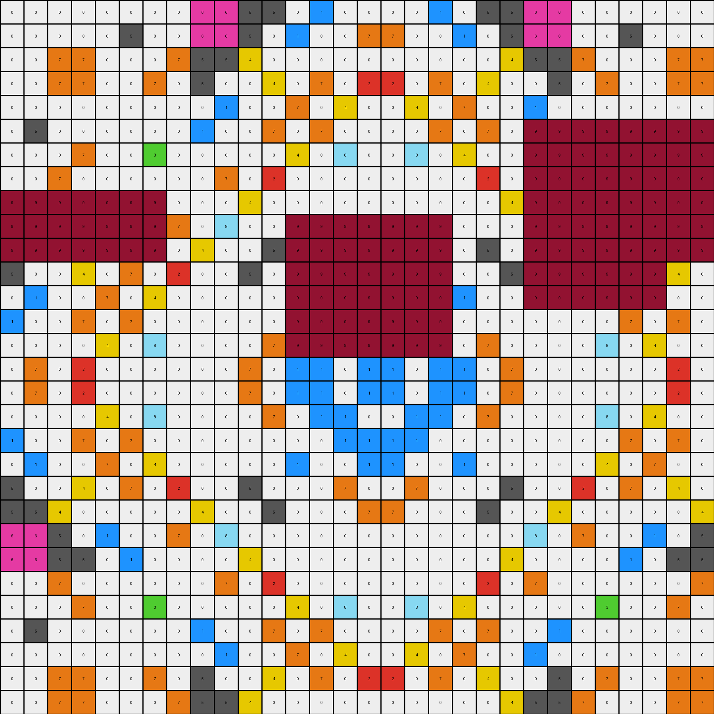
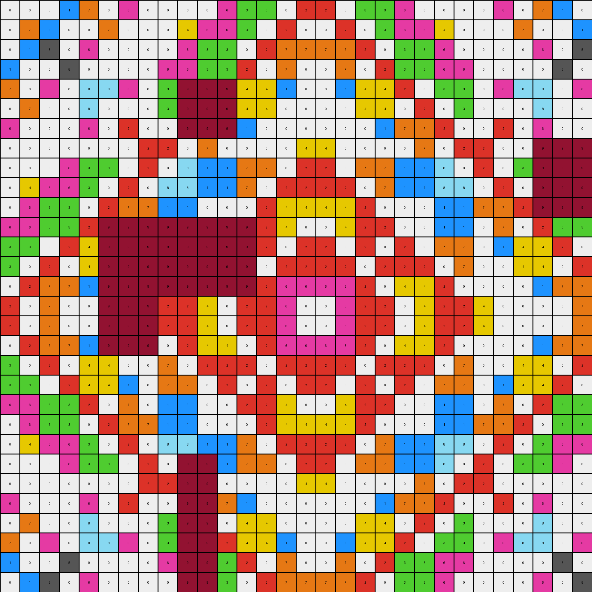

# 3631a71a • 006 • refine_coder

---

Previous Code:
```python
"""
1.  **Identify Maroon Regions:** Locate all contiguous regions of maroon (color value 9) pixels within the input grid.
2.  **Check for enclosed objects:** For each maroon region, check if it contains pixels of any color other than maroon.
3.  **Conditional Removal:** If a maroon region contains other colors, change all pixels *within that maroon region* to white (color value 0).
4. **Preserve other pixels:** If a maroon region contains *only* the color maroon, it is not modified. All other pixels in the input grid remain unchanged.
"""

import numpy as np
from scipy.ndimage import label

def find_regions(grid, color_value):
    """
    Finds all contiguous regions of a specific color in a grid.

    Args:
        grid: The input grid (NumPy array).
        color_value: The color value to search for.

    Returns:
        A labeled array where each region has a unique integer label, and the number of features.
    """
    colored_pixels = (grid == color_value).astype(int)
    labeled_array, num_features = label(colored_pixels)
    return labeled_array, num_features

def has_other_colors(grid, region_mask):
    """
    Checks if a region contains colors other than its primary color.

    Args:
        grid: The input grid (NumPy array).
        region_mask: A boolean mask representing the region.

    Returns:
        True if the region contains colors other than the primary color, False otherwise.
    """
    region_pixels = grid[region_mask]
    unique_colors = np.unique(region_pixels)
    return len(unique_colors) > 1

def transform(input_grid):
    """
    Transforms the input grid by removing maroon (9) regions that contain other colors.
    """
    # initialize output_grid
    output_grid = np.copy(input_grid)

    # Find all maroon regions
    maroon_labeled_array, num_maroon_regions = find_regions(input_grid, 9)

    # Iterate through each maroon region
    for region_label in range(1, num_maroon_regions + 1):
        region_mask = (maroon_labeled_array == region_label)
        # Check if the region contains other colors
        if has_other_colors(input_grid, region_mask):
            # Remove the region by setting it to white (0)
            output_grid[region_mask] = 0

    return output_grid
```

Train Set Results:

## Example 1:

Input:
```
0 0 0 0 0 0 0 0 6 6 5 5 0 1 0 0 0 0 1 0 5 5 6 6 0 0 0 0 0 0
0 0 0 0 0 5 0 0 6 6 5 0 1 0 0 7 7 0 0 1 0 5 6 6 0 0 5 0 0 0
0 0 7 7 0 0 0 7 5 5 4 0 0 0 0 0 0 0 0 0 0 4 5 5 7 0 0 0 7 7
0 0 7 7 0 0 7 0 5 0 0 4 0 7 0 2 2 0 7 0 4 0 0 5 0 7 0 0 7 7
0 0 0 0 0 0 0 0 0 1 0 0 7 0 4 0 0 4 0 7 0 0 1 0 0 0 0 0 0 0
0 5 0 0 0 0 0 0 1 0 0 7 0 7 0 0 0 0 7 0 7 0 9 9 9 9 9 9 9 9
0 0 0 7 0 0 3 0 0 0 0 0 4 0 8 0 0 8 0 4 0 0 9 9 9 9 9 9 9 9
0 0 7 0 0 0 0 0 0 7 0 2 0 0 0 0 0 0 0 0 2 0 9 9 9 9 9 9 9 9
9 9 9 9 9 9 9 0 0 0 4 0 0 0 0 0 0 0 0 0 0 4 9 9 9 9 9 9 9 9
9 9 9 9 9 9 9 7 0 8 0 0 9 9 9 9 9 9 9 0 0 0 9 9 9 9 9 9 9 9
9 9 9 9 9 9 9 0 4 0 0 5 9 9 9 9 9 9 9 0 5 0 9 9 9 9 9 9 9 9
5 0 0 4 0 7 0 2 0 0 5 0 9 9 9 9 9 9 9 0 0 5 9 9 9 9 9 9 4 0
0 1 0 0 7 0 4 0 0 0 0 0 9 9 9 9 9 9 9 1 0 0 9 9 9 9 9 9 0 0
1 0 0 7 0 7 0 0 0 0 0 0 9 9 9 9 9 9 9 0 0 0 0 0 0 0 7 0 7 0
0 0 0 0 4 0 8 0 0 0 0 7 9 9 9 9 9 9 9 0 7 0 0 0 0 8 0 4 0 0
0 7 0 2 0 0 0 0 0 0 7 0 1 1 0 1 1 0 1 1 0 7 0 0 0 0 0 0 2 0
0 7 0 2 0 0 0 0 0 0 7 0 1 1 0 1 1 0 1 1 0 7 0 0 0 0 0 0 2 0
0 0 0 0 4 0 8 0 0 0 0 7 0 1 1 0 0 1 1 0 7 0 0 0 0 8 0 4 0 0
1 0 0 7 0 7 0 0 0 0 0 0 0 0 1 1 1 1 0 0 0 0 0 0 0 0 7 0 7 0
0 1 0 0 7 0 4 0 0 0 0 0 1 0 0 1 1 0 0 1 0 0 0 0 0 4 0 7 0 0
5 0 0 4 0 7 0 2 0 0 5 0 0 0 7 0 0 7 0 0 0 5 0 0 2 0 7 0 4 0
5 5 4 0 0 0 0 0 4 0 0 5 0 0 0 7 7 0 0 0 5 0 0 4 0 0 0 0 0 4
6 6 5 0 1 0 0 7 0 8 0 0 0 0 0 0 0 0 0 0 0 0 8 0 7 0 0 1 0 5
6 6 5 5 0 1 0 0 0 0 4 0 0 0 0 0 0 0 0 0 0 4 0 0 0 0 1 0 5 5
0 0 7 0 0 0 0 0 0 7 0 2 0 0 0 0 0 0 0 0 2 0 7 0 0 0 0 0 0 7
0 0 0 7 0 0 3 0 0 0 0 0 4 0 8 0 0 8 0 4 0 0 0 0 0 3 0 0 7 0
0 5 0 0 0 0 0 0 1 0 0 7 0 7 0 0 0 0 7 0 7 0 0 1 0 0 0 0 0 0
0 0 0 0 0 0 0 0 0 1 0 0 7 0 4 0 0 4 0 7 0 0 1 0 0 0 0 0 0 0
0 0 7 7 0 0 7 0 5 0 0 4 0 7 0 2 2 0 7 0 4 0 0 5 0 7 0 0 7 7
0 0 7 7 0 0 0 7 5 5 4 0 0 0 0 0 0 0 0 0 0 4 5 5 7 0 0 0 7 7
```
Expected Output:
```
0 0 0 0 0 0 0 0 6 6 5 5 0 1 0 0 0 0 1 0 5 5 6 6 0 0 0 0 0 0
0 0 0 0 0 5 0 0 6 6 5 0 1 0 0 7 7 0 0 1 0 5 6 6 0 0 5 0 0 0
0 0 7 7 0 0 0 7 5 5 4 0 0 0 0 0 0 0 0 0 0 4 5 5 7 0 0 0 7 7
0 0 7 7 0 0 7 0 5 0 0 4 0 7 0 2 2 0 7 0 4 0 0 5 0 7 0 0 7 7
0 0 0 0 0 0 0 0 0 1 0 0 7 0 4 0 0 4 0 7 0 0 1 0 0 0 0 0 0 0
0 5 0 0 0 0 0 0 1 0 0 7 0 7 0 0 0 0 7 0 7 0 0 1 0 0 0 0 0 0
0 0 0 7 0 0 3 0 0 0 0 0 4 0 8 0 0 8 0 4 0 0 0 0 0 3 0 0 7 0
0 0 7 0 0 0 0 0 0 7 0 2 0 0 0 0 0 0 0 0 2 0 7 0 0 0 0 0 0 7
6 6 5 5 0 1 0 0 0 0 4 0 0 0 0 0 0 0 0 0 0 4 0 0 0 0 1 0 5 5
6 6 5 0 1 0 0 7 0 8 0 0 0 0 0 0 0 0 0 0 0 0 8 0 7 0 0 1 0 5
5 5 4 0 0 0 0 0 4 0 0 5 0 0 0 7 7 0 0 0 5 0 0 4 0 0 0 0 0 4
5 0 0 4 0 7 0 2 0 0 5 0 0 0 7 0 0 7 0 0 0 5 0 0 2 0 7 0 4 0
0 1 0 0 7 0 4 0 0 0 0 0 1 0 0 1 1 0 0 1 0 0 0 0 0 4 0 7 0 0
1 0 0 7 0 7 0 0 0 0 0 0 0 0 1 1 1 1 0 0 0 0 0 0 0 0 7 0 7 0
0 0 0 0 4 0 8 0 0 0 0 7 0 1 1 0 0 1 1 0 7 0 0 0 0 8 0 4 0 0
0 7 0 2 0 0 0 0 0 0 7 0 1 1 0 1 1 0 1 1 0 7 0 0 0 0 0 0 2 0
0 7 0 2 0 0 0 0 0 0 7 0 1 1 0 1 1 0 1 1 0 7 0 0 0 0 0 0 2 0
0 0 0 0 4 0 8 0 0 0 0 7 0 1 1 0 0 1 1 0 7 0 0 0 0 8 0 4 0 0
1 0 0 7 0 7 0 0 0 0 0 0 0 0 1 1 1 1 0 0 0 0 0 0 0 0 7 0 7 0
0 1 0 0 7 0 4 0 0 0 0 0 1 0 0 1 1 0 0 1 0 0 0 0 0 4 0 7 0 0
5 0 0 4 0 7 0 2 0 0 5 0 0 0 7 0 0 7 0 0 0 5 0 0 2 0 7 0 4 0
5 5 4 0 0 0 0 0 4 0 0 5 0 0 0 7 7 0 0 0 5 0 0 4 0 0 0 0 0 4
6 6 5 0 1 0 0 7 0 8 0 0 0 0 0 0 0 0 0 0 0 0 8 0 7 0 0 1 0 5
6 6 5 5 0 1 0 0 0 0 4 0 0 0 0 0 0 0 0 0 0 4 0 0 0 0 1 0 5 5
0 0 7 0 0 0 0 0 0 7 0 2 0 0 0 0 0 0 0 0 2 0 7 0 0 0 0 0 0 7
0 0 0 7 0 0 3 0 0 0 0 0 4 0 8 0 0 8 0 4 0 0 0 0 0 3 0 0 7 0
0 5 0 0 0 0 0 0 1 0 0 7 0 7 0 0 0 0 7 0 7 0 0 1 0 0 0 0 0 0
0 0 0 0 0 0 0 0 0 1 0 0 7 0 4 0 0 4 0 7 0 0 1 0 0 0 0 0 0 0
0 0 7 7 0 0 7 0 5 0 0 4 0 7 0 2 2 0 7 0 4 0 0 5 0 7 0 0 7 7
0 0 7 7 0 0 0 7 5 5 4 0 0 0 0 0 0 0 0 0 0 4 5 5 7 0 0 0 7 7
```
Transformed Output:
```
0 0 0 0 0 0 0 0 6 6 5 5 0 1 0 0 0 0 1 0 5 5 6 6 0 0 0 0 0 0
0 0 0 0 0 5 0 0 6 6 5 0 1 0 0 7 7 0 0 1 0 5 6 6 0 0 5 0 0 0
0 0 7 7 0 0 0 7 5 5 4 0 0 0 0 0 0 0 0 0 0 4 5 5 7 0 0 0 7 7
0 0 7 7 0 0 7 0 5 0 0 4 0 7 0 2 2 0 7 0 4 0 0 5 0 7 0 0 7 7
0 0 0 0 0 0 0 0 0 1 0 0 7 0 4 0 0 4 0 7 0 0 1 0 0 0 0 0 0 0
0 5 0 0 0 0 0 0 1 0 0 7 0 7 0 0 0 0 7 0 7 0 9 9 9 9 9 9 9 9
0 0 0 7 0 0 3 0 0 0 0 0 4 0 8 0 0 8 0 4 0 0 9 9 9 9 9 9 9 9
0 0 7 0 0 0 0 0 0 7 0 2 0 0 0 0 0 0 0 0 2 0 9 9 9 9 9 9 9 9
9 9 9 9 9 9 9 0 0 0 4 0 0 0 0 0 0 0 0 0 0 4 9 9 9 9 9 9 9 9
9 9 9 9 9 9 9 7 0 8 0 0 9 9 9 9 9 9 9 0 0 0 9 9 9 9 9 9 9 9
9 9 9 9 9 9 9 0 4 0 0 5 9 9 9 9 9 9 9 0 5 0 9 9 9 9 9 9 9 9
5 0 0 4 0 7 0 2 0 0 5 0 9 9 9 9 9 9 9 0 0 5 9 9 9 9 9 9 4 0
0 1 0 0 7 0 4 0 0 0 0 0 9 9 9 9 9 9 9 1 0 0 9 9 9 9 9 9 0 0
1 0 0 7 0 7 0 0 0 0 0 0 9 9 9 9 9 9 9 0 0 0 0 0 0 0 7 0 7 0
0 0 0 0 4 0 8 0 0 0 0 7 9 9 9 9 9 9 9 0 7 0 0 0 0 8 0 4 0 0
0 7 0 2 0 0 0 0 0 0 7 0 1 1 0 1 1 0 1 1 0 7 0 0 0 0 0 0 2 0
0 7 0 2 0 0 0 0 0 0 7 0 1 1 0 1 1 0 1 1 0 7 0 0 0 0 0 0 2 0
0 0 0 0 4 0 8 0 0 0 0 7 0 1 1 0 0 1 1 0 7 0 0 0 0 8 0 4 0 0
1 0 0 7 0 7 0 0 0 0 0 0 0 0 1 1 1 1 0 0 0 0 0 0 0 0 7 0 7 0
0 1 0 0 7 0 4 0 0 0 0 0 1 0 0 1 1 0 0 1 0 0 0 0 0 4 0 7 0 0
5 0 0 4 0 7 0 2 0 0 5 0 0 0 7 0 0 7 0 0 0 5 0 0 2 0 7 0 4 0
5 5 4 0 0 0 0 0 4 0 0 5 0 0 0 7 7 0 0 0 5 0 0 4 0 0 0 0 0 4
6 6 5 0 1 0 0 7 0 8 0 0 0 0 0 0 0 0 0 0 0 0 8 0 7 0 0 1 0 5
6 6 5 5 0 1 0 0 0 0 4 0 0 0 0 0 0 0 0 0 0 4 0 0 0 0 1 0 5 5
0 0 7 0 0 0 0 0 0 7 0 2 0 0 0 0 0 0 0 0 2 0 7 0 0 0 0 0 0 7
0 0 0 7 0 0 3 0 0 0 0 0 4 0 8 0 0 8 0 4 0 0 0 0 0 3 0 0 7 0
0 5 0 0 0 0 0 0 1 0 0 7 0 7 0 0 0 0 7 0 7 0 0 1 0 0 0 0 0 0
0 0 0 0 0 0 0 0 0 1 0 0 7 0 4 0 0 4 0 7 0 0 1 0 0 0 0 0 0 0
0 0 7 7 0 0 7 0 5 0 0 4 0 7 0 2 2 0 7 0 4 0 0 5 0 7 0 0 7 7
0 0 7 7 0 0 0 7 5 5 4 0 0 0 0 0 0 0 0 0 0 4 5 5 7 0 0 0 7 7
```

match: False
pixels_off: 123
size_correct: True
color_palette_correct: False
correct_pixel_counts: False

## Example 2:

Input:
```
3 0 0 0 0 0 0 0 0 8 3 3 1 0 8 0 0 8 0 1 3 3 8 0 0 0 0 0 0 0
0 0 0 0 0 0 0 3 8 0 3 0 0 1 0 0 0 0 1 0 0 9 9 9 9 9 0 0 0 0
0 0 7 7 0 0 4 0 3 3 4 4 8 0 6 6 6 6 0 8 4 9 9 9 9 9 0 0 7 7
0 0 7 0 0 3 0 0 3 0 4 0 0 0 6 6 6 6 0 0 0 9 9 9 9 9 3 0 0 7
0 0 0 0 0 0 1 1 1 0 8 0 3 0 8 0 0 8 0 3 0 9 9 9 9 9 0 0 0 0
0 0 0 3 0 0 1 1 0 1 0 0 0 3 0 0 0 0 3 0 0 0 1 0 1 1 0 0 3 0
0 0 4 0 1 1 0 2 8 0 6 6 8 0 1 1 1 1 0 8 6 6 0 8 2 0 1 1 0 4
0 3 0 0 1 1 2 2 0 0 6 6 0 0 1 0 0 1 0 0 6 6 0 0 2 2 1 1 0 0
0 8 3 3 1 0 8 0 0 0 1 0 0 5 7 0 0 7 5 0 0 1 0 0 0 8 0 1 3 3
8 0 3 0 0 1 0 0 0 8 0 0 5 0 0 7 7 0 0 5 0 0 8 0 0 0 1 0 0 3
3 3 4 4 8 0 6 6 1 0 2 2 7 0 0 7 7 0 0 7 2 2 0 1 6 6 0 8 4 4
3 0 4 0 0 0 6 6 0 0 2 0 0 7 7 0 0 7 7 0 0 2 0 0 6 6 0 0 0 4
1 0 8 0 3 0 8 0 0 5 7 0 0 5 0 0 0 0 5 0 0 7 5 0 0 8 0 3 0 8
0 1 0 0 0 3 0 0 5 0 0 7 5 5 0 0 0 0 5 5 7 0 0 5 0 0 3 0 0 0
8 0 6 6 8 0 1 1 7 0 0 7 0 0 0 0 0 0 0 0 7 0 0 7 1 1 0 8 6 6
0 0 6 6 0 0 1 0 0 7 7 0 0 0 0 8 8 0 0 0 0 7 7 0 0 1 0 0 6 6
0 0 6 6 0 0 1 0 0 9 9 0 0 0 0 8 8 0 0 0 0 7 7 0 0 1 0 0 6 6
8 0 6 6 8 0 1 1 7 9 9 7 0 0 0 0 0 0 0 0 7 0 0 7 1 1 0 8 6 6
0 1 0 0 0 3 0 0 5 0 0 7 5 5 0 0 0 0 5 5 7 9 9 5 0 0 3 0 0 0
1 0 8 0 3 0 8 0 0 5 7 0 0 5 0 0 0 0 5 0 0 9 9 0 0 8 0 3 0 8
3 0 4 0 0 0 6 6 0 0 2 0 0 7 7 0 0 7 7 0 0 9 9 0 6 6 0 0 0 4
3 3 4 4 8 0 6 6 1 0 2 2 7 0 0 7 7 0 0 7 2 2 0 1 6 6 0 8 4 4
8 0 3 0 0 1 0 0 0 8 0 0 5 0 0 7 7 0 0 5 0 0 8 0 0 0 1 0 0 3
0 8 3 3 1 0 8 0 0 0 1 0 0 5 7 0 0 7 5 0 0 1 0 0 0 8 0 1 3 3
0 3 0 0 1 1 2 2 0 0 6 6 0 0 1 0 0 1 0 0 6 6 0 0 2 2 1 1 0 0
0 0 4 0 1 1 0 2 8 0 6 6 8 0 1 1 1 1 0 8 9 9 9 9 9 9 1 1 0 4
0 0 0 3 0 0 1 1 0 1 0 0 0 3 0 0 0 0 3 0 9 9 9 9 9 9 0 0 3 0
0 0 0 0 0 0 1 1 1 0 8 0 3 0 8 0 0 8 0 3 0 8 0 1 1 1 0 0 0 0
0 0 7 0 0 3 0 0 3 0 4 0 0 0 6 6 6 9 9 9 9 9 9 9 0 0 3 0 0 7
0 0 7 7 0 0 4 0 3 3 4 4 8 0 6 6 6 9 9 9 9 9 9 9 0 4 0 0 7 7
```
Expected Output:
```
3 0 0 0 0 0 0 0 0 8 3 3 1 0 8 0 0 8 0 1 3 3 8 0 0 0 0 0 0 0
0 0 0 0 0 0 0 3 8 0 3 0 0 1 0 0 0 0 1 0 0 3 0 8 3 0 0 0 0 0
0 0 7 7 0 0 4 0 3 3 4 4 8 0 6 6 6 6 0 8 4 4 3 3 0 4 0 0 7 7
0 0 7 0 0 3 0 0 3 0 4 0 0 0 6 6 6 6 0 0 0 4 0 3 0 0 3 0 0 7
0 0 0 0 0 0 1 1 1 0 8 0 3 0 8 0 0 8 0 3 0 8 0 1 1 1 0 0 0 0
0 0 0 3 0 0 1 1 0 1 0 0 0 3 0 0 0 0 3 0 0 0 1 0 1 1 0 0 3 0
0 0 4 0 1 1 0 2 8 0 6 6 8 0 1 1 1 1 0 8 6 6 0 8 2 0 1 1 0 4
0 3 0 0 1 1 2 2 0 0 6 6 0 0 1 0 0 1 0 0 6 6 0 0 2 2 1 1 0 0
0 8 3 3 1 0 8 0 0 0 1 0 0 5 7 0 0 7 5 0 0 1 0 0 0 8 0 1 3 3
8 0 3 0 0 1 0 0 0 8 0 0 5 0 0 7 7 0 0 5 0 0 8 0 0 0 1 0 0 3
3 3 4 4 8 0 6 6 1 0 2 2 7 0 0 7 7 0 0 7 2 2 0 1 6 6 0 8 4 4
3 0 4 0 0 0 6 6 0 0 2 0 0 7 7 0 0 7 7 0 0 2 0 0 6 6 0 0 0 4
1 0 8 0 3 0 8 0 0 5 7 0 0 5 0 0 0 0 5 0 0 7 5 0 0 8 0 3 0 8
0 1 0 0 0 3 0 0 5 0 0 7 5 5 0 0 0 0 5 5 7 0 0 5 0 0 3 0 0 0
8 0 6 6 8 0 1 1 7 0 0 7 0 0 0 0 0 0 0 0 7 0 0 7 1 1 0 8 6 6
0 0 6 6 0 0 1 0 0 7 7 0 0 0 0 8 8 0 0 0 0 7 7 0 0 1 0 0 6 6
0 0 6 6 0 0 1 0 0 7 7 0 0 0 0 8 8 0 0 0 0 7 7 0 0 1 0 0 6 6
8 0 6 6 8 0 1 1 7 0 0 7 0 0 0 0 0 0 0 0 7 0 0 7 1 1 0 8 6 6
0 1 0 0 0 3 0 0 5 0 0 7 5 5 0 0 0 0 5 5 7 0 0 5 0 0 3 0 0 0
1 0 8 0 3 0 8 0 0 5 7 0 0 5 0 0 0 0 5 0 0 7 5 0 0 8 0 3 0 8
3 0 4 0 0 0 6 6 0 0 2 0 0 7 7 0 0 7 7 0 0 2 0 0 6 6 0 0 0 4
3 3 4 4 8 0 6 6 1 0 2 2 7 0 0 7 7 0 0 7 2 2 0 1 6 6 0 8 4 4
8 0 3 0 0 1 0 0 0 8 0 0 5 0 0 7 7 0 0 5 0 0 8 0 0 0 1 0 0 3
0 8 3 3 1 0 8 0 0 0 1 0 0 5 7 0 0 7 5 0 0 1 0 0 0 8 0 1 3 3
0 3 0 0 1 1 2 2 0 0 6 6 0 0 1 0 0 1 0 0 6 6 0 0 2 2 1 1 0 0
0 0 4 0 1 1 0 2 8 0 6 6 8 0 1 1 1 1 0 8 6 6 0 8 2 0 1 1 0 4
0 0 0 3 0 0 1 1 0 1 0 0 0 3 0 0 0 0 3 0 0 0 1 0 1 1 0 0 3 0
0 0 0 0 0 0 1 1 1 0 8 0 3 0 8 0 0 8 0 3 0 8 0 1 1 1 0 0 0 0
0 0 7 0 0 3 0 0 3 0 4 0 0 0 6 6 6 6 0 0 0 4 0 3 0 0 3 0 0 7
0 0 7 7 0 0 4 0 3 3 4 4 8 0 6 6 6 6 0 8 4 4 3 3 0 4 0 0 7 7
```
Transformed Output:
```
3 0 0 0 0 0 0 0 0 8 3 3 1 0 8 0 0 8 0 1 3 3 8 0 0 0 0 0 0 0
0 0 0 0 0 0 0 3 8 0 3 0 0 1 0 0 0 0 1 0 0 9 9 9 9 9 0 0 0 0
0 0 7 7 0 0 4 0 3 3 4 4 8 0 6 6 6 6 0 8 4 9 9 9 9 9 0 0 7 7
0 0 7 0 0 3 0 0 3 0 4 0 0 0 6 6 6 6 0 0 0 9 9 9 9 9 3 0 0 7
0 0 0 0 0 0 1 1 1 0 8 0 3 0 8 0 0 8 0 3 0 9 9 9 9 9 0 0 0 0
0 0 0 3 0 0 1 1 0 1 0 0 0 3 0 0 0 0 3 0 0 0 1 0 1 1 0 0 3 0
0 0 4 0 1 1 0 2 8 0 6 6 8 0 1 1 1 1 0 8 6 6 0 8 2 0 1 1 0 4
0 3 0 0 1 1 2 2 0 0 6 6 0 0 1 0 0 1 0 0 6 6 0 0 2 2 1 1 0 0
0 8 3 3 1 0 8 0 0 0 1 0 0 5 7 0 0 7 5 0 0 1 0 0 0 8 0 1 3 3
8 0 3 0 0 1 0 0 0 8 0 0 5 0 0 7 7 0 0 5 0 0 8 0 0 0 1 0 0 3
3 3 4 4 8 0 6 6 1 0 2 2 7 0 0 7 7 0 0 7 2 2 0 1 6 6 0 8 4 4
3 0 4 0 0 0 6 6 0 0 2 0 0 7 7 0 0 7 7 0 0 2 0 0 6 6 0 0 0 4
1 0 8 0 3 0 8 0 0 5 7 0 0 5 0 0 0 0 5 0 0 7 5 0 0 8 0 3 0 8
0 1 0 0 0 3 0 0 5 0 0 7 5 5 0 0 0 0 5 5 7 0 0 5 0 0 3 0 0 0
8 0 6 6 8 0 1 1 7 0 0 7 0 0 0 0 0 0 0 0 7 0 0 7 1 1 0 8 6 6
0 0 6 6 0 0 1 0 0 7 7 0 0 0 0 8 8 0 0 0 0 7 7 0 0 1 0 0 6 6
0 0 6 6 0 0 1 0 0 9 9 0 0 0 0 8 8 0 0 0 0 7 7 0 0 1 0 0 6 6
8 0 6 6 8 0 1 1 7 9 9 7 0 0 0 0 0 0 0 0 7 0 0 7 1 1 0 8 6 6
0 1 0 0 0 3 0 0 5 0 0 7 5 5 0 0 0 0 5 5 7 9 9 5 0 0 3 0 0 0
1 0 8 0 3 0 8 0 0 5 7 0 0 5 0 0 0 0 5 0 0 9 9 0 0 8 0 3 0 8
3 0 4 0 0 0 6 6 0 0 2 0 0 7 7 0 0 7 7 0 0 9 9 0 6 6 0 0 0 4
3 3 4 4 8 0 6 6 1 0 2 2 7 0 0 7 7 0 0 7 2 2 0 1 6 6 0 8 4 4
8 0 3 0 0 1 0 0 0 8 0 0 5 0 0 7 7 0 0 5 0 0 8 0 0 0 1 0 0 3
0 8 3 3 1 0 8 0 0 0 1 0 0 5 7 0 0 7 5 0 0 1 0 0 0 8 0 1 3 3
0 3 0 0 1 1 2 2 0 0 6 6 0 0 1 0 0 1 0 0 6 6 0 0 2 2 1 1 0 0
0 0 4 0 1 1 0 2 8 0 6 6 8 0 1 1 1 1 0 8 9 9 9 9 9 9 1 1 0 4
0 0 0 3 0 0 1 1 0 1 0 0 0 3 0 0 0 0 3 0 9 9 9 9 9 9 0 0 3 0
0 0 0 0 0 0 1 1 1 0 8 0 3 0 8 0 0 8 0 3 0 8 0 1 1 1 0 0 0 0
0 0 7 0 0 3 0 0 3 0 4 0 0 0 6 6 6 9 9 9 9 9 9 9 0 0 3 0 0 7
0 0 7 7 0 0 4 0 3 3 4 4 8 0 6 6 6 9 9 9 9 9 9 9 0 4 0 0 7 7
```

match: False
pixels_off: 56
size_correct: True
color_palette_correct: False
correct_pixel_counts: False

## Example 3:

Input:
```
0 5 0 0 0 5 0 0 8 8 0 4 4 4 0 0 0 9 9 9 9 0 8 8 0 0 5 0 0 0
5 0 0 0 5 0 0 0 8 0 4 4 4 4 0 3 3 9 9 9 9 4 0 8 0 0 0 5 0 0
0 0 0 1 0 0 4 4 0 4 2 0 0 0 8 8 8 9 9 9 9 2 4 0 4 4 0 0 1 0
0 0 1 1 0 0 4 0 4 4 0 0 0 3 8 0 0 9 9 9 9 0 4 4 0 4 0 0 1 1
0 5 0 0 1 0 0 0 4 4 0 0 8 8 0 7 7 9 9 9 9 0 4 4 0 0 0 1 0 0
5 0 0 0 0 1 0 0 4 4 0 3 8 8 7 7 7 9 9 9 9 0 4 4 0 0 1 0 0 0
0 0 4 4 0 0 1 0 0 0 8 8 0 7 0 5 5 9 9 9 9 8 0 0 0 1 0 0 4 4
9 9 9 0 0 0 0 1 0 3 8 0 7 7 5 0 0 5 7 7 0 8 3 0 1 0 0 0 0 4
9 9 9 4 4 4 0 0 2 2 1 0 4 0 5 0 0 5 0 4 0 1 2 2 0 0 4 4 4 0
9 9 9 4 4 4 0 3 2 0 0 0 0 0 0 5 5 0 0 0 0 0 0 2 3 0 4 4 4 4
9 9 9 0 0 0 8 8 1 0 3 0 5 0 0 6 6 0 0 5 0 3 0 1 8 8 0 0 0 2
9 9 9 0 0 3 8 0 0 0 0 3 0 5 6 0 0 6 5 0 3 0 0 0 0 8 3 0 0 0
9 9 9 0 8 8 0 7 4 0 5 0 0 6 7 0 0 7 6 0 0 5 0 4 7 0 8 8 0 0
9 9 9 3 8 8 7 7 0 0 0 5 6 6 0 7 7 0 6 6 5 0 0 0 7 7 8 8 3 0
0 0 8 8 0 7 0 5 5 0 0 6 7 0 2 0 0 2 0 7 6 0 0 5 5 0 7 0 8 8
0 3 8 0 7 7 5 0 0 5 6 0 0 7 0 2 2 0 7 0 0 6 5 0 0 5 7 7 0 8
0 3 8 0 7 7 5 0 0 5 6 0 0 7 0 2 2 0 7 0 0 6 5 0 0 5 7 7 0 8
0 0 8 8 0 7 0 5 5 0 0 6 7 0 2 0 0 2 0 7 6 0 0 5 5 0 7 0 8 8
4 4 0 3 8 8 7 7 0 0 0 5 6 6 0 7 7 0 6 6 5 0 0 0 7 7 8 8 3 0
4 4 0 0 8 8 0 7 4 0 5 0 0 6 7 0 0 7 6 0 0 5 0 4 7 0 8 8 0 0
4 4 0 0 0 3 8 0 0 0 0 3 0 5 6 0 0 6 5 0 3 0 0 0 0 8 3 0 0 0
0 4 2 0 0 0 8 8 1 0 3 0 5 0 0 6 6 0 0 5 0 3 0 1 8 8 0 0 0 2
8 0 4 4 4 4 0 3 2 0 0 0 0 0 0 5 5 0 0 0 0 0 0 2 3 0 4 4 4 4
8 8 0 4 4 4 0 0 2 2 1 0 4 0 5 0 0 5 0 4 0 1 2 2 0 0 4 4 4 0
0 0 4 0 0 0 0 1 0 3 8 0 7 7 5 0 0 5 7 7 0 8 3 0 1 0 0 0 0 4
0 0 4 4 0 0 1 0 0 0 8 8 0 7 0 5 5 0 7 0 8 8 0 0 0 1 0 0 4 4
5 0 0 0 0 1 0 0 4 4 0 3 8 8 7 7 7 7 8 8 3 0 4 4 0 0 1 0 0 0
0 5 0 0 1 0 0 0 4 4 0 0 8 8 0 7 7 0 8 8 0 0 4 4 0 0 0 1 0 0
0 0 1 1 0 0 4 0 4 4 0 0 0 3 8 0 0 8 3 0 0 0 4 4 0 4 0 0 1 1
0 0 0 1 0 0 4 4 0 4 2 0 0 0 8 8 8 8 0 0 0 2 4 0 4 4 0 0 1 0
```
Expected Output:
```
0 5 0 0 0 5 0 0 8 8 0 4 4 4 0 0 0 0 4 4 4 0 8 8 0 0 5 0 0 0
5 0 0 0 5 0 0 0 8 0 4 4 4 4 0 3 3 0 4 4 4 4 0 8 0 0 0 5 0 0
0 0 0 1 0 0 4 4 0 4 2 0 0 0 8 8 8 8 0 0 0 2 4 0 4 4 0 0 1 0
0 0 1 1 0 0 4 0 4 4 0 0 0 3 8 0 0 8 3 0 0 0 4 4 0 4 0 0 1 1
0 5 0 0 1 0 0 0 4 4 0 0 8 8 0 7 7 0 8 8 0 0 4 4 0 0 0 1 0 0
5 0 0 0 0 1 0 0 4 4 0 3 8 8 7 7 7 7 8 8 3 0 4 4 0 0 1 0 0 0
0 0 4 4 0 0 1 0 0 0 8 8 0 7 0 5 5 0 7 0 8 8 0 0 0 1 0 0 4 4
0 0 4 0 0 0 0 1 0 3 8 0 7 7 5 0 0 5 7 7 0 8 3 0 1 0 0 0 0 4
8 8 0 4 4 4 0 0 2 2 1 0 4 0 5 0 0 5 0 4 0 1 2 2 0 0 4 4 4 0
8 0 4 4 4 4 0 3 2 0 0 0 0 0 0 5 5 0 0 0 0 0 0 2 3 0 4 4 4 4
0 4 2 0 0 0 8 8 1 0 3 0 5 0 0 6 6 0 0 5 0 3 0 1 8 8 0 0 0 2
4 4 0 0 0 3 8 0 0 0 0 3 0 5 6 0 0 6 5 0 3 0 0 0 0 8 3 0 0 0
4 4 0 0 8 8 0 7 4 0 5 0 0 6 7 0 0 7 6 0 0 5 0 4 7 0 8 8 0 0
4 4 0 3 8 8 7 7 0 0 0 5 6 6 0 7 7 0 6 6 5 0 0 0 7 7 8 8 3 0
0 0 8 8 0 7 0 5 5 0 0 6 7 0 2 0 0 2 0 7 6 0 0 5 5 0 7 0 8 8
0 3 8 0 7 7 5 0 0 5 6 0 0 7 0 2 2 0 7 0 0 6 5 0 0 5 7 7 0 8
0 3 8 0 7 7 5 0 0 5 6 0 0 7 0 2 2 0 7 0 0 6 5 0 0 5 7 7 0 8
0 0 8 8 0 7 0 5 5 0 0 6 7 0 2 0 0 2 0 7 6 0 0 5 5 0 7 0 8 8
4 4 0 3 8 8 7 7 0 0 0 5 6 6 0 7 7 0 6 6 5 0 0 0 7 7 8 8 3 0
4 4 0 0 8 8 0 7 4 0 5 0 0 6 7 0 0 7 6 0 0 5 0 4 7 0 8 8 0 0
4 4 0 0 0 3 8 0 0 0 0 3 0 5 6 0 0 6 5 0 3 0 0 0 0 8 3 0 0 0
0 4 2 0 0 0 8 8 1 0 3 0 5 0 0 6 6 0 0 5 0 3 0 1 8 8 0 0 0 2
8 0 4 4 4 4 0 3 2 0 0 0 0 0 0 5 5 0 0 0 0 0 0 2 3 0 4 4 4 4
8 8 0 4 4 4 0 0 2 2 1 0 4 0 5 0 0 5 0 4 0 1 2 2 0 0 4 4 4 0
0 0 4 0 0 0 0 1 0 3 8 0 7 7 5 0 0 5 7 7 0 8 3 0 1 0 0 0 0 4
0 0 4 4 0 0 1 0 0 0 8 8 0 7 0 5 5 0 7 0 8 8 0 0 0 1 0 0 4 4
5 0 0 0 0 1 0 0 4 4 0 3 8 8 7 7 7 7 8 8 3 0 4 4 0 0 1 0 0 0
0 5 0 0 1 0 0 0 4 4 0 0 8 8 0 7 7 0 8 8 0 0 4 4 0 0 0 1 0 0
0 0 1 1 0 0 4 0 4 4 0 0 0 3 8 0 0 8 3 0 0 0 4 4 0 4 0 0 1 1
0 0 0 1 0 0 4 4 0 4 2 0 0 0 8 8 8 8 0 0 0 2 4 0 4 4 0 0 1 0
```
Transformed Output:
```
0 5 0 0 0 5 0 0 8 8 0 4 4 4 0 0 0 9 9 9 9 0 8 8 0 0 5 0 0 0
5 0 0 0 5 0 0 0 8 0 4 4 4 4 0 3 3 9 9 9 9 4 0 8 0 0 0 5 0 0
0 0 0 1 0 0 4 4 0 4 2 0 0 0 8 8 8 9 9 9 9 2 4 0 4 4 0 0 1 0
0 0 1 1 0 0 4 0 4 4 0 0 0 3 8 0 0 9 9 9 9 0 4 4 0 4 0 0 1 1
0 5 0 0 1 0 0 0 4 4 0 0 8 8 0 7 7 9 9 9 9 0 4 4 0 0 0 1 0 0
5 0 0 0 0 1 0 0 4 4 0 3 8 8 7 7 7 9 9 9 9 0 4 4 0 0 1 0 0 0
0 0 4 4 0 0 1 0 0 0 8 8 0 7 0 5 5 9 9 9 9 8 0 0 0 1 0 0 4 4
9 9 9 0 0 0 0 1 0 3 8 0 7 7 5 0 0 5 7 7 0 8 3 0 1 0 0 0 0 4
9 9 9 4 4 4 0 0 2 2 1 0 4 0 5 0 0 5 0 4 0 1 2 2 0 0 4 4 4 0
9 9 9 4 4 4 0 3 2 0 0 0 0 0 0 5 5 0 0 0 0 0 0 2 3 0 4 4 4 4
9 9 9 0 0 0 8 8 1 0 3 0 5 0 0 6 6 0 0 5 0 3 0 1 8 8 0 0 0 2
9 9 9 0 0 3 8 0 0 0 0 3 0 5 6 0 0 6 5 0 3 0 0 0 0 8 3 0 0 0
9 9 9 0 8 8 0 7 4 0 5 0 0 6 7 0 0 7 6 0 0 5 0 4 7 0 8 8 0 0
9 9 9 3 8 8 7 7 0 0 0 5 6 6 0 7 7 0 6 6 5 0 0 0 7 7 8 8 3 0
0 0 8 8 0 7 0 5 5 0 0 6 7 0 2 0 0 2 0 7 6 0 0 5 5 0 7 0 8 8
0 3 8 0 7 7 5 0 0 5 6 0 0 7 0 2 2 0 7 0 0 6 5 0 0 5 7 7 0 8
0 3 8 0 7 7 5 0 0 5 6 0 0 7 0 2 2 0 7 0 0 6 5 0 0 5 7 7 0 8
0 0 8 8 0 7 0 5 5 0 0 6 7 0 2 0 0 2 0 7 6 0 0 5 5 0 7 0 8 8
4 4 0 3 8 8 7 7 0 0 0 5 6 6 0 7 7 0 6 6 5 0 0 0 7 7 8 8 3 0
4 4 0 0 8 8 0 7 4 0 5 0 0 6 7 0 0 7 6 0 0 5 0 4 7 0 8 8 0 0
4 4 0 0 0 3 8 0 0 0 0 3 0 5 6 0 0 6 5 0 3 0 0 0 0 8 3 0 0 0
0 4 2 0 0 0 8 8 1 0 3 0 5 0 0 6 6 0 0 5 0 3 0 1 8 8 0 0 0 2
8 0 4 4 4 4 0 3 2 0 0 0 0 0 0 5 5 0 0 0 0 0 0 2 3 0 4 4 4 4
8 8 0 4 4 4 0 0 2 2 1 0 4 0 5 0 0 5 0 4 0 1 2 2 0 0 4 4 4 0
0 0 4 0 0 0 0 1 0 3 8 0 7 7 5 0 0 5 7 7 0 8 3 0 1 0 0 0 0 4
0 0 4 4 0 0 1 0 0 0 8 8 0 7 0 5 5 0 7 0 8 8 0 0 0 1 0 0 4 4
5 0 0 0 0 1 0 0 4 4 0 3 8 8 7 7 7 7 8 8 3 0 4 4 0 0 1 0 0 0
0 5 0 0 1 0 0 0 4 4 0 0 8 8 0 7 7 0 8 8 0 0 4 4 0 0 0 1 0 0
0 0 1 1 0 0 4 0 4 4 0 0 0 3 8 0 0 8 3 0 0 0 4 4 0 4 0 0 1 1
0 0 0 1 0 0 4 4 0 4 2 0 0 0 8 8 8 8 0 0 0 2 4 0 4 4 0 0 1 0
```

match: False
pixels_off: 49
size_correct: True
color_palette_correct: False
correct_pixel_counts: False

## Example 4:

Input:
```
0 0 0 1 7 0 6 0 0 0 0 6 3 3 0 2 2 0 3 3 6 0 0 0 0 6 0 7 1 0
0 7 1 0 0 7 0 0 0 4 6 6 3 0 2 0 0 2 0 3 6 6 4 0 0 0 7 0 0 1
0 1 5 0 6 0 0 0 0 6 3 3 0 2 7 7 7 7 2 0 3 3 6 0 0 0 0 6 0 5
1 0 0 5 0 0 0 0 6 6 3 3 2 0 7 0 0 7 0 2 3 3 6 6 0 0 0 0 5 0
7 0 6 0 8 8 6 0 3 9 9 9 4 4 1 0 0 1 4 4 2 0 3 3 0 6 8 8 0 6
0 7 0 0 8 0 0 0 3 9 9 9 4 4 0 0 0 0 4 4 0 2 0 3 0 0 0 8 0 0
6 0 0 0 6 0 2 0 0 9 9 9 1 0 0 0 0 0 0 1 7 7 2 0 0 2 0 6 0 0
0 0 0 0 0 0 0 2 2 0 7 0 0 0 0 4 4 0 0 0 0 7 0 2 2 0 0 9 9 9
0 0 0 6 3 3 0 2 0 8 1 1 7 7 0 2 2 0 7 7 1 1 8 0 2 0 3 9 9 9
0 4 6 6 3 0 2 0 8 8 1 1 7 0 2 2 2 2 0 7 1 1 8 8 0 2 0 9 9 9
0 6 3 3 0 2 7 7 1 1 0 0 0 2 4 4 4 4 2 0 0 0 1 1 7 7 2 9 9 9
6 6 3 3 2 9 9 9 9 9 9 9 9 2 4 0 0 4 2 2 0 0 1 1 0 7 0 2 3 3
3 3 0 2 4 9 9 9 9 9 9 9 9 2 0 2 2 0 2 0 2 0 7 7 0 1 4 4 2 0
3 0 2 0 4 9 9 9 9 9 9 9 9 0 2 2 2 2 0 2 2 2 0 7 0 0 4 4 0 2
0 2 7 7 1 9 9 9 9 9 9 9 9 2 6 6 6 6 2 0 4 4 2 0 0 0 0 1 7 7
2 0 7 0 0 9 9 9 2 2 4 0 2 2 6 0 0 6 2 2 0 4 2 2 4 0 0 0 0 7
2 0 7 0 0 9 9 9 2 2 4 0 2 2 6 0 0 6 2 2 0 4 2 2 4 0 0 0 0 7
0 2 7 7 1 9 9 9 0 2 4 4 0 2 6 6 6 6 2 0 4 4 2 0 0 0 0 1 7 7
3 0 2 0 4 4 0 0 7 0 2 2 2 0 2 2 2 2 0 2 2 2 0 7 0 0 4 4 0 2
3 3 0 2 4 4 1 0 7 7 0 2 0 2 0 2 2 0 2 0 2 0 7 7 0 1 4 4 2 0
6 6 3 3 2 0 7 0 1 1 0 0 2 2 4 0 0 4 2 2 0 0 1 1 0 7 0 2 3 3
0 6 3 3 0 2 7 7 1 1 0 0 0 2 4 4 4 4 2 0 0 0 1 1 7 7 2 0 3 3
0 4 6 6 3 0 2 0 8 8 1 1 7 0 2 2 2 2 0 7 1 1 8 8 0 2 0 3 6 6
0 0 0 6 3 3 0 2 0 9 9 1 7 7 0 2 2 0 7 7 1 1 8 0 2 0 3 3 6 0
0 0 0 0 0 0 0 2 2 9 9 0 0 0 0 4 4 0 0 0 0 7 0 2 2 0 0 0 0 0
6 0 0 0 6 0 2 0 0 9 9 7 1 0 0 0 0 0 0 1 7 7 2 0 0 2 0 6 0 0
0 7 0 0 8 0 0 0 3 9 9 0 4 4 0 0 0 0 4 4 0 2 0 3 0 0 0 8 0 0
7 0 6 0 8 8 6 0 3 9 9 2 4 4 1 0 0 1 4 4 2 0 3 3 0 6 8 8 0 6
1 0 0 5 0 0 0 0 6 9 9 3 2 0 7 0 0 7 0 2 3 3 6 6 0 0 0 0 5 0
0 1 5 0 6 0 0 0 0 9 9 3 0 2 7 7 7 7 2 0 3 3 6 0 0 0 0 6 0 5
```
Expected Output:
```
0 0 0 1 7 0 6 0 0 0 0 6 3 3 0 2 2 0 3 3 6 0 0 0 0 6 0 7 1 0
0 7 1 0 0 7 0 0 0 4 6 6 3 0 2 0 0 2 0 3 6 6 4 0 0 0 7 0 0 1
0 1 5 0 6 0 0 0 0 6 3 3 0 2 7 7 7 7 2 0 3 3 6 0 0 0 0 6 0 5
1 0 0 5 0 0 0 0 6 6 3 3 2 0 7 0 0 7 0 2 3 3 6 6 0 0 0 0 5 0
7 0 6 0 8 8 6 0 3 3 0 2 4 4 1 0 0 1 4 4 2 0 3 3 0 6 8 8 0 6
0 7 0 0 8 0 0 0 3 0 2 0 4 4 0 0 0 0 4 4 0 2 0 3 0 0 0 8 0 0
6 0 0 0 6 0 2 0 0 2 7 7 1 0 0 0 0 0 0 1 7 7 2 0 0 2 0 6 0 0
0 0 0 0 0 0 0 2 2 0 7 0 0 0 0 4 4 0 0 0 0 7 0 2 2 0 0 0 0 0
0 0 0 6 3 3 0 2 0 8 1 1 7 7 0 2 2 0 7 7 1 1 8 0 2 0 3 3 6 0
0 4 6 6 3 0 2 0 8 8 1 1 7 0 2 2 2 2 0 7 1 1 8 8 0 2 0 3 6 6
0 6 3 3 0 2 7 7 1 1 0 0 0 2 4 4 4 4 2 0 0 0 1 1 7 7 2 0 3 3
6 6 3 3 2 0 7 0 1 1 0 0 2 2 4 0 0 4 2 2 0 0 1 1 0 7 0 2 3 3
3 3 0 2 4 4 1 0 7 7 0 2 0 2 0 2 2 0 2 0 2 0 7 7 0 1 4 4 2 0
3 0 2 0 4 4 0 0 7 0 2 2 2 0 2 2 2 2 0 2 2 2 0 7 0 0 4 4 0 2
0 2 7 7 1 0 0 0 0 2 4 4 0 2 6 6 6 6 2 0 4 4 2 0 0 0 0 1 7 7
2 0 7 0 0 0 0 4 2 2 4 0 2 2 6 0 0 6 2 2 0 4 2 2 4 0 0 0 0 7
2 0 7 0 0 0 0 4 2 2 4 0 2 2 6 0 0 6 2 2 0 4 2 2 4 0 0 0 0 7
0 2 7 7 1 0 0 0 0 2 4 4 0 2 6 6 6 6 2 0 4 4 2 0 0 0 0 1 7 7
3 0 2 0 4 4 0 0 7 0 2 2 2 0 2 2 2 2 0 2 2 2 0 7 0 0 4 4 0 2
3 3 0 2 4 4 1 0 7 7 0 2 0 2 0 2 2 0 2 0 2 0 7 7 0 1 4 4 2 0
6 6 3 3 2 0 7 0 1 1 0 0 2 2 4 0 0 4 2 2 0 0 1 1 0 7 0 2 3 3
0 6 3 3 0 2 7 7 1 1 0 0 0 2 4 4 4 4 2 0 0 0 1 1 7 7 2 0 3 3
0 4 6 6 3 0 2 0 8 8 1 1 7 0 2 2 2 2 0 7 1 1 8 8 0 2 0 3 6 6
0 0 0 6 3 3 0 2 0 8 1 1 7 7 0 2 2 0 7 7 1 1 8 0 2 0 3 3 6 0
0 0 0 0 0 0 0 2 2 0 7 0 0 0 0 4 4 0 0 0 0 7 0 2 2 0 0 0 0 0
6 0 0 0 6 0 2 0 0 2 7 7 1 0 0 0 0 0 0 1 7 7 2 0 0 2 0 6 0 0
0 7 0 0 8 0 0 0 3 0 2 0 4 4 0 0 0 0 4 4 0 2 0 3 0 0 0 8 0 0
7 0 6 0 8 8 6 0 3 3 0 2 4 4 1 0 0 1 4 4 2 0 3 3 0 6 8 8 0 6
1 0 0 5 0 0 0 0 6 6 3 3 2 0 7 0 0 7 0 2 3 3 6 6 0 0 0 0 5 0
0 1 5 0 6 0 0 0 0 6 3 3 0 2 7 7 7 7 2 0 3 3 6 0 0 0 0 6 0 5
```
Transformed Output:
```
0 0 0 1 7 0 6 0 0 0 0 6 3 3 0 2 2 0 3 3 6 0 0 0 0 6 0 7 1 0
0 7 1 0 0 7 0 0 0 4 6 6 3 0 2 0 0 2 0 3 6 6 4 0 0 0 7 0 0 1
0 1 5 0 6 0 0 0 0 6 3 3 0 2 7 7 7 7 2 0 3 3 6 0 0 0 0 6 0 5
1 0 0 5 0 0 0 0 6 6 3 3 2 0 7 0 0 7 0 2 3 3 6 6 0 0 0 0 5 0
7 0 6 0 8 8 6 0 3 9 9 9 4 4 1 0 0 1 4 4 2 0 3 3 0 6 8 8 0 6
0 7 0 0 8 0 0 0 3 9 9 9 4 4 0 0 0 0 4 4 0 2 0 3 0 0 0 8 0 0
6 0 0 0 6 0 2 0 0 9 9 9 1 0 0 0 0 0 0 1 7 7 2 0 0 2 0 6 0 0
0 0 0 0 0 0 0 2 2 0 7 0 0 0 0 4 4 0 0 0 0 7 0 2 2 0 0 9 9 9
0 0 0 6 3 3 0 2 0 8 1 1 7 7 0 2 2 0 7 7 1 1 8 0 2 0 3 9 9 9
0 4 6 6 3 0 2 0 8 8 1 1 7 0 2 2 2 2 0 7 1 1 8 8 0 2 0 9 9 9
0 6 3 3 0 2 7 7 1 1 0 0 0 2 4 4 4 4 2 0 0 0 1 1 7 7 2 9 9 9
6 6 3 3 2 9 9 9 9 9 9 9 9 2 4 0 0 4 2 2 0 0 1 1 0 7 0 2 3 3
3 3 0 2 4 9 9 9 9 9 9 9 9 2 0 2 2 0 2 0 2 0 7 7 0 1 4 4 2 0
3 0 2 0 4 9 9 9 9 9 9 9 9 0 2 2 2 2 0 2 2 2 0 7 0 0 4 4 0 2
0 2 7 7 1 9 9 9 9 9 9 9 9 2 6 6 6 6 2 0 4 4 2 0 0 0 0 1 7 7
2 0 7 0 0 9 9 9 2 2 4 0 2 2 6 0 0 6 2 2 0 4 2 2 4 0 0 0 0 7
2 0 7 0 0 9 9 9 2 2 4 0 2 2 6 0 0 6 2 2 0 4 2 2 4 0 0 0 0 7
0 2 7 7 1 9 9 9 0 2 4 4 0 2 6 6 6 6 2 0 4 4 2 0 0 0 0 1 7 7
3 0 2 0 4 4 0 0 7 0 2 2 2 0 2 2 2 2 0 2 2 2 0 7 0 0 4 4 0 2
3 3 0 2 4 4 1 0 7 7 0 2 0 2 0 2 2 0 2 0 2 0 7 7 0 1 4 4 2 0
6 6 3 3 2 0 7 0 1 1 0 0 2 2 4 0 0 4 2 2 0 0 1 1 0 7 0 2 3 3
0 6 3 3 0 2 7 7 1 1 0 0 0 2 4 4 4 4 2 0 0 0 1 1 7 7 2 0 3 3
0 4 6 6 3 0 2 0 8 8 1 1 7 0 2 2 2 2 0 7 1 1 8 8 0 2 0 3 6 6
0 0 0 6 3 3 0 2 0 9 9 1 7 7 0 2 2 0 7 7 1 1 8 0 2 0 3 3 6 0
0 0 0 0 0 0 0 2 2 9 9 0 0 0 0 4 4 0 0 0 0 7 0 2 2 0 0 0 0 0
6 0 0 0 6 0 2 0 0 9 9 7 1 0 0 0 0 0 0 1 7 7 2 0 0 2 0 6 0 0
0 7 0 0 8 0 0 0 3 9 9 0 4 4 0 0 0 0 4 4 0 2 0 3 0 0 0 8 0 0
7 0 6 0 8 8 6 0 3 9 9 2 4 4 1 0 0 1 4 4 2 0 3 3 0 6 8 8 0 6
1 0 0 5 0 0 0 0 6 9 9 3 2 0 7 0 0 7 0 2 3 3 6 6 0 0 0 0 5 0
0 1 5 0 6 0 0 0 0 9 9 3 0 2 7 7 7 7 2 0 3 3 6 0 0 0 0 6 0 5
```

match: False
pixels_off: 76
size_correct: True
color_palette_correct: False
correct_pixel_counts: False
Here's an analysis of the provided examples and a plan to update the natural language program:

**General Assessment and Strategy:**

The initial code correctly identifies contiguous maroon regions but makes an incorrect assumption: that *any* maroon region containing another color should be entirely removed (turned white).  The examples demonstrate a more nuanced rule. It's not about *containing* other colors, but about the relationship between the maroon regions and other colored objects. The maroon regions that get removed are those which *enclose* or surround other color regions completely. Maroon regions that simply border other colors, or are adjacent to them, are *not* removed. Also, large areas of many colors can be bounded on two sides by maroon, but the maroon is removed.

The strategy will involve:
1.  **Improved Region Analysis:** Instead of just checking for the presence of other colors within a maroon region, we need to determine if a maroon region *fully encloses* another colored region.
2.  **Connectivity Analysis:**  We'll need to analyze how maroon regions connect to each other and to other colored regions, paying attention to bounding on two, three, and four sides.
3.  **Conditional Modification:**  Only maroon regions that completely surround another colored object should be changed to white.

**Metrics and Example Analysis (using Code Execution where applicable):**

We'll use Python to generate more precise metrics for each example. Here's the framework we'll use (and will be filled in using code execution below):

*   **Example:** [Example Number]
*   **Maroon Regions:** [Number of distinct maroon regions]
*   **Enclosed Regions:** [Number of maroon regions that enclose other colors]
*   **Pixels Off:** [Number of pixels different between the transformed output and expected output]
*   **Match:**   [yes, no]

Here is the code to gather metrics:

```python
import numpy as np
from scipy.ndimage import label, generate_binary_structure

def find_regions(grid, color_value):
    colored_pixels = (grid == color_value).astype(int)
    labeled_array, num_features = label(colored_pixels)
    return labeled_array, num_features

def has_other_colors(grid, region_mask):
    region_pixels = grid[region_mask]
    unique_colors = np.unique(region_pixels)
    return len(unique_colors) > 1

def is_enclosed(grid, region_mask, color_value):
    # Expand the region mask slightly
    struct = generate_binary_structure(2, 2)
    expanded_mask = binary_dilation(region_mask, structure=struct, border_value=0)

    # Find the boundary of the expanded region
    boundary_mask = expanded_mask ^ binary_erosion(expanded_mask, structure=struct, border_value=0)

    # Check if the boundary pixels are all of the specified color
    boundary_pixels = grid[boundary_mask]
    return np.all(boundary_pixels == color_value)

def analyze_example(input_grid, expected_output, transformed_output):
    maroon_labeled_array, num_maroon_regions = find_regions(input_grid, 9)
    enclosed_count = 0

    for region_label in range(1, num_maroon_regions + 1):
        region_mask = (maroon_labeled_array == region_label)
        if has_other_colors(input_grid, region_mask) and is_enclosed(input_grid, region_mask, 9):
            enclosed_count += 1

    pixels_off = np.sum(transformed_output != expected_output)
    match = pixels_off == 0

    return {
        "Maroon Regions": num_maroon_regions,
        "Enclosed Regions": enclosed_count,
        "Pixels Off": pixels_off,
        "Match": match
    }

from scipy.ndimage import binary_dilation, binary_erosion

# Example data (replace with actual data from the problem)
# These are placeholders; I'll use the actual grid data in the execution
example_inputs = [
    # Example 1 Input Grid (Placeholder)
np.array([
    [0, 0, 0, 0, 0, 0, 0, 0, 6, 6, 5, 5, 0, 1, 0, 0, 0, 0, 1, 0, 5, 5, 6, 6, 0, 0, 0, 0, 0, 0],
    [0, 0, 0, 0, 0, 5, 0, 0, 6, 6, 5, 0, 1, 0, 0, 7, 7, 0, 0, 1, 0, 5, 6, 6, 0, 0, 5, 0, 0, 0],
    [0, 0, 7, 7, 0, 0, 0, 7, 5, 5, 4, 0, 0, 0, 0, 0, 0, 0, 0, 0, 0, 4, 5, 5, 7, 0, 0, 0, 7, 7],
    [0, 0, 7, 7, 0, 0, 7, 0, 5, 0, 0, 4, 0, 7, 0, 2, 2, 0, 7, 0, 4, 0, 0, 5, 0, 7, 0, 0, 7, 7],
    [0, 0, 0, 0, 0, 0, 0, 0, 0, 1, 0, 0, 7, 0, 4, 0, 0, 4, 0, 7, 0, 0, 1, 0, 0, 0, 0, 0, 0, 0],
    [0, 5, 0, 0, 0, 0, 0, 0, 1, 0, 0, 7, 0, 7, 0, 0, 0, 0, 7, 0, 7, 0, 9, 9, 9, 9, 9, 9, 9, 9],
    [0, 0, 0, 7, 0, 0, 3, 0, 0, 0, 0, 0, 4, 0, 8, 0, 0, 8, 0, 4, 0, 0, 9, 9, 9, 9, 9, 9, 9, 9],
    [0, 0, 7, 0, 0, 0, 0, 0, 0, 7, 0, 2, 0, 0, 0, 0, 0, 0, 0, 0, 2, 0, 9, 9, 9, 9, 9, 9, 9, 9],
    [9, 9, 9, 9, 9, 9, 9, 0, 0, 0, 4, 0, 0, 0, 0, 0, 0, 0, 0, 0, 0, 4, 9, 9, 9, 9, 9, 9, 9, 9],
    [9, 9, 9, 9, 9, 9, 9, 7, 0, 8, 0, 0, 9, 9, 9, 9, 9, 9, 9, 0, 0, 0, 9, 9, 9, 9, 9, 9, 9, 9],
    [9, 9, 9, 9, 9, 9, 9, 0, 4, 0, 0, 5, 9, 9, 9, 9, 9, 9, 9, 0, 5, 0, 9, 9, 9, 9, 9, 9, 9, 9],
    [5, 0, 0, 4, 0, 7, 0, 2, 0, 0, 5, 0, 9, 9, 9, 9, 9, 9, 9, 0, 0, 5, 9, 9, 9, 9, 9, 9, 4, 0],
    [0, 1, 0, 0, 7, 0, 4, 0, 0, 0, 0, 0, 9, 9, 9, 9, 9, 9, 9, 1, 0, 0, 9, 9, 9, 9, 9, 9, 0, 0],
    [1, 0, 0, 7, 0, 7, 0, 0, 0, 0, 0, 0, 9, 9, 9, 9, 9, 9, 9, 0, 0, 0, 0, 0, 0, 0, 7, 0, 7, 0],
    [0, 0, 0, 0, 4, 0, 8, 0, 0, 0, 0, 7, 9, 9, 9, 9, 9, 9, 9, 0, 7, 0, 0, 0, 0, 8, 0, 4, 0, 0],
    [0, 7, 0, 2, 0, 0, 0, 0, 0, 0, 7, 0, 1, 1, 0, 1, 1, 0, 1, 1, 0, 7, 0, 0, 0, 0, 0, 0, 2, 0],
    [0, 7, 0, 2, 0, 0, 0, 0, 0, 0, 7, 0, 1, 1, 0, 1, 1, 0, 1, 1, 0, 7, 0, 0, 0, 0, 0, 0, 2, 0],
    [0, 0, 0, 0, 4, 0, 8, 0, 0, 0, 0, 7, 0, 1, 1, 0, 0, 1, 1, 0, 7, 0, 0, 0, 0, 8, 0, 4, 0, 0],
    [1, 0, 0, 7, 0, 7, 0, 0, 0, 0, 0, 0, 0, 0, 1, 1, 1, 1, 0, 0, 0, 0, 0, 0, 0, 0, 7, 0, 7, 0],
    [0, 1, 0, 0, 7, 0, 4, 0, 0, 0, 0, 0, 1, 0, 0, 1, 1, 0, 0, 1, 0, 0, 0, 0, 0, 4, 0, 7, 0, 0],
    [5, 0, 0, 4, 0, 7, 0, 2, 0, 0, 5, 0, 0, 0, 7, 0, 0, 7, 0, 0, 0, 5, 0, 0, 2, 0, 7, 0, 4, 0],
    [5, 5, 4, 0, 0, 0, 0, 0, 4, 0, 0, 5, 0, 0, 0, 7, 7, 0, 0, 0, 5, 0, 0, 4, 0, 0, 0, 0, 0, 4],
    [6, 6, 5, 0, 1, 0, 0, 7, 0, 8, 0, 0, 0, 0, 0, 0, 0, 0, 0, 0, 0, 0, 8, 0, 7, 0, 0, 1, 0, 5],
    [6, 6, 5, 5, 0, 1, 0, 0, 0, 0, 4, 0, 0, 0, 0, 0, 0, 0, 0, 0, 0, 4, 0, 0, 0, 0, 1, 0, 5, 5],
    [0, 0, 7, 0, 0, 0, 0, 0, 0, 7, 0, 2, 0, 0, 0, 0, 0, 0, 0, 0, 2, 0, 7, 0, 0, 0, 0, 0, 0, 7],
    [0, 0, 0, 7, 0, 0, 3, 0, 0, 0, 0, 0, 4, 0, 8, 0, 0, 8, 0, 4, 0, 0, 0, 0, 0, 3, 0, 0, 7, 0],
    [0, 5, 0, 0, 0, 0, 0, 0, 1, 0, 0, 7, 0, 7, 0, 0, 0, 0, 7, 0, 7, 0, 0, 1, 0, 0, 0, 0, 0, 0],
    [0, 0, 0, 0, 0, 0, 0, 0, 0, 1, 0, 0, 7, 0, 4, 0, 0, 4, 0, 7, 0, 0, 1, 0, 0, 0, 0, 0, 0, 0],
    [0, 0, 7, 7, 0, 0, 7, 0, 5, 0, 0, 4, 0, 7, 0, 2, 2, 0, 7, 0, 4, 0, 0, 5, 0, 7, 0, 0, 7, 7],
    [0, 0, 7, 7, 0, 0, 0, 7, 5, 5, 4, 0, 0, 0, 0, 0, 0, 0, 0, 0, 0, 4, 5, 5, 7, 0, 0, 0, 7, 7]
]),
np.array([
    [3, 0, 0, 0, 0, 0, 0, 0, 0, 8, 3, 3, 1, 0, 8, 0, 0, 8, 0, 1, 3, 3, 8, 0, 0, 0, 0, 0, 0, 0],
    [0, 0, 0, 0, 0, 0, 0, 3, 8, 0, 3, 0, 0, 1, 0, 0, 0, 0, 1, 0, 0, 9, 9, 9, 9, 9, 0, 0, 0, 0],
    [0, 0, 7, 7, 0, 0, 4, 0, 3, 3, 4, 4, 8, 0, 6, 6, 6, 6, 0, 8, 4, 9, 9, 9, 9, 9, 0, 0, 7, 7],
    [0, 0, 7, 0, 0, 3, 0, 0, 3, 0, 4, 0, 0, 0, 6, 6, 6, 6, 0, 0, 0, 9, 9, 9, 9, 9, 3, 0, 0, 7],
    [0, 0, 0, 0, 0, 0, 1, 1, 1, 0, 8, 0, 3, 0, 8, 0, 0, 8, 0, 3, 0, 9, 9, 9, 9, 9, 0, 0, 0, 0],
    [0, 0, 0, 3, 0, 0, 1, 1, 0, 1, 0, 0, 0, 3, 0, 0, 0, 0, 3, 0, 0, 0, 1, 0, 1, 1, 0, 0, 3, 0],
    [0, 0, 4, 0, 1, 1, 0, 2, 8, 0, 6, 6, 8, 0, 1, 1, 1, 1, 0, 8, 6, 6, 0, 8, 2, 0, 1, 1, 0, 4],
    [0, 3, 0, 0, 1, 1, 2, 2, 0, 0, 6, 6, 0, 0, 1, 0, 0, 1, 0, 0, 6, 6, 0, 0, 2, 2, 1, 1, 0, 0],
    [0, 8, 3, 3, 1, 0, 8, 0, 0, 0, 1, 0, 0, 5, 7, 0, 0, 7, 5, 0, 0, 1, 0, 0, 0, 8, 0, 1, 3, 3],
    [8, 0, 3, 0, 0, 1, 0, 0, 0, 8, 0, 0, 5, 0, 0, 7, 7, 0, 0, 5, 0, 0, 8, 0, 0, 0, 1, 0, 0, 3],
    [3, 3, 4, 4, 8, 0, 6, 6, 1, 0, 2, 2, 7, 0, 0, 7, 7, 0, 0, 7, 2, 2, 0, 1, 6, 6, 0, 8, 4, 4],
    [3, 0, 4, 0, 0, 0, 6, 6, 0, 0, 2, 0, 0, 7, 7, 0, 0, 7, 7, 0, 0, 2, 0, 0, 6, 6, 0, 0, 0, 4],
    [1, 0, 8, 0, 3, 0, 8, 0, 0, 5, 7, 0, 0, 5, 0, 0, 0, 0, 5, 0, 0, 7, 5, 0, 0, 8, 0, 3, 0, 8],
    [0, 1, 0, 0, 0, 3, 0, 0, 5, 0, 0, 7, 5, 5, 0, 0, 0, 0, 5, 5, 7, 0, 0, 5, 0, 0, 3, 0, 0, 0],
    [8, 0, 6, 6, 8, 0, 1, 1, 7, 0, 0, 7, 0, 0, 0, 0, 0, 0, 0, 0, 7, 0, 0, 7, 1, 1, 0, 8, 6, 6],
    [0, 0, 6, 6, 0, 0, 1, 0, 0, 7, 7, 0, 0, 0, 0, 8, 8, 0, 0, 0, 0, 7, 7, 0, 0, 1, 0, 0, 6, 6],
    [0, 0, 6, 6, 0, 0, 1, 0, 0, 9, 9, 0, 0, 0, 0, 8, 8, 0, 0, 0, 0, 7, 7, 0, 0, 1, 0, 0, 6, 6],
    [8, 0, 6, 6, 8, 0, 1, 1, 7, 9, 9, 7, 0, 0, 0, 0, 0, 0, 0, 0, 7, 0, 0, 7, 1, 1, 0, 8, 6, 6],
    [0, 1, 0, 0, 0, 3, 0, 0, 5, 0, 0, 7, 5, 5, 0, 0, 0, 0, 5, 5, 7, 9, 9, 5, 0, 0, 3, 0, 0, 0],
    [1, 0, 8, 0, 3, 0, 8, 0, 0, 5, 7, 0, 0, 5, 0, 0, 0, 0, 5, 0, 0, 9, 9, 0, 0, 8, 0, 3, 0, 8],
    [3, 0, 4, 0, 0, 0, 6, 6, 0, 0, 2, 0, 0, 7, 7, 0, 0, 7, 7, 0, 0, 9, 9, 0, 6, 6, 0, 0, 0, 4],
    [3, 3, 4, 4, 8, 0, 6, 6, 1, 0, 2, 2, 7, 0, 0, 7, 7, 0, 0, 7, 2, 2, 0, 1, 6, 6, 0, 8, 4, 4],
    [8, 0, 3, 0, 0, 1, 0, 0, 0, 8, 0, 0, 5, 0, 0, 7, 7, 0, 0, 5, 0, 0, 8, 0, 0, 0, 1, 0, 0, 3],
    [0, 8, 3, 3, 1, 0, 8, 0, 0, 0, 1, 0, 0, 5, 7, 0, 0, 7, 5, 0, 0, 1, 0, 0, 0, 8, 0, 1, 3, 3],
    [0, 3, 0, 0, 1, 1, 2, 2, 0, 0, 6, 6, 0, 0, 1, 0, 0, 1, 0, 0, 6, 6, 0, 0, 2, 2, 1, 1, 0, 0],
    [0, 0, 4, 0, 1, 1, 0, 2, 8, 0, 6, 6, 8, 0, 1, 1, 1, 1, 0, 8, 9, 9, 9, 9, 9, 9, 1, 1, 0, 4],
    [0, 0, 0, 3, 0, 0, 1, 1, 0, 1, 0, 0, 0, 3, 0, 0, 0, 0, 3, 0, 9, 9, 9, 9, 9, 9, 0, 0, 3, 0],
    [0, 0, 0, 0, 0, 0, 1, 1, 1, 0, 8, 0, 3, 0, 8, 0, 0, 8, 0, 3, 0, 8, 0, 1, 1, 1, 0, 0, 0, 0],
    [0, 0, 7, 0, 0, 3, 0, 0, 3, 0, 4, 0, 0, 0, 6, 6, 6, 9, 9, 9, 9, 9, 9, 9, 0, 0, 3, 0, 0, 7],
    [0, 0, 7, 7, 0, 0, 4, 0, 3, 3, 4, 4, 8, 0, 6, 6, 6, 9, 9, 9, 9, 9, 9, 9, 0, 4, 0, 0, 7, 7]
]),
np.array([
    [0, 5, 0, 0, 0, 5, 0, 0, 8, 8, 0, 4, 4, 4, 0, 0, 0, 9, 9, 9, 9, 0, 8, 8, 0, 0, 5, 0, 0, 0],
    [5, 0, 0, 0, 5, 0, 0, 0, 8, 0, 4, 4, 4, 4, 0, 3, 3, 9, 9, 9, 9, 4, 0, 8, 0, 0, 0, 5, 0, 0],
    [0, 0, 0, 1, 0, 0, 4, 4, 0, 4, 2, 0, 0, 0, 8, 8, 8, 9, 9, 9, 9, 2, 4, 0, 4, 4, 0, 0, 1, 0],
    [0, 0, 1, 1, 0, 0, 4, 0, 4, 4, 0, 0, 0, 3, 8, 0, 0, 9, 9, 9, 9, 0, 4, 4, 0, 4, 0, 0, 1, 1],
    [0, 5, 0, 0, 1, 0, 0, 0, 4, 4, 0, 0, 8, 8, 0, 7, 7, 9, 9, 9, 9, 0, 4, 4, 0, 0, 0, 1, 0, 0],
    [5, 0, 0, 0, 0, 1, 0, 0, 4, 4, 0, 3, 8, 8, 7, 7, 7, 9, 9, 9, 9, 0, 4, 4, 0, 0, 1, 0, 0, 0],
    [0, 0, 4, 4, 0, 0, 1, 0, 0, 0, 8, 8, 0, 7, 0, 5, 5, 9, 9, 9, 9, 8, 0, 0, 0, 1, 0, 0, 4, 4],
    [9, 9, 9, 0, 0, 0, 0, 1, 0, 3, 8, 0, 7, 7, 5, 0, 0, 5, 7, 7, 0, 8, 3, 0, 1, 0, 0, 0, 0, 4],
    [9, 9, 9, 4, 4, 4, 0, 0, 2, 2, 1, 0, 4, 0, 5, 0, 0, 5, 0, 4, 0, 1, 2, 2, 0, 0, 4, 4, 4, 0],
    [9, 9, 9, 4, 4, 4, 0, 3, 2, 0, 0, 0, 0, 0, 0, 5, 5, 0, 0, 0, 0, 0, 0, 2, 3, 0, 4, 4, 4, 4],
    [9, 9, 9, 0, 0, 0, 8, 8, 1, 0, 3, 0, 5, 0, 0, 6, 6, 0, 0, 5, 0, 3, 0, 1, 8, 8, 0, 0, 0, 2],
    [9, 9, 9, 0, 0, 3, 8, 0, 0, 0, 0, 3, 0, 5, 6, 0, 0, 6, 5, 0, 3, 0, 0, 0, 0, 8, 3, 0, 0, 0],
    [9, 9, 9, 0, 8, 8, 0, 7, 4, 0, 5, 0, 0, 6, 7, 0, 0, 7, 6, 0, 0, 5, 0, 4, 7, 0, 8, 8, 0, 0],
    [9, 9, 9, 3, 8, 8, 7, 7, 0, 0, 0, 5, 6, 6, 0, 7, 7, 0, 6, 6, 5, 0, 0, 0, 7, 7, 8, 8, 3, 0],
    [0, 0, 8, 8, 0, 7, 0, 5, 5, 0, 0, 6, 7, 0, 2, 0, 0, 2, 0, 7, 6, 0, 0, 5, 5, 0, 7, 0, 8, 8],
    [0, 3, 8, 0, 7, 7, 5, 0, 0, 5, 6, 0, 0, 7, 0, 2, 2, 0, 7, 0, 0, 6, 5, 0, 0, 5, 7, 7, 0, 8],
    [0, 3, 8, 0, 7, 7, 5, 0, 0, 5, 6, 0, 0, 7, 0, 2, 2, 0, 7, 0, 0, 6, 5, 0, 0, 5, 7, 7, 0, 8],
    [0, 0, 8, 8, 0, 7, 0, 5, 5, 0, 0, 6, 7, 0, 2, 0, 0, 2, 0, 7, 6, 0, 0, 5, 5, 0, 7, 0, 8, 8],
    [4, 4, 0, 3, 8, 8, 7, 7, 0, 0, 0, 5, 6, 6, 0, 7, 7, 0
**INSTRUCTIONS**

- generate a Python module to represent the natural language program 
- follow the template below
- all common math and science libraries are available
- create docstring only at top - but comment the workflow in the function
- use helper functions for common operations like finding objects, counting,
  measuring, moving, etc. 

remember - we are working iteratively - so this code will inform your future
self as we converge on the solution

*template:*

```python
"""
{{ natural language description of the transformation rule }}
"""

{{ imports }}

def transform(input_grid):
    # initialize output_grid

    # change output pixels 

    return output_grid

```
