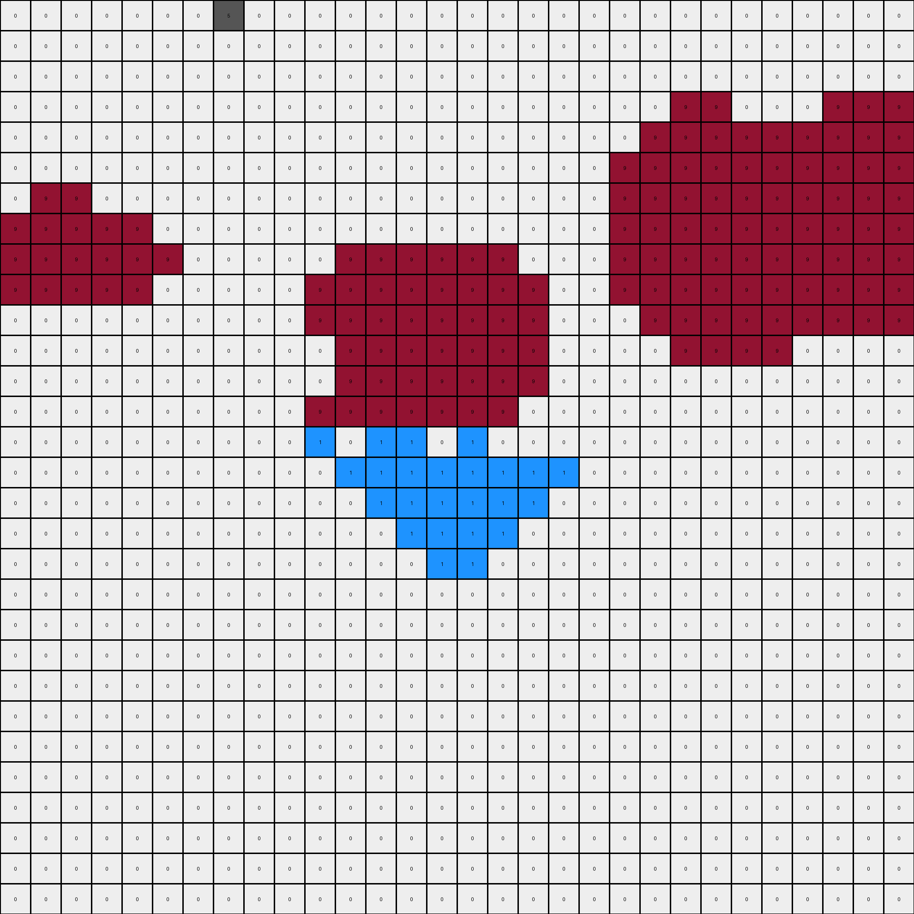
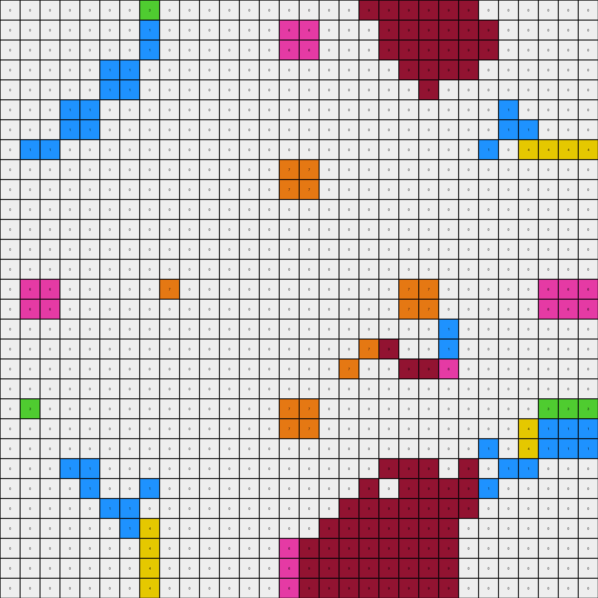
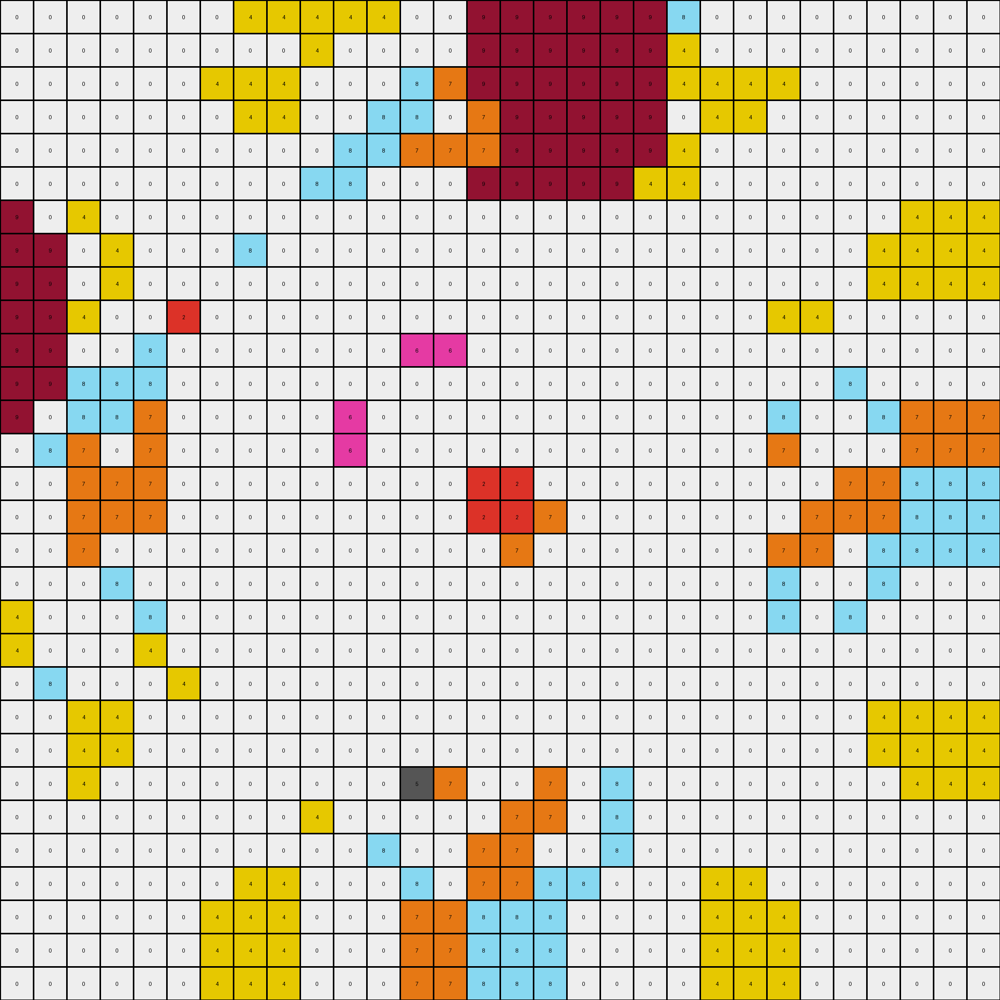

# 3631a71a • 015 • refine_dreamer

---

Previous Code:
```python
"""
A 3x3 "median filter" approach with a special rule for a clear majority is
applied on the grid. The "majority" color, or if none, fill with an external common
color.
"""

import numpy as np
from collections import Counter

def get_surrounding_colors(grid, row, col, block_size=3):
    """Gets colors surrounding a block in the grid."""
    surrounding = []
    start_row, start_col = row - 1, col - 1
    end_row, end_col = row + block_size, col + block_size

    for i in range(start_row, end_row + 1):
        for j in range(start_col, end_col + 1):
            if (start_row <= i < end_row and start_col <= j < end_col):
                continue  # Skip the inner block itself
            if 0 <= i < grid.shape[0] and 0 <= j < grid.shape[1]:
                surrounding.append(grid[i, j])
    return surrounding

def transform(input_grid):
    """Transforms the input grid by applying a 3x3 filter."""
    output_grid = np.copy(input_grid)
    rows, cols = input_grid.shape
    block_size = 3

    for row in range(rows - block_size + 1):
        for col in range(cols - block_size + 1):
            block = input_grid[row:row+block_size, col:col+block_size]
            
            # Count occurrences of each color in the block
            color_counts = Counter(block.flatten())
            most_common_color, count = color_counts.most_common(1)[0]

            # If a color occupies more than half the block, fill with that color
            if count > (block_size * block_size) // 2:
                output_grid[row:row+block_size, col:col+block_size] = most_common_color
            else:
                # Find most common surrounding color
                surrounding_colors = get_surrounding_colors(input_grid, row, col)
                if surrounding_colors:
                    surrounding_counts = Counter(surrounding_colors)
                    most_common_surrounding = surrounding_counts.most_common(1)[0][0]
                    output_grid[row:row+block_size, col:col+block_size] = most_common_surrounding
                # else: leave as is (this case should be handled by initialization copy)
    return output_grid
```

Train Set Results:

## Example 1:

Input:
```
0 0 0 0 0 0 0 0 6 6 5 5 0 1 0 0 0 0 1 0 5 5 6 6 0 0 0 0 0 0
0 0 0 0 0 5 0 0 6 6 5 0 1 0 0 7 7 0 0 1 0 5 6 6 0 0 5 0 0 0
0 0 7 7 0 0 0 7 5 5 4 0 0 0 0 0 0 0 0 0 0 4 5 5 7 0 0 0 7 7
0 0 7 7 0 0 7 0 5 0 0 4 0 7 0 2 2 0 7 0 4 0 0 5 0 7 0 0 7 7
0 0 0 0 0 0 0 0 0 1 0 0 7 0 4 0 0 4 0 7 0 0 1 0 0 0 0 0 0 0
0 5 0 0 0 0 0 0 1 0 0 7 0 7 0 0 0 0 7 0 7 0 9 9 9 9 9 9 9 9
0 0 0 7 0 0 3 0 0 0 0 0 4 0 8 0 0 8 0 4 0 0 9 9 9 9 9 9 9 9
0 0 7 0 0 0 0 0 0 7 0 2 0 0 0 0 0 0 0 0 2 0 9 9 9 9 9 9 9 9
9 9 9 9 9 9 9 0 0 0 4 0 0 0 0 0 0 0 0 0 0 4 9 9 9 9 9 9 9 9
9 9 9 9 9 9 9 7 0 8 0 0 9 9 9 9 9 9 9 0 0 0 9 9 9 9 9 9 9 9
9 9 9 9 9 9 9 0 4 0 0 5 9 9 9 9 9 9 9 0 5 0 9 9 9 9 9 9 9 9
5 0 0 4 0 7 0 2 0 0 5 0 9 9 9 9 9 9 9 0 0 5 9 9 9 9 9 9 4 0
0 1 0 0 7 0 4 0 0 0 0 0 9 9 9 9 9 9 9 1 0 0 9 9 9 9 9 9 0 0
1 0 0 7 0 7 0 0 0 0 0 0 9 9 9 9 9 9 9 0 0 0 0 0 0 0 7 0 7 0
0 0 0 0 4 0 8 0 0 0 0 7 9 9 9 9 9 9 9 0 7 0 0 0 0 8 0 4 0 0
0 7 0 2 0 0 0 0 0 0 7 0 1 1 0 1 1 0 1 1 0 7 0 0 0 0 0 0 2 0
0 7 0 2 0 0 0 0 0 0 7 0 1 1 0 1 1 0 1 1 0 7 0 0 0 0 0 0 2 0
0 0 0 0 4 0 8 0 0 0 0 7 0 1 1 0 0 1 1 0 7 0 0 0 0 8 0 4 0 0
1 0 0 7 0 7 0 0 0 0 0 0 0 0 1 1 1 1 0 0 0 0 0 0 0 0 7 0 7 0
0 1 0 0 7 0 4 0 0 0 0 0 1 0 0 1 1 0 0 1 0 0 0 0 0 4 0 7 0 0
5 0 0 4 0 7 0 2 0 0 5 0 0 0 7 0 0 7 0 0 0 5 0 0 2 0 7 0 4 0
5 5 4 0 0 0 0 0 4 0 0 5 0 0 0 7 7 0 0 0 5 0 0 4 0 0 0 0 0 4
6 6 5 0 1 0 0 7 0 8 0 0 0 0 0 0 0 0 0 0 0 0 8 0 7 0 0 1 0 5
6 6 5 5 0 1 0 0 0 0 4 0 0 0 0 0 0 0 0 0 0 4 0 0 0 0 1 0 5 5
0 0 7 0 0 0 0 0 0 7 0 2 0 0 0 0 0 0 0 0 2 0 7 0 0 0 0 0 0 7
0 0 0 7 0 0 3 0 0 0 0 0 4 0 8 0 0 8 0 4 0 0 0 0 0 3 0 0 7 0
0 5 0 0 0 0 0 0 1 0 0 7 0 7 0 0 0 0 7 0 7 0 0 1 0 0 0 0 0 0
0 0 0 0 0 0 0 0 0 1 0 0 7 0 4 0 0 4 0 7 0 0 1 0 0 0 0 0 0 0
0 0 7 7 0 0 7 0 5 0 0 4 0 7 0 2 2 0 7 0 4 0 0 5 0 7 0 0 7 7
0 0 7 7 0 0 0 7 5 5 4 0 0 0 0 0 0 0 0 0 0 4 5 5 7 0 0 0 7 7
```
Expected Output:
```
0 0 0 0 0 0 0 0 6 6 5 5 0 1 0 0 0 0 1 0 5 5 6 6 0 0 0 0 0 0
0 0 0 0 0 5 0 0 6 6 5 0 1 0 0 7 7 0 0 1 0 5 6 6 0 0 5 0 0 0
0 0 7 7 0 0 0 7 5 5 4 0 0 0 0 0 0 0 0 0 0 4 5 5 7 0 0 0 7 7
0 0 7 7 0 0 7 0 5 0 0 4 0 7 0 2 2 0 7 0 4 0 0 5 0 7 0 0 7 7
0 0 0 0 0 0 0 0 0 1 0 0 7 0 4 0 0 4 0 7 0 0 1 0 0 0 0 0 0 0
0 5 0 0 0 0 0 0 1 0 0 7 0 7 0 0 0 0 7 0 7 0 0 1 0 0 0 0 0 0
0 0 0 7 0 0 3 0 0 0 0 0 4 0 8 0 0 8 0 4 0 0 0 0 0 3 0 0 7 0
0 0 7 0 0 0 0 0 0 7 0 2 0 0 0 0 0 0 0 0 2 0 7 0 0 0 0 0 0 7
6 6 5 5 0 1 0 0 0 0 4 0 0 0 0 0 0 0 0 0 0 4 0 0 0 0 1 0 5 5
6 6 5 0 1 0 0 7 0 8 0 0 0 0 0 0 0 0 0 0 0 0 8 0 7 0 0 1 0 5
5 5 4 0 0 0 0 0 4 0 0 5 0 0 0 7 7 0 0 0 5 0 0 4 0 0 0 0 0 4
5 0 0 4 0 7 0 2 0 0 5 0 0 0 7 0 0 7 0 0 0 5 0 0 2 0 7 0 4 0
0 1 0 0 7 0 4 0 0 0 0 0 1 0 0 1 1 0 0 1 0 0 0 0 0 4 0 7 0 0
1 0 0 7 0 7 0 0 0 0 0 0 0 0 1 1 1 1 0 0 0 0 0 0 0 0 7 0 7 0
0 0 0 0 4 0 8 0 0 0 0 7 0 1 1 0 0 1 1 0 7 0 0 0 0 8 0 4 0 0
0 7 0 2 0 0 0 0 0 0 7 0 1 1 0 1 1 0 1 1 0 7 0 0 0 0 0 0 2 0
0 7 0 2 0 0 0 0 0 0 7 0 1 1 0 1 1 0 1 1 0 7 0 0 0 0 0 0 2 0
0 0 0 0 4 0 8 0 0 0 0 7 0 1 1 0 0 1 1 0 7 0 0 0 0 8 0 4 0 0
1 0 0 7 0 7 0 0 0 0 0 0 0 0 1 1 1 1 0 0 0 0 0 0 0 0 7 0 7 0
0 1 0 0 7 0 4 0 0 0 0 0 1 0 0 1 1 0 0 1 0 0 0 0 0 4 0 7 0 0
5 0 0 4 0 7 0 2 0 0 5 0 0 0 7 0 0 7 0 0 0 5 0 0 2 0 7 0 4 0
5 5 4 0 0 0 0 0 4 0 0 5 0 0 0 7 7 0 0 0 5 0 0 4 0 0 0 0 0 4
6 6 5 0 1 0 0 7 0 8 0 0 0 0 0 0 0 0 0 0 0 0 8 0 7 0 0 1 0 5
6 6 5 5 0 1 0 0 0 0 4 0 0 0 0 0 0 0 0 0 0 4 0 0 0 0 1 0 5 5
0 0 7 0 0 0 0 0 0 7 0 2 0 0 0 0 0 0 0 0 2 0 7 0 0 0 0 0 0 7
0 0 0 7 0 0 3 0 0 0 0 0 4 0 8 0 0 8 0 4 0 0 0 0 0 3 0 0 7 0
0 5 0 0 0 0 0 0 1 0 0 7 0 7 0 0 0 0 7 0 7 0 0 1 0 0 0 0 0 0
0 0 0 0 0 0 0 0 0 1 0 0 7 0 4 0 0 4 0 7 0 0 1 0 0 0 0 0 0 0
0 0 7 7 0 0 7 0 5 0 0 4 0 7 0 2 2 0 7 0 4 0 0 5 0 7 0 0 7 7
0 0 7 7 0 0 0 7 5 5 4 0 0 0 0 0 0 0 0 0 0 4 5 5 7 0 0 0 7 7
```
Transformed Output:
```
0 0 0 0 0 0 0 5 0 0 0 0 0 0 0 0 0 0 0 0 0 0 0 0 0 0 0 0 0 0
0 0 0 0 0 0 0 0 0 0 0 0 0 0 0 0 0 0 0 0 0 0 0 0 0 0 0 0 0 0
0 0 0 0 0 0 0 0 0 0 0 0 0 0 0 0 0 0 0 0 0 0 0 0 0 0 0 0 0 0
0 0 0 0 0 0 0 0 0 0 0 0 0 0 0 0 0 0 0 0 0 0 9 9 0 0 0 9 9 9
0 0 0 0 0 0 0 0 0 0 0 0 0 0 0 0 0 0 0 0 0 9 9 9 9 9 9 9 9 9
0 0 0 0 0 0 0 0 0 0 0 0 0 0 0 0 0 0 0 0 9 9 9 9 9 9 9 9 9 9
0 9 9 0 0 0 0 0 0 0 0 0 0 0 0 0 0 0 0 0 9 9 9 9 9 9 9 9 9 9
9 9 9 9 9 0 0 0 0 0 0 0 0 0 0 0 0 0 0 0 9 9 9 9 9 9 9 9 9 9
9 9 9 9 9 9 0 0 0 0 0 9 9 9 9 9 9 0 0 0 9 9 9 9 9 9 9 9 9 9
9 9 9 9 9 0 0 0 0 0 9 9 9 9 9 9 9 9 0 0 9 9 9 9 9 9 9 9 9 9
0 0 0 0 0 0 0 0 0 0 9 9 9 9 9 9 9 9 0 0 0 9 9 9 9 9 9 9 9 9
0 0 0 0 0 0 0 0 0 0 0 9 9 9 9 9 9 9 0 0 0 0 9 9 9 9 0 0 0 0
0 0 0 0 0 0 0 0 0 0 0 9 9 9 9 9 9 9 0 0 0 0 0 0 0 0 0 0 0 0
0 0 0 0 0 0 0 0 0 0 9 9 9 9 9 9 9 0 0 0 0 0 0 0 0 0 0 0 0 0
0 0 0 0 0 0 0 0 0 0 1 0 1 1 0 1 0 0 0 0 0 0 0 0 0 0 0 0 0 0
0 0 0 0 0 0 0 0 0 0 0 1 1 1 1 1 1 1 1 0 0 0 0 0 0 0 0 0 0 0
0 0 0 0 0 0 0 0 0 0 0 0 1 1 1 1 1 1 0 0 0 0 0 0 0 0 0 0 0 0
0 0 0 0 0 0 0 0 0 0 0 0 0 1 1 1 1 0 0 0 0 0 0 0 0 0 0 0 0 0
0 0 0 0 0 0 0 0 0 0 0 0 0 0 1 1 0 0 0 0 0 0 0 0 0 0 0 0 0 0
0 0 0 0 0 0 0 0 0 0 0 0 0 0 0 0 0 0 0 0 0 0 0 0 0 0 0 0 0 0
0 0 0 0 0 0 0 0 0 0 0 0 0 0 0 0 0 0 0 0 0 0 0 0 0 0 0 0 0 0
0 0 0 0 0 0 0 0 0 0 0 0 0 0 0 0 0 0 0 0 0 0 0 0 0 0 0 0 0 0
0 0 0 0 0 0 0 0 0 0 0 0 0 0 0 0 0 0 0 0 0 0 0 0 0 0 0 0 0 0
0 0 0 0 0 0 0 0 0 0 0 0 0 0 0 0 0 0 0 0 0 0 0 0 0 0 0 0 0 0
0 0 0 0 0 0 0 0 0 0 0 0 0 0 0 0 0 0 0 0 0 0 0 0 0 0 0 0 0 0
0 0 0 0 0 0 0 0 0 0 0 0 0 0 0 0 0 0 0 0 0 0 0 0 0 0 0 0 0 0
0 0 0 0 0 0 0 0 0 0 0 0 0 0 0 0 0 0 0 0 0 0 0 0 0 0 0 0 0 0
0 0 0 0 0 0 0 0 0 0 0 0 0 0 0 0 0 0 0 0 0 0 0 0 0 0 0 0 0 0
0 0 0 0 0 0 0 0 0 0 0 0 0 0 0 0 0 0 0 0 0 0 0 0 0 0 0 0 0 0
0 0 0 0 0 0 0 0 0 0 0 0 0 0 0 0 0 0 0 0 0 0 0 0 0 0 0 0 0 0
```

match: False
pixels_off: 380
size_correct: True
color_palette_correct: False
correct_pixel_counts: False

## Example 2:

Input:
```
3 0 0 0 0 0 0 0 0 8 3 3 1 0 8 0 0 8 0 1 3 3 8 0 0 0 0 0 0 0
0 0 0 0 0 0 0 3 8 0 3 0 0 1 0 0 0 0 1 0 0 9 9 9 9 9 0 0 0 0
0 0 7 7 0 0 4 0 3 3 4 4 8 0 6 6 6 6 0 8 4 9 9 9 9 9 0 0 7 7
0 0 7 0 0 3 0 0 3 0 4 0 0 0 6 6 6 6 0 0 0 9 9 9 9 9 3 0 0 7
0 0 0 0 0 0 1 1 1 0 8 0 3 0 8 0 0 8 0 3 0 9 9 9 9 9 0 0 0 0
0 0 0 3 0 0 1 1 0 1 0 0 0 3 0 0 0 0 3 0 0 0 1 0 1 1 0 0 3 0
0 0 4 0 1 1 0 2 8 0 6 6 8 0 1 1 1 1 0 8 6 6 0 8 2 0 1 1 0 4
0 3 0 0 1 1 2 2 0 0 6 6 0 0 1 0 0 1 0 0 6 6 0 0 2 2 1 1 0 0
0 8 3 3 1 0 8 0 0 0 1 0 0 5 7 0 0 7 5 0 0 1 0 0 0 8 0 1 3 3
8 0 3 0 0 1 0 0 0 8 0 0 5 0 0 7 7 0 0 5 0 0 8 0 0 0 1 0 0 3
3 3 4 4 8 0 6 6 1 0 2 2 7 0 0 7 7 0 0 7 2 2 0 1 6 6 0 8 4 4
3 0 4 0 0 0 6 6 0 0 2 0 0 7 7 0 0 7 7 0 0 2 0 0 6 6 0 0 0 4
1 0 8 0 3 0 8 0 0 5 7 0 0 5 0 0 0 0 5 0 0 7 5 0 0 8 0 3 0 8
0 1 0 0 0 3 0 0 5 0 0 7 5 5 0 0 0 0 5 5 7 0 0 5 0 0 3 0 0 0
8 0 6 6 8 0 1 1 7 0 0 7 0 0 0 0 0 0 0 0 7 0 0 7 1 1 0 8 6 6
0 0 6 6 0 0 1 0 0 7 7 0 0 0 0 8 8 0 0 0 0 7 7 0 0 1 0 0 6 6
0 0 6 6 0 0 1 0 0 9 9 0 0 0 0 8 8 0 0 0 0 7 7 0 0 1 0 0 6 6
8 0 6 6 8 0 1 1 7 9 9 7 0 0 0 0 0 0 0 0 7 0 0 7 1 1 0 8 6 6
0 1 0 0 0 3 0 0 5 0 0 7 5 5 0 0 0 0 5 5 7 9 9 5 0 0 3 0 0 0
1 0 8 0 3 0 8 0 0 5 7 0 0 5 0 0 0 0 5 0 0 9 9 0 0 8 0 3 0 8
3 0 4 0 0 0 6 6 0 0 2 0 0 7 7 0 0 7 7 0 0 9 9 0 6 6 0 0 0 4
3 3 4 4 8 0 6 6 1 0 2 2 7 0 0 7 7 0 0 7 2 2 0 1 6 6 0 8 4 4
8 0 3 0 0 1 0 0 0 8 0 0 5 0 0 7 7 0 0 5 0 0 8 0 0 0 1 0 0 3
0 8 3 3 1 0 8 0 0 0 1 0 0 5 7 0 0 7 5 0 0 1 0 0 0 8 0 1 3 3
0 3 0 0 1 1 2 2 0 0 6 6 0 0 1 0 0 1 0 0 6 6 0 0 2 2 1 1 0 0
0 0 4 0 1 1 0 2 8 0 6 6 8 0 1 1 1 1 0 8 9 9 9 9 9 9 1 1 0 4
0 0 0 3 0 0 1 1 0 1 0 0 0 3 0 0 0 0 3 0 9 9 9 9 9 9 0 0 3 0
0 0 0 0 0 0 1 1 1 0 8 0 3 0 8 0 0 8 0 3 0 8 0 1 1 1 0 0 0 0
0 0 7 0 0 3 0 0 3 0 4 0 0 0 6 6 6 9 9 9 9 9 9 9 0 0 3 0 0 7
0 0 7 7 0 0 4 0 3 3 4 4 8 0 6 6 6 9 9 9 9 9 9 9 0 4 0 0 7 7
```
Expected Output:
```
3 0 0 0 0 0 0 0 0 8 3 3 1 0 8 0 0 8 0 1 3 3 8 0 0 0 0 0 0 0
0 0 0 0 0 0 0 3 8 0 3 0 0 1 0 0 0 0 1 0 0 3 0 8 3 0 0 0 0 0
0 0 7 7 0 0 4 0 3 3 4 4 8 0 6 6 6 6 0 8 4 4 3 3 0 4 0 0 7 7
0 0 7 0 0 3 0 0 3 0 4 0 0 0 6 6 6 6 0 0 0 4 0 3 0 0 3 0 0 7
0 0 0 0 0 0 1 1 1 0 8 0 3 0 8 0 0 8 0 3 0 8 0 1 1 1 0 0 0 0
0 0 0 3 0 0 1 1 0 1 0 0 0 3 0 0 0 0 3 0 0 0 1 0 1 1 0 0 3 0
0 0 4 0 1 1 0 2 8 0 6 6 8 0 1 1 1 1 0 8 6 6 0 8 2 0 1 1 0 4
0 3 0 0 1 1 2 2 0 0 6 6 0 0 1 0 0 1 0 0 6 6 0 0 2 2 1 1 0 0
0 8 3 3 1 0 8 0 0 0 1 0 0 5 7 0 0 7 5 0 0 1 0 0 0 8 0 1 3 3
8 0 3 0 0 1 0 0 0 8 0 0 5 0 0 7 7 0 0 5 0 0 8 0 0 0 1 0 0 3
3 3 4 4 8 0 6 6 1 0 2 2 7 0 0 7 7 0 0 7 2 2 0 1 6 6 0 8 4 4
3 0 4 0 0 0 6 6 0 0 2 0 0 7 7 0 0 7 7 0 0 2 0 0 6 6 0 0 0 4
1 0 8 0 3 0 8 0 0 5 7 0 0 5 0 0 0 0 5 0 0 7 5 0 0 8 0 3 0 8
0 1 0 0 0 3 0 0 5 0 0 7 5 5 0 0 0 0 5 5 7 0 0 5 0 0 3 0 0 0
8 0 6 6 8 0 1 1 7 0 0 7 0 0 0 0 0 0 0 0 7 0 0 7 1 1 0 8 6 6
0 0 6 6 0 0 1 0 0 7 7 0 0 0 0 8 8 0 0 0 0 7 7 0 0 1 0 0 6 6
0 0 6 6 0 0 1 0 0 7 7 0 0 0 0 8 8 0 0 0 0 7 7 0 0 1 0 0 6 6
8 0 6 6 8 0 1 1 7 0 0 7 0 0 0 0 0 0 0 0 7 0 0 7 1 1 0 8 6 6
0 1 0 0 0 3 0 0 5 0 0 7 5 5 0 0 0 0 5 5 7 0 0 5 0 0 3 0 0 0
1 0 8 0 3 0 8 0 0 5 7 0 0 5 0 0 0 0 5 0 0 7 5 0 0 8 0 3 0 8
3 0 4 0 0 0 6 6 0 0 2 0 0 7 7 0 0 7 7 0 0 2 0 0 6 6 0 0 0 4
3 3 4 4 8 0 6 6 1 0 2 2 7 0 0 7 7 0 0 7 2 2 0 1 6 6 0 8 4 4
8 0 3 0 0 1 0 0 0 8 0 0 5 0 0 7 7 0 0 5 0 0 8 0 0 0 1 0 0 3
0 8 3 3 1 0 8 0 0 0 1 0 0 5 7 0 0 7 5 0 0 1 0 0 0 8 0 1 3 3
0 3 0 0 1 1 2 2 0 0 6 6 0 0 1 0 0 1 0 0 6 6 0 0 2 2 1 1 0 0
0 0 4 0 1 1 0 2 8 0 6 6 8 0 1 1 1 1 0 8 6 6 0 8 2 0 1 1 0 4
0 0 0 3 0 0 1 1 0 1 0 0 0 3 0 0 0 0 3 0 0 0 1 0 1 1 0 0 3 0
0 0 0 0 0 0 1 1 1 0 8 0 3 0 8 0 0 8 0 3 0 8 0 1 1 1 0 0 0 0
0 0 7 0 0 3 0 0 3 0 4 0 0 0 6 6 6 6 0 0 0 4 0 3 0 0 3 0 0 7
0 0 7 7 0 0 4 0 3 3 4 4 8 0 6 6 6 6 0 8 4 4 3 3 0 4 0 0 7 7
```
Transformed Output:
```
0 0 0 0 0 0 0 3 0 0 0 0 0 0 0 0 0 0 9 9 9 9 9 9 0 0 0 0 0 0
0 0 0 0 0 0 0 1 0 0 0 0 0 0 6 6 0 0 0 9 9 9 9 9 9 0 0 0 0 0
0 0 0 0 0 0 0 1 0 0 0 0 0 0 6 6 0 0 0 9 9 9 9 9 9 0 0 0 0 0
0 0 0 0 0 1 1 0 0 0 0 0 0 0 0 0 0 0 0 0 9 9 9 9 0 0 0 0 0 0
0 0 0 0 0 1 1 0 0 0 0 0 0 0 0 0 0 0 0 0 0 9 0 0 0 0 0 0 0 0
0 0 0 1 1 0 0 0 0 0 0 0 0 0 0 0 0 0 0 0 0 0 0 0 0 1 0 0 0 0
0 0 0 1 1 0 0 0 0 0 0 0 0 0 0 0 0 0 0 0 0 0 0 0 0 1 1 0 0 0
0 1 1 0 0 0 0 0 0 0 0 0 0 0 0 0 0 0 0 0 0 0 0 0 1 0 4 4 4 4
0 0 0 0 0 0 0 0 0 0 0 0 0 0 7 7 0 0 0 0 0 0 0 0 0 0 0 0 0 0
0 0 0 0 0 0 0 0 0 0 0 0 0 0 7 7 0 0 0 0 0 0 0 0 0 0 0 0 0 0
0 0 0 0 0 0 0 0 0 0 0 0 0 0 0 0 0 0 0 0 0 0 0 0 0 0 0 0 0 0
0 0 0 0 0 0 0 0 0 0 0 0 0 0 0 0 0 0 0 0 0 0 0 0 0 0 0 0 0 0
0 0 0 0 0 0 0 0 0 0 0 0 0 0 0 0 0 0 0 0 0 0 0 0 0 0 0 0 0 0
0 0 0 0 0 0 0 0 0 0 0 0 0 0 0 0 0 0 0 0 0 0 0 0 0 0 0 0 0 0
0 6 6 0 0 0 0 0 7 0 0 0 0 0 0 0 0 0 0 0 7 7 0 0 0 0 0 6 6 6
0 6 6 0 0 0 0 0 0 0 0 0 0 0 0 0 0 0 0 0 7 7 0 0 0 0 0 6 6 6
0 0 0 0 0 0 0 0 0 0 0 0 0 0 0 0 0 0 0 0 0 0 1 0 0 0 0 0 0 0
0 0 0 0 0 0 0 0 0 0 0 0 0 0 0 0 0 0 7 9 0 0 1 0 0 0 0 0 0 0
0 0 0 0 0 0 0 0 0 0 0 0 0 0 0 0 0 7 0 0 9 9 6 0 0 0 0 0 0 0
0 0 0 0 0 0 0 0 0 0 0 0 0 0 0 0 0 0 0 0 0 0 0 0 0 0 0 0 0 0
0 3 0 0 0 0 0 0 0 0 0 0 0 0 7 7 0 0 0 0 0 0 0 0 0 0 0 3 3 3
0 0 0 0 0 0 0 0 0 0 0 0 0 0 7 7 0 0 0 0 0 0 0 0 0 0 4 1 1 1
0 0 0 0 0 0 0 0 0 0 0 0 0 0 0 0 0 0 0 0 0 0 0 0 1 0 4 1 1 1
0 0 0 1 1 0 0 0 0 0 0 0 0 0 0 0 0 0 0 9 9 9 0 9 0 1 1 0 0 0
0 0 0 0 1 0 0 1 0 0 0 0 0 0 0 0 0 0 9 0 9 9 9 9 1 0 0 0 0 0
0 0 0 0 0 1 1 0 0 0 0 0 0 0 0 0 0 9 9 9 9 9 9 9 0 0 0 0 0 0
0 0 0 0 0 0 1 4 0 0 0 0 0 0 0 0 9 9 9 9 9 9 9 0 0 0 0 0 0 0
0 0 0 0 0 0 0 4 0 0 0 0 0 0 6 9 9 9 9 9 9 9 9 0 0 0 0 0 0 0
0 0 0 0 0 0 0 4 0 0 0 0 0 0 6 9 9 9 9 9 9 9 9 0 0 0 0 0 0 0
0 0 0 0 0 0 0 4 0 0 0 0 0 0 6 9 9 9 9 9 9 9 9 0 0 0 0 0 0 0
```

match: False
pixels_off: 465
size_correct: True
color_palette_correct: False
correct_pixel_counts: False

## Example 3:

Input:
```
0 5 0 0 0 5 0 0 8 8 0 4 4 4 0 0 0 9 9 9 9 0 8 8 0 0 5 0 0 0
5 0 0 0 5 0 0 0 8 0 4 4 4 4 0 3 3 9 9 9 9 4 0 8 0 0 0 5 0 0
0 0 0 1 0 0 4 4 0 4 2 0 0 0 8 8 8 9 9 9 9 2 4 0 4 4 0 0 1 0
0 0 1 1 0 0 4 0 4 4 0 0 0 3 8 0 0 9 9 9 9 0 4 4 0 4 0 0 1 1
0 5 0 0 1 0 0 0 4 4 0 0 8 8 0 7 7 9 9 9 9 0 4 4 0 0 0 1 0 0
5 0 0 0 0 1 0 0 4 4 0 3 8 8 7 7 7 9 9 9 9 0 4 4 0 0 1 0 0 0
0 0 4 4 0 0 1 0 0 0 8 8 0 7 0 5 5 9 9 9 9 8 0 0 0 1 0 0 4 4
9 9 9 0 0 0 0 1 0 3 8 0 7 7 5 0 0 5 7 7 0 8 3 0 1 0 0 0 0 4
9 9 9 4 4 4 0 0 2 2 1 0 4 0 5 0 0 5 0 4 0 1 2 2 0 0 4 4 4 0
9 9 9 4 4 4 0 3 2 0 0 0 0 0 0 5 5 0 0 0 0 0 0 2 3 0 4 4 4 4
9 9 9 0 0 0 8 8 1 0 3 0 5 0 0 6 6 0 0 5 0 3 0 1 8 8 0 0 0 2
9 9 9 0 0 3 8 0 0 0 0 3 0 5 6 0 0 6 5 0 3 0 0 0 0 8 3 0 0 0
9 9 9 0 8 8 0 7 4 0 5 0 0 6 7 0 0 7 6 0 0 5 0 4 7 0 8 8 0 0
9 9 9 3 8 8 7 7 0 0 0 5 6 6 0 7 7 0 6 6 5 0 0 0 7 7 8 8 3 0
0 0 8 8 0 7 0 5 5 0 0 6 7 0 2 0 0 2 0 7 6 0 0 5 5 0 7 0 8 8
0 3 8 0 7 7 5 0 0 5 6 0 0 7 0 2 2 0 7 0 0 6 5 0 0 5 7 7 0 8
0 3 8 0 7 7 5 0 0 5 6 0 0 7 0 2 2 0 7 0 0 6 5 0 0 5 7 7 0 8
0 0 8 8 0 7 0 5 5 0 0 6 7 0 2 0 0 2 0 7 6 0 0 5 5 0 7 0 8 8
4 4 0 3 8 8 7 7 0 0 0 5 6 6 0 7 7 0 6 6 5 0 0 0 7 7 8 8 3 0
4 4 0 0 8 8 0 7 4 0 5 0 0 6 7 0 0 7 6 0 0 5 0 4 7 0 8 8 0 0
4 4 0 0 0 3 8 0 0 0 0 3 0 5 6 0 0 6 5 0 3 0 0 0 0 8 3 0 0 0
0 4 2 0 0 0 8 8 1 0 3 0 5 0 0 6 6 0 0 5 0 3 0 1 8 8 0 0 0 2
8 0 4 4 4 4 0 3 2 0 0 0 0 0 0 5 5 0 0 0 0 0 0 2 3 0 4 4 4 4
8 8 0 4 4 4 0 0 2 2 1 0 4 0 5 0 0 5 0 4 0 1 2 2 0 0 4 4 4 0
0 0 4 0 0 0 0 1 0 3 8 0 7 7 5 0 0 5 7 7 0 8 3 0 1 0 0 0 0 4
0 0 4 4 0 0 1 0 0 0 8 8 0 7 0 5 5 0 7 0 8 8 0 0 0 1 0 0 4 4
5 0 0 0 0 1 0 0 4 4 0 3 8 8 7 7 7 7 8 8 3 0 4 4 0 0 1 0 0 0
0 5 0 0 1 0 0 0 4 4 0 0 8 8 0 7 7 0 8 8 0 0 4 4 0 0 0 1 0 0
0 0 1 1 0 0 4 0 4 4 0 0 0 3 8 0 0 8 3 0 0 0 4 4 0 4 0 0 1 1
0 0 0 1 0 0 4 4 0 4 2 0 0 0 8 8 8 8 0 0 0 2 4 0 4 4 0 0 1 0
```
Expected Output:
```
0 5 0 0 0 5 0 0 8 8 0 4 4 4 0 0 0 0 4 4 4 0 8 8 0 0 5 0 0 0
5 0 0 0 5 0 0 0 8 0 4 4 4 4 0 3 3 0 4 4 4 4 0 8 0 0 0 5 0 0
0 0 0 1 0 0 4 4 0 4 2 0 0 0 8 8 8 8 0 0 0 2 4 0 4 4 0 0 1 0
0 0 1 1 0 0 4 0 4 4 0 0 0 3 8 0 0 8 3 0 0 0 4 4 0 4 0 0 1 1
0 5 0 0 1 0 0 0 4 4 0 0 8 8 0 7 7 0 8 8 0 0 4 4 0 0 0 1 0 0
5 0 0 0 0 1 0 0 4 4 0 3 8 8 7 7 7 7 8 8 3 0 4 4 0 0 1 0 0 0
0 0 4 4 0 0 1 0 0 0 8 8 0 7 0 5 5 0 7 0 8 8 0 0 0 1 0 0 4 4
0 0 4 0 0 0 0 1 0 3 8 0 7 7 5 0 0 5 7 7 0 8 3 0 1 0 0 0 0 4
8 8 0 4 4 4 0 0 2 2 1 0 4 0 5 0 0 5 0 4 0 1 2 2 0 0 4 4 4 0
8 0 4 4 4 4 0 3 2 0 0 0 0 0 0 5 5 0 0 0 0 0 0 2 3 0 4 4 4 4
0 4 2 0 0 0 8 8 1 0 3 0 5 0 0 6 6 0 0 5 0 3 0 1 8 8 0 0 0 2
4 4 0 0 0 3 8 0 0 0 0 3 0 5 6 0 0 6 5 0 3 0 0 0 0 8 3 0 0 0
4 4 0 0 8 8 0 7 4 0 5 0 0 6 7 0 0 7 6 0 0 5 0 4 7 0 8 8 0 0
4 4 0 3 8 8 7 7 0 0 0 5 6 6 0 7 7 0 6 6 5 0 0 0 7 7 8 8 3 0
0 0 8 8 0 7 0 5 5 0 0 6 7 0 2 0 0 2 0 7 6 0 0 5 5 0 7 0 8 8
0 3 8 0 7 7 5 0 0 5 6 0 0 7 0 2 2 0 7 0 0 6 5 0 0 5 7 7 0 8
0 3 8 0 7 7 5 0 0 5 6 0 0 7 0 2 2 0 7 0 0 6 5 0 0 5 7 7 0 8
0 0 8 8 0 7 0 5 5 0 0 6 7 0 2 0 0 2 0 7 6 0 0 5 5 0 7 0 8 8
4 4 0 3 8 8 7 7 0 0 0 5 6 6 0 7 7 0 6 6 5 0 0 0 7 7 8 8 3 0
4 4 0 0 8 8 0 7 4 0 5 0 0 6 7 0 0 7 6 0 0 5 0 4 7 0 8 8 0 0
4 4 0 0 0 3 8 0 0 0 0 3 0 5 6 0 0 6 5 0 3 0 0 0 0 8 3 0 0 0
0 4 2 0 0 0 8 8 1 0 3 0 5 0 0 6 6 0 0 5 0 3 0 1 8 8 0 0 0 2
8 0 4 4 4 4 0 3 2 0 0 0 0 0 0 5 5 0 0 0 0 0 0 2 3 0 4 4 4 4
8 8 0 4 4 4 0 0 2 2 1 0 4 0 5 0 0 5 0 4 0 1 2 2 0 0 4 4 4 0
0 0 4 0 0 0 0 1 0 3 8 0 7 7 5 0 0 5 7 7 0 8 3 0 1 0 0 0 0 4
0 0 4 4 0 0 1 0 0 0 8 8 0 7 0 5 5 0 7 0 8 8 0 0 0 1 0 0 4 4
5 0 0 0 0 1 0 0 4 4 0 3 8 8 7 7 7 7 8 8 3 0 4 4 0 0 1 0 0 0
0 5 0 0 1 0 0 0 4 4 0 0 8 8 0 7 7 0 8 8 0 0 4 4 0 0 0 1 0 0
0 0 1 1 0 0 4 0 4 4 0 0 0 3 8 0 0 8 3 0 0 0 4 4 0 4 0 0 1 1
0 0 0 1 0 0 4 4 0 4 2 0 0 0 8 8 8 8 0 0 0 2 4 0 4 4 0 0 1 0
```
Transformed Output:
```
0 0 0 0 0 0 0 4 4 4 4 4 0 0 9 9 9 9 9 9 8 0 0 0 0 0 0 0 0 0
0 0 0 0 0 0 0 0 0 4 0 0 0 0 9 9 9 9 9 9 4 0 0 0 0 0 0 0 0 0
0 0 0 0 0 0 4 4 4 0 0 0 8 7 9 9 9 9 9 9 4 4 4 4 0 0 0 0 0 0
0 0 0 0 0 0 0 4 4 0 0 8 8 0 7 9 9 9 9 9 0 4 4 0 0 0 0 0 0 0
0 0 0 0 0 0 0 0 0 0 8 8 7 7 7 9 9 9 9 9 4 0 0 0 0 0 0 0 0 0
0 0 0 0 0 0 0 0 0 8 8 0 0 0 9 9 9 9 9 4 4 0 0 0 0 0 0 0 0 0
9 0 4 0 0 0 0 0 0 0 0 0 0 0 0 0 0 0 0 0 0 0 0 0 0 0 0 4 4 4
9 9 0 4 0 0 0 8 0 0 0 0 0 0 0 0 0 0 0 0 0 0 0 0 0 0 4 4 4 4
9 9 0 4 0 0 0 0 0 0 0 0 0 0 0 0 0 0 0 0 0 0 0 0 0 0 4 4 4 4
9 9 4 0 0 2 0 0 0 0 0 0 0 0 0 0 0 0 0 0 0 0 0 4 4 0 0 0 0 0
9 9 0 0 8 0 0 0 0 0 0 0 6 6 0 0 0 0 0 0 0 0 0 0 0 0 0 0 0 0
9 9 8 8 8 0 0 0 0 0 0 0 0 0 0 0 0 0 0 0 0 0 0 0 0 8 0 0 0 0
9 0 8 8 7 0 0 0 0 0 6 0 0 0 0 0 0 0 0 0 0 0 0 8 0 0 8 7 7 7
0 8 7 0 7 0 0 0 0 0 6 0 0 0 0 0 0 0 0 0 0 0 0 7 0 0 0 7 7 7
0 0 7 7 7 0 0 0 0 0 0 0 0 0 2 2 0 0 0 0 0 0 0 0 0 7 7 8 8 8
0 0 7 7 7 0 0 0 0 0 0 0 0 0 2 2 7 0 0 0 0 0 0 0 7 7 7 8 8 8
0 0 7 0 0 0 0 0 0 0 0 0 0 0 0 7 0 0 0 0 0 0 0 7 7 0 8 8 8 8
0 0 0 8 0 0 0 0 0 0 0 0 0 0 0 0 0 0 0 0 0 0 0 8 0 0 8 0 0 0
4 0 0 0 8 0 0 0 0 0 0 0 0 0 0 0 0 0 0 0 0 0 0 8 0 8 0 0 0 0
4 0 0 0 4 0 0 0 0 0 0 0 0 0 0 0 0 0 0 0 0 0 0 0 0 0 0 0 0 0
0 8 0 0 0 4 0 0 0 0 0 0 0 0 0 0 0 0 0 0 0 0 0 0 0 0 0 0 0 0
0 0 4 4 0 0 0 0 0 0 0 0 0 0 0 0 0 0 0 0 0 0 0 0 0 0 4 4 4 4
0 0 4 4 0 0 0 0 0 0 0 0 0 0 0 0 0 0 0 0 0 0 0 0 0 0 4 4 4 4
0 0 4 0 0 0 0 0 0 0 0 0 5 7 0 0 7 0 8 0 0 0 0 0 0 0 0 4 4 4
0 0 0 0 0 0 0 0 0 4 0 0 0 0 0 7 7 0 8 0 0 0 0 0 0 0 0 0 0 0
0 0 0 0 0 0 0 0 0 0 0 8 0 0 7 7 0 0 8 0 0 0 0 0 0 0 0 0 0 0
0 0 0 0 0 0 0 4 4 0 0 0 8 0 7 7 8 8 0 0 0 4 4 0 0 0 0 0 0 0
0 0 0 0 0 0 4 4 4 0 0 0 7 7 8 8 8 0 0 0 0 4 4 4 0 0 0 0 0 0
0 0 0 0 0 0 4 4 4 0 0 0 7 7 8 8 8 0 0 0 0 4 4 4 0 0 0 0 0 0
0 0 0 0 0 0 4 4 4 0 0 0 7 7 8 8 8 0 0 0 0 4 4 4 0 0 0 0 0 0
```

match: False
pixels_off: 491
size_correct: True
color_palette_correct: False
correct_pixel_counts: False

## Example 4:

Input:
```
0 0 0 1 7 0 6 0 0 0 0 6 3 3 0 2 2 0 3 3 6 0 0 0 0 6 0 7 1 0
0 7 1 0 0 7 0 0 0 4 6 6 3 0 2 0 0 2 0 3 6 6 4 0 0 0 7 0 0 1
0 1 5 0 6 0 0 0 0 6 3 3 0 2 7 7 7 7 2 0 3 3 6 0 0 0 0 6 0 5
1 0 0 5 0 0 0 0 6 6 3 3 2 0 7 0 0 7 0 2 3 3 6 6 0 0 0 0 5 0
7 0 6 0 8 8 6 0 3 9 9 9 4 4 1 0 0 1 4 4 2 0 3 3 0 6 8 8 0 6
0 7 0 0 8 0 0 0 3 9 9 9 4 4 0 0 0 0 4 4 0 2 0 3 0 0 0 8 0 0
6 0 0 0 6 0 2 0 0 9 9 9 1 0 0 0 0 0 0 1 7 7 2 0 0 2 0 6 0 0
0 0 0 0 0 0 0 2 2 0 7 0 0 0 0 4 4 0 0 0 0 7 0 2 2 0 0 9 9 9
0 0 0 6 3 3 0 2 0 8 1 1 7 7 0 2 2 0 7 7 1 1 8 0 2 0 3 9 9 9
0 4 6 6 3 0 2 0 8 8 1 1 7 0 2 2 2 2 0 7 1 1 8 8 0 2 0 9 9 9
0 6 3 3 0 2 7 7 1 1 0 0 0 2 4 4 4 4 2 0 0 0 1 1 7 7 2 9 9 9
6 6 3 3 2 9 9 9 9 9 9 9 9 2 4 0 0 4 2 2 0 0 1 1 0 7 0 2 3 3
3 3 0 2 4 9 9 9 9 9 9 9 9 2 0 2 2 0 2 0 2 0 7 7 0 1 4 4 2 0
3 0 2 0 4 9 9 9 9 9 9 9 9 0 2 2 2 2 0 2 2 2 0 7 0 0 4 4 0 2
0 2 7 7 1 9 9 9 9 9 9 9 9 2 6 6 6 6 2 0 4 4 2 0 0 0 0 1 7 7
2 0 7 0 0 9 9 9 2 2 4 0 2 2 6 0 0 6 2 2 0 4 2 2 4 0 0 0 0 7
2 0 7 0 0 9 9 9 2 2 4 0 2 2 6 0 0 6 2 2 0 4 2 2 4 0 0 0 0 7
0 2 7 7 1 9 9 9 0 2 4 4 0 2 6 6 6 6 2 0 4 4 2 0 0 0 0 1 7 7
3 0 2 0 4 4 0 0 7 0 2 2 2 0 2 2 2 2 0 2 2 2 0 7 0 0 4 4 0 2
3 3 0 2 4 4 1 0 7 7 0 2 0 2 0 2 2 0 2 0 2 0 7 7 0 1 4 4 2 0
6 6 3 3 2 0 7 0 1 1 0 0 2 2 4 0 0 4 2 2 0 0 1 1 0 7 0 2 3 3
0 6 3 3 0 2 7 7 1 1 0 0 0 2 4 4 4 4 2 0 0 0 1 1 7 7 2 0 3 3
0 4 6 6 3 0 2 0 8 8 1 1 7 0 2 2 2 2 0 7 1 1 8 8 0 2 0 3 6 6
0 0 0 6 3 3 0 2 0 9 9 1 7 7 0 2 2 0 7 7 1 1 8 0 2 0 3 3 6 0
0 0 0 0 0 0 0 2 2 9 9 0 0 0 0 4 4 0 0 0 0 7 0 2 2 0 0 0 0 0
6 0 0 0 6 0 2 0 0 9 9 7 1 0 0 0 0 0 0 1 7 7 2 0 0 2 0 6 0 0
0 7 0 0 8 0 0 0 3 9 9 0 4 4 0 0 0 0 4 4 0 2 0 3 0 0 0 8 0 0
7 0 6 0 8 8 6 0 3 9 9 2 4 4 1 0 0 1 4 4 2 0 3 3 0 6 8 8 0 6
1 0 0 5 0 0 0 0 6 9 9 3 2 0 7 0 0 7 0 2 3 3 6 6 0 0 0 0 5 0
0 1 5 0 6 0 0 0 0 9 9 3 0 2 7 7 7 7 2 0 3 3 6 0 0 0 0 6 0 5
```
Expected Output:
```
0 0 0 1 7 0 6 0 0 0 0 6 3 3 0 2 2 0 3 3 6 0 0 0 0 6 0 7 1 0
0 7 1 0 0 7 0 0 0 4 6 6 3 0 2 0 0 2 0 3 6 6 4 0 0 0 7 0 0 1
0 1 5 0 6 0 0 0 0 6 3 3 0 2 7 7 7 7 2 0 3 3 6 0 0 0 0 6 0 5
1 0 0 5 0 0 0 0 6 6 3 3 2 0 7 0 0 7 0 2 3 3 6 6 0 0 0 0 5 0
7 0 6 0 8 8 6 0 3 3 0 2 4 4 1 0 0 1 4 4 2 0 3 3 0 6 8 8 0 6
0 7 0 0 8 0 0 0 3 0 2 0 4 4 0 0 0 0 4 4 0 2 0 3 0 0 0 8 0 0
6 0 0 0 6 0 2 0 0 2 7 7 1 0 0 0 0 0 0 1 7 7 2 0 0 2 0 6 0 0
0 0 0 0 0 0 0 2 2 0 7 0 0 0 0 4 4 0 0 0 0 7 0 2 2 0 0 0 0 0
0 0 0 6 3 3 0 2 0 8 1 1 7 7 0 2 2 0 7 7 1 1 8 0 2 0 3 3 6 0
0 4 6 6 3 0 2 0 8 8 1 1 7 0 2 2 2 2 0 7 1 1 8 8 0 2 0 3 6 6
0 6 3 3 0 2 7 7 1 1 0 0 0 2 4 4 4 4 2 0 0 0 1 1 7 7 2 0 3 3
6 6 3 3 2 0 7 0 1 1 0 0 2 2 4 0 0 4 2 2 0 0 1 1 0 7 0 2 3 3
3 3 0 2 4 4 1 0 7 7 0 2 0 2 0 2 2 0 2 0 2 0 7 7 0 1 4 4 2 0
3 0 2 0 4 4 0 0 7 0 2 2 2 0 2 2 2 2 0 2 2 2 0 7 0 0 4 4 0 2
0 2 7 7 1 0 0 0 0 2 4 4 0 2 6 6 6 6 2 0 4 4 2 0 0 0 0 1 7 7
2 0 7 0 0 0 0 4 2 2 4 0 2 2 6 0 0 6 2 2 0 4 2 2 4 0 0 0 0 7
2 0 7 0 0 0 0 4 2 2 4 0 2 2 6 0 0 6 2 2 0 4 2 2 4 0 0 0 0 7
0 2 7 7 1 0 0 0 0 2 4 4 0 2 6 6 6 6 2 0 4 4 2 0 0 0 0 1 7 7
3 0 2 0 4 4 0 0 7 0 2 2 2 0 2 2 2 2 0 2 2 2 0 7 0 0 4 4 0 2
3 3 0 2 4 4 1 0 7 7 0 2 0 2 0 2 2 0 2 0 2 0 7 7 0 1 4 4 2 0
6 6 3 3 2 0 7 0 1 1 0 0 2 2 4 0 0 4 2 2 0 0 1 1 0 7 0 2 3 3
0 6 3 3 0 2 7 7 1 1 0 0 0 2 4 4 4 4 2 0 0 0 1 1 7 7 2 0 3 3
0 4 6 6 3 0 2 0 8 8 1 1 7 0 2 2 2 2 0 7 1 1 8 8 0 2 0 3 6 6
0 0 0 6 3 3 0 2 0 8 1 1 7 7 0 2 2 0 7 7 1 1 8 0 2 0 3 3 6 0
0 0 0 0 0 0 0 2 2 0 7 0 0 0 0 4 4 0 0 0 0 7 0 2 2 0 0 0 0 0
6 0 0 0 6 0 2 0 0 2 7 7 1 0 0 0 0 0 0 1 7 7 2 0 0 2 0 6 0 0
0 7 0 0 8 0 0 0 3 0 2 0 4 4 0 0 0 0 4 4 0 2 0 3 0 0 0 8 0 0
7 0 6 0 8 8 6 0 3 3 0 2 4 4 1 0 0 1 4 4 2 0 3 3 0 6 8 8 0 6
1 0 0 5 0 0 0 0 6 6 3 3 2 0 7 0 0 7 0 2 3 3 6 6 0 0 0 0 5 0
0 1 5 0 6 0 0 0 0 6 3 3 0 2 7 7 7 7 2 0 3 3 6 0 0 0 0 6 0 5
```
Transformed Output:
```
0 0 0 0 0 0 0 0 0 3 3 0 0 0 0 0 0 6 3 0 0 0 0 0 0 0 0 0 0 0
0 0 0 0 0 0 0 0 3 3 3 7 0 0 0 0 0 6 0 3 0 0 0 0 0 0 0 0 0 0
0 0 0 0 0 0 0 3 9 9 4 7 0 0 0 0 0 0 0 4 3 0 0 0 0 0 0 0 0 0
0 0 0 0 0 0 0 9 9 9 9 0 0 0 0 0 0 0 0 6 0 0 0 0 0 0 0 0 0 0
0 0 0 0 0 0 0 9 9 9 9 0 0 0 0 0 0 0 0 0 0 0 0 0 0 0 0 0 0 0
0 0 0 0 0 0 0 9 9 9 4 0 0 0 0 0 0 0 0 0 3 0 0 0 0 0 0 9 9 9
0 0 0 0 0 0 0 9 1 1 0 0 0 0 0 0 0 0 7 0 0 0 0 0 0 0 9 9 9 9
0 0 0 2 0 0 8 1 1 0 0 0 0 4 2 2 4 0 0 0 0 0 0 0 0 9 9 9 9 9
0 3 3 0 2 9 9 9 9 1 9 9 4 4 2 2 0 0 0 0 1 0 0 0 9 9 9 9 9 9
3 3 3 9 9 9 9 9 9 9 9 9 2 2 2 2 2 0 0 0 0 1 7 0 9 9 9 9 9 9
3 3 0 9 9 9 9 9 9 9 9 9 2 2 2 2 2 2 2 0 0 0 7 0 4 0 0 4 4 4
3 0 9 9 9 9 9 9 9 9 9 9 2 2 2 2 2 2 2 2 1 0 0 0 0 0 0 7 7 7
0 0 9 9 9 9 9 9 9 9 9 9 2 2 2 2 2 2 2 2 2 0 0 0 0 0 0 0 0 0
0 0 9 9 9 9 9 9 9 9 9 2 2 2 6 2 0 2 2 2 2 0 0 0 0 0 0 0 0 0
0 0 9 9 9 9 9 9 9 2 2 2 2 6 6 6 2 2 2 2 0 2 2 0 0 0 0 7 7 7
0 0 9 9 9 9 9 2 2 2 2 2 2 2 6 6 2 2 2 2 2 2 2 0 0 0 0 4 4 4
0 0 9 9 9 9 2 4 0 2 2 2 2 0 2 2 2 2 2 2 2 0 0 0 0 0 0 4 4 4
0 4 9 9 0 0 0 0 0 0 2 2 2 2 2 2 2 2 2 2 0 0 0 0 0 0 7 3 3 3
3 4 4 0 0 0 7 0 0 0 2 2 2 2 2 2 2 2 2 2 0 0 0 0 0 7 3 3 3 3
0 3 4 0 0 7 0 0 0 0 0 2 2 2 2 2 2 2 2 0 0 0 0 0 0 0 3 6 6 6
0 0 3 7 0 1 1 0 1 0 0 0 2 2 0 2 0 0 0 0 1 1 1 0 0 3 3 3 3 3
0 0 0 0 0 0 1 0 0 0 0 0 0 0 2 2 0 0 0 0 1 0 7 0 0 0 0 0 0 0
0 0 0 0 0 0 9 9 0 0 0 0 0 0 2 2 0 0 0 1 1 7 0 0 0 0 0 0 0 0
0 0 0 0 0 0 0 9 9 9 0 0 0 0 0 0 0 0 1 0 0 0 0 0 0 0 0 0 0 0
0 0 0 0 0 0 0 9 9 9 4 0 0 0 0 0 0 0 0 0 0 0 0 0 0 0 0 0 0 0
0 0 0 0 0 0 0 9 9 9 0 0 0 0 0 0 0 0 7 0 3 0 0 0 0 0 0 0 0 0
0 0 0 0 0 0 0 9 9 9 0 0 0 0 0 0 0 7 3 3 3 0 0 0 0 0 0 0 0 0
0 0 0 0 0 0 0 9 9 9 4 7 0 0 7 4 4 3 3 6 3 0 0 0 0 0 0 0 0 0
0 0 0 0 0 0 0 9 9 9 4 7 0 0 7 4 4 3 3 6 3 0 0 0 0 0 0 0 0 0
0 0 0 0 0 0 0 9 9 9 4 7 0 0 7 4 4 3 3 6 3 0 0 0 0 0 0 0 0 5
```

match: False
pixels_off: 574
size_correct: True
color_palette_correct: False
correct_pixel_counts: False
**INSTRUCTIONS**

The code above was generated based on observations from the first training
example

we have tested the transform function on each of the task example inputs and
compared with the expected output

review each of the examples provided and the results and consider how the
natural language program should be updated to accommodate this new knowledge

respond with the following deliverables:

- general assessment of the information provided and strategy for resolving the
  errors
- gather metrics about each of the examples and results - use code_execution to
  develop accurate reports on your assumptions
- a YAML block documenting facts - Focus on identifying objects, their properties, and the actions performed on them.
- a natural language program - Be as clear and concise as possible, providing a complete description of the transformation rule.


your responses should be considered as information in a report - not a
conversation
