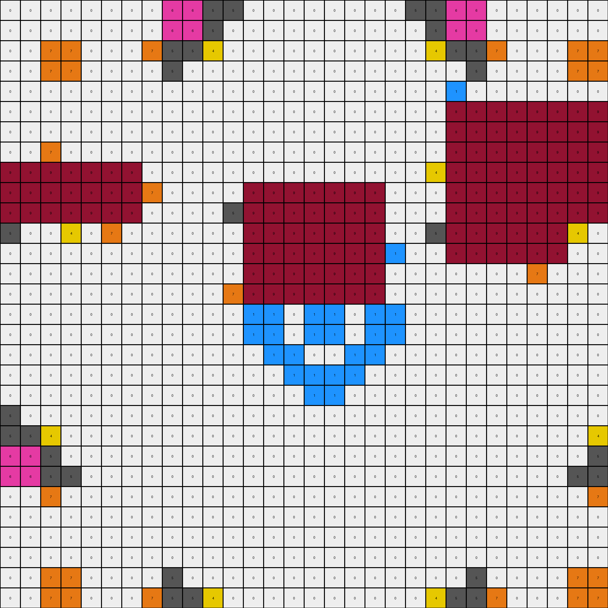
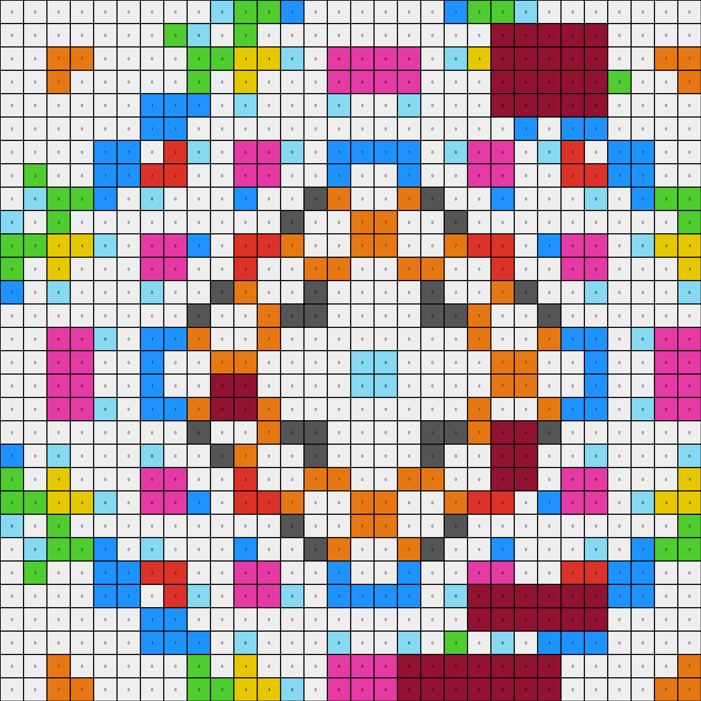
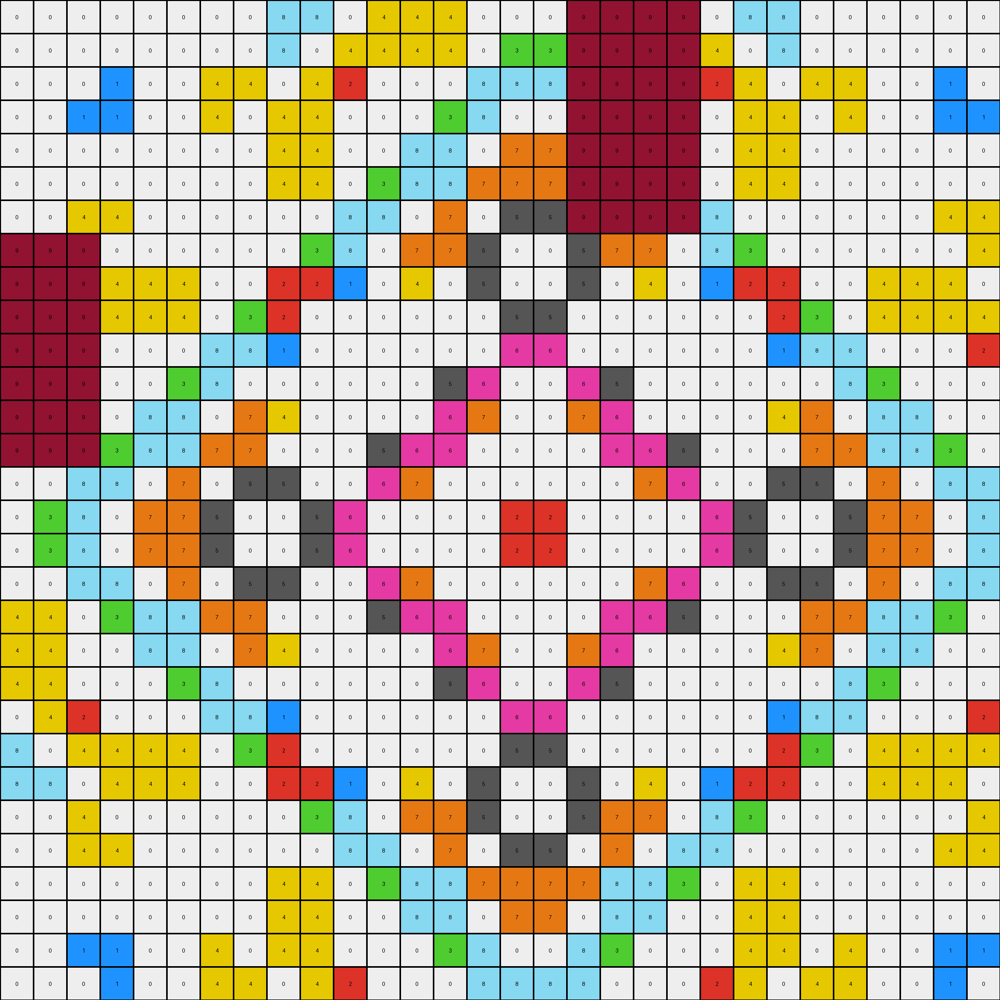
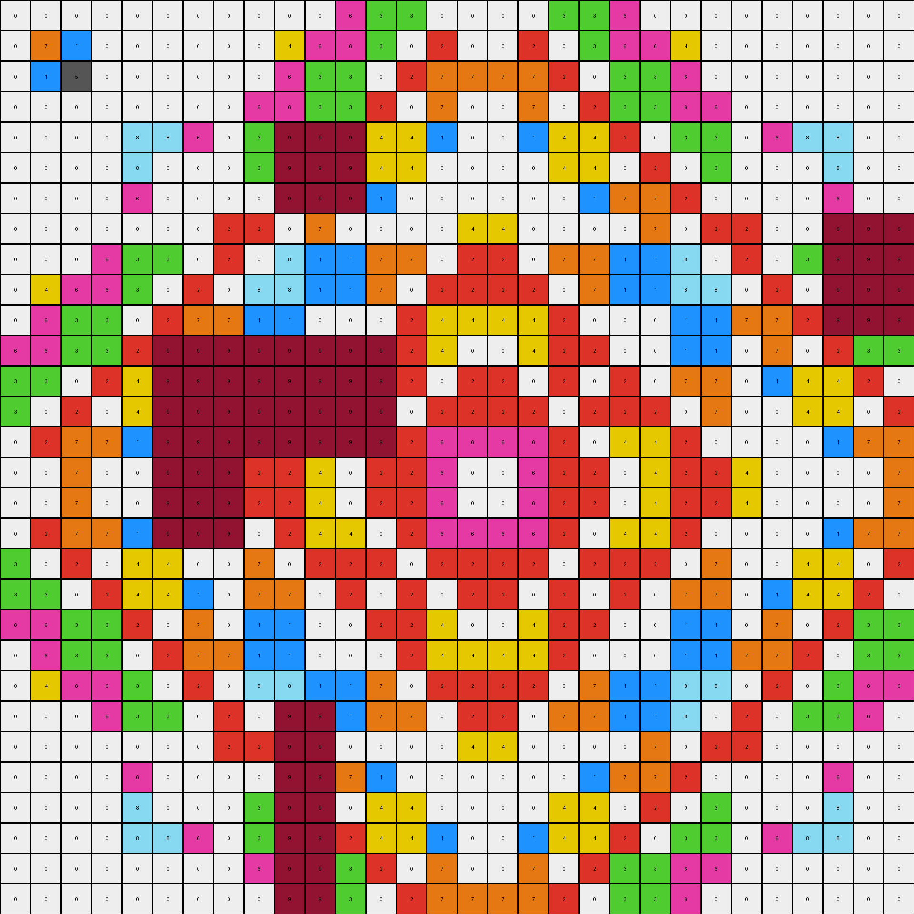

# 3631a71a • 017 • refine_dreamer

---


Previous Code:
```python
"""
The transformation identifies and removes "noisy" objects based on size and
replaces them with a padding of the most common background color.
The objects are then filled back based on rules that apply to object size, shape, and color
"""

import numpy as np
from collections import Counter

def get_objects(grid):
    """Identifies connected components (objects) in the grid."""
    objects = []
    visited = set()
    rows, cols = grid.shape

    def dfs(row, col, current_object):
        if (row, col) in visited or not (0 <= row < rows and 0 <= col < cols) or grid[row, col] == 0:
            return
        visited.add((row, col))
        current_object.append(((row, col), grid[row, col]))
        dfs(row + 1, col, current_object)
        dfs(row - 1, col, current_object)
        dfs(row, col + 1, current_object)
        dfs(row, col - 1, current_object)

    for row in range(rows):
        for col in range(cols):
            if grid[row, col] != 0 and (row, col) not in visited:
                current_object = []
                dfs(row, col, current_object)
                objects.append(current_object)
    return objects


def get_background_color(grid):
    """
    Determines the most common background color in the grid.
    Assumes background is color 0.
    """
    # Flatten grid and convert to list of pixel values
    pixels = grid.flatten().tolist()
    
    return 0

def transform(input_grid):
    """Transforms the input grid by removing and reconstructing objects."""
    
    rows, cols = input_grid.shape
    output_grid = np.zeros_like(input_grid) # initialize to all zeros
    background_color = get_background_color(input_grid)

    # Get objects from the original grid
    original_objects = get_objects(input_grid)

    # Fill large and medium-sized structured objects back into the output grid
    for obj in original_objects:
        coords, color = zip(*obj)
        coords_array = np.array(coords)
        rows_obj = coords_array[:, 0]
        cols_obj = coords_array[:, 1]
        min_row, max_row = np.min(rows_obj), np.max(rows_obj)
        min_col, max_col = np.min(cols_obj), np.max(cols_obj)
            
        width = max_col - min_col + 1
        height = max_row - min_row + 1
        size = len(obj)

        if size >= 9: # large objects
            if height > 2 and width > 2:
                for (r, c), val in obj:
                  output_grid[r,c] = val
            
        elif size >=3 and size <=8: # medium-sized objects
              if height > 1 and width > 1: # structured object
                    for (r, c), val in obj:
                      output_grid[r,c] = val
              
        else: # small objects - remove noise
             pass
                      
    return output_grid
```

Train Set Results:

## Example 1:

Input:
```
0 0 0 0 0 0 0 0 6 6 5 5 0 1 0 0 0 0 1 0 5 5 6 6 0 0 0 0 0 0
0 0 0 0 0 5 0 0 6 6 5 0 1 0 0 7 7 0 0 1 0 5 6 6 0 0 5 0 0 0
0 0 7 7 0 0 0 7 5 5 4 0 0 0 0 0 0 0 0 0 0 4 5 5 7 0 0 0 7 7
0 0 7 7 0 0 7 0 5 0 0 4 0 7 0 2 2 0 7 0 4 0 0 5 0 7 0 0 7 7
0 0 0 0 0 0 0 0 0 1 0 0 7 0 4 0 0 4 0 7 0 0 1 0 0 0 0 0 0 0
0 5 0 0 0 0 0 0 1 0 0 7 0 7 0 0 0 0 7 0 7 0 9 9 9 9 9 9 9 9
0 0 0 7 0 0 3 0 0 0 0 0 4 0 8 0 0 8 0 4 0 0 9 9 9 9 9 9 9 9
0 0 7 0 0 0 0 0 0 7 0 2 0 0 0 0 0 0 0 0 2 0 9 9 9 9 9 9 9 9
9 9 9 9 9 9 9 0 0 0 4 0 0 0 0 0 0 0 0 0 0 4 9 9 9 9 9 9 9 9
9 9 9 9 9 9 9 7 0 8 0 0 9 9 9 9 9 9 9 0 0 0 9 9 9 9 9 9 9 9
9 9 9 9 9 9 9 0 4 0 0 5 9 9 9 9 9 9 9 0 5 0 9 9 9 9 9 9 9 9
5 0 0 4 0 7 0 2 0 0 5 0 9 9 9 9 9 9 9 0 0 5 9 9 9 9 9 9 4 0
0 1 0 0 7 0 4 0 0 0 0 0 9 9 9 9 9 9 9 1 0 0 9 9 9 9 9 9 0 0
1 0 0 7 0 7 0 0 0 0 0 0 9 9 9 9 9 9 9 0 0 0 0 0 0 0 7 0 7 0
0 0 0 0 4 0 8 0 0 0 0 7 9 9 9 9 9 9 9 0 7 0 0 0 0 8 0 4 0 0
0 7 0 2 0 0 0 0 0 0 7 0 1 1 0 1 1 0 1 1 0 7 0 0 0 0 0 0 2 0
0 7 0 2 0 0 0 0 0 0 7 0 1 1 0 1 1 0 1 1 0 7 0 0 0 0 0 0 2 0
0 0 0 0 4 0 8 0 0 0 0 7 0 1 1 0 0 1 1 0 7 0 0 0 0 8 0 4 0 0
1 0 0 7 0 7 0 0 0 0 0 0 0 0 1 1 1 1 0 0 0 0 0 0 0 0 7 0 7 0
0 1 0 0 7 0 4 0 0 0 0 0 1 0 0 1 1 0 0 1 0 0 0 0 0 4 0 7 0 0
5 0 0 4 0 7 0 2 0 0 5 0 0 0 7 0 0 7 0 0 0 5 0 0 2 0 7 0 4 0
5 5 4 0 0 0 0 0 4 0 0 5 0 0 0 7 7 0 0 0 5 0 0 4 0 0 0 0 0 4
6 6 5 0 1 0 0 7 0 8 0 0 0 0 0 0 0 0 0 0 0 0 8 0 7 0 0 1 0 5
6 6 5 5 0 1 0 0 0 0 4 0 0 0 0 0 0 0 0 0 0 4 0 0 0 0 1 0 5 5
0 0 7 0 0 0 0 0 0 7 0 2 0 0 0 0 0 0 0 0 2 0 7 0 0 0 0 0 0 7
0 0 0 7 0 0 3 0 0 0 0 0 4 0 8 0 0 8 0 4 0 0 0 0 0 3 0 0 7 0
0 5 0 0 0 0 0 0 1 0 0 7 0 7 0 0 0 0 7 0 7 0 0 1 0 0 0 0 0 0
0 0 0 0 0 0 0 0 0 1 0 0 7 0 4 0 0 4 0 7 0 0 1 0 0 0 0 0 0 0
0 0 7 7 0 0 7 0 5 0 0 4 0 7 0 2 2 0 7 0 4 0 0 5 0 7 0 0 7 7
0 0 7 7 0 0 0 7 5 5 4 0 0 0 0 0 0 0 0 0 0 4 5 5 7 0 0 0 7 7
```
Expected Output:
```
0 0 0 0 0 0 0 0 6 6 5 5 0 1 0 0 0 0 1 0 5 5 6 6 0 0 0 0 0 0
0 0 0 0 0 5 0 0 6 6 5 0 1 0 0 7 7 0 0 1 0 5 6 6 0 0 5 0 0 0
0 0 7 7 0 0 0 7 5 5 4 0 0 0 0 0 0 0 0 0 0 4 5 5 7 0 0 0 7 7
0 0 7 7 0 0 7 0 5 0 0 4 0 7 0 2 2 0 7 0 4 0 0 5 0 7 0 0 7 7
0 0 0 0 0 0 0 0 0 1 0 0 7 0 4 0 0 4 0 7 0 0 1 0 0 0 0 0 0 0
0 5 0 0 0 0 0 0 1 0 0 7 0 7 0 0 0 0 7 0 7 0 0 1 0 0 0 0 0 0
0 0 0 7 0 0 3 0 0 0 0 0 4 0 8 0 0 8 0 4 0 0 0 0 0 3 0 0 7 0
0 0 7 0 0 0 0 0 0 7 0 2 0 0 0 0 0 0 0 0 2 0 7 0 0 0 0 0 0 7
6 6 5 5 0 1 0 0 0 0 4 0 0 0 0 0 0 0 0 0 0 4 0 0 0 0 1 0 5 5
6 6 5 0 1 0 0 7 0 8 0 0 0 0 0 0 0 0 0 0 0 0 8 0 7 0 0 1 0 5
5 5 4 0 0 0 0 0 4 0 0 5 0 0 0 7 7 0 0 0 5 0 0 4 0 0 0 0 0 4
5 0 0 4 0 7 0 2 0 0 5 0 0 0 7 0 0 7 0 0 0 5 0 0 2 0 7 0 4 0
0 1 0 0 7 0 4 0 0 0 0 0 1 0 0 1 1 0 0 1 0 0 0 0 0 4 0 7 0 0
1 0 0 7 0 7 0 0 0 0 0 0 0 0 1 1 1 1 0 0 0 0 0 0 0 0 7 0 7 0
0 0 0 0 4 0 8 0 0 0 0 7 0 1 1 0 0 1 1 0 7 0 0 0 0 8 0 4 0 0
0 7 0 2 0 0 0 0 0 0 7 0 1 1 0 1 1 0 1 1 0 7 0 0 0 0 0 0 2 0
0 7 0 2 0 0 0 0 0 0 7 0 1 1 0 1 1 0 1 1 0 7 0 0 0 0 0 0 2 0
0 0 0 0 4 0 8 0 0 0 0 7 0 1 1 0 0 1 1 0 7 0 0 0 0 8 0 4 0 0
1 0 0 7 0 7 0 0 0 0 0 0 0 0 1 1 1 1 0 0 0 0 0 0 0 0 7 0 7 0
0 1 0 0 7 0 4 0 0 0 0 0 1 0 0 1 1 0 0 1 0 0 0 0 0 4 0 7 0 0
5 0 0 4 0 7 0 2 0 0 5 0 0 0 7 0 0 7 0 0 0 5 0 0 2 0 7 0 4 0
5 5 4 0 0 0 0 0 4 0 0 5 0 0 0 7 7 0 0 0 5 0 0 4 0 0 0 0 0 4
6 6 5 0 1 0 0 7 0 8 0 0 0 0 0 0 0 0 0 0 0 0 8 0 7 0 0 1 0 5
6 6 5 5 0 1 0 0 0 0 4 0 0 0 0 0 0 0 0 0 0 4 0 0 0 0 1 0 5 5
0 0 7 0 0 0 0 0 0 7 0 2 0 0 0 0 0 0 0 0 2 0 7 0 0 0 0 0 0 7
0 0 0 7 0 0 3 0 0 0 0 0 4 0 8 0 0 8 0 4 0 0 0 0 0 3 0 0 7 0
0 5 0 0 0 0 0 0 1 0 0 7 0 7 0 0 0 0 7 0 7 0 0 1 0 0 0 0 0 0
0 0 0 0 0 0 0 0 0 1 0 0 7 0 4 0 0 4 0 7 0 0 1 0 0 0 0 0 0 0
0 0 7 7 0 0 7 0 5 0 0 4 0 7 0 2 2 0 7 0 4 0 0 5 0 7 0 0 7 7
0 0 7 7 0 0 0 7 5 5 4 0 0 0 0 0 0 0 0 0 0 4 5 5 7 0 0 0 7 7
```
Transformed Output:
```
0 0 0 0 0 0 0 0 6 6 5 5 0 0 0 0 0 0 0 0 5 5 6 6 0 0 0 0 0 0
0 0 0 0 0 0 0 0 6 6 5 0 0 0 0 0 0 0 0 0 0 5 6 6 0 0 0 0 0 0
0 0 7 7 0 0 0 7 5 5 4 0 0 0 0 0 0 0 0 0 0 4 5 5 7 0 0 0 7 7
0 0 7 7 0 0 0 0 5 0 0 0 0 0 0 0 0 0 0 0 0 0 0 5 0 0 0 0 7 7
0 0 0 0 0 0 0 0 0 0 0 0 0 0 0 0 0 0 0 0 0 0 1 0 0 0 0 0 0 0
0 0 0 0 0 0 0 0 0 0 0 0 0 0 0 0 0 0 0 0 0 0 9 9 9 9 9 9 9 9
0 0 0 0 0 0 0 0 0 0 0 0 0 0 0 0 0 0 0 0 0 0 9 9 9 9 9 9 9 9
0 0 7 0 0 0 0 0 0 0 0 0 0 0 0 0 0 0 0 0 0 0 9 9 9 9 9 9 9 9
9 9 9 9 9 9 9 0 0 0 0 0 0 0 0 0 0 0 0 0 0 4 9 9 9 9 9 9 9 9
9 9 9 9 9 9 9 7 0 0 0 0 9 9 9 9 9 9 9 0 0 0 9 9 9 9 9 9 9 9
9 9 9 9 9 9 9 0 0 0 0 5 9 9 9 9 9 9 9 0 0 0 9 9 9 9 9 9 9 9
5 0 0 4 0 7 0 0 0 0 0 0 9 9 9 9 9 9 9 0 0 5 9 9 9 9 9 9 4 0
0 0 0 0 0 0 0 0 0 0 0 0 9 9 9 9 9 9 9 1 0 0 9 9 9 9 9 9 0 0
0 0 0 0 0 0 0 0 0 0 0 0 9 9 9 9 9 9 9 0 0 0 0 0 0 0 7 0 0 0
0 0 0 0 0 0 0 0 0 0 0 7 9 9 9 9 9 9 9 0 0 0 0 0 0 0 0 0 0 0
0 0 0 0 0 0 0 0 0 0 0 0 1 1 0 1 1 0 1 1 0 0 0 0 0 0 0 0 0 0
0 0 0 0 0 0 0 0 0 0 0 0 1 1 0 1 1 0 1 1 0 0 0 0 0 0 0 0 0 0
0 0 0 0 0 0 0 0 0 0 0 0 0 1 1 0 0 1 1 0 0 0 0 0 0 0 0 0 0 0
0 0 0 0 0 0 0 0 0 0 0 0 0 0 1 1 1 1 0 0 0 0 0 0 0 0 0 0 0 0
0 0 0 0 0 0 0 0 0 0 0 0 0 0 0 1 1 0 0 0 0 0 0 0 0 0 0 0 0 0
5 0 0 0 0 0 0 0 0 0 0 0 0 0 0 0 0 0 0 0 0 0 0 0 0 0 0 0 0 0
5 5 4 0 0 0 0 0 0 0 0 0 0 0 0 0 0 0 0 0 0 0 0 0 0 0 0 0 0 4
6 6 5 0 0 0 0 0 0 0 0 0 0 0 0 0 0 0 0 0 0 0 0 0 0 0 0 0 0 5
6 6 5 5 0 0 0 0 0 0 0 0 0 0 0 0 0 0 0 0 0 0 0 0 0 0 0 0 5 5
0 0 7 0 0 0 0 0 0 0 0 0 0 0 0 0 0 0 0 0 0 0 0 0 0 0 0 0 0 7
0 0 0 0 0 0 0 0 0 0 0 0 0 0 0 0 0 0 0 0 0 0 0 0 0 0 0 0 0 0
0 0 0 0 0 0 0 0 0 0 0 0 0 0 0 0 0 0 0 0 0 0 0 0 0 0 0 0 0 0
0 0 0 0 0 0 0 0 0 0 0 0 0 0 0 0 0 0 0 0 0 0 0 0 0 0 0 0 0 0
0 0 7 7 0 0 0 0 5 0 0 0 0 0 0 0 0 0 0 0 0 0 0 5 0 0 0 0 7 7
0 0 7 7 0 0 0 7 5 5 4 0 0 0 0 0 0 0 0 0 0 4 5 5 7 0 0 0 7 7
```

match: False
pixels_off: 264
size_correct: True
color_palette_correct: False
correct_pixel_counts: False

## Example 2:

Input:
```
3 0 0 0 0 0 0 0 0 8 3 3 1 0 8 0 0 8 0 1 3 3 8 0 0 0 0 0 0 0
0 0 0 0 0 0 0 3 8 0 3 0 0 1 0 0 0 0 1 0 0 9 9 9 9 9 0 0 0 0
0 0 7 7 0 0 4 0 3 3 4 4 8 0 6 6 6 6 0 8 4 9 9 9 9 9 0 0 7 7
0 0 7 0 0 3 0 0 3 0 4 0 0 0 6 6 6 6 0 0 0 9 9 9 9 9 3 0 0 7
0 0 0 0 0 0 1 1 1 0 8 0 3 0 8 0 0 8 0 3 0 9 9 9 9 9 0 0 0 0
0 0 0 3 0 0 1 1 0 1 0 0 0 3 0 0 0 0 3 0 0 0 1 0 1 1 0 0 3 0
0 0 4 0 1 1 0 2 8 0 6 6 8 0 1 1 1 1 0 8 6 6 0 8 2 0 1 1 0 4
0 3 0 0 1 1 2 2 0 0 6 6 0 0 1 0 0 1 0 0 6 6 0 0 2 2 1 1 0 0
0 8 3 3 1 0 8 0 0 0 1 0 0 5 7 0 0 7 5 0 0 1 0 0 0 8 0 1 3 3
8 0 3 0 0 1 0 0 0 8 0 0 5 0 0 7 7 0 0 5 0 0 8 0 0 0 1 0 0 3
3 3 4 4 8 0 6 6 1 0 2 2 7 0 0 7 7 0 0 7 2 2 0 1 6 6 0 8 4 4
3 0 4 0 0 0 6 6 0 0 2 0 0 7 7 0 0 7 7 0 0 2 0 0 6 6 0 0 0 4
1 0 8 0 3 0 8 0 0 5 7 0 0 5 0 0 0 0 5 0 0 7 5 0 0 8 0 3 0 8
0 1 0 0 0 3 0 0 5 0 0 7 5 5 0 0 0 0 5 5 7 0 0 5 0 0 3 0 0 0
8 0 6 6 8 0 1 1 7 0 0 7 0 0 0 0 0 0 0 0 7 0 0 7 1 1 0 8 6 6
0 0 6 6 0 0 1 0 0 7 7 0 0 0 0 8 8 0 0 0 0 7 7 0 0 1 0 0 6 6
0 0 6 6 0 0 1 0 0 9 9 0 0 0 0 8 8 0 0 0 0 7 7 0 0 1 0 0 6 6
8 0 6 6 8 0 1 1 7 9 9 7 0 0 0 0 0 0 0 0 7 0 0 7 1 1 0 8 6 6
0 1 0 0 0 3 0 0 5 0 0 7 5 5 0 0 0 0 5 5 7 9 9 5 0 0 3 0 0 0
1 0 8 0 3 0 8 0 0 5 7 0 0 5 0 0 0 0 5 0 0 9 9 0 0 8 0 3 0 8
3 0 4 0 0 0 6 6 0 0 2 0 0 7 7 0 0 7 7 0 0 9 9 0 6 6 0 0 0 4
3 3 4 4 8 0 6 6 1 0 2 2 7 0 0 7 7 0 0 7 2 2 0 1 6 6 0 8 4 4
8 0 3 0 0 1 0 0 0 8 0 0 5 0 0 7 7 0 0 5 0 0 8 0 0 0 1 0 0 3
0 8 3 3 1 0 8 0 0 0 1 0 0 5 7 0 0 7 5 0 0 1 0 0 0 8 0 1 3 3
0 3 0 0 1 1 2 2 0 0 6 6 0 0 1 0 0 1 0 0 6 6 0 0 2 2 1 1 0 0
0 0 4 0 1 1 0 2 8 0 6 6 8 0 1 1 1 1 0 8 9 9 9 9 9 9 1 1 0 4
0 0 0 3 0 0 1 1 0 1 0 0 0 3 0 0 0 0 3 0 9 9 9 9 9 9 0 0 3 0
0 0 0 0 0 0 1 1 1 0 8 0 3 0 8 0 0 8 0 3 0 8 0 1 1 1 0 0 0 0
0 0 7 0 0 3 0 0 3 0 4 0 0 0 6 6 6 9 9 9 9 9 9 9 0 0 3 0 0 7
0 0 7 7 0 0 4 0 3 3 4 4 8 0 6 6 6 9 9 9 9 9 9 9 0 4 0 0 7 7
```
Expected Output:
```
3 0 0 0 0 0 0 0 0 8 3 3 1 0 8 0 0 8 0 1 3 3 8 0 0 0 0 0 0 0
0 0 0 0 0 0 0 3 8 0 3 0 0 1 0 0 0 0 1 0 0 3 0 8 3 0 0 0 0 0
0 0 7 7 0 0 4 0 3 3 4 4 8 0 6 6 6 6 0 8 4 4 3 3 0 4 0 0 7 7
0 0 7 0 0 3 0 0 3 0 4 0 0 0 6 6 6 6 0 0 0 4 0 3 0 0 3 0 0 7
0 0 0 0 0 0 1 1 1 0 8 0 3 0 8 0 0 8 0 3 0 8 0 1 1 1 0 0 0 0
0 0 0 3 0 0 1 1 0 1 0 0 0 3 0 0 0 0 3 0 0 0 1 0 1 1 0 0 3 0
0 0 4 0 1 1 0 2 8 0 6 6 8 0 1 1 1 1 0 8 6 6 0 8 2 0 1 1 0 4
0 3 0 0 1 1 2 2 0 0 6 6 0 0 1 0 0 1 0 0 6 6 0 0 2 2 1 1 0 0
0 8 3 3 1 0 8 0 0 0 1 0 0 5 7 0 0 7 5 0 0 1 0 0 0 8 0 1 3 3
8 0 3 0 0 1 0 0 0 8 0 0 5 0 0 7 7 0 0 5 0 0 8 0 0 0 1 0 0 3
3 3 4 4 8 0 6 6 1 0 2 2 7 0 0 7 7 0 0 7 2 2 0 1 6 6 0 8 4 4
3 0 4 0 0 0 6 6 0 0 2 0 0 7 7 0 0 7 7 0 0 2 0 0 6 6 0 0 0 4
1 0 8 0 3 0 8 0 0 5 7 0 0 5 0 0 0 0 5 0 0 7 5 0 0 8 0 3 0 8
0 1 0 0 0 3 0 0 5 0 0 7 5 5 0 0 0 0 5 5 7 0 0 5 0 0 3 0 0 0
8 0 6 6 8 0 1 1 7 0 0 7 0 0 0 0 0 0 0 0 7 0 0 7 1 1 0 8 6 6
0 0 6 6 0 0 1 0 0 7 7 0 0 0 0 8 8 0 0 0 0 7 7 0 0 1 0 0 6 6
0 0 6 6 0 0 1 0 0 7 7 0 0 0 0 8 8 0 0 0 0 7 7 0 0 1 0 0 6 6
8 0 6 6 8 0 1 1 7 0 0 7 0 0 0 0 0 0 0 0 7 0 0 7 1 1 0 8 6 6
0 1 0 0 0 3 0 0 5 0 0 7 5 5 0 0 0 0 5 5 7 0 0 5 0 0 3 0 0 0
1 0 8 0 3 0 8 0 0 5 7 0 0 5 0 0 0 0 5 0 0 7 5 0 0 8 0 3 0 8
3 0 4 0 0 0 6 6 0 0 2 0 0 7 7 0 0 7 7 0 0 2 0 0 6 6 0 0 0 4
3 3 4 4 8 0 6 6 1 0 2 2 7 0 0 7 7 0 0 7 2 2 0 1 6 6 0 8 4 4
8 0 3 0 0 1 0 0 0 8 0 0 5 0 0 7 7 0 0 5 0 0 8 0 0 0 1 0 0 3
0 8 3 3 1 0 8 0 0 0 1 0 0 5 7 0 0 7 5 0 0 1 0 0 0 8 0 1 3 3
0 3 0 0 1 1 2 2 0 0 6 6 0 0 1 0 0 1 0 0 6 6 0 0 2 2 1 1 0 0
0 0 4 0 1 1 0 2 8 0 6 6 8 0 1 1 1 1 0 8 6 6 0 8 2 0 1 1 0 4
0 0 0 3 0 0 1 1 0 1 0 0 0 3 0 0 0 0 3 0 0 0 1 0 1 1 0 0 3 0
0 0 0 0 0 0 1 1 1 0 8 0 3 0 8 0 0 8 0 3 0 8 0 1 1 1 0 0 0 0
0 0 7 0 0 3 0 0 3 0 4 0 0 0 6 6 6 6 0 0 0 4 0 3 0 0 3 0 0 7
0 0 7 7 0 0 4 0 3 3 4 4 8 0 6 6 6 6 0 8 4 4 3 3 0 4 0 0 7 7
```
Transformed Output:
```
0 0 0 0 0 0 0 0 0 8 3 3 1 0 0 0 0 0 0 1 3 3 8 0 0 0 0 0 0 0
0 0 0 0 0 0 0 3 8 0 3 0 0 0 0 0 0 0 0 0 0 9 9 9 9 9 0 0 0 0
0 0 7 7 0 0 0 0 3 3 4 4 8 0 6 6 6 6 0 8 4 9 9 9 9 9 0 0 7 7
0 0 7 0 0 0 0 0 3 0 4 0 0 0 6 6 6 6 0 0 0 9 9 9 9 9 3 0 0 7
0 0 0 0 0 0 1 1 1 0 8 0 0 0 8 0 0 8 0 0 0 9 9 9 9 9 0 0 0 0
0 0 0 0 0 0 1 1 0 0 0 0 0 0 0 0 0 0 0 0 0 0 1 0 1 1 0 0 0 0
0 0 0 0 1 1 0 2 8 0 6 6 8 0 1 1 1 1 0 8 6 6 0 8 2 0 1 1 0 0
0 3 0 0 1 1 2 2 0 0 6 6 0 0 1 0 0 1 0 0 6 6 0 0 2 2 1 1 0 0
0 8 3 3 1 0 8 0 0 0 1 0 0 5 7 0 0 7 5 0 0 1 0 0 0 8 0 1 3 3
8 0 3 0 0 0 0 0 0 0 0 0 5 0 0 7 7 0 0 5 0 0 0 0 0 0 0 0 0 3
3 3 4 4 8 0 6 6 1 0 2 2 7 0 0 7 7 0 0 7 2 2 0 1 6 6 0 8 4 4
3 0 4 0 0 0 6 6 0 0 2 0 0 7 7 0 0 7 7 0 0 2 0 0 6 6 0 0 0 4
1 0 8 0 0 0 8 0 0 5 7 0 0 5 0 0 0 0 5 0 0 7 5 0 0 8 0 0 0 8
0 0 0 0 0 0 0 0 5 0 0 7 5 5 0 0 0 0 5 5 7 0 0 5 0 0 0 0 0 0
0 0 6 6 8 0 1 1 7 0 0 7 0 0 0 0 0 0 0 0 7 0 0 7 1 1 0 8 6 6
0 0 6 6 0 0 1 0 0 7 7 0 0 0 0 8 8 0 0 0 0 7 7 0 0 1 0 0 6 6
0 0 6 6 0 0 1 0 0 9 9 0 0 0 0 8 8 0 0 0 0 7 7 0 0 1 0 0 6 6
0 0 6 6 8 0 1 1 7 9 9 7 0 0 0 0 0 0 0 0 7 0 0 7 1 1 0 8 6 6
0 0 0 0 0 0 0 0 5 0 0 7 5 5 0 0 0 0 5 5 7 9 9 5 0 0 0 0 0 0
1 0 8 0 0 0 8 0 0 5 7 0 0 5 0 0 0 0 5 0 0 9 9 0 0 8 0 0 0 8
3 0 4 0 0 0 6 6 0 0 2 0 0 7 7 0 0 7 7 0 0 9 9 0 6 6 0 0 0 4
3 3 4 4 8 0 6 6 1 0 2 2 7 0 0 7 7 0 0 7 2 2 0 1 6 6 0 8 4 4
8 0 3 0 0 0 0 0 0 0 0 0 5 0 0 7 7 0 0 5 0 0 0 0 0 0 0 0 0 3
0 8 3 3 1 0 8 0 0 0 1 0 0 5 7 0 0 7 5 0 0 1 0 0 0 8 0 1 3 3
0 3 0 0 1 1 2 2 0 0 6 6 0 0 1 0 0 1 0 0 6 6 0 0 2 2 1 1 0 0
0 0 0 0 1 1 0 2 8 0 6 6 8 0 1 1 1 1 0 8 9 9 9 9 9 9 1 1 0 0
0 0 0 0 0 0 1 1 0 0 0 0 0 0 0 0 0 0 0 0 9 9 9 9 9 9 0 0 0 0
0 0 0 0 0 0 1 1 1 0 8 0 0 0 8 0 0 8 0 3 0 8 0 1 1 1 0 0 0 0
0 0 7 0 0 0 0 0 3 0 4 0 0 0 6 6 6 9 9 9 9 9 9 9 0 0 0 0 0 7
0 0 7 7 0 0 0 0 3 3 4 4 8 0 6 6 6 9 9 9 9 9 9 9 0 0 0 0 7 7
```

match: False
pixels_off: 104
size_correct: True
color_palette_correct: False
correct_pixel_counts: False

## Example 3:

Input:
```
0 5 0 0 0 5 0 0 8 8 0 4 4 4 0 0 0 9 9 9 9 0 8 8 0 0 5 0 0 0
5 0 0 0 5 0 0 0 8 0 4 4 4 4 0 3 3 9 9 9 9 4 0 8 0 0 0 5 0 0
0 0 0 1 0 0 4 4 0 4 2 0 0 0 8 8 8 9 9 9 9 2 4 0 4 4 0 0 1 0
0 0 1 1 0 0 4 0 4 4 0 0 0 3 8 0 0 9 9 9 9 0 4 4 0 4 0 0 1 1
0 5 0 0 1 0 0 0 4 4 0 0 8 8 0 7 7 9 9 9 9 0 4 4 0 0 0 1 0 0
5 0 0 0 0 1 0 0 4 4 0 3 8 8 7 7 7 9 9 9 9 0 4 4 0 0 1 0 0 0
0 0 4 4 0 0 1 0 0 0 8 8 0 7 0 5 5 9 9 9 9 8 0 0 0 1 0 0 4 4
9 9 9 0 0 0 0 1 0 3 8 0 7 7 5 0 0 5 7 7 0 8 3 0 1 0 0 0 0 4
9 9 9 4 4 4 0 0 2 2 1 0 4 0 5 0 0 5 0 4 0 1 2 2 0 0 4 4 4 0
9 9 9 4 4 4 0 3 2 0 0 0 0 0 0 5 5 0 0 0 0 0 0 2 3 0 4 4 4 4
9 9 9 0 0 0 8 8 1 0 3 0 5 0 0 6 6 0 0 5 0 3 0 1 8 8 0 0 0 2
9 9 9 0 0 3 8 0 0 0 0 3 0 5 6 0 0 6 5 0 3 0 0 0 0 8 3 0 0 0
9 9 9 0 8 8 0 7 4 0 5 0 0 6 7 0 0 7 6 0 0 5 0 4 7 0 8 8 0 0
9 9 9 3 8 8 7 7 0 0 0 5 6 6 0 7 7 0 6 6 5 0 0 0 7 7 8 8 3 0
0 0 8 8 0 7 0 5 5 0 0 6 7 0 2 0 0 2 0 7 6 0 0 5 5 0 7 0 8 8
0 3 8 0 7 7 5 0 0 5 6 0 0 7 0 2 2 0 7 0 0 6 5 0 0 5 7 7 0 8
0 3 8 0 7 7 5 0 0 5 6 0 0 7 0 2 2 0 7 0 0 6 5 0 0 5 7 7 0 8
0 0 8 8 0 7 0 5 5 0 0 6 7 0 2 0 0 2 0 7 6 0 0 5 5 0 7 0 8 8
4 4 0 3 8 8 7 7 0 0 0 5 6 6 0 7 7 0 6 6 5 0 0 0 7 7 8 8 3 0
4 4 0 0 8 8 0 7 4 0 5 0 0 6 7 0 0 7 6 0 0 5 0 4 7 0 8 8 0 0
4 4 0 0 0 3 8 0 0 0 0 3 0 5 6 0 0 6 5 0 3 0 0 0 0 8 3 0 0 0
0 4 2 0 0 0 8 8 1 0 3 0 5 0 0 6 6 0 0 5 0 3 0 1 8 8 0 0 0 2
8 0 4 4 4 4 0 3 2 0 0 0 0 0 0 5 5 0 0 0 0 0 0 2 3 0 4 4 4 4
8 8 0 4 4 4 0 0 2 2 1 0 4 0 5 0 0 5 0 4 0 1 2 2 0 0 4 4 4 0
0 0 4 0 0 0 0 1 0 3 8 0 7 7 5 0 0 5 7 7 0 8 3 0 1 0 0 0 0 4
0 0 4 4 0 0 1 0 0 0 8 8 0 7 0 5 5 0 7 0 8 8 0 0 0 1 0 0 4 4
5 0 0 0 0 1 0 0 4 4 0 3 8 8 7 7 7 7 8 8 3 0 4 4 0 0 1 0 0 0
0 5 0 0 1 0 0 0 4 4 0 0 8 8 0 7 7 0 8 8 0 0 4 4 0 0 0 1 0 0
0 0 1 1 0 0 4 0 4 4 0 0 0 3 8 0 0 8 3 0 0 0 4 4 0 4 0 0 1 1
0 0 0 1 0 0 4 4 0 4 2 0 0 0 8 8 8 8 0 0 0 2 4 0 4 4 0 0 1 0
```
Expected Output:
```
0 5 0 0 0 5 0 0 8 8 0 4 4 4 0 0 0 0 4 4 4 0 8 8 0 0 5 0 0 0
5 0 0 0 5 0 0 0 8 0 4 4 4 4 0 3 3 0 4 4 4 4 0 8 0 0 0 5 0 0
0 0 0 1 0 0 4 4 0 4 2 0 0 0 8 8 8 8 0 0 0 2 4 0 4 4 0 0 1 0
0 0 1 1 0 0 4 0 4 4 0 0 0 3 8 0 0 8 3 0 0 0 4 4 0 4 0 0 1 1
0 5 0 0 1 0 0 0 4 4 0 0 8 8 0 7 7 0 8 8 0 0 4 4 0 0 0 1 0 0
5 0 0 0 0 1 0 0 4 4 0 3 8 8 7 7 7 7 8 8 3 0 4 4 0 0 1 0 0 0
0 0 4 4 0 0 1 0 0 0 8 8 0 7 0 5 5 0 7 0 8 8 0 0 0 1 0 0 4 4
0 0 4 0 0 0 0 1 0 3 8 0 7 7 5 0 0 5 7 7 0 8 3 0 1 0 0 0 0 4
8 8 0 4 4 4 0 0 2 2 1 0 4 0 5 0 0 5 0 4 0 1 2 2 0 0 4 4 4 0
8 0 4 4 4 4 0 3 2 0 0 0 0 0 0 5 5 0 0 0 0 0 0 2 3 0 4 4 4 4
0 4 2 0 0 0 8 8 1 0 3 0 5 0 0 6 6 0 0 5 0 3 0 1 8 8 0 0 0 2
4 4 0 0 0 3 8 0 0 0 0 3 0 5 6 0 0 6 5 0 3 0 0 0 0 8 3 0 0 0
4 4 0 0 8 8 0 7 4 0 5 0 0 6 7 0 0 7 6 0 0 5 0 4 7 0 8 8 0 0
4 4 0 3 8 8 7 7 0 0 0 5 6 6 0 7 7 0 6 6 5 0 0 0 7 7 8 8 3 0
0 0 8 8 0 7 0 5 5 0 0 6 7 0 2 0 0 2 0 7 6 0 0 5 5 0 7 0 8 8
0 3 8 0 7 7 5 0 0 5 6 0 0 7 0 2 2 0 7 0 0 6 5 0 0 5 7 7 0 8
0 3 8 0 7 7 5 0 0 5 6 0 0 7 0 2 2 0 7 0 0 6 5 0 0 5 7 7 0 8
0 0 8 8 0 7 0 5 5 0 0 6 7 0 2 0 0 2 0 7 6 0 0 5 5 0 7 0 8 8
4 4 0 3 8 8 7 7 0 0 0 5 6 6 0 7 7 0 6 6 5 0 0 0 7 7 8 8 3 0
4 4 0 0 8 8 0 7 4 0 5 0 0 6 7 0 0 7 6 0 0 5 0 4 7 0 8 8 0 0
4 4 0 0 0 3 8 0 0 0 0 3 0 5 6 0 0 6 5 0 3 0 0 0 0 8 3 0 0 0
0 4 2 0 0 0 8 8 1 0 3 0 5 0 0 6 6 0 0 5 0 3 0 1 8 8 0 0 0 2
8 0 4 4 4 4 0 3 2 0 0 0 0 0 0 5 5 0 0 0 0 0 0 2 3 0 4 4 4 4
8 8 0 4 4 4 0 0 2 2 1 0 4 0 5 0 0 5 0 4 0 1 2 2 0 0 4 4 4 0
0 0 4 0 0 0 0 1 0 3 8 0 7 7 5 0 0 5 7 7 0 8 3 0 1 0 0 0 0 4
0 0 4 4 0 0 1 0 0 0 8 8 0 7 0 5 5 0 7 0 8 8 0 0 0 1 0 0 4 4
5 0 0 0 0 1 0 0 4 4 0 3 8 8 7 7 7 7 8 8 3 0 4 4 0 0 1 0 0 0
0 5 0 0 1 0 0 0 4 4 0 0 8 8 0 7 7 0 8 8 0 0 4 4 0 0 0 1 0 0
0 0 1 1 0 0 4 0 4 4 0 0 0 3 8 0 0 8 3 0 0 0 4 4 0 4 0 0 1 1
0 0 0 1 0 0 4 4 0 4 2 0 0 0 8 8 8 8 0 0 0 2 4 0 4 4 0 0 1 0
```
Transformed Output:
```
0 0 0 0 0 0 0 0 8 8 0 4 4 4 0 0 0 9 9 9 9 0 8 8 0 0 0 0 0 0
0 0 0 0 0 0 0 0 8 0 4 4 4 4 0 3 3 9 9 9 9 4 0 8 0 0 0 0 0 0
0 0 0 1 0 0 4 4 0 4 2 0 0 0 8 8 8 9 9 9 9 2 4 0 4 4 0 0 1 0
0 0 1 1 0 0 4 0 4 4 0 0 0 3 8 0 0 9 9 9 9 0 4 4 0 4 0 0 1 1
0 0 0 0 0 0 0 0 4 4 0 0 8 8 0 7 7 9 9 9 9 0 4 4 0 0 0 0 0 0
0 0 0 0 0 0 0 0 4 4 0 3 8 8 7 7 7 9 9 9 9 0 4 4 0 0 0 0 0 0
0 0 4 4 0 0 0 0 0 0 8 8 0 7 0 5 5 9 9 9 9 8 0 0 0 0 0 0 4 4
9 9 9 0 0 0 0 0 0 3 8 0 7 7 5 0 0 5 7 7 0 8 3 0 0 0 0 0 0 4
9 9 9 4 4 4 0 0 2 2 1 0 4 0 5 0 0 5 0 4 0 1 2 2 0 0 4 4 4 0
9 9 9 4 4 4 0 3 2 0 0 0 0 0 0 5 5 0 0 0 0 0 0 2 3 0 4 4 4 4
9 9 9 0 0 0 8 8 1 0 0 0 0 0 0 6 6 0 0 0 0 0 0 1 8 8 0 0 0 2
9 9 9 0 0 3 8 0 0 0 0 0 0 5 6 0 0 6 5 0 0 0 0 0 0 8 3 0 0 0
9 9 9 0 8 8 0 7 4 0 0 0 0 6 7 0 0 7 6 0 0 0 0 4 7 0 8 8 0 0
9 9 9 3 8 8 7 7 0 0 0 5 6 6 0 0 0 0 6 6 5 0 0 0 7 7 8 8 3 0
0 0 8 8 0 7 0 5 5 0 0 6 7 0 0 0 0 0 0 7 6 0 0 5 5 0 7 0 8 8
0 3 8 0 7 7 5 0 0 5 6 0 0 0 0 2 2 0 0 0 0 6 5 0 0 5 7 7 0 8
0 3 8 0 7 7 5 0 0 5 6 0 0 0 0 2 2 0 0 0 0 6 5 0 0 5 7 7 0 8
0 0 8 8 0 7 0 5 5 0 0 6 7 0 0 0 0 0 0 7 6 0 0 5 5 0 7 0 8 8
4 4 0 3 8 8 7 7 0 0 0 5 6 6 0 0 0 0 6 6 5 0 0 0 7 7 8 8 3 0
4 4 0 0 8 8 0 7 4 0 0 0 0 6 7 0 0 7 6 0 0 0 0 4 7 0 8 8 0 0
4 4 0 0 0 3 8 0 0 0 0 0 0 5 6 0 0 6 5 0 0 0 0 0 0 8 3 0 0 0
0 4 2 0 0 0 8 8 1 0 0 0 0 0 0 6 6 0 0 0 0 0 0 1 8 8 0 0 0 2
8 0 4 4 4 4 0 3 2 0 0 0 0 0 0 5 5 0 0 0 0 0 0 2 3 0 4 4 4 4
8 8 0 4 4 4 0 0 2 2 1 0 4 0 5 0 0 5 0 4 0 1 2 2 0 0 4 4 4 0
0 0 4 0 0 0 0 0 0 3 8 0 7 7 5 0 0 5 7 7 0 8 3 0 0 0 0 0 0 4
0 0 4 4 0 0 0 0 0 0 8 8 0 7 0 5 5 0 7 0 8 8 0 0 0 0 0 0 4 4
0 0 0 0 0 0 0 0 4 4 0 3 8 8 7 7 7 7 8 8 3 0 4 4 0 0 0 0 0 0
0 0 0 0 0 0 0 0 4 4 0 0 8 8 0 7 7 0 8 8 0 0 4 4 0 0 0 0 0 0
0 0 1 1 0 0 4 0 4 4 0 0 0 3 8 0 0 8 3 0 0 0 4 4 0 4 0 0 1 1
0 0 0 1 0 0 4 4 0 4 2 0 0 0 8 8 8 8 0 0 0 2 4 0 4 4 0 0 1 0
```

match: False
pixels_off: 103
size_correct: True
color_palette_correct: False
correct_pixel_counts: False

## Example 4:

Input:
```
0 0 0 1 7 0 6 0 0 0 0 6 3 3 0 2 2 0 3 3 6 0 0 0 0 6 0 7 1 0
0 7 1 0 0 7 0 0 0 4 6 6 3 0 2 0 0 2 0 3 6 6 4 0 0 0 7 0 0 1
0 1 5 0 6 0 0 0 0 6 3 3 0 2 7 7 7 7 2 0 3 3 6 0 0 0 0 6 0 5
1 0 0 5 0 0 0 0 6 6 3 3 2 0 7 0 0 7 0 2 3 3 6 6 0 0 0 0 5 0
7 0 6 0 8 8 6 0 3 9 9 9 4 4 1 0 0 1 4 4 2 0 3 3 0 6 8 8 0 6
0 7 0 0 8 0 0 0 3 9 9 9 4 4 0 0 0 0 4 4 0 2 0 3 0 0 0 8 0 0
6 0 0 0 6 0 2 0 0 9 9 9 1 0 0 0 0 0 0 1 7 7 2 0 0 2 0 6 0 0
0 0 0 0 0 0 0 2 2 0 7 0 0 0 0 4 4 0 0 0 0 7 0 2 2 0 0 9 9 9
0 0 0 6 3 3 0 2 0 8 1 1 7 7 0 2 2 0 7 7 1 1 8 0 2 0 3 9 9 9
0 4 6 6 3 0 2 0 8 8 1 1 7 0 2 2 2 2 0 7 1 1 8 8 0 2 0 9 9 9
0 6 3 3 0 2 7 7 1 1 0 0 0 2 4 4 4 4 2 0 0 0 1 1 7 7 2 9 9 9
6 6 3 3 2 9 9 9 9 9 9 9 9 2 4 0 0 4 2 2 0 0 1 1 0 7 0 2 3 3
3 3 0 2 4 9 9 9 9 9 9 9 9 2 0 2 2 0 2 0 2 0 7 7 0 1 4 4 2 0
3 0 2 0 4 9 9 9 9 9 9 9 9 0 2 2 2 2 0 2 2 2 0 7 0 0 4 4 0 2
0 2 7 7 1 9 9 9 9 9 9 9 9 2 6 6 6 6 2 0 4 4 2 0 0 0 0 1 7 7
2 0 7 0 0 9 9 9 2 2 4 0 2 2 6 0 0 6 2 2 0 4 2 2 4 0 0 0 0 7
2 0 7 0 0 9 9 9 2 2 4 0 2 2 6 0 0 6 2 2 0 4 2 2 4 0 0 0 0 7
0 2 7 7 1 9 9 9 0 2 4 4 0 2 6 6 6 6 2 0 4 4 2 0 0 0 0 1 7 7
3 0 2 0 4 4 0 0 7 0 2 2 2 0 2 2 2 2 0 2 2 2 0 7 0 0 4 4 0 2
3 3 0 2 4 4 1 0 7 7 0 2 0 2 0 2 2 0 2 0 2 0 7 7 0 1 4 4 2 0
6 6 3 3 2 0 7 0 1 1 0 0 2 2 4 0 0 4 2 2 0 0 1 1 0 7 0 2 3 3
0 6 3 3 0 2 7 7 1 1 0 0 0 2 4 4 4 4 2 0 0 0 1 1 7 7 2 0 3 3
0 4 6 6 3 0 2 0 8 8 1 1 7 0 2 2 2 2 0 7 1 1 8 8 0 2 0 3 6 6
0 0 0 6 3 3 0 2 0 9 9 1 7 7 0 2 2 0 7 7 1 1 8 0 2 0 3 3 6 0
0 0 0 0 0 0 0 2 2 9 9 0 0 0 0 4 4 0 0 0 0 7 0 2 2 0 0 0 0 0
6 0 0 0 6 0 2 0 0 9 9 7 1 0 0 0 0 0 0 1 7 7 2 0 0 2 0 6 0 0
0 7 0 0 8 0 0 0 3 9 9 0 4 4 0 0 0 0 4 4 0 2 0 3 0 0 0 8 0 0
7 0 6 0 8 8 6 0 3 9 9 2 4 4 1 0 0 1 4 4 2 0 3 3 0 6 8 8 0 6
1 0 0 5 0 0 0 0 6 9 9 3 2 0 7 0 0 7 0 2 3 3 6 6 0 0 0 0 5 0
0 1 5 0 6 0 0 0 0 9 9 3 0 2 7 7 7 7 2 0 3 3 6 0 0 0 0 6 0 5
```
Expected Output:
```
0 0 0 1 7 0 6 0 0 0 0 6 3 3 0 2 2 0 3 3 6 0 0 0 0 6 0 7 1 0
0 7 1 0 0 7 0 0 0 4 6 6 3 0 2 0 0 2 0 3 6 6 4 0 0 0 7 0 0 1
0 1 5 0 6 0 0 0 0 6 3 3 0 2 7 7 7 7 2 0 3 3 6 0 0 0 0 6 0 5
1 0 0 5 0 0 0 0 6 6 3 3 2 0 7 0 0 7 0 2 3 3 6 6 0 0 0 0 5 0
7 0 6 0 8 8 6 0 3 3 0 2 4 4 1 0 0 1 4 4 2 0 3 3 0 6 8 8 0 6
0 7 0 0 8 0 0 0 3 0 2 0 4 4 0 0 0 0 4 4 0 2 0 3 0 0 0 8 0 0
6 0 0 0 6 0 2 0 0 2 7 7 1 0 0 0 0 0 0 1 7 7 2 0 0 2 0 6 0 0
0 0 0 0 0 0 0 2 2 0 7 0 0 0 0 4 4 0 0 0 0 7 0 2 2 0 0 0 0 0
0 0 0 6 3 3 0 2 0 8 1 1 7 7 0 2 2 0 7 7 1 1 8 0 2 0 3 3 6 0
0 4 6 6 3 0 2 0 8 8 1 1 7 0 2 2 2 2 0 7 1 1 8 8 0 2 0 3 6 6
0 6 3 3 0 2 7 7 1 1 0 0 0 2 4 4 4 4 2 0 0 0 1 1 7 7 2 0 3 3
6 6 3 3 2 0 7 0 1 1 0 0 2 2 4 0 0 4 2 2 0 0 1 1 0 7 0 2 3 3
3 3 0 2 4 4 1 0 7 7 0 2 0 2 0 2 2 0 2 0 2 0 7 7 0 1 4 4 2 0
3 0 2 0 4 4 0 0 7 0 2 2 2 0 2 2 2 2 0 2 2 2 0 7 0 0 4 4 0 2
0 2 7 7 1 0 0 0 0 2 4 4 0 2 6 6 6 6 2 0 4 4 2 0 0 0 0 1 7 7
2 0 7 0 0 0 0 4 2 2 4 0 2 2 6 0 0 6 2 2 0 4 2 2 4 0 0 0 0 7
2 0 7 0 0 0 0 4 2 2 4 0 2 2 6 0 0 6 2 2 0 4 2 2 4 0 0 0 0 7
0 2 7 7 1 0 0 0 0 2 4 4 0 2 6 6 6 6 2 0 4 4 2 0 0 0 0 1 7 7
3 0 2 0 4 4 0 0 7 0 2 2 2 0 2 2 2 2 0 2 2 2 0 7 0 0 4 4 0 2
3 3 0 2 4 4 1 0 7 7 0 2 0 2 0 2 2 0 2 0 2 0 7 7 0 1 4 4 2 0
6 6 3 3 2 0 7 0 1 1 0 0 2 2 4 0 0 4 2 2 0 0 1 1 0 7 0 2 3 3
0 6 3 3 0 2 7 7 1 1 0 0 0 2 4 4 4 4 2 0 0 0 1 1 7 7 2 0 3 3
0 4 6 6 3 0 2 0 8 8 1 1 7 0 2 2 2 2 0 7 1 1 8 8 0 2 0 3 6 6
0 0 0 6 3 3 0 2 0 8 1 1 7 7 0 2 2 0 7 7 1 1 8 0 2 0 3 3 6 0
0 0 0 0 0 0 0 2 2 0 7 0 0 0 0 4 4 0 0 0 0 7 0 2 2 0 0 0 0 0
6 0 0 0 6 0 2 0 0 2 7 7 1 0 0 0 0 0 0 1 7 7 2 0 0 2 0 6 0 0
0 7 0 0 8 0 0 0 3 0 2 0 4 4 0 0 0 0 4 4 0 2 0 3 0 0 0 8 0 0
7 0 6 0 8 8 6 0 3 3 0 2 4 4 1 0 0 1 4 4 2 0 3 3 0 6 8 8 0 6
1 0 0 5 0 0 0 0 6 6 3 3 2 0 7 0 0 7 0 2 3 3 6 6 0 0 0 0 5 0
0 1 5 0 6 0 0 0 0 6 3 3 0 2 7 7 7 7 2 0 3 3 6 0 0 0 0 6 0 5
```
Transformed Output:
```
0 0 0 0 0 0 0 0 0 0 0 6 3 3 0 0 0 0 3 3 6 0 0 0 0 0 0 0 0 0
0 7 1 0 0 0 0 0 0 4 6 6 3 0 2 0 0 2 0 3 6 6 4 0 0 0 0 0 0 0
0 1 5 0 0 0 0 0 0 6 3 3 0 2 7 7 7 7 2 0 3 3 6 0 0 0 0 0 0 0
0 0 0 0 0 0 0 0 6 6 3 3 2 0 7 0 0 7 0 2 3 3 6 6 0 0 0 0 0 0
0 0 0 0 8 8 6 0 3 9 9 9 4 4 1 0 0 1 4 4 2 0 3 3 0 6 8 8 0 0
0 0 0 0 8 0 0 0 3 9 9 9 4 4 0 0 0 0 4 4 0 2 0 3 0 0 0 8 0 0
0 0 0 0 6 0 0 0 0 9 9 9 1 0 0 0 0 0 0 1 7 7 2 0 0 0 0 6 0 0
0 0 0 0 0 0 0 2 2 0 7 0 0 0 0 4 4 0 0 0 0 7 0 2 2 0 0 9 9 9
0 0 0 6 3 3 0 2 0 8 1 1 7 7 0 2 2 0 7 7 1 1 8 0 2 0 3 9 9 9
0 4 6 6 3 0 2 0 8 8 1 1 7 0 2 2 2 2 0 7 1 1 8 8 0 2 0 9 9 9
0 6 3 3 0 2 7 7 1 1 0 0 0 2 4 4 4 4 2 0 0 0 1 1 7 7 2 9 9 9
6 6 3 3 2 9 9 9 9 9 9 9 9 2 4 0 0 4 2 2 0 0 1 1 0 7 0 2 3 3
3 3 0 2 4 9 9 9 9 9 9 9 9 2 0 2 2 0 2 0 2 0 7 7 0 1 4 4 2 0
3 0 2 0 4 9 9 9 9 9 9 9 9 0 2 2 2 2 0 2 2 2 0 7 0 0 4 4 0 2
0 2 7 7 1 9 9 9 9 9 9 9 9 2 6 6 6 6 2 0 4 4 2 0 0 0 0 1 7 7
0 0 7 0 0 9 9 9 2 2 4 0 2 2 6 0 0 6 2 2 0 4 2 2 4 0 0 0 0 7
0 0 7 0 0 9 9 9 2 2 4 0 2 2 6 0 0 6 2 2 0 4 2 2 4 0 0 0 0 7
0 2 7 7 1 9 9 9 0 2 4 4 0 2 6 6 6 6 2 0 4 4 2 0 0 0 0 1 7 7
3 0 2 0 4 4 0 0 7 0 2 2 2 0 2 2 2 2 0 2 2 2 0 7 0 0 4 4 0 2
3 3 0 2 4 4 1 0 7 7 0 2 0 2 0 2 2 0 2 0 2 0 7 7 0 1 4 4 2 0
6 6 3 3 2 0 7 0 1 1 0 0 2 2 4 0 0 4 2 2 0 0 1 1 0 7 0 2 3 3
0 6 3 3 0 2 7 7 1 1 0 0 0 2 4 4 4 4 2 0 0 0 1 1 7 7 2 0 3 3
0 4 6 6 3 0 2 0 8 8 1 1 7 0 2 2 2 2 0 7 1 1 8 8 0 2 0 3 6 6
0 0 0 6 3 3 0 2 0 9 9 1 7 7 0 2 2 0 7 7 1 1 8 0 2 0 3 3 6 0
0 0 0 0 0 0 0 2 2 9 9 0 0 0 0 4 4 0 0 0 0 7 0 2 2 0 0 0 0 0
0 0 0 0 6 0 0 0 0 9 9 7 1 0 0 0 0 0 0 1 7 7 2 0 0 0 0 6 0 0
0 0 0 0 8 0 0 0 3 9 9 0 4 4 0 0 0 0 4 4 0 2 0 3 0 0 0 8 0 0
0 0 0 0 8 8 6 0 3 9 9 2 4 4 1 0 0 1 4 4 2 0 3 3 0 6 8 8 0 0
0 0 0 0 0 0 0 0 6 9 9 3 2 0 7 0 0 7 0 2 3 3 6 6 0 0 0 0 0 0
0 0 0 0 0 0 0 0 0 9 9 3 0 2 7 7 7 7 2 0 3 3 6 0 0 0 0 0 0 0
```

match: False
pixels_off: 117
size_correct: True
color_palette_correct: False
correct_pixel_counts: False

**INSTRUCTIONS**

The code above was generated based on observations from the first training
example

we have tested the transform function on each of the task example inputs and
compared with the expected output

review each of the examples provided and the results and consider how the
natural language program should be updated to accommodate this new knowledge

respond with the following deliverables:

- general assessment of the information provided and strategy for resolving the
  errors
- gather metrics about each of the examples and results - use code_execution to
  develop accurate reports on your assumptions
- a YAML block documenting facts - Focus on identifying objects, their properties, and the actions performed on them.
- a natural language program - Be as clear and concise as possible, providing a complete description of the transformation rule.


your responses should be considered as information in a report - not a
conversation
