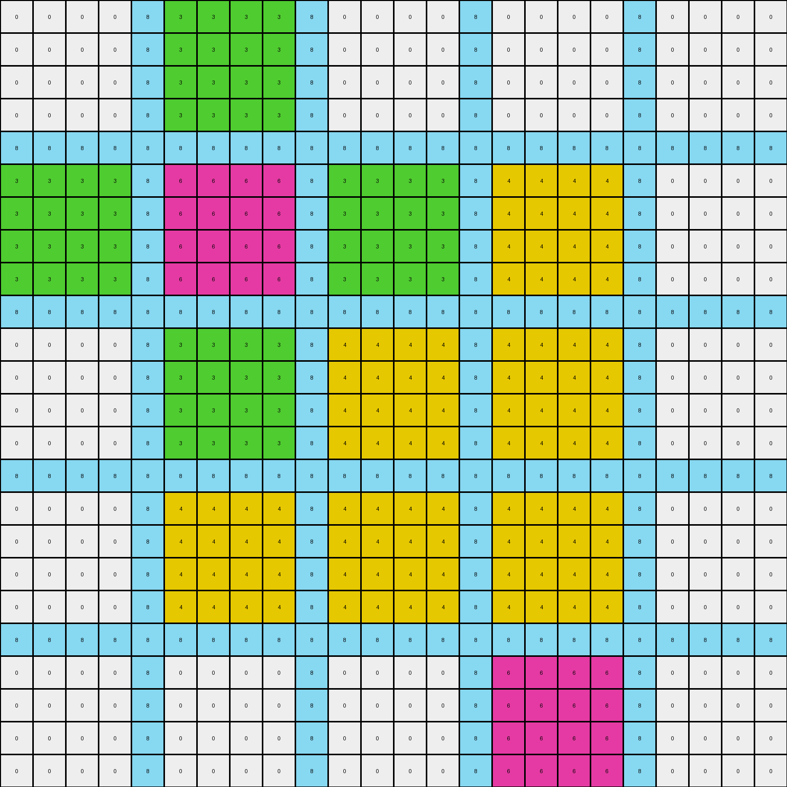
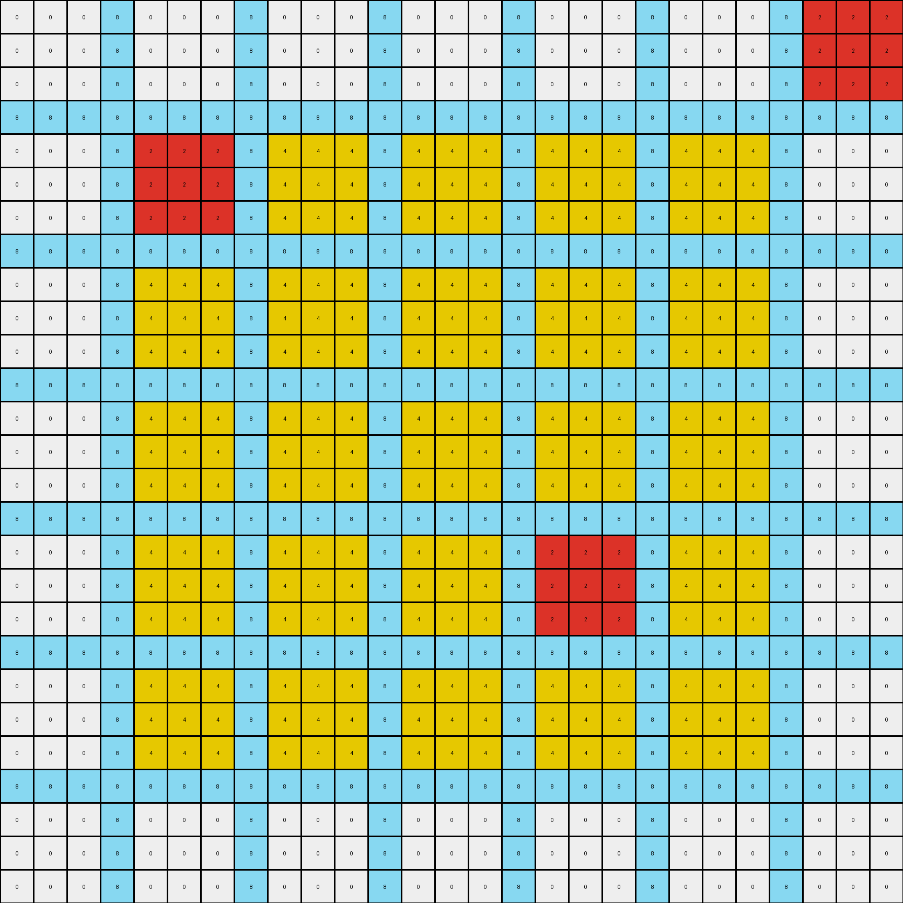

# 39e1d7f9 • 017 • refine_dreamer

---


Previous Code:
```python
"""
The transformation identifies regions enclosed by azure (8) lines.  White (0) pixels within these enclosed regions are filled with yellow (4).  Other colored regions within the azure boundaries are preserved. The azure boundaries themselves are also preserved.
"""

import numpy as np
from scipy import ndimage

def get_objects_by_color(grid, color):
    """Find contiguous regions of the specified color."""
    mask = (grid == color)
    labeled_array, num_features = ndimage.label(mask)
    objects = []
    for i in range(1, num_features + 1):
        objects.append(np.where(labeled_array == i))
    return objects

def is_enclosed(r, c, rows, cols, azure_objects):
    """
    Checks if a pixel at (r, c) is enclosed by azure lines.

    Args:
      r: Row index of the pixel.
      c: Column index of the pixel.
      rows: total number of rows in the grid.
      cols: total number of cols in the grid
      azure_objects:  locations of azure pixels

    Returns:
       True if enclosed, False otherwise.
    """

    # Check for azure pixels above, below, left, and right.  If any direction
    # *doesn't* have an azure pixel blocking it, it's not enclosed.

    has_azure_above = False
    has_azure_below = False
    has_azure_left = False
    has_azure_right = False
    
    for ar, ac in zip(*azure_objects):
        if ac == c:
            if ar < r:
                has_azure_above = True
            elif ar > r:
                has_azure_below = True
        if ar == r:
            if ac < c:
                has_azure_left = True
            elif ac > c:
                has_azure_right = True

    return has_azure_above and has_azure_below and has_azure_left and has_azure_right

def transform(input_grid):
    # initialize output_grid
    output_grid = np.copy(input_grid)
    rows, cols = input_grid.shape

    # get azure pixel locations
    azure_objects = get_objects_by_color(input_grid, 8)
    if not azure_objects:  # Handle cases with no azure pixels
        return output_grid

    # iterate through the grid
    for r in range(rows):
        for c in range(cols):
            # Check if the pixel is white and enclosed
            if input_grid[r, c] == 0:
                if is_enclosed(r, c, rows, cols, azure_objects[0]):
                    output_grid[r, c] = 4  # Fill with yellow

    return output_grid
```

Train Set Results:

## Example 1:

Input:
```
0 0 0 0 8 3 3 3 3 8 0 0 0 0 8 0 0 0 0 8 0 0 0 0
0 0 0 0 8 3 3 3 3 8 0 0 0 0 8 0 0 0 0 8 0 0 0 0
0 0 0 0 8 3 3 3 3 8 0 0 0 0 8 0 0 0 0 8 0 0 0 0
0 0 0 0 8 3 3 3 3 8 0 0 0 0 8 0 0 0 0 8 0 0 0 0
8 8 8 8 8 8 8 8 8 8 8 8 8 8 8 8 8 8 8 8 8 8 8 8
3 3 3 3 8 6 6 6 6 8 3 3 3 3 8 0 0 0 0 8 0 0 0 0
3 3 3 3 8 6 6 6 6 8 3 3 3 3 8 0 0 0 0 8 0 0 0 0
3 3 3 3 8 6 6 6 6 8 3 3 3 3 8 0 0 0 0 8 0 0 0 0
3 3 3 3 8 6 6 6 6 8 3 3 3 3 8 0 0 0 0 8 0 0 0 0
8 8 8 8 8 8 8 8 8 8 8 8 8 8 8 8 8 8 8 8 8 8 8 8
0 0 0 0 8 3 3 3 3 8 0 0 0 0 8 0 0 0 0 8 0 0 0 0
0 0 0 0 8 3 3 3 3 8 0 0 0 0 8 0 0 0 0 8 0 0 0 0
0 0 0 0 8 3 3 3 3 8 0 0 0 0 8 0 0 0 0 8 0 0 0 0
0 0 0 0 8 3 3 3 3 8 0 0 0 0 8 0 0 0 0 8 0 0 0 0
8 8 8 8 8 8 8 8 8 8 8 8 8 8 8 8 8 8 8 8 8 8 8 8
0 0 0 0 8 0 0 0 0 8 0 0 0 0 8 0 0 0 0 8 0 0 0 0
0 0 0 0 8 0 0 0 0 8 0 0 0 0 8 0 0 0 0 8 0 0 0 0
0 0 0 0 8 0 0 0 0 8 0 0 0 0 8 0 0 0 0 8 0 0 0 0
0 0 0 0 8 0 0 0 0 8 0 0 0 0 8 0 0 0 0 8 0 0 0 0
8 8 8 8 8 8 8 8 8 8 8 8 8 8 8 8 8 8 8 8 8 8 8 8
0 0 0 0 8 0 0 0 0 8 0 0 0 0 8 6 6 6 6 8 0 0 0 0
0 0 0 0 8 0 0 0 0 8 0 0 0 0 8 6 6 6 6 8 0 0 0 0
0 0 0 0 8 0 0 0 0 8 0 0 0 0 8 6 6 6 6 8 0 0 0 0
0 0 0 0 8 0 0 0 0 8 0 0 0 0 8 6 6 6 6 8 0 0 0 0
```
Expected Output:
```
0 0 0 0 8 3 3 3 3 8 0 0 0 0 8 0 0 0 0 8 0 0 0 0
0 0 0 0 8 3 3 3 3 8 0 0 0 0 8 0 0 0 0 8 0 0 0 0
0 0 0 0 8 3 3 3 3 8 0 0 0 0 8 0 0 0 0 8 0 0 0 0
0 0 0 0 8 3 3 3 3 8 0 0 0 0 8 0 0 0 0 8 0 0 0 0
8 8 8 8 8 8 8 8 8 8 8 8 8 8 8 8 8 8 8 8 8 8 8 8
3 3 3 3 8 6 6 6 6 8 3 3 3 3 8 0 0 0 0 8 0 0 0 0
3 3 3 3 8 6 6 6 6 8 3 3 3 3 8 0 0 0 0 8 0 0 0 0
3 3 3 3 8 6 6 6 6 8 3 3 3 3 8 0 0 0 0 8 0 0 0 0
3 3 3 3 8 6 6 6 6 8 3 3 3 3 8 0 0 0 0 8 0 0 0 0
8 8 8 8 8 8 8 8 8 8 8 8 8 8 8 8 8 8 8 8 8 8 8 8
0 0 0 0 8 3 3 3 3 8 0 0 0 0 8 0 0 0 0 8 0 0 0 0
0 0 0 0 8 3 3 3 3 8 0 0 0 0 8 0 0 0 0 8 0 0 0 0
0 0 0 0 8 3 3 3 3 8 0 0 0 0 8 0 0 0 0 8 0 0 0 0
0 0 0 0 8 3 3 3 3 8 0 0 0 0 8 0 0 0 0 8 0 0 0 0
8 8 8 8 8 8 8 8 8 8 8 8 8 8 8 8 8 8 8 8 8 8 8 8
0 0 0 0 8 0 0 0 0 8 0 0 0 0 8 3 3 3 3 8 0 0 0 0
0 0 0 0 8 0 0 0 0 8 0 0 0 0 8 3 3 3 3 8 0 0 0 0
0 0 0 0 8 0 0 0 0 8 0 0 0 0 8 3 3 3 3 8 0 0 0 0
0 0 0 0 8 0 0 0 0 8 0 0 0 0 8 3 3 3 3 8 0 0 0 0
8 8 8 8 8 8 8 8 8 8 8 8 8 8 8 8 8 8 8 8 8 8 8 8
0 0 0 0 8 0 0 0 0 8 3 3 3 3 8 6 6 6 6 8 3 3 3 3
0 0 0 0 8 0 0 0 0 8 3 3 3 3 8 6 6 6 6 8 3 3 3 3
0 0 0 0 8 0 0 0 0 8 3 3 3 3 8 6 6 6 6 8 3 3 3 3
0 0 0 0 8 0 0 0 0 8 3 3 3 3 8 6 6 6 6 8 3 3 3 3
```
Transformed Output:
```
0 0 0 0 8 3 3 3 3 8 0 0 0 0 8 0 0 0 0 8 0 0 0 0
0 0 0 0 8 3 3 3 3 8 0 0 0 0 8 0 0 0 0 8 0 0 0 0
0 0 0 0 8 3 3 3 3 8 0 0 0 0 8 0 0 0 0 8 0 0 0 0
0 0 0 0 8 3 3 3 3 8 0 0 0 0 8 0 0 0 0 8 0 0 0 0
8 8 8 8 8 8 8 8 8 8 8 8 8 8 8 8 8 8 8 8 8 8 8 8
3 3 3 3 8 6 6 6 6 8 3 3 3 3 8 4 4 4 4 8 0 0 0 0
3 3 3 3 8 6 6 6 6 8 3 3 3 3 8 4 4 4 4 8 0 0 0 0
3 3 3 3 8 6 6 6 6 8 3 3 3 3 8 4 4 4 4 8 0 0 0 0
3 3 3 3 8 6 6 6 6 8 3 3 3 3 8 4 4 4 4 8 0 0 0 0
8 8 8 8 8 8 8 8 8 8 8 8 8 8 8 8 8 8 8 8 8 8 8 8
0 0 0 0 8 3 3 3 3 8 4 4 4 4 8 4 4 4 4 8 0 0 0 0
0 0 0 0 8 3 3 3 3 8 4 4 4 4 8 4 4 4 4 8 0 0 0 0
0 0 0 0 8 3 3 3 3 8 4 4 4 4 8 4 4 4 4 8 0 0 0 0
0 0 0 0 8 3 3 3 3 8 4 4 4 4 8 4 4 4 4 8 0 0 0 0
8 8 8 8 8 8 8 8 8 8 8 8 8 8 8 8 8 8 8 8 8 8 8 8
0 0 0 0 8 4 4 4 4 8 4 4 4 4 8 4 4 4 4 8 0 0 0 0
0 0 0 0 8 4 4 4 4 8 4 4 4 4 8 4 4 4 4 8 0 0 0 0
0 0 0 0 8 4 4 4 4 8 4 4 4 4 8 4 4 4 4 8 0 0 0 0
0 0 0 0 8 4 4 4 4 8 4 4 4 4 8 4 4 4 4 8 0 0 0 0
8 8 8 8 8 8 8 8 8 8 8 8 8 8 8 8 8 8 8 8 8 8 8 8
0 0 0 0 8 0 0 0 0 8 0 0 0 0 8 6 6 6 6 8 0 0 0 0
0 0 0 0 8 0 0 0 0 8 0 0 0 0 8 6 6 6 6 8 0 0 0 0
0 0 0 0 8 0 0 0 0 8 0 0 0 0 8 6 6 6 6 8 0 0 0 0
0 0 0 0 8 0 0 0 0 8 0 0 0 0 8 6 6 6 6 8 0 0 0 0
```

match: False
pixels_off: 128
size_correct: True
color_palette_correct: False
correct_pixel_counts: False

## Example 2:

Input:
```
0 0 0 3 0 0 0 3 0 0 0 3 0 0 0 3 0 0 0 3 0 0 0 3 4 4 4
0 0 0 3 0 0 0 3 0 0 0 3 0 0 0 3 0 0 0 3 0 0 0 3 4 4 4
0 0 0 3 0 0 0 3 0 0 0 3 0 0 0 3 0 0 0 3 0 0 0 3 4 4 4
3 3 3 3 3 3 3 3 3 3 3 3 3 3 3 3 3 3 3 3 3 3 3 3 3 3 3
0 0 0 3 0 0 0 3 6 6 6 3 0 0 0 3 0 0 0 3 0 0 0 3 0 0 0
0 0 0 3 0 0 0 3 6 6 6 3 0 0 0 3 0 0 0 3 0 0 0 3 0 0 0
0 0 0 3 0 0 0 3 6 6 6 3 0 0 0 3 0 0 0 3 0 0 0 3 0 0 0
3 3 3 3 3 3 3 3 3 3 3 3 3 3 3 3 3 3 3 3 3 3 3 3 3 3 3
0 0 0 3 6 6 6 3 4 4 4 3 6 6 6 3 0 0 0 3 0 0 0 3 0 0 0
0 0 0 3 6 6 6 3 4 4 4 3 6 6 6 3 0 0 0 3 0 0 0 3 0 0 0
0 0 0 3 6 6 6 3 4 4 4 3 6 6 6 3 0 0 0 3 0 0 0 3 0 0 0
3 3 3 3 3 3 3 3 3 3 3 3 3 3 3 3 3 3 3 3 3 3 3 3 3 3 3
0 0 0 3 0 0 0 3 6 6 6 3 0 0 0 3 0 0 0 3 0 0 0 3 0 0 0
0 0 0 3 0 0 0 3 6 6 6 3 0 0 0 3 0 0 0 3 0 0 0 3 0 0 0
0 0 0 3 0 0 0 3 6 6 6 3 0 0 0 3 0 0 0 3 0 0 0 3 0 0 0
3 3 3 3 3 3 3 3 3 3 3 3 3 3 3 3 3 3 3 3 3 3 3 3 3 3 3
0 0 0 3 0 0 0 3 0 0 0 3 0 0 0 3 0 0 0 3 0 0 0 3 0 0 0
0 0 0 3 0 0 0 3 0 0 0 3 0 0 0 3 0 0 0 3 0 0 0 3 0 0 0
0 0 0 3 0 0 0 3 0 0 0 3 0 0 0 3 0 0 0 3 0 0 0 3 0 0 0
3 3 3 3 3 3 3 3 3 3 3 3 3 3 3 3 3 3 3 3 3 3 3 3 3 3 3
0 0 0 3 0 0 0 3 0 0 0 3 4 4 4 3 0 0 0 3 0 0 0 3 0 0 0
0 0 0 3 0 0 0 3 0 0 0 3 4 4 4 3 0 0 0 3 0 0 0 3 0 0 0
0 0 0 3 0 0 0 3 0 0 0 3 4 4 4 3 0 0 0 3 0 0 0 3 0 0 0
3 3 3 3 3 3 3 3 3 3 3 3 3 3 3 3 3 3 3 3 3 3 3 3 3 3 3
0 0 0 3 0 0 0 3 0 0 0 3 0 0 0 3 0 0 0 3 0 0 0 3 0 0 0
0 0 0 3 0 0 0 3 0 0 0 3 0 0 0 3 0 0 0 3 0 0 0 3 0 0 0
0 0 0 3 0 0 0 3 0 0 0 3 0 0 0 3 0 0 0 3 0 0 0 3 0 0 0
```
Expected Output:
```
0 0 0 3 0 0 0 3 0 0 0 3 0 0 0 3 0 0 0 3 6 6 6 3 4 4 4
0 0 0 3 0 0 0 3 0 0 0 3 0 0 0 3 0 0 0 3 6 6 6 3 4 4 4
0 0 0 3 0 0 0 3 0 0 0 3 0 0 0 3 0 0 0 3 6 6 6 3 4 4 4
3 3 3 3 3 3 3 3 3 3 3 3 3 3 3 3 3 3 3 3 3 3 3 3 3 3 3
0 0 0 3 0 0 0 3 6 6 6 3 0 0 0 3 0 0 0 3 0 0 0 3 6 6 6
0 0 0 3 0 0 0 3 6 6 6 3 0 0 0 3 0 0 0 3 0 0 0 3 6 6 6
0 0 0 3 0 0 0 3 6 6 6 3 0 0 0 3 0 0 0 3 0 0 0 3 6 6 6
3 3 3 3 3 3 3 3 3 3 3 3 3 3 3 3 3 3 3 3 3 3 3 3 3 3 3
0 0 0 3 6 6 6 3 4 4 4 3 6 6 6 3 0 0 0 3 0 0 0 3 0 0 0
0 0 0 3 6 6 6 3 4 4 4 3 6 6 6 3 0 0 0 3 0 0 0 3 0 0 0
0 0 0 3 6 6 6 3 4 4 4 3 6 6 6 3 0 0 0 3 0 0 0 3 0 0 0
3 3 3 3 3 3 3 3 3 3 3 3 3 3 3 3 3 3 3 3 3 3 3 3 3 3 3
0 0 0 3 0 0 0 3 6 6 6 3 0 0 0 3 0 0 0 3 0 0 0 3 0 0 0
0 0 0 3 0 0 0 3 6 6 6 3 0 0 0 3 0 0 0 3 0 0 0 3 0 0 0
0 0 0 3 0 0 0 3 6 6 6 3 0 0 0 3 0 0 0 3 0 0 0 3 0 0 0
3 3 3 3 3 3 3 3 3 3 3 3 3 3 3 3 3 3 3 3 3 3 3 3 3 3 3
0 0 0 3 0 0 0 3 0 0 0 3 6 6 6 3 0 0 0 3 0 0 0 3 0 0 0
0 0 0 3 0 0 0 3 0 0 0 3 6 6 6 3 0 0 0 3 0 0 0 3 0 0 0
0 0 0 3 0 0 0 3 0 0 0 3 6 6 6 3 0 0 0 3 0 0 0 3 0 0 0
3 3 3 3 3 3 3 3 3 3 3 3 3 3 3 3 3 3 3 3 3 3 3 3 3 3 3
0 0 0 3 0 0 0 3 6 6 6 3 4 4 4 3 6 6 6 3 0 0 0 3 0 0 0
0 0 0 3 0 0 0 3 6 6 6 3 4 4 4 3 6 6 6 3 0 0 0 3 0 0 0
0 0 0 3 0 0 0 3 6 6 6 3 4 4 4 3 6 6 6 3 0 0 0 3 0 0 0
3 3 3 3 3 3 3 3 3 3 3 3 3 3 3 3 3 3 3 3 3 3 3 3 3 3 3
0 0 0 3 0 0 0 3 0 0 0 3 6 6 6 3 0 0 0 3 0 0 0 3 0 0 0
0 0 0 3 0 0 0 3 0 0 0 3 6 6 6 3 0 0 0 3 0 0 0 3 0 0 0
0 0 0 3 0 0 0 3 0 0 0 3 6 6 6 3 0 0 0 3 0 0 0 3 0 0 0
```
Transformed Output:
```
0 0 0 3 0 0 0 3 0 0 0 3 0 0 0 3 0 0 0 3 0 0 0 3 4 4 4
0 0 0 3 0 0 0 3 0 0 0 3 0 0 0 3 0 0 0 3 0 0 0 3 4 4 4
0 0 0 3 0 0 0 3 0 0 0 3 0 0 0 3 0 0 0 3 0 0 0 3 4 4 4
3 3 3 3 3 3 3 3 3 3 3 3 3 3 3 3 3 3 3 3 3 3 3 3 3 3 3
0 0 0 3 0 0 0 3 6 6 6 3 0 0 0 3 0 0 0 3 0 0 0 3 0 0 0
0 0 0 3 0 0 0 3 6 6 6 3 0 0 0 3 0 0 0 3 0 0 0 3 0 0 0
0 0 0 3 0 0 0 3 6 6 6 3 0 0 0 3 0 0 0 3 0 0 0 3 0 0 0
3 3 3 3 3 3 3 3 3 3 3 3 3 3 3 3 3 3 3 3 3 3 3 3 3 3 3
0 0 0 3 6 6 6 3 4 4 4 3 6 6 6 3 0 0 0 3 0 0 0 3 0 0 0
0 0 0 3 6 6 6 3 4 4 4 3 6 6 6 3 0 0 0 3 0 0 0 3 0 0 0
0 0 0 3 6 6 6 3 4 4 4 3 6 6 6 3 0 0 0 3 0 0 0 3 0 0 0
3 3 3 3 3 3 3 3 3 3 3 3 3 3 3 3 3 3 3 3 3 3 3 3 3 3 3
0 0 0 3 0 0 0 3 6 6 6 3 0 0 0 3 0 0 0 3 0 0 0 3 0 0 0
0 0 0 3 0 0 0 3 6 6 6 3 0 0 0 3 0 0 0 3 0 0 0 3 0 0 0
0 0 0 3 0 0 0 3 6 6 6 3 0 0 0 3 0 0 0 3 0 0 0 3 0 0 0
3 3 3 3 3 3 3 3 3 3 3 3 3 3 3 3 3 3 3 3 3 3 3 3 3 3 3
0 0 0 3 0 0 0 3 0 0 0 3 0 0 0 3 0 0 0 3 0 0 0 3 0 0 0
0 0 0 3 0 0 0 3 0 0 0 3 0 0 0 3 0 0 0 3 0 0 0 3 0 0 0
0 0 0 3 0 0 0 3 0 0 0 3 0 0 0 3 0 0 0 3 0 0 0 3 0 0 0
3 3 3 3 3 3 3 3 3 3 3 3 3 3 3 3 3 3 3 3 3 3 3 3 3 3 3
0 0 0 3 0 0 0 3 0 0 0 3 4 4 4 3 0 0 0 3 0 0 0 3 0 0 0
0 0 0 3 0 0 0 3 0 0 0 3 4 4 4 3 0 0 0 3 0 0 0 3 0 0 0
0 0 0 3 0 0 0 3 0 0 0 3 4 4 4 3 0 0 0 3 0 0 0 3 0 0 0
3 3 3 3 3 3 3 3 3 3 3 3 3 3 3 3 3 3 3 3 3 3 3 3 3 3 3
0 0 0 3 0 0 0 3 0 0 0 3 0 0 0 3 0 0 0 3 0 0 0 3 0 0 0
0 0 0 3 0 0 0 3 0 0 0 3 0 0 0 3 0 0 0 3 0 0 0 3 0 0 0
0 0 0 3 0 0 0 3 0 0 0 3 0 0 0 3 0 0 0 3 0 0 0 3 0 0 0
```

match: False
pixels_off: 54
size_correct: True
color_palette_correct: True
correct_pixel_counts: False

## Example 3:

Input:
```
0 0 0 8 0 0 0 8 0 0 0 8 0 0 0 8 0 0 0 8 0 0 0 8 2 2 2
0 0 0 8 0 0 0 8 0 0 0 8 0 0 0 8 0 0 0 8 0 0 0 8 2 2 2
0 0 0 8 0 0 0 8 0 0 0 8 0 0 0 8 0 0 0 8 0 0 0 8 2 2 2
8 8 8 8 8 8 8 8 8 8 8 8 8 8 8 8 8 8 8 8 8 8 8 8 8 8 8
0 0 0 8 2 2 2 8 0 0 0 8 0 0 0 8 0 0 0 8 0 0 0 8 0 0 0
0 0 0 8 2 2 2 8 0 0 0 8 0 0 0 8 0 0 0 8 0 0 0 8 0 0 0
0 0 0 8 2 2 2 8 0 0 0 8 0 0 0 8 0 0 0 8 0 0 0 8 0 0 0
8 8 8 8 8 8 8 8 8 8 8 8 8 8 8 8 8 8 8 8 8 8 8 8 8 8 8
0 0 0 8 0 0 0 8 0 0 0 8 0 0 0 8 0 0 0 8 0 0 0 8 0 0 0
0 0 0 8 0 0 0 8 0 0 0 8 0 0 0 8 0 0 0 8 0 0 0 8 0 0 0
0 0 0 8 0 0 0 8 0 0 0 8 0 0 0 8 0 0 0 8 0 0 0 8 0 0 0
8 8 8 8 8 8 8 8 8 8 8 8 8 8 8 8 8 8 8 8 8 8 8 8 8 8 8
0 0 0 8 0 0 0 8 0 0 0 8 4 4 4 8 4 4 4 8 4 4 4 8 0 0 0
0 0 0 8 0 0 0 8 0 0 0 8 4 4 4 8 4 4 4 8 4 4 4 8 0 0 0
0 0 0 8 0 0 0 8 0 0 0 8 4 4 4 8 4 4 4 8 4 4 4 8 0 0 0
8 8 8 8 8 8 8 8 8 8 8 8 8 8 8 8 8 8 8 8 8 8 8 8 8 8 8
0 0 0 8 0 0 0 8 0 0 0 8 4 4 4 8 2 2 2 8 4 4 4 8 0 0 0
0 0 0 8 0 0 0 8 0 0 0 8 4 4 4 8 2 2 2 8 4 4 4 8 0 0 0
0 0 0 8 0 0 0 8 0 0 0 8 4 4 4 8 2 2 2 8 4 4 4 8 0 0 0
8 8 8 8 8 8 8 8 8 8 8 8 8 8 8 8 8 8 8 8 8 8 8 8 8 8 8
0 0 0 8 0 0 0 8 0 0 0 8 4 4 4 8 4 4 4 8 4 4 4 8 0 0 0
0 0 0 8 0 0 0 8 0 0 0 8 4 4 4 8 4 4 4 8 4 4 4 8 0 0 0
0 0 0 8 0 0 0 8 0 0 0 8 4 4 4 8 4 4 4 8 4 4 4 8 0 0 0
8 8 8 8 8 8 8 8 8 8 8 8 8 8 8 8 8 8 8 8 8 8 8 8 8 8 8
0 0 0 8 0 0 0 8 0 0 0 8 0 0 0 8 0 0 0 8 0 0 0 8 0 0 0
0 0 0 8 0 0 0 8 0 0 0 8 0 0 0 8 0 0 0 8 0 0 0 8 0 0 0
0 0 0 8 0 0 0 8 0 0 0 8 0 0 0 8 0 0 0 8 0 0 0 8 0 0 0
```
Expected Output:
```
4 4 4 8 4 4 4 8 4 4 4 8 0 0 0 8 0 0 0 8 4 4 4 8 2 2 2
4 4 4 8 4 4 4 8 4 4 4 8 0 0 0 8 0 0 0 8 4 4 4 8 2 2 2
4 4 4 8 4 4 4 8 4 4 4 8 0 0 0 8 0 0 0 8 4 4 4 8 2 2 2
8 8 8 8 8 8 8 8 8 8 8 8 8 8 8 8 8 8 8 8 8 8 8 8 8 8 8
4 4 4 8 2 2 2 8 4 4 4 8 0 0 0 8 0 0 0 8 4 4 4 8 4 4 4
4 4 4 8 2 2 2 8 4 4 4 8 0 0 0 8 0 0 0 8 4 4 4 8 4 4 4
4 4 4 8 2 2 2 8 4 4 4 8 0 0 0 8 0 0 0 8 4 4 4 8 4 4 4
8 8 8 8 8 8 8 8 8 8 8 8 8 8 8 8 8 8 8 8 8 8 8 8 8 8 8
4 4 4 8 4 4 4 8 4 4 4 8 0 0 0 8 0 0 0 8 0 0 0 8 0 0 0
4 4 4 8 4 4 4 8 4 4 4 8 0 0 0 8 0 0 0 8 0 0 0 8 0 0 0
4 4 4 8 4 4 4 8 4 4 4 8 0 0 0 8 0 0 0 8 0 0 0 8 0 0 0
8 8 8 8 8 8 8 8 8 8 8 8 8 8 8 8 8 8 8 8 8 8 8 8 8 8 8
0 0 0 8 0 0 0 8 0 0 0 8 4 4 4 8 4 4 4 8 4 4 4 8 0 0 0
0 0 0 8 0 0 0 8 0 0 0 8 4 4 4 8 4 4 4 8 4 4 4 8 0 0 0
0 0 0 8 0 0 0 8 0 0 0 8 4 4 4 8 4 4 4 8 4 4 4 8 0 0 0
8 8 8 8 8 8 8 8 8 8 8 8 8 8 8 8 8 8 8 8 8 8 8 8 8 8 8
0 0 0 8 0 0 0 8 0 0 0 8 4 4 4 8 2 2 2 8 4 4 4 8 0 0 0
0 0 0 8 0 0 0 8 0 0 0 8 4 4 4 8 2 2 2 8 4 4 4 8 0 0 0
0 0 0 8 0 0 0 8 0 0 0 8 4 4 4 8 2 2 2 8 4 4 4 8 0 0 0
8 8 8 8 8 8 8 8 8 8 8 8 8 8 8 8 8 8 8 8 8 8 8 8 8 8 8
0 0 0 8 0 0 0 8 0 0 0 8 4 4 4 8 4 4 4 8 4 4 4 8 0 0 0
0 0 0 8 0 0 0 8 0 0 0 8 4 4 4 8 4 4 4 8 4 4 4 8 0 0 0
0 0 0 8 0 0 0 8 0 0 0 8 4 4 4 8 4 4 4 8 4 4 4 8 0 0 0
8 8 8 8 8 8 8 8 8 8 8 8 8 8 8 8 8 8 8 8 8 8 8 8 8 8 8
0 0 0 8 0 0 0 8 0 0 0 8 0 0 0 8 0 0 0 8 0 0 0 8 0 0 0
0 0 0 8 0 0 0 8 0 0 0 8 0 0 0 8 0 0 0 8 0 0 0 8 0 0 0
0 0 0 8 0 0 0 8 0 0 0 8 0 0 0 8 0 0 0 8 0 0 0 8 0 0 0
```
Transformed Output:
```
0 0 0 8 0 0 0 8 0 0 0 8 0 0 0 8 0 0 0 8 0 0 0 8 2 2 2
0 0 0 8 0 0 0 8 0 0 0 8 0 0 0 8 0 0 0 8 0 0 0 8 2 2 2
0 0 0 8 0 0 0 8 0 0 0 8 0 0 0 8 0 0 0 8 0 0 0 8 2 2 2
8 8 8 8 8 8 8 8 8 8 8 8 8 8 8 8 8 8 8 8 8 8 8 8 8 8 8
0 0 0 8 2 2 2 8 4 4 4 8 4 4 4 8 4 4 4 8 4 4 4 8 0 0 0
0 0 0 8 2 2 2 8 4 4 4 8 4 4 4 8 4 4 4 8 4 4 4 8 0 0 0
0 0 0 8 2 2 2 8 4 4 4 8 4 4 4 8 4 4 4 8 4 4 4 8 0 0 0
8 8 8 8 8 8 8 8 8 8 8 8 8 8 8 8 8 8 8 8 8 8 8 8 8 8 8
0 0 0 8 4 4 4 8 4 4 4 8 4 4 4 8 4 4 4 8 4 4 4 8 0 0 0
0 0 0 8 4 4 4 8 4 4 4 8 4 4 4 8 4 4 4 8 4 4 4 8 0 0 0
0 0 0 8 4 4 4 8 4 4 4 8 4 4 4 8 4 4 4 8 4 4 4 8 0 0 0
8 8 8 8 8 8 8 8 8 8 8 8 8 8 8 8 8 8 8 8 8 8 8 8 8 8 8
0 0 0 8 4 4 4 8 4 4 4 8 4 4 4 8 4 4 4 8 4 4 4 8 0 0 0
0 0 0 8 4 4 4 8 4 4 4 8 4 4 4 8 4 4 4 8 4 4 4 8 0 0 0
0 0 0 8 4 4 4 8 4 4 4 8 4 4 4 8 4 4 4 8 4 4 4 8 0 0 0
8 8 8 8 8 8 8 8 8 8 8 8 8 8 8 8 8 8 8 8 8 8 8 8 8 8 8
0 0 0 8 4 4 4 8 4 4 4 8 4 4 4 8 2 2 2 8 4 4 4 8 0 0 0
0 0 0 8 4 4 4 8 4 4 4 8 4 4 4 8 2 2 2 8 4 4 4 8 0 0 0
0 0 0 8 4 4 4 8 4 4 4 8 4 4 4 8 2 2 2 8 4 4 4 8 0 0 0
8 8 8 8 8 8 8 8 8 8 8 8 8 8 8 8 8 8 8 8 8 8 8 8 8 8 8
0 0 0 8 4 4 4 8 4 4 4 8 4 4 4 8 4 4 4 8 4 4 4 8 0 0 0
0 0 0 8 4 4 4 8 4 4 4 8 4 4 4 8 4 4 4 8 4 4 4 8 0 0 0
0 0 0 8 4 4 4 8 4 4 4 8 4 4 4 8 4 4 4 8 4 4 4 8 0 0 0
8 8 8 8 8 8 8 8 8 8 8 8 8 8 8 8 8 8 8 8 8 8 8 8 8 8 8
0 0 0 8 0 0 0 8 0 0 0 8 0 0 0 8 0 0 0 8 0 0 0 8 0 0 0
0 0 0 8 0 0 0 8 0 0 0 8 0 0 0 8 0 0 0 8 0 0 0 8 0 0 0
0 0 0 8 0 0 0 8 0 0 0 8 0 0 0 8 0 0 0 8 0 0 0 8 0 0 0
```

match: False
pixels_off: 162
size_correct: True
color_palette_correct: True
correct_pixel_counts: False

**INSTRUCTIONS**

The code above was generated based on observations from the first training
example

we have tested the transform function on each of the task example inputs and
compared with the expected output

review each of the examples provided and the results and consider how the
natural language program should be updated to accommodate this new knowledge

respond with the following deliverables:

- general assessment of the information provided and strategy for resolving the
  errors
- gather metrics about each of the examples and results - use code_execution to
  develop accurate reports on your assumptions
- a YAML block documenting facts - Focus on identifying objects, their properties, and the actions performed on them.
- a natural language program - Be as clear and concise as possible, providing a complete description of the transformation rule.


your responses should be considered as information in a report - not a
conversation
