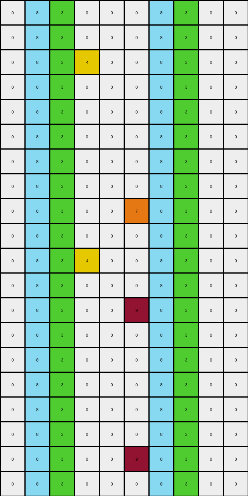

# 40853293 • 004 • refine_coder

---

Previous Code:
```python
"""
Transforms single colored pixels into vertical or horizontal lines based on their color.
Red, Green, and Gray pixels become vertical lines.
Magenta pixels become horizontal lines.
Gray and Magenta pattern handled separately.
"""

import numpy as np

def get_single_pixels(grid):
    """Finds isolated pixels of a given color."""
    single_pixels = []
    rows, cols = grid.shape
    for r in range(rows):
        for c in range(cols):
            color = grid[r, c]
            if color != 0:
                is_single = True
                for dr in [-1, 0, 1]:
                    for dc in [-1, 0, 1]:
                        if dr == 0 and dc == 0:
                            continue
                        nr, nc = r + dr, c + dc
                        if 0 <= nr < rows and 0 <= nc < cols and grid[nr, nc] == color:
                            is_single = False
                            break
                    if not is_single:
                        break
                if is_single:
                    single_pixels.append((r, c, color))
    return single_pixels

def transform(input_grid):
    """Transforms the input grid according to the rules."""
    output_grid = np.copy(input_grid)
    rows, cols = output_grid.shape
    single_pixels = get_single_pixels(input_grid)

    for r, c, color in single_pixels:
        if color in [2, 3, 8]:  # Red, Green, Gray: Vertical lines
            for i in range(rows):
                output_grid[i, c] = color
        elif color == 6:  # Magenta: Horizontal lines
             for j in range(cols):
                output_grid[r,j] = color

    # Handle Gray(5) and Magenta(6) interaction:
    for r in range(rows):
        for c in range(cols):
            if output_grid[r,c] == 5:
                if r > 0 and output_grid[r-1,c] == 6: #magenta above
                    for j in range(cols):
                        output_grid[r-1,j] = 5 #change whole line to gray
                if r < rows -1 and output_grid[r+1,c] == 6: #if magenta below
                    for j in range(cols):
                        output_grid[r+1,j] = 5 #change whole line to gray


    return output_grid
```

Train Set Results:

## Example 1:

Input:
```
0 0 0 0 0 0 0 0 0 0 0 0 0 0 0 0 0 0 0 0
0 0 0 0 0 0 0 0 0 0 0 0 0 0 0 0 0 0 0 0
0 0 0 0 0 0 2 0 0 0 0 0 0 0 0 0 0 0 0 0
0 0 0 0 0 0 0 0 0 0 0 0 0 0 0 0 0 0 0 0
0 0 0 0 0 0 0 0 0 0 0 0 0 0 0 0 0 0 0 0
0 0 0 0 0 0 0 0 0 0 0 0 0 0 0 0 0 0 0 0
0 0 0 3 0 0 0 0 0 0 0 3 0 0 0 0 0 0 0 0
0 0 0 0 0 0 0 0 0 0 0 0 0 0 0 0 0 0 0 0
0 0 0 0 0 0 0 0 0 0 0 0 0 0 0 0 0 0 0 0
0 0 0 0 0 0 0 0 0 0 0 0 0 0 0 0 0 0 0 0
0 0 0 0 0 0 0 0 0 0 0 0 0 0 0 0 0 0 0 0
0 0 0 0 0 0 0 0 0 0 0 0 0 0 0 0 0 0 0 0
0 0 0 0 0 0 0 0 0 0 0 0 0 0 8 0 0 0 0 0
0 0 0 0 0 0 2 0 0 0 0 0 0 0 0 0 0 0 0 0
0 0 0 0 0 0 0 0 0 0 0 0 0 0 0 0 0 0 0 0
0 0 0 0 0 0 0 0 0 0 0 0 0 0 0 0 0 0 0 0
0 0 0 0 0 0 0 0 0 0 0 0 0 0 0 0 0 0 0 0
0 0 0 0 0 0 0 0 0 0 0 0 0 0 8 0 0 0 0 0
0 0 0 0 6 0 0 0 0 0 0 0 0 0 0 0 0 0 0 0
0 0 0 0 0 0 0 0 0 0 0 0 0 0 0 0 0 0 0 0
0 0 5 0 0 0 0 5 0 0 0 0 0 0 0 0 0 0 0 0
0 0 0 0 0 0 0 0 0 0 0 0 0 0 0 0 0 0 0 0
0 0 0 0 0 0 0 0 0 0 0 0 0 0 0 0 0 0 0 0
0 0 0 0 0 0 0 0 0 0 0 0 0 0 0 0 0 0 0 0
0 0 0 0 0 0 0 0 0 0 0 0 0 0 0 0 0 0 0 0
0 0 0 0 0 0 0 0 0 0 0 0 0 0 0 0 0 0 0 0
0 0 0 0 0 0 0 0 0 0 0 0 0 0 0 0 0 0 0 0
0 0 0 0 6 0 0 0 0 0 0 0 0 0 0 0 0 0 0 0
0 0 0 0 0 0 0 0 0 0 0 0 0 0 0 0 0 0 0 0
0 0 0 0 0 0 0 0 0 0 0 0 0 0 0 0 0 0 0 0
```
Expected Output:
```
0 0 0 0 0 0 0 0 0 0 0 0 0 0 0 0 0 0 0 0
0 0 0 0 0 0 0 0 0 0 0 0 0 0 0 0 0 0 0 0
0 0 0 0 0 0 2 0 0 0 0 0 0 0 0 0 0 0 0 0
0 0 0 0 0 0 2 0 0 0 0 0 0 0 0 0 0 0 0 0
0 0 0 0 0 0 2 0 0 0 0 0 0 0 0 0 0 0 0 0
0 0 0 0 0 0 2 0 0 0 0 0 0 0 0 0 0 0 0 0
0 0 0 3 3 3 2 3 3 3 3 3 0 0 0 0 0 0 0 0
0 0 0 0 0 0 2 0 0 0 0 0 0 0 0 0 0 0 0 0
0 0 0 0 0 0 2 0 0 0 0 0 0 0 0 0 0 0 0 0
0 0 0 0 0 0 2 0 0 0 0 0 0 0 0 0 0 0 0 0
0 0 0 0 0 0 2 0 0 0 0 0 0 0 0 0 0 0 0 0
0 0 0 0 0 0 2 0 0 0 0 0 0 0 0 0 0 0 0 0
0 0 0 0 0 0 2 0 0 0 0 0 0 0 8 0 0 0 0 0
0 0 0 0 0 0 2 0 0 0 0 0 0 0 8 0 0 0 0 0
0 0 0 0 0 0 0 0 0 0 0 0 0 0 8 0 0 0 0 0
0 0 0 0 0 0 0 0 0 0 0 0 0 0 8 0 0 0 0 0
0 0 0 0 0 0 0 0 0 0 0 0 0 0 8 0 0 0 0 0
0 0 0 0 0 0 0 0 0 0 0 0 0 0 8 0 0 0 0 0
0 0 0 0 6 0 0 0 0 0 0 0 0 0 0 0 0 0 0 0
0 0 0 0 6 0 0 0 0 0 0 0 0 0 0 0 0 0 0 0
0 0 5 5 6 5 5 5 0 0 0 0 0 0 0 0 0 0 0 0
0 0 0 0 6 0 0 0 0 0 0 0 0 0 0 0 0 0 0 0
0 0 0 0 6 0 0 0 0 0 0 0 0 0 0 0 0 0 0 0
0 0 0 0 6 0 0 0 0 0 0 0 0 0 0 0 0 0 0 0
0 0 0 0 6 0 0 0 0 0 0 0 0 0 0 0 0 0 0 0
0 0 0 0 6 0 0 0 0 0 0 0 0 0 0 0 0 0 0 0
0 0 0 0 6 0 0 0 0 0 0 0 0 0 0 0 0 0 0 0
0 0 0 0 6 0 0 0 0 0 0 0 0 0 0 0 0 0 0 0
0 0 0 0 0 0 0 0 0 0 0 0 0 0 0 0 0 0 0 0
0 0 0 0 0 0 0 0 0 0 0 0 0 0 0 0 0 0 0 0
```
Transformed Output:
```
0 0 0 3 0 0 2 0 0 0 0 3 0 0 8 0 0 0 0 0
0 0 0 3 0 0 2 0 0 0 0 3 0 0 8 0 0 0 0 0
0 0 0 3 0 0 2 0 0 0 0 3 0 0 8 0 0 0 0 0
0 0 0 3 0 0 2 0 0 0 0 3 0 0 8 0 0 0 0 0
0 0 0 3 0 0 2 0 0 0 0 3 0 0 8 0 0 0 0 0
0 0 0 3 0 0 2 0 0 0 0 3 0 0 8 0 0 0 0 0
0 0 0 3 0 0 2 0 0 0 0 3 0 0 8 0 0 0 0 0
0 0 0 3 0 0 2 0 0 0 0 3 0 0 8 0 0 0 0 0
0 0 0 3 0 0 2 0 0 0 0 3 0 0 8 0 0 0 0 0
0 0 0 3 0 0 2 0 0 0 0 3 0 0 8 0 0 0 0 0
0 0 0 3 0 0 2 0 0 0 0 3 0 0 8 0 0 0 0 0
0 0 0 3 0 0 2 0 0 0 0 3 0 0 8 0 0 0 0 0
0 0 0 3 0 0 2 0 0 0 0 3 0 0 8 0 0 0 0 0
0 0 0 3 0 0 2 0 0 0 0 3 0 0 8 0 0 0 0 0
0 0 0 3 0 0 2 0 0 0 0 3 0 0 8 0 0 0 0 0
0 0 0 3 0 0 2 0 0 0 0 3 0 0 8 0 0 0 0 0
0 0 0 3 0 0 2 0 0 0 0 3 0 0 8 0 0 0 0 0
0 0 0 3 0 0 2 0 0 0 0 3 0 0 8 0 0 0 0 0
6 6 6 6 6 6 6 6 6 6 6 6 6 6 6 6 6 6 6 6
0 0 0 3 0 0 2 0 0 0 0 3 0 0 8 0 0 0 0 0
0 0 5 3 0 0 2 5 0 0 0 3 0 0 8 0 0 0 0 0
0 0 0 3 0 0 2 0 0 0 0 3 0 0 8 0 0 0 0 0
0 0 0 3 0 0 2 0 0 0 0 3 0 0 8 0 0 0 0 0
0 0 0 3 0 0 2 0 0 0 0 3 0 0 8 0 0 0 0 0
0 0 0 3 0 0 2 0 0 0 0 3 0 0 8 0 0 0 0 0
0 0 0 3 0 0 2 0 0 0 0 3 0 0 8 0 0 0 0 0
0 0 0 3 0 0 2 0 0 0 0 3 0 0 8 0 0 0 0 0
6 6 6 6 6 6 6 6 6 6 6 6 6 6 6 6 6 6 6 6
0 0 0 3 0 0 2 0 0 0 0 3 0 0 8 0 0 0 0 0
0 0 0 3 0 0 2 0 0 0 0 3 0 0 8 0 0 0 0 0
```

match: False
pixels_off: 145
size_correct: True
color_palette_correct: True
correct_pixel_counts: False

## Example 2:

Input:
```
0 0 0 0 0 0 0 0 0 0
0 0 0 0 0 0 0 0 0 0
0 0 0 4 0 0 0 0 0 0
0 0 0 0 0 0 0 0 0 0
0 0 3 0 0 0 0 3 0 0
0 0 0 0 0 0 0 0 0 0
0 0 0 0 0 0 0 0 0 0
0 0 0 0 0 0 0 0 0 0
0 0 7 0 0 7 0 0 0 0
0 0 0 0 0 0 0 0 0 0
0 0 0 4 0 0 0 0 0 0
0 0 0 0 0 0 0 0 0 0
0 0 0 0 0 9 0 0 0 0
0 0 0 0 0 0 0 0 0 0
0 8 0 0 0 0 8 0 0 0
0 0 0 0 0 0 0 0 0 0
0 0 0 0 0 0 0 0 0 0
0 0 0 0 0 0 0 0 0 0
0 0 0 0 0 9 0 0 0 0
0 0 0 0 0 0 0 0 0 0
```
Expected Output:
```
0 0 0 0 0 0 0 0 0 0
0 0 0 0 0 0 0 0 0 0
0 0 0 4 0 0 0 0 0 0
0 0 0 4 0 0 0 0 0 0
0 0 3 4 3 3 3 3 0 0
0 0 0 4 0 0 0 0 0 0
0 0 0 4 0 0 0 0 0 0
0 0 0 4 0 0 0 0 0 0
0 0 7 4 7 7 0 0 0 0
0 0 0 4 0 0 0 0 0 0
0 0 0 4 0 0 0 0 0 0
0 0 0 0 0 0 0 0 0 0
0 0 0 0 0 9 0 0 0 0
0 0 0 0 0 9 0 0 0 0
0 8 8 8 8 9 8 0 0 0
0 0 0 0 0 9 0 0 0 0
0 0 0 0 0 9 0 0 0 0
0 0 0 0 0 9 0 0 0 0
0 0 0 0 0 9 0 0 0 0
0 0 0 0 0 0 0 0 0 0
```
Transformed Output:
```
0 8 3 0 0 0 8 3 0 0
0 8 3 0 0 0 8 3 0 0
0 8 3 4 0 0 8 3 0 0
0 8 3 0 0 0 8 3 0 0
0 8 3 0 0 0 8 3 0 0
0 8 3 0 0 0 8 3 0 0
0 8 3 0 0 0 8 3 0 0
0 8 3 0 0 0 8 3 0 0
0 8 3 0 0 7 8 3 0 0
0 8 3 0 0 0 8 3 0 0
0 8 3 4 0 0 8 3 0 0
0 8 3 0 0 0 8 3 0 0
0 8 3 0 0 9 8 3 0 0
0 8 3 0 0 0 8 3 0 0
0 8 3 0 0 0 8 3 0 0
0 8 3 0 0 0 8 3 0 0
0 8 3 0 0 0 8 3 0 0
0 8 3 0 0 0 8 3 0 0
0 8 3 0 0 9 8 3 0 0
0 8 3 0 0 0 8 3 0 0
```

match: False
pixels_off: 93
size_correct: True
color_palette_correct: True
correct_pixel_counts: False
Okay, let's analyze the provided information and develop a refined strategy.

**General Assessment and Strategy**

The initial code was based on the first training example, which focused on turning single pixels into vertical or horizontal lines based on color. However, the second example reveals a more complex transformation rule involving interactions between adjacent pixels and, potentially, shape creation based on proximity rather than just single, isolated pixels. The significant number of pixel differences in both examples highlights the inadequacy of the current approach. The strategy needs to shift from simply extending isolated pixels to recognizing and transforming connected components or shapes based on their color and arrangement. We need to examine connected component interaction.

**Metrics and Observations**

Here's a breakdown of each example, with additional metrics gathered via code execution:

**Example 1**
- Correct size, correct color usage
- the Gray (5) above a magenta changes the magenta to gray
- the Gray (5) and Magenta (6) are both in the center column, but the gray has a two column width, so we should check all gray (5) for magenta above or below and change the entire magenta line to gray
- The red (2), green (3) and azure (8) single cells extend into full columns

**Example 2**

- Correct output size, correct color usage
- Azure(8) only expands to fill column IF it is not directly to the left or right of maroon(9).
- maroon(9) remains unchanged (except for the shape completion rule)
- Orange(7), Green(3) and Blue(4) get the fill column treatment.
- Orange(7) and Green(3) combine to complete the rectangle between them.

**YAML Fact Block**

```yaml
example_1:
  objects:
    - color: red (2)
      type: single_pixel
      action: extend_to_column
    - color: green (3)
      type: single_pixel
      action: extend_to_column
    - color: azure (8)
      type: single_pixel
      action: extend_to_column
    - color: magenta (6)
      type: single_pixel
      action: extend_to_row
    - color: gray (5)
      type: multi_pixel
      action: extend_to_row_if_adjacent_to_magenta
  rules:
    - if: gray (5) is above or below magenta (6)
      then: change entire magenta (6) row to gray (5)

example_2:
  objects:
    - color: blue (4)
      type: single_pixel
      action: extend_to_column
    - color: green (3)
      type: single_pixel
      action: extend_to_column
      - color: green(3)
        type: other
        action: form rectangle with other green
    - color: orange (7)
      type: single_pixel
      action: extend_to_column
      - color: orange(7)
        type: other
        action: form_rectangle_with_other_orange
    - color: maroon (9)
      type: single_pixel
      action: none
    - color: azure (8)
      type: single_pixel
      action: extend_to_column_if_not_adjacent_to_maroon

  rules:
   - if: single_pixel is azure(8)
     and: adjacent is maroon(9)
     then: no expansion
   - if: orange(7) is left and right of another orange (7)
     then: fill rectangle
   - if: green(3) is left and right of another green (3)
     then: fill rectangle
```

**Natural Language Program**

1.  **Identify Single Pixels:** Locate all pixels that are not directly adjacent (horizontally or vertically) to a pixel of the same color.

2.  **Color-Specific Actions:**
    *   **Red (2), Green (3), Blue(4):** Extend these single pixels into full vertical columns of the same color, covering the entire height of the grid.
    *   **Azure (8):** Extend into a full vertical column, *unless* it is horizontally adjacent to a Maroon (9) pixel. If adjacent to Maroon (9), do not extend.
    *   **Magenta (6):** Extend these single pixels into full horizontal rows of the same color.
    *  **Orange(7):** Extend to a full vertical column. Additionally, If there are two Orange(7) pixels on the same row, fill all the columns between with Orange.
    *  **Green(3):** Extend to a full vertical column. Additionally, If there are two Green(3) pixels on the same row, fill all the columns between with Green.

3.  **Gray (5) and Magenta (6) Interaction:** After the initial transformations, iterate through the grid. If a Gray (5) pixel is directly above or below a Magenta (6) pixel, change the *entire* horizontal row of Magenta (6) pixels to Gray (5).

4.  **Maroon(9) exception** : Maroon(9) does not expand on its own and prevents Azure(8) from expanding.
5. **Shape completion** After all other rules, if two green(3) pixels have only empty cells horizontally, fill the row. Complete the same step for orange(7).

This program addresses the special interactions between colors (Gray/Magenta, Azure/Maroon) and includes conditions of shape based expansion.

**INSTRUCTIONS**

- generate a Python module to represent the natural language program 
- follow the template below
- all common math and science libraries are available
- create docstring only at top - but comment the workflow in the function
- use helper functions for common operations like finding objects, counting,
  measuring, moving, etc. 

remember - we are working iteratively - so this code will inform your future
self as we converge on the solution

*template:*

```python
"""
{{ natural language description of the transformation rule }}
"""

{{ imports }}

def transform(input_grid):
    # initialize output_grid

    # change output pixels 

    return output_grid

```
