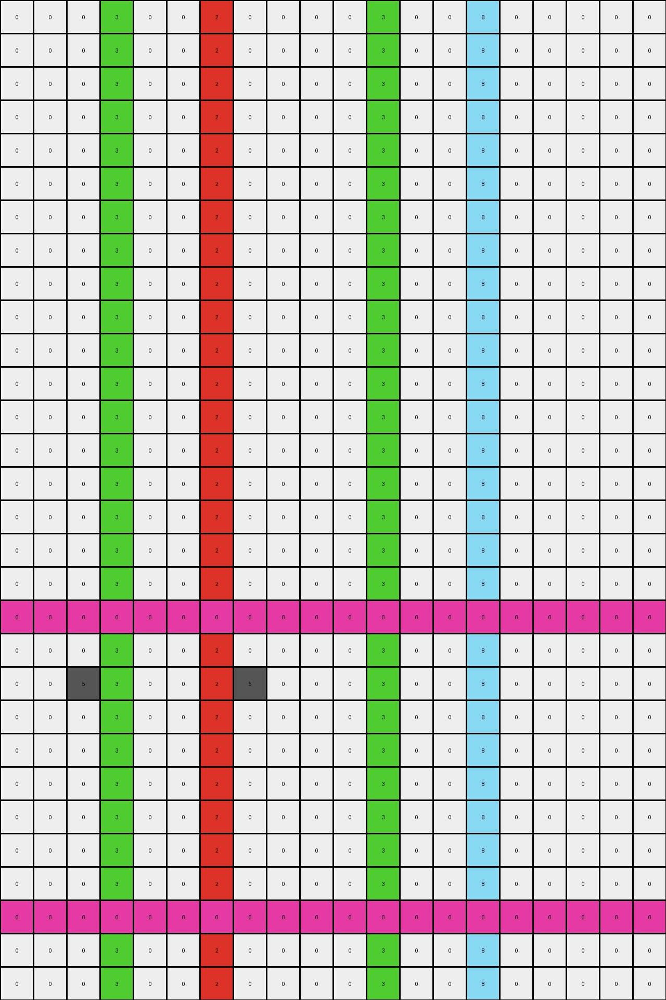
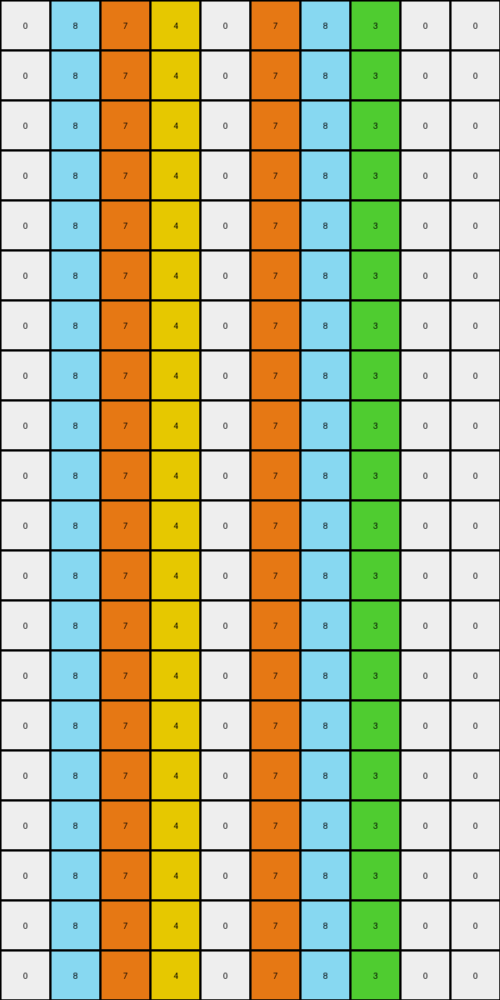

# 40853293 • 005 • refine_dreamer

---


Previous Code:
```python
"""
Transforms single colored pixels into vertical or horizontal lines based on their color, with special handling for interactions between Gray/Magenta and Azure/Maroon, and shape completion for orange and green.
"""

import numpy as np

def get_single_pixels(grid):
    """Finds isolated pixels of a given color."""
    single_pixels = []
    rows, cols = grid.shape
    for r in range(rows):
        for c in range(cols):
            color = grid[r, c]
            if color != 0:
                is_single = True
                for dr in [-1, 0, 1]:
                    for dc in [-1, 0, 1]:
                        if dr == 0 and dc == 0:
                            continue
                        nr, nc = r + dr, c + dc
                        if 0 <= nr < rows and 0 <= nc < cols and grid[nr, nc] == color:
                            is_single = False
                            break
                    if not is_single:
                        break
                if is_single:
                    single_pixels.append((r, c, color))
    return single_pixels

def transform(input_grid):
    """Transforms the input grid according to the rules."""
    output_grid = np.copy(input_grid)
    rows, cols = output_grid.shape
    single_pixels = get_single_pixels(input_grid)

    # Initial transformations based on single pixels
    for r, c, color in single_pixels:
        if color in [2, 3, 4, 7]:  # Red, Green, Blue, Orange: Vertical lines
            for i in range(rows):
                output_grid[i, c] = color
        elif color == 6:  # Magenta: Horizontal lines
             for j in range(cols):
                output_grid[r,j] = color
        elif color == 8: # Azure: Conditional Vertical Line
            is_adjacent_to_maroon = False
            for dr, dc in [(0, -1), (0, 1)]: # Check left/right
                nr, nc = r + dr, c + dc
                if 0 <= nr < rows and 0 <= nc < cols and input_grid[nr, nc] == 9:
                    is_adjacent_to_maroon = True
                    break
            if not is_adjacent_to_maroon:
                for i in range(rows):
                    output_grid[i,c] = color


    # Handle Gray(5) and Magenta(6) interaction:
    for r in range(rows):
        for c in range(cols):
            if output_grid[r,c] == 5:
                if r > 0 and output_grid[r-1,c] == 6: #magenta above
                    for j in range(cols):
                        output_grid[r-1,j] = 5 #change whole line to gray
                if r < rows -1 and output_grid[r+1,c] == 6: #if magenta below
                    for j in range(cols):
                        output_grid[r+1,j] = 5 #change whole line to gray

    # Handle shape completion for orange(7) and green(3)
    for r in range(rows):
        orange_positions = []
        green_positions = []

        for c in range(cols):
            if output_grid[r,c] == 7:
                orange_positions.append(c)
            elif output_grid[r,c] == 3:
                green_positions.append(c)

        if len(orange_positions) >= 2:
            for i in range(len(orange_positions)-1):
                start_c = orange_positions[i]
                end_c = orange_positions[i+1]
                all_empty = True
                for c in range(start_c +1, end_c):
                   if output_grid[r,c] != 0:
                       all_empty = False
                       break
                if all_empty:
                    for c in range(start_c+1, end_c):
                        output_grid[r,c] = 7

        if len(green_positions) >= 2:
             for i in range(len(green_positions)-1):
                start_c = green_positions[i]
                end_c = green_positions[i+1]
                all_empty = True

                for c in range(start_c + 1, end_c):
                   if output_grid[r,c] != 0:
                       all_empty = False
                       break

                if all_empty:
                    for c in range(start_c + 1, end_c):
                        output_grid[r,c] = 3
    return output_grid
```

Train Set Results:

## Example 1:

Input:
```
0 0 0 0 0 0 0 0 0 0 0 0 0 0 0 0 0 0 0 0
0 0 0 0 0 0 0 0 0 0 0 0 0 0 0 0 0 0 0 0
0 0 0 0 0 0 2 0 0 0 0 0 0 0 0 0 0 0 0 0
0 0 0 0 0 0 0 0 0 0 0 0 0 0 0 0 0 0 0 0
0 0 0 0 0 0 0 0 0 0 0 0 0 0 0 0 0 0 0 0
0 0 0 0 0 0 0 0 0 0 0 0 0 0 0 0 0 0 0 0
0 0 0 3 0 0 0 0 0 0 0 3 0 0 0 0 0 0 0 0
0 0 0 0 0 0 0 0 0 0 0 0 0 0 0 0 0 0 0 0
0 0 0 0 0 0 0 0 0 0 0 0 0 0 0 0 0 0 0 0
0 0 0 0 0 0 0 0 0 0 0 0 0 0 0 0 0 0 0 0
0 0 0 0 0 0 0 0 0 0 0 0 0 0 0 0 0 0 0 0
0 0 0 0 0 0 0 0 0 0 0 0 0 0 0 0 0 0 0 0
0 0 0 0 0 0 0 0 0 0 0 0 0 0 8 0 0 0 0 0
0 0 0 0 0 0 2 0 0 0 0 0 0 0 0 0 0 0 0 0
0 0 0 0 0 0 0 0 0 0 0 0 0 0 0 0 0 0 0 0
0 0 0 0 0 0 0 0 0 0 0 0 0 0 0 0 0 0 0 0
0 0 0 0 0 0 0 0 0 0 0 0 0 0 0 0 0 0 0 0
0 0 0 0 0 0 0 0 0 0 0 0 0 0 8 0 0 0 0 0
0 0 0 0 6 0 0 0 0 0 0 0 0 0 0 0 0 0 0 0
0 0 0 0 0 0 0 0 0 0 0 0 0 0 0 0 0 0 0 0
0 0 5 0 0 0 0 5 0 0 0 0 0 0 0 0 0 0 0 0
0 0 0 0 0 0 0 0 0 0 0 0 0 0 0 0 0 0 0 0
0 0 0 0 0 0 0 0 0 0 0 0 0 0 0 0 0 0 0 0
0 0 0 0 0 0 0 0 0 0 0 0 0 0 0 0 0 0 0 0
0 0 0 0 0 0 0 0 0 0 0 0 0 0 0 0 0 0 0 0
0 0 0 0 0 0 0 0 0 0 0 0 0 0 0 0 0 0 0 0
0 0 0 0 0 0 0 0 0 0 0 0 0 0 0 0 0 0 0 0
0 0 0 0 6 0 0 0 0 0 0 0 0 0 0 0 0 0 0 0
0 0 0 0 0 0 0 0 0 0 0 0 0 0 0 0 0 0 0 0
0 0 0 0 0 0 0 0 0 0 0 0 0 0 0 0 0 0 0 0
```
Expected Output:
```
0 0 0 0 0 0 0 0 0 0 0 0 0 0 0 0 0 0 0 0
0 0 0 0 0 0 0 0 0 0 0 0 0 0 0 0 0 0 0 0
0 0 0 0 0 0 2 0 0 0 0 0 0 0 0 0 0 0 0 0
0 0 0 0 0 0 2 0 0 0 0 0 0 0 0 0 0 0 0 0
0 0 0 0 0 0 2 0 0 0 0 0 0 0 0 0 0 0 0 0
0 0 0 0 0 0 2 0 0 0 0 0 0 0 0 0 0 0 0 0
0 0 0 3 3 3 2 3 3 3 3 3 0 0 0 0 0 0 0 0
0 0 0 0 0 0 2 0 0 0 0 0 0 0 0 0 0 0 0 0
0 0 0 0 0 0 2 0 0 0 0 0 0 0 0 0 0 0 0 0
0 0 0 0 0 0 2 0 0 0 0 0 0 0 0 0 0 0 0 0
0 0 0 0 0 0 2 0 0 0 0 0 0 0 0 0 0 0 0 0
0 0 0 0 0 0 2 0 0 0 0 0 0 0 0 0 0 0 0 0
0 0 0 0 0 0 2 0 0 0 0 0 0 0 8 0 0 0 0 0
0 0 0 0 0 0 2 0 0 0 0 0 0 0 8 0 0 0 0 0
0 0 0 0 0 0 0 0 0 0 0 0 0 0 8 0 0 0 0 0
0 0 0 0 0 0 0 0 0 0 0 0 0 0 8 0 0 0 0 0
0 0 0 0 0 0 0 0 0 0 0 0 0 0 8 0 0 0 0 0
0 0 0 0 0 0 0 0 0 0 0 0 0 0 8 0 0 0 0 0
0 0 0 0 6 0 0 0 0 0 0 0 0 0 0 0 0 0 0 0
0 0 0 0 6 0 0 0 0 0 0 0 0 0 0 0 0 0 0 0
0 0 5 5 6 5 5 5 0 0 0 0 0 0 0 0 0 0 0 0
0 0 0 0 6 0 0 0 0 0 0 0 0 0 0 0 0 0 0 0
0 0 0 0 6 0 0 0 0 0 0 0 0 0 0 0 0 0 0 0
0 0 0 0 6 0 0 0 0 0 0 0 0 0 0 0 0 0 0 0
0 0 0 0 6 0 0 0 0 0 0 0 0 0 0 0 0 0 0 0
0 0 0 0 6 0 0 0 0 0 0 0 0 0 0 0 0 0 0 0
0 0 0 0 6 0 0 0 0 0 0 0 0 0 0 0 0 0 0 0
0 0 0 0 6 0 0 0 0 0 0 0 0 0 0 0 0 0 0 0
0 0 0 0 0 0 0 0 0 0 0 0 0 0 0 0 0 0 0 0
0 0 0 0 0 0 0 0 0 0 0 0 0 0 0 0 0 0 0 0
```
Transformed Output:
```
0 0 0 3 0 0 2 0 0 0 0 3 0 0 8 0 0 0 0 0
0 0 0 3 0 0 2 0 0 0 0 3 0 0 8 0 0 0 0 0
0 0 0 3 0 0 2 0 0 0 0 3 0 0 8 0 0 0 0 0
0 0 0 3 0 0 2 0 0 0 0 3 0 0 8 0 0 0 0 0
0 0 0 3 0 0 2 0 0 0 0 3 0 0 8 0 0 0 0 0
0 0 0 3 0 0 2 0 0 0 0 3 0 0 8 0 0 0 0 0
0 0 0 3 0 0 2 0 0 0 0 3 0 0 8 0 0 0 0 0
0 0 0 3 0 0 2 0 0 0 0 3 0 0 8 0 0 0 0 0
0 0 0 3 0 0 2 0 0 0 0 3 0 0 8 0 0 0 0 0
0 0 0 3 0 0 2 0 0 0 0 3 0 0 8 0 0 0 0 0
0 0 0 3 0 0 2 0 0 0 0 3 0 0 8 0 0 0 0 0
0 0 0 3 0 0 2 0 0 0 0 3 0 0 8 0 0 0 0 0
0 0 0 3 0 0 2 0 0 0 0 3 0 0 8 0 0 0 0 0
0 0 0 3 0 0 2 0 0 0 0 3 0 0 8 0 0 0 0 0
0 0 0 3 0 0 2 0 0 0 0 3 0 0 8 0 0 0 0 0
0 0 0 3 0 0 2 0 0 0 0 3 0 0 8 0 0 0 0 0
0 0 0 3 0 0 2 0 0 0 0 3 0 0 8 0 0 0 0 0
0 0 0 3 0 0 2 0 0 0 0 3 0 0 8 0 0 0 0 0
6 6 6 6 6 6 6 6 6 6 6 6 6 6 6 6 6 6 6 6
0 0 0 3 0 0 2 0 0 0 0 3 0 0 8 0 0 0 0 0
0 0 5 3 0 0 2 5 0 0 0 3 0 0 8 0 0 0 0 0
0 0 0 3 0 0 2 0 0 0 0 3 0 0 8 0 0 0 0 0
0 0 0 3 0 0 2 0 0 0 0 3 0 0 8 0 0 0 0 0
0 0 0 3 0 0 2 0 0 0 0 3 0 0 8 0 0 0 0 0
0 0 0 3 0 0 2 0 0 0 0 3 0 0 8 0 0 0 0 0
0 0 0 3 0 0 2 0 0 0 0 3 0 0 8 0 0 0 0 0
0 0 0 3 0 0 2 0 0 0 0 3 0 0 8 0 0 0 0 0
6 6 6 6 6 6 6 6 6 6 6 6 6 6 6 6 6 6 6 6
0 0 0 3 0 0 2 0 0 0 0 3 0 0 8 0 0 0 0 0
0 0 0 3 0 0 2 0 0 0 0 3 0 0 8 0 0 0 0 0
```

match: False
pixels_off: 145
size_correct: True
color_palette_correct: True
correct_pixel_counts: False

## Example 2:

Input:
```
0 0 0 0 0 0 0 0 0 0
0 0 0 0 0 0 0 0 0 0
0 0 0 4 0 0 0 0 0 0
0 0 0 0 0 0 0 0 0 0
0 0 3 0 0 0 0 3 0 0
0 0 0 0 0 0 0 0 0 0
0 0 0 0 0 0 0 0 0 0
0 0 0 0 0 0 0 0 0 0
0 0 7 0 0 7 0 0 0 0
0 0 0 0 0 0 0 0 0 0
0 0 0 4 0 0 0 0 0 0
0 0 0 0 0 0 0 0 0 0
0 0 0 0 0 9 0 0 0 0
0 0 0 0 0 0 0 0 0 0
0 8 0 0 0 0 8 0 0 0
0 0 0 0 0 0 0 0 0 0
0 0 0 0 0 0 0 0 0 0
0 0 0 0 0 0 0 0 0 0
0 0 0 0 0 9 0 0 0 0
0 0 0 0 0 0 0 0 0 0
```
Expected Output:
```
0 0 0 0 0 0 0 0 0 0
0 0 0 0 0 0 0 0 0 0
0 0 0 4 0 0 0 0 0 0
0 0 0 4 0 0 0 0 0 0
0 0 3 4 3 3 3 3 0 0
0 0 0 4 0 0 0 0 0 0
0 0 0 4 0 0 0 0 0 0
0 0 0 4 0 0 0 0 0 0
0 0 7 4 7 7 0 0 0 0
0 0 0 4 0 0 0 0 0 0
0 0 0 4 0 0 0 0 0 0
0 0 0 0 0 0 0 0 0 0
0 0 0 0 0 9 0 0 0 0
0 0 0 0 0 9 0 0 0 0
0 8 8 8 8 9 8 0 0 0
0 0 0 0 0 9 0 0 0 0
0 0 0 0 0 9 0 0 0 0
0 0 0 0 0 9 0 0 0 0
0 0 0 0 0 9 0 0 0 0
0 0 0 0 0 0 0 0 0 0
```
Transformed Output:
```
0 8 7 4 0 7 8 3 0 0
0 8 7 4 0 7 8 3 0 0
0 8 7 4 0 7 8 3 0 0
0 8 7 4 0 7 8 3 0 0
0 8 7 4 0 7 8 3 0 0
0 8 7 4 0 7 8 3 0 0
0 8 7 4 0 7 8 3 0 0
0 8 7 4 0 7 8 3 0 0
0 8 7 4 0 7 8 3 0 0
0 8 7 4 0 7 8 3 0 0
0 8 7 4 0 7 8 3 0 0
0 8 7 4 0 7 8 3 0 0
0 8 7 4 0 7 8 3 0 0
0 8 7 4 0 7 8 3 0 0
0 8 7 4 0 7 8 3 0 0
0 8 7 4 0 7 8 3 0 0
0 8 7 4 0 7 8 3 0 0
0 8 7 4 0 7 8 3 0 0
0 8 7 4 0 7 8 3 0 0
0 8 7 4 0 7 8 3 0 0
```

match: False
pixels_off: 109
size_correct: True
color_palette_correct: True
correct_pixel_counts: False

**INSTRUCTIONS**

The code above was generated based on observations from the first training
example

we have tested the transform function on each of the task example inputs and
compared with the expected output

review each of the examples provided and the results and consider how the
natural language program should be updated to accommodate this new knowledge

respond with the following deliverables:

- general assessment of the information provided and strategy for resolving the
  errors
- gather metrics about each of the examples and results - use code_execution to
  develop accurate reports on your assumptions
- a YAML block documenting facts - Focus on identifying objects, their properties, and the actions performed on them.
- a natural language program - Be as clear and concise as possible, providing a complete description of the transformation rule.


your responses should be considered as information in a report - not a
conversation
