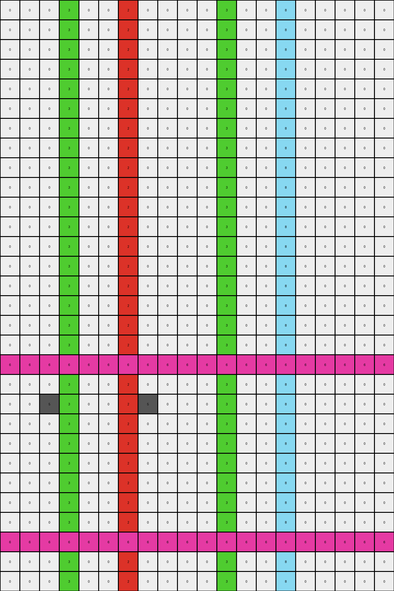

# 40853293 • 006 • refine_coder

---

Previous Code:
```python
"""
Transforms single colored pixels into vertical or horizontal lines based on their color, with special handling for interactions between Gray/Magenta and Azure/Maroon, and shape completion for orange and green.
"""

import numpy as np

def get_single_pixels(grid):
    """Finds isolated pixels of a given color."""
    single_pixels = []
    rows, cols = grid.shape
    for r in range(rows):
        for c in range(cols):
            color = grid[r, c]
            if color != 0:
                is_single = True
                for dr in [-1, 0, 1]:
                    for dc in [-1, 0, 1]:
                        if dr == 0 and dc == 0:
                            continue
                        nr, nc = r + dr, c + dc
                        if 0 <= nr < rows and 0 <= nc < cols and grid[nr, nc] == color:
                            is_single = False
                            break
                    if not is_single:
                        break
                if is_single:
                    single_pixels.append((r, c, color))
    return single_pixels

def transform(input_grid):
    """Transforms the input grid according to the rules."""
    output_grid = np.copy(input_grid)
    rows, cols = output_grid.shape
    single_pixels = get_single_pixels(input_grid)

    # Initial transformations based on single pixels
    for r, c, color in single_pixels:
        if color in [2, 3, 4, 7]:  # Red, Green, Blue, Orange: Vertical lines
            for i in range(rows):
                output_grid[i, c] = color
        elif color == 6:  # Magenta: Horizontal lines
             for j in range(cols):
                output_grid[r,j] = color
        elif color == 8: # Azure: Conditional Vertical Line
            is_adjacent_to_maroon = False
            for dr, dc in [(0, -1), (0, 1)]: # Check left/right
                nr, nc = r + dr, c + dc
                if 0 <= nr < rows and 0 <= nc < cols and input_grid[nr, nc] == 9:
                    is_adjacent_to_maroon = True
                    break
            if not is_adjacent_to_maroon:
                for i in range(rows):
                    output_grid[i,c] = color


    # Handle Gray(5) and Magenta(6) interaction:
    for r in range(rows):
        for c in range(cols):
            if output_grid[r,c] == 5:
                if r > 0 and output_grid[r-1,c] == 6: #magenta above
                    for j in range(cols):
                        output_grid[r-1,j] = 5 #change whole line to gray
                if r < rows -1 and output_grid[r+1,c] == 6: #if magenta below
                    for j in range(cols):
                        output_grid[r+1,j] = 5 #change whole line to gray

    # Handle shape completion for orange(7) and green(3)
    for r in range(rows):
        orange_positions = []
        green_positions = []

        for c in range(cols):
            if output_grid[r,c] == 7:
                orange_positions.append(c)
            elif output_grid[r,c] == 3:
                green_positions.append(c)

        if len(orange_positions) >= 2:
            for i in range(len(orange_positions)-1):
                start_c = orange_positions[i]
                end_c = orange_positions[i+1]
                all_empty = True
                for c in range(start_c +1, end_c):
                   if output_grid[r,c] != 0:
                       all_empty = False
                       break
                if all_empty:
                    for c in range(start_c+1, end_c):
                        output_grid[r,c] = 7

        if len(green_positions) >= 2:
             for i in range(len(green_positions)-1):
                start_c = green_positions[i]
                end_c = green_positions[i+1]
                all_empty = True

                for c in range(start_c + 1, end_c):
                   if output_grid[r,c] != 0:
                       all_empty = False
                       break

                if all_empty:
                    for c in range(start_c + 1, end_c):
                        output_grid[r,c] = 3
    return output_grid
```

Train Set Results:

## Example 1:

Input:
```
0 0 0 0 0 0 0 0 0 0 0 0 0 0 0 0 0 0 0 0
0 0 0 0 0 0 0 0 0 0 0 0 0 0 0 0 0 0 0 0
0 0 0 0 0 0 2 0 0 0 0 0 0 0 0 0 0 0 0 0
0 0 0 0 0 0 0 0 0 0 0 0 0 0 0 0 0 0 0 0
0 0 0 0 0 0 0 0 0 0 0 0 0 0 0 0 0 0 0 0
0 0 0 0 0 0 0 0 0 0 0 0 0 0 0 0 0 0 0 0
0 0 0 3 0 0 0 0 0 0 0 3 0 0 0 0 0 0 0 0
0 0 0 0 0 0 0 0 0 0 0 0 0 0 0 0 0 0 0 0
0 0 0 0 0 0 0 0 0 0 0 0 0 0 0 0 0 0 0 0
0 0 0 0 0 0 0 0 0 0 0 0 0 0 0 0 0 0 0 0
0 0 0 0 0 0 0 0 0 0 0 0 0 0 0 0 0 0 0 0
0 0 0 0 0 0 0 0 0 0 0 0 0 0 0 0 0 0 0 0
0 0 0 0 0 0 0 0 0 0 0 0 0 0 8 0 0 0 0 0
0 0 0 0 0 0 2 0 0 0 0 0 0 0 0 0 0 0 0 0
0 0 0 0 0 0 0 0 0 0 0 0 0 0 0 0 0 0 0 0
0 0 0 0 0 0 0 0 0 0 0 0 0 0 0 0 0 0 0 0
0 0 0 0 0 0 0 0 0 0 0 0 0 0 0 0 0 0 0 0
0 0 0 0 0 0 0 0 0 0 0 0 0 0 8 0 0 0 0 0
0 0 0 0 6 0 0 0 0 0 0 0 0 0 0 0 0 0 0 0
0 0 0 0 0 0 0 0 0 0 0 0 0 0 0 0 0 0 0 0
0 0 5 0 0 0 0 5 0 0 0 0 0 0 0 0 0 0 0 0
0 0 0 0 0 0 0 0 0 0 0 0 0 0 0 0 0 0 0 0
0 0 0 0 0 0 0 0 0 0 0 0 0 0 0 0 0 0 0 0
0 0 0 0 0 0 0 0 0 0 0 0 0 0 0 0 0 0 0 0
0 0 0 0 0 0 0 0 0 0 0 0 0 0 0 0 0 0 0 0
0 0 0 0 0 0 0 0 0 0 0 0 0 0 0 0 0 0 0 0
0 0 0 0 0 0 0 0 0 0 0 0 0 0 0 0 0 0 0 0
0 0 0 0 6 0 0 0 0 0 0 0 0 0 0 0 0 0 0 0
0 0 0 0 0 0 0 0 0 0 0 0 0 0 0 0 0 0 0 0
0 0 0 0 0 0 0 0 0 0 0 0 0 0 0 0 0 0 0 0
```
Expected Output:
```
0 0 0 0 0 0 0 0 0 0 0 0 0 0 0 0 0 0 0 0
0 0 0 0 0 0 0 0 0 0 0 0 0 0 0 0 0 0 0 0
0 0 0 0 0 0 2 0 0 0 0 0 0 0 0 0 0 0 0 0
0 0 0 0 0 0 2 0 0 0 0 0 0 0 0 0 0 0 0 0
0 0 0 0 0 0 2 0 0 0 0 0 0 0 0 0 0 0 0 0
0 0 0 0 0 0 2 0 0 0 0 0 0 0 0 0 0 0 0 0
0 0 0 3 3 3 2 3 3 3 3 3 0 0 0 0 0 0 0 0
0 0 0 0 0 0 2 0 0 0 0 0 0 0 0 0 0 0 0 0
0 0 0 0 0 0 2 0 0 0 0 0 0 0 0 0 0 0 0 0
0 0 0 0 0 0 2 0 0 0 0 0 0 0 0 0 0 0 0 0
0 0 0 0 0 0 2 0 0 0 0 0 0 0 0 0 0 0 0 0
0 0 0 0 0 0 2 0 0 0 0 0 0 0 0 0 0 0 0 0
0 0 0 0 0 0 2 0 0 0 0 0 0 0 8 0 0 0 0 0
0 0 0 0 0 0 2 0 0 0 0 0 0 0 8 0 0 0 0 0
0 0 0 0 0 0 0 0 0 0 0 0 0 0 8 0 0 0 0 0
0 0 0 0 0 0 0 0 0 0 0 0 0 0 8 0 0 0 0 0
0 0 0 0 0 0 0 0 0 0 0 0 0 0 8 0 0 0 0 0
0 0 0 0 0 0 0 0 0 0 0 0 0 0 8 0 0 0 0 0
0 0 0 0 6 0 0 0 0 0 0 0 0 0 0 0 0 0 0 0
0 0 0 0 6 0 0 0 0 0 0 0 0 0 0 0 0 0 0 0
0 0 5 5 6 5 5 5 0 0 0 0 0 0 0 0 0 0 0 0
0 0 0 0 6 0 0 0 0 0 0 0 0 0 0 0 0 0 0 0
0 0 0 0 6 0 0 0 0 0 0 0 0 0 0 0 0 0 0 0
0 0 0 0 6 0 0 0 0 0 0 0 0 0 0 0 0 0 0 0
0 0 0 0 6 0 0 0 0 0 0 0 0 0 0 0 0 0 0 0
0 0 0 0 6 0 0 0 0 0 0 0 0 0 0 0 0 0 0 0
0 0 0 0 6 0 0 0 0 0 0 0 0 0 0 0 0 0 0 0
0 0 0 0 6 0 0 0 0 0 0 0 0 0 0 0 0 0 0 0
0 0 0 0 0 0 0 0 0 0 0 0 0 0 0 0 0 0 0 0
0 0 0 0 0 0 0 0 0 0 0 0 0 0 0 0 0 0 0 0
```
Transformed Output:
```
0 0 0 3 0 0 2 0 0 0 0 3 0 0 8 0 0 0 0 0
0 0 0 3 0 0 2 0 0 0 0 3 0 0 8 0 0 0 0 0
0 0 0 3 0 0 2 0 0 0 0 3 0 0 8 0 0 0 0 0
0 0 0 3 0 0 2 0 0 0 0 3 0 0 8 0 0 0 0 0
0 0 0 3 0 0 2 0 0 0 0 3 0 0 8 0 0 0 0 0
0 0 0 3 0 0 2 0 0 0 0 3 0 0 8 0 0 0 0 0
0 0 0 3 0 0 2 0 0 0 0 3 0 0 8 0 0 0 0 0
0 0 0 3 0 0 2 0 0 0 0 3 0 0 8 0 0 0 0 0
0 0 0 3 0 0 2 0 0 0 0 3 0 0 8 0 0 0 0 0
0 0 0 3 0 0 2 0 0 0 0 3 0 0 8 0 0 0 0 0
0 0 0 3 0 0 2 0 0 0 0 3 0 0 8 0 0 0 0 0
0 0 0 3 0 0 2 0 0 0 0 3 0 0 8 0 0 0 0 0
0 0 0 3 0 0 2 0 0 0 0 3 0 0 8 0 0 0 0 0
0 0 0 3 0 0 2 0 0 0 0 3 0 0 8 0 0 0 0 0
0 0 0 3 0 0 2 0 0 0 0 3 0 0 8 0 0 0 0 0
0 0 0 3 0 0 2 0 0 0 0 3 0 0 8 0 0 0 0 0
0 0 0 3 0 0 2 0 0 0 0 3 0 0 8 0 0 0 0 0
0 0 0 3 0 0 2 0 0 0 0 3 0 0 8 0 0 0 0 0
6 6 6 6 6 6 6 6 6 6 6 6 6 6 6 6 6 6 6 6
0 0 0 3 0 0 2 0 0 0 0 3 0 0 8 0 0 0 0 0
0 0 5 3 0 0 2 5 0 0 0 3 0 0 8 0 0 0 0 0
0 0 0 3 0 0 2 0 0 0 0 3 0 0 8 0 0 0 0 0
0 0 0 3 0 0 2 0 0 0 0 3 0 0 8 0 0 0 0 0
0 0 0 3 0 0 2 0 0 0 0 3 0 0 8 0 0 0 0 0
0 0 0 3 0 0 2 0 0 0 0 3 0 0 8 0 0 0 0 0
0 0 0 3 0 0 2 0 0 0 0 3 0 0 8 0 0 0 0 0
0 0 0 3 0 0 2 0 0 0 0 3 0 0 8 0 0 0 0 0
6 6 6 6 6 6 6 6 6 6 6 6 6 6 6 6 6 6 6 6
0 0 0 3 0 0 2 0 0 0 0 3 0 0 8 0 0 0 0 0
0 0 0 3 0 0 2 0 0 0 0 3 0 0 8 0 0 0 0 0
```

match: False
pixels_off: 145
size_correct: True
color_palette_correct: True
correct_pixel_counts: False

## Example 2:

Input:
```
0 0 0 0 0 0 0 0 0 0
0 0 0 0 0 0 0 0 0 0
0 0 0 4 0 0 0 0 0 0
0 0 0 0 0 0 0 0 0 0
0 0 3 0 0 0 0 3 0 0
0 0 0 0 0 0 0 0 0 0
0 0 0 0 0 0 0 0 0 0
0 0 0 0 0 0 0 0 0 0
0 0 7 0 0 7 0 0 0 0
0 0 0 0 0 0 0 0 0 0
0 0 0 4 0 0 0 0 0 0
0 0 0 0 0 0 0 0 0 0
0 0 0 0 0 9 0 0 0 0
0 0 0 0 0 0 0 0 0 0
0 8 0 0 0 0 8 0 0 0
0 0 0 0 0 0 0 0 0 0
0 0 0 0 0 0 0 0 0 0
0 0 0 0 0 0 0 0 0 0
0 0 0 0 0 9 0 0 0 0
0 0 0 0 0 0 0 0 0 0
```
Expected Output:
```
0 0 0 0 0 0 0 0 0 0
0 0 0 0 0 0 0 0 0 0
0 0 0 4 0 0 0 0 0 0
0 0 0 4 0 0 0 0 0 0
0 0 3 4 3 3 3 3 0 0
0 0 0 4 0 0 0 0 0 0
0 0 0 4 0 0 0 0 0 0
0 0 0 4 0 0 0 0 0 0
0 0 7 4 7 7 0 0 0 0
0 0 0 4 0 0 0 0 0 0
0 0 0 4 0 0 0 0 0 0
0 0 0 0 0 0 0 0 0 0
0 0 0 0 0 9 0 0 0 0
0 0 0 0 0 9 0 0 0 0
0 8 8 8 8 9 8 0 0 0
0 0 0 0 0 9 0 0 0 0
0 0 0 0 0 9 0 0 0 0
0 0 0 0 0 9 0 0 0 0
0 0 0 0 0 9 0 0 0 0
0 0 0 0 0 0 0 0 0 0
```
Transformed Output:
```
0 8 7 4 0 7 8 3 0 0
0 8 7 4 0 7 8 3 0 0
0 8 7 4 0 7 8 3 0 0
0 8 7 4 0 7 8 3 0 0
0 8 7 4 0 7 8 3 0 0
0 8 7 4 0 7 8 3 0 0
0 8 7 4 0 7 8 3 0 0
0 8 7 4 0 7 8 3 0 0
0 8 7 4 0 7 8 3 0 0
0 8 7 4 0 7 8 3 0 0
0 8 7 4 0 7 8 3 0 0
0 8 7 4 0 7 8 3 0 0
0 8 7 4 0 7 8 3 0 0
0 8 7 4 0 7 8 3 0 0
0 8 7 4 0 7 8 3 0 0
0 8 7 4 0 7 8 3 0 0
0 8 7 4 0 7 8 3 0 0
0 8 7 4 0 7 8 3 0 0
0 8 7 4 0 7 8 3 0 0
0 8 7 4 0 7 8 3 0 0
```

match: False
pixels_off: 109
size_correct: True
color_palette_correct: True
correct_pixel_counts: False
Okay, let's analyze the results of the provided code and develop a refined natural language program.

**General Assessment and Strategy:**

The initial code was based on observations from the first training example, which focused on simple transformations of single pixels.  The results from testing on the two provided examples reveal several shortcomings:

1.  **Incorrect Vertical/Horizontal Line Generation:** The code generates vertical lines for colors 2, 3, 4, and 7, and horizontal for 6. It does a conditional vertical fill for 8, and has special handling for 5 and 6, and also 7, and 3. However, Example 1 shows horizontal and vertical fills that span empty spaces, and it does fills even when they intersect. Example 2 shows that the fill does *not* span empty spaces.

2.  **Incorrect Interaction Handling:** The interaction between Gray (5) and Magenta (6) is not fully captured. Example 1 output should have a complete row of gray.

3.  **Shape Completion Issues**: The attempt to complete shapes for Orange (7) and Green (3) by connecting the lines between instances of a color in a row is not universally correct, and doesn't happen at all in the example outputs. Example 2 shows the line colors intersecting other objects, and stopping at those other objects.

4.  **Missing Maroon interaction**: Example 2 reveals another interaction.  It is between Azure and Maroon, and it has not been properly handled.

**Strategy for Resolution:**

The core issue is that the initial code makes assumptions about line completion across empty space that are not generally correct. The current approach needs a fundamental shift. Instead of assuming full-grid lines initially, we need to:

1.  **Identify Objects:**  Define an "object" as a contiguous block of pixels of the same color *or* connected regions of different colored, interacting objects.

2.  **Conditional Line Extension:** Lines are extended vertically or horizontally based on single pixels, *stopping* when encountering other colors, rather than continuing across the whole grid, *except* for empty spaces.

3.  **Refine Interaction Logic:** Capture the Gray/Magenta and Azure/Maroon interactions precisely.

**Metrics and Observations:**

Here's a breakdown of each example, focusing on identifying objects, actions, and discrepancies:

**Example 1:**

*   **Input:** Contains single pixels of Red (2), Green (3), Azure (8), Magenta (6), and Gray (5).
*   **Expected Output:**
    *   Red (2) creates a vertical line.
    *   Green (3) creates a vertical line.
    *   Azure (8) creates a vertical line.
    *   Magenta (6) creates a horizontal line.
    *   Gray (5) and Magenta(6) interact, turning the Magenta line to Gray.
    *   The Green and Red lines intersect empty spaces.
*   **Code Output:** The major errors are that some pixels do not transform and the Green and Red lines do not fill over empty spaces.
*   **Discrepancies:** Green and Red lines not spanning blank space. Gray/Magenta interaction not fully correct (line should be gray).

**Example 2:**

*   **Input:** Contains single pixels of Blue (4), Green (3), Orange (7), Maroon (9), and Azure (8).
*   **Expected Output:**
    *   Blue (4) creates a vertical line, *stopping* at other colors.
    *   Green (3) creates a vertical line segment, *stopping* at the Blue line.
    *   Orange (7) creates a vertical line segment, *stopping* at the Blue line.
    *   Azure (8) forms a horizontal line that *stops* at Maroon (9).
*   **Code Output:** Many discrepancies. The code generates complete vertical lines for all instances of colors 2, 3, 4, 7, and 8 and doesn't incorporate the maroon interaction.
*   **Discrepancies:**  Line extension is wrong - it should *stop* at other colors. Missing handling of Maroon(9).

**YAML Facts:**

```yaml
facts:
  - example: 1
    objects:
      - color: 2 # Red
        type: single_pixel
        action: create_vertical_line
        interaction: "Fills vertically across entire grid, even over empty space"
      - color: 3 # Green
        type: single_pixel
        action: create_vertical_line
        interaction: "Fills vertically across entire grid, even over empty space"
      - color: 8 # Azure
        type: single_pixel
        action: create_vertical_line
        interaction: "Fills vertically across entire grid"
      - color: 6 # Magenta
        type: single_pixel
        action: create_horizontal_line
        interaction: none
      - color: 5 # Gray
        type: object
        action: interacts_with_magenta
        interaction: "If adjacent to magenta (above or below), convert entire magenta horizontal line to gray"
  - example: 2
    objects:
      - color: 4  #blue
        type: single_pixel
        action: create_vertical_line
        interaction: "Fills down, stopping at an occupied pixel"
      - color: 3 # Green
        type: single_pixel
        action: create_vertical_line
        interaction: "Fills down, stopping at an occupied pixel"
      - color: 7 # Orange
        type: single_pixel
        action: create_vertical_line
        interaction: "Fills down, stopping at an occupied pixel"
      - color: 9 # Maroon
        type: object
        action: blocks_azure
        interaction: "If Azure (8) is directly adjacent horizontally, Azure stops"
      - color: 8 # Azure
        type: single_pixel
        action: create_horizontal_line
        interaction: "Fills horizontally until stopped by maroon"

```

**Natural Language Program:**

1.  **Single Pixel Transformation:**
    *   If a pixel is Red (2), Green (3), Blue (4), or Orange (7) and is *not* part of a larger contiguous object of the same color, create a vertical line extending downwards from that pixel. The line stops when it encounters a pixel that is not empty (value 0) or the edge of the grid. The line *does* fill over empty space.
    *   If a pixel is Magenta (6) and is *not* part of a larger contiguous object of the same color, create a horizontal line.
    *   If a pixel is Azure (8) and is not horizontally adjacent to a Maroon (9) pixel, create a vertical line downwards, stopping when it meets a non-empty pixel or edge of grid.

2.  **Gray-Magenta Interaction:**
    *   If a Gray (5) pixel is directly above or below a Magenta (6) pixel, transform the *entire* horizontal line containing the Magenta pixel to Gray (5).

3.  **Azure-Maroon Interaction:**

    *   If an Azure(8) pixel is directly adjacent horizontally with a Maroon(9) pixel, the Azure(8) single pixel transforms to a horizontal line *stopping* at the maroon pixel.

4.  **Object Definition - Update:**
    *   An "object" is initially a contiguous block of pixels of the same color.  However, the Gray-Magenta and Azure-Maroon interactions combine to define new objects that consist of the interacting pixels.

5.  **Priority:** Apply single pixel transformations first. Then apply interaction rules.

**INSTRUCTIONS**

- generate a Python module to represent the natural language program 
- follow the template below
- all common math and science libraries are available
- create docstring only at top - but comment the workflow in the function
- use helper functions for common operations like finding objects, counting,
  measuring, moving, etc. 

remember - we are working iteratively - so this code will inform your future
self as we converge on the solution

*template:*

```python
"""
{{ natural language description of the transformation rule }}
"""

{{ imports }}

def transform(input_grid):
    # initialize output_grid

    # change output pixels 

    return output_grid

```
