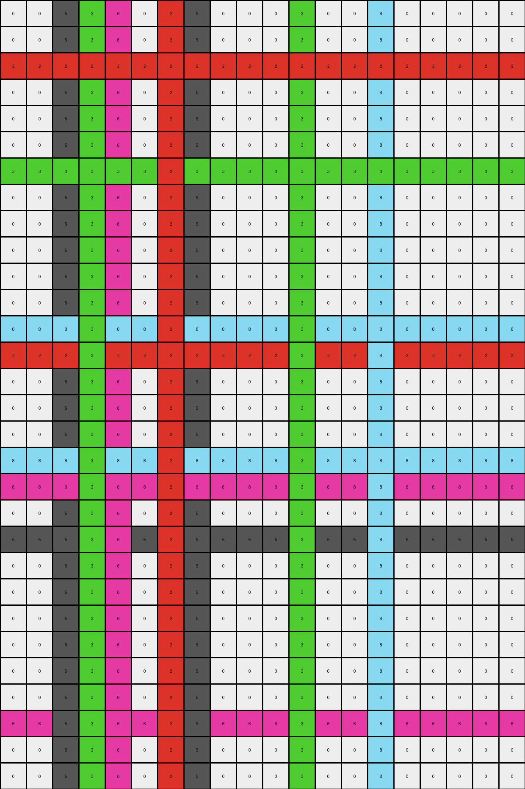

# 40853293 • 009 • refine_dreamer

---


Previous Code:
```python
"""
1. **Identify Isolated Pixels:** Scan the input grid and identify all "isolated pixels." An isolated pixel is defined as a pixel whose color is different from all four of its immediate neighbors (up, down, left, and right).
2.  **For Each Isolated Pixel**:
    -   Record the pixel's original `color` and `position`.
    -   **Horizontal Extension:** 
       -    Fill empty positions to the left and to the right of the original position with same color.
    -   **Vertical Extension:**
        -  Fill empty positions on top and to the bottom of the original position with the same color.
3.  **Output:** The resulting grid, with extended lines from each of the isolated pixels, is the final output.
"""

import numpy as np

def is_isolated(grid, row, col):
    """Checks if a pixel at (row, col) is isolated."""
    color = grid[row, col]
    if color == 0:  # white pixels are not considered
        return False

    height, width = grid.shape
    neighbors = []

    if row > 0:
        neighbors.append(grid[row - 1, col])  # Up
    if row < height - 1:
        neighbors.append(grid[row + 1, col])  # Down
    if col > 0:
        neighbors.append(grid[row, col - 1])  # Left
    if col < width - 1:
        neighbors.append(grid[row, col + 1])  # Right

    for neighbor_color in neighbors:
        if neighbor_color == color:
            return False  # Not isolated if any neighbor has the same color

    return True

def transform(input_grid):
    """Transforms the input grid according to the rules."""
    input_grid = np.array(input_grid)  # Ensure it is numpy array
    output_grid = np.copy(input_grid)
    height, width = input_grid.shape

    isolated_pixels = []
    for row in range(height):
        for col in range(width):
            if is_isolated(input_grid, row, col):
                isolated_pixels.append((row, col, input_grid[row, col]))

    for row, col, color in isolated_pixels:
        # Horizontal Extension
        for c in range(width):
            if output_grid[row,c] == 0: #fill if white
                output_grid[row, c] = color

        # Vertical Extension
        for r in range(height):
            if output_grid[r,col] == 0: #fill if white
                output_grid[r, col] = color

    return output_grid.tolist()
```

Train Set Results:

## Example 1:

Input:
```
0 0 0 0 0 0 0 0 0 0 0 0 0 0 0 0 0 0 0 0
0 0 0 0 0 0 0 0 0 0 0 0 0 0 0 0 0 0 0 0
0 0 0 0 0 0 2 0 0 0 0 0 0 0 0 0 0 0 0 0
0 0 0 0 0 0 0 0 0 0 0 0 0 0 0 0 0 0 0 0
0 0 0 0 0 0 0 0 0 0 0 0 0 0 0 0 0 0 0 0
0 0 0 0 0 0 0 0 0 0 0 0 0 0 0 0 0 0 0 0
0 0 0 3 0 0 0 0 0 0 0 3 0 0 0 0 0 0 0 0
0 0 0 0 0 0 0 0 0 0 0 0 0 0 0 0 0 0 0 0
0 0 0 0 0 0 0 0 0 0 0 0 0 0 0 0 0 0 0 0
0 0 0 0 0 0 0 0 0 0 0 0 0 0 0 0 0 0 0 0
0 0 0 0 0 0 0 0 0 0 0 0 0 0 0 0 0 0 0 0
0 0 0 0 0 0 0 0 0 0 0 0 0 0 0 0 0 0 0 0
0 0 0 0 0 0 0 0 0 0 0 0 0 0 8 0 0 0 0 0
0 0 0 0 0 0 2 0 0 0 0 0 0 0 0 0 0 0 0 0
0 0 0 0 0 0 0 0 0 0 0 0 0 0 0 0 0 0 0 0
0 0 0 0 0 0 0 0 0 0 0 0 0 0 0 0 0 0 0 0
0 0 0 0 0 0 0 0 0 0 0 0 0 0 0 0 0 0 0 0
0 0 0 0 0 0 0 0 0 0 0 0 0 0 8 0 0 0 0 0
0 0 0 0 6 0 0 0 0 0 0 0 0 0 0 0 0 0 0 0
0 0 0 0 0 0 0 0 0 0 0 0 0 0 0 0 0 0 0 0
0 0 5 0 0 0 0 5 0 0 0 0 0 0 0 0 0 0 0 0
0 0 0 0 0 0 0 0 0 0 0 0 0 0 0 0 0 0 0 0
0 0 0 0 0 0 0 0 0 0 0 0 0 0 0 0 0 0 0 0
0 0 0 0 0 0 0 0 0 0 0 0 0 0 0 0 0 0 0 0
0 0 0 0 0 0 0 0 0 0 0 0 0 0 0 0 0 0 0 0
0 0 0 0 0 0 0 0 0 0 0 0 0 0 0 0 0 0 0 0
0 0 0 0 0 0 0 0 0 0 0 0 0 0 0 0 0 0 0 0
0 0 0 0 6 0 0 0 0 0 0 0 0 0 0 0 0 0 0 0
0 0 0 0 0 0 0 0 0 0 0 0 0 0 0 0 0 0 0 0
0 0 0 0 0 0 0 0 0 0 0 0 0 0 0 0 0 0 0 0
```
Expected Output:
```
0 0 0 0 0 0 0 0 0 0 0 0 0 0 0 0 0 0 0 0
0 0 0 0 0 0 0 0 0 0 0 0 0 0 0 0 0 0 0 0
0 0 0 0 0 0 2 0 0 0 0 0 0 0 0 0 0 0 0 0
0 0 0 0 0 0 2 0 0 0 0 0 0 0 0 0 0 0 0 0
0 0 0 0 0 0 2 0 0 0 0 0 0 0 0 0 0 0 0 0
0 0 0 0 0 0 2 0 0 0 0 0 0 0 0 0 0 0 0 0
0 0 0 3 3 3 2 3 3 3 3 3 0 0 0 0 0 0 0 0
0 0 0 0 0 0 2 0 0 0 0 0 0 0 0 0 0 0 0 0
0 0 0 0 0 0 2 0 0 0 0 0 0 0 0 0 0 0 0 0
0 0 0 0 0 0 2 0 0 0 0 0 0 0 0 0 0 0 0 0
0 0 0 0 0 0 2 0 0 0 0 0 0 0 0 0 0 0 0 0
0 0 0 0 0 0 2 0 0 0 0 0 0 0 0 0 0 0 0 0
0 0 0 0 0 0 2 0 0 0 0 0 0 0 8 0 0 0 0 0
0 0 0 0 0 0 2 0 0 0 0 0 0 0 8 0 0 0 0 0
0 0 0 0 0 0 0 0 0 0 0 0 0 0 8 0 0 0 0 0
0 0 0 0 0 0 0 0 0 0 0 0 0 0 8 0 0 0 0 0
0 0 0 0 0 0 0 0 0 0 0 0 0 0 8 0 0 0 0 0
0 0 0 0 0 0 0 0 0 0 0 0 0 0 8 0 0 0 0 0
0 0 0 0 6 0 0 0 0 0 0 0 0 0 0 0 0 0 0 0
0 0 0 0 6 0 0 0 0 0 0 0 0 0 0 0 0 0 0 0
0 0 5 5 6 5 5 5 0 0 0 0 0 0 0 0 0 0 0 0
0 0 0 0 6 0 0 0 0 0 0 0 0 0 0 0 0 0 0 0
0 0 0 0 6 0 0 0 0 0 0 0 0 0 0 0 0 0 0 0
0 0 0 0 6 0 0 0 0 0 0 0 0 0 0 0 0 0 0 0
0 0 0 0 6 0 0 0 0 0 0 0 0 0 0 0 0 0 0 0
0 0 0 0 6 0 0 0 0 0 0 0 0 0 0 0 0 0 0 0
0 0 0 0 6 0 0 0 0 0 0 0 0 0 0 0 0 0 0 0
0 0 0 0 6 0 0 0 0 0 0 0 0 0 0 0 0 0 0 0
0 0 0 0 0 0 0 0 0 0 0 0 0 0 0 0 0 0 0 0
0 0 0 0 0 0 0 0 0 0 0 0 0 0 0 0 0 0 0 0
```
Transformed Output:
```
0 0 5 3 6 0 2 5 0 0 0 3 0 0 8 0 0 0 0 0
0 0 5 3 6 0 2 5 0 0 0 3 0 0 8 0 0 0 0 0
2 2 2 2 2 2 2 2 2 2 2 2 2 2 2 2 2 2 2 2
0 0 5 3 6 0 2 5 0 0 0 3 0 0 8 0 0 0 0 0
0 0 5 3 6 0 2 5 0 0 0 3 0 0 8 0 0 0 0 0
0 0 5 3 6 0 2 5 0 0 0 3 0 0 8 0 0 0 0 0
3 3 3 3 3 3 2 3 3 3 3 3 3 3 3 3 3 3 3 3
0 0 5 3 6 0 2 5 0 0 0 3 0 0 8 0 0 0 0 0
0 0 5 3 6 0 2 5 0 0 0 3 0 0 8 0 0 0 0 0
0 0 5 3 6 0 2 5 0 0 0 3 0 0 8 0 0 0 0 0
0 0 5 3 6 0 2 5 0 0 0 3 0 0 8 0 0 0 0 0
0 0 5 3 6 0 2 5 0 0 0 3 0 0 8 0 0 0 0 0
8 8 8 3 8 8 2 8 8 8 8 3 8 8 8 8 8 8 8 8
2 2 2 3 2 2 2 2 2 2 2 3 2 2 8 2 2 2 2 2
0 0 5 3 6 0 2 5 0 0 0 3 0 0 8 0 0 0 0 0
0 0 5 3 6 0 2 5 0 0 0 3 0 0 8 0 0 0 0 0
0 0 5 3 6 0 2 5 0 0 0 3 0 0 8 0 0 0 0 0
8 8 8 3 8 8 2 8 8 8 8 3 8 8 8 8 8 8 8 8
6 6 6 3 6 6 2 6 6 6 6 3 6 6 8 6 6 6 6 6
0 0 5 3 6 0 2 5 0 0 0 3 0 0 8 0 0 0 0 0
5 5 5 3 6 5 2 5 5 5 5 3 5 5 8 5 5 5 5 5
0 0 5 3 6 0 2 5 0 0 0 3 0 0 8 0 0 0 0 0
0 0 5 3 6 0 2 5 0 0 0 3 0 0 8 0 0 0 0 0
0 0 5 3 6 0 2 5 0 0 0 3 0 0 8 0 0 0 0 0
0 0 5 3 6 0 2 5 0 0 0 3 0 0 8 0 0 0 0 0
0 0 5 3 6 0 2 5 0 0 0 3 0 0 8 0 0 0 0 0
0 0 5 3 6 0 2 5 0 0 0 3 0 0 8 0 0 0 0 0
6 6 5 3 6 6 2 5 6 6 6 3 6 6 8 6 6 6 6 6
0 0 5 3 6 0 2 5 0 0 0 3 0 0 8 0 0 0 0 0
0 0 5 3 6 0 2 5 0 0 0 3 0 0 8 0 0 0 0 0
```

match: False
pixels_off: 275
size_correct: True
color_palette_correct: True
correct_pixel_counts: False

## Example 2:

Input:
```
0 0 0 0 0 0 0 0 0 0
0 0 0 0 0 0 0 0 0 0
0 0 0 4 0 0 0 0 0 0
0 0 0 0 0 0 0 0 0 0
0 0 3 0 0 0 0 3 0 0
0 0 0 0 0 0 0 0 0 0
0 0 0 0 0 0 0 0 0 0
0 0 0 0 0 0 0 0 0 0
0 0 7 0 0 7 0 0 0 0
0 0 0 0 0 0 0 0 0 0
0 0 0 4 0 0 0 0 0 0
0 0 0 0 0 0 0 0 0 0
0 0 0 0 0 9 0 0 0 0
0 0 0 0 0 0 0 0 0 0
0 8 0 0 0 0 8 0 0 0
0 0 0 0 0 0 0 0 0 0
0 0 0 0 0 0 0 0 0 0
0 0 0 0 0 0 0 0 0 0
0 0 0 0 0 9 0 0 0 0
0 0 0 0 0 0 0 0 0 0
```
Expected Output:
```
0 0 0 0 0 0 0 0 0 0
0 0 0 0 0 0 0 0 0 0
0 0 0 4 0 0 0 0 0 0
0 0 0 4 0 0 0 0 0 0
0 0 3 4 3 3 3 3 0 0
0 0 0 4 0 0 0 0 0 0
0 0 0 4 0 0 0 0 0 0
0 0 0 4 0 0 0 0 0 0
0 0 7 4 7 7 0 0 0 0
0 0 0 4 0 0 0 0 0 0
0 0 0 4 0 0 0 0 0 0
0 0 0 0 0 0 0 0 0 0
0 0 0 0 0 9 0 0 0 0
0 0 0 0 0 9 0 0 0 0
0 8 8 8 8 9 8 0 0 0
0 0 0 0 0 9 0 0 0 0
0 0 0 0 0 9 0 0 0 0
0 0 0 0 0 9 0 0 0 0
0 0 0 0 0 9 0 0 0 0
0 0 0 0 0 0 0 0 0 0
```
Transformed Output:
```
0 8 3 4 0 7 8 3 0 0
0 8 3 4 0 7 8 3 0 0
4 4 4 4 4 4 4 4 4 4
0 8 3 4 0 7 8 3 0 0
3 3 3 4 3 3 3 3 3 3
0 8 3 4 0 7 8 3 0 0
0 8 3 4 0 7 8 3 0 0
0 8 3 4 0 7 8 3 0 0
7 7 7 4 7 7 7 3 7 7
0 8 3 4 0 7 8 3 0 0
4 4 3 4 4 7 4 3 4 4
0 8 3 4 0 7 8 3 0 0
9 9 3 4 9 9 9 3 9 9
0 8 3 4 0 7 8 3 0 0
8 8 3 4 8 7 8 3 8 8
0 8 3 4 0 7 8 3 0 0
0 8 3 4 0 7 8 3 0 0
0 8 3 4 0 7 8 3 0 0
9 8 3 4 9 9 8 3 9 9
0 8 3 4 0 7 8 3 0 0
```

match: False
pixels_off: 126
size_correct: True
color_palette_correct: True
correct_pixel_counts: False

**INSTRUCTIONS**

The code above was generated based on observations from the first training
example

we have tested the transform function on each of the task example inputs and
compared with the expected output

review each of the examples provided and the results and consider how the
natural language program should be updated to accommodate this new knowledge

respond with the following deliverables:

- general assessment of the information provided and strategy for resolving the
  errors
- gather metrics about each of the examples and results - use code_execution to
  develop accurate reports on your assumptions
- a YAML block documenting facts - Focus on identifying objects, their properties, and the actions performed on them.
- a natural language program - Be as clear and concise as possible, providing a complete description of the transformation rule.


your responses should be considered as information in a report - not a
conversation
