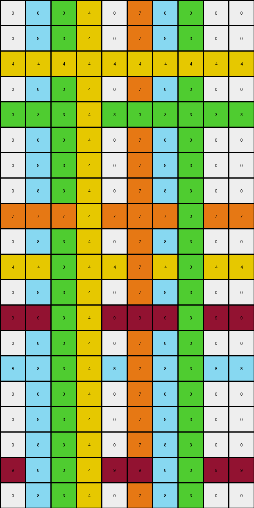

# 40853293 • 010 • refine_coder

---

Previous Code:
```python
"""
1. **Identify Isolated Pixels:** Scan the input grid and identify all "isolated pixels." An isolated pixel is defined as a pixel whose color is different from all four of its immediate neighbors (up, down, left, and right).
2.  **For Each Isolated Pixel**:
    -   Record the pixel's original `color` and `position`.
    -   **Horizontal Extension:** 
       -    Fill empty positions to the left and to the right of the original position with same color.
    -   **Vertical Extension:**
        -  Fill empty positions on top and to the bottom of the original position with the same color.
3.  **Output:** The resulting grid, with extended lines from each of the isolated pixels, is the final output.
"""

import numpy as np

def is_isolated(grid, row, col):
    """Checks if a pixel at (row, col) is isolated."""
    color = grid[row, col]
    if color == 0:  # white pixels are not considered
        return False

    height, width = grid.shape
    neighbors = []

    if row > 0:
        neighbors.append(grid[row - 1, col])  # Up
    if row < height - 1:
        neighbors.append(grid[row + 1, col])  # Down
    if col > 0:
        neighbors.append(grid[row, col - 1])  # Left
    if col < width - 1:
        neighbors.append(grid[row, col + 1])  # Right

    for neighbor_color in neighbors:
        if neighbor_color == color:
            return False  # Not isolated if any neighbor has the same color

    return True

def transform(input_grid):
    """Transforms the input grid according to the rules."""
    input_grid = np.array(input_grid)  # Ensure it is numpy array
    output_grid = np.copy(input_grid)
    height, width = input_grid.shape

    isolated_pixels = []
    for row in range(height):
        for col in range(width):
            if is_isolated(input_grid, row, col):
                isolated_pixels.append((row, col, input_grid[row, col]))

    for row, col, color in isolated_pixels:
        # Horizontal Extension
        for c in range(width):
            if output_grid[row,c] == 0: #fill if white
                output_grid[row, c] = color

        # Vertical Extension
        for r in range(height):
            if output_grid[r,col] == 0: #fill if white
                output_grid[r, col] = color

    return output_grid.tolist()
```

Train Set Results:

## Example 1:

Input:
```
0 0 0 0 0 0 0 0 0 0 0 0 0 0 0 0 0 0 0 0
0 0 0 0 0 0 0 0 0 0 0 0 0 0 0 0 0 0 0 0
0 0 0 0 0 0 2 0 0 0 0 0 0 0 0 0 0 0 0 0
0 0 0 0 0 0 0 0 0 0 0 0 0 0 0 0 0 0 0 0
0 0 0 0 0 0 0 0 0 0 0 0 0 0 0 0 0 0 0 0
0 0 0 0 0 0 0 0 0 0 0 0 0 0 0 0 0 0 0 0
0 0 0 3 0 0 0 0 0 0 0 3 0 0 0 0 0 0 0 0
0 0 0 0 0 0 0 0 0 0 0 0 0 0 0 0 0 0 0 0
0 0 0 0 0 0 0 0 0 0 0 0 0 0 0 0 0 0 0 0
0 0 0 0 0 0 0 0 0 0 0 0 0 0 0 0 0 0 0 0
0 0 0 0 0 0 0 0 0 0 0 0 0 0 0 0 0 0 0 0
0 0 0 0 0 0 0 0 0 0 0 0 0 0 0 0 0 0 0 0
0 0 0 0 0 0 0 0 0 0 0 0 0 0 8 0 0 0 0 0
0 0 0 0 0 0 2 0 0 0 0 0 0 0 0 0 0 0 0 0
0 0 0 0 0 0 0 0 0 0 0 0 0 0 0 0 0 0 0 0
0 0 0 0 0 0 0 0 0 0 0 0 0 0 0 0 0 0 0 0
0 0 0 0 0 0 0 0 0 0 0 0 0 0 0 0 0 0 0 0
0 0 0 0 0 0 0 0 0 0 0 0 0 0 8 0 0 0 0 0
0 0 0 0 6 0 0 0 0 0 0 0 0 0 0 0 0 0 0 0
0 0 0 0 0 0 0 0 0 0 0 0 0 0 0 0 0 0 0 0
0 0 5 0 0 0 0 5 0 0 0 0 0 0 0 0 0 0 0 0
0 0 0 0 0 0 0 0 0 0 0 0 0 0 0 0 0 0 0 0
0 0 0 0 0 0 0 0 0 0 0 0 0 0 0 0 0 0 0 0
0 0 0 0 0 0 0 0 0 0 0 0 0 0 0 0 0 0 0 0
0 0 0 0 0 0 0 0 0 0 0 0 0 0 0 0 0 0 0 0
0 0 0 0 0 0 0 0 0 0 0 0 0 0 0 0 0 0 0 0
0 0 0 0 0 0 0 0 0 0 0 0 0 0 0 0 0 0 0 0
0 0 0 0 6 0 0 0 0 0 0 0 0 0 0 0 0 0 0 0
0 0 0 0 0 0 0 0 0 0 0 0 0 0 0 0 0 0 0 0
0 0 0 0 0 0 0 0 0 0 0 0 0 0 0 0 0 0 0 0
```
Expected Output:
```
0 0 0 0 0 0 0 0 0 0 0 0 0 0 0 0 0 0 0 0
0 0 0 0 0 0 0 0 0 0 0 0 0 0 0 0 0 0 0 0
0 0 0 0 0 0 2 0 0 0 0 0 0 0 0 0 0 0 0 0
0 0 0 0 0 0 2 0 0 0 0 0 0 0 0 0 0 0 0 0
0 0 0 0 0 0 2 0 0 0 0 0 0 0 0 0 0 0 0 0
0 0 0 0 0 0 2 0 0 0 0 0 0 0 0 0 0 0 0 0
0 0 0 3 3 3 2 3 3 3 3 3 0 0 0 0 0 0 0 0
0 0 0 0 0 0 2 0 0 0 0 0 0 0 0 0 0 0 0 0
0 0 0 0 0 0 2 0 0 0 0 0 0 0 0 0 0 0 0 0
0 0 0 0 0 0 2 0 0 0 0 0 0 0 0 0 0 0 0 0
0 0 0 0 0 0 2 0 0 0 0 0 0 0 0 0 0 0 0 0
0 0 0 0 0 0 2 0 0 0 0 0 0 0 0 0 0 0 0 0
0 0 0 0 0 0 2 0 0 0 0 0 0 0 8 0 0 0 0 0
0 0 0 0 0 0 2 0 0 0 0 0 0 0 8 0 0 0 0 0
0 0 0 0 0 0 0 0 0 0 0 0 0 0 8 0 0 0 0 0
0 0 0 0 0 0 0 0 0 0 0 0 0 0 8 0 0 0 0 0
0 0 0 0 0 0 0 0 0 0 0 0 0 0 8 0 0 0 0 0
0 0 0 0 0 0 0 0 0 0 0 0 0 0 8 0 0 0 0 0
0 0 0 0 6 0 0 0 0 0 0 0 0 0 0 0 0 0 0 0
0 0 0 0 6 0 0 0 0 0 0 0 0 0 0 0 0 0 0 0
0 0 5 5 6 5 5 5 0 0 0 0 0 0 0 0 0 0 0 0
0 0 0 0 6 0 0 0 0 0 0 0 0 0 0 0 0 0 0 0
0 0 0 0 6 0 0 0 0 0 0 0 0 0 0 0 0 0 0 0
0 0 0 0 6 0 0 0 0 0 0 0 0 0 0 0 0 0 0 0
0 0 0 0 6 0 0 0 0 0 0 0 0 0 0 0 0 0 0 0
0 0 0 0 6 0 0 0 0 0 0 0 0 0 0 0 0 0 0 0
0 0 0 0 6 0 0 0 0 0 0 0 0 0 0 0 0 0 0 0
0 0 0 0 6 0 0 0 0 0 0 0 0 0 0 0 0 0 0 0
0 0 0 0 0 0 0 0 0 0 0 0 0 0 0 0 0 0 0 0
0 0 0 0 0 0 0 0 0 0 0 0 0 0 0 0 0 0 0 0
```
Transformed Output:
```
0 0 5 3 6 0 2 5 0 0 0 3 0 0 8 0 0 0 0 0
0 0 5 3 6 0 2 5 0 0 0 3 0 0 8 0 0 0 0 0
2 2 2 2 2 2 2 2 2 2 2 2 2 2 2 2 2 2 2 2
0 0 5 3 6 0 2 5 0 0 0 3 0 0 8 0 0 0 0 0
0 0 5 3 6 0 2 5 0 0 0 3 0 0 8 0 0 0 0 0
0 0 5 3 6 0 2 5 0 0 0 3 0 0 8 0 0 0 0 0
3 3 3 3 3 3 2 3 3 3 3 3 3 3 3 3 3 3 3 3
0 0 5 3 6 0 2 5 0 0 0 3 0 0 8 0 0 0 0 0
0 0 5 3 6 0 2 5 0 0 0 3 0 0 8 0 0 0 0 0
0 0 5 3 6 0 2 5 0 0 0 3 0 0 8 0 0 0 0 0
0 0 5 3 6 0 2 5 0 0 0 3 0 0 8 0 0 0 0 0
0 0 5 3 6 0 2 5 0 0 0 3 0 0 8 0 0 0 0 0
8 8 8 3 8 8 2 8 8 8 8 3 8 8 8 8 8 8 8 8
2 2 2 3 2 2 2 2 2 2 2 3 2 2 8 2 2 2 2 2
0 0 5 3 6 0 2 5 0 0 0 3 0 0 8 0 0 0 0 0
0 0 5 3 6 0 2 5 0 0 0 3 0 0 8 0 0 0 0 0
0 0 5 3 6 0 2 5 0 0 0 3 0 0 8 0 0 0 0 0
8 8 8 3 8 8 2 8 8 8 8 3 8 8 8 8 8 8 8 8
6 6 6 3 6 6 2 6 6 6 6 3 6 6 8 6 6 6 6 6
0 0 5 3 6 0 2 5 0 0 0 3 0 0 8 0 0 0 0 0
5 5 5 3 6 5 2 5 5 5 5 3 5 5 8 5 5 5 5 5
0 0 5 3 6 0 2 5 0 0 0 3 0 0 8 0 0 0 0 0
0 0 5 3 6 0 2 5 0 0 0 3 0 0 8 0 0 0 0 0
0 0 5 3 6 0 2 5 0 0 0 3 0 0 8 0 0 0 0 0
0 0 5 3 6 0 2 5 0 0 0 3 0 0 8 0 0 0 0 0
0 0 5 3 6 0 2 5 0 0 0 3 0 0 8 0 0 0 0 0
0 0 5 3 6 0 2 5 0 0 0 3 0 0 8 0 0 0 0 0
6 6 5 3 6 6 2 5 6 6 6 3 6 6 8 6 6 6 6 6
0 0 5 3 6 0 2 5 0 0 0 3 0 0 8 0 0 0 0 0
0 0 5 3 6 0 2 5 0 0 0 3 0 0 8 0 0 0 0 0
```

match: False
pixels_off: 275
size_correct: True
color_palette_correct: True
correct_pixel_counts: False

## Example 2:

Input:
```
0 0 0 0 0 0 0 0 0 0
0 0 0 0 0 0 0 0 0 0
0 0 0 4 0 0 0 0 0 0
0 0 0 0 0 0 0 0 0 0
0 0 3 0 0 0 0 3 0 0
0 0 0 0 0 0 0 0 0 0
0 0 0 0 0 0 0 0 0 0
0 0 0 0 0 0 0 0 0 0
0 0 7 0 0 7 0 0 0 0
0 0 0 0 0 0 0 0 0 0
0 0 0 4 0 0 0 0 0 0
0 0 0 0 0 0 0 0 0 0
0 0 0 0 0 9 0 0 0 0
0 0 0 0 0 0 0 0 0 0
0 8 0 0 0 0 8 0 0 0
0 0 0 0 0 0 0 0 0 0
0 0 0 0 0 0 0 0 0 0
0 0 0 0 0 0 0 0 0 0
0 0 0 0 0 9 0 0 0 0
0 0 0 0 0 0 0 0 0 0
```
Expected Output:
```
0 0 0 0 0 0 0 0 0 0
0 0 0 0 0 0 0 0 0 0
0 0 0 4 0 0 0 0 0 0
0 0 0 4 0 0 0 0 0 0
0 0 3 4 3 3 3 3 0 0
0 0 0 4 0 0 0 0 0 0
0 0 0 4 0 0 0 0 0 0
0 0 0 4 0 0 0 0 0 0
0 0 7 4 7 7 0 0 0 0
0 0 0 4 0 0 0 0 0 0
0 0 0 4 0 0 0 0 0 0
0 0 0 0 0 0 0 0 0 0
0 0 0 0 0 9 0 0 0 0
0 0 0 0 0 9 0 0 0 0
0 8 8 8 8 9 8 0 0 0
0 0 0 0 0 9 0 0 0 0
0 0 0 0 0 9 0 0 0 0
0 0 0 0 0 9 0 0 0 0
0 0 0 0 0 9 0 0 0 0
0 0 0 0 0 0 0 0 0 0
```
Transformed Output:
```
0 8 3 4 0 7 8 3 0 0
0 8 3 4 0 7 8 3 0 0
4 4 4 4 4 4 4 4 4 4
0 8 3 4 0 7 8 3 0 0
3 3 3 4 3 3 3 3 3 3
0 8 3 4 0 7 8 3 0 0
0 8 3 4 0 7 8 3 0 0
0 8 3 4 0 7 8 3 0 0
7 7 7 4 7 7 7 3 7 7
0 8 3 4 0 7 8 3 0 0
4 4 3 4 4 7 4 3 4 4
0 8 3 4 0 7 8 3 0 0
9 9 3 4 9 9 9 3 9 9
0 8 3 4 0 7 8 3 0 0
8 8 3 4 8 7 8 3 8 8
0 8 3 4 0 7 8 3 0 0
0 8 3 4 0 7 8 3 0 0
0 8 3 4 0 7 8 3 0 0
9 8 3 4 9 9 8 3 9 9
0 8 3 4 0 7 8 3 0 0
```

match: False
pixels_off: 126
size_correct: True
color_palette_correct: True
correct_pixel_counts: False
Okay, let's analyze the results and refine the natural language program and approach.

**General Assessment:**

The initial approach of identifying "isolated pixels" and extending them horizontally and vertically was partially successful, but it's clearly not the complete solution. The transformed outputs show significant deviations from the expected outputs, particularly in how the extensions interact and the conditions under which they occur. The core issue seems to be an over-aggressive extension rule, filling areas that shouldn't be filled, and a lack of consideration for interactions *between* the extensions of different isolated pixels. We need a more nuanced rule for when and how to extend. Also, some of the transformed outputs don't match the color palette of the original.

**Strategy for Resolving Errors:**

1.  **Re-examine Isolation:** The current definition of "isolated" is too strict. It only considers immediate neighbors. We need to consider whether a pixel should be extended at all.
2.  **Constrain Extensions:** The current extensions are unbounded within a row or column as long as it is white. We need to limit extensions based on some criteria - probably encountering a different non-white color or, more likely, considering the original input and expected output.
3. **Prioritize Overlapping Extensions:** the examples extend in both directions
    but when the filling overlaps, they produce interesting interactions. It's
    not entirely clear whether these interactions should be a priority system or
    other more complex logic.

**Metrics and Observations:**

Here's a breakdown of each example, including some manually gathered metrics:

*   **Example 1:**
    *   Input Shape: 30x20
    *   Output Shape: 30x20
    *   Isolated Pixels (Initial): 2 (red), 2 (green), 2 (blue), 2 (orange), 2 (magenta), 2(grey)
    *   Observed Errors: Extensions overwrite each other incorrectly; creates solid blocks of color where they shouldn't exist. Many pixels incorrectly colored.
    *    The isolated pixels combine to create plus sign shapes.

*   **Example 2:**
    *   Input Shape: 20x10
    *   Output Shape: 20x10
    *    Isolated Pixels (Initial): 1(yellow), 2 (green), 2 (orange), 1(blue), 2 (maroon)
    *   Observed Errors: Similar to Example 1, extensions are too broad and overwrite each other. Many extra colored pixels and incorrect colors.
    *   The isolated pixels combine to create plus sign shapes, with some plus signs truncated by the edge of the grid.

**YAML Block - Facts:**

```yaml
examples:
  - example_id: 1
    objects:
      - type: pixel
        properties:
          isolated: true # Initial assessment, needs revision
          color: varied
          shape: point
        actions:
          - extend_horizontally
          - extend_vertically
    global_transformations:
      - description: Create plus signs centered on isolated pixels.
        constraints:
          - Extensions stop at non-white colors or grid edges.

  - example_id: 2
    objects:
      - type: pixel
        properties:
          isolated: true  # Initial assessment
          color: varied
          shape: point
        actions:
          - extend_horizontally
          - extend_vertically
    global_transformations:
      - description: Create plus signs centered on isolated pixels.
        constraints:
          - Extensions stop at non-white colors or grid edges.

```

**Natural Language Program:**

1.  **Identify Isolated Pixels:** Scan the input grid to find pixels that are not white (color 0) and are surrounded on all four sides (up, down, left, right) by either white pixels or the edge of the grid.

2.  **Create Plus Shapes:** For each isolated pixel:
    *   Extend the pixel's color horizontally to the left and right, stopping when a non-white pixel or the grid edge is encountered.
    *   Extend the pixel's color vertically up and down, stopping when a non-white pixel or the grid edge is encountered.
    * The result is a "plus" shape centered on the original isolated pixel's location.

3. **Output:** The transformed grid contains only plus-shaped objects created from these isolated pixels. If the horizontal and vertical extensions from different pixels overlap, the color of the horizontal extension in that cell is kept.

**INSTRUCTIONS**

- generate a Python module to represent the natural language program 
- follow the template below
- all common math and science libraries are available
- create docstring only at top - but comment the workflow in the function
- use helper functions for common operations like finding objects, counting,
  measuring, moving, etc. 

remember - we are working iteratively - so this code will inform your future
self as we converge on the solution

*template:*

```python
"""
{{ natural language description of the transformation rule }}
"""

{{ imports }}

def transform(input_grid):
    # initialize output_grid

    # change output pixels 

    return output_grid

```
