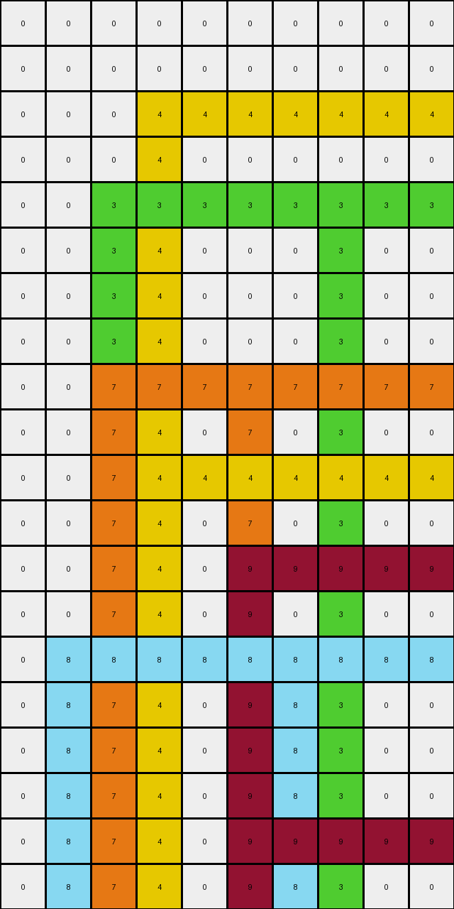

# 40853293 • 011 • refine_dreamer

---


Previous Code:
```python
"""
1.  **Identify Isolated Pixels:** Scan the input grid to find pixels that are not white (color 0) and are surrounded on all four sides (up, down, left, right) by either white pixels or the edge of the grid.

2.  **Create Plus Shapes:** For each isolated pixel:
    *   Extend the pixel's color horizontally to the left and right, stopping when a non-white pixel or the grid edge is encountered.
    *   Extend the pixel's color vertically up and down, stopping when a non-white pixel or the grid edge is encountered.
    * The result is a "plus" shape centered on the original isolated pixel's location.

3. **Output:** The transformed grid contains only plus-shaped objects created from these isolated pixels. If the horizontal and vertical extensions from different pixels overlap, the color of the horizontal extension in that cell is kept.
"""

import numpy as np

def is_isolated(grid, row, col):
    """Checks if a pixel at (row, col) is isolated."""
    color = grid[row, col]
    if color == 0:  # white pixels are not considered
        return False

    height, width = grid.shape
    neighbors = []

    if row > 0:
        neighbors.append(grid[row - 1, col])  # Up
    else:
        neighbors.append(0)
    if row < height - 1:
        neighbors.append(grid[row + 1, col])  # Down
    else:
        neighbors.append(0)
    if col > 0:
        neighbors.append(grid[row, col - 1])  # Left
    else:
        neighbors.append(0)
    if col < width - 1:
        neighbors.append(grid[row, col + 1])  # Right
    else:
        neighbors.append(0)

    for neighbor_color in neighbors:
        if neighbor_color != 0:
            return False  # Not isolated if any neighbor is not white

    return True

def transform(input_grid):
    """Transforms the input grid according to the rules."""
    input_grid = np.array(input_grid)  # Ensure it is numpy array
    output_grid = np.zeros_like(input_grid) # initialize with all zeros
    height, width = input_grid.shape

    isolated_pixels = []
    for row in range(height):
        for col in range(width):
            if is_isolated(input_grid, row, col):
                isolated_pixels.append((row, col, input_grid[row, col]))

    for row, col, color in isolated_pixels:
        # Horizontal Extension
        # Left
        for c in range(col, -1, -1):
            if input_grid[row,c] == 0:
                output_grid[row,c] = color
            else:
                output_grid[row,c] = color #include original
                break #stop extension
        # Right
        for c in range(col+1, width):
             if input_grid[row,c] == 0:
                output_grid[row,c] = color
             else:
                break #stop extension

        # Vertical Extension
        #Up
        for r in range(row, -1, -1):
            if input_grid[r,col] == 0:
                output_grid[r,col] = color
            else:
                output_grid[r,col] = color #include original
                break
        #Down
        for r in range(row + 1, height):
            if input_grid[r,col] == 0:
                output_grid[r,col] = color
            else:
                break


    return output_grid.tolist()
```

Train Set Results:

## Example 1:

Input:
```
0 0 0 0 0 0 0 0 0 0 0 0 0 0 0 0 0 0 0 0
0 0 0 0 0 0 0 0 0 0 0 0 0 0 0 0 0 0 0 0
0 0 0 0 0 0 2 0 0 0 0 0 0 0 0 0 0 0 0 0
0 0 0 0 0 0 0 0 0 0 0 0 0 0 0 0 0 0 0 0
0 0 0 0 0 0 0 0 0 0 0 0 0 0 0 0 0 0 0 0
0 0 0 0 0 0 0 0 0 0 0 0 0 0 0 0 0 0 0 0
0 0 0 3 0 0 0 0 0 0 0 3 0 0 0 0 0 0 0 0
0 0 0 0 0 0 0 0 0 0 0 0 0 0 0 0 0 0 0 0
0 0 0 0 0 0 0 0 0 0 0 0 0 0 0 0 0 0 0 0
0 0 0 0 0 0 0 0 0 0 0 0 0 0 0 0 0 0 0 0
0 0 0 0 0 0 0 0 0 0 0 0 0 0 0 0 0 0 0 0
0 0 0 0 0 0 0 0 0 0 0 0 0 0 0 0 0 0 0 0
0 0 0 0 0 0 0 0 0 0 0 0 0 0 8 0 0 0 0 0
0 0 0 0 0 0 2 0 0 0 0 0 0 0 0 0 0 0 0 0
0 0 0 0 0 0 0 0 0 0 0 0 0 0 0 0 0 0 0 0
0 0 0 0 0 0 0 0 0 0 0 0 0 0 0 0 0 0 0 0
0 0 0 0 0 0 0 0 0 0 0 0 0 0 0 0 0 0 0 0
0 0 0 0 0 0 0 0 0 0 0 0 0 0 8 0 0 0 0 0
0 0 0 0 6 0 0 0 0 0 0 0 0 0 0 0 0 0 0 0
0 0 0 0 0 0 0 0 0 0 0 0 0 0 0 0 0 0 0 0
0 0 5 0 0 0 0 5 0 0 0 0 0 0 0 0 0 0 0 0
0 0 0 0 0 0 0 0 0 0 0 0 0 0 0 0 0 0 0 0
0 0 0 0 0 0 0 0 0 0 0 0 0 0 0 0 0 0 0 0
0 0 0 0 0 0 0 0 0 0 0 0 0 0 0 0 0 0 0 0
0 0 0 0 0 0 0 0 0 0 0 0 0 0 0 0 0 0 0 0
0 0 0 0 0 0 0 0 0 0 0 0 0 0 0 0 0 0 0 0
0 0 0 0 0 0 0 0 0 0 0 0 0 0 0 0 0 0 0 0
0 0 0 0 6 0 0 0 0 0 0 0 0 0 0 0 0 0 0 0
0 0 0 0 0 0 0 0 0 0 0 0 0 0 0 0 0 0 0 0
0 0 0 0 0 0 0 0 0 0 0 0 0 0 0 0 0 0 0 0
```
Expected Output:
```
0 0 0 0 0 0 0 0 0 0 0 0 0 0 0 0 0 0 0 0
0 0 0 0 0 0 0 0 0 0 0 0 0 0 0 0 0 0 0 0
0 0 0 0 0 0 2 0 0 0 0 0 0 0 0 0 0 0 0 0
0 0 0 0 0 0 2 0 0 0 0 0 0 0 0 0 0 0 0 0
0 0 0 0 0 0 2 0 0 0 0 0 0 0 0 0 0 0 0 0
0 0 0 0 0 0 2 0 0 0 0 0 0 0 0 0 0 0 0 0
0 0 0 3 3 3 2 3 3 3 3 3 0 0 0 0 0 0 0 0
0 0 0 0 0 0 2 0 0 0 0 0 0 0 0 0 0 0 0 0
0 0 0 0 0 0 2 0 0 0 0 0 0 0 0 0 0 0 0 0
0 0 0 0 0 0 2 0 0 0 0 0 0 0 0 0 0 0 0 0
0 0 0 0 0 0 2 0 0 0 0 0 0 0 0 0 0 0 0 0
0 0 0 0 0 0 2 0 0 0 0 0 0 0 0 0 0 0 0 0
0 0 0 0 0 0 2 0 0 0 0 0 0 0 8 0 0 0 0 0
0 0 0 0 0 0 2 0 0 0 0 0 0 0 8 0 0 0 0 0
0 0 0 0 0 0 0 0 0 0 0 0 0 0 8 0 0 0 0 0
0 0 0 0 0 0 0 0 0 0 0 0 0 0 8 0 0 0 0 0
0 0 0 0 0 0 0 0 0 0 0 0 0 0 8 0 0 0 0 0
0 0 0 0 0 0 0 0 0 0 0 0 0 0 8 0 0 0 0 0
0 0 0 0 6 0 0 0 0 0 0 0 0 0 0 0 0 0 0 0
0 0 0 0 6 0 0 0 0 0 0 0 0 0 0 0 0 0 0 0
0 0 5 5 6 5 5 5 0 0 0 0 0 0 0 0 0 0 0 0
0 0 0 0 6 0 0 0 0 0 0 0 0 0 0 0 0 0 0 0
0 0 0 0 6 0 0 0 0 0 0 0 0 0 0 0 0 0 0 0
0 0 0 0 6 0 0 0 0 0 0 0 0 0 0 0 0 0 0 0
0 0 0 0 6 0 0 0 0 0 0 0 0 0 0 0 0 0 0 0
0 0 0 0 6 0 0 0 0 0 0 0 0 0 0 0 0 0 0 0
0 0 0 0 6 0 0 0 0 0 0 0 0 0 0 0 0 0 0 0
0 0 0 0 6 0 0 0 0 0 0 0 0 0 0 0 0 0 0 0
0 0 0 0 0 0 0 0 0 0 0 0 0 0 0 0 0 0 0 0
0 0 0 0 0 0 0 0 0 0 0 0 0 0 0 0 0 0 0 0
```
Transformed Output:
```
0 0 0 0 0 0 0 0 0 0 0 0 0 0 0 0 0 0 0 0
0 0 0 0 0 0 0 0 0 0 0 0 0 0 0 0 0 0 0 0
0 0 0 0 0 0 2 2 2 2 2 2 2 2 2 2 2 2 2 2
0 0 0 0 0 0 2 0 0 0 0 0 0 0 0 0 0 0 0 0
0 0 0 0 0 0 2 0 0 0 0 0 0 0 0 0 0 0 0 0
0 0 0 0 0 0 2 0 0 0 0 0 0 0 0 0 0 0 0 0
0 0 0 3 3 3 3 3 3 3 3 3 3 3 3 3 3 3 3 3
0 0 0 3 0 0 2 0 0 0 0 3 0 0 0 0 0 0 0 0
0 0 0 3 0 0 2 0 0 0 0 3 0 0 0 0 0 0 0 0
0 0 0 3 0 0 2 0 0 0 0 3 0 0 0 0 0 0 0 0
0 0 0 3 0 0 2 0 0 0 0 3 0 0 0 0 0 0 0 0
0 0 0 3 0 0 2 0 0 0 0 3 0 0 0 0 0 0 0 0
0 0 0 3 0 0 2 0 0 0 0 3 0 0 8 8 8 8 8 8
0 0 0 3 0 0 2 2 2 2 2 2 2 2 2 2 2 2 2 2
0 0 0 3 0 0 2 0 0 0 0 3 0 0 8 0 0 0 0 0
0 0 0 3 0 0 2 0 0 0 0 3 0 0 8 0 0 0 0 0
0 0 0 3 0 0 2 0 0 0 0 3 0 0 8 0 0 0 0 0
0 0 0 3 0 0 2 0 0 0 0 3 0 0 8 8 8 8 8 8
0 0 0 3 6 6 6 6 6 6 6 6 6 6 6 6 6 6 6 6
0 0 0 3 6 0 2 0 0 0 0 3 0 0 8 0 0 0 0 0
0 0 5 5 5 5 5 5 5 5 5 5 5 5 5 5 5 5 5 5
0 0 5 3 6 0 2 5 0 0 0 3 0 0 8 0 0 0 0 0
0 0 5 3 6 0 2 5 0 0 0 3 0 0 8 0 0 0 0 0
0 0 5 3 6 0 2 5 0 0 0 3 0 0 8 0 0 0 0 0
0 0 5 3 6 0 2 5 0 0 0 3 0 0 8 0 0 0 0 0
0 0 5 3 6 0 2 5 0 0 0 3 0 0 8 0 0 0 0 0
0 0 5 3 6 0 2 5 0 0 0 3 0 0 8 0 0 0 0 0
0 0 5 3 6 6 6 6 6 6 6 6 6 6 6 6 6 6 6 6
0 0 5 3 6 0 2 5 0 0 0 3 0 0 8 0 0 0 0 0
0 0 5 3 6 0 2 5 0 0 0 3 0 0 8 0 0 0 0 0
```

match: False
pixels_off: 170
size_correct: True
color_palette_correct: True
correct_pixel_counts: False

## Example 2:

Input:
```
0 0 0 0 0 0 0 0 0 0
0 0 0 0 0 0 0 0 0 0
0 0 0 4 0 0 0 0 0 0
0 0 0 0 0 0 0 0 0 0
0 0 3 0 0 0 0 3 0 0
0 0 0 0 0 0 0 0 0 0
0 0 0 0 0 0 0 0 0 0
0 0 0 0 0 0 0 0 0 0
0 0 7 0 0 7 0 0 0 0
0 0 0 0 0 0 0 0 0 0
0 0 0 4 0 0 0 0 0 0
0 0 0 0 0 0 0 0 0 0
0 0 0 0 0 9 0 0 0 0
0 0 0 0 0 0 0 0 0 0
0 8 0 0 0 0 8 0 0 0
0 0 0 0 0 0 0 0 0 0
0 0 0 0 0 0 0 0 0 0
0 0 0 0 0 0 0 0 0 0
0 0 0 0 0 9 0 0 0 0
0 0 0 0 0 0 0 0 0 0
```
Expected Output:
```
0 0 0 0 0 0 0 0 0 0
0 0 0 0 0 0 0 0 0 0
0 0 0 4 0 0 0 0 0 0
0 0 0 4 0 0 0 0 0 0
0 0 3 4 3 3 3 3 0 0
0 0 0 4 0 0 0 0 0 0
0 0 0 4 0 0 0 0 0 0
0 0 0 4 0 0 0 0 0 0
0 0 7 4 7 7 0 0 0 0
0 0 0 4 0 0 0 0 0 0
0 0 0 4 0 0 0 0 0 0
0 0 0 0 0 0 0 0 0 0
0 0 0 0 0 9 0 0 0 0
0 0 0 0 0 9 0 0 0 0
0 8 8 8 8 9 8 0 0 0
0 0 0 0 0 9 0 0 0 0
0 0 0 0 0 9 0 0 0 0
0 0 0 0 0 9 0 0 0 0
0 0 0 0 0 9 0 0 0 0
0 0 0 0 0 0 0 0 0 0
```
Transformed Output:
```
0 0 0 0 0 0 0 0 0 0
0 0 0 0 0 0 0 0 0 0
0 0 0 4 4 4 4 4 4 4
0 0 0 4 0 0 0 0 0 0
0 0 3 3 3 3 3 3 3 3
0 0 3 4 0 0 0 3 0 0
0 0 3 4 0 0 0 3 0 0
0 0 3 4 0 0 0 3 0 0
0 0 7 7 7 7 7 7 7 7
0 0 7 4 0 7 0 3 0 0
0 0 7 4 4 4 4 4 4 4
0 0 7 4 0 7 0 3 0 0
0 0 7 4 0 9 9 9 9 9
0 0 7 4 0 9 0 3 0 0
0 8 8 8 8 8 8 8 8 8
0 8 7 4 0 9 8 3 0 0
0 8 7 4 0 9 8 3 0 0
0 8 7 4 0 9 8 3 0 0
0 8 7 4 0 9 9 9 9 9
0 8 7 4 0 9 8 3 0 0
```

match: False
pixels_off: 75
size_correct: True
color_palette_correct: True
correct_pixel_counts: False

**INSTRUCTIONS**

The code above was generated based on observations from the first training
example

we have tested the transform function on each of the task example inputs and
compared with the expected output

review each of the examples provided and the results and consider how the
natural language program should be updated to accommodate this new knowledge

respond with the following deliverables:

- general assessment of the information provided and strategy for resolving the
  errors
- gather metrics about each of the examples and results - use code_execution to
  develop accurate reports on your assumptions
- a YAML block documenting facts - Focus on identifying objects, their properties, and the actions performed on them.
- a natural language program - Be as clear and concise as possible, providing a complete description of the transformation rule.


your responses should be considered as information in a report - not a
conversation
