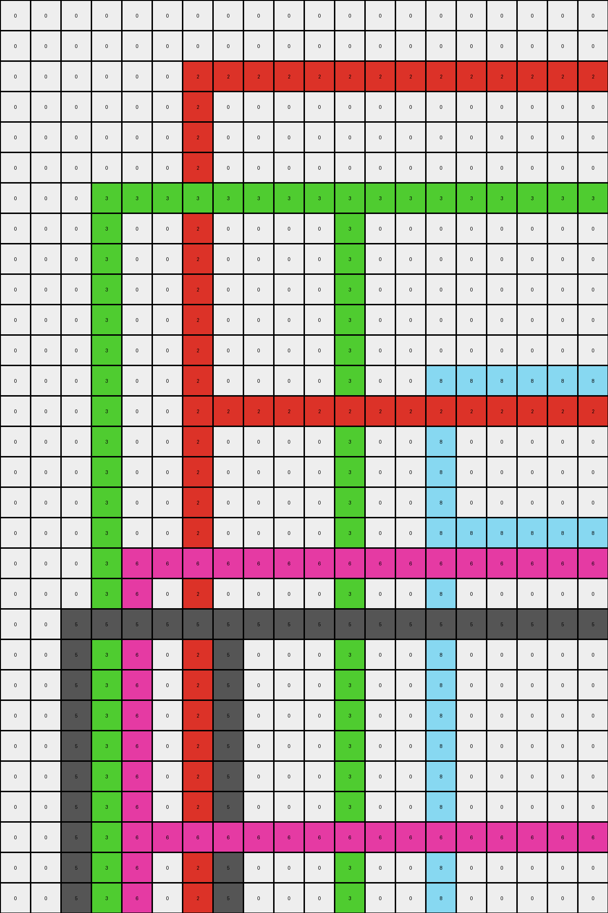
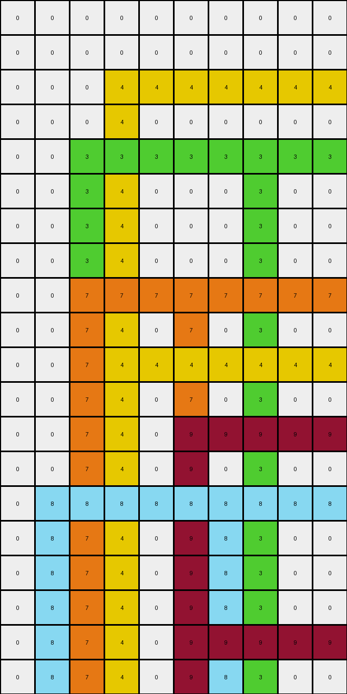

# 40853293 • 012 • refine_coder

---

Previous Code:
```python
"""
1.  **Identify Isolated Pixels:** Scan the input grid to find pixels that are not white (color 0) and are surrounded on all four sides (up, down, left, right) by either white pixels or the edge of the grid.

2.  **Create Plus Shapes:** For each isolated pixel:
    *   Extend the pixel's color horizontally to the left and right, stopping when a non-white pixel or the grid edge is encountered.
    *   Extend the pixel's color vertically up and down, stopping when a non-white pixel or the grid edge is encountered.
    * The result is a "plus" shape centered on the original isolated pixel's location.

3. **Output:** The transformed grid contains only plus-shaped objects created from these isolated pixels. If the horizontal and vertical extensions from different pixels overlap, the color of the horizontal extension in that cell is kept.
"""

import numpy as np

def is_isolated(grid, row, col):
    """Checks if a pixel at (row, col) is isolated."""
    color = grid[row, col]
    if color == 0:  # white pixels are not considered
        return False

    height, width = grid.shape
    neighbors = []

    if row > 0:
        neighbors.append(grid[row - 1, col])  # Up
    else:
        neighbors.append(0)
    if row < height - 1:
        neighbors.append(grid[row + 1, col])  # Down
    else:
        neighbors.append(0)
    if col > 0:
        neighbors.append(grid[row, col - 1])  # Left
    else:
        neighbors.append(0)
    if col < width - 1:
        neighbors.append(grid[row, col + 1])  # Right
    else:
        neighbors.append(0)

    for neighbor_color in neighbors:
        if neighbor_color != 0:
            return False  # Not isolated if any neighbor is not white

    return True

def transform(input_grid):
    """Transforms the input grid according to the rules."""
    input_grid = np.array(input_grid)  # Ensure it is numpy array
    output_grid = np.zeros_like(input_grid) # initialize with all zeros
    height, width = input_grid.shape

    isolated_pixels = []
    for row in range(height):
        for col in range(width):
            if is_isolated(input_grid, row, col):
                isolated_pixels.append((row, col, input_grid[row, col]))

    for row, col, color in isolated_pixels:
        # Horizontal Extension
        # Left
        for c in range(col, -1, -1):
            if input_grid[row,c] == 0:
                output_grid[row,c] = color
            else:
                output_grid[row,c] = color #include original
                break #stop extension
        # Right
        for c in range(col+1, width):
             if input_grid[row,c] == 0:
                output_grid[row,c] = color
             else:
                break #stop extension

        # Vertical Extension
        #Up
        for r in range(row, -1, -1):
            if input_grid[r,col] == 0:
                output_grid[r,col] = color
            else:
                output_grid[r,col] = color #include original
                break
        #Down
        for r in range(row + 1, height):
            if input_grid[r,col] == 0:
                output_grid[r,col] = color
            else:
                break


    return output_grid.tolist()
```

Train Set Results:

## Example 1:

Input:
```
0 0 0 0 0 0 0 0 0 0 0 0 0 0 0 0 0 0 0 0
0 0 0 0 0 0 0 0 0 0 0 0 0 0 0 0 0 0 0 0
0 0 0 0 0 0 2 0 0 0 0 0 0 0 0 0 0 0 0 0
0 0 0 0 0 0 0 0 0 0 0 0 0 0 0 0 0 0 0 0
0 0 0 0 0 0 0 0 0 0 0 0 0 0 0 0 0 0 0 0
0 0 0 0 0 0 0 0 0 0 0 0 0 0 0 0 0 0 0 0
0 0 0 3 0 0 0 0 0 0 0 3 0 0 0 0 0 0 0 0
0 0 0 0 0 0 0 0 0 0 0 0 0 0 0 0 0 0 0 0
0 0 0 0 0 0 0 0 0 0 0 0 0 0 0 0 0 0 0 0
0 0 0 0 0 0 0 0 0 0 0 0 0 0 0 0 0 0 0 0
0 0 0 0 0 0 0 0 0 0 0 0 0 0 0 0 0 0 0 0
0 0 0 0 0 0 0 0 0 0 0 0 0 0 0 0 0 0 0 0
0 0 0 0 0 0 0 0 0 0 0 0 0 0 8 0 0 0 0 0
0 0 0 0 0 0 2 0 0 0 0 0 0 0 0 0 0 0 0 0
0 0 0 0 0 0 0 0 0 0 0 0 0 0 0 0 0 0 0 0
0 0 0 0 0 0 0 0 0 0 0 0 0 0 0 0 0 0 0 0
0 0 0 0 0 0 0 0 0 0 0 0 0 0 0 0 0 0 0 0
0 0 0 0 0 0 0 0 0 0 0 0 0 0 8 0 0 0 0 0
0 0 0 0 6 0 0 0 0 0 0 0 0 0 0 0 0 0 0 0
0 0 0 0 0 0 0 0 0 0 0 0 0 0 0 0 0 0 0 0
0 0 5 0 0 0 0 5 0 0 0 0 0 0 0 0 0 0 0 0
0 0 0 0 0 0 0 0 0 0 0 0 0 0 0 0 0 0 0 0
0 0 0 0 0 0 0 0 0 0 0 0 0 0 0 0 0 0 0 0
0 0 0 0 0 0 0 0 0 0 0 0 0 0 0 0 0 0 0 0
0 0 0 0 0 0 0 0 0 0 0 0 0 0 0 0 0 0 0 0
0 0 0 0 0 0 0 0 0 0 0 0 0 0 0 0 0 0 0 0
0 0 0 0 0 0 0 0 0 0 0 0 0 0 0 0 0 0 0 0
0 0 0 0 6 0 0 0 0 0 0 0 0 0 0 0 0 0 0 0
0 0 0 0 0 0 0 0 0 0 0 0 0 0 0 0 0 0 0 0
0 0 0 0 0 0 0 0 0 0 0 0 0 0 0 0 0 0 0 0
```
Expected Output:
```
0 0 0 0 0 0 0 0 0 0 0 0 0 0 0 0 0 0 0 0
0 0 0 0 0 0 0 0 0 0 0 0 0 0 0 0 0 0 0 0
0 0 0 0 0 0 2 0 0 0 0 0 0 0 0 0 0 0 0 0
0 0 0 0 0 0 2 0 0 0 0 0 0 0 0 0 0 0 0 0
0 0 0 0 0 0 2 0 0 0 0 0 0 0 0 0 0 0 0 0
0 0 0 0 0 0 2 0 0 0 0 0 0 0 0 0 0 0 0 0
0 0 0 3 3 3 2 3 3 3 3 3 0 0 0 0 0 0 0 0
0 0 0 0 0 0 2 0 0 0 0 0 0 0 0 0 0 0 0 0
0 0 0 0 0 0 2 0 0 0 0 0 0 0 0 0 0 0 0 0
0 0 0 0 0 0 2 0 0 0 0 0 0 0 0 0 0 0 0 0
0 0 0 0 0 0 2 0 0 0 0 0 0 0 0 0 0 0 0 0
0 0 0 0 0 0 2 0 0 0 0 0 0 0 0 0 0 0 0 0
0 0 0 0 0 0 2 0 0 0 0 0 0 0 8 0 0 0 0 0
0 0 0 0 0 0 2 0 0 0 0 0 0 0 8 0 0 0 0 0
0 0 0 0 0 0 0 0 0 0 0 0 0 0 8 0 0 0 0 0
0 0 0 0 0 0 0 0 0 0 0 0 0 0 8 0 0 0 0 0
0 0 0 0 0 0 0 0 0 0 0 0 0 0 8 0 0 0 0 0
0 0 0 0 0 0 0 0 0 0 0 0 0 0 8 0 0 0 0 0
0 0 0 0 6 0 0 0 0 0 0 0 0 0 0 0 0 0 0 0
0 0 0 0 6 0 0 0 0 0 0 0 0 0 0 0 0 0 0 0
0 0 5 5 6 5 5 5 0 0 0 0 0 0 0 0 0 0 0 0
0 0 0 0 6 0 0 0 0 0 0 0 0 0 0 0 0 0 0 0
0 0 0 0 6 0 0 0 0 0 0 0 0 0 0 0 0 0 0 0
0 0 0 0 6 0 0 0 0 0 0 0 0 0 0 0 0 0 0 0
0 0 0 0 6 0 0 0 0 0 0 0 0 0 0 0 0 0 0 0
0 0 0 0 6 0 0 0 0 0 0 0 0 0 0 0 0 0 0 0
0 0 0 0 6 0 0 0 0 0 0 0 0 0 0 0 0 0 0 0
0 0 0 0 6 0 0 0 0 0 0 0 0 0 0 0 0 0 0 0
0 0 0 0 0 0 0 0 0 0 0 0 0 0 0 0 0 0 0 0
0 0 0 0 0 0 0 0 0 0 0 0 0 0 0 0 0 0 0 0
```
Transformed Output:
```
0 0 0 0 0 0 0 0 0 0 0 0 0 0 0 0 0 0 0 0
0 0 0 0 0 0 0 0 0 0 0 0 0 0 0 0 0 0 0 0
0 0 0 0 0 0 2 2 2 2 2 2 2 2 2 2 2 2 2 2
0 0 0 0 0 0 2 0 0 0 0 0 0 0 0 0 0 0 0 0
0 0 0 0 0 0 2 0 0 0 0 0 0 0 0 0 0 0 0 0
0 0 0 0 0 0 2 0 0 0 0 0 0 0 0 0 0 0 0 0
0 0 0 3 3 3 3 3 3 3 3 3 3 3 3 3 3 3 3 3
0 0 0 3 0 0 2 0 0 0 0 3 0 0 0 0 0 0 0 0
0 0 0 3 0 0 2 0 0 0 0 3 0 0 0 0 0 0 0 0
0 0 0 3 0 0 2 0 0 0 0 3 0 0 0 0 0 0 0 0
0 0 0 3 0 0 2 0 0 0 0 3 0 0 0 0 0 0 0 0
0 0 0 3 0 0 2 0 0 0 0 3 0 0 0 0 0 0 0 0
0 0 0 3 0 0 2 0 0 0 0 3 0 0 8 8 8 8 8 8
0 0 0 3 0 0 2 2 2 2 2 2 2 2 2 2 2 2 2 2
0 0 0 3 0 0 2 0 0 0 0 3 0 0 8 0 0 0 0 0
0 0 0 3 0 0 2 0 0 0 0 3 0 0 8 0 0 0 0 0
0 0 0 3 0 0 2 0 0 0 0 3 0 0 8 0 0 0 0 0
0 0 0 3 0 0 2 0 0 0 0 3 0 0 8 8 8 8 8 8
0 0 0 3 6 6 6 6 6 6 6 6 6 6 6 6 6 6 6 6
0 0 0 3 6 0 2 0 0 0 0 3 0 0 8 0 0 0 0 0
0 0 5 5 5 5 5 5 5 5 5 5 5 5 5 5 5 5 5 5
0 0 5 3 6 0 2 5 0 0 0 3 0 0 8 0 0 0 0 0
0 0 5 3 6 0 2 5 0 0 0 3 0 0 8 0 0 0 0 0
0 0 5 3 6 0 2 5 0 0 0 3 0 0 8 0 0 0 0 0
0 0 5 3 6 0 2 5 0 0 0 3 0 0 8 0 0 0 0 0
0 0 5 3 6 0 2 5 0 0 0 3 0 0 8 0 0 0 0 0
0 0 5 3 6 0 2 5 0 0 0 3 0 0 8 0 0 0 0 0
0 0 5 3 6 6 6 6 6 6 6 6 6 6 6 6 6 6 6 6
0 0 5 3 6 0 2 5 0 0 0 3 0 0 8 0 0 0 0 0
0 0 5 3 6 0 2 5 0 0 0 3 0 0 8 0 0 0 0 0
```

match: False
pixels_off: 170
size_correct: True
color_palette_correct: True
correct_pixel_counts: False

## Example 2:

Input:
```
0 0 0 0 0 0 0 0 0 0
0 0 0 0 0 0 0 0 0 0
0 0 0 4 0 0 0 0 0 0
0 0 0 0 0 0 0 0 0 0
0 0 3 0 0 0 0 3 0 0
0 0 0 0 0 0 0 0 0 0
0 0 0 0 0 0 0 0 0 0
0 0 0 0 0 0 0 0 0 0
0 0 7 0 0 7 0 0 0 0
0 0 0 0 0 0 0 0 0 0
0 0 0 4 0 0 0 0 0 0
0 0 0 0 0 0 0 0 0 0
0 0 0 0 0 9 0 0 0 0
0 0 0 0 0 0 0 0 0 0
0 8 0 0 0 0 8 0 0 0
0 0 0 0 0 0 0 0 0 0
0 0 0 0 0 0 0 0 0 0
0 0 0 0 0 0 0 0 0 0
0 0 0 0 0 9 0 0 0 0
0 0 0 0 0 0 0 0 0 0
```
Expected Output:
```
0 0 0 0 0 0 0 0 0 0
0 0 0 0 0 0 0 0 0 0
0 0 0 4 0 0 0 0 0 0
0 0 0 4 0 0 0 0 0 0
0 0 3 4 3 3 3 3 0 0
0 0 0 4 0 0 0 0 0 0
0 0 0 4 0 0 0 0 0 0
0 0 0 4 0 0 0 0 0 0
0 0 7 4 7 7 0 0 0 0
0 0 0 4 0 0 0 0 0 0
0 0 0 4 0 0 0 0 0 0
0 0 0 0 0 0 0 0 0 0
0 0 0 0 0 9 0 0 0 0
0 0 0 0 0 9 0 0 0 0
0 8 8 8 8 9 8 0 0 0
0 0 0 0 0 9 0 0 0 0
0 0 0 0 0 9 0 0 0 0
0 0 0 0 0 9 0 0 0 0
0 0 0 0 0 9 0 0 0 0
0 0 0 0 0 0 0 0 0 0
```
Transformed Output:
```
0 0 0 0 0 0 0 0 0 0
0 0 0 0 0 0 0 0 0 0
0 0 0 4 4 4 4 4 4 4
0 0 0 4 0 0 0 0 0 0
0 0 3 3 3 3 3 3 3 3
0 0 3 4 0 0 0 3 0 0
0 0 3 4 0 0 0 3 0 0
0 0 3 4 0 0 0 3 0 0
0 0 7 7 7 7 7 7 7 7
0 0 7 4 0 7 0 3 0 0
0 0 7 4 4 4 4 4 4 4
0 0 7 4 0 7 0 3 0 0
0 0 7 4 0 9 9 9 9 9
0 0 7 4 0 9 0 3 0 0
0 8 8 8 8 8 8 8 8 8
0 8 7 4 0 9 8 3 0 0
0 8 7 4 0 9 8 3 0 0
0 8 7 4 0 9 8 3 0 0
0 8 7 4 0 9 9 9 9 9
0 8 7 4 0 9 8 3 0 0
```

match: False
pixels_off: 75
size_correct: True
color_palette_correct: True
correct_pixel_counts: False
Okay, let's analyze the results and update the natural language program.

**General Assessment:**

The initial strategy of identifying isolated pixels and creating plus shapes centered on them is partially correct. However, the current implementation has several issues:

1.  **Overlapping Plus Shapes:** The horizontal extension takes precedence, leading to incorrect shapes and color overwrites when plus shapes intersect, especially evident in Example 2.
2.  **Incorrect Extension Logic:** The extension logic doesn't correctly handle cases where a non-white pixel is encountered *before* the original isolated pixel is reached. The program assumes that the non-white cells should not be colored.
3. **Misinterpretation of Isolation**: My initial logic to preserve the original cell color was wrong - the plus-shaped objects extend until either the edge of the grid, or a non-white object is met.

The main strategy for resolving these errors will involve:
* revisiting the extension logic so that extensions can color until the edge or non-white pixels are reached.
* prioritizing merging by maintaining the color of the isolated pixel in overlaps

**Metrics and Observations:**

Here's a summary of the examples, including observations:

**Example 1:**

*   **Input:** Multiple isolated pixels of different colors (2, 3, 8, 6, 5). Some are close together.
*   **Expected Output:** Plus shapes of corresponding colors. Overlapping regions seem arbitrary.
*   **Actual Output:** Incorrect plus shapes. Many overlaps are handled incorrectly, with horizontal extensions overwriting vertical ones.
*  The transformed image extends to the edge, instead of stopping at the closest non-white pixel.

**Example 2:**

*   **Input:** Isolated pixels of different colors (4, 3, 7, 8, 9), some very close.
*   **Expected Output:** Plus shapes, with some overlaps.
*   **Actual Output:** Incorrect plus shapes and overlaps. Horizontal extensions dominate.

**YAML Block (Facts):**

```yaml
objects:
  - type: pixel
    properties:
      - isolated: boolean  # Whether the pixel is surrounded by white pixels or the grid edge.
      - color: integer (0-9)  # The color of the pixel.

actions:
  - name: extend_horizontally
    description: Extend a pixel's color to the left and right until a non-white pixel or grid edge is encountered.
  - name: extend_vertically
    description: Extend a pixel's color up and down until a non-white pixel or grid edge is encountered.
  - name: overlap_priority
    description: When horizontal and vertical extensions from two different pluses would overlap, keep the initial isolated pixel color.
```

**Natural Language Program:**

1.  **Identify Isolated Pixels:** Find all non-white pixels that are surrounded by white pixels or the edge of the grid on all four sides (up, down, left, right).

2.  **Create Plus Shapes:** For each isolated pixel:
    *   Extend the pixel's color horizontally, both left and right. Stop the extension in each direction when a non-white pixel or the edge of the grid is reached.
    *   Extend the pixel's color vertically, both up and down. Stop the extension in each direction when a non-white pixel or the edge of the grid is reached.

3.  **Handle Overlaps:** If, during the extension, a pixel's extension would overwrite a pixel that is already part of *another* isolated pixel's extension, maintain the initial isolated pixel color.

4. **Output:** The final grid will consist of these plus-shaped objects, potentially with some overlaps handled as described in step 3.

**INSTRUCTIONS**

- generate a Python module to represent the natural language program 
- follow the template below
- all common math and science libraries are available
- create docstring only at top - but comment the workflow in the function
- use helper functions for common operations like finding objects, counting,
  measuring, moving, etc. 

remember - we are working iteratively - so this code will inform your future
self as we converge on the solution

*template:*

```python
"""
{{ natural language description of the transformation rule }}
"""

{{ imports }}

def transform(input_grid):
    # initialize output_grid

    # change output pixels 

    return output_grid

```
