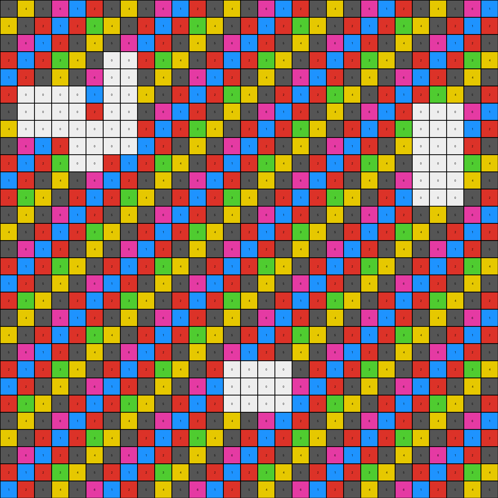

# 484b58aa • 003 • refine_dreamer

---

Previous Code:
```python
"""
The transformation rule is to remove all pixels of color 0 (white) from the input grid, keeping all other pixels in their original positions and with their original colors.
"""

import numpy as np

def transform(input_grid):
    """
    Removes all white (0) pixels from the input grid.

    Args:
        input_grid: A 2D numpy array representing the input grid.

    Returns:
        A 2D numpy array with white pixels removed.
    """
    # Create a copy of the input grid to serve as the output grid.
    output_grid = np.copy(input_grid)

    # Iterate through each cell in the grid.
    for row_index, row in enumerate(input_grid):
        for col_index, pixel_value in enumerate(row):
            # Check if the pixel is white (value 0).
            if pixel_value == 0:
                # set output pixel to input pixel
                output_grid[row_index, col_index] = pixel_value

    # set output to original pixel for all other cells
    output_grid = np.where(input_grid == 0, 0, input_grid)
    return output_grid
```

Train Set Results:

## Example 1:

Input:
```
5 4 5 6 1 2 5 4 5 6 1 2 5 4 5 6 1 2 5 4 5 6 1 2 5 4 5 6 1
4 5 2 1 2 3 4 5 2 1 2 3 4 5 2 1 2 3 4 5 2 1 2 3 4 5 2 1 2
5 6 1 2 5 4 5 6 1 2 5 4 5 6 1 2 5 4 5 6 1 2 5 4 5 6 1 2 5
2 1 2 3 4 5 0 0 2 3 4 5 2 1 2 3 4 5 2 1 2 3 4 5 2 1 2 3 4
1 2 5 4 5 6 0 0 5 4 5 6 1 2 5 4 5 6 1 2 5 4 5 6 1 2 5 4 5
2 0 0 0 0 1 0 0 4 5 2 1 2 3 4 5 2 1 2 3 4 5 2 1 2 3 4 5 2
5 0 0 0 0 2 0 0 5 6 1 2 5 4 5 6 1 2 5 4 5 6 1 2 0 0 0 6 1
4 0 0 0 0 0 0 0 2 1 2 3 4 5 2 1 2 3 4 5 2 1 2 3 0 0 0 1 2
5 6 1 2 0 0 0 0 1 2 5 4 5 6 1 2 5 4 5 6 1 2 5 4 0 0 0 2 5
2 1 2 3 0 0 2 1 2 3 4 5 2 1 2 3 4 5 2 1 2 3 4 5 0 0 0 3 4
1 2 5 4 5 6 1 2 5 4 5 6 1 2 5 4 5 6 1 2 5 4 5 6 0 0 0 4 5
2 3 4 5 2 1 2 3 4 5 2 1 2 3 4 5 2 1 2 3 4 5 2 1 0 0 0 5 2
5 4 5 6 1 2 5 4 5 6 1 2 5 4 5 6 1 2 5 4 5 6 1 2 5 4 5 6 1
4 5 2 1 2 3 4 5 2 1 2 3 4 5 2 1 2 3 4 5 2 1 2 3 4 5 2 1 2
5 6 1 2 5 4 5 6 1 2 5 4 5 6 1 2 5 4 5 6 1 2 5 4 5 6 1 2 5
2 1 2 3 4 5 2 1 2 3 4 5 2 1 2 3 4 5 2 1 2 3 4 5 2 1 2 3 4
1 2 5 4 5 6 1 2 5 4 5 6 1 2 5 4 5 6 1 2 5 4 5 6 1 2 5 4 5
2 3 4 5 2 1 2 3 4 5 2 1 2 3 4 5 2 1 2 3 4 5 2 1 2 3 4 5 2
5 4 5 6 1 2 5 4 5 6 1 2 5 4 5 6 1 2 5 4 5 6 1 2 5 4 5 6 1
4 5 2 1 2 3 4 5 2 1 2 3 4 5 2 1 2 3 4 5 2 1 2 3 4 5 2 1 2
5 6 1 2 5 4 5 6 1 2 5 4 5 6 1 2 5 4 5 6 1 2 5 4 5 6 1 2 5
2 1 2 3 4 5 2 1 2 3 4 5 2 0 0 0 0 5 2 1 2 3 4 5 2 1 2 3 4
1 2 5 4 5 6 1 2 5 4 5 6 1 0 0 0 0 6 1 2 5 4 5 6 1 2 5 4 5
2 3 4 5 2 1 2 3 4 5 2 1 2 0 0 0 0 1 2 3 4 5 2 1 2 3 4 5 2
5 4 5 6 1 2 5 4 5 6 1 2 5 4 5 6 1 2 5 4 5 6 1 2 5 4 5 6 1
4 5 2 1 2 3 4 5 2 1 2 3 4 5 2 1 2 3 4 5 2 1 2 3 4 5 2 1 2
5 6 1 2 5 4 5 6 1 2 5 4 5 6 1 2 5 4 5 6 1 2 5 4 5 6 1 2 5
2 1 2 3 4 5 2 1 2 3 4 5 2 1 2 3 4 5 2 1 2 3 4 5 2 1 2 3 4
1 2 5 4 5 6 1 2 5 4 5 6 1 2 5 4 5 6 1 2 5 4 5 6 1 2 5 4 5
```
Expected Output:
```
5 4 5 6 1 2 5 4 5 6 1 2 5 4 5 6 1 2 5 4 5 6 1 2 5 4 5 6 1
4 5 2 1 2 3 4 5 2 1 2 3 4 5 2 1 2 3 4 5 2 1 2 3 4 5 2 1 2
5 6 1 2 5 4 5 6 1 2 5 4 5 6 1 2 5 4 5 6 1 2 5 4 5 6 1 2 5
2 1 2 3 4 5 2 1 2 3 4 5 2 1 2 3 4 5 2 1 2 3 4 5 2 1 2 3 4
1 2 5 4 5 6 1 2 5 4 5 6 1 2 5 4 5 6 1 2 5 4 5 6 1 2 5 4 5
2 3 4 5 2 1 2 3 4 5 2 1 2 3 4 5 2 1 2 3 4 5 2 1 2 3 4 5 2
5 4 5 6 1 2 5 4 5 6 1 2 5 4 5 6 1 2 5 4 5 6 1 2 5 4 5 6 1
4 5 2 1 2 3 4 5 2 1 2 3 4 5 2 1 2 3 4 5 2 1 2 3 4 5 2 1 2
5 6 1 2 5 4 5 6 1 2 5 4 5 6 1 2 5 4 5 6 1 2 5 4 5 6 1 2 5
2 1 2 3 4 5 2 1 2 3 4 5 2 1 2 3 4 5 2 1 2 3 4 5 2 1 2 3 4
1 2 5 4 5 6 1 2 5 4 5 6 1 2 5 4 5 6 1 2 5 4 5 6 1 2 5 4 5
2 3 4 5 2 1 2 3 4 5 2 1 2 3 4 5 2 1 2 3 4 5 2 1 2 3 4 5 2
5 4 5 6 1 2 5 4 5 6 1 2 5 4 5 6 1 2 5 4 5 6 1 2 5 4 5 6 1
4 5 2 1 2 3 4 5 2 1 2 3 4 5 2 1 2 3 4 5 2 1 2 3 4 5 2 1 2
5 6 1 2 5 4 5 6 1 2 5 4 5 6 1 2 5 4 5 6 1 2 5 4 5 6 1 2 5
2 1 2 3 4 5 2 1 2 3 4 5 2 1 2 3 4 5 2 1 2 3 4 5 2 1 2 3 4
1 2 5 4 5 6 1 2 5 4 5 6 1 2 5 4 5 6 1 2 5 4 5 6 1 2 5 4 5
2 3 4 5 2 1 2 3 4 5 2 1 2 3 4 5 2 1 2 3 4 5 2 1 2 3 4 5 2
5 4 5 6 1 2 5 4 5 6 1 2 5 4 5 6 1 2 5 4 5 6 1 2 5 4 5 6 1
4 5 2 1 2 3 4 5 2 1 2 3 4 5 2 1 2 3 4 5 2 1 2 3 4 5 2 1 2
5 6 1 2 5 4 5 6 1 2 5 4 5 6 1 2 5 4 5 6 1 2 5 4 5 6 1 2 5
2 1 2 3 4 5 2 1 2 3 4 5 2 1 2 3 4 5 2 1 2 3 4 5 2 1 2 3 4
1 2 5 4 5 6 1 2 5 4 5 6 1 2 5 4 5 6 1 2 5 4 5 6 1 2 5 4 5
2 3 4 5 2 1 2 3 4 5 2 1 2 3 4 5 2 1 2 3 4 5 2 1 2 3 4 5 2
5 4 5 6 1 2 5 4 5 6 1 2 5 4 5 6 1 2 5 4 5 6 1 2 5 4 5 6 1
4 5 2 1 2 3 4 5 2 1 2 3 4 5 2 1 2 3 4 5 2 1 2 3 4 5 2 1 2
5 6 1 2 5 4 5 6 1 2 5 4 5 6 1 2 5 4 5 6 1 2 5 4 5 6 1 2 5
2 1 2 3 4 5 2 1 2 3 4 5 2 1 2 3 4 5 2 1 2 3 4 5 2 1 2 3 4
1 2 5 4 5 6 1 2 5 4 5 6 1 2 5 4 5 6 1 2 5 4 5 6 1 2 5 4 5
```
Transformed Output:
```
5 4 5 6 1 2 5 4 5 6 1 2 5 4 5 6 1 2 5 4 5 6 1 2 5 4 5 6 1
4 5 2 1 2 3 4 5 2 1 2 3 4 5 2 1 2 3 4 5 2 1 2 3 4 5 2 1 2
5 6 1 2 5 4 5 6 1 2 5 4 5 6 1 2 5 4 5 6 1 2 5 4 5 6 1 2 5
2 1 2 3 4 5 0 0 2 3 4 5 2 1 2 3 4 5 2 1 2 3 4 5 2 1 2 3 4
1 2 5 4 5 6 0 0 5 4 5 6 1 2 5 4 5 6 1 2 5 4 5 6 1 2 5 4 5
2 0 0 0 0 1 0 0 4 5 2 1 2 3 4 5 2 1 2 3 4 5 2 1 2 3 4 5 2
5 0 0 0 0 2 0 0 5 6 1 2 5 4 5 6 1 2 5 4 5 6 1 2 0 0 0 6 1
4 0 0 0 0 0 0 0 2 1 2 3 4 5 2 1 2 3 4 5 2 1 2 3 0 0 0 1 2
5 6 1 2 0 0 0 0 1 2 5 4 5 6 1 2 5 4 5 6 1 2 5 4 0 0 0 2 5
2 1 2 3 0 0 2 1 2 3 4 5 2 1 2 3 4 5 2 1 2 3 4 5 0 0 0 3 4
1 2 5 4 5 6 1 2 5 4 5 6 1 2 5 4 5 6 1 2 5 4 5 6 0 0 0 4 5
2 3 4 5 2 1 2 3 4 5 2 1 2 3 4 5 2 1 2 3 4 5 2 1 0 0 0 5 2
5 4 5 6 1 2 5 4 5 6 1 2 5 4 5 6 1 2 5 4 5 6 1 2 5 4 5 6 1
4 5 2 1 2 3 4 5 2 1 2 3 4 5 2 1 2 3 4 5 2 1 2 3 4 5 2 1 2
5 6 1 2 5 4 5 6 1 2 5 4 5 6 1 2 5 4 5 6 1 2 5 4 5 6 1 2 5
2 1 2 3 4 5 2 1 2 3 4 5 2 1 2 3 4 5 2 1 2 3 4 5 2 1 2 3 4
1 2 5 4 5 6 1 2 5 4 5 6 1 2 5 4 5 6 1 2 5 4 5 6 1 2 5 4 5
2 3 4 5 2 1 2 3 4 5 2 1 2 3 4 5 2 1 2 3 4 5 2 1 2 3 4 5 2
5 4 5 6 1 2 5 4 5 6 1 2 5 4 5 6 1 2 5 4 5 6 1 2 5 4 5 6 1
4 5 2 1 2 3 4 5 2 1 2 3 4 5 2 1 2 3 4 5 2 1 2 3 4 5 2 1 2
5 6 1 2 5 4 5 6 1 2 5 4 5 6 1 2 5 4 5 6 1 2 5 4 5 6 1 2 5
2 1 2 3 4 5 2 1 2 3 4 5 2 0 0 0 0 5 2 1 2 3 4 5 2 1 2 3 4
1 2 5 4 5 6 1 2 5 4 5 6 1 0 0 0 0 6 1 2 5 4 5 6 1 2 5 4 5
2 3 4 5 2 1 2 3 4 5 2 1 2 0 0 0 0 1 2 3 4 5 2 1 2 3 4 5 2
5 4 5 6 1 2 5 4 5 6 1 2 5 4 5 6 1 2 5 4 5 6 1 2 5 4 5 6 1
4 5 2 1 2 3 4 5 2 1 2 3 4 5 2 1 2 3 4 5 2 1 2 3 4 5 2 1 2
5 6 1 2 5 4 5 6 1 2 5 4 5 6 1 2 5 4 5 6 1 2 5 4 5 6 1 2 5
2 1 2 3 4 5 2 1 2 3 4 5 2 1 2 3 4 5 2 1 2 3 4 5 2 1 2 3 4
1 2 5 4 5 6 1 2 5 4 5 6 1 2 5 4 5 6 1 2 5 4 5 6 1 2 5 4 5
```

match: False
pixels_off: 59
size_correct: True
color_palette_correct: False
correct_pixel_counts: False

## Example 2:

Input:
```
5 4 2 1 2 2 5 3 2 7 1 2 3 6 2 6 2 1 2 5 2 5 5 7 1 2 2 4 3
0 0 0 0 5 7 5 4 2 1 2 2 5 3 2 7 1 2 3 6 2 6 2 1 2 5 2 5 5
0 0 0 0 3 2 3 7 1 2 5 7 5 4 2 1 2 2 5 3 2 7 1 2 3 6 2 6 2
0 0 0 0 3 7 2 1 2 3 3 2 3 7 1 2 5 7 5 4 2 1 2 2 5 3 2 7 1
0 0 0 0 5 7 1 2 2 4 3 7 2 1 2 3 3 2 3 7 1 2 5 7 5 4 2 1 2
3 6 2 6 2 1 2 5 2 5 5 7 1 2 2 4 3 7 2 1 2 3 3 2 3 7 1 2 5
5 3 2 7 1 2 3 6 2 6 2 1 2 5 2 5 5 7 1 2 2 4 3 7 2 1 2 3 3
5 4 2 1 2 2 5 3 2 7 1 2 3 6 2 6 2 1 2 5 2 5 5 7 1 2 2 4 3
3 7 1 2 5 7 5 4 2 1 2 2 5 3 2 7 1 2 3 6 2 6 2 1 2 5 2 5 5
2 1 2 3 3 2 3 7 1 2 5 7 5 4 2 1 2 2 5 3 2 7 1 2 3 6 2 6 2
1 2 2 4 3 7 2 1 2 3 3 2 3 7 1 2 5 7 5 4 2 1 2 2 5 3 2 7 1
2 5 2 5 5 7 1 2 2 4 3 7 2 1 2 3 3 2 3 0 0 0 0 0 5 4 2 1 2
3 6 2 6 2 1 2 5 2 5 5 7 1 2 2 4 3 7 2 0 0 0 0 0 3 7 1 2 5
5 3 2 7 1 2 3 6 2 0 0 0 0 0 2 5 5 7 1 0 0 0 0 0 2 1 2 3 3
5 4 2 1 2 2 5 3 2 0 0 0 0 0 2 6 2 1 2 0 0 0 0 0 1 2 2 4 3
3 7 1 2 5 7 5 4 2 1 2 2 5 3 2 7 1 2 3 0 0 0 0 1 2 5 2 5 5
2 1 2 3 0 0 0 7 1 2 5 7 5 4 2 1 2 2 5 0 0 0 0 2 3 6 2 6 2
1 2 2 4 0 0 0 1 2 3 3 2 3 7 1 2 5 7 5 4 2 1 2 2 5 3 2 7 1
2 5 2 5 0 0 0 2 2 4 3 7 2 1 2 3 3 2 3 7 1 2 5 7 5 4 2 1 2
3 6 2 6 0 0 0 5 2 5 5 7 1 2 2 4 3 7 2 1 2 3 3 2 3 7 1 2 5
5 3 2 7 0 0 0 6 2 6 2 1 2 5 2 5 5 7 1 2 2 4 3 7 2 1 2 3 3
5 4 2 1 0 0 0 3 2 7 1 2 3 6 2 6 2 1 2 5 2 5 5 7 1 2 2 4 3
3 7 1 2 5 7 5 4 2 1 2 2 5 3 2 7 1 2 3 6 2 6 2 1 2 5 2 5 5
2 1 2 3 3 2 3 7 1 2 5 7 5 4 2 1 2 2 5 3 2 7 1 2 3 6 2 6 2
1 2 2 4 3 7 2 1 2 3 3 2 3 7 1 2 5 7 5 4 2 1 2 2 5 3 2 7 1
2 5 2 5 5 7 1 2 2 4 3 7 2 1 2 3 3 2 3 7 1 2 5 7 5 4 2 1 2
3 6 2 6 2 1 2 5 2 5 5 7 1 2 2 4 3 7 2 1 2 3 3 2 3 7 1 2 5
5 3 2 7 1 2 3 6 2 6 2 1 2 5 2 5 5 7 1 2 2 4 3 7 2 1 2 3 3
5 4 2 1 2 2 5 3 2 7 1 2 3 6 2 6 2 1 2 5 2 5 5 7 1 2 2 4 3
```
Expected Output:
```
5 4 2 1 2 2 5 3 2 7 1 2 3 6 2 6 2 1 2 5 2 5 5 7 1 2 2 4 3
3 7 1 2 5 7 5 4 2 1 2 2 5 3 2 7 1 2 3 6 2 6 2 1 2 5 2 5 5
2 1 2 3 3 2 3 7 1 2 5 7 5 4 2 1 2 2 5 3 2 7 1 2 3 6 2 6 2
1 2 2 4 3 7 2 1 2 3 3 2 3 7 1 2 5 7 5 4 2 1 2 2 5 3 2 7 1
2 5 2 5 5 7 1 2 2 4 3 7 2 1 2 3 3 2 3 7 1 2 5 7 5 4 2 1 2
3 6 2 6 2 1 2 5 2 5 5 7 1 2 2 4 3 7 2 1 2 3 3 2 3 7 1 2 5
5 3 2 7 1 2 3 6 2 6 2 1 2 5 2 5 5 7 1 2 2 4 3 7 2 1 2 3 3
5 4 2 1 2 2 5 3 2 7 1 2 3 6 2 6 2 1 2 5 2 5 5 7 1 2 2 4 3
3 7 1 2 5 7 5 4 2 1 2 2 5 3 2 7 1 2 3 6 2 6 2 1 2 5 2 5 5
2 1 2 3 3 2 3 7 1 2 5 7 5 4 2 1 2 2 5 3 2 7 1 2 3 6 2 6 2
1 2 2 4 3 7 2 1 2 3 3 2 3 7 1 2 5 7 5 4 2 1 2 2 5 3 2 7 1
2 5 2 5 5 7 1 2 2 4 3 7 2 1 2 3 3 2 3 7 1 2 5 7 5 4 2 1 2
3 6 2 6 2 1 2 5 2 5 5 7 1 2 2 4 3 7 2 1 2 3 3 2 3 7 1 2 5
5 3 2 7 1 2 3 6 2 6 2 1 2 5 2 5 5 7 1 2 2 4 3 7 2 1 2 3 3
5 4 2 1 2 2 5 3 2 7 1 2 3 6 2 6 2 1 2 5 2 5 5 7 1 2 2 4 3
3 7 1 2 5 7 5 4 2 1 2 2 5 3 2 7 1 2 3 6 2 6 2 1 2 5 2 5 5
2 1 2 3 3 2 3 7 1 2 5 7 5 4 2 1 2 2 5 3 2 7 1 2 3 6 2 6 2
1 2 2 4 3 7 2 1 2 3 3 2 3 7 1 2 5 7 5 4 2 1 2 2 5 3 2 7 1
2 5 2 5 5 7 1 2 2 4 3 7 2 1 2 3 3 2 3 7 1 2 5 7 5 4 2 1 2
3 6 2 6 2 1 2 5 2 5 5 7 1 2 2 4 3 7 2 1 2 3 3 2 3 7 1 2 5
5 3 2 7 1 2 3 6 2 6 2 1 2 5 2 5 5 7 1 2 2 4 3 7 2 1 2 3 3
5 4 2 1 2 2 5 3 2 7 1 2 3 6 2 6 2 1 2 5 2 5 5 7 1 2 2 4 3
3 7 1 2 5 7 5 4 2 1 2 2 5 3 2 7 1 2 3 6 2 6 2 1 2 5 2 5 5
2 1 2 3 3 2 3 7 1 2 5 7 5 4 2 1 2 2 5 3 2 7 1 2 3 6 2 6 2
1 2 2 4 3 7 2 1 2 3 3 2 3 7 1 2 5 7 5 4 2 1 2 2 5 3 2 7 1
2 5 2 5 5 7 1 2 2 4 3 7 2 1 2 3 3 2 3 7 1 2 5 7 5 4 2 1 2
3 6 2 6 2 1 2 5 2 5 5 7 1 2 2 4 3 7 2 1 2 3 3 2 3 7 1 2 5
5 3 2 7 1 2 3 6 2 6 2 1 2 5 2 5 5 7 1 2 2 4 3 7 2 1 2 3 3
5 4 2 1 2 2 5 3 2 7 1 2 3 6 2 6 2 1 2 5 2 5 5 7 1 2 2 4 3
```
Transformed Output:
```
5 4 2 1 2 2 5 3 2 7 1 2 3 6 2 6 2 1 2 5 2 5 5 7 1 2 2 4 3
0 0 0 0 5 7 5 4 2 1 2 2 5 3 2 7 1 2 3 6 2 6 2 1 2 5 2 5 5
0 0 0 0 3 2 3 7 1 2 5 7 5 4 2 1 2 2 5 3 2 7 1 2 3 6 2 6 2
0 0 0 0 3 7 2 1 2 3 3 2 3 7 1 2 5 7 5 4 2 1 2 2 5 3 2 7 1
0 0 0 0 5 7 1 2 2 4 3 7 2 1 2 3 3 2 3 7 1 2 5 7 5 4 2 1 2
3 6 2 6 2 1 2 5 2 5 5 7 1 2 2 4 3 7 2 1 2 3 3 2 3 7 1 2 5
5 3 2 7 1 2 3 6 2 6 2 1 2 5 2 5 5 7 1 2 2 4 3 7 2 1 2 3 3
5 4 2 1 2 2 5 3 2 7 1 2 3 6 2 6 2 1 2 5 2 5 5 7 1 2 2 4 3
3 7 1 2 5 7 5 4 2 1 2 2 5 3 2 7 1 2 3 6 2 6 2 1 2 5 2 5 5
2 1 2 3 3 2 3 7 1 2 5 7 5 4 2 1 2 2 5 3 2 7 1 2 3 6 2 6 2
1 2 2 4 3 7 2 1 2 3 3 2 3 7 1 2 5 7 5 4 2 1 2 2 5 3 2 7 1
2 5 2 5 5 7 1 2 2 4 3 7 2 1 2 3 3 2 3 0 0 0 0 0 5 4 2 1 2
3 6 2 6 2 1 2 5 2 5 5 7 1 2 2 4 3 7 2 0 0 0 0 0 3 7 1 2 5
5 3 2 7 1 2 3 6 2 0 0 0 0 0 2 5 5 7 1 0 0 0 0 0 2 1 2 3 3
5 4 2 1 2 2 5 3 2 0 0 0 0 0 2 6 2 1 2 0 0 0 0 0 1 2 2 4 3
3 7 1 2 5 7 5 4 2 1 2 2 5 3 2 7 1 2 3 0 0 0 0 1 2 5 2 5 5
2 1 2 3 0 0 0 7 1 2 5 7 5 4 2 1 2 2 5 0 0 0 0 2 3 6 2 6 2
1 2 2 4 0 0 0 1 2 3 3 2 3 7 1 2 5 7 5 4 2 1 2 2 5 3 2 7 1
2 5 2 5 0 0 0 2 2 4 3 7 2 1 2 3 3 2 3 7 1 2 5 7 5 4 2 1 2
3 6 2 6 0 0 0 5 2 5 5 7 1 2 2 4 3 7 2 1 2 3 3 2 3 7 1 2 5
5 3 2 7 0 0 0 6 2 6 2 1 2 5 2 5 5 7 1 2 2 4 3 7 2 1 2 3 3
5 4 2 1 0 0 0 3 2 7 1 2 3 6 2 6 2 1 2 5 2 5 5 7 1 2 2 4 3
3 7 1 2 5 7 5 4 2 1 2 2 5 3 2 7 1 2 3 6 2 6 2 1 2 5 2 5 5
2 1 2 3 3 2 3 7 1 2 5 7 5 4 2 1 2 2 5 3 2 7 1 2 3 6 2 6 2
1 2 2 4 3 7 2 1 2 3 3 2 3 7 1 2 5 7 5 4 2 1 2 2 5 3 2 7 1
2 5 2 5 5 7 1 2 2 4 3 7 2 1 2 3 3 2 3 7 1 2 5 7 5 4 2 1 2
3 6 2 6 2 1 2 5 2 5 5 7 1 2 2 4 3 7 2 1 2 3 3 2 3 7 1 2 5
5 3 2 7 1 2 3 6 2 6 2 1 2 5 2 5 5 7 1 2 2 4 3 7 2 1 2 3 3
5 4 2 1 2 2 5 3 2 7 1 2 3 6 2 6 2 1 2 5 2 5 5 7 1 2 2 4 3
```

match: False
pixels_off: 72
size_correct: True
color_palette_correct: False
correct_pixel_counts: False

## Example 3:

Input:
```
1 2 1 4 1 6 1 8 1 2 1 4 1 6 1 8 1 2 1 4 1 6 1 8 1 2 1 4 1
2 1 2 1 2 1 2 1 2 1 2 1 2 1 2 1 2 1 2 1 2 1 2 1 2 1 2 1 2
1 4 1 6 1 8 1 2 1 4 1 6 1 8 1 2 1 4 1 6 1 8 1 2 1 4 1 6 1
2 1 2 1 2 1 2 1 2 1 2 1 2 1 2 1 2 1 2 1 2 1 2 1 2 1 2 1 2
1 6 1 8 1 2 0 0 0 0 0 0 0 2 1 4 1 6 1 8 1 2 1 4 1 6 1 8 1
2 1 2 1 2 1 0 0 0 0 0 0 0 1 2 1 2 1 2 1 2 1 2 1 2 1 2 1 2
1 8 1 2 1 4 0 0 0 0 0 0 0 4 1 6 1 8 1 2 1 4 1 6 1 8 1 2 1
2 1 2 1 2 1 0 0 0 0 0 0 0 1 2 1 2 1 2 1 2 1 2 1 2 1 2 1 2
1 2 1 4 1 6 0 0 0 0 0 0 0 6 1 8 1 2 1 4 1 6 1 8 1 2 1 4 1
2 1 2 1 2 1 0 0 0 0 0 0 0 1 2 1 2 1 2 1 2 1 2 1 2 1 2 1 2
1 4 1 6 1 8 0 0 0 0 0 0 0 8 1 2 1 4 1 6 1 8 1 2 1 4 1 6 1
2 1 2 1 2 1 2 1 2 1 2 1 2 1 2 1 2 1 2 1 2 1 2 1 2 1 2 1 2
1 6 1 8 1 2 1 4 1 6 1 8 1 2 1 4 1 6 1 8 1 2 1 4 1 6 1 8 1
2 1 2 1 2 1 2 1 2 1 2 1 2 1 2 1 2 1 2 1 2 1 2 1 2 1 2 1 2
1 8 1 2 1 4 1 6 1 8 1 2 1 4 1 6 1 8 1 2 1 4 1 6 1 8 1 2 1
2 1 2 1 2 1 2 1 2 1 2 1 2 1 2 1 2 1 2 1 2 1 2 1 2 1 2 1 2
1 2 1 4 1 6 1 8 1 2 1 4 1 6 1 8 1 2 1 4 1 6 1 0 0 0 0 4 1
2 1 2 1 2 1 2 1 2 1 2 1 2 1 2 1 2 1 2 1 2 1 2 0 0 0 0 1 2
1 4 1 6 1 8 1 2 1 4 1 6 1 8 1 2 1 4 1 6 1 8 1 0 0 0 0 6 1
2 1 2 1 2 1 2 1 2 1 2 1 2 1 2 1 2 1 2 1 2 0 0 0 0 0 0 0 2
1 6 1 8 1 2 1 4 1 6 1 8 1 2 1 4 1 6 1 8 0 0 0 0 0 0 0 0 1
2 1 2 1 2 1 2 1 2 1 2 1 2 1 2 1 2 1 2 1 0 0 0 0 0 0 0 0 2
1 8 1 2 1 4 1 6 1 8 1 2 1 4 1 6 1 8 1 2 1 0 0 0 0 0 0 0 1
2 1 2 1 2 1 2 1 2 1 2 1 2 1 2 1 2 1 2 1 2 0 0 0 0 0 0 0 2
1 2 1 4 1 6 1 8 1 2 1 4 1 6 1 8 1 2 1 4 1 6 1 8 0 0 0 0 1
2 1 2 1 2 1 2 1 2 1 2 1 2 1 2 1 2 1 2 1 2 1 2 1 0 0 0 0 2
1 4 1 6 1 8 1 2 1 4 1 6 1 8 1 2 1 4 1 6 1 8 1 2 1 4 1 6 1
2 1 2 1 2 1 2 1 2 1 2 1 2 1 2 1 2 1 2 1 2 1 2 1 2 1 2 1 2
1 6 1 8 1 2 1 4 1 6 1 8 1 2 1 4 1 6 1 8 1 2 1 4 1 6 1 8 1
```
Expected Output:
```
1 2 1 4 1 6 1 8 1 2 1 4 1 6 1 8 1 2 1 4 1 6 1 8 1 2 1 4 1
2 1 2 1 2 1 2 1 2 1 2 1 2 1 2 1 2 1 2 1 2 1 2 1 2 1 2 1 2
1 4 1 6 1 8 1 2 1 4 1 6 1 8 1 2 1 4 1 6 1 8 1 2 1 4 1 6 1
2 1 2 1 2 1 2 1 2 1 2 1 2 1 2 1 2 1 2 1 2 1 2 1 2 1 2 1 2
1 6 1 8 1 2 1 4 1 6 1 8 1 2 1 4 1 6 1 8 1 2 1 4 1 6 1 8 1
2 1 2 1 2 1 2 1 2 1 2 1 2 1 2 1 2 1 2 1 2 1 2 1 2 1 2 1 2
1 8 1 2 1 4 1 6 1 8 1 2 1 4 1 6 1 8 1 2 1 4 1 6 1 8 1 2 1
2 1 2 1 2 1 2 1 2 1 2 1 2 1 2 1 2 1 2 1 2 1 2 1 2 1 2 1 2
1 2 1 4 1 6 1 8 1 2 1 4 1 6 1 8 1 2 1 4 1 6 1 8 1 2 1 4 1
2 1 2 1 2 1 2 1 2 1 2 1 2 1 2 1 2 1 2 1 2 1 2 1 2 1 2 1 2
1 4 1 6 1 8 1 2 1 4 1 6 1 8 1 2 1 4 1 6 1 8 1 2 1 4 1 6 1
2 1 2 1 2 1 2 1 2 1 2 1 2 1 2 1 2 1 2 1 2 1 2 1 2 1 2 1 2
1 6 1 8 1 2 1 4 1 6 1 8 1 2 1 4 1 6 1 8 1 2 1 4 1 6 1 8 1
2 1 2 1 2 1 2 1 2 1 2 1 2 1 2 1 2 1 2 1 2 1 2 1 2 1 2 1 2
1 8 1 2 1 4 1 6 1 8 1 2 1 4 1 6 1 8 1 2 1 4 1 6 1 8 1 2 1
2 1 2 1 2 1 2 1 2 1 2 1 2 1 2 1 2 1 2 1 2 1 2 1 2 1 2 1 2
1 2 1 4 1 6 1 8 1 2 1 4 1 6 1 8 1 2 1 4 1 6 1 8 1 2 1 4 1
2 1 2 1 2 1 2 1 2 1 2 1 2 1 2 1 2 1 2 1 2 1 2 1 2 1 2 1 2
1 4 1 6 1 8 1 2 1 4 1 6 1 8 1 2 1 4 1 6 1 8 1 2 1 4 1 6 1
2 1 2 1 2 1 2 1 2 1 2 1 2 1 2 1 2 1 2 1 2 1 2 1 2 1 2 1 2
1 6 1 8 1 2 1 4 1 6 1 8 1 2 1 4 1 6 1 8 1 2 1 4 1 6 1 8 1
2 1 2 1 2 1 2 1 2 1 2 1 2 1 2 1 2 1 2 1 2 1 2 1 2 1 2 1 2
1 8 1 2 1 4 1 6 1 8 1 2 1 4 1 6 1 8 1 2 1 4 1 6 1 8 1 2 1
2 1 2 1 2 1 2 1 2 1 2 1 2 1 2 1 2 1 2 1 2 1 2 1 2 1 2 1 2
1 2 1 4 1 6 1 8 1 2 1 4 1 6 1 8 1 2 1 4 1 6 1 8 1 2 1 4 1
2 1 2 1 2 1 2 1 2 1 2 1 2 1 2 1 2 1 2 1 2 1 2 1 2 1 2 1 2
1 4 1 6 1 8 1 2 1 4 1 6 1 8 1 2 1 4 1 6 1 8 1 2 1 4 1 6 1
2 1 2 1 2 1 2 1 2 1 2 1 2 1 2 1 2 1 2 1 2 1 2 1 2 1 2 1 2
1 6 1 8 1 2 1 4 1 6 1 8 1 2 1 4 1 6 1 8 1 2 1 4 1 6 1 8 1
```
Transformed Output:
```
1 2 1 4 1 6 1 8 1 2 1 4 1 6 1 8 1 2 1 4 1 6 1 8 1 2 1 4 1
2 1 2 1 2 1 2 1 2 1 2 1 2 1 2 1 2 1 2 1 2 1 2 1 2 1 2 1 2
1 4 1 6 1 8 1 2 1 4 1 6 1 8 1 2 1 4 1 6 1 8 1 2 1 4 1 6 1
2 1 2 1 2 1 2 1 2 1 2 1 2 1 2 1 2 1 2 1 2 1 2 1 2 1 2 1 2
1 6 1 8 1 2 0 0 0 0 0 0 0 2 1 4 1 6 1 8 1 2 1 4 1 6 1 8 1
2 1 2 1 2 1 0 0 0 0 0 0 0 1 2 1 2 1 2 1 2 1 2 1 2 1 2 1 2
1 8 1 2 1 4 0 0 0 0 0 0 0 4 1 6 1 8 1 2 1 4 1 6 1 8 1 2 1
2 1 2 1 2 1 0 0 0 0 0 0 0 1 2 1 2 1 2 1 2 1 2 1 2 1 2 1 2
1 2 1 4 1 6 0 0 0 0 0 0 0 6 1 8 1 2 1 4 1 6 1 8 1 2 1 4 1
2 1 2 1 2 1 0 0 0 0 0 0 0 1 2 1 2 1 2 1 2 1 2 1 2 1 2 1 2
1 4 1 6 1 8 0 0 0 0 0 0 0 8 1 2 1 4 1 6 1 8 1 2 1 4 1 6 1
2 1 2 1 2 1 2 1 2 1 2 1 2 1 2 1 2 1 2 1 2 1 2 1 2 1 2 1 2
1 6 1 8 1 2 1 4 1 6 1 8 1 2 1 4 1 6 1 8 1 2 1 4 1 6 1 8 1
2 1 2 1 2 1 2 1 2 1 2 1 2 1 2 1 2 1 2 1 2 1 2 1 2 1 2 1 2
1 8 1 2 1 4 1 6 1 8 1 2 1 4 1 6 1 8 1 2 1 4 1 6 1 8 1 2 1
2 1 2 1 2 1 2 1 2 1 2 1 2 1 2 1 2 1 2 1 2 1 2 1 2 1 2 1 2
1 2 1 4 1 6 1 8 1 2 1 4 1 6 1 8 1 2 1 4 1 6 1 0 0 0 0 4 1
2 1 2 1 2 1 2 1 2 1 2 1 2 1 2 1 2 1 2 1 2 1 2 0 0 0 0 1 2
1 4 1 6 1 8 1 2 1 4 1 6 1 8 1 2 1 4 1 6 1 8 1 0 0 0 0 6 1
2 1 2 1 2 1 2 1 2 1 2 1 2 1 2 1 2 1 2 1 2 0 0 0 0 0 0 0 2
1 6 1 8 1 2 1 4 1 6 1 8 1 2 1 4 1 6 1 8 0 0 0 0 0 0 0 0 1
2 1 2 1 2 1 2 1 2 1 2 1 2 1 2 1 2 1 2 1 0 0 0 0 0 0 0 0 2
1 8 1 2 1 4 1 6 1 8 1 2 1 4 1 6 1 8 1 2 1 0 0 0 0 0 0 0 1
2 1 2 1 2 1 2 1 2 1 2 1 2 1 2 1 2 1 2 1 2 0 0 0 0 0 0 0 2
1 2 1 4 1 6 1 8 1 2 1 4 1 6 1 8 1 2 1 4 1 6 1 8 0 0 0 0 1
2 1 2 1 2 1 2 1 2 1 2 1 2 1 2 1 2 1 2 1 2 1 2 1 0 0 0 0 2
1 4 1 6 1 8 1 2 1 4 1 6 1 8 1 2 1 4 1 6 1 8 1 2 1 4 1 6 1
2 1 2 1 2 1 2 1 2 1 2 1 2 1 2 1 2 1 2 1 2 1 2 1 2 1 2 1 2
1 6 1 8 1 2 1 4 1 6 1 8 1 2 1 4 1 6 1 8 1 2 1 4 1 6 1 8 1
```

match: False
pixels_off: 106
size_correct: True
color_palette_correct: False
correct_pixel_counts: False
**INSTRUCTIONS**

The code above was generated based on observations from the first training
example

we have tested the transform function on each of the task example inputs and
compared with the expected output

review each of the examples provided and the results and consider how the
natural language program should be updated to accommodate this new knowledge

respond with the following deliverables:

- general assessment of the information provided and strategy for resolving the
  errors
- gather metrics about each of the examples and results - use code_execution to
  develop accurate reports on your assumptions
- a YAML block documenting facts - Focus on identifying objects, their properties, and the actions performed on them.
- a natural language program - Be as clear and concise as possible, providing a complete description of the transformation rule.


your responses should be considered as information in a report - not a
conversation
