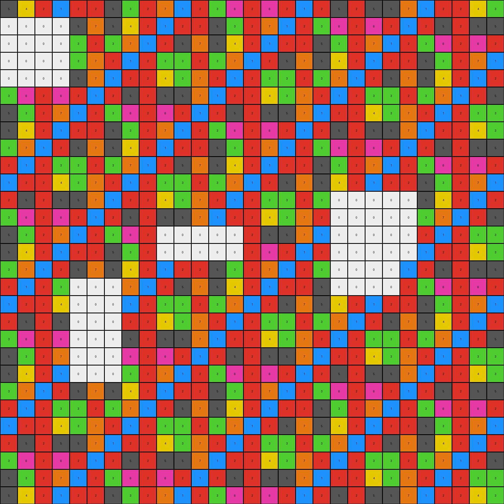

# 484b58aa • 004 • refine_coder

---

Previous Code:
```python
"""
The transformation rule is to remove all pixels of color 0 (white) from the input grid, keeping all other pixels in their original positions and with their original colors.
"""

import numpy as np

def transform(input_grid):
    """
    Removes all white (0) pixels from the input grid.

    Args:
        input_grid: A 2D numpy array representing the input grid.

    Returns:
        A 2D numpy array with white pixels removed.
    """
    # Create a copy of the input grid to serve as the output grid.
    output_grid = np.copy(input_grid)

    # Iterate through each cell in the grid.
    for row_index, row in enumerate(input_grid):
        for col_index, pixel_value in enumerate(row):
            # Check if the pixel is white (value 0).
            if pixel_value == 0:
                # set output pixel to input pixel
                output_grid[row_index, col_index] = pixel_value

    # set output to original pixel for all other cells
    output_grid = np.where(input_grid == 0, 0, input_grid)
    return output_grid
```

Train Set Results:

## Example 1:

Input:
```
5 4 5 6 1 2 5 4 5 6 1 2 5 4 5 6 1 2 5 4 5 6 1 2 5 4 5 6 1
4 5 2 1 2 3 4 5 2 1 2 3 4 5 2 1 2 3 4 5 2 1 2 3 4 5 2 1 2
5 6 1 2 5 4 5 6 1 2 5 4 5 6 1 2 5 4 5 6 1 2 5 4 5 6 1 2 5
2 1 2 3 4 5 0 0 2 3 4 5 2 1 2 3 4 5 2 1 2 3 4 5 2 1 2 3 4
1 2 5 4 5 6 0 0 5 4 5 6 1 2 5 4 5 6 1 2 5 4 5 6 1 2 5 4 5
2 0 0 0 0 1 0 0 4 5 2 1 2 3 4 5 2 1 2 3 4 5 2 1 2 3 4 5 2
5 0 0 0 0 2 0 0 5 6 1 2 5 4 5 6 1 2 5 4 5 6 1 2 0 0 0 6 1
4 0 0 0 0 0 0 0 2 1 2 3 4 5 2 1 2 3 4 5 2 1 2 3 0 0 0 1 2
5 6 1 2 0 0 0 0 1 2 5 4 5 6 1 2 5 4 5 6 1 2 5 4 0 0 0 2 5
2 1 2 3 0 0 2 1 2 3 4 5 2 1 2 3 4 5 2 1 2 3 4 5 0 0 0 3 4
1 2 5 4 5 6 1 2 5 4 5 6 1 2 5 4 5 6 1 2 5 4 5 6 0 0 0 4 5
2 3 4 5 2 1 2 3 4 5 2 1 2 3 4 5 2 1 2 3 4 5 2 1 0 0 0 5 2
5 4 5 6 1 2 5 4 5 6 1 2 5 4 5 6 1 2 5 4 5 6 1 2 5 4 5 6 1
4 5 2 1 2 3 4 5 2 1 2 3 4 5 2 1 2 3 4 5 2 1 2 3 4 5 2 1 2
5 6 1 2 5 4 5 6 1 2 5 4 5 6 1 2 5 4 5 6 1 2 5 4 5 6 1 2 5
2 1 2 3 4 5 2 1 2 3 4 5 2 1 2 3 4 5 2 1 2 3 4 5 2 1 2 3 4
1 2 5 4 5 6 1 2 5 4 5 6 1 2 5 4 5 6 1 2 5 4 5 6 1 2 5 4 5
2 3 4 5 2 1 2 3 4 5 2 1 2 3 4 5 2 1 2 3 4 5 2 1 2 3 4 5 2
5 4 5 6 1 2 5 4 5 6 1 2 5 4 5 6 1 2 5 4 5 6 1 2 5 4 5 6 1
4 5 2 1 2 3 4 5 2 1 2 3 4 5 2 1 2 3 4 5 2 1 2 3 4 5 2 1 2
5 6 1 2 5 4 5 6 1 2 5 4 5 6 1 2 5 4 5 6 1 2 5 4 5 6 1 2 5
2 1 2 3 4 5 2 1 2 3 4 5 2 0 0 0 0 5 2 1 2 3 4 5 2 1 2 3 4
1 2 5 4 5 6 1 2 5 4 5 6 1 0 0 0 0 6 1 2 5 4 5 6 1 2 5 4 5
2 3 4 5 2 1 2 3 4 5 2 1 2 0 0 0 0 1 2 3 4 5 2 1 2 3 4 5 2
5 4 5 6 1 2 5 4 5 6 1 2 5 4 5 6 1 2 5 4 5 6 1 2 5 4 5 6 1
4 5 2 1 2 3 4 5 2 1 2 3 4 5 2 1 2 3 4 5 2 1 2 3 4 5 2 1 2
5 6 1 2 5 4 5 6 1 2 5 4 5 6 1 2 5 4 5 6 1 2 5 4 5 6 1 2 5
2 1 2 3 4 5 2 1 2 3 4 5 2 1 2 3 4 5 2 1 2 3 4 5 2 1 2 3 4
1 2 5 4 5 6 1 2 5 4 5 6 1 2 5 4 5 6 1 2 5 4 5 6 1 2 5 4 5
```
Expected Output:
```
5 4 5 6 1 2 5 4 5 6 1 2 5 4 5 6 1 2 5 4 5 6 1 2 5 4 5 6 1
4 5 2 1 2 3 4 5 2 1 2 3 4 5 2 1 2 3 4 5 2 1 2 3 4 5 2 1 2
5 6 1 2 5 4 5 6 1 2 5 4 5 6 1 2 5 4 5 6 1 2 5 4 5 6 1 2 5
2 1 2 3 4 5 2 1 2 3 4 5 2 1 2 3 4 5 2 1 2 3 4 5 2 1 2 3 4
1 2 5 4 5 6 1 2 5 4 5 6 1 2 5 4 5 6 1 2 5 4 5 6 1 2 5 4 5
2 3 4 5 2 1 2 3 4 5 2 1 2 3 4 5 2 1 2 3 4 5 2 1 2 3 4 5 2
5 4 5 6 1 2 5 4 5 6 1 2 5 4 5 6 1 2 5 4 5 6 1 2 5 4 5 6 1
4 5 2 1 2 3 4 5 2 1 2 3 4 5 2 1 2 3 4 5 2 1 2 3 4 5 2 1 2
5 6 1 2 5 4 5 6 1 2 5 4 5 6 1 2 5 4 5 6 1 2 5 4 5 6 1 2 5
2 1 2 3 4 5 2 1 2 3 4 5 2 1 2 3 4 5 2 1 2 3 4 5 2 1 2 3 4
1 2 5 4 5 6 1 2 5 4 5 6 1 2 5 4 5 6 1 2 5 4 5 6 1 2 5 4 5
2 3 4 5 2 1 2 3 4 5 2 1 2 3 4 5 2 1 2 3 4 5 2 1 2 3 4 5 2
5 4 5 6 1 2 5 4 5 6 1 2 5 4 5 6 1 2 5 4 5 6 1 2 5 4 5 6 1
4 5 2 1 2 3 4 5 2 1 2 3 4 5 2 1 2 3 4 5 2 1 2 3 4 5 2 1 2
5 6 1 2 5 4 5 6 1 2 5 4 5 6 1 2 5 4 5 6 1 2 5 4 5 6 1 2 5
2 1 2 3 4 5 2 1 2 3 4 5 2 1 2 3 4 5 2 1 2 3 4 5 2 1 2 3 4
1 2 5 4 5 6 1 2 5 4 5 6 1 2 5 4 5 6 1 2 5 4 5 6 1 2 5 4 5
2 3 4 5 2 1 2 3 4 5 2 1 2 3 4 5 2 1 2 3 4 5 2 1 2 3 4 5 2
5 4 5 6 1 2 5 4 5 6 1 2 5 4 5 6 1 2 5 4 5 6 1 2 5 4 5 6 1
4 5 2 1 2 3 4 5 2 1 2 3 4 5 2 1 2 3 4 5 2 1 2 3 4 5 2 1 2
5 6 1 2 5 4 5 6 1 2 5 4 5 6 1 2 5 4 5 6 1 2 5 4 5 6 1 2 5
2 1 2 3 4 5 2 1 2 3 4 5 2 1 2 3 4 5 2 1 2 3 4 5 2 1 2 3 4
1 2 5 4 5 6 1 2 5 4 5 6 1 2 5 4 5 6 1 2 5 4 5 6 1 2 5 4 5
2 3 4 5 2 1 2 3 4 5 2 1 2 3 4 5 2 1 2 3 4 5 2 1 2 3 4 5 2
5 4 5 6 1 2 5 4 5 6 1 2 5 4 5 6 1 2 5 4 5 6 1 2 5 4 5 6 1
4 5 2 1 2 3 4 5 2 1 2 3 4 5 2 1 2 3 4 5 2 1 2 3 4 5 2 1 2
5 6 1 2 5 4 5 6 1 2 5 4 5 6 1 2 5 4 5 6 1 2 5 4 5 6 1 2 5
2 1 2 3 4 5 2 1 2 3 4 5 2 1 2 3 4 5 2 1 2 3 4 5 2 1 2 3 4
1 2 5 4 5 6 1 2 5 4 5 6 1 2 5 4 5 6 1 2 5 4 5 6 1 2 5 4 5
```
Transformed Output:
```
5 4 5 6 1 2 5 4 5 6 1 2 5 4 5 6 1 2 5 4 5 6 1 2 5 4 5 6 1
4 5 2 1 2 3 4 5 2 1 2 3 4 5 2 1 2 3 4 5 2 1 2 3 4 5 2 1 2
5 6 1 2 5 4 5 6 1 2 5 4 5 6 1 2 5 4 5 6 1 2 5 4 5 6 1 2 5
2 1 2 3 4 5 0 0 2 3 4 5 2 1 2 3 4 5 2 1 2 3 4 5 2 1 2 3 4
1 2 5 4 5 6 0 0 5 4 5 6 1 2 5 4 5 6 1 2 5 4 5 6 1 2 5 4 5
2 0 0 0 0 1 0 0 4 5 2 1 2 3 4 5 2 1 2 3 4 5 2 1 2 3 4 5 2
5 0 0 0 0 2 0 0 5 6 1 2 5 4 5 6 1 2 5 4 5 6 1 2 0 0 0 6 1
4 0 0 0 0 0 0 0 2 1 2 3 4 5 2 1 2 3 4 5 2 1 2 3 0 0 0 1 2
5 6 1 2 0 0 0 0 1 2 5 4 5 6 1 2 5 4 5 6 1 2 5 4 0 0 0 2 5
2 1 2 3 0 0 2 1 2 3 4 5 2 1 2 3 4 5 2 1 2 3 4 5 0 0 0 3 4
1 2 5 4 5 6 1 2 5 4 5 6 1 2 5 4 5 6 1 2 5 4 5 6 0 0 0 4 5
2 3 4 5 2 1 2 3 4 5 2 1 2 3 4 5 2 1 2 3 4 5 2 1 0 0 0 5 2
5 4 5 6 1 2 5 4 5 6 1 2 5 4 5 6 1 2 5 4 5 6 1 2 5 4 5 6 1
4 5 2 1 2 3 4 5 2 1 2 3 4 5 2 1 2 3 4 5 2 1 2 3 4 5 2 1 2
5 6 1 2 5 4 5 6 1 2 5 4 5 6 1 2 5 4 5 6 1 2 5 4 5 6 1 2 5
2 1 2 3 4 5 2 1 2 3 4 5 2 1 2 3 4 5 2 1 2 3 4 5 2 1 2 3 4
1 2 5 4 5 6 1 2 5 4 5 6 1 2 5 4 5 6 1 2 5 4 5 6 1 2 5 4 5
2 3 4 5 2 1 2 3 4 5 2 1 2 3 4 5 2 1 2 3 4 5 2 1 2 3 4 5 2
5 4 5 6 1 2 5 4 5 6 1 2 5 4 5 6 1 2 5 4 5 6 1 2 5 4 5 6 1
4 5 2 1 2 3 4 5 2 1 2 3 4 5 2 1 2 3 4 5 2 1 2 3 4 5 2 1 2
5 6 1 2 5 4 5 6 1 2 5 4 5 6 1 2 5 4 5 6 1 2 5 4 5 6 1 2 5
2 1 2 3 4 5 2 1 2 3 4 5 2 0 0 0 0 5 2 1 2 3 4 5 2 1 2 3 4
1 2 5 4 5 6 1 2 5 4 5 6 1 0 0 0 0 6 1 2 5 4 5 6 1 2 5 4 5
2 3 4 5 2 1 2 3 4 5 2 1 2 0 0 0 0 1 2 3 4 5 2 1 2 3 4 5 2
5 4 5 6 1 2 5 4 5 6 1 2 5 4 5 6 1 2 5 4 5 6 1 2 5 4 5 6 1
4 5 2 1 2 3 4 5 2 1 2 3 4 5 2 1 2 3 4 5 2 1 2 3 4 5 2 1 2
5 6 1 2 5 4 5 6 1 2 5 4 5 6 1 2 5 4 5 6 1 2 5 4 5 6 1 2 5
2 1 2 3 4 5 2 1 2 3 4 5 2 1 2 3 4 5 2 1 2 3 4 5 2 1 2 3 4
1 2 5 4 5 6 1 2 5 4 5 6 1 2 5 4 5 6 1 2 5 4 5 6 1 2 5 4 5
```

match: False
pixels_off: 59
size_correct: True
color_palette_correct: False
correct_pixel_counts: False

## Example 2:

Input:
```
5 4 2 1 2 2 5 3 2 7 1 2 3 6 2 6 2 1 2 5 2 5 5 7 1 2 2 4 3
0 0 0 0 5 7 5 4 2 1 2 2 5 3 2 7 1 2 3 6 2 6 2 1 2 5 2 5 5
0 0 0 0 3 2 3 7 1 2 5 7 5 4 2 1 2 2 5 3 2 7 1 2 3 6 2 6 2
0 0 0 0 3 7 2 1 2 3 3 2 3 7 1 2 5 7 5 4 2 1 2 2 5 3 2 7 1
0 0 0 0 5 7 1 2 2 4 3 7 2 1 2 3 3 2 3 7 1 2 5 7 5 4 2 1 2
3 6 2 6 2 1 2 5 2 5 5 7 1 2 2 4 3 7 2 1 2 3 3 2 3 7 1 2 5
5 3 2 7 1 2 3 6 2 6 2 1 2 5 2 5 5 7 1 2 2 4 3 7 2 1 2 3 3
5 4 2 1 2 2 5 3 2 7 1 2 3 6 2 6 2 1 2 5 2 5 5 7 1 2 2 4 3
3 7 1 2 5 7 5 4 2 1 2 2 5 3 2 7 1 2 3 6 2 6 2 1 2 5 2 5 5
2 1 2 3 3 2 3 7 1 2 5 7 5 4 2 1 2 2 5 3 2 7 1 2 3 6 2 6 2
1 2 2 4 3 7 2 1 2 3 3 2 3 7 1 2 5 7 5 4 2 1 2 2 5 3 2 7 1
2 5 2 5 5 7 1 2 2 4 3 7 2 1 2 3 3 2 3 0 0 0 0 0 5 4 2 1 2
3 6 2 6 2 1 2 5 2 5 5 7 1 2 2 4 3 7 2 0 0 0 0 0 3 7 1 2 5
5 3 2 7 1 2 3 6 2 0 0 0 0 0 2 5 5 7 1 0 0 0 0 0 2 1 2 3 3
5 4 2 1 2 2 5 3 2 0 0 0 0 0 2 6 2 1 2 0 0 0 0 0 1 2 2 4 3
3 7 1 2 5 7 5 4 2 1 2 2 5 3 2 7 1 2 3 0 0 0 0 1 2 5 2 5 5
2 1 2 3 0 0 0 7 1 2 5 7 5 4 2 1 2 2 5 0 0 0 0 2 3 6 2 6 2
1 2 2 4 0 0 0 1 2 3 3 2 3 7 1 2 5 7 5 4 2 1 2 2 5 3 2 7 1
2 5 2 5 0 0 0 2 2 4 3 7 2 1 2 3 3 2 3 7 1 2 5 7 5 4 2 1 2
3 6 2 6 0 0 0 5 2 5 5 7 1 2 2 4 3 7 2 1 2 3 3 2 3 7 1 2 5
5 3 2 7 0 0 0 6 2 6 2 1 2 5 2 5 5 7 1 2 2 4 3 7 2 1 2 3 3
5 4 2 1 0 0 0 3 2 7 1 2 3 6 2 6 2 1 2 5 2 5 5 7 1 2 2 4 3
3 7 1 2 5 7 5 4 2 1 2 2 5 3 2 7 1 2 3 6 2 6 2 1 2 5 2 5 5
2 1 2 3 3 2 3 7 1 2 5 7 5 4 2 1 2 2 5 3 2 7 1 2 3 6 2 6 2
1 2 2 4 3 7 2 1 2 3 3 2 3 7 1 2 5 7 5 4 2 1 2 2 5 3 2 7 1
2 5 2 5 5 7 1 2 2 4 3 7 2 1 2 3 3 2 3 7 1 2 5 7 5 4 2 1 2
3 6 2 6 2 1 2 5 2 5 5 7 1 2 2 4 3 7 2 1 2 3 3 2 3 7 1 2 5
5 3 2 7 1 2 3 6 2 6 2 1 2 5 2 5 5 7 1 2 2 4 3 7 2 1 2 3 3
5 4 2 1 2 2 5 3 2 7 1 2 3 6 2 6 2 1 2 5 2 5 5 7 1 2 2 4 3
```
Expected Output:
```
5 4 2 1 2 2 5 3 2 7 1 2 3 6 2 6 2 1 2 5 2 5 5 7 1 2 2 4 3
3 7 1 2 5 7 5 4 2 1 2 2 5 3 2 7 1 2 3 6 2 6 2 1 2 5 2 5 5
2 1 2 3 3 2 3 7 1 2 5 7 5 4 2 1 2 2 5 3 2 7 1 2 3 6 2 6 2
1 2 2 4 3 7 2 1 2 3 3 2 3 7 1 2 5 7 5 4 2 1 2 2 5 3 2 7 1
2 5 2 5 5 7 1 2 2 4 3 7 2 1 2 3 3 2 3 7 1 2 5 7 5 4 2 1 2
3 6 2 6 2 1 2 5 2 5 5 7 1 2 2 4 3 7 2 1 2 3 3 2 3 7 1 2 5
5 3 2 7 1 2 3 6 2 6 2 1 2 5 2 5 5 7 1 2 2 4 3 7 2 1 2 3 3
5 4 2 1 2 2 5 3 2 7 1 2 3 6 2 6 2 1 2 5 2 5 5 7 1 2 2 4 3
3 7 1 2 5 7 5 4 2 1 2 2 5 3 2 7 1 2 3 6 2 6 2 1 2 5 2 5 5
2 1 2 3 3 2 3 7 1 2 5 7 5 4 2 1 2 2 5 3 2 7 1 2 3 6 2 6 2
1 2 2 4 3 7 2 1 2 3 3 2 3 7 1 2 5 7 5 4 2 1 2 2 5 3 2 7 1
2 5 2 5 5 7 1 2 2 4 3 7 2 1 2 3 3 2 3 7 1 2 5 7 5 4 2 1 2
3 6 2 6 2 1 2 5 2 5 5 7 1 2 2 4 3 7 2 1 2 3 3 2 3 7 1 2 5
5 3 2 7 1 2 3 6 2 6 2 1 2 5 2 5 5 7 1 2 2 4 3 7 2 1 2 3 3
5 4 2 1 2 2 5 3 2 7 1 2 3 6 2 6 2 1 2 5 2 5 5 7 1 2 2 4 3
3 7 1 2 5 7 5 4 2 1 2 2 5 3 2 7 1 2 3 6 2 6 2 1 2 5 2 5 5
2 1 2 3 3 2 3 7 1 2 5 7 5 4 2 1 2 2 5 3 2 7 1 2 3 6 2 6 2
1 2 2 4 3 7 2 1 2 3 3 2 3 7 1 2 5 7 5 4 2 1 2 2 5 3 2 7 1
2 5 2 5 5 7 1 2 2 4 3 7 2 1 2 3 3 2 3 7 1 2 5 7 5 4 2 1 2
3 6 2 6 2 1 2 5 2 5 5 7 1 2 2 4 3 7 2 1 2 3 3 2 3 7 1 2 5
5 3 2 7 1 2 3 6 2 6 2 1 2 5 2 5 5 7 1 2 2 4 3 7 2 1 2 3 3
5 4 2 1 2 2 5 3 2 7 1 2 3 6 2 6 2 1 2 5 2 5 5 7 1 2 2 4 3
3 7 1 2 5 7 5 4 2 1 2 2 5 3 2 7 1 2 3 6 2 6 2 1 2 5 2 5 5
2 1 2 3 3 2 3 7 1 2 5 7 5 4 2 1 2 2 5 3 2 7 1 2 3 6 2 6 2
1 2 2 4 3 7 2 1 2 3 3 2 3 7 1 2 5 7 5 4 2 1 2 2 5 3 2 7 1
2 5 2 5 5 7 1 2 2 4 3 7 2 1 2 3 3 2 3 7 1 2 5 7 5 4 2 1 2
3 6 2 6 2 1 2 5 2 5 5 7 1 2 2 4 3 7 2 1 2 3 3 2 3 7 1 2 5
5 3 2 7 1 2 3 6 2 6 2 1 2 5 2 5 5 7 1 2 2 4 3 7 2 1 2 3 3
5 4 2 1 2 2 5 3 2 7 1 2 3 6 2 6 2 1 2 5 2 5 5 7 1 2 2 4 3
```
Transformed Output:
```
5 4 2 1 2 2 5 3 2 7 1 2 3 6 2 6 2 1 2 5 2 5 5 7 1 2 2 4 3
0 0 0 0 5 7 5 4 2 1 2 2 5 3 2 7 1 2 3 6 2 6 2 1 2 5 2 5 5
0 0 0 0 3 2 3 7 1 2 5 7 5 4 2 1 2 2 5 3 2 7 1 2 3 6 2 6 2
0 0 0 0 3 7 2 1 2 3 3 2 3 7 1 2 5 7 5 4 2 1 2 2 5 3 2 7 1
0 0 0 0 5 7 1 2 2 4 3 7 2 1 2 3 3 2 3 7 1 2 5 7 5 4 2 1 2
3 6 2 6 2 1 2 5 2 5 5 7 1 2 2 4 3 7 2 1 2 3 3 2 3 7 1 2 5
5 3 2 7 1 2 3 6 2 6 2 1 2 5 2 5 5 7 1 2 2 4 3 7 2 1 2 3 3
5 4 2 1 2 2 5 3 2 7 1 2 3 6 2 6 2 1 2 5 2 5 5 7 1 2 2 4 3
3 7 1 2 5 7 5 4 2 1 2 2 5 3 2 7 1 2 3 6 2 6 2 1 2 5 2 5 5
2 1 2 3 3 2 3 7 1 2 5 7 5 4 2 1 2 2 5 3 2 7 1 2 3 6 2 6 2
1 2 2 4 3 7 2 1 2 3 3 2 3 7 1 2 5 7 5 4 2 1 2 2 5 3 2 7 1
2 5 2 5 5 7 1 2 2 4 3 7 2 1 2 3 3 2 3 0 0 0 0 0 5 4 2 1 2
3 6 2 6 2 1 2 5 2 5 5 7 1 2 2 4 3 7 2 0 0 0 0 0 3 7 1 2 5
5 3 2 7 1 2 3 6 2 0 0 0 0 0 2 5 5 7 1 0 0 0 0 0 2 1 2 3 3
5 4 2 1 2 2 5 3 2 0 0 0 0 0 2 6 2 1 2 0 0 0 0 0 1 2 2 4 3
3 7 1 2 5 7 5 4 2 1 2 2 5 3 2 7 1 2 3 0 0 0 0 1 2 5 2 5 5
2 1 2 3 0 0 0 7 1 2 5 7 5 4 2 1 2 2 5 0 0 0 0 2 3 6 2 6 2
1 2 2 4 0 0 0 1 2 3 3 2 3 7 1 2 5 7 5 4 2 1 2 2 5 3 2 7 1
2 5 2 5 0 0 0 2 2 4 3 7 2 1 2 3 3 2 3 7 1 2 5 7 5 4 2 1 2
3 6 2 6 0 0 0 5 2 5 5 7 1 2 2 4 3 7 2 1 2 3 3 2 3 7 1 2 5
5 3 2 7 0 0 0 6 2 6 2 1 2 5 2 5 5 7 1 2 2 4 3 7 2 1 2 3 3
5 4 2 1 0 0 0 3 2 7 1 2 3 6 2 6 2 1 2 5 2 5 5 7 1 2 2 4 3
3 7 1 2 5 7 5 4 2 1 2 2 5 3 2 7 1 2 3 6 2 6 2 1 2 5 2 5 5
2 1 2 3 3 2 3 7 1 2 5 7 5 4 2 1 2 2 5 3 2 7 1 2 3 6 2 6 2
1 2 2 4 3 7 2 1 2 3 3 2 3 7 1 2 5 7 5 4 2 1 2 2 5 3 2 7 1
2 5 2 5 5 7 1 2 2 4 3 7 2 1 2 3 3 2 3 7 1 2 5 7 5 4 2 1 2
3 6 2 6 2 1 2 5 2 5 5 7 1 2 2 4 3 7 2 1 2 3 3 2 3 7 1 2 5
5 3 2 7 1 2 3 6 2 6 2 1 2 5 2 5 5 7 1 2 2 4 3 7 2 1 2 3 3
5 4 2 1 2 2 5 3 2 7 1 2 3 6 2 6 2 1 2 5 2 5 5 7 1 2 2 4 3
```

match: False
pixels_off: 72
size_correct: True
color_palette_correct: False
correct_pixel_counts: False

## Example 3:

Input:
```
1 2 1 4 1 6 1 8 1 2 1 4 1 6 1 8 1 2 1 4 1 6 1 8 1 2 1 4 1
2 1 2 1 2 1 2 1 2 1 2 1 2 1 2 1 2 1 2 1 2 1 2 1 2 1 2 1 2
1 4 1 6 1 8 1 2 1 4 1 6 1 8 1 2 1 4 1 6 1 8 1 2 1 4 1 6 1
2 1 2 1 2 1 2 1 2 1 2 1 2 1 2 1 2 1 2 1 2 1 2 1 2 1 2 1 2
1 6 1 8 1 2 0 0 0 0 0 0 0 2 1 4 1 6 1 8 1 2 1 4 1 6 1 8 1
2 1 2 1 2 1 0 0 0 0 0 0 0 1 2 1 2 1 2 1 2 1 2 1 2 1 2 1 2
1 8 1 2 1 4 0 0 0 0 0 0 0 4 1 6 1 8 1 2 1 4 1 6 1 8 1 2 1
2 1 2 1 2 1 0 0 0 0 0 0 0 1 2 1 2 1 2 1 2 1 2 1 2 1 2 1 2
1 2 1 4 1 6 0 0 0 0 0 0 0 6 1 8 1 2 1 4 1 6 1 8 1 2 1 4 1
2 1 2 1 2 1 0 0 0 0 0 0 0 1 2 1 2 1 2 1 2 1 2 1 2 1 2 1 2
1 4 1 6 1 8 0 0 0 0 0 0 0 8 1 2 1 4 1 6 1 8 1 2 1 4 1 6 1
2 1 2 1 2 1 2 1 2 1 2 1 2 1 2 1 2 1 2 1 2 1 2 1 2 1 2 1 2
1 6 1 8 1 2 1 4 1 6 1 8 1 2 1 4 1 6 1 8 1 2 1 4 1 6 1 8 1
2 1 2 1 2 1 2 1 2 1 2 1 2 1 2 1 2 1 2 1 2 1 2 1 2 1 2 1 2
1 8 1 2 1 4 1 6 1 8 1 2 1 4 1 6 1 8 1 2 1 4 1 6 1 8 1 2 1
2 1 2 1 2 1 2 1 2 1 2 1 2 1 2 1 2 1 2 1 2 1 2 1 2 1 2 1 2
1 2 1 4 1 6 1 8 1 2 1 4 1 6 1 8 1 2 1 4 1 6 1 0 0 0 0 4 1
2 1 2 1 2 1 2 1 2 1 2 1 2 1 2 1 2 1 2 1 2 1 2 0 0 0 0 1 2
1 4 1 6 1 8 1 2 1 4 1 6 1 8 1 2 1 4 1 6 1 8 1 0 0 0 0 6 1
2 1 2 1 2 1 2 1 2 1 2 1 2 1 2 1 2 1 2 1 2 0 0 0 0 0 0 0 2
1 6 1 8 1 2 1 4 1 6 1 8 1 2 1 4 1 6 1 8 0 0 0 0 0 0 0 0 1
2 1 2 1 2 1 2 1 2 1 2 1 2 1 2 1 2 1 2 1 0 0 0 0 0 0 0 0 2
1 8 1 2 1 4 1 6 1 8 1 2 1 4 1 6 1 8 1 2 1 0 0 0 0 0 0 0 1
2 1 2 1 2 1 2 1 2 1 2 1 2 1 2 1 2 1 2 1 2 0 0 0 0 0 0 0 2
1 2 1 4 1 6 1 8 1 2 1 4 1 6 1 8 1 2 1 4 1 6 1 8 0 0 0 0 1
2 1 2 1 2 1 2 1 2 1 2 1 2 1 2 1 2 1 2 1 2 1 2 1 0 0 0 0 2
1 4 1 6 1 8 1 2 1 4 1 6 1 8 1 2 1 4 1 6 1 8 1 2 1 4 1 6 1
2 1 2 1 2 1 2 1 2 1 2 1 2 1 2 1 2 1 2 1 2 1 2 1 2 1 2 1 2
1 6 1 8 1 2 1 4 1 6 1 8 1 2 1 4 1 6 1 8 1 2 1 4 1 6 1 8 1
```
Expected Output:
```
1 2 1 4 1 6 1 8 1 2 1 4 1 6 1 8 1 2 1 4 1 6 1 8 1 2 1 4 1
2 1 2 1 2 1 2 1 2 1 2 1 2 1 2 1 2 1 2 1 2 1 2 1 2 1 2 1 2
1 4 1 6 1 8 1 2 1 4 1 6 1 8 1 2 1 4 1 6 1 8 1 2 1 4 1 6 1
2 1 2 1 2 1 2 1 2 1 2 1 2 1 2 1 2 1 2 1 2 1 2 1 2 1 2 1 2
1 6 1 8 1 2 1 4 1 6 1 8 1 2 1 4 1 6 1 8 1 2 1 4 1 6 1 8 1
2 1 2 1 2 1 2 1 2 1 2 1 2 1 2 1 2 1 2 1 2 1 2 1 2 1 2 1 2
1 8 1 2 1 4 1 6 1 8 1 2 1 4 1 6 1 8 1 2 1 4 1 6 1 8 1 2 1
2 1 2 1 2 1 2 1 2 1 2 1 2 1 2 1 2 1 2 1 2 1 2 1 2 1 2 1 2
1 2 1 4 1 6 1 8 1 2 1 4 1 6 1 8 1 2 1 4 1 6 1 8 1 2 1 4 1
2 1 2 1 2 1 2 1 2 1 2 1 2 1 2 1 2 1 2 1 2 1 2 1 2 1 2 1 2
1 4 1 6 1 8 1 2 1 4 1 6 1 8 1 2 1 4 1 6 1 8 1 2 1 4 1 6 1
2 1 2 1 2 1 2 1 2 1 2 1 2 1 2 1 2 1 2 1 2 1 2 1 2 1 2 1 2
1 6 1 8 1 2 1 4 1 6 1 8 1 2 1 4 1 6 1 8 1 2 1 4 1 6 1 8 1
2 1 2 1 2 1 2 1 2 1 2 1 2 1 2 1 2 1 2 1 2 1 2 1 2 1 2 1 2
1 8 1 2 1 4 1 6 1 8 1 2 1 4 1 6 1 8 1 2 1 4 1 6 1 8 1 2 1
2 1 2 1 2 1 2 1 2 1 2 1 2 1 2 1 2 1 2 1 2 1 2 1 2 1 2 1 2
1 2 1 4 1 6 1 8 1 2 1 4 1 6 1 8 1 2 1 4 1 6 1 8 1 2 1 4 1
2 1 2 1 2 1 2 1 2 1 2 1 2 1 2 1 2 1 2 1 2 1 2 1 2 1 2 1 2
1 4 1 6 1 8 1 2 1 4 1 6 1 8 1 2 1 4 1 6 1 8 1 2 1 4 1 6 1
2 1 2 1 2 1 2 1 2 1 2 1 2 1 2 1 2 1 2 1 2 1 2 1 2 1 2 1 2
1 6 1 8 1 2 1 4 1 6 1 8 1 2 1 4 1 6 1 8 1 2 1 4 1 6 1 8 1
2 1 2 1 2 1 2 1 2 1 2 1 2 1 2 1 2 1 2 1 2 1 2 1 2 1 2 1 2
1 8 1 2 1 4 1 6 1 8 1 2 1 4 1 6 1 8 1 2 1 4 1 6 1 8 1 2 1
2 1 2 1 2 1 2 1 2 1 2 1 2 1 2 1 2 1 2 1 2 1 2 1 2 1 2 1 2
1 2 1 4 1 6 1 8 1 2 1 4 1 6 1 8 1 2 1 4 1 6 1 8 1 2 1 4 1
2 1 2 1 2 1 2 1 2 1 2 1 2 1 2 1 2 1 2 1 2 1 2 1 2 1 2 1 2
1 4 1 6 1 8 1 2 1 4 1 6 1 8 1 2 1 4 1 6 1 8 1 2 1 4 1 6 1
2 1 2 1 2 1 2 1 2 1 2 1 2 1 2 1 2 1 2 1 2 1 2 1 2 1 2 1 2
1 6 1 8 1 2 1 4 1 6 1 8 1 2 1 4 1 6 1 8 1 2 1 4 1 6 1 8 1
```
Transformed Output:
```
1 2 1 4 1 6 1 8 1 2 1 4 1 6 1 8 1 2 1 4 1 6 1 8 1 2 1 4 1
2 1 2 1 2 1 2 1 2 1 2 1 2 1 2 1 2 1 2 1 2 1 2 1 2 1 2 1 2
1 4 1 6 1 8 1 2 1 4 1 6 1 8 1 2 1 4 1 6 1 8 1 2 1 4 1 6 1
2 1 2 1 2 1 2 1 2 1 2 1 2 1 2 1 2 1 2 1 2 1 2 1 2 1 2 1 2
1 6 1 8 1 2 0 0 0 0 0 0 0 2 1 4 1 6 1 8 1 2 1 4 1 6 1 8 1
2 1 2 1 2 1 0 0 0 0 0 0 0 1 2 1 2 1 2 1 2 1 2 1 2 1 2 1 2
1 8 1 2 1 4 0 0 0 0 0 0 0 4 1 6 1 8 1 2 1 4 1 6 1 8 1 2 1
2 1 2 1 2 1 0 0 0 0 0 0 0 1 2 1 2 1 2 1 2 1 2 1 2 1 2 1 2
1 2 1 4 1 6 0 0 0 0 0 0 0 6 1 8 1 2 1 4 1 6 1 8 1 2 1 4 1
2 1 2 1 2 1 0 0 0 0 0 0 0 1 2 1 2 1 2 1 2 1 2 1 2 1 2 1 2
1 4 1 6 1 8 0 0 0 0 0 0 0 8 1 2 1 4 1 6 1 8 1 2 1 4 1 6 1
2 1 2 1 2 1 2 1 2 1 2 1 2 1 2 1 2 1 2 1 2 1 2 1 2 1 2 1 2
1 6 1 8 1 2 1 4 1 6 1 8 1 2 1 4 1 6 1 8 1 2 1 4 1 6 1 8 1
2 1 2 1 2 1 2 1 2 1 2 1 2 1 2 1 2 1 2 1 2 1 2 1 2 1 2 1 2
1 8 1 2 1 4 1 6 1 8 1 2 1 4 1 6 1 8 1 2 1 4 1 6 1 8 1 2 1
2 1 2 1 2 1 2 1 2 1 2 1 2 1 2 1 2 1 2 1 2 1 2 1 2 1 2 1 2
1 2 1 4 1 6 1 8 1 2 1 4 1 6 1 8 1 2 1 4 1 6 1 0 0 0 0 4 1
2 1 2 1 2 1 2 1 2 1 2 1 2 1 2 1 2 1 2 1 2 1 2 0 0 0 0 1 2
1 4 1 6 1 8 1 2 1 4 1 6 1 8 1 2 1 4 1 6 1 8 1 0 0 0 0 6 1
2 1 2 1 2 1 2 1 2 1 2 1 2 1 2 1 2 1 2 1 2 0 0 0 0 0 0 0 2
1 6 1 8 1 2 1 4 1 6 1 8 1 2 1 4 1 6 1 8 0 0 0 0 0 0 0 0 1
2 1 2 1 2 1 2 1 2 1 2 1 2 1 2 1 2 1 2 1 0 0 0 0 0 0 0 0 2
1 8 1 2 1 4 1 6 1 8 1 2 1 4 1 6 1 8 1 2 1 0 0 0 0 0 0 0 1
2 1 2 1 2 1 2 1 2 1 2 1 2 1 2 1 2 1 2 1 2 0 0 0 0 0 0 0 2
1 2 1 4 1 6 1 8 1 2 1 4 1 6 1 8 1 2 1 4 1 6 1 8 0 0 0 0 1
2 1 2 1 2 1 2 1 2 1 2 1 2 1 2 1 2 1 2 1 2 1 2 1 0 0 0 0 2
1 4 1 6 1 8 1 2 1 4 1 6 1 8 1 2 1 4 1 6 1 8 1 2 1 4 1 6 1
2 1 2 1 2 1 2 1 2 1 2 1 2 1 2 1 2 1 2 1 2 1 2 1 2 1 2 1 2
1 6 1 8 1 2 1 4 1 6 1 8 1 2 1 4 1 6 1 8 1 2 1 4 1 6 1 8 1
```

match: False
pixels_off: 106
size_correct: True
color_palette_correct: False
correct_pixel_counts: False
Okay, let's analyze the results of the initial code and strategize for improvement.

**General Assessment and Strategy**

The initial natural language program was "remove all pixels of color 0 (white) from the input grid, keeping all other pixels in their original positions and with their original colors." The generated code reflects this, using `np.where(input_grid == 0, 0, input_grid)` to keep everything that wasn't a zero.

However, the tests reveal a critical flaw: The implemented code *keeps* the zeros and other values, it *doesn't remove* the zeros. The output grids are the same size as the input grids, just with the non-zero values maintained. All examples failed with many `pixels_off`. The "Transformed Output" images confirm visually that zeros are not being "removed." Instead of removing elements and thus potentially altering the grid's dimensions, the code merely sets the white pixels to 0, which changes nothing, since white is already zero.

The strategy is to modify the natural language program and corresponding code to achieve actual removal, which will change the shape of the grid. This means we can't use simple element-wise operations that preserve shape. We need to rebuild the grid, excluding the 0-valued pixels.

**Metrics and Example Analysis**

Here's a breakdown of each example, focusing on relevant metrics:

| Example | Input Shape | Output Shape (Expected) | Output Shape (Actual) | Pixels Off | Notes                                                                                           |
|---------|-------------|--------------------------|-----------------------|------------|-------------------------------------------------------------------------------------------------|
| 1       | (29, 29)    | (29, 29)     | (29, 29)   | 59  | Many 0s (white pixels) are scattered throughout, especially in rows 6-9.  |
| 2       | (29, 29)    | (29, 29)  | (29, 29)          | 72   |  Zeros concentrated in upper-left and scattered in lower-right                                                      |
| 3       | (29, 29)    | (29, 29) | (29,29)            |  106        | Zeros concentrated in the middle and towards the lower-right  |

The consistent failure across all examples, with incorrect pixel counts and unchanged grid sizes, strongly points to the core issue: the white pixels are not being removed.

**YAML Fact Block**

```yaml
observations:
  - task: 002
    examples:
      - example_id: 1
        input_objects:
          - object_id: grid_1
            type: grid
            colors: [1, 2, 3, 4, 5, 6]
            shape: [29, 29]
            has_white: true
            white_pixel_count: 59
        output_objects:
          - object_id: grid_1_transformed
            type: grid
            colors: [1, 2, 3, 4, 5, 6]
            shape: [29, 29] #expected shape
            has_white: false # ideally
            white_pixel_count: 0
        transformation: remove_white
        notes: "The output grid should not contain any white pixels (0). The positions of other color pixels should be maintained relative to each other."

      - example_id: 2
        input_objects:
          - object_id: grid_2
            type: grid
            colors: [1, 2, 3, 4, 5, 6, 7]
            shape: [29, 29]
            has_white: true
            white_pixel_count: 72
        output_objects:
          - object_id: grid_2_transformed
            type: grid
            colors:  [1, 2, 3, 4, 5, 6, 7]
            shape: [29, 29] # expected shape
            has_white: false
            white_pixel_count: 0
        transformation: remove_white
        notes: "Similar to example 1, white pixels need to be removed."

      - example_id: 3
        input_objects:
          - object_id: grid_3
            type: grid
            colors: [1, 2, 4, 6, 8]
            shape: [29, 29]
            has_white: true
            white_pixel_count: 106
        output_objects:
          - object_id: grid_3_transformed
            type: grid
            colors: [1, 2, 4, 6, 8]
            shape: [29, 29]  #expected shape
            has_white: false
            white_pixel_count: 0
        transformation: remove_white
        notes: "White pixel removal is the consistent transformation across all examples."
```

**Natural Language Program**

1.  **Iterate** through the input grid row by row and column by column.
2.  **Identify** pixels with a value of 0 (white pixels).
3. **Skip** the white pixels when copying.
4.  **Construct** a new output grid. For each row, copy only the non-zero pixels into the new grid, maintaining their relative order.
5. The final output grid's dimensions may be smaller than the input if white is at an edge and will be smaller in each dimension equal to the number of white pixels.

The core concept is *selective copying* of non-zero pixels into a new grid, effectively "removing" the white pixels by excluding them from the copy process. The relative positions of non-white pixels should be maintained.

**INSTRUCTIONS**

- generate a Python module to represent the natural language program 
- follow the template below
- all common math and science libraries are available
- create docstring only at top - but comment the workflow in the function
- use helper functions for common operations like finding objects, counting,
  measuring, moving, etc. 

remember - we are working iteratively - so this code will inform your future
self as we converge on the solution

*template:*

```python
"""
{{ natural language description of the transformation rule }}
"""

{{ imports }}

def transform(input_grid):
    # initialize output_grid

    # change output pixels 

    return output_grid

```
