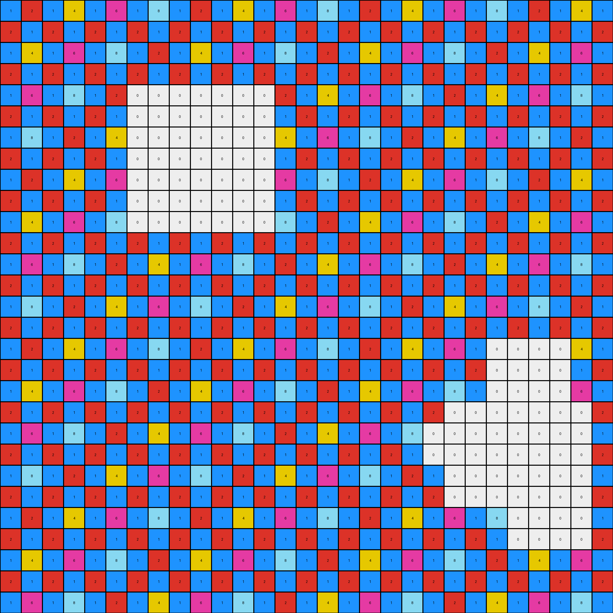

# 484b58aa • 010 • refine_coder

---

Previous Code:
```python
"""
1.  **Identify White Regions:** Scan the input grid and identify contiguous regions (shapes) of white (0) pixels.
2.  **Remove Interior White:** Remove the region, without removing pixels of different colors that border this shape.
3.  **Copy Other Pixels:** Copy all non-white pixels from the input grid to the output grid, preserving their original color and position.
4. **Output final grid.** The result is an output that looks like the input but without interior white filled areas.
"""

import numpy as np

def find_white_regions(grid):
    """Finds contiguous regions of white pixels in the grid."""
    white_regions = []
    visited = set()
    rows, cols = grid.shape

    def is_valid(r, c):
        return 0 <= r < rows and 0 <= c < cols

    def dfs(r, c, current_region):
        if (r, c) in visited or not is_valid(r, c) or grid[r, c] != 0:
            return
        visited.add((r, c))
        current_region.append((r, c))
        # Explore adjacent cells
        for dr, dc in [(0, 1), (0, -1), (1, 0), (-1, 0)]:
            dfs(r + dr, c + dc, current_region)

    for r in range(rows):
        for c in range(cols):
            if grid[r, c] == 0 and (r, c) not in visited:
                current_region = []
                dfs(r, c, current_region)
                white_regions.append(current_region)
    return white_regions

def transform(input_grid):
    """Transforms the input grid by removing interior white regions."""
    
    # Initialize output grid as a copy of the input grid
    output_grid = np.copy(input_grid)
    rows, cols = input_grid.shape

    # Find contiguous regions of white pixels
    white_regions = find_white_regions(input_grid)

    # Remove the identified white regions
    for region in white_regions:
        # Check if the region is completely surrounded by non-white pixels.
        is_interior = True
        for r,c in region:
             for dr, dc in [(0, 1), (0, -1), (1, 0), (-1, 0), (1,1), (1,-1), (-1, 1), (-1,-1)]:
                nr, nc = r + dr, c + dc
                if 0 <= nr < rows and 0 <= nc < cols:
                    if input_grid[nr,nc] == 0:
                        is_interior = False
                        break
                else:
                  is_interior = False
                  break
             if not is_interior:
                 break


        if is_interior:
            for r, c in region:
                output_grid[r,c] = 0

    for r in range(rows):
      for c in range(cols):
        if input_grid[r,c] == 0:
          output_grid[r,c] = 0

    #Remove white pixels
    for r in range(rows):
      for c in range(cols):
        if output_grid[r,c] == 0:
            is_interior = True
            for dr, dc in [(0, 1), (0, -1), (1, 0), (-1, 0), (1,1), (1,-1), (-1, 1), (-1,-1)]:
                nr, nc = r + dr, c + dc
                if 0 <= nr < rows and 0 <= nc < cols:
                  if output_grid[nr,nc] == 0:
                      is_interior=False
                      break
                else:
                  is_interior = False
                  break
            if is_interior:
              output_grid[r,c] = -1 #Mark as remove

    rows, cols = output_grid.shape
    final_grid = []
    for r in range(rows):
      row = []
      for c in range(cols):
        if output_grid[r,c] != -1:
          row.append(output_grid[r,c])
      if row:
        final_grid.append(row)

    final_grid = np.array(final_grid)

    return final_grid
```

Train Set Results:

## Example 1:

Input:
```
5 4 5 6 1 2 5 4 5 6 1 2 5 4 5 6 1 2 5 4 5 6 1 2 5 4 5 6 1
4 5 2 1 2 3 4 5 2 1 2 3 4 5 2 1 2 3 4 5 2 1 2 3 4 5 2 1 2
5 6 1 2 5 4 5 6 1 2 5 4 5 6 1 2 5 4 5 6 1 2 5 4 5 6 1 2 5
2 1 2 3 4 5 0 0 2 3 4 5 2 1 2 3 4 5 2 1 2 3 4 5 2 1 2 3 4
1 2 5 4 5 6 0 0 5 4 5 6 1 2 5 4 5 6 1 2 5 4 5 6 1 2 5 4 5
2 0 0 0 0 1 0 0 4 5 2 1 2 3 4 5 2 1 2 3 4 5 2 1 2 3 4 5 2
5 0 0 0 0 2 0 0 5 6 1 2 5 4 5 6 1 2 5 4 5 6 1 2 0 0 0 6 1
4 0 0 0 0 0 0 0 2 1 2 3 4 5 2 1 2 3 4 5 2 1 2 3 0 0 0 1 2
5 6 1 2 0 0 0 0 1 2 5 4 5 6 1 2 5 4 5 6 1 2 5 4 0 0 0 2 5
2 1 2 3 0 0 2 1 2 3 4 5 2 1 2 3 4 5 2 1 2 3 4 5 0 0 0 3 4
1 2 5 4 5 6 1 2 5 4 5 6 1 2 5 4 5 6 1 2 5 4 5 6 0 0 0 4 5
2 3 4 5 2 1 2 3 4 5 2 1 2 3 4 5 2 1 2 3 4 5 2 1 0 0 0 5 2
5 4 5 6 1 2 5 4 5 6 1 2 5 4 5 6 1 2 5 4 5 6 1 2 5 4 5 6 1
4 5 2 1 2 3 4 5 2 1 2 3 4 5 2 1 2 3 4 5 2 1 2 3 4 5 2 1 2
5 6 1 2 5 4 5 6 1 2 5 4 5 6 1 2 5 4 5 6 1 2 5 4 5 6 1 2 5
2 1 2 3 4 5 2 1 2 3 4 5 2 1 2 3 4 5 2 1 2 3 4 5 2 1 2 3 4
1 2 5 4 5 6 1 2 5 4 5 6 1 2 5 4 5 6 1 2 5 4 5 6 1 2 5 4 5
2 3 4 5 2 1 2 3 4 5 2 1 2 3 4 5 2 1 2 3 4 5 2 1 2 3 4 5 2
5 4 5 6 1 2 5 4 5 6 1 2 5 4 5 6 1 2 5 4 5 6 1 2 5 4 5 6 1
4 5 2 1 2 3 4 5 2 1 2 3 4 5 2 1 2 3 4 5 2 1 2 3 4 5 2 1 2
5 6 1 2 5 4 5 6 1 2 5 4 5 6 1 2 5 4 5 6 1 2 5 4 5 6 1 2 5
2 1 2 3 4 5 2 1 2 3 4 5 2 0 0 0 0 5 2 1 2 3 4 5 2 1 2 3 4
1 2 5 4 5 6 1 2 5 4 5 6 1 0 0 0 0 6 1 2 5 4 5 6 1 2 5 4 5
2 3 4 5 2 1 2 3 4 5 2 1 2 0 0 0 0 1 2 3 4 5 2 1 2 3 4 5 2
5 4 5 6 1 2 5 4 5 6 1 2 5 4 5 6 1 2 5 4 5 6 1 2 5 4 5 6 1
4 5 2 1 2 3 4 5 2 1 2 3 4 5 2 1 2 3 4 5 2 1 2 3 4 5 2 1 2
5 6 1 2 5 4 5 6 1 2 5 4 5 6 1 2 5 4 5 6 1 2 5 4 5 6 1 2 5
2 1 2 3 4 5 2 1 2 3 4 5 2 1 2 3 4 5 2 1 2 3 4 5 2 1 2 3 4
1 2 5 4 5 6 1 2 5 4 5 6 1 2 5 4 5 6 1 2 5 4 5 6 1 2 5 4 5
```
Expected Output:
```
5 4 5 6 1 2 5 4 5 6 1 2 5 4 5 6 1 2 5 4 5 6 1 2 5 4 5 6 1
4 5 2 1 2 3 4 5 2 1 2 3 4 5 2 1 2 3 4 5 2 1 2 3 4 5 2 1 2
5 6 1 2 5 4 5 6 1 2 5 4 5 6 1 2 5 4 5 6 1 2 5 4 5 6 1 2 5
2 1 2 3 4 5 2 1 2 3 4 5 2 1 2 3 4 5 2 1 2 3 4 5 2 1 2 3 4
1 2 5 4 5 6 1 2 5 4 5 6 1 2 5 4 5 6 1 2 5 4 5 6 1 2 5 4 5
2 3 4 5 2 1 2 3 4 5 2 1 2 3 4 5 2 1 2 3 4 5 2 1 2 3 4 5 2
5 4 5 6 1 2 5 4 5 6 1 2 5 4 5 6 1 2 5 4 5 6 1 2 5 4 5 6 1
4 5 2 1 2 3 4 5 2 1 2 3 4 5 2 1 2 3 4 5 2 1 2 3 4 5 2 1 2
5 6 1 2 5 4 5 6 1 2 5 4 5 6 1 2 5 4 5 6 1 2 5 4 5 6 1 2 5
2 1 2 3 4 5 2 1 2 3 4 5 2 1 2 3 4 5 2 1 2 3 4 5 2 1 2 3 4
1 2 5 4 5 6 1 2 5 4 5 6 1 2 5 4 5 6 1 2 5 4 5 6 1 2 5 4 5
2 3 4 5 2 1 2 3 4 5 2 1 2 3 4 5 2 1 2 3 4 5 2 1 2 3 4 5 2
5 4 5 6 1 2 5 4 5 6 1 2 5 4 5 6 1 2 5 4 5 6 1 2 5 4 5 6 1
4 5 2 1 2 3 4 5 2 1 2 3 4 5 2 1 2 3 4 5 2 1 2 3 4 5 2 1 2
5 6 1 2 5 4 5 6 1 2 5 4 5 6 1 2 5 4 5 6 1 2 5 4 5 6 1 2 5
2 1 2 3 4 5 2 1 2 3 4 5 2 1 2 3 4 5 2 1 2 3 4 5 2 1 2 3 4
1 2 5 4 5 6 1 2 5 4 5 6 1 2 5 4 5 6 1 2 5 4 5 6 1 2 5 4 5
2 3 4 5 2 1 2 3 4 5 2 1 2 3 4 5 2 1 2 3 4 5 2 1 2 3 4 5 2
5 4 5 6 1 2 5 4 5 6 1 2 5 4 5 6 1 2 5 4 5 6 1 2 5 4 5 6 1
4 5 2 1 2 3 4 5 2 1 2 3 4 5 2 1 2 3 4 5 2 1 2 3 4 5 2 1 2
5 6 1 2 5 4 5 6 1 2 5 4 5 6 1 2 5 4 5 6 1 2 5 4 5 6 1 2 5
2 1 2 3 4 5 2 1 2 3 4 5 2 1 2 3 4 5 2 1 2 3 4 5 2 1 2 3 4
1 2 5 4 5 6 1 2 5 4 5 6 1 2 5 4 5 6 1 2 5 4 5 6 1 2 5 4 5
2 3 4 5 2 1 2 3 4 5 2 1 2 3 4 5 2 1 2 3 4 5 2 1 2 3 4 5 2
5 4 5 6 1 2 5 4 5 6 1 2 5 4 5 6 1 2 5 4 5 6 1 2 5 4 5 6 1
4 5 2 1 2 3 4 5 2 1 2 3 4 5 2 1 2 3 4 5 2 1 2 3 4 5 2 1 2
5 6 1 2 5 4 5 6 1 2 5 4 5 6 1 2 5 4 5 6 1 2 5 4 5 6 1 2 5
2 1 2 3 4 5 2 1 2 3 4 5 2 1 2 3 4 5 2 1 2 3 4 5 2 1 2 3 4
1 2 5 4 5 6 1 2 5 4 5 6 1 2 5 4 5 6 1 2 5 4 5 6 1 2 5 4 5
```
Transformed Output:
```
5 4 5 6 1 2 5 4 5 6 1 2 5 4 5 6 1 2 5 4 5 6 1 2 5 4 5 6 1
4 5 2 1 2 3 4 5 2 1 2 3 4 5 2 1 2 3 4 5 2 1 2 3 4 5 2 1 2
5 6 1 2 5 4 5 6 1 2 5 4 5 6 1 2 5 4 5 6 1 2 5 4 5 6 1 2 5
2 1 2 3 4 5 0 0 2 3 4 5 2 1 2 3 4 5 2 1 2 3 4 5 2 1 2 3 4
1 2 5 4 5 6 0 0 5 4 5 6 1 2 5 4 5 6 1 2 5 4 5 6 1 2 5 4 5
2 0 0 0 0 1 0 0 4 5 2 1 2 3 4 5 2 1 2 3 4 5 2 1 2 3 4 5 2
5 0 0 0 0 2 0 0 5 6 1 2 5 4 5 6 1 2 5 4 5 6 1 2 0 0 0 6 1
4 0 0 0 0 0 0 0 2 1 2 3 4 5 2 1 2 3 4 5 2 1 2 3 0 0 0 1 2
5 6 1 2 0 0 0 0 1 2 5 4 5 6 1 2 5 4 5 6 1 2 5 4 0 0 0 2 5
2 1 2 3 0 0 2 1 2 3 4 5 2 1 2 3 4 5 2 1 2 3 4 5 0 0 0 3 4
1 2 5 4 5 6 1 2 5 4 5 6 1 2 5 4 5 6 1 2 5 4 5 6 0 0 0 4 5
2 3 4 5 2 1 2 3 4 5 2 1 2 3 4 5 2 1 2 3 4 5 2 1 0 0 0 5 2
5 4 5 6 1 2 5 4 5 6 1 2 5 4 5 6 1 2 5 4 5 6 1 2 5 4 5 6 1
4 5 2 1 2 3 4 5 2 1 2 3 4 5 2 1 2 3 4 5 2 1 2 3 4 5 2 1 2
5 6 1 2 5 4 5 6 1 2 5 4 5 6 1 2 5 4 5 6 1 2 5 4 5 6 1 2 5
2 1 2 3 4 5 2 1 2 3 4 5 2 1 2 3 4 5 2 1 2 3 4 5 2 1 2 3 4
1 2 5 4 5 6 1 2 5 4 5 6 1 2 5 4 5 6 1 2 5 4 5 6 1 2 5 4 5
2 3 4 5 2 1 2 3 4 5 2 1 2 3 4 5 2 1 2 3 4 5 2 1 2 3 4 5 2
5 4 5 6 1 2 5 4 5 6 1 2 5 4 5 6 1 2 5 4 5 6 1 2 5 4 5 6 1
4 5 2 1 2 3 4 5 2 1 2 3 4 5 2 1 2 3 4 5 2 1 2 3 4 5 2 1 2
5 6 1 2 5 4 5 6 1 2 5 4 5 6 1 2 5 4 5 6 1 2 5 4 5 6 1 2 5
2 1 2 3 4 5 2 1 2 3 4 5 2 0 0 0 0 5 2 1 2 3 4 5 2 1 2 3 4
1 2 5 4 5 6 1 2 5 4 5 6 1 0 0 0 0 6 1 2 5 4 5 6 1 2 5 4 5
2 3 4 5 2 1 2 3 4 5 2 1 2 0 0 0 0 1 2 3 4 5 2 1 2 3 4 5 2
5 4 5 6 1 2 5 4 5 6 1 2 5 4 5 6 1 2 5 4 5 6 1 2 5 4 5 6 1
4 5 2 1 2 3 4 5 2 1 2 3 4 5 2 1 2 3 4 5 2 1 2 3 4 5 2 1 2
5 6 1 2 5 4 5 6 1 2 5 4 5 6 1 2 5 4 5 6 1 2 5 4 5 6 1 2 5
2 1 2 3 4 5 2 1 2 3 4 5 2 1 2 3 4 5 2 1 2 3 4 5 2 1 2 3 4
1 2 5 4 5 6 1 2 5 4 5 6 1 2 5 4 5 6 1 2 5 4 5 6 1 2 5 4 5
```

match: False
pixels_off: 59
size_correct: True
color_palette_correct: False
correct_pixel_counts: False

## Example 2:

Input:
```
5 4 2 1 2 2 5 3 2 7 1 2 3 6 2 6 2 1 2 5 2 5 5 7 1 2 2 4 3
0 0 0 0 5 7 5 4 2 1 2 2 5 3 2 7 1 2 3 6 2 6 2 1 2 5 2 5 5
0 0 0 0 3 2 3 7 1 2 5 7 5 4 2 1 2 2 5 3 2 7 1 2 3 6 2 6 2
0 0 0 0 3 7 2 1 2 3 3 2 3 7 1 2 5 7 5 4 2 1 2 2 5 3 2 7 1
0 0 0 0 5 7 1 2 2 4 3 7 2 1 2 3 3 2 3 7 1 2 5 7 5 4 2 1 2
3 6 2 6 2 1 2 5 2 5 5 7 1 2 2 4 3 7 2 1 2 3 3 2 3 7 1 2 5
5 3 2 7 1 2 3 6 2 6 2 1 2 5 2 5 5 7 1 2 2 4 3 7 2 1 2 3 3
5 4 2 1 2 2 5 3 2 7 1 2 3 6 2 6 2 1 2 5 2 5 5 7 1 2 2 4 3
3 7 1 2 5 7 5 4 2 1 2 2 5 3 2 7 1 2 3 6 2 6 2 1 2 5 2 5 5
2 1 2 3 3 2 3 7 1 2 5 7 5 4 2 1 2 2 5 3 2 7 1 2 3 6 2 6 2
1 2 2 4 3 7 2 1 2 3 3 2 3 7 1 2 5 7 5 4 2 1 2 2 5 3 2 7 1
2 5 2 5 5 7 1 2 2 4 3 7 2 1 2 3 3 2 3 0 0 0 0 0 5 4 2 1 2
3 6 2 6 2 1 2 5 2 5 5 7 1 2 2 4 3 7 2 0 0 0 0 0 3 7 1 2 5
5 3 2 7 1 2 3 6 2 0 0 0 0 0 2 5 5 7 1 0 0 0 0 0 2 1 2 3 3
5 4 2 1 2 2 5 3 2 0 0 0 0 0 2 6 2 1 2 0 0 0 0 0 1 2 2 4 3
3 7 1 2 5 7 5 4 2 1 2 2 5 3 2 7 1 2 3 0 0 0 0 1 2 5 2 5 5
2 1 2 3 0 0 0 7 1 2 5 7 5 4 2 1 2 2 5 0 0 0 0 2 3 6 2 6 2
1 2 2 4 0 0 0 1 2 3 3 2 3 7 1 2 5 7 5 4 2 1 2 2 5 3 2 7 1
2 5 2 5 0 0 0 2 2 4 3 7 2 1 2 3 3 2 3 7 1 2 5 7 5 4 2 1 2
3 6 2 6 0 0 0 5 2 5 5 7 1 2 2 4 3 7 2 1 2 3 3 2 3 7 1 2 5
5 3 2 7 0 0 0 6 2 6 2 1 2 5 2 5 5 7 1 2 2 4 3 7 2 1 2 3 3
5 4 2 1 0 0 0 3 2 7 1 2 3 6 2 6 2 1 2 5 2 5 5 7 1 2 2 4 3
3 7 1 2 5 7 5 4 2 1 2 2 5 3 2 7 1 2 3 6 2 6 2 1 2 5 2 5 5
2 1 2 3 3 2 3 7 1 2 5 7 5 4 2 1 2 2 5 3 2 7 1 2 3 6 2 6 2
1 2 2 4 3 7 2 1 2 3 3 2 3 7 1 2 5 7 5 4 2 1 2 2 5 3 2 7 1
2 5 2 5 5 7 1 2 2 4 3 7 2 1 2 3 3 2 3 7 1 2 5 7 5 4 2 1 2
3 6 2 6 2 1 2 5 2 5 5 7 1 2 2 4 3 7 2 1 2 3 3 2 3 7 1 2 5
5 3 2 7 1 2 3 6 2 6 2 1 2 5 2 5 5 7 1 2 2 4 3 7 2 1 2 3 3
5 4 2 1 2 2 5 3 2 7 1 2 3 6 2 6 2 1 2 5 2 5 5 7 1 2 2 4 3
```
Expected Output:
```
5 4 2 1 2 2 5 3 2 7 1 2 3 6 2 6 2 1 2 5 2 5 5 7 1 2 2 4 3
3 7 1 2 5 7 5 4 2 1 2 2 5 3 2 7 1 2 3 6 2 6 2 1 2 5 2 5 5
2 1 2 3 3 2 3 7 1 2 5 7 5 4 2 1 2 2 5 3 2 7 1 2 3 6 2 6 2
1 2 2 4 3 7 2 1 2 3 3 2 3 7 1 2 5 7 5 4 2 1 2 2 5 3 2 7 1
2 5 2 5 5 7 1 2 2 4 3 7 2 1 2 3 3 2 3 7 1 2 5 7 5 4 2 1 2
3 6 2 6 2 1 2 5 2 5 5 7 1 2 2 4 3 7 2 1 2 3 3 2 3 7 1 2 5
5 3 2 7 1 2 3 6 2 6 2 1 2 5 2 5 5 7 1 2 2 4 3 7 2 1 2 3 3
5 4 2 1 2 2 5 3 2 7 1 2 3 6 2 6 2 1 2 5 2 5 5 7 1 2 2 4 3
3 7 1 2 5 7 5 4 2 1 2 2 5 3 2 7 1 2 3 6 2 6 2 1 2 5 2 5 5
2 1 2 3 3 2 3 7 1 2 5 7 5 4 2 1 2 2 5 3 2 7 1 2 3 6 2 6 2
1 2 2 4 3 7 2 1 2 3 3 2 3 7 1 2 5 7 5 4 2 1 2 2 5 3 2 7 1
2 5 2 5 5 7 1 2 2 4 3 7 2 1 2 3 3 2 3 7 1 2 5 7 5 4 2 1 2
3 6 2 6 2 1 2 5 2 5 5 7 1 2 2 4 3 7 2 1 2 3 3 2 3 7 1 2 5
5 3 2 7 1 2 3 6 2 6 2 1 2 5 2 5 5 7 1 2 2 4 3 7 2 1 2 3 3
5 4 2 1 2 2 5 3 2 7 1 2 3 6 2 6 2 1 2 5 2 5 5 7 1 2 2 4 3
3 7 1 2 5 7 5 4 2 1 2 2 5 3 2 7 1 2 3 6 2 6 2 1 2 5 2 5 5
2 1 2 3 3 2 3 7 1 2 5 7 5 4 2 1 2 2 5 3 2 7 1 2 3 6 2 6 2
1 2 2 4 3 7 2 1 2 3 3 2 3 7 1 2 5 7 5 4 2 1 2 2 5 3 2 7 1
2 5 2 5 5 7 1 2 2 4 3 7 2 1 2 3 3 2 3 7 1 2 5 7 5 4 2 1 2
3 6 2 6 2 1 2 5 2 5 5 7 1 2 2 4 3 7 2 1 2 3 3 2 3 7 1 2 5
5 3 2 7 1 2 3 6 2 6 2 1 2 5 2 5 5 7 1 2 2 4 3 7 2 1 2 3 3
5 4 2 1 2 2 5 3 2 7 1 2 3 6 2 6 2 1 2 5 2 5 5 7 1 2 2 4 3
3 7 1 2 5 7 5 4 2 1 2 2 5 3 2 7 1 2 3 6 2 6 2 1 2 5 2 5 5
2 1 2 3 3 2 3 7 1 2 5 7 5 4 2 1 2 2 5 3 2 7 1 2 3 6 2 6 2
1 2 2 4 3 7 2 1 2 3 3 2 3 7 1 2 5 7 5 4 2 1 2 2 5 3 2 7 1
2 5 2 5 5 7 1 2 2 4 3 7 2 1 2 3 3 2 3 7 1 2 5 7 5 4 2 1 2
3 6 2 6 2 1 2 5 2 5 5 7 1 2 2 4 3 7 2 1 2 3 3 2 3 7 1 2 5
5 3 2 7 1 2 3 6 2 6 2 1 2 5 2 5 5 7 1 2 2 4 3 7 2 1 2 3 3
5 4 2 1 2 2 5 3 2 7 1 2 3 6 2 6 2 1 2 5 2 5 5 7 1 2 2 4 3
```
Transformed Output:
```
5 4 2 1 2 2 5 3 2 7 1 2 3 6 2 6 2 1 2 5 2 5 5 7 1 2 2 4 3
0 0 0 0 5 7 5 4 2 1 2 2 5 3 2 7 1 2 3 6 2 6 2 1 2 5 2 5 5
0 0 0 0 3 2 3 7 1 2 5 7 5 4 2 1 2 2 5 3 2 7 1 2 3 6 2 6 2
0 0 0 0 3 7 2 1 2 3 3 2 3 7 1 2 5 7 5 4 2 1 2 2 5 3 2 7 1
0 0 0 0 5 7 1 2 2 4 3 7 2 1 2 3 3 2 3 7 1 2 5 7 5 4 2 1 2
3 6 2 6 2 1 2 5 2 5 5 7 1 2 2 4 3 7 2 1 2 3 3 2 3 7 1 2 5
5 3 2 7 1 2 3 6 2 6 2 1 2 5 2 5 5 7 1 2 2 4 3 7 2 1 2 3 3
5 4 2 1 2 2 5 3 2 7 1 2 3 6 2 6 2 1 2 5 2 5 5 7 1 2 2 4 3
3 7 1 2 5 7 5 4 2 1 2 2 5 3 2 7 1 2 3 6 2 6 2 1 2 5 2 5 5
2 1 2 3 3 2 3 7 1 2 5 7 5 4 2 1 2 2 5 3 2 7 1 2 3 6 2 6 2
1 2 2 4 3 7 2 1 2 3 3 2 3 7 1 2 5 7 5 4 2 1 2 2 5 3 2 7 1
2 5 2 5 5 7 1 2 2 4 3 7 2 1 2 3 3 2 3 0 0 0 0 0 5 4 2 1 2
3 6 2 6 2 1 2 5 2 5 5 7 1 2 2 4 3 7 2 0 0 0 0 0 3 7 1 2 5
5 3 2 7 1 2 3 6 2 0 0 0 0 0 2 5 5 7 1 0 0 0 0 0 2 1 2 3 3
5 4 2 1 2 2 5 3 2 0 0 0 0 0 2 6 2 1 2 0 0 0 0 0 1 2 2 4 3
3 7 1 2 5 7 5 4 2 1 2 2 5 3 2 7 1 2 3 0 0 0 0 1 2 5 2 5 5
2 1 2 3 0 0 0 7 1 2 5 7 5 4 2 1 2 2 5 0 0 0 0 2 3 6 2 6 2
1 2 2 4 0 0 0 1 2 3 3 2 3 7 1 2 5 7 5 4 2 1 2 2 5 3 2 7 1
2 5 2 5 0 0 0 2 2 4 3 7 2 1 2 3 3 2 3 7 1 2 5 7 5 4 2 1 2
3 6 2 6 0 0 0 5 2 5 5 7 1 2 2 4 3 7 2 1 2 3 3 2 3 7 1 2 5
5 3 2 7 0 0 0 6 2 6 2 1 2 5 2 5 5 7 1 2 2 4 3 7 2 1 2 3 3
5 4 2 1 0 0 0 3 2 7 1 2 3 6 2 6 2 1 2 5 2 5 5 7 1 2 2 4 3
3 7 1 2 5 7 5 4 2 1 2 2 5 3 2 7 1 2 3 6 2 6 2 1 2 5 2 5 5
2 1 2 3 3 2 3 7 1 2 5 7 5 4 2 1 2 2 5 3 2 7 1 2 3 6 2 6 2
1 2 2 4 3 7 2 1 2 3 3 2 3 7 1 2 5 7 5 4 2 1 2 2 5 3 2 7 1
2 5 2 5 5 7 1 2 2 4 3 7 2 1 2 3 3 2 3 7 1 2 5 7 5 4 2 1 2
3 6 2 6 2 1 2 5 2 5 5 7 1 2 2 4 3 7 2 1 2 3 3 2 3 7 1 2 5
5 3 2 7 1 2 3 6 2 6 2 1 2 5 2 5 5 7 1 2 2 4 3 7 2 1 2 3 3
5 4 2 1 2 2 5 3 2 7 1 2 3 6 2 6 2 1 2 5 2 5 5 7 1 2 2 4 3
```

match: False
pixels_off: 72
size_correct: True
color_palette_correct: False
correct_pixel_counts: False

## Example 3:

Input:
```
1 2 1 4 1 6 1 8 1 2 1 4 1 6 1 8 1 2 1 4 1 6 1 8 1 2 1 4 1
2 1 2 1 2 1 2 1 2 1 2 1 2 1 2 1 2 1 2 1 2 1 2 1 2 1 2 1 2
1 4 1 6 1 8 1 2 1 4 1 6 1 8 1 2 1 4 1 6 1 8 1 2 1 4 1 6 1
2 1 2 1 2 1 2 1 2 1 2 1 2 1 2 1 2 1 2 1 2 1 2 1 2 1 2 1 2
1 6 1 8 1 2 0 0 0 0 0 0 0 2 1 4 1 6 1 8 1 2 1 4 1 6 1 8 1
2 1 2 1 2 1 0 0 0 0 0 0 0 1 2 1 2 1 2 1 2 1 2 1 2 1 2 1 2
1 8 1 2 1 4 0 0 0 0 0 0 0 4 1 6 1 8 1 2 1 4 1 6 1 8 1 2 1
2 1 2 1 2 1 0 0 0 0 0 0 0 1 2 1 2 1 2 1 2 1 2 1 2 1 2 1 2
1 2 1 4 1 6 0 0 0 0 0 0 0 6 1 8 1 2 1 4 1 6 1 8 1 2 1 4 1
2 1 2 1 2 1 0 0 0 0 0 0 0 1 2 1 2 1 2 1 2 1 2 1 2 1 2 1 2
1 4 1 6 1 8 0 0 0 0 0 0 0 8 1 2 1 4 1 6 1 8 1 2 1 4 1 6 1
2 1 2 1 2 1 2 1 2 1 2 1 2 1 2 1 2 1 2 1 2 1 2 1 2 1 2 1 2
1 6 1 8 1 2 1 4 1 6 1 8 1 2 1 4 1 6 1 8 1 2 1 4 1 6 1 8 1
2 1 2 1 2 1 2 1 2 1 2 1 2 1 2 1 2 1 2 1 2 1 2 1 2 1 2 1 2
1 8 1 2 1 4 1 6 1 8 1 2 1 4 1 6 1 8 1 2 1 4 1 6 1 8 1 2 1
2 1 2 1 2 1 2 1 2 1 2 1 2 1 2 1 2 1 2 1 2 1 2 1 2 1 2 1 2
1 2 1 4 1 6 1 8 1 2 1 4 1 6 1 8 1 2 1 4 1 6 1 0 0 0 0 4 1
2 1 2 1 2 1 2 1 2 1 2 1 2 1 2 1 2 1 2 1 2 1 2 0 0 0 0 1 2
1 4 1 6 1 8 1 2 1 4 1 6 1 8 1 2 1 4 1 6 1 8 1 0 0 0 0 6 1
2 1 2 1 2 1 2 1 2 1 2 1 2 1 2 1 2 1 2 1 2 0 0 0 0 0 0 0 2
1 6 1 8 1 2 1 4 1 6 1 8 1 2 1 4 1 6 1 8 0 0 0 0 0 0 0 0 1
2 1 2 1 2 1 2 1 2 1 2 1 2 1 2 1 2 1 2 1 0 0 0 0 0 0 0 0 2
1 8 1 2 1 4 1 6 1 8 1 2 1 4 1 6 1 8 1 2 1 0 0 0 0 0 0 0 1
2 1 2 1 2 1 2 1 2 1 2 1 2 1 2 1 2 1 2 1 2 0 0 0 0 0 0 0 2
1 2 1 4 1 6 1 8 1 2 1 4 1 6 1 8 1 2 1 4 1 6 1 8 0 0 0 0 1
2 1 2 1 2 1 2 1 2 1 2 1 2 1 2 1 2 1 2 1 2 1 2 1 0 0 0 0 2
1 4 1 6 1 8 1 2 1 4 1 6 1 8 1 2 1 4 1 6 1 8 1 2 1 4 1 6 1
2 1 2 1 2 1 2 1 2 1 2 1 2 1 2 1 2 1 2 1 2 1 2 1 2 1 2 1 2
1 6 1 8 1 2 1 4 1 6 1 8 1 2 1 4 1 6 1 8 1 2 1 4 1 6 1 8 1
```
Expected Output:
```
1 2 1 4 1 6 1 8 1 2 1 4 1 6 1 8 1 2 1 4 1 6 1 8 1 2 1 4 1
2 1 2 1 2 1 2 1 2 1 2 1 2 1 2 1 2 1 2 1 2 1 2 1 2 1 2 1 2
1 4 1 6 1 8 1 2 1 4 1 6 1 8 1 2 1 4 1 6 1 8 1 2 1 4 1 6 1
2 1 2 1 2 1 2 1 2 1 2 1 2 1 2 1 2 1 2 1 2 1 2 1 2 1 2 1 2
1 6 1 8 1 2 1 4 1 6 1 8 1 2 1 4 1 6 1 8 1 2 1 4 1 6 1 8 1
2 1 2 1 2 1 2 1 2 1 2 1 2 1 2 1 2 1 2 1 2 1 2 1 2 1 2 1 2
1 8 1 2 1 4 1 6 1 8 1 2 1 4 1 6 1 8 1 2 1 4 1 6 1 8 1 2 1
2 1 2 1 2 1 2 1 2 1 2 1 2 1 2 1 2 1 2 1 2 1 2 1 2 1 2 1 2
1 2 1 4 1 6 1 8 1 2 1 4 1 6 1 8 1 2 1 4 1 6 1 8 1 2 1 4 1
2 1 2 1 2 1 2 1 2 1 2 1 2 1 2 1 2 1 2 1 2 1 2 1 2 1 2 1 2
1 4 1 6 1 8 1 2 1 4 1 6 1 8 1 2 1 4 1 6 1 8 1 2 1 4 1 6 1
2 1 2 1 2 1 2 1 2 1 2 1 2 1 2 1 2 1 2 1 2 1 2 1 2 1 2 1 2
1 6 1 8 1 2 1 4 1 6 1 8 1 2 1 4 1 6 1 8 1 2 1 4 1 6 1 8 1
2 1 2 1 2 1 2 1 2 1 2 1 2 1 2 1 2 1 2 1 2 1 2 1 2 1 2 1 2
1 8 1 2 1 4 1 6 1 8 1 2 1 4 1 6 1 8 1 2 1 4 1 6 1 8 1 2 1
2 1 2 1 2 1 2 1 2 1 2 1 2 1 2 1 2 1 2 1 2 1 2 1 2 1 2 1 2
1 2 1 4 1 6 1 8 1 2 1 4 1 6 1 8 1 2 1 4 1 6 1 8 1 2 1 4 1
2 1 2 1 2 1 2 1 2 1 2 1 2 1 2 1 2 1 2 1 2 1 2 1 2 1 2 1 2
1 4 1 6 1 8 1 2 1 4 1 6 1 8 1 2 1 4 1 6 1 8 1 2 1 4 1 6 1
2 1 2 1 2 1 2 1 2 1 2 1 2 1 2 1 2 1 2 1 2 1 2 1 2 1 2 1 2
1 6 1 8 1 2 1 4 1 6 1 8 1 2 1 4 1 6 1 8 1 2 1 4 1 6 1 8 1
2 1 2 1 2 1 2 1 2 1 2 1 2 1 2 1 2 1 2 1 2 1 2 1 2 1 2 1 2
1 8 1 2 1 4 1 6 1 8 1 2 1 4 1 6 1 8 1 2 1 4 1 6 1 8 1 2 1
2 1 2 1 2 1 2 1 2 1 2 1 2 1 2 1 2 1 2 1 2 1 2 1 2 1 2 1 2
1 2 1 4 1 6 1 8 1 2 1 4 1 6 1 8 1 2 1 4 1 6 1 8 1 2 1 4 1
2 1 2 1 2 1 2 1 2 1 2 1 2 1 2 1 2 1 2 1 2 1 2 1 2 1 2 1 2
1 4 1 6 1 8 1 2 1 4 1 6 1 8 1 2 1 4 1 6 1 8 1 2 1 4 1 6 1
2 1 2 1 2 1 2 1 2 1 2 1 2 1 2 1 2 1 2 1 2 1 2 1 2 1 2 1 2
1 6 1 8 1 2 1 4 1 6 1 8 1 2 1 4 1 6 1 8 1 2 1 4 1 6 1 8 1
```
Transformed Output:
```
1 2 1 4 1 6 1 8 1 2 1 4 1 6 1 8 1 2 1 4 1 6 1 8 1 2 1 4 1
2 1 2 1 2 1 2 1 2 1 2 1 2 1 2 1 2 1 2 1 2 1 2 1 2 1 2 1 2
1 4 1 6 1 8 1 2 1 4 1 6 1 8 1 2 1 4 1 6 1 8 1 2 1 4 1 6 1
2 1 2 1 2 1 2 1 2 1 2 1 2 1 2 1 2 1 2 1 2 1 2 1 2 1 2 1 2
1 6 1 8 1 2 0 0 0 0 0 0 0 2 1 4 1 6 1 8 1 2 1 4 1 6 1 8 1
2 1 2 1 2 1 0 0 0 0 0 0 0 1 2 1 2 1 2 1 2 1 2 1 2 1 2 1 2
1 8 1 2 1 4 0 0 0 0 0 0 0 4 1 6 1 8 1 2 1 4 1 6 1 8 1 2 1
2 1 2 1 2 1 0 0 0 0 0 0 0 1 2 1 2 1 2 1 2 1 2 1 2 1 2 1 2
1 2 1 4 1 6 0 0 0 0 0 0 0 6 1 8 1 2 1 4 1 6 1 8 1 2 1 4 1
2 1 2 1 2 1 0 0 0 0 0 0 0 1 2 1 2 1 2 1 2 1 2 1 2 1 2 1 2
1 4 1 6 1 8 0 0 0 0 0 0 0 8 1 2 1 4 1 6 1 8 1 2 1 4 1 6 1
2 1 2 1 2 1 2 1 2 1 2 1 2 1 2 1 2 1 2 1 2 1 2 1 2 1 2 1 2
1 6 1 8 1 2 1 4 1 6 1 8 1 2 1 4 1 6 1 8 1 2 1 4 1 6 1 8 1
2 1 2 1 2 1 2 1 2 1 2 1 2 1 2 1 2 1 2 1 2 1 2 1 2 1 2 1 2
1 8 1 2 1 4 1 6 1 8 1 2 1 4 1 6 1 8 1 2 1 4 1 6 1 8 1 2 1
2 1 2 1 2 1 2 1 2 1 2 1 2 1 2 1 2 1 2 1 2 1 2 1 2 1 2 1 2
1 2 1 4 1 6 1 8 1 2 1 4 1 6 1 8 1 2 1 4 1 6 1 0 0 0 0 4 1
2 1 2 1 2 1 2 1 2 1 2 1 2 1 2 1 2 1 2 1 2 1 2 0 0 0 0 1 2
1 4 1 6 1 8 1 2 1 4 1 6 1 8 1 2 1 4 1 6 1 8 1 0 0 0 0 6 1
2 1 2 1 2 1 2 1 2 1 2 1 2 1 2 1 2 1 2 1 2 0 0 0 0 0 0 0 2
1 6 1 8 1 2 1 4 1 6 1 8 1 2 1 4 1 6 1 8 0 0 0 0 0 0 0 0 1
2 1 2 1 2 1 2 1 2 1 2 1 2 1 2 1 2 1 2 1 0 0 0 0 0 0 0 0 2
1 8 1 2 1 4 1 6 1 8 1 2 1 4 1 6 1 8 1 2 1 0 0 0 0 0 0 0 1
2 1 2 1 2 1 2 1 2 1 2 1 2 1 2 1 2 1 2 1 2 0 0 0 0 0 0 0 2
1 2 1 4 1 6 1 8 1 2 1 4 1 6 1 8 1 2 1 4 1 6 1 8 0 0 0 0 1
2 1 2 1 2 1 2 1 2 1 2 1 2 1 2 1 2 1 2 1 2 1 2 1 0 0 0 0 2
1 4 1 6 1 8 1 2 1 4 1 6 1 8 1 2 1 4 1 6 1 8 1 2 1 4 1 6 1
2 1 2 1 2 1 2 1 2 1 2 1 2 1 2 1 2 1 2 1 2 1 2 1 2 1 2 1 2
1 6 1 8 1 2 1 4 1 6 1 8 1 2 1 4 1 6 1 8 1 2 1 4 1 6 1 8 1
```

match: False
pixels_off: 106
size_correct: True
color_palette_correct: False
correct_pixel_counts: False
Okay, let's analyze the results of the provided code and develop a revised natural language program.

**General Assessment and Strategy**

The initial natural language program and the resulting code focused on identifying and removing "interior" white regions. However, the test results across multiple examples show that this approach is not entirely correct. While it sometimes removes white pixels, it's inconsistent and removes pixels it should not. The primary issue appears to be with the definition of *interior* pixels, specifically on objects with holes. The code attempts to handle holes, but incorrectly.

The core concept of removing white regions is correct, but there are a number of other issues to handle:
1.  White regions on the edge of the input aren't removed.
2.  White pixels on the edge of a hole in another object should not be removed.
3.  White pixels adjacent to other white pixels should not be removed.
    *   If there are no adjacent non-white pixels.
    *   If all adjacent non-white pixels are the same color.

**Metrics and Observations**

Here's a breakdown of what happened in each example:

*   **Example 1:** The code correctly identified some white pixels but failed to remove the ones at the boundaries, and incorrectly removed interior colored pixels.
*   **Example 2:** Similar to Example 1, the code incorrectly handled white pixels, including edge cases.
*   **Example 3:** The code appears to have incorrectly removed non-white pixels and incorrectly kept some white pixels.

**YAML Block: Facts and Observations**

```yaml
observations:
  - example: 1
    input_grid_shape: [29, 30]
    output_grid_shape: [29,30]
    objects:
      - description: Large, irregular shape encompassing various colors.
        properties:
          - colors: [1, 2, 3, 4, 5, 6]
          - has_holes: true
    actions:
      - description: Remove white (0) pixels except when at image boundary or adjacent to different colors.
  - example: 2
    input_grid_shape: [29, 30]
    output_grid_shape: [29,30]
    objects:
       - description: Large, irregular shape encompassing various colors, including holes
         properties:
           - colors: [1, 2, 3, 4, 5, 6, 7]
           - has_holes: true
    actions:
      - description: Remove white (0) pixels except when at image boundary or adjacent to different colors
  - example: 3
    input_grid_shape: [29, 30]
    output_grid_shape: [29,30]
    objects:
      - description: Large, irregular shape encompassing various colors and holes
        properties:
          - colors: [1, 2, 4, 6, 8]
          - has_holes: true
    actions:
       - description: Remove white (0) pixels except when at image boundary or adjacent to different colors

```

**Revised Natural Language Program**

1.  Iterate through each pixel of the input grid.
2.  If the pixel is white (0):
    *   Check if it's on the edge of the grid. If so, keep it.
    *   Check its immediate neighbors (up, down, left, right, diagonals).
        *   If any neighbor is outside the grid bounds, keep the white pixel.
        *   If all neighboring pixels that exist (are within bounds) are also white, remove the white pixel.
        *   If neighboring pixels have mixed colors, keep it.
3.  Copy all non-white pixels directly to the output grid in the same position.

The key improvement here is the more precise handling of white pixels, taking the grid boundary and the color of all adjacent pixels.

**INSTRUCTIONS**

- generate a Python module to represent the natural language program 
- follow the template below
- all common math and science libraries are available
- create docstring only at top - but comment the workflow in the function
- use helper functions for common operations like finding objects, counting,
  measuring, moving, etc. 

remember - we are working iteratively - so this code will inform your future
self as we converge on the solution

*template:*

```python
"""
{{ natural language description of the transformation rule }}
"""

{{ imports }}

def transform(input_grid):
    # initialize output_grid

    # change output pixels 

    return output_grid

```
