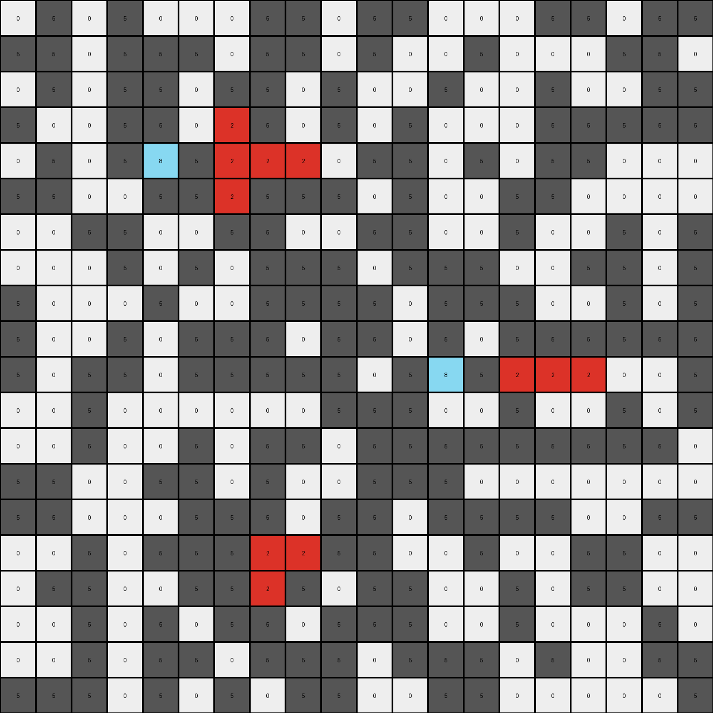

# 50846271 • 003 • refine_dreamer

---


Previous Code:
```python
"""
Identifies red (2) pixels in the input grid. Changes isolated red pixels (those not
part of a contiguous horizontal or vertical line of red pixels) to azure (8).
Other pixels remain unchanged.
"""

import numpy as np

def is_part_of_line(grid, row, col, color):
    """
    Checks if a pixel at (row, col) is part of a horizontal or vertical line
    of the specified color.
    """
    rows, cols = grid.shape
    # Check horizontal neighbors
    if (col > 0 and grid[row, col - 1] == color) or \
       (col < cols - 1 and grid[row, col + 1] == color):
        return True
    # Check vertical neighbors
    if (row > 0 and grid[row - 1, col] == color) or \
       (row < rows - 1 and grid[row + 1, col] == color):
        return True
    return False

def transform(input_grid):
    # Initialize output_grid as a copy of the input_grid
    output_grid = np.copy(input_grid)
    rows, cols = input_grid.shape

    # Iterate through each pixel of the grid
    for row in range(rows):
        for col in range(cols):
            # Check if the pixel is red (2)
            if input_grid[row, col] == 2:
                # Check if the red pixel is part of a contiguous line
                if not is_part_of_line(input_grid, row, col, 2):
                    # Change isolated red pixels to azure (8)
                    output_grid[row, col] = 8

    return output_grid
```

Train Set Results:

## Example 1:

Input:
```
0 0 0 0 0 0 0 5 0 0 5 5 5 5 5 5 0 0 5 0 0 0
0 5 0 0 5 5 5 5 0 0 5 0 5 0 5 0 0 5 0 0 5 5
5 0 5 5 0 5 5 5 0 0 5 5 2 0 0 0 0 0 0 0 5 0
5 0 0 5 5 0 0 0 5 0 0 0 2 5 5 5 0 5 5 5 0 0
0 0 0 0 0 5 0 0 0 5 0 0 2 5 5 0 0 5 0 5 5 0
0 5 0 0 5 0 0 0 5 2 5 2 5 5 5 2 5 0 5 0 0 0
0 5 5 0 5 0 0 0 0 0 5 0 2 5 0 0 5 0 0 5 5 5
0 0 0 0 0 5 0 0 0 5 5 0 2 5 0 5 5 0 5 0 0 0
5 0 0 0 0 0 5 0 5 0 0 0 2 0 0 0 0 0 0 5 0 5
5 0 0 5 0 0 0 0 0 5 5 0 5 5 0 0 0 0 0 5 0 0
0 5 0 5 0 5 5 5 5 5 0 0 0 0 5 0 5 5 5 0 5 5
0 5 5 0 0 5 0 0 5 0 5 5 0 5 5 0 5 5 0 0 5 5
0 0 5 5 0 2 5 5 5 0 0 5 0 0 0 0 0 5 5 0 0 0
5 0 5 0 0 5 5 5 0 0 0 0 0 5 0 0 5 5 0 0 0 5
0 0 2 5 5 2 2 2 2 0 0 0 5 5 0 5 0 0 5 0 5 0
0 5 5 0 0 5 5 0 5 0 0 5 0 0 5 5 5 0 0 0 0 0
5 0 0 0 5 2 0 5 5 0 5 0 0 5 0 0 5 5 5 0 0 0
0 0 5 5 0 2 5 0 0 0 5 0 0 0 5 5 0 0 0 5 5 5
0 5 5 5 0 0 0 5 5 5 5 0 0 5 5 0 5 0 0 0 5 5
0 0 0 0 0 0 0 0 0 0 0 0 0 5 0 5 0 5 0 0 0 5
```
Expected Output:
```
0 0 0 0 0 0 0 5 0 0 5 5 5 5 5 5 0 0 5 0 0 0
0 5 0 0 5 5 5 5 0 0 5 0 5 0 5 0 0 5 0 0 5 5
5 0 5 5 0 5 5 5 0 0 5 5 2 0 0 0 0 0 0 0 5 0
5 0 0 5 5 0 0 0 5 0 0 0 2 5 5 5 0 5 5 5 0 0
0 0 0 0 0 5 0 0 0 5 0 0 2 5 5 0 0 5 0 5 5 0
0 5 0 0 5 0 0 0 5 2 8 2 8 8 8 2 5 0 5 0 0 0
0 5 5 0 5 0 0 0 0 0 5 0 2 5 0 0 5 0 0 5 5 5
0 0 0 0 0 5 0 0 0 5 5 0 2 5 0 5 5 0 5 0 0 0
5 0 0 0 0 0 5 0 5 0 0 0 2 0 0 0 0 0 0 5 0 5
5 0 0 5 0 0 0 0 0 5 5 0 5 5 0 0 0 0 0 5 0 0
0 5 0 5 0 5 5 5 5 5 0 0 0 0 5 0 5 5 5 0 5 5
0 5 5 0 0 8 0 0 5 0 5 5 0 5 5 0 5 5 0 0 5 5
0 0 5 5 0 2 5 5 5 0 0 5 0 0 0 0 0 5 5 0 0 0
5 0 5 0 0 8 5 5 0 0 0 0 0 5 0 0 5 5 0 0 0 5
0 0 2 8 8 2 2 2 2 0 0 0 5 5 0 5 0 0 5 0 5 0
0 5 5 0 0 8 5 0 5 0 0 5 0 0 5 5 5 0 0 0 0 0
5 0 0 0 5 2 0 5 5 0 5 0 0 5 0 0 5 5 5 0 0 0
0 0 5 5 0 2 5 0 0 0 5 0 0 0 5 5 0 0 0 5 5 5
0 5 5 5 0 0 0 5 5 5 5 0 0 5 5 0 5 0 0 0 5 5
0 0 0 0 0 0 0 0 0 0 0 0 0 5 0 5 0 5 0 0 0 5
```
Transformed Output:
```
0 0 0 0 0 0 0 5 0 0 5 5 5 5 5 5 0 0 5 0 0 0
0 5 0 0 5 5 5 5 0 0 5 0 5 0 5 0 0 5 0 0 5 5
5 0 5 5 0 5 5 5 0 0 5 5 2 0 0 0 0 0 0 0 5 0
5 0 0 5 5 0 0 0 5 0 0 0 2 5 5 5 0 5 5 5 0 0
0 0 0 0 0 5 0 0 0 5 0 0 2 5 5 0 0 5 0 5 5 0
0 5 0 0 5 0 0 0 5 8 5 8 5 5 5 8 5 0 5 0 0 0
0 5 5 0 5 0 0 0 0 0 5 0 2 5 0 0 5 0 0 5 5 5
0 0 0 0 0 5 0 0 0 5 5 0 2 5 0 5 5 0 5 0 0 0
5 0 0 0 0 0 5 0 5 0 0 0 2 0 0 0 0 0 0 5 0 5
5 0 0 5 0 0 0 0 0 5 5 0 5 5 0 0 0 0 0 5 0 0
0 5 0 5 0 5 5 5 5 5 0 0 0 0 5 0 5 5 5 0 5 5
0 5 5 0 0 5 0 0 5 0 5 5 0 5 5 0 5 5 0 0 5 5
0 0 5 5 0 8 5 5 5 0 0 5 0 0 0 0 0 5 5 0 0 0
5 0 5 0 0 5 5 5 0 0 0 0 0 5 0 0 5 5 0 0 0 5
0 0 8 5 5 2 2 2 2 0 0 0 5 5 0 5 0 0 5 0 5 0
0 5 5 0 0 5 5 0 5 0 0 5 0 0 5 5 5 0 0 0 0 0
5 0 0 0 5 2 0 5 5 0 5 0 0 5 0 0 5 5 5 0 0 0
0 0 5 5 0 2 5 0 0 0 5 0 0 0 5 5 0 0 0 5 5 5
0 5 5 5 0 0 0 5 5 5 5 0 0 5 5 0 5 0 0 0 5 5
0 0 0 0 0 0 0 0 0 0 0 0 0 5 0 5 0 5 0 0 0 5
```

match: False
pixels_off: 14
size_correct: True
color_palette_correct: True
correct_pixel_counts: False

## Example 2:

Input:
```
0 5 0 5 0 0 0 5 5 0 5 5 0 0 0 5 5 0 5 5
5 5 0 5 5 5 0 5 5 0 5 0 0 5 0 0 0 5 5 0
0 5 0 5 5 0 5 5 0 5 0 0 5 0 0 5 0 0 5 5
5 0 0 5 5 0 2 5 0 5 0 5 0 0 0 5 5 5 5 5
0 5 0 5 2 5 2 2 2 0 5 5 0 5 0 5 5 0 0 0
5 5 0 0 5 5 2 5 5 5 0 5 0 0 5 5 0 0 0 0
0 0 5 5 0 0 5 5 0 0 5 5 0 0 5 0 0 5 0 5
0 0 0 5 0 5 0 5 5 5 0 5 5 5 0 0 5 5 0 5
5 0 0 0 5 0 0 5 5 5 5 0 5 5 5 0 0 5 0 5
5 0 0 5 0 5 5 5 0 5 5 0 5 0 5 5 5 5 5 5
5 0 5 5 0 5 5 5 5 5 0 5 2 5 2 2 2 0 0 5
0 0 5 0 0 0 0 0 0 5 5 5 0 0 5 0 0 5 0 5
0 0 5 0 0 5 0 5 5 0 5 5 5 5 5 5 5 5 5 0
5 5 0 0 5 5 0 5 0 0 5 5 5 0 0 0 0 0 0 0
5 5 0 0 0 5 5 5 0 5 5 0 5 5 5 5 0 0 5 5
0 0 5 0 5 5 5 2 2 5 5 0 0 5 0 0 5 5 0 0
0 5 5 0 0 5 5 2 5 0 5 5 0 0 5 0 5 5 0 0
0 0 5 0 5 0 5 5 0 5 5 5 0 0 5 0 0 0 5 0
0 0 5 0 5 5 0 5 5 5 0 5 5 5 0 5 0 0 5 5
5 5 5 0 5 0 5 0 5 5 0 0 5 5 0 0 0 0 0 5
```
Expected Output:
```
0 5 0 5 0 0 0 5 5 0 5 5 0 0 0 5 5 0 5 5
5 5 0 5 5 5 0 5 5 0 5 0 0 5 0 0 0 5 5 0
0 5 0 5 5 0 8 5 0 5 0 0 5 0 0 5 0 0 5 5
5 0 0 5 5 0 2 5 0 5 0 5 0 0 0 5 5 5 5 5
0 5 0 5 2 8 2 2 2 0 5 5 0 5 0 5 5 0 0 0
5 5 0 0 5 5 2 5 5 5 0 5 0 0 5 5 0 0 0 0
0 0 5 5 0 0 8 5 0 0 5 5 0 0 5 0 0 5 0 5
0 0 0 5 0 5 0 5 5 5 0 5 5 5 0 0 5 5 0 5
5 0 0 0 5 0 0 5 5 5 5 0 5 5 8 0 0 5 0 5
5 0 0 5 0 5 5 5 0 5 5 0 5 0 8 5 5 5 5 5
5 0 5 5 0 5 5 5 5 5 0 5 2 8 2 2 2 0 0 5
0 0 5 0 0 0 0 0 0 5 5 5 0 0 8 0 0 5 0 5
0 0 5 0 0 5 0 5 5 0 5 5 5 5 8 5 5 5 5 0
5 5 0 0 5 5 0 8 0 0 5 5 5 0 0 0 0 0 0 0
5 5 0 0 0 5 5 8 0 5 5 0 5 5 5 5 0 0 5 5
0 0 5 0 5 8 8 2 2 8 5 0 0 5 0 0 5 5 0 0
0 5 5 0 0 5 5 2 5 0 5 5 0 0 5 0 5 5 0 0
0 0 5 0 5 0 5 8 0 5 5 5 0 0 5 0 0 0 5 0
0 0 5 0 5 5 0 5 5 5 0 5 5 5 0 5 0 0 5 5
5 5 5 0 5 0 5 0 5 5 0 0 5 5 0 0 0 0 0 5
```
Transformed Output:
```
0 5 0 5 0 0 0 5 5 0 5 5 0 0 0 5 5 0 5 5
5 5 0 5 5 5 0 5 5 0 5 0 0 5 0 0 0 5 5 0
0 5 0 5 5 0 5 5 0 5 0 0 5 0 0 5 0 0 5 5
5 0 0 5 5 0 2 5 0 5 0 5 0 0 0 5 5 5 5 5
0 5 0 5 8 5 2 2 2 0 5 5 0 5 0 5 5 0 0 0
5 5 0 0 5 5 2 5 5 5 0 5 0 0 5 5 0 0 0 0
0 0 5 5 0 0 5 5 0 0 5 5 0 0 5 0 0 5 0 5
0 0 0 5 0 5 0 5 5 5 0 5 5 5 0 0 5 5 0 5
5 0 0 0 5 0 0 5 5 5 5 0 5 5 5 0 0 5 0 5
5 0 0 5 0 5 5 5 0 5 5 0 5 0 5 5 5 5 5 5
5 0 5 5 0 5 5 5 5 5 0 5 8 5 2 2 2 0 0 5
0 0 5 0 0 0 0 0 0 5 5 5 0 0 5 0 0 5 0 5
0 0 5 0 0 5 0 5 5 0 5 5 5 5 5 5 5 5 5 0
5 5 0 0 5 5 0 5 0 0 5 5 5 0 0 0 0 0 0 0
5 5 0 0 0 5 5 5 0 5 5 0 5 5 5 5 0 0 5 5
0 0 5 0 5 5 5 2 2 5 5 0 0 5 0 0 5 5 0 0
0 5 5 0 0 5 5 2 5 0 5 5 0 0 5 0 5 5 0 0
0 0 5 0 5 0 5 5 0 5 5 5 0 0 5 0 0 0 5 0
0 0 5 0 5 5 0 5 5 5 0 5 5 5 0 5 0 0 5 5
5 5 5 0 5 0 5 0 5 5 0 0 5 5 0 0 0 0 0 5
```

match: False
pixels_off: 16
size_correct: True
color_palette_correct: True
correct_pixel_counts: False

## Example 3:

Input:
```
0 0 5 0 5 0 5 5 5 5 0 5 5 0 0 0 5 5 0
0 0 5 5 5 0 5 5 5 5 0 0 5 5 5 5 5 0 5
0 5 5 5 0 5 0 5 5 0 0 0 5 5 5 0 5 0 0
5 5 5 5 5 0 0 0 5 5 5 5 5 5 0 0 5 0 0
5 5 0 0 0 5 5 5 0 5 5 5 5 0 0 0 5 0 0
5 0 0 0 0 0 5 0 5 0 5 2 5 0 0 5 0 5 5
5 0 5 0 0 5 5 0 5 2 2 5 2 2 5 5 0 5 0
0 5 0 5 5 5 5 5 0 5 0 5 5 5 5 0 5 5 5
5 5 5 0 5 5 5 5 0 0 5 2 5 5 5 0 0 0 0
5 2 2 5 0 0 5 0 0 5 5 5 5 5 5 5 5 0 0
5 2 5 5 5 0 0 5 5 5 5 0 0 5 5 5 5 0 5
0 2 5 0 5 5 0 0 5 5 5 5 5 0 5 5 5 5 0
0 5 0 0 5 5 0 0 5 5 0 0 5 0 0 5 0 0 0
5 0 0 5 5 5 5 5 0 0 5 5 5 0 5 5 5 0 5
0 5 5 5 0 0 5 0 0 0 5 0 5 5 5 5 0 0 0
5 5 0 0 5 5 5 5 0 5 5 0 5 0 5 0 0 0 0
5 0 5 0 5 0 0 0 0 0 0 5 0 0 5 0 5 0 5
0 5 5 0 5 0 0 0 0 0 5 0 0 5 0 5 5 5 5
```
Expected Output:
```
0 0 5 0 5 0 5 5 5 5 0 5 5 0 0 0 5 5 0
0 0 5 5 5 0 5 5 5 5 0 0 5 5 5 5 5 0 5
0 5 5 5 0 5 0 5 5 0 0 0 5 5 5 0 5 0 0
5 5 5 5 5 0 0 0 5 5 5 5 5 5 0 0 5 0 0
5 5 0 0 0 5 5 5 0 5 5 8 5 0 0 0 5 0 0
5 0 0 0 0 0 5 0 5 0 5 2 5 0 0 5 0 5 5
5 0 5 0 0 5 5 0 5 2 2 8 2 2 5 5 0 5 0
0 8 0 5 5 5 5 5 0 5 0 8 5 5 5 0 5 5 5
5 8 5 0 5 5 5 5 0 0 5 2 5 5 5 0 0 0 0
8 2 2 8 0 0 5 0 0 5 5 5 5 5 5 5 5 0 0
5 2 5 5 5 0 0 5 5 5 5 0 0 5 5 5 5 0 5
0 2 5 0 5 5 0 0 5 5 5 5 5 0 5 5 5 5 0
0 5 0 0 5 5 0 0 5 5 0 0 5 0 0 5 0 0 0
5 0 0 5 5 5 5 5 0 0 5 5 5 0 5 5 5 0 5
0 5 5 5 0 0 5 0 0 0 5 0 5 5 5 5 0 0 0
5 5 0 0 5 5 5 5 0 5 5 0 5 0 5 0 0 0 0
5 0 5 0 5 0 0 0 0 0 0 5 0 0 5 0 5 0 5
0 5 5 0 5 0 0 0 0 0 5 0 0 5 0 5 5 5 5
```
Transformed Output:
```
0 0 5 0 5 0 5 5 5 5 0 5 5 0 0 0 5 5 0
0 0 5 5 5 0 5 5 5 5 0 0 5 5 5 5 5 0 5
0 5 5 5 0 5 0 5 5 0 0 0 5 5 5 0 5 0 0
5 5 5 5 5 0 0 0 5 5 5 5 5 5 0 0 5 0 0
5 5 0 0 0 5 5 5 0 5 5 5 5 0 0 0 5 0 0
5 0 0 0 0 0 5 0 5 0 5 8 5 0 0 5 0 5 5
5 0 5 0 0 5 5 0 5 2 2 5 2 2 5 5 0 5 0
0 5 0 5 5 5 5 5 0 5 0 5 5 5 5 0 5 5 5
5 5 5 0 5 5 5 5 0 0 5 8 5 5 5 0 0 0 0
5 2 2 5 0 0 5 0 0 5 5 5 5 5 5 5 5 0 0
5 2 5 5 5 0 0 5 5 5 5 0 0 5 5 5 5 0 5
0 2 5 0 5 5 0 0 5 5 5 5 5 0 5 5 5 5 0
0 5 0 0 5 5 0 0 5 5 0 0 5 0 0 5 0 0 0
5 0 0 5 5 5 5 5 0 0 5 5 5 0 5 5 5 0 5
0 5 5 5 0 0 5 0 0 0 5 0 5 5 5 5 0 0 0
5 5 0 0 5 5 5 5 0 5 5 0 5 0 5 0 0 0 0
5 0 5 0 5 0 0 0 0 0 0 5 0 0 5 0 5 0 5
0 5 5 0 5 0 0 0 0 0 5 0 0 5 0 5 5 5 5
```

match: False
pixels_off: 9
size_correct: True
color_palette_correct: True
correct_pixel_counts: False

## Example 4:

Input:
```
0 5 0 0 0 0 5 0 0 0 0 5
5 0 5 0 0 0 0 0 5 0 0 5
5 0 5 0 0 5 5 0 2 0 5 0
5 5 0 0 5 0 5 0 2 5 0 5
5 0 0 5 5 5 2 5 2 2 2 0
5 5 5 0 5 5 0 5 2 0 0 5
5 5 5 0 5 0 0 5 5 0 0 0
5 0 0 0 0 5 0 0 0 0 0 0
0 5 5 0 5 0 0 0 0 5 0 0
5 0 0 0 5 5 5 5 5 0 0 0
5 0 0 0 0 5 0 0 5 5 5 5
```
Expected Output:
```
0 5 0 0 0 0 5 0 0 0 0 5
5 0 5 0 0 0 0 0 5 0 0 5
5 0 5 0 0 5 5 0 2 0 5 0
5 5 0 0 5 0 5 0 2 5 0 5
5 0 0 5 5 5 2 8 2 2 2 0
5 5 5 0 5 5 0 5 2 0 0 5
5 5 5 0 5 0 0 5 8 0 0 0
5 0 0 0 0 5 0 0 0 0 0 0
0 5 5 0 5 0 0 0 0 5 0 0
5 0 0 0 5 5 5 5 5 0 0 0
5 0 0 0 0 5 0 0 5 5 5 5
```
Transformed Output:
```
0 5 0 0 0 0 5 0 0 0 0 5
5 0 5 0 0 0 0 0 5 0 0 5
5 0 5 0 0 5 5 0 2 0 5 0
5 5 0 0 5 0 5 0 2 5 0 5
5 0 0 5 5 5 8 5 2 2 2 0
5 5 5 0 5 5 0 5 2 0 0 5
5 5 5 0 5 0 0 5 5 0 0 0
5 0 0 0 0 5 0 0 0 0 0 0
0 5 5 0 5 0 0 0 0 5 0 0
5 0 0 0 5 5 5 5 5 0 0 0
5 0 0 0 0 5 0 0 5 5 5 5
```

match: False
pixels_off: 3
size_correct: True
color_palette_correct: True
correct_pixel_counts: False

**INSTRUCTIONS**

The code above was generated based on observations from the first training
example

we have tested the transform function on each of the task example inputs and
compared with the expected output

review each of the examples provided and the results and consider how the
natural language program should be updated to accommodate this new knowledge

respond with the following deliverables:

- general assessment of the information provided and strategy for resolving the
  errors
- gather metrics about each of the examples and results - use code_execution to
  develop accurate reports on your assumptions
- a YAML block documenting facts - Focus on identifying objects, their properties, and the actions performed on them.
- a natural language program - Be as clear and concise as possible, providing a complete description of the transformation rule.


your responses should be considered as information in a report - not a
conversation
