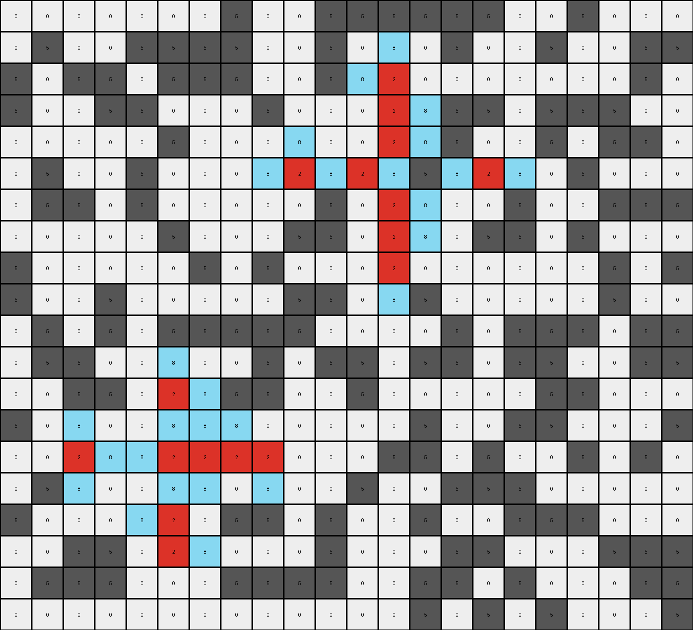
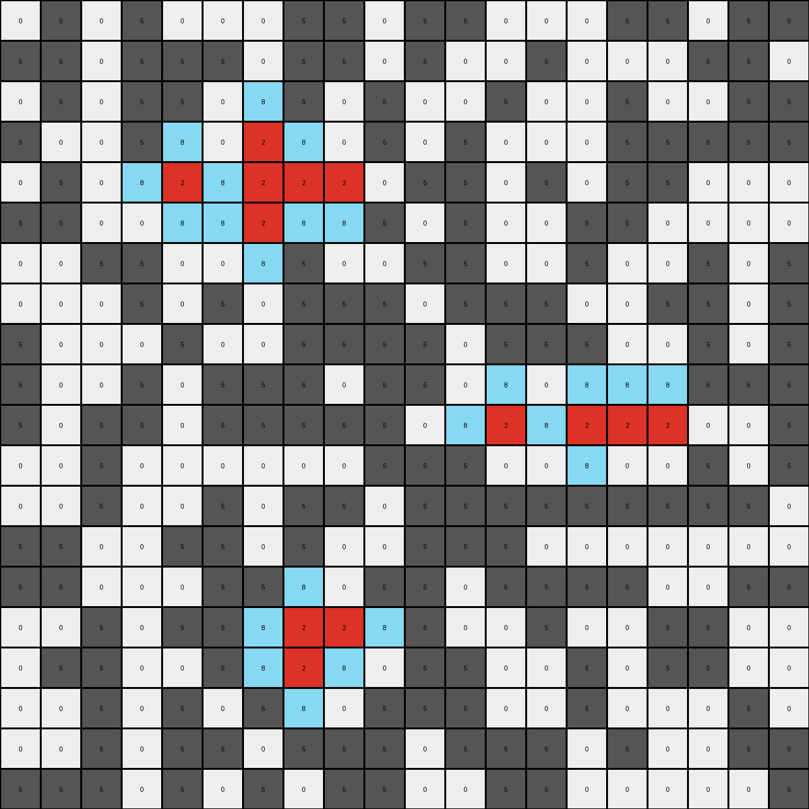
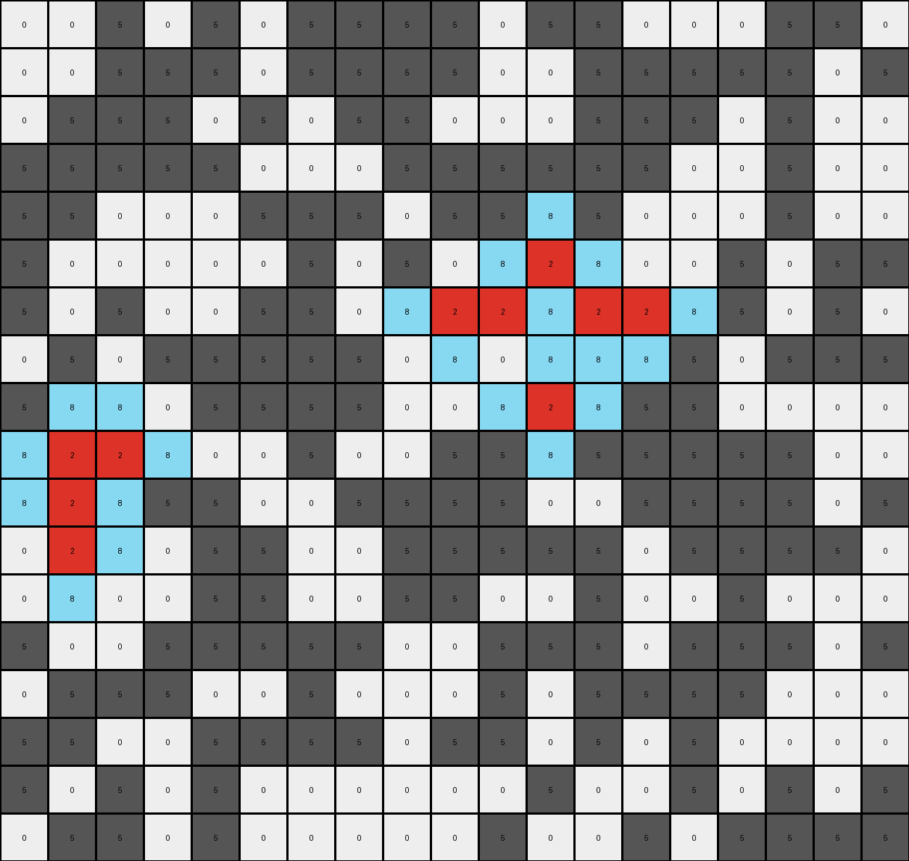
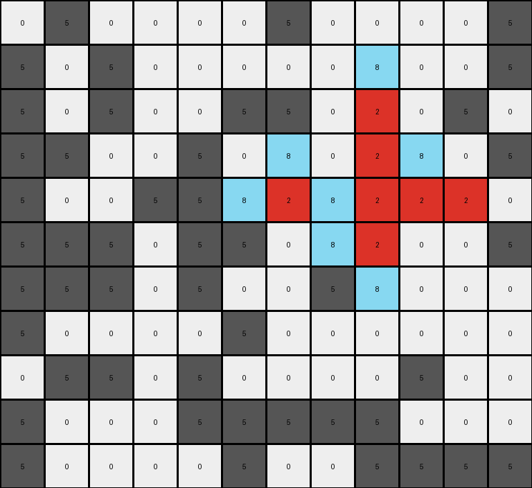

# 50846271 • 009 • refine_dreamer

---

Previous Code:
```python
"""
1.  **Identify Red Objects:** Locate all red (value 2) pixels within the input grid. Consider contiguous regions of red pixels as single objects.

2.  **Identify Target Gray Pixels:** Find gray (value 5) pixels that are cardinally adjacent (up, down, left, or right, *not* diagonally) to any red pixel.

3.  **Conditional Color Change:** For each *gray* pixel from those found in step two, check the input grid. IF the *gray* pixel found in step 2 is gray, change it to azure (8) in the output grid.

4. **Preserve Other Pixels:** All other pixels in the input grid retain their original color in the output grid. In other words. If it is not a gray pixel next to a red pixel, as defined above, copy its value to the same coordinates in the output grid.
"""

import numpy as np

def get_neighbors(grid, row, col):
    """Gets the cardinal neighbors of a pixel."""
    rows, cols = grid.shape
    neighbors = []
    if row > 0:
        neighbors.append((row - 1, col))  # Up
    if row < rows - 1:
        neighbors.append((row + 1, col))  # Down
    if col > 0:
        neighbors.append((row, col - 1))  # Left
    if col < cols - 1:
        neighbors.append((row, col + 1))  # Right
    return neighbors

def transform(input_grid):
    """Transforms the input grid according to the described rule."""

    output_grid = np.copy(input_grid)
    rows, cols = input_grid.shape

    # Iterate through each pixel
    for row in range(rows):
        for col in range(cols):
            # Find red pixels
            if input_grid[row, col] == 2:
                # Check cardinal neighbors
                neighbors = get_neighbors(input_grid, row, col)
                for n_row, n_col in neighbors:
                    # If neighbor is gray, change it to azure in output
                    if input_grid[n_row, n_col] == 5:
                        output_grid[n_row, n_col] = 8
    return output_grid
```

Train Set Results:

## Example 1:

Input:
```
0 0 0 0 0 0 0 5 0 0 5 5 5 5 5 5 0 0 5 0 0 0
0 5 0 0 5 5 5 5 0 0 5 0 5 0 5 0 0 5 0 0 5 5
5 0 5 5 0 5 5 5 0 0 5 5 2 0 0 0 0 0 0 0 5 0
5 0 0 5 5 0 0 0 5 0 0 0 2 5 5 5 0 5 5 5 0 0
0 0 0 0 0 5 0 0 0 5 0 0 2 5 5 0 0 5 0 5 5 0
0 5 0 0 5 0 0 0 5 2 5 2 5 5 5 2 5 0 5 0 0 0
0 5 5 0 5 0 0 0 0 0 5 0 2 5 0 0 5 0 0 5 5 5
0 0 0 0 0 5 0 0 0 5 5 0 2 5 0 5 5 0 5 0 0 0
5 0 0 0 0 0 5 0 5 0 0 0 2 0 0 0 0 0 0 5 0 5
5 0 0 5 0 0 0 0 0 5 5 0 5 5 0 0 0 0 0 5 0 0
0 5 0 5 0 5 5 5 5 5 0 0 0 0 5 0 5 5 5 0 5 5
0 5 5 0 0 5 0 0 5 0 5 5 0 5 5 0 5 5 0 0 5 5
0 0 5 5 0 2 5 5 5 0 0 5 0 0 0 0 0 5 5 0 0 0
5 0 5 0 0 5 5 5 0 0 0 0 0 5 0 0 5 5 0 0 0 5
0 0 2 5 5 2 2 2 2 0 0 0 5 5 0 5 0 0 5 0 5 0
0 5 5 0 0 5 5 0 5 0 0 5 0 0 5 5 5 0 0 0 0 0
5 0 0 0 5 2 0 5 5 0 5 0 0 5 0 0 5 5 5 0 0 0
0 0 5 5 0 2 5 0 0 0 5 0 0 0 5 5 0 0 0 5 5 5
0 5 5 5 0 0 0 5 5 5 5 0 0 5 5 0 5 0 0 0 5 5
0 0 0 0 0 0 0 0 0 0 0 0 0 5 0 5 0 5 0 0 0 5
```
Expected Output:
```
0 0 0 0 0 0 0 5 0 0 5 5 5 5 5 5 0 0 5 0 0 0
0 5 0 0 5 5 5 5 0 0 5 0 5 0 5 0 0 5 0 0 5 5
5 0 5 5 0 5 5 5 0 0 5 5 2 0 0 0 0 0 0 0 5 0
5 0 0 5 5 0 0 0 5 0 0 0 2 5 5 5 0 5 5 5 0 0
0 0 0 0 0 5 0 0 0 5 0 0 2 5 5 0 0 5 0 5 5 0
0 5 0 0 5 0 0 0 5 2 8 2 8 8 8 2 5 0 5 0 0 0
0 5 5 0 5 0 0 0 0 0 5 0 2 5 0 0 5 0 0 5 5 5
0 0 0 0 0 5 0 0 0 5 5 0 2 5 0 5 5 0 5 0 0 0
5 0 0 0 0 0 5 0 5 0 0 0 2 0 0 0 0 0 0 5 0 5
5 0 0 5 0 0 0 0 0 5 5 0 5 5 0 0 0 0 0 5 0 0
0 5 0 5 0 5 5 5 5 5 0 0 0 0 5 0 5 5 5 0 5 5
0 5 5 0 0 8 0 0 5 0 5 5 0 5 5 0 5 5 0 0 5 5
0 0 5 5 0 2 5 5 5 0 0 5 0 0 0 0 0 5 5 0 0 0
5 0 5 0 0 8 5 5 0 0 0 0 0 5 0 0 5 5 0 0 0 5
0 0 2 8 8 2 2 2 2 0 0 0 5 5 0 5 0 0 5 0 5 0
0 5 5 0 0 8 5 0 5 0 0 5 0 0 5 5 5 0 0 0 0 0
5 0 0 0 5 2 0 5 5 0 5 0 0 5 0 0 5 5 5 0 0 0
0 0 5 5 0 2 5 0 0 0 5 0 0 0 5 5 0 0 0 5 5 5
0 5 5 5 0 0 0 5 5 5 5 0 0 5 5 0 5 0 0 0 5 5
0 0 0 0 0 0 0 0 0 0 0 0 0 5 0 5 0 5 0 0 0 5
```
Transformed Output:
```
0 0 0 0 0 0 0 5 0 0 5 5 5 5 5 5 0 0 5 0 0 0
0 5 0 0 5 5 5 5 0 0 5 0 8 0 5 0 0 5 0 0 5 5
5 0 5 5 0 5 5 5 0 0 5 8 2 0 0 0 0 0 0 0 5 0
5 0 0 5 5 0 0 0 5 0 0 0 2 8 5 5 0 5 5 5 0 0
0 0 0 0 0 5 0 0 0 8 0 0 2 8 5 0 0 5 0 5 5 0
0 5 0 0 5 0 0 0 8 2 8 2 8 5 8 2 8 0 5 0 0 0
0 5 5 0 5 0 0 0 0 0 5 0 2 8 0 0 5 0 0 5 5 5
0 0 0 0 0 5 0 0 0 5 5 0 2 8 0 5 5 0 5 0 0 0
5 0 0 0 0 0 5 0 5 0 0 0 2 0 0 0 0 0 0 5 0 5
5 0 0 5 0 0 0 0 0 5 5 0 8 5 0 0 0 0 0 5 0 0
0 5 0 5 0 5 5 5 5 5 0 0 0 0 5 0 5 5 5 0 5 5
0 5 5 0 0 8 0 0 5 0 5 5 0 5 5 0 5 5 0 0 5 5
0 0 5 5 0 2 8 5 5 0 0 5 0 0 0 0 0 5 5 0 0 0
5 0 8 0 0 8 8 8 0 0 0 0 0 5 0 0 5 5 0 0 0 5
0 0 2 8 8 2 2 2 2 0 0 0 5 5 0 5 0 0 5 0 5 0
0 5 8 0 0 8 8 0 8 0 0 5 0 0 5 5 5 0 0 0 0 0
5 0 0 0 8 2 0 5 5 0 5 0 0 5 0 0 5 5 5 0 0 0
0 0 5 5 0 2 8 0 0 0 5 0 0 0 5 5 0 0 0 5 5 5
0 5 5 5 0 0 0 5 5 5 5 0 0 5 5 0 5 0 0 0 5 5
0 0 0 0 0 0 0 0 0 0 0 0 0 5 0 5 0 5 0 0 0 5
```

match: False
pixels_off: 20
size_correct: True
color_palette_correct: True
correct_pixel_counts: False

## Example 2:

Input:
```
0 5 0 5 0 0 0 5 5 0 5 5 0 0 0 5 5 0 5 5
5 5 0 5 5 5 0 5 5 0 5 0 0 5 0 0 0 5 5 0
0 5 0 5 5 0 5 5 0 5 0 0 5 0 0 5 0 0 5 5
5 0 0 5 5 0 2 5 0 5 0 5 0 0 0 5 5 5 5 5
0 5 0 5 2 5 2 2 2 0 5 5 0 5 0 5 5 0 0 0
5 5 0 0 5 5 2 5 5 5 0 5 0 0 5 5 0 0 0 0
0 0 5 5 0 0 5 5 0 0 5 5 0 0 5 0 0 5 0 5
0 0 0 5 0 5 0 5 5 5 0 5 5 5 0 0 5 5 0 5
5 0 0 0 5 0 0 5 5 5 5 0 5 5 5 0 0 5 0 5
5 0 0 5 0 5 5 5 0 5 5 0 5 0 5 5 5 5 5 5
5 0 5 5 0 5 5 5 5 5 0 5 2 5 2 2 2 0 0 5
0 0 5 0 0 0 0 0 0 5 5 5 0 0 5 0 0 5 0 5
0 0 5 0 0 5 0 5 5 0 5 5 5 5 5 5 5 5 5 0
5 5 0 0 5 5 0 5 0 0 5 5 5 0 0 0 0 0 0 0
5 5 0 0 0 5 5 5 0 5 5 0 5 5 5 5 0 0 5 5
0 0 5 0 5 5 5 2 2 5 5 0 0 5 0 0 5 5 0 0
0 5 5 0 0 5 5 2 5 0 5 5 0 0 5 0 5 5 0 0
0 0 5 0 5 0 5 5 0 5 5 5 0 0 5 0 0 0 5 0
0 0 5 0 5 5 0 5 5 5 0 5 5 5 0 5 0 0 5 5
5 5 5 0 5 0 5 0 5 5 0 0 5 5 0 0 0 0 0 5
```
Expected Output:
```
0 5 0 5 0 0 0 5 5 0 5 5 0 0 0 5 5 0 5 5
5 5 0 5 5 5 0 5 5 0 5 0 0 5 0 0 0 5 5 0
0 5 0 5 5 0 8 5 0 5 0 0 5 0 0 5 0 0 5 5
5 0 0 5 5 0 2 5 0 5 0 5 0 0 0 5 5 5 5 5
0 5 0 5 2 8 2 2 2 0 5 5 0 5 0 5 5 0 0 0
5 5 0 0 5 5 2 5 5 5 0 5 0 0 5 5 0 0 0 0
0 0 5 5 0 0 8 5 0 0 5 5 0 0 5 0 0 5 0 5
0 0 0 5 0 5 0 5 5 5 0 5 5 5 0 0 5 5 0 5
5 0 0 0 5 0 0 5 5 5 5 0 5 5 8 0 0 5 0 5
5 0 0 5 0 5 5 5 0 5 5 0 5 0 8 5 5 5 5 5
5 0 5 5 0 5 5 5 5 5 0 5 2 8 2 2 2 0 0 5
0 0 5 0 0 0 0 0 0 5 5 5 0 0 8 0 0 5 0 5
0 0 5 0 0 5 0 5 5 0 5 5 5 5 8 5 5 5 5 0
5 5 0 0 5 5 0 8 0 0 5 5 5 0 0 0 0 0 0 0
5 5 0 0 0 5 5 8 0 5 5 0 5 5 5 5 0 0 5 5
0 0 5 0 5 8 8 2 2 8 5 0 0 5 0 0 5 5 0 0
0 5 5 0 0 5 5 2 5 0 5 5 0 0 5 0 5 5 0 0
0 0 5 0 5 0 5 8 0 5 5 5 0 0 5 0 0 0 5 0
0 0 5 0 5 5 0 5 5 5 0 5 5 5 0 5 0 0 5 5
5 5 5 0 5 0 5 0 5 5 0 0 5 5 0 0 0 0 0 5
```
Transformed Output:
```
0 5 0 5 0 0 0 5 5 0 5 5 0 0 0 5 5 0 5 5
5 5 0 5 5 5 0 5 5 0 5 0 0 5 0 0 0 5 5 0
0 5 0 5 5 0 8 5 0 5 0 0 5 0 0 5 0 0 5 5
5 0 0 5 8 0 2 8 0 5 0 5 0 0 0 5 5 5 5 5
0 5 0 8 2 8 2 2 2 0 5 5 0 5 0 5 5 0 0 0
5 5 0 0 8 8 2 8 8 5 0 5 0 0 5 5 0 0 0 0
0 0 5 5 0 0 8 5 0 0 5 5 0 0 5 0 0 5 0 5
0 0 0 5 0 5 0 5 5 5 0 5 5 5 0 0 5 5 0 5
5 0 0 0 5 0 0 5 5 5 5 0 5 5 5 0 0 5 0 5
5 0 0 5 0 5 5 5 0 5 5 0 8 0 8 8 8 5 5 5
5 0 5 5 0 5 5 5 5 5 0 8 2 8 2 2 2 0 0 5
0 0 5 0 0 0 0 0 0 5 5 5 0 0 8 0 0 5 0 5
0 0 5 0 0 5 0 5 5 0 5 5 5 5 5 5 5 5 5 0
5 5 0 0 5 5 0 5 0 0 5 5 5 0 0 0 0 0 0 0
5 5 0 0 0 5 5 8 0 5 5 0 5 5 5 5 0 0 5 5
0 0 5 0 5 5 8 2 2 8 5 0 0 5 0 0 5 5 0 0
0 5 5 0 0 5 8 2 8 0 5 5 0 0 5 0 5 5 0 0
0 0 5 0 5 0 5 8 0 5 5 5 0 0 5 0 0 0 5 0
0 0 5 0 5 5 0 5 5 5 0 5 5 5 0 5 0 0 5 5
5 5 5 0 5 0 5 0 5 5 0 0 5 5 0 0 0 0 0 5
```

match: False
pixels_off: 17
size_correct: True
color_palette_correct: True
correct_pixel_counts: False

## Example 3:

Input:
```
0 0 5 0 5 0 5 5 5 5 0 5 5 0 0 0 5 5 0
0 0 5 5 5 0 5 5 5 5 0 0 5 5 5 5 5 0 5
0 5 5 5 0 5 0 5 5 0 0 0 5 5 5 0 5 0 0
5 5 5 5 5 0 0 0 5 5 5 5 5 5 0 0 5 0 0
5 5 0 0 0 5 5 5 0 5 5 5 5 0 0 0 5 0 0
5 0 0 0 0 0 5 0 5 0 5 2 5 0 0 5 0 5 5
5 0 5 0 0 5 5 0 5 2 2 5 2 2 5 5 0 5 0
0 5 0 5 5 5 5 5 0 5 0 5 5 5 5 0 5 5 5
5 5 5 0 5 5 5 5 0 0 5 2 5 5 5 0 0 0 0
5 2 2 5 0 0 5 0 0 5 5 5 5 5 5 5 5 0 0
5 2 5 5 5 0 0 5 5 5 5 0 0 5 5 5 5 0 5
0 2 5 0 5 5 0 0 5 5 5 5 5 0 5 5 5 5 0
0 5 0 0 5 5 0 0 5 5 0 0 5 0 0 5 0 0 0
5 0 0 5 5 5 5 5 0 0 5 5 5 0 5 5 5 0 5
0 5 5 5 0 0 5 0 0 0 5 0 5 5 5 5 0 0 0
5 5 0 0 5 5 5 5 0 5 5 0 5 0 5 0 0 0 0
5 0 5 0 5 0 0 0 0 0 0 5 0 0 5 0 5 0 5
0 5 5 0 5 0 0 0 0 0 5 0 0 5 0 5 5 5 5
```
Expected Output:
```
0 0 5 0 5 0 5 5 5 5 0 5 5 0 0 0 5 5 0
0 0 5 5 5 0 5 5 5 5 0 0 5 5 5 5 5 0 5
0 5 5 5 0 5 0 5 5 0 0 0 5 5 5 0 5 0 0
5 5 5 5 5 0 0 0 5 5 5 5 5 5 0 0 5 0 0
5 5 0 0 0 5 5 5 0 5 5 8 5 0 0 0 5 0 0
5 0 0 0 0 0 5 0 5 0 5 2 5 0 0 5 0 5 5
5 0 5 0 0 5 5 0 5 2 2 8 2 2 5 5 0 5 0
0 8 0 5 5 5 5 5 0 5 0 8 5 5 5 0 5 5 5
5 8 5 0 5 5 5 5 0 0 5 2 5 5 5 0 0 0 0
8 2 2 8 0 0 5 0 0 5 5 5 5 5 5 5 5 0 0
5 2 5 5 5 0 0 5 5 5 5 0 0 5 5 5 5 0 5
0 2 5 0 5 5 0 0 5 5 5 5 5 0 5 5 5 5 0
0 5 0 0 5 5 0 0 5 5 0 0 5 0 0 5 0 0 0
5 0 0 5 5 5 5 5 0 0 5 5 5 0 5 5 5 0 5
0 5 5 5 0 0 5 0 0 0 5 0 5 5 5 5 0 0 0
5 5 0 0 5 5 5 5 0 5 5 0 5 0 5 0 0 0 0
5 0 5 0 5 0 0 0 0 0 0 5 0 0 5 0 5 0 5
0 5 5 0 5 0 0 0 0 0 5 0 0 5 0 5 5 5 5
```
Transformed Output:
```
0 0 5 0 5 0 5 5 5 5 0 5 5 0 0 0 5 5 0
0 0 5 5 5 0 5 5 5 5 0 0 5 5 5 5 5 0 5
0 5 5 5 0 5 0 5 5 0 0 0 5 5 5 0 5 0 0
5 5 5 5 5 0 0 0 5 5 5 5 5 5 0 0 5 0 0
5 5 0 0 0 5 5 5 0 5 5 8 5 0 0 0 5 0 0
5 0 0 0 0 0 5 0 5 0 8 2 8 0 0 5 0 5 5
5 0 5 0 0 5 5 0 8 2 2 8 2 2 8 5 0 5 0
0 5 0 5 5 5 5 5 0 8 0 8 8 8 5 0 5 5 5
5 8 8 0 5 5 5 5 0 0 8 2 8 5 5 0 0 0 0
8 2 2 8 0 0 5 0 0 5 5 8 5 5 5 5 5 0 0
8 2 8 5 5 0 0 5 5 5 5 0 0 5 5 5 5 0 5
0 2 8 0 5 5 0 0 5 5 5 5 5 0 5 5 5 5 0
0 8 0 0 5 5 0 0 5 5 0 0 5 0 0 5 0 0 0
5 0 0 5 5 5 5 5 0 0 5 5 5 0 5 5 5 0 5
0 5 5 5 0 0 5 0 0 0 5 0 5 5 5 5 0 0 0
5 5 0 0 5 5 5 5 0 5 5 0 5 0 5 0 0 0 0
5 0 5 0 5 0 0 0 0 0 0 5 0 0 5 0 5 0 5
0 5 5 0 5 0 0 0 0 0 5 0 0 5 0 5 5 5 5
```

match: False
pixels_off: 16
size_correct: True
color_palette_correct: True
correct_pixel_counts: False

## Example 4:

Input:
```
0 5 0 0 0 0 5 0 0 0 0 5
5 0 5 0 0 0 0 0 5 0 0 5
5 0 5 0 0 5 5 0 2 0 5 0
5 5 0 0 5 0 5 0 2 5 0 5
5 0 0 5 5 5 2 5 2 2 2 0
5 5 5 0 5 5 0 5 2 0 0 5
5 5 5 0 5 0 0 5 5 0 0 0
5 0 0 0 0 5 0 0 0 0 0 0
0 5 5 0 5 0 0 0 0 5 0 0
5 0 0 0 5 5 5 5 5 0 0 0
5 0 0 0 0 5 0 0 5 5 5 5
```
Expected Output:
```
0 5 0 0 0 0 5 0 0 0 0 5
5 0 5 0 0 0 0 0 5 0 0 5
5 0 5 0 0 5 5 0 2 0 5 0
5 5 0 0 5 0 5 0 2 5 0 5
5 0 0 5 5 5 2 8 2 2 2 0
5 5 5 0 5 5 0 5 2 0 0 5
5 5 5 0 5 0 0 5 8 0 0 0
5 0 0 0 0 5 0 0 0 0 0 0
0 5 5 0 5 0 0 0 0 5 0 0
5 0 0 0 5 5 5 5 5 0 0 0
5 0 0 0 0 5 0 0 5 5 5 5
```
Transformed Output:
```
0 5 0 0 0 0 5 0 0 0 0 5
5 0 5 0 0 0 0 0 8 0 0 5
5 0 5 0 0 5 5 0 2 0 5 0
5 5 0 0 5 0 8 0 2 8 0 5
5 0 0 5 5 8 2 8 2 2 2 0
5 5 5 0 5 5 0 8 2 0 0 5
5 5 5 0 5 0 0 5 8 0 0 0
5 0 0 0 0 5 0 0 0 0 0 0
0 5 5 0 5 0 0 0 0 5 0 0
5 0 0 0 5 5 5 5 5 0 0 0
5 0 0 0 0 5 0 0 5 5 5 5
```

match: False
pixels_off: 5
size_correct: True
color_palette_correct: True
correct_pixel_counts: False
**INSTRUCTIONS**

The code above was generated based on observations from the first training
example

we have tested the transform function on each of the task example inputs and
compared with the expected output

review each of the examples provided and the results and consider how the
natural language program should be updated to accommodate this new knowledge

respond with the following deliverables:

- general assessment of the information provided and strategy for resolving the
  errors
- gather metrics about each of the examples and results - use code_execution to
  develop accurate reports on your assumptions
- a YAML block documenting facts - Focus on identifying objects, their properties, and the actions performed on them.
- a natural language program - Be as clear and concise as possible, providing a complete description of the transformation rule.


your responses should be considered as information in a report - not a
conversation
