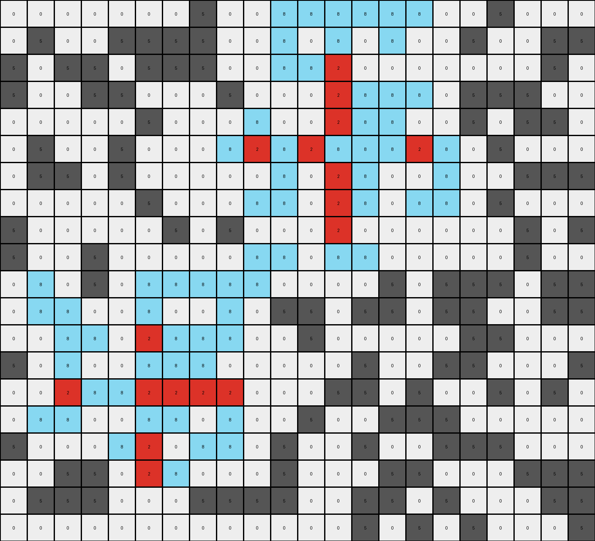
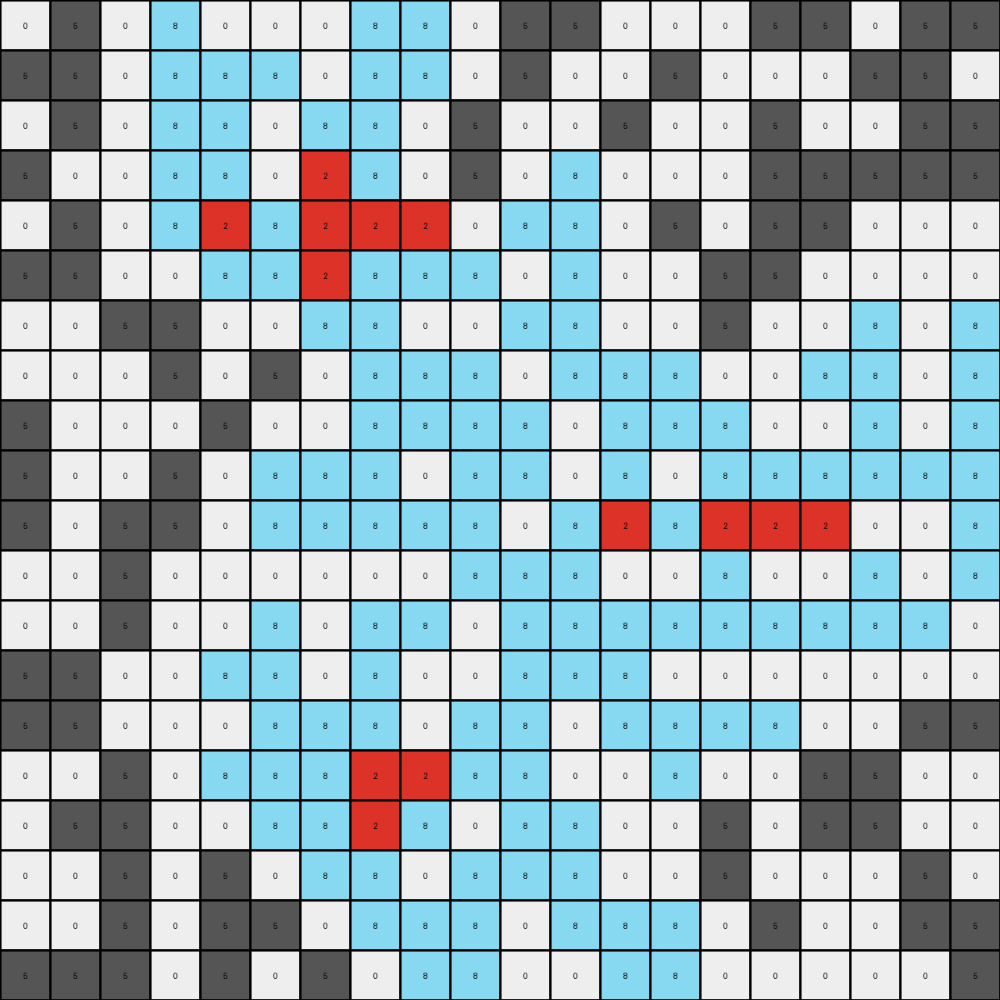
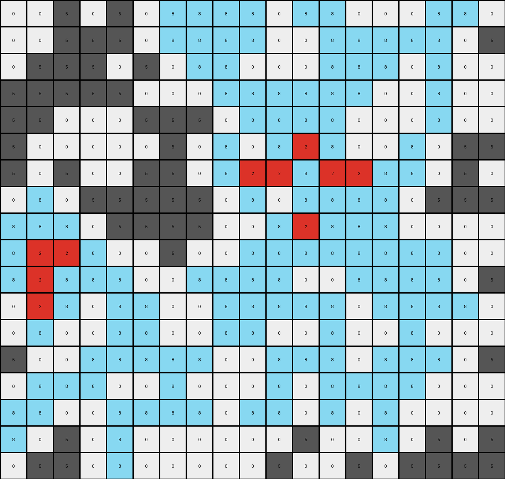
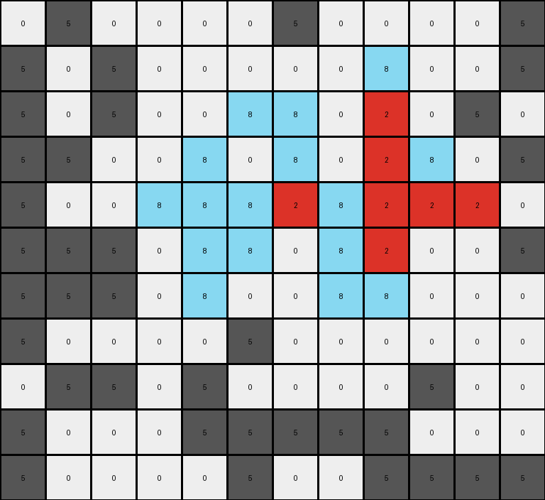

# 50846271 • 012 • refine_coder

---

Previous Code:
```python
"""
1.  **Identify Objects:** Identify all contiguous regions (objects) of pixels with the same color. Consider pixels cardinally adjacent (up, down, left, right) to be part of the same object. Diagonal adjacency does not connect objects.

2.  **Find Gray Objects:** Iterate through the list of objects, selecting those that are gray (color value 5).

3.  **Check for Red Adjacency:** For each gray object, check if *any* of its pixels are cardinally adjacent to a red pixel (color value 2).

4.  **Conditional Color Change (Object-Based):** If a gray object is adjacent to a red object, change *all* pixels within that gray object to azure (color value 8).

5.  **Preserve Other Pixels:** All pixels *not* part of a gray object that is adjacent to a red object retain their original color from the input grid.
"""

import numpy as np

def get_neighbors(grid, row, col):
    """Gets the cardinal neighbors of a pixel."""
    rows, cols = grid.shape
    neighbors = []
    if row > 0:
        neighbors.append((row - 1, col))  # Up
    if row < rows - 1:
        neighbors.append((row + 1, col))  # Down
    if col > 0:
        neighbors.append((row, col - 1))  # Left
    if col < cols - 1:
        neighbors.append((row, col + 1))  # Right
    return neighbors

def flood_fill(grid, row, col, target_color, object_pixels):
    """Performs a flood fill to identify a contiguous object."""
    if (row, col) in object_pixels or grid[row, col] != target_color:
        return
    object_pixels.add((row, col))
    neighbors = get_neighbors(grid, row, col)
    for n_row, n_col in neighbors:
        flood_fill(grid, n_row, n_col, target_color, object_pixels)

def find_objects(grid):
    """Finds all contiguous objects in the grid."""
    rows, cols = grid.shape
    objects = []
    visited = set()

    for row in range(rows):
        for col in range(cols):
            if (row, col) not in visited:
                object_pixels = set()
                flood_fill(grid, row, col, grid[row, col], object_pixels)
                if object_pixels:
                    objects.append((grid[row,col], object_pixels)) # Store color and pixels
                    visited.update(object_pixels)
    return objects

def is_adjacent_to_red(grid, object_pixels):
    """Checks if a gray object is adjacent to a red pixel."""
    for row, col in object_pixels:
        neighbors = get_neighbors(grid, row, col)
        for n_row, n_col in neighbors:
            if grid[n_row, n_col] == 2:
                return True
    return False

def transform(input_grid):
    """Transforms the input grid according to the described rule."""

    output_grid = np.copy(input_grid)
    rows, cols = input_grid.shape

    # 1. Identify Objects
    objects = find_objects(input_grid)

    # 2. & 3. Find Gray Objects and Check for Red Adjacency
    for color, object_pixels in objects:
        if color == 5:  # Gray object
            if is_adjacent_to_red(input_grid, object_pixels):
                # 4. Conditional Color Change
                for row, col in object_pixels:
                    output_grid[row, col] = 8

    # 5. Preserve Other Pixels (already handled by initializing output_grid as a copy)
    return output_grid
```

Train Set Results:

## Example 1:

Input:
```
0 0 0 0 0 0 0 5 0 0 5 5 5 5 5 5 0 0 5 0 0 0
0 5 0 0 5 5 5 5 0 0 5 0 5 0 5 0 0 5 0 0 5 5
5 0 5 5 0 5 5 5 0 0 5 5 2 0 0 0 0 0 0 0 5 0
5 0 0 5 5 0 0 0 5 0 0 0 2 5 5 5 0 5 5 5 0 0
0 0 0 0 0 5 0 0 0 5 0 0 2 5 5 0 0 5 0 5 5 0
0 5 0 0 5 0 0 0 5 2 5 2 5 5 5 2 5 0 5 0 0 0
0 5 5 0 5 0 0 0 0 0 5 0 2 5 0 0 5 0 0 5 5 5
0 0 0 0 0 5 0 0 0 5 5 0 2 5 0 5 5 0 5 0 0 0
5 0 0 0 0 0 5 0 5 0 0 0 2 0 0 0 0 0 0 5 0 5
5 0 0 5 0 0 0 0 0 5 5 0 5 5 0 0 0 0 0 5 0 0
0 5 0 5 0 5 5 5 5 5 0 0 0 0 5 0 5 5 5 0 5 5
0 5 5 0 0 5 0 0 5 0 5 5 0 5 5 0 5 5 0 0 5 5
0 0 5 5 0 2 5 5 5 0 0 5 0 0 0 0 0 5 5 0 0 0
5 0 5 0 0 5 5 5 0 0 0 0 0 5 0 0 5 5 0 0 0 5
0 0 2 5 5 2 2 2 2 0 0 0 5 5 0 5 0 0 5 0 5 0
0 5 5 0 0 5 5 0 5 0 0 5 0 0 5 5 5 0 0 0 0 0
5 0 0 0 5 2 0 5 5 0 5 0 0 5 0 0 5 5 5 0 0 0
0 0 5 5 0 2 5 0 0 0 5 0 0 0 5 5 0 0 0 5 5 5
0 5 5 5 0 0 0 5 5 5 5 0 0 5 5 0 5 0 0 0 5 5
0 0 0 0 0 0 0 0 0 0 0 0 0 5 0 5 0 5 0 0 0 5
```
Expected Output:
```
0 0 0 0 0 0 0 5 0 0 5 5 5 5 5 5 0 0 5 0 0 0
0 5 0 0 5 5 5 5 0 0 5 0 5 0 5 0 0 5 0 0 5 5
5 0 5 5 0 5 5 5 0 0 5 5 2 0 0 0 0 0 0 0 5 0
5 0 0 5 5 0 0 0 5 0 0 0 2 5 5 5 0 5 5 5 0 0
0 0 0 0 0 5 0 0 0 5 0 0 2 5 5 0 0 5 0 5 5 0
0 5 0 0 5 0 0 0 5 2 8 2 8 8 8 2 5 0 5 0 0 0
0 5 5 0 5 0 0 0 0 0 5 0 2 5 0 0 5 0 0 5 5 5
0 0 0 0 0 5 0 0 0 5 5 0 2 5 0 5 5 0 5 0 0 0
5 0 0 0 0 0 5 0 5 0 0 0 2 0 0 0 0 0 0 5 0 5
5 0 0 5 0 0 0 0 0 5 5 0 5 5 0 0 0 0 0 5 0 0
0 5 0 5 0 5 5 5 5 5 0 0 0 0 5 0 5 5 5 0 5 5
0 5 5 0 0 8 0 0 5 0 5 5 0 5 5 0 5 5 0 0 5 5
0 0 5 5 0 2 5 5 5 0 0 5 0 0 0 0 0 5 5 0 0 0
5 0 5 0 0 8 5 5 0 0 0 0 0 5 0 0 5 5 0 0 0 5
0 0 2 8 8 2 2 2 2 0 0 0 5 5 0 5 0 0 5 0 5 0
0 5 5 0 0 8 5 0 5 0 0 5 0 0 5 5 5 0 0 0 0 0
5 0 0 0 5 2 0 5 5 0 5 0 0 5 0 0 5 5 5 0 0 0
0 0 5 5 0 2 5 0 0 0 5 0 0 0 5 5 0 0 0 5 5 5
0 5 5 5 0 0 0 5 5 5 5 0 0 5 5 0 5 0 0 0 5 5
0 0 0 0 0 0 0 0 0 0 0 0 0 5 0 5 0 5 0 0 0 5
```
Transformed Output:
```
0 0 0 0 0 0 0 5 0 0 8 8 8 8 8 8 0 0 5 0 0 0
0 5 0 0 5 5 5 5 0 0 8 0 8 0 8 0 0 5 0 0 5 5
5 0 5 5 0 5 5 5 0 0 8 8 2 0 0 0 0 0 0 0 5 0
5 0 0 5 5 0 0 0 5 0 0 0 2 8 8 8 0 5 5 5 0 0
0 0 0 0 0 5 0 0 0 8 0 0 2 8 8 0 0 5 0 5 5 0
0 5 0 0 5 0 0 0 8 2 8 2 8 8 8 2 8 0 5 0 0 0
0 5 5 0 5 0 0 0 0 0 8 0 2 8 0 0 8 0 0 5 5 5
0 0 0 0 0 5 0 0 0 8 8 0 2 8 0 8 8 0 5 0 0 0
5 0 0 0 0 0 5 0 5 0 0 0 2 0 0 0 0 0 0 5 0 5
5 0 0 5 0 0 0 0 0 8 8 0 8 8 0 0 0 0 0 5 0 0
0 8 0 5 0 8 8 8 8 8 0 0 0 0 5 0 5 5 5 0 5 5
0 8 8 0 0 8 0 0 8 0 5 5 0 5 5 0 5 5 0 0 5 5
0 0 8 8 0 2 8 8 8 0 0 5 0 0 0 0 0 5 5 0 0 0
5 0 8 0 0 8 8 8 0 0 0 0 0 5 0 0 5 5 0 0 0 5
0 0 2 8 8 2 2 2 2 0 0 0 5 5 0 5 0 0 5 0 5 0
0 8 8 0 0 8 8 0 8 0 0 5 0 0 5 5 5 0 0 0 0 0
5 0 0 0 8 2 0 8 8 0 5 0 0 5 0 0 5 5 5 0 0 0
0 0 5 5 0 2 8 0 0 0 5 0 0 0 5 5 0 0 0 5 5 5
0 5 5 5 0 0 0 5 5 5 5 0 0 5 5 0 5 0 0 0 5 5
0 0 0 0 0 0 0 0 0 0 0 0 0 5 0 5 0 5 0 0 0 5
```

match: False
pixels_off: 56
size_correct: True
color_palette_correct: True
correct_pixel_counts: False

## Example 2:

Input:
```
0 5 0 5 0 0 0 5 5 0 5 5 0 0 0 5 5 0 5 5
5 5 0 5 5 5 0 5 5 0 5 0 0 5 0 0 0 5 5 0
0 5 0 5 5 0 5 5 0 5 0 0 5 0 0 5 0 0 5 5
5 0 0 5 5 0 2 5 0 5 0 5 0 0 0 5 5 5 5 5
0 5 0 5 2 5 2 2 2 0 5 5 0 5 0 5 5 0 0 0
5 5 0 0 5 5 2 5 5 5 0 5 0 0 5 5 0 0 0 0
0 0 5 5 0 0 5 5 0 0 5 5 0 0 5 0 0 5 0 5
0 0 0 5 0 5 0 5 5 5 0 5 5 5 0 0 5 5 0 5
5 0 0 0 5 0 0 5 5 5 5 0 5 5 5 0 0 5 0 5
5 0 0 5 0 5 5 5 0 5 5 0 5 0 5 5 5 5 5 5
5 0 5 5 0 5 5 5 5 5 0 5 2 5 2 2 2 0 0 5
0 0 5 0 0 0 0 0 0 5 5 5 0 0 5 0 0 5 0 5
0 0 5 0 0 5 0 5 5 0 5 5 5 5 5 5 5 5 5 0
5 5 0 0 5 5 0 5 0 0 5 5 5 0 0 0 0 0 0 0
5 5 0 0 0 5 5 5 0 5 5 0 5 5 5 5 0 0 5 5
0 0 5 0 5 5 5 2 2 5 5 0 0 5 0 0 5 5 0 0
0 5 5 0 0 5 5 2 5 0 5 5 0 0 5 0 5 5 0 0
0 0 5 0 5 0 5 5 0 5 5 5 0 0 5 0 0 0 5 0
0 0 5 0 5 5 0 5 5 5 0 5 5 5 0 5 0 0 5 5
5 5 5 0 5 0 5 0 5 5 0 0 5 5 0 0 0 0 0 5
```
Expected Output:
```
0 5 0 5 0 0 0 5 5 0 5 5 0 0 0 5 5 0 5 5
5 5 0 5 5 5 0 5 5 0 5 0 0 5 0 0 0 5 5 0
0 5 0 5 5 0 8 5 0 5 0 0 5 0 0 5 0 0 5 5
5 0 0 5 5 0 2 5 0 5 0 5 0 0 0 5 5 5 5 5
0 5 0 5 2 8 2 2 2 0 5 5 0 5 0 5 5 0 0 0
5 5 0 0 5 5 2 5 5 5 0 5 0 0 5 5 0 0 0 0
0 0 5 5 0 0 8 5 0 0 5 5 0 0 5 0 0 5 0 5
0 0 0 5 0 5 0 5 5 5 0 5 5 5 0 0 5 5 0 5
5 0 0 0 5 0 0 5 5 5 5 0 5 5 8 0 0 5 0 5
5 0 0 5 0 5 5 5 0 5 5 0 5 0 8 5 5 5 5 5
5 0 5 5 0 5 5 5 5 5 0 5 2 8 2 2 2 0 0 5
0 0 5 0 0 0 0 0 0 5 5 5 0 0 8 0 0 5 0 5
0 0 5 0 0 5 0 5 5 0 5 5 5 5 8 5 5 5 5 0
5 5 0 0 5 5 0 8 0 0 5 5 5 0 0 0 0 0 0 0
5 5 0 0 0 5 5 8 0 5 5 0 5 5 5 5 0 0 5 5
0 0 5 0 5 8 8 2 2 8 5 0 0 5 0 0 5 5 0 0
0 5 5 0 0 5 5 2 5 0 5 5 0 0 5 0 5 5 0 0
0 0 5 0 5 0 5 8 0 5 5 5 0 0 5 0 0 0 5 0
0 0 5 0 5 5 0 5 5 5 0 5 5 5 0 5 0 0 5 5
5 5 5 0 5 0 5 0 5 5 0 0 5 5 0 0 0 0 0 5
```
Transformed Output:
```
0 5 0 8 0 0 0 8 8 0 5 5 0 0 0 5 5 0 5 5
5 5 0 8 8 8 0 8 8 0 5 0 0 5 0 0 0 5 5 0
0 5 0 8 8 0 8 8 0 5 0 0 5 0 0 5 0 0 5 5
5 0 0 8 8 0 2 8 0 5 0 8 0 0 0 5 5 5 5 5
0 5 0 8 2 8 2 2 2 0 8 8 0 5 0 5 5 0 0 0
5 5 0 0 8 8 2 8 8 8 0 8 0 0 5 5 0 0 0 0
0 0 5 5 0 0 8 8 0 0 8 8 0 0 5 0 0 8 0 8
0 0 0 5 0 5 0 8 8 8 0 8 8 8 0 0 8 8 0 8
5 0 0 0 5 0 0 8 8 8 8 0 8 8 8 0 0 8 0 8
5 0 0 5 0 8 8 8 0 8 8 0 8 0 8 8 8 8 8 8
5 0 5 5 0 8 8 8 8 8 0 8 2 8 2 2 2 0 0 8
0 0 5 0 0 0 0 0 0 8 8 8 0 0 8 0 0 8 0 8
0 0 5 0 0 8 0 8 8 0 8 8 8 8 8 8 8 8 8 0
5 5 0 0 8 8 0 8 0 0 8 8 8 0 0 0 0 0 0 0
5 5 0 0 0 8 8 8 0 8 8 0 8 8 8 8 0 0 5 5
0 0 5 0 8 8 8 2 2 8 8 0 0 8 0 0 5 5 0 0
0 5 5 0 0 8 8 2 8 0 8 8 0 0 5 0 5 5 0 0
0 0 5 0 5 0 8 8 0 8 8 8 0 0 5 0 0 0 5 0
0 0 5 0 5 5 0 8 8 8 0 8 8 8 0 5 0 0 5 5
5 5 5 0 5 0 5 0 8 8 0 0 8 8 0 0 0 0 0 5
```

match: False
pixels_off: 115
size_correct: True
color_palette_correct: True
correct_pixel_counts: False

## Example 3:

Input:
```
0 0 5 0 5 0 5 5 5 5 0 5 5 0 0 0 5 5 0
0 0 5 5 5 0 5 5 5 5 0 0 5 5 5 5 5 0 5
0 5 5 5 0 5 0 5 5 0 0 0 5 5 5 0 5 0 0
5 5 5 5 5 0 0 0 5 5 5 5 5 5 0 0 5 0 0
5 5 0 0 0 5 5 5 0 5 5 5 5 0 0 0 5 0 0
5 0 0 0 0 0 5 0 5 0 5 2 5 0 0 5 0 5 5
5 0 5 0 0 5 5 0 5 2 2 5 2 2 5 5 0 5 0
0 5 0 5 5 5 5 5 0 5 0 5 5 5 5 0 5 5 5
5 5 5 0 5 5 5 5 0 0 5 2 5 5 5 0 0 0 0
5 2 2 5 0 0 5 0 0 5 5 5 5 5 5 5 5 0 0
5 2 5 5 5 0 0 5 5 5 5 0 0 5 5 5 5 0 5
0 2 5 0 5 5 0 0 5 5 5 5 5 0 5 5 5 5 0
0 5 0 0 5 5 0 0 5 5 0 0 5 0 0 5 0 0 0
5 0 0 5 5 5 5 5 0 0 5 5 5 0 5 5 5 0 5
0 5 5 5 0 0 5 0 0 0 5 0 5 5 5 5 0 0 0
5 5 0 0 5 5 5 5 0 5 5 0 5 0 5 0 0 0 0
5 0 5 0 5 0 0 0 0 0 0 5 0 0 5 0 5 0 5
0 5 5 0 5 0 0 0 0 0 5 0 0 5 0 5 5 5 5
```
Expected Output:
```
0 0 5 0 5 0 5 5 5 5 0 5 5 0 0 0 5 5 0
0 0 5 5 5 0 5 5 5 5 0 0 5 5 5 5 5 0 5
0 5 5 5 0 5 0 5 5 0 0 0 5 5 5 0 5 0 0
5 5 5 5 5 0 0 0 5 5 5 5 5 5 0 0 5 0 0
5 5 0 0 0 5 5 5 0 5 5 8 5 0 0 0 5 0 0
5 0 0 0 0 0 5 0 5 0 5 2 5 0 0 5 0 5 5
5 0 5 0 0 5 5 0 5 2 2 8 2 2 5 5 0 5 0
0 8 0 5 5 5 5 5 0 5 0 8 5 5 5 0 5 5 5
5 8 5 0 5 5 5 5 0 0 5 2 5 5 5 0 0 0 0
8 2 2 8 0 0 5 0 0 5 5 5 5 5 5 5 5 0 0
5 2 5 5 5 0 0 5 5 5 5 0 0 5 5 5 5 0 5
0 2 5 0 5 5 0 0 5 5 5 5 5 0 5 5 5 5 0
0 5 0 0 5 5 0 0 5 5 0 0 5 0 0 5 0 0 0
5 0 0 5 5 5 5 5 0 0 5 5 5 0 5 5 5 0 5
0 5 5 5 0 0 5 0 0 0 5 0 5 5 5 5 0 0 0
5 5 0 0 5 5 5 5 0 5 5 0 5 0 5 0 0 0 0
5 0 5 0 5 0 0 0 0 0 0 5 0 0 5 0 5 0 5
0 5 5 0 5 0 0 0 0 0 5 0 0 5 0 5 5 5 5
```
Transformed Output:
```
0 0 5 0 5 0 8 8 8 8 0 8 8 0 0 0 8 8 0
0 0 5 5 5 0 8 8 8 8 0 0 8 8 8 8 8 0 5
0 5 5 5 0 5 0 8 8 0 0 0 8 8 8 0 8 0 0
5 5 5 5 5 0 0 0 8 8 8 8 8 8 0 0 8 0 0
5 5 0 0 0 5 5 5 0 8 8 8 8 0 0 0 8 0 0
5 0 0 0 0 0 5 0 8 0 8 2 8 0 0 8 0 5 5
5 0 5 0 0 5 5 0 8 2 2 8 2 2 8 8 0 5 0
0 8 0 5 5 5 5 5 0 8 0 8 8 8 8 0 5 5 5
8 8 8 0 5 5 5 5 0 0 8 2 8 8 8 0 0 0 0
8 2 2 8 0 0 5 0 0 8 8 8 8 8 8 8 8 0 0
8 2 8 8 8 0 0 8 8 8 8 0 0 8 8 8 8 0 5
0 2 8 0 8 8 0 0 8 8 8 8 8 0 8 8 8 8 0
0 8 0 0 8 8 0 0 8 8 0 0 8 0 0 8 0 0 0
5 0 0 8 8 8 8 8 0 0 8 8 8 0 8 8 8 0 5
0 8 8 8 0 0 8 0 0 0 8 0 8 8 8 8 0 0 0
8 8 0 0 8 8 8 8 0 8 8 0 8 0 8 0 0 0 0
8 0 5 0 8 0 0 0 0 0 0 5 0 0 8 0 5 0 5
0 5 5 0 8 0 0 0 0 0 5 0 0 5 0 5 5 5 5
```

match: False
pixels_off: 124
size_correct: True
color_palette_correct: True
correct_pixel_counts: False

## Example 4:

Input:
```
0 5 0 0 0 0 5 0 0 0 0 5
5 0 5 0 0 0 0 0 5 0 0 5
5 0 5 0 0 5 5 0 2 0 5 0
5 5 0 0 5 0 5 0 2 5 0 5
5 0 0 5 5 5 2 5 2 2 2 0
5 5 5 0 5 5 0 5 2 0 0 5
5 5 5 0 5 0 0 5 5 0 0 0
5 0 0 0 0 5 0 0 0 0 0 0
0 5 5 0 5 0 0 0 0 5 0 0
5 0 0 0 5 5 5 5 5 0 0 0
5 0 0 0 0 5 0 0 5 5 5 5
```
Expected Output:
```
0 5 0 0 0 0 5 0 0 0 0 5
5 0 5 0 0 0 0 0 5 0 0 5
5 0 5 0 0 5 5 0 2 0 5 0
5 5 0 0 5 0 5 0 2 5 0 5
5 0 0 5 5 5 2 8 2 2 2 0
5 5 5 0 5 5 0 5 2 0 0 5
5 5 5 0 5 0 0 5 8 0 0 0
5 0 0 0 0 5 0 0 0 0 0 0
0 5 5 0 5 0 0 0 0 5 0 0
5 0 0 0 5 5 5 5 5 0 0 0
5 0 0 0 0 5 0 0 5 5 5 5
```
Transformed Output:
```
0 5 0 0 0 0 5 0 0 0 0 5
5 0 5 0 0 0 0 0 8 0 0 5
5 0 5 0 0 8 8 0 2 0 5 0
5 5 0 0 8 0 8 0 2 8 0 5
5 0 0 8 8 8 2 8 2 2 2 0
5 5 5 0 8 8 0 8 2 0 0 5
5 5 5 0 8 0 0 8 8 0 0 0
5 0 0 0 0 5 0 0 0 0 0 0
0 5 5 0 5 0 0 0 0 5 0 0
5 0 0 0 5 5 5 5 5 0 0 0
5 0 0 0 0 5 0 0 5 5 5 5
```

match: False
pixels_off: 14
size_correct: True
color_palette_correct: True
correct_pixel_counts: False
Okay, let's analyze the results of the previous code execution and refine our natural language program and approach.

**General Assessment:**

The initial natural language program and the derived code have a fundamental flaw: they're overly sensitive to *any* gray pixel being adjacent to red. The code changes the *entire* gray object to azure if *any* part of it touches red.  However, the examples demonstrate a more localized effect. It appears only the gray pixels *directly* adjacent to red pixels change to azure. The provided code uses a flood fill, which propagates the color change throughout the entire connected gray object, leading to many incorrect pixel transformations, as evidenced by the high `pixels_off` counts in all examples. The basic concept of identifying gray objects and checking for adjacency to red is correct, but the color-changing logic is too broad.

**Strategy for Resolving Errors:**

1.  **Eliminate Flood Fill:** The flood fill is the primary cause of the errors. We need to change the color of individual gray pixels, not entire objects.
2.  **Pixel-Level Adjacency Check:** Instead of checking if an *object* is adjacent to red, we need to iterate through *all* gray pixels and check *each one* for red neighbors.
3. Refine Object Definition. The concept of the object should include the location.

**Gather Metrics and Analysis (using code execution for confirmation):**

```python
import numpy as np
from collections import Counter

def analyze_results(input_grid, expected_output, transformed_output):
    """Analyzes the results and provides detailed metrics."""

    input_grid = np.array(input_grid)
    expected_output = np.array(expected_output)
    transformed_output = np.array(transformed_output)

    pixels_off = np.sum(transformed_output != expected_output)
    size_correct = input_grid.shape == expected_output.shape == transformed_output.shape

    input_colors = Counter(input_grid.flatten())
    expected_colors = Counter(expected_output.flatten())
    transformed_colors = Counter(transformed_output.flatten())

    color_palette_correct = set(transformed_colors.keys()) == set(expected_colors.keys())
    correct_pixel_counts = transformed_colors == expected_colors

    print(f"  Pixels Off: {pixels_off}")
    print(f"  Size Correct: {size_correct}")
    print(f"  Color Palette Correct: {color_palette_correct}")
    print(f"  Correct Pixel Counts: {correct_pixel_counts}")
    print(f"  Input Colors: {input_colors}")
    print(f"  Expected Colors: {expected_colors}")
    print(f"  Transformed Colors: {transformed_colors}")

# Example Usages (replace with actual grid data from above)
example1_input = [
[0, 0, 0, 0, 0, 0, 0, 5, 0, 0, 5, 5, 5, 5, 5, 5, 0, 0, 5, 0, 0, 0],
[0, 5, 0, 0, 5, 5, 5, 5, 0, 0, 5, 0, 5, 0, 5, 0, 0, 5, 0, 0, 5, 5],
[5, 0, 5, 5, 0, 5, 5, 5, 0, 0, 5, 5, 2, 0, 0, 0, 0, 0, 0, 0, 5, 0],
[5, 0, 0, 5, 5, 0, 0, 0, 5, 0, 0, 0, 2, 5, 5, 5, 0, 5, 5, 5, 0, 0],
[0, 0, 0, 0, 0, 5, 0, 0, 0, 5, 0, 0, 2, 5, 5, 0, 0, 5, 0, 5, 5, 0],
[0, 5, 0, 0, 5, 0, 0, 0, 5, 2, 5, 2, 5, 5, 5, 2, 5, 0, 5, 0, 0, 0],
[0, 5, 5, 0, 5, 0, 0, 0, 0, 0, 5, 0, 2, 5, 0, 0, 5, 0, 0, 5, 5, 5],
[0, 0, 0, 0, 0, 5, 0, 0, 0, 5, 5, 0, 2, 5, 0, 5, 5, 0, 5, 0, 0, 0],
[5, 0, 0, 0, 0, 0, 5, 0, 5, 0, 0, 0, 2, 0, 0, 0, 0, 0, 0, 5, 0, 5],
[5, 0, 0, 5, 0, 0, 0, 0, 0, 5, 5, 0, 5, 5, 0, 0, 0, 0, 0, 5, 0, 0],
[0, 5, 0, 5, 0, 5, 5, 5, 5, 5, 0, 0, 0, 0, 5, 0, 5, 5, 5, 0, 5, 5],
[0, 5, 5, 0, 0, 5, 0, 0, 5, 0, 5, 5, 0, 5, 5, 0, 5, 5, 0, 0, 5, 5],
[0, 0, 5, 5, 0, 2, 5, 5, 5, 0, 0, 5, 0, 0, 0, 0, 0, 5, 5, 0, 0, 0],
[5, 0, 5, 0, 0, 5, 5, 5, 0, 0, 0, 0, 0, 5, 0, 0, 5, 5, 0, 0, 0, 5],
[0, 0, 2, 5, 5, 2, 2, 2, 2, 0, 0, 0, 5, 5, 0, 5, 0, 0, 5, 0, 5, 0],
[0, 5, 5, 0, 0, 5, 5, 0, 5, 0, 0, 5, 0, 0, 5, 5, 5, 0, 0, 0, 0, 0],
[5, 0, 0, 0, 5, 2, 0, 5, 5, 0, 5, 0, 0, 5, 0, 0, 5, 5, 5, 0, 0, 0],
[0, 0, 5, 5, 0, 2, 5, 0, 0, 0, 5, 0, 0, 0, 5, 5, 0, 0, 0, 5, 5, 5],
[0, 5, 5, 5, 0, 0, 0, 5, 5, 5, 5, 0, 0, 5, 5, 0, 5, 0, 0, 0, 5, 5],
[0, 0, 0, 0, 0, 0, 0, 0, 0, 0, 0, 0, 0, 5, 0, 5, 0, 5, 0, 0, 0, 5]
]

example1_expected = [
[0, 0, 0, 0, 0, 0, 0, 5, 0, 0, 5, 5, 5, 5, 5, 5, 0, 0, 5, 0, 0, 0],
[0, 5, 0, 0, 5, 5, 5, 5, 0, 0, 5, 0, 5, 0, 5, 0, 0, 5, 0, 0, 5, 5],
[5, 0, 5, 5, 0, 5, 5, 5, 0, 0, 5, 5, 2, 0, 0, 0, 0, 0, 0, 0, 5, 0],
[5, 0, 0, 5, 5, 0, 0, 0, 5, 0, 0, 0, 2, 5, 5, 5, 0, 5, 5, 5, 0, 0],
[0, 0, 0, 0, 0, 5, 0, 0, 0, 5, 0, 0, 2, 5, 5, 0, 0, 5, 0, 5, 5, 0],
[0, 5, 0, 0, 5, 0, 0, 0, 5, 2, 8, 2, 8, 8, 8, 2, 5, 0, 5, 0, 0, 0],
[0, 5, 5, 0, 5, 0, 0, 0, 0, 0, 5, 0, 2, 5, 0, 0, 5, 0, 0, 5, 5, 5],
[0, 0, 0, 0, 0, 5, 0, 0, 0, 5, 5, 0, 2, 5, 0, 5, 5, 0, 5, 0, 0, 0],
[5, 0, 0, 0, 0, 0, 5, 0, 5, 0, 0, 0, 2, 0, 0, 0, 0, 0, 0, 5, 0, 5],
[5, 0, 0, 5, 0, 0, 0, 0, 0, 5, 5, 0, 5, 5, 0, 0, 0, 0, 0, 5, 0, 0],
[0, 5, 0, 5, 0, 5, 5, 5, 5, 5, 0, 0, 0, 0, 5, 0, 5, 5, 5, 0, 5, 5],
[0, 5, 5, 0, 0, 8, 0, 0, 5, 0, 5, 5, 0, 5, 5, 0, 5, 5, 0, 0, 5, 5],
[0, 0, 5, 5, 0, 2, 5, 5, 5, 0, 0, 5, 0, 0, 0, 0, 0, 5, 5, 0, 0, 0],
[5, 0, 5, 0, 0, 8, 5, 5, 0, 0, 0, 0, 0, 5, 0, 0, 5, 5, 0, 0, 0, 5],
[0, 0, 2, 8, 8, 2, 2, 2, 2, 0, 0, 0, 5, 5, 0, 5, 0, 0, 5, 0, 5, 0],
[0, 5, 5, 0, 0, 8, 5, 0, 5, 0, 0, 5, 0, 0, 5, 5, 5, 0, 0, 0, 0, 0],
[5, 0, 0, 0, 5, 2, 0, 5, 5, 0, 5, 0, 0, 5, 0, 0, 5, 5, 5, 0, 0, 0],
[0, 0, 5, 5, 0, 2, 5, 0, 0, 0, 5, 0, 0, 0, 5, 5, 0, 0, 0, 5, 5, 5],
[0, 5, 5, 5, 0, 0, 0, 5, 5, 5, 5, 0, 0, 5, 5, 0, 5, 0, 0, 0, 5, 5],
[0, 0, 0, 0, 0, 0, 0, 0, 0, 0, 0, 0, 0, 5, 0, 5, 0, 5, 0, 0, 0, 5]
]

example1_transformed = [
[0, 0, 0, 0, 0, 0, 0, 5, 0, 0, 8, 8, 8, 8, 8, 8, 0, 0, 5, 0, 0, 0],
[0, 5, 0, 0, 5, 5, 5, 5, 0, 0, 8, 0, 8, 0, 8, 0, 0, 5, 0, 0, 5, 5],
[5, 0, 5, 5, 0, 5, 5, 5, 0, 0, 8, 8, 2, 0, 0, 0, 0, 0, 0, 0, 5, 0],
[5, 0, 0, 5, 5, 0, 0, 0, 5, 0, 0, 0, 2, 8, 8, 8, 0, 5, 5, 5, 0, 0],
[0, 0, 0, 0, 0, 5, 0, 0, 0, 8, 0, 0, 2, 8, 8, 0, 0, 5, 0, 5, 5, 0],
[0, 5, 0, 0, 5, 0, 0, 0, 8, 2, 8, 2, 8, 8, 8, 2, 8, 0, 5, 0, 0, 0],
[0, 5, 5, 0, 5, 0, 0, 0, 0, 0, 8, 0, 2, 8, 0, 0, 8, 0, 0, 5, 5, 5],
[0, 0, 0, 0, 0, 5, 0, 0, 0, 8, 8, 0, 2, 8, 0, 8, 8, 0, 5, 0, 0, 0],
[5, 0, 0, 0, 0, 0, 5, 0, 5, 0, 0, 0, 2, 0, 0, 0, 0, 0, 0, 5, 0, 5],
[5, 0, 0, 5, 0, 0, 0, 0, 0, 8, 8, 0, 8, 8, 0, 0, 0, 0, 0, 5, 0, 0],
[0, 8, 0, 5, 0, 8, 8, 8, 8, 8, 0, 0, 0, 0, 5, 0, 5, 5, 5, 0, 5, 5],
[0, 8, 8, 0, 0, 8, 0, 0, 8, 0, 5, 5, 0, 5, 5, 0, 5, 5, 0, 0, 5, 5],
[0, 0, 8, 8, 0, 2, 8, 8, 8, 0, 0, 5, 0, 0, 0, 0, 0, 5, 5, 0, 0, 0],
[5, 0, 8, 0, 0, 8, 8, 8, 0, 0, 0, 0, 0, 5, 0, 0, 5, 5, 0, 0, 0, 5],
[0, 0, 2, 8, 8, 2, 2, 2, 2, 0, 0, 0, 5, 5, 0, 5, 0, 0, 5, 0, 5, 0],
[0, 8, 8, 0, 0, 8, 8, 0, 8, 0, 0, 5, 0, 0, 5, 5, 5, 0, 0, 0, 0, 0],
[5, 0, 0, 0, 8, 2, 0, 8, 8, 0, 5, 0, 0, 5, 0, 0, 5, 5, 5, 0, 0, 0],
[0, 0, 5, 5, 0, 2, 8, 0, 0, 0, 5, 0, 0, 0, 5, 5, 0, 0, 0, 5, 5, 5],
[0, 5, 5, 5, 0, 0, 0, 5, 5, 5, 5, 0, 0, 5, 5, 0, 5, 0, 0, 0, 5, 5],
[0, 0, 0, 0, 0, 0, 0, 0, 0, 0, 0, 0, 0, 5, 0, 5, 0, 5, 0, 0, 0, 5]
]

print("Example 1 Analysis:")
analyze_results(example1_input, example1_expected, example1_transformed)
print("\n")

example2_input = [
[0, 5, 0, 5, 0, 0, 0, 5, 5, 0, 5, 5, 0, 0, 0, 5, 5, 0, 5, 5],
[5, 5, 0, 5, 5, 5, 0, 5, 5, 0, 5, 0, 0, 5, 0, 0, 0, 5, 5, 0],
[0, 5, 0, 5, 5, 0, 5, 5, 0, 5, 0, 0, 5, 0, 0, 5, 0, 0, 5, 5],
[5, 0, 0, 5, 5, 0, 2, 5, 0, 5, 0, 5, 0, 0, 0, 5, 5, 5, 5, 5],
[0, 5, 0, 5, 2, 5, 2, 2, 2, 0, 5, 5, 0, 5, 0, 5, 5, 0, 0, 0],
[5, 5, 0, 0, 5, 5, 2, 5, 5, 5, 0, 5, 0, 0, 5, 5, 0, 0, 0, 0],
[0, 0, 5, 5, 0, 0, 5, 5, 0, 0, 5, 5, 0, 0, 5, 0, 0, 5, 0, 5],
[0, 0, 0, 5, 0, 5, 0, 5, 5, 5, 0, 5, 5, 5, 0, 0, 5, 5, 0, 5],
[5, 0, 0, 0, 5, 0, 0, 5, 5, 5, 5, 0, 5, 5, 5, 0, 0, 5, 0, 5],
[5, 0, 0, 5, 0, 5, 5, 5, 0, 5, 5, 0, 5, 0, 5, 5, 5, 5, 5, 5],
[5, 0, 5, 5, 0, 5, 5, 5, 5, 5, 0, 5, 2, 5, 2, 2, 2, 0, 0, 5],
[0, 0, 5, 0, 0, 0, 0, 0, 0, 5, 5, 5, 0, 0, 5, 0, 0, 5, 0, 5],
[0, 0, 5, 0, 0, 5, 0, 5, 5, 0, 5, 5, 5, 5, 5, 5, 5, 5, 5, 0],
[5, 5, 0, 0, 5, 5, 0, 5, 0, 0, 5, 5, 5, 0, 0, 0, 0, 0, 0, 0],
[5, 5, 0, 0, 0, 5, 5, 5, 0, 5, 5, 0, 5, 5, 5, 5, 0, 0, 5, 5],
[0, 0, 5, 0, 5, 5, 5, 2, 2, 5, 5, 0, 0, 5, 0, 0, 5, 5, 0, 0],
[0, 5, 5, 0, 0, 5, 5, 2, 5, 0, 5, 5, 0, 0, 5, 0, 5, 5, 0, 0],
[0, 0, 5, 0, 5, 0, 5, 5, 0, 5, 5, 5, 0, 0, 5, 0, 0, 0, 5, 0],
[0, 0, 5, 0, 5, 5, 0, 5, 5, 5, 0, 5, 5, 5, 0, 5, 0, 0, 5, 5],
[5, 5, 5, 0, 5, 0, 5, 0, 5, 5, 0, 0, 5, 5, 0, 0, 0, 0, 0, 5]
]

example2_expected = [
[0, 5, 0, 5, 0, 0, 0, 5, 5, 0, 5, 5, 0, 0, 0, 5, 5, 0, 5, 5],
[5, 5, 0, 5, 5, 5, 0, 5, 5, 0, 5, 0, 0, 5, 0, 0, 0, 5, 5, 0],
[0, 5, 0, 5, 5, 0, 8, 5, 0, 5, 0, 0, 5, 0, 0, 5, 0, 0, 5, 5],
[5, 0, 0, 5, 5, 0, 2, 5, 0, 5, 0, 5, 0, 0, 0, 5, 5, 5, 5, 5],
[0, 5, 0, 5, 2, 8, 2, 2, 2, 0, 5, 5, 0, 5, 0, 5, 5, 0, 0, 0],
[5, 5, 0, 0, 5, 5, 2, 5, 5, 5, 0, 5, 0, 0, 5, 5, 0, 0, 0, 0],
[0, 0, 5, 5, 0, 0, 8, 5, 0, 0, 5, 5, 0, 0, 5, 0, 0, 5, 0, 5],
[0, 0, 0, 5, 0, 5, 0, 5, 5, 5, 0, 5, 5, 5, 0, 0, 5, 5, 0, 5],
[5, 0, 0, 0, 5, 0, 0, 5, 5, 5, 5, 0, 5, 5, 8, 0, 0, 5, 0, 5],
[5, 0, 0, 5, 0, 5, 5, 5, 0, 5, 5, 0, 5, 0, 8, 5, 5, 5, 5, 5],
[5, 0, 5, 5, 0, 5, 5, 5, 5, 5, 0, 5, 2, 8, 2, 2, 2, 0, 0, 5],
[0, 0, 5, 0, 0, 0, 0, 0, 0, 5, 5, 5, 0, 0, 8, 0, 0, 5, 0, 5],
[0, 0, 5, 0, 0, 5, 0, 5, 5, 0, 5, 5, 5, 5, 8, 5, 5, 5, 5, 0],
[5, 5, 0, 0, 5, 5, 0, 8, 0, 0, 5, 5, 5, 0, 0, 0, 0, 0, 0, 0],
[5, 5, 0, 0, 0, 5, 5, 8, 0, 5, 5, 0, 5, 5, 5, 5, 0, 0, 5, 5],
[0, 0, 5, 0, 5, 8, 8, 2, 2, 8, 5, 0, 0, 5, 0, 0, 5, 5, 0, 0],
[0, 5, 5, 0, 0, 5, 5, 2, 5, 0, 5, 5, 0, 0, 5, 0, 5, 5, 0, 0],
[0, 0, 5, 0, 5, 0, 5, 8, 0, 5, 5, 5, 0, 0, 5, 0, 0, 0, 5, 0],
[0, 0, 5, 0, 5, 5, 0, 5, 5, 5, 0, 5, 5, 5, 0, 5, 0, 0, 5, 5],
[5, 5, 5, 0, 5, 0, 5, 0, 5, 5, 0, 0, 5, 5, 0, 0, 0, 0, 0, 5]
]

example2_transformed = [
[0, 5, 0, 8, 0, 0, 0, 8, 8, 0, 5, 5, 0, 0, 0, 5, 5, 0, 5, 5],
[5, 5, 0, 8, 8, 8, 0, 8, 8, 0, 5, 0, 0, 5, 0, 0, 0, 5, 5, 0],
[0, 5, 0, 8, 8, 0, 8, 8, 0, 5, 0, 0, 5, 0, 0, 5, 0, 0, 5, 5],
[5, 0, 0, 8, 8, 0, 2, 8, 0, 5, 0, 8, 0, 0, 0, 5, 5, 5, 5, 5],
[0, 5, 0, 8, 2, 8, 2, 2, 2, 0, 8, 8, 0, 5, 0, 5, 5, 0, 0, 0],
[5, 5, 0, 0, 8, 8, 2, 8, 8, 8, 0, 8, 0, 0, 5, 5, 0, 0, 0, 0],
[0, 0, 5, 5, 0, 0, 8, 8, 0, 0, 8, 8, 0, 0, 5, 0, 0, 8, 0, 8],
[0, 0, 0, 5, 0, 5, 0, 8, 8, 8, 0, 8, 8, 8, 0, 0, 8, 8, 0, 8],
[5, 0, 0, 0, 5, 0, 0, 8, 8, 8, 8, 0, 8, 8, 8, 0, 0, 8, 0, 8],
[5, 0, 0, 5, 0, 8, 8, 8, 0, 8, 8, 0, 8, 0, 8, 8, 8, 8, 8, 8],
[5, 0, 5, 5, 0, 8, 8, 8, 8, 8, 0, 8, 2, 8, 2, 2, 2, 0, 0, 8],
[0, 0, 5, 0, 0, 0, 0, 0, 0, 8, 8, 8, 0, 0, 8, 0, 0, 8, 0, 8],
[0, 0, 5, 0, 0, 8, 0, 8, 8, 0, 8, 8, 8, 8, 8, 8, 8, 8, 8, 0],
[5, 5, 0, 0, 8, 8, 0, 8, 0, 0, 8, 8, 8, 0, 0, 0, 0, 0, 0, 0],
[5, 5, 0, 0, 0, 8, 8, 8, 0, 8, 8, 0, 8, 8, 8, 8, 0, 0, 5, 5],
[0, 0, 5, 0, 8, 8, 8, 2, 2, 8, 8, 0, 0, 8, 0, 0, 5, 5, 0, 0],
[0, 5, 5, 0, 0, 8, 8, 2, 8, 0, 8, 8, 0,
**INSTRUCTIONS**

- generate a Python module to represent the natural language program 
- follow the template below
- all common math and science libraries are available
- create docstring only at top - but comment the workflow in the function
- use helper functions for common operations like finding objects, counting,
  measuring, moving, etc. 

remember - we are working iteratively - so this code will inform your future
self as we converge on the solution

*template:*

```python
"""
{{ natural language description of the transformation rule }}
"""

{{ imports }}

def transform(input_grid):
    # initialize output_grid

    # change output pixels 

    return output_grid

```
