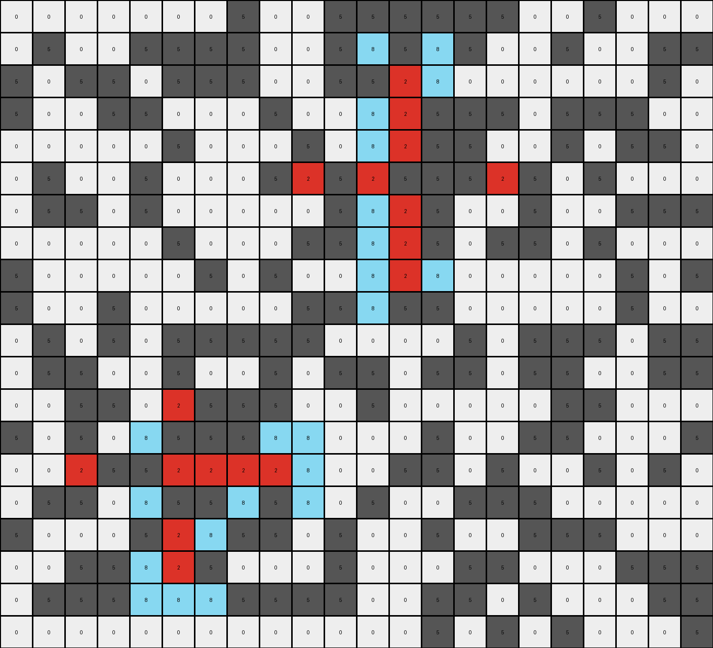

# 50846271 • 023 • refine_dreamer

---

Previous Code:
```python
"""
1.  **Identify Red Crosses:** Locate contiguous regions of red (2) pixels forming a "cross" shape. A cross is defined by a central red pixel with four red pixels directly adjacent to it (above, below, left, and right). However, partial crosses (where one or more arms are missing) are also considered.
2.  **Analyze Cross Neighborhood:** For each identified cross (or partial cross):
    *   Examine the eight neighboring positions (including diagonals) around *each* red pixel that is part of the cross.
3.  **Conditional Azure Placement:**
    *   If a neighboring position is empty (0), and placing an azure (8) pixel there would *extend* the cross shape (making it more "complete" or connect it to other nearby red pixels), place an azure pixel at that position.
        * "Extend" means adding a pixel that would make the cross have additional red pixels around it.
        * "Connect" means the azure pixel would connect with two or more separate groups of red cross.
4. **Copy all other pixels:** All pixels from the input that are not part of the modification defined above, are directly copied to the output.
"""

import numpy as np

def find_cross_pixels(grid):
    """Finds all pixels that are part of a cross (or partial cross)."""
    red_pixels = np.argwhere(grid == 2)
    cross_pixels = []

    for r, c in red_pixels:
        neighbors = 0
        if r > 0 and grid[r-1, c] == 2:  # Above
            neighbors += 1
        if r < grid.shape[0] - 1 and grid[r+1, c] == 2:  # Below
            neighbors += 1
        if c > 0 and grid[r, c-1] == 2:  # Left
            neighbors += 1
        if c < grid.shape[1] - 1 and grid[r, c+1] == 2:  # Right
            neighbors += 1

        if neighbors > 0:  # Part of a cross (even if partial)
            cross_pixels.append((r, c))
    return cross_pixels


def get_neighbors(grid, r, c):
    """Gets the 8 neighbors (including diagonals) of a pixel."""
    neighbors = []
    for i in range(-1, 2):
        for j in range(-1, 2):
            if i == 0 and j == 0:
                continue
            nr, nc = r + i, c + j
            if 0 <= nr < grid.shape[0] and 0 <= nc < grid.shape[1]:
                neighbors.append((nr, nc))
    return neighbors

def should_place_azure(grid, r, c, cross_pixels):
    """Checks if an azure pixel should be placed at (r, c)."""

    if grid[r,c] != 0:
        return False
    
    neighbor_count = 0
    for nr, nc in get_neighbors(grid, r, c):
        if (nr, nc) in cross_pixels:
             neighbor_count += 1
    
    if neighbor_count >= 1:
        return True

    return False

def transform(input_grid):
    # Initialize output_grid as a copy of the input_grid
    output_grid = np.copy(input_grid)

    # Find all pixels that are part of a cross (or partial cross)
    cross_pixels = find_cross_pixels(input_grid)

    # Analyze neighborhood and place azure pixels
    for r, c in cross_pixels:
        for nr, nc in get_neighbors(input_grid, r, c):
            if should_place_azure(input_grid, nr, nc, cross_pixels):
                output_grid[nr, nc] = 8

    return output_grid
```

Train Set Results:

## Example 1:

Input:
```
0 0 0 0 0 0 0 5 0 0 5 5 5 5 5 5 0 0 5 0 0 0
0 5 0 0 5 5 5 5 0 0 5 0 5 0 5 0 0 5 0 0 5 5
5 0 5 5 0 5 5 5 0 0 5 5 2 0 0 0 0 0 0 0 5 0
5 0 0 5 5 0 0 0 5 0 0 0 2 5 5 5 0 5 5 5 0 0
0 0 0 0 0 5 0 0 0 5 0 0 2 5 5 0 0 5 0 5 5 0
0 5 0 0 5 0 0 0 5 2 5 2 5 5 5 2 5 0 5 0 0 0
0 5 5 0 5 0 0 0 0 0 5 0 2 5 0 0 5 0 0 5 5 5
0 0 0 0 0 5 0 0 0 5 5 0 2 5 0 5 5 0 5 0 0 0
5 0 0 0 0 0 5 0 5 0 0 0 2 0 0 0 0 0 0 5 0 5
5 0 0 5 0 0 0 0 0 5 5 0 5 5 0 0 0 0 0 5 0 0
0 5 0 5 0 5 5 5 5 5 0 0 0 0 5 0 5 5 5 0 5 5
0 5 5 0 0 5 0 0 5 0 5 5 0 5 5 0 5 5 0 0 5 5
0 0 5 5 0 2 5 5 5 0 0 5 0 0 0 0 0 5 5 0 0 0
5 0 5 0 0 5 5 5 0 0 0 0 0 5 0 0 5 5 0 0 0 5
0 0 2 5 5 2 2 2 2 0 0 0 5 5 0 5 0 0 5 0 5 0
0 5 5 0 0 5 5 0 5 0 0 5 0 0 5 5 5 0 0 0 0 0
5 0 0 0 5 2 0 5 5 0 5 0 0 5 0 0 5 5 5 0 0 0
0 0 5 5 0 2 5 0 0 0 5 0 0 0 5 5 0 0 0 5 5 5
0 5 5 5 0 0 0 5 5 5 5 0 0 5 5 0 5 0 0 0 5 5
0 0 0 0 0 0 0 0 0 0 0 0 0 5 0 5 0 5 0 0 0 5
```
Expected Output:
```
0 0 0 0 0 0 0 5 0 0 5 5 5 5 5 5 0 0 5 0 0 0
0 5 0 0 5 5 5 5 0 0 5 0 5 0 5 0 0 5 0 0 5 5
5 0 5 5 0 5 5 5 0 0 5 5 2 0 0 0 0 0 0 0 5 0
5 0 0 5 5 0 0 0 5 0 0 0 2 5 5 5 0 5 5 5 0 0
0 0 0 0 0 5 0 0 0 5 0 0 2 5 5 0 0 5 0 5 5 0
0 5 0 0 5 0 0 0 5 2 8 2 8 8 8 2 5 0 5 0 0 0
0 5 5 0 5 0 0 0 0 0 5 0 2 5 0 0 5 0 0 5 5 5
0 0 0 0 0 5 0 0 0 5 5 0 2 5 0 5 5 0 5 0 0 0
5 0 0 0 0 0 5 0 5 0 0 0 2 0 0 0 0 0 0 5 0 5
5 0 0 5 0 0 0 0 0 5 5 0 5 5 0 0 0 0 0 5 0 0
0 5 0 5 0 5 5 5 5 5 0 0 0 0 5 0 5 5 5 0 5 5
0 5 5 0 0 8 0 0 5 0 5 5 0 5 5 0 5 5 0 0 5 5
0 0 5 5 0 2 5 5 5 0 0 5 0 0 0 0 0 5 5 0 0 0
5 0 5 0 0 8 5 5 0 0 0 0 0 5 0 0 5 5 0 0 0 5
0 0 2 8 8 2 2 2 2 0 0 0 5 5 0 5 0 0 5 0 5 0
0 5 5 0 0 8 5 0 5 0 0 5 0 0 5 5 5 0 0 0 0 0
5 0 0 0 5 2 0 5 5 0 5 0 0 5 0 0 5 5 5 0 0 0
0 0 5 5 0 2 5 0 0 0 5 0 0 0 5 5 0 0 0 5 5 5
0 5 5 5 0 0 0 5 5 5 5 0 0 5 5 0 5 0 0 0 5 5
0 0 0 0 0 0 0 0 0 0 0 0 0 5 0 5 0 5 0 0 0 5
```
Transformed Output:
```
0 0 0 0 0 0 0 5 0 0 5 5 5 5 5 5 0 0 5 0 0 0
0 5 0 0 5 5 5 5 0 0 5 8 5 8 5 0 0 5 0 0 5 5
5 0 5 5 0 5 5 5 0 0 5 5 2 8 0 0 0 0 0 0 5 0
5 0 0 5 5 0 0 0 5 0 0 8 2 5 5 5 0 5 5 5 0 0
0 0 0 0 0 5 0 0 0 5 0 8 2 5 5 0 0 5 0 5 5 0
0 5 0 0 5 0 0 0 5 2 5 2 5 5 5 2 5 0 5 0 0 0
0 5 5 0 5 0 0 0 0 0 5 8 2 5 0 0 5 0 0 5 5 5
0 0 0 0 0 5 0 0 0 5 5 8 2 5 0 5 5 0 5 0 0 0
5 0 0 0 0 0 5 0 5 0 0 8 2 8 0 0 0 0 0 5 0 5
5 0 0 5 0 0 0 0 0 5 5 8 5 5 0 0 0 0 0 5 0 0
0 5 0 5 0 5 5 5 5 5 0 0 0 0 5 0 5 5 5 0 5 5
0 5 5 0 0 5 0 0 5 0 5 5 0 5 5 0 5 5 0 0 5 5
0 0 5 5 0 2 5 5 5 0 0 5 0 0 0 0 0 5 5 0 0 0
5 0 5 0 8 5 5 5 8 8 0 0 0 5 0 0 5 5 0 0 0 5
0 0 2 5 5 2 2 2 2 8 0 0 5 5 0 5 0 0 5 0 5 0
0 5 5 0 8 5 5 8 5 8 0 5 0 0 5 5 5 0 0 0 0 0
5 0 0 0 5 2 8 5 5 0 5 0 0 5 0 0 5 5 5 0 0 0
0 0 5 5 8 2 5 0 0 0 5 0 0 0 5 5 0 0 0 5 5 5
0 5 5 5 8 8 8 5 5 5 5 0 0 5 5 0 5 0 0 0 5 5
0 0 0 0 0 0 0 0 0 0 0 0 0 5 0 5 0 5 0 0 0 5
```

match: False
pixels_off: 31
size_correct: True
color_palette_correct: True
correct_pixel_counts: False

## Example 2:

Input:
```
0 5 0 5 0 0 0 5 5 0 5 5 0 0 0 5 5 0 5 5
5 5 0 5 5 5 0 5 5 0 5 0 0 5 0 0 0 5 5 0
0 5 0 5 5 0 5 5 0 5 0 0 5 0 0 5 0 0 5 5
5 0 0 5 5 0 2 5 0 5 0 5 0 0 0 5 5 5 5 5
0 5 0 5 2 5 2 2 2 0 5 5 0 5 0 5 5 0 0 0
5 5 0 0 5 5 2 5 5 5 0 5 0 0 5 5 0 0 0 0
0 0 5 5 0 0 5 5 0 0 5 5 0 0 5 0 0 5 0 5
0 0 0 5 0 5 0 5 5 5 0 5 5 5 0 0 5 5 0 5
5 0 0 0 5 0 0 5 5 5 5 0 5 5 5 0 0 5 0 5
5 0 0 5 0 5 5 5 0 5 5 0 5 0 5 5 5 5 5 5
5 0 5 5 0 5 5 5 5 5 0 5 2 5 2 2 2 0 0 5
0 0 5 0 0 0 0 0 0 5 5 5 0 0 5 0 0 5 0 5
0 0 5 0 0 5 0 5 5 0 5 5 5 5 5 5 5 5 5 0
5 5 0 0 5 5 0 5 0 0 5 5 5 0 0 0 0 0 0 0
5 5 0 0 0 5 5 5 0 5 5 0 5 5 5 5 0 0 5 5
0 0 5 0 5 5 5 2 2 5 5 0 0 5 0 0 5 5 0 0
0 5 5 0 0 5 5 2 5 0 5 5 0 0 5 0 5 5 0 0
0 0 5 0 5 0 5 5 0 5 5 5 0 0 5 0 0 0 5 0
0 0 5 0 5 5 0 5 5 5 0 5 5 5 0 5 0 0 5 5
5 5 5 0 5 0 5 0 5 5 0 0 5 5 0 0 0 0 0 5
```
Expected Output:
```
0 5 0 5 0 0 0 5 5 0 5 5 0 0 0 5 5 0 5 5
5 5 0 5 5 5 0 5 5 0 5 0 0 5 0 0 0 5 5 0
0 5 0 5 5 0 8 5 0 5 0 0 5 0 0 5 0 0 5 5
5 0 0 5 5 0 2 5 0 5 0 5 0 0 0 5 5 5 5 5
0 5 0 5 2 8 2 2 2 0 5 5 0 5 0 5 5 0 0 0
5 5 0 0 5 5 2 5 5 5 0 5 0 0 5 5 0 0 0 0
0 0 5 5 0 0 8 5 0 0 5 5 0 0 5 0 0 5 0 5
0 0 0 5 0 5 0 5 5 5 0 5 5 5 0 0 5 5 0 5
5 0 0 0 5 0 0 5 5 5 5 0 5 5 8 0 0 5 0 5
5 0 0 5 0 5 5 5 0 5 5 0 5 0 8 5 5 5 5 5
5 0 5 5 0 5 5 5 5 5 0 5 2 8 2 2 2 0 0 5
0 0 5 0 0 0 0 0 0 5 5 5 0 0 8 0 0 5 0 5
0 0 5 0 0 5 0 5 5 0 5 5 5 5 8 5 5 5 5 0
5 5 0 0 5 5 0 8 0 0 5 5 5 0 0 0 0 0 0 0
5 5 0 0 0 5 5 8 0 5 5 0 5 5 5 5 0 0 5 5
0 0 5 0 5 8 8 2 2 8 5 0 0 5 0 0 5 5 0 0
0 5 5 0 0 5 5 2 5 0 5 5 0 0 5 0 5 5 0 0
0 0 5 0 5 0 5 8 0 5 5 5 0 0 5 0 0 0 5 0
0 0 5 0 5 5 0 5 5 5 0 5 5 5 0 5 0 0 5 5
5 5 5 0 5 0 5 0 5 5 0 0 5 5 0 0 0 0 0 5
```
Transformed Output:
```
0 5 0 5 0 0 0 5 5 0 5 5 0 0 0 5 5 0 5 5
5 5 0 5 5 5 0 5 5 0 5 0 0 5 0 0 0 5 5 0
0 5 0 5 5 8 5 5 0 5 0 0 5 0 0 5 0 0 5 5
5 0 0 5 5 8 2 5 8 5 0 5 0 0 0 5 5 5 5 5
0 5 0 5 2 5 2 2 2 8 5 5 0 5 0 5 5 0 0 0
5 5 0 0 5 5 2 5 5 5 0 5 0 0 5 5 0 0 0 0
0 0 5 5 0 8 5 5 0 0 5 5 0 0 5 0 0 5 0 5
0 0 0 5 0 5 0 5 5 5 0 5 5 5 0 0 5 5 0 5
5 0 0 0 5 0 0 5 5 5 5 0 5 5 5 0 0 5 0 5
5 0 0 5 0 5 5 5 0 5 5 0 5 8 5 5 5 5 5 5
5 0 5 5 0 5 5 5 5 5 0 5 2 5 2 2 2 8 0 5
0 0 5 0 0 0 0 0 0 5 5 5 0 8 5 8 8 5 0 5
0 0 5 0 0 5 0 5 5 0 5 5 5 5 5 5 5 5 5 0
5 5 0 0 5 5 0 5 0 0 5 5 5 0 0 0 0 0 0 0
5 5 0 0 0 5 5 5 8 5 5 0 5 5 5 5 0 0 5 5
0 0 5 0 5 5 5 2 2 5 5 0 0 5 0 0 5 5 0 0
0 5 5 0 0 5 5 2 5 8 5 5 0 0 5 0 5 5 0 0
0 0 5 0 5 0 5 5 8 5 5 5 0 0 5 0 0 0 5 0
0 0 5 0 5 5 0 5 5 5 0 5 5 5 0 5 0 0 5 5
5 5 5 0 5 0 5 0 5 5 0 0 5 5 0 0 0 0 0 5
```

match: False
pixels_off: 27
size_correct: True
color_palette_correct: True
correct_pixel_counts: False

## Example 3:

Input:
```
0 0 5 0 5 0 5 5 5 5 0 5 5 0 0 0 5 5 0
0 0 5 5 5 0 5 5 5 5 0 0 5 5 5 5 5 0 5
0 5 5 5 0 5 0 5 5 0 0 0 5 5 5 0 5 0 0
5 5 5 5 5 0 0 0 5 5 5 5 5 5 0 0 5 0 0
5 5 0 0 0 5 5 5 0 5 5 5 5 0 0 0 5 0 0
5 0 0 0 0 0 5 0 5 0 5 2 5 0 0 5 0 5 5
5 0 5 0 0 5 5 0 5 2 2 5 2 2 5 5 0 5 0
0 5 0 5 5 5 5 5 0 5 0 5 5 5 5 0 5 5 5
5 5 5 0 5 5 5 5 0 0 5 2 5 5 5 0 0 0 0
5 2 2 5 0 0 5 0 0 5 5 5 5 5 5 5 5 0 0
5 2 5 5 5 0 0 5 5 5 5 0 0 5 5 5 5 0 5
0 2 5 0 5 5 0 0 5 5 5 5 5 0 5 5 5 5 0
0 5 0 0 5 5 0 0 5 5 0 0 5 0 0 5 0 0 0
5 0 0 5 5 5 5 5 0 0 5 5 5 0 5 5 5 0 5
0 5 5 5 0 0 5 0 0 0 5 0 5 5 5 5 0 0 0
5 5 0 0 5 5 5 5 0 5 5 0 5 0 5 0 0 0 0
5 0 5 0 5 0 0 0 0 0 0 5 0 0 5 0 5 0 5
0 5 5 0 5 0 0 0 0 0 5 0 0 5 0 5 5 5 5
```
Expected Output:
```
0 0 5 0 5 0 5 5 5 5 0 5 5 0 0 0 5 5 0
0 0 5 5 5 0 5 5 5 5 0 0 5 5 5 5 5 0 5
0 5 5 5 0 5 0 5 5 0 0 0 5 5 5 0 5 0 0
5 5 5 5 5 0 0 0 5 5 5 5 5 5 0 0 5 0 0
5 5 0 0 0 5 5 5 0 5 5 8 5 0 0 0 5 0 0
5 0 0 0 0 0 5 0 5 0 5 2 5 0 0 5 0 5 5
5 0 5 0 0 5 5 0 5 2 2 8 2 2 5 5 0 5 0
0 8 0 5 5 5 5 5 0 5 0 8 5 5 5 0 5 5 5
5 8 5 0 5 5 5 5 0 0 5 2 5 5 5 0 0 0 0
8 2 2 8 0 0 5 0 0 5 5 5 5 5 5 5 5 0 0
5 2 5 5 5 0 0 5 5 5 5 0 0 5 5 5 5 0 5
0 2 5 0 5 5 0 0 5 5 5 5 5 0 5 5 5 5 0
0 5 0 0 5 5 0 0 5 5 0 0 5 0 0 5 0 0 0
5 0 0 5 5 5 5 5 0 0 5 5 5 0 5 5 5 0 5
0 5 5 5 0 0 5 0 0 0 5 0 5 5 5 5 0 0 0
5 5 0 0 5 5 5 5 0 5 5 0 5 0 5 0 0 0 0
5 0 5 0 5 0 0 0 0 0 0 5 0 0 5 0 5 0 5
0 5 5 0 5 0 0 0 0 0 5 0 0 5 0 5 5 5 5
```
Transformed Output:
```
0 0 5 0 5 0 5 5 5 5 0 5 5 0 0 0 5 5 0
0 0 5 5 5 0 5 5 5 5 0 0 5 5 5 5 5 0 5
0 5 5 5 0 5 0 5 5 0 0 0 5 5 5 0 5 0 0
5 5 5 5 5 0 0 0 5 5 5 5 5 5 0 0 5 0 0
5 5 0 0 0 5 5 5 0 5 5 5 5 0 0 0 5 0 0
5 0 0 0 0 0 5 0 5 8 5 2 5 8 8 5 0 5 5
5 0 5 0 0 5 5 0 5 2 2 5 2 2 5 5 0 5 0
0 5 0 5 5 5 5 5 8 5 8 5 5 5 5 0 5 5 5
5 5 5 8 5 5 5 5 0 0 5 2 5 5 5 0 0 0 0
5 2 2 5 0 0 5 0 0 5 5 5 5 5 5 5 5 0 0
5 2 5 5 5 0 0 5 5 5 5 0 0 5 5 5 5 0 5
8 2 5 0 5 5 0 0 5 5 5 5 5 0 5 5 5 5 0
8 5 8 0 5 5 0 0 5 5 0 0 5 0 0 5 0 0 0
5 0 0 5 5 5 5 5 0 0 5 5 5 0 5 5 5 0 5
0 5 5 5 0 0 5 0 0 0 5 0 5 5 5 5 0 0 0
5 5 0 0 5 5 5 5 0 5 5 0 5 0 5 0 0 0 0
5 0 5 0 5 0 0 0 0 0 0 5 0 0 5 0 5 0 5
0 5 5 0 5 0 0 0 0 0 5 0 0 5 0 5 5 5 5
```

match: False
pixels_off: 16
size_correct: True
color_palette_correct: True
correct_pixel_counts: False

## Example 4:

Input:
```
0 5 0 0 0 0 5 0 0 0 0 5
5 0 5 0 0 0 0 0 5 0 0 5
5 0 5 0 0 5 5 0 2 0 5 0
5 5 0 0 5 0 5 0 2 5 0 5
5 0 0 5 5 5 2 5 2 2 2 0
5 5 5 0 5 5 0 5 2 0 0 5
5 5 5 0 5 0 0 5 5 0 0 0
5 0 0 0 0 5 0 0 0 0 0 0
0 5 5 0 5 0 0 0 0 5 0 0
5 0 0 0 5 5 5 5 5 0 0 0
5 0 0 0 0 5 0 0 5 5 5 5
```
Expected Output:
```
0 5 0 0 0 0 5 0 0 0 0 5
5 0 5 0 0 0 0 0 5 0 0 5
5 0 5 0 0 5 5 0 2 0 5 0
5 5 0 0 5 0 5 0 2 5 0 5
5 0 0 5 5 5 2 8 2 2 2 0
5 5 5 0 5 5 0 5 2 0 0 5
5 5 5 0 5 0 0 5 8 0 0 0
5 0 0 0 0 5 0 0 0 0 0 0
0 5 5 0 5 0 0 0 0 5 0 0
5 0 0 0 5 5 5 5 5 0 0 0
5 0 0 0 0 5 0 0 5 5 5 5
```
Transformed Output:
```
0 5 0 0 0 0 5 0 0 0 0 5
5 0 5 0 0 0 0 8 5 8 0 5
5 0 5 0 0 5 5 8 2 8 5 0
5 5 0 0 5 0 5 8 2 5 8 5
5 0 0 5 5 5 2 5 2 2 2 8
5 5 5 0 5 5 0 5 2 8 8 5
5 5 5 0 5 0 0 5 5 8 0 0
5 0 0 0 0 5 0 0 0 0 0 0
0 5 5 0 5 0 0 0 0 5 0 0
5 0 0 0 5 5 5 5 5 0 0 0
5 0 0 0 0 5 0 0 5 5 5 5
```

match: False
pixels_off: 12
size_correct: True
color_palette_correct: True
correct_pixel_counts: False
**INSTRUCTIONS**

The code above was generated based on observations from the first training
example

we have tested the transform function on each of the task example inputs and
compared with the expected output

review each of the examples provided and the results and consider how the
natural language program should be updated to accommodate this new knowledge

respond with the following deliverables:

- general assessment of the information provided and strategy for resolving the
  errors
- gather metrics about each of the examples and results - use code_execution to
  develop accurate reports on your assumptions
- a YAML block documenting facts - Focus on identifying objects, their properties, and the actions performed on them.
- a natural language program - Be as clear and concise as possible, providing a complete description of the transformation rule.


your responses should be considered as information in a report - not a
conversation
