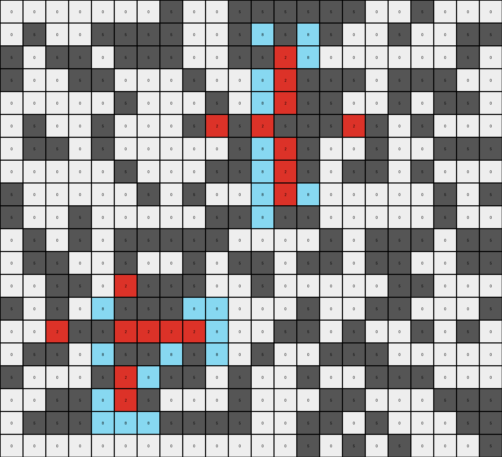
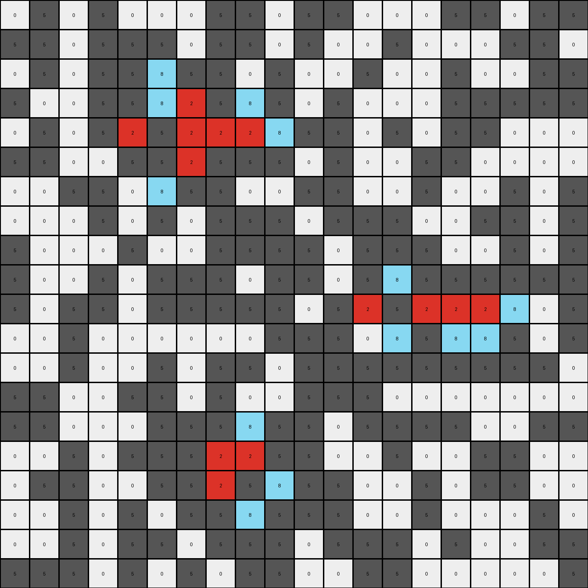
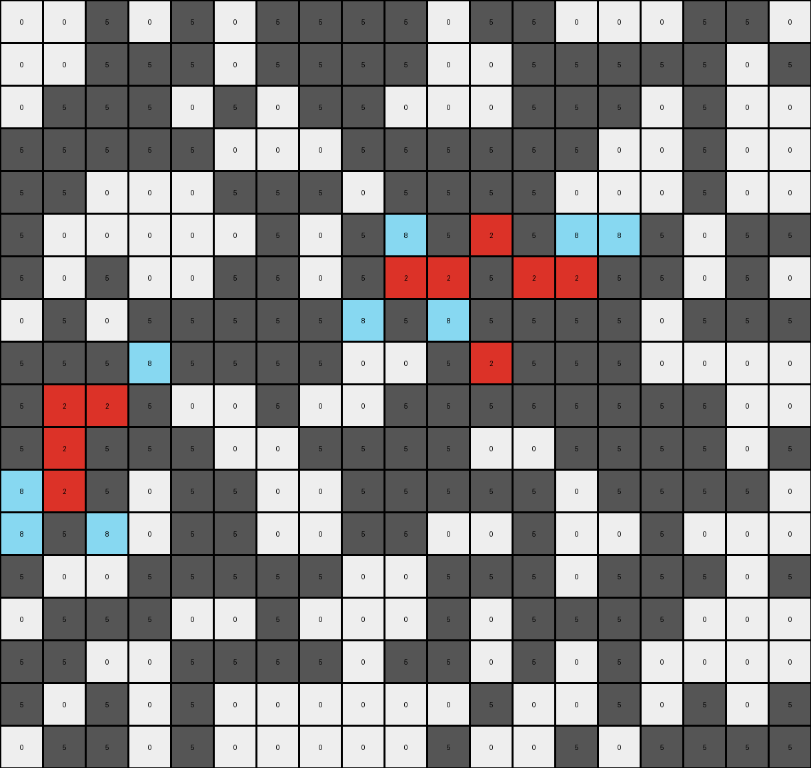

# 50846271 • 024 • refine_coder

---

Previous Code:
```python
"""
1.  **Identify Red Crosses:** Locate contiguous regions of red (2) pixels forming a "cross" shape. A cross is defined by a central red pixel with four red pixels directly adjacent to it (above, below, left, and right). However, partial crosses (where one or more arms are missing) are also considered.
2.  **Analyze Cross Neighborhood:** For each identified cross (or partial cross):
    *   Examine the eight neighboring positions (including diagonals) around *each* red pixel that is part of the cross.
3.  **Conditional Azure Placement:**
    *   If a neighboring position is empty (0), and placing an azure (8) pixel there would *extend* the cross shape (making it more "complete" or connect it to other nearby red pixels), place an azure pixel at that position.
        * "Extend" means adding a pixel that would make the cross have additional red pixels around it.
        * "Connect" means the azure pixel would connect with two or more separate groups of red cross.
4. **Copy all other pixels:** All pixels from the input that are not part of the modification defined above, are directly copied to the output.
"""

import numpy as np

def find_cross_pixels(grid):
    """Finds all pixels that are part of a cross (or partial cross)."""
    red_pixels = np.argwhere(grid == 2)
    cross_pixels = []

    for r, c in red_pixels:
        neighbors = 0
        if r > 0 and grid[r-1, c] == 2:  # Above
            neighbors += 1
        if r < grid.shape[0] - 1 and grid[r+1, c] == 2:  # Below
            neighbors += 1
        if c > 0 and grid[r, c-1] == 2:  # Left
            neighbors += 1
        if c < grid.shape[1] - 1 and grid[r, c+1] == 2:  # Right
            neighbors += 1

        if neighbors > 0:  # Part of a cross (even if partial)
            cross_pixels.append((r, c))
    return cross_pixels


def get_neighbors(grid, r, c):
    """Gets the 8 neighbors (including diagonals) of a pixel."""
    neighbors = []
    for i in range(-1, 2):
        for j in range(-1, 2):
            if i == 0 and j == 0:
                continue
            nr, nc = r + i, c + j
            if 0 <= nr < grid.shape[0] and 0 <= nc < grid.shape[1]:
                neighbors.append((nr, nc))
    return neighbors

def should_place_azure(grid, r, c, cross_pixels):
    """Checks if an azure pixel should be placed at (r, c)."""

    if grid[r,c] != 0:
        return False
    
    neighbor_count = 0
    for nr, nc in get_neighbors(grid, r, c):
        if (nr, nc) in cross_pixels:
             neighbor_count += 1
    
    if neighbor_count >= 1:
        return True

    return False

def transform(input_grid):
    # Initialize output_grid as a copy of the input_grid
    output_grid = np.copy(input_grid)

    # Find all pixels that are part of a cross (or partial cross)
    cross_pixels = find_cross_pixels(input_grid)

    # Analyze neighborhood and place azure pixels
    for r, c in cross_pixels:
        for nr, nc in get_neighbors(input_grid, r, c):
            if should_place_azure(input_grid, nr, nc, cross_pixels):
                output_grid[nr, nc] = 8

    return output_grid
```

Train Set Results:

## Example 1:

Input:
```
0 0 0 0 0 0 0 5 0 0 5 5 5 5 5 5 0 0 5 0 0 0
0 5 0 0 5 5 5 5 0 0 5 0 5 0 5 0 0 5 0 0 5 5
5 0 5 5 0 5 5 5 0 0 5 5 2 0 0 0 0 0 0 0 5 0
5 0 0 5 5 0 0 0 5 0 0 0 2 5 5 5 0 5 5 5 0 0
0 0 0 0 0 5 0 0 0 5 0 0 2 5 5 0 0 5 0 5 5 0
0 5 0 0 5 0 0 0 5 2 5 2 5 5 5 2 5 0 5 0 0 0
0 5 5 0 5 0 0 0 0 0 5 0 2 5 0 0 5 0 0 5 5 5
0 0 0 0 0 5 0 0 0 5 5 0 2 5 0 5 5 0 5 0 0 0
5 0 0 0 0 0 5 0 5 0 0 0 2 0 0 0 0 0 0 5 0 5
5 0 0 5 0 0 0 0 0 5 5 0 5 5 0 0 0 0 0 5 0 0
0 5 0 5 0 5 5 5 5 5 0 0 0 0 5 0 5 5 5 0 5 5
0 5 5 0 0 5 0 0 5 0 5 5 0 5 5 0 5 5 0 0 5 5
0 0 5 5 0 2 5 5 5 0 0 5 0 0 0 0 0 5 5 0 0 0
5 0 5 0 0 5 5 5 0 0 0 0 0 5 0 0 5 5 0 0 0 5
0 0 2 5 5 2 2 2 2 0 0 0 5 5 0 5 0 0 5 0 5 0
0 5 5 0 0 5 5 0 5 0 0 5 0 0 5 5 5 0 0 0 0 0
5 0 0 0 5 2 0 5 5 0 5 0 0 5 0 0 5 5 5 0 0 0
0 0 5 5 0 2 5 0 0 0 5 0 0 0 5 5 0 0 0 5 5 5
0 5 5 5 0 0 0 5 5 5 5 0 0 5 5 0 5 0 0 0 5 5
0 0 0 0 0 0 0 0 0 0 0 0 0 5 0 5 0 5 0 0 0 5
```
Expected Output:
```
0 0 0 0 0 0 0 5 0 0 5 5 5 5 5 5 0 0 5 0 0 0
0 5 0 0 5 5 5 5 0 0 5 0 5 0 5 0 0 5 0 0 5 5
5 0 5 5 0 5 5 5 0 0 5 5 2 0 0 0 0 0 0 0 5 0
5 0 0 5 5 0 0 0 5 0 0 0 2 5 5 5 0 5 5 5 0 0
0 0 0 0 0 5 0 0 0 5 0 0 2 5 5 0 0 5 0 5 5 0
0 5 0 0 5 0 0 0 5 2 8 2 8 8 8 2 5 0 5 0 0 0
0 5 5 0 5 0 0 0 0 0 5 0 2 5 0 0 5 0 0 5 5 5
0 0 0 0 0 5 0 0 0 5 5 0 2 5 0 5 5 0 5 0 0 0
5 0 0 0 0 0 5 0 5 0 0 0 2 0 0 0 0 0 0 5 0 5
5 0 0 5 0 0 0 0 0 5 5 0 5 5 0 0 0 0 0 5 0 0
0 5 0 5 0 5 5 5 5 5 0 0 0 0 5 0 5 5 5 0 5 5
0 5 5 0 0 8 0 0 5 0 5 5 0 5 5 0 5 5 0 0 5 5
0 0 5 5 0 2 5 5 5 0 0 5 0 0 0 0 0 5 5 0 0 0
5 0 5 0 0 8 5 5 0 0 0 0 0 5 0 0 5 5 0 0 0 5
0 0 2 8 8 2 2 2 2 0 0 0 5 5 0 5 0 0 5 0 5 0
0 5 5 0 0 8 5 0 5 0 0 5 0 0 5 5 5 0 0 0 0 0
5 0 0 0 5 2 0 5 5 0 5 0 0 5 0 0 5 5 5 0 0 0
0 0 5 5 0 2 5 0 0 0 5 0 0 0 5 5 0 0 0 5 5 5
0 5 5 5 0 0 0 5 5 5 5 0 0 5 5 0 5 0 0 0 5 5
0 0 0 0 0 0 0 0 0 0 0 0 0 5 0 5 0 5 0 0 0 5
```
Transformed Output:
```
0 0 0 0 0 0 0 5 0 0 5 5 5 5 5 5 0 0 5 0 0 0
0 5 0 0 5 5 5 5 0 0 5 8 5 8 5 0 0 5 0 0 5 5
5 0 5 5 0 5 5 5 0 0 5 5 2 8 0 0 0 0 0 0 5 0
5 0 0 5 5 0 0 0 5 0 0 8 2 5 5 5 0 5 5 5 0 0
0 0 0 0 0 5 0 0 0 5 0 8 2 5 5 0 0 5 0 5 5 0
0 5 0 0 5 0 0 0 5 2 5 2 5 5 5 2 5 0 5 0 0 0
0 5 5 0 5 0 0 0 0 0 5 8 2 5 0 0 5 0 0 5 5 5
0 0 0 0 0 5 0 0 0 5 5 8 2 5 0 5 5 0 5 0 0 0
5 0 0 0 0 0 5 0 5 0 0 8 2 8 0 0 0 0 0 5 0 5
5 0 0 5 0 0 0 0 0 5 5 8 5 5 0 0 0 0 0 5 0 0
0 5 0 5 0 5 5 5 5 5 0 0 0 0 5 0 5 5 5 0 5 5
0 5 5 0 0 5 0 0 5 0 5 5 0 5 5 0 5 5 0 0 5 5
0 0 5 5 0 2 5 5 5 0 0 5 0 0 0 0 0 5 5 0 0 0
5 0 5 0 8 5 5 5 8 8 0 0 0 5 0 0 5 5 0 0 0 5
0 0 2 5 5 2 2 2 2 8 0 0 5 5 0 5 0 0 5 0 5 0
0 5 5 0 8 5 5 8 5 8 0 5 0 0 5 5 5 0 0 0 0 0
5 0 0 0 5 2 8 5 5 0 5 0 0 5 0 0 5 5 5 0 0 0
0 0 5 5 8 2 5 0 0 0 5 0 0 0 5 5 0 0 0 5 5 5
0 5 5 5 8 8 8 5 5 5 5 0 0 5 5 0 5 0 0 0 5 5
0 0 0 0 0 0 0 0 0 0 0 0 0 5 0 5 0 5 0 0 0 5
```

match: False
pixels_off: 31
size_correct: True
color_palette_correct: True
correct_pixel_counts: False

## Example 2:

Input:
```
0 5 0 5 0 0 0 5 5 0 5 5 0 0 0 5 5 0 5 5
5 5 0 5 5 5 0 5 5 0 5 0 0 5 0 0 0 5 5 0
0 5 0 5 5 0 5 5 0 5 0 0 5 0 0 5 0 0 5 5
5 0 0 5 5 0 2 5 0 5 0 5 0 0 0 5 5 5 5 5
0 5 0 5 2 5 2 2 2 0 5 5 0 5 0 5 5 0 0 0
5 5 0 0 5 5 2 5 5 5 0 5 0 0 5 5 0 0 0 0
0 0 5 5 0 0 5 5 0 0 5 5 0 0 5 0 0 5 0 5
0 0 0 5 0 5 0 5 5 5 0 5 5 5 0 0 5 5 0 5
5 0 0 0 5 0 0 5 5 5 5 0 5 5 5 0 0 5 0 5
5 0 0 5 0 5 5 5 0 5 5 0 5 0 5 5 5 5 5 5
5 0 5 5 0 5 5 5 5 5 0 5 2 5 2 2 2 0 0 5
0 0 5 0 0 0 0 0 0 5 5 5 0 0 5 0 0 5 0 5
0 0 5 0 0 5 0 5 5 0 5 5 5 5 5 5 5 5 5 0
5 5 0 0 5 5 0 5 0 0 5 5 5 0 0 0 0 0 0 0
5 5 0 0 0 5 5 5 0 5 5 0 5 5 5 5 0 0 5 5
0 0 5 0 5 5 5 2 2 5 5 0 0 5 0 0 5 5 0 0
0 5 5 0 0 5 5 2 5 0 5 5 0 0 5 0 5 5 0 0
0 0 5 0 5 0 5 5 0 5 5 5 0 0 5 0 0 0 5 0
0 0 5 0 5 5 0 5 5 5 0 5 5 5 0 5 0 0 5 5
5 5 5 0 5 0 5 0 5 5 0 0 5 5 0 0 0 0 0 5
```
Expected Output:
```
0 5 0 5 0 0 0 5 5 0 5 5 0 0 0 5 5 0 5 5
5 5 0 5 5 5 0 5 5 0 5 0 0 5 0 0 0 5 5 0
0 5 0 5 5 0 8 5 0 5 0 0 5 0 0 5 0 0 5 5
5 0 0 5 5 0 2 5 0 5 0 5 0 0 0 5 5 5 5 5
0 5 0 5 2 8 2 2 2 0 5 5 0 5 0 5 5 0 0 0
5 5 0 0 5 5 2 5 5 5 0 5 0 0 5 5 0 0 0 0
0 0 5 5 0 0 8 5 0 0 5 5 0 0 5 0 0 5 0 5
0 0 0 5 0 5 0 5 5 5 0 5 5 5 0 0 5 5 0 5
5 0 0 0 5 0 0 5 5 5 5 0 5 5 8 0 0 5 0 5
5 0 0 5 0 5 5 5 0 5 5 0 5 0 8 5 5 5 5 5
5 0 5 5 0 5 5 5 5 5 0 5 2 8 2 2 2 0 0 5
0 0 5 0 0 0 0 0 0 5 5 5 0 0 8 0 0 5 0 5
0 0 5 0 0 5 0 5 5 0 5 5 5 5 8 5 5 5 5 0
5 5 0 0 5 5 0 8 0 0 5 5 5 0 0 0 0 0 0 0
5 5 0 0 0 5 5 8 0 5 5 0 5 5 5 5 0 0 5 5
0 0 5 0 5 8 8 2 2 8 5 0 0 5 0 0 5 5 0 0
0 5 5 0 0 5 5 2 5 0 5 5 0 0 5 0 5 5 0 0
0 0 5 0 5 0 5 8 0 5 5 5 0 0 5 0 0 0 5 0
0 0 5 0 5 5 0 5 5 5 0 5 5 5 0 5 0 0 5 5
5 5 5 0 5 0 5 0 5 5 0 0 5 5 0 0 0 0 0 5
```
Transformed Output:
```
0 5 0 5 0 0 0 5 5 0 5 5 0 0 0 5 5 0 5 5
5 5 0 5 5 5 0 5 5 0 5 0 0 5 0 0 0 5 5 0
0 5 0 5 5 8 5 5 0 5 0 0 5 0 0 5 0 0 5 5
5 0 0 5 5 8 2 5 8 5 0 5 0 0 0 5 5 5 5 5
0 5 0 5 2 5 2 2 2 8 5 5 0 5 0 5 5 0 0 0
5 5 0 0 5 5 2 5 5 5 0 5 0 0 5 5 0 0 0 0
0 0 5 5 0 8 5 5 0 0 5 5 0 0 5 0 0 5 0 5
0 0 0 5 0 5 0 5 5 5 0 5 5 5 0 0 5 5 0 5
5 0 0 0 5 0 0 5 5 5 5 0 5 5 5 0 0 5 0 5
5 0 0 5 0 5 5 5 0 5 5 0 5 8 5 5 5 5 5 5
5 0 5 5 0 5 5 5 5 5 0 5 2 5 2 2 2 8 0 5
0 0 5 0 0 0 0 0 0 5 5 5 0 8 5 8 8 5 0 5
0 0 5 0 0 5 0 5 5 0 5 5 5 5 5 5 5 5 5 0
5 5 0 0 5 5 0 5 0 0 5 5 5 0 0 0 0 0 0 0
5 5 0 0 0 5 5 5 8 5 5 0 5 5 5 5 0 0 5 5
0 0 5 0 5 5 5 2 2 5 5 0 0 5 0 0 5 5 0 0
0 5 5 0 0 5 5 2 5 8 5 5 0 0 5 0 5 5 0 0
0 0 5 0 5 0 5 5 8 5 5 5 0 0 5 0 0 0 5 0
0 0 5 0 5 5 0 5 5 5 0 5 5 5 0 5 0 0 5 5
5 5 5 0 5 0 5 0 5 5 0 0 5 5 0 0 0 0 0 5
```

match: False
pixels_off: 27
size_correct: True
color_palette_correct: True
correct_pixel_counts: False

## Example 3:

Input:
```
0 0 5 0 5 0 5 5 5 5 0 5 5 0 0 0 5 5 0
0 0 5 5 5 0 5 5 5 5 0 0 5 5 5 5 5 0 5
0 5 5 5 0 5 0 5 5 0 0 0 5 5 5 0 5 0 0
5 5 5 5 5 0 0 0 5 5 5 5 5 5 0 0 5 0 0
5 5 0 0 0 5 5 5 0 5 5 5 5 0 0 0 5 0 0
5 0 0 0 0 0 5 0 5 0 5 2 5 0 0 5 0 5 5
5 0 5 0 0 5 5 0 5 2 2 5 2 2 5 5 0 5 0
0 5 0 5 5 5 5 5 0 5 0 5 5 5 5 0 5 5 5
5 5 5 0 5 5 5 5 0 0 5 2 5 5 5 0 0 0 0
5 2 2 5 0 0 5 0 0 5 5 5 5 5 5 5 5 0 0
5 2 5 5 5 0 0 5 5 5 5 0 0 5 5 5 5 0 5
0 2 5 0 5 5 0 0 5 5 5 5 5 0 5 5 5 5 0
0 5 0 0 5 5 0 0 5 5 0 0 5 0 0 5 0 0 0
5 0 0 5 5 5 5 5 0 0 5 5 5 0 5 5 5 0 5
0 5 5 5 0 0 5 0 0 0 5 0 5 5 5 5 0 0 0
5 5 0 0 5 5 5 5 0 5 5 0 5 0 5 0 0 0 0
5 0 5 0 5 0 0 0 0 0 0 5 0 0 5 0 5 0 5
0 5 5 0 5 0 0 0 0 0 5 0 0 5 0 5 5 5 5
```
Expected Output:
```
0 0 5 0 5 0 5 5 5 5 0 5 5 0 0 0 5 5 0
0 0 5 5 5 0 5 5 5 5 0 0 5 5 5 5 5 0 5
0 5 5 5 0 5 0 5 5 0 0 0 5 5 5 0 5 0 0
5 5 5 5 5 0 0 0 5 5 5 5 5 5 0 0 5 0 0
5 5 0 0 0 5 5 5 0 5 5 8 5 0 0 0 5 0 0
5 0 0 0 0 0 5 0 5 0 5 2 5 0 0 5 0 5 5
5 0 5 0 0 5 5 0 5 2 2 8 2 2 5 5 0 5 0
0 8 0 5 5 5 5 5 0 5 0 8 5 5 5 0 5 5 5
5 8 5 0 5 5 5 5 0 0 5 2 5 5 5 0 0 0 0
8 2 2 8 0 0 5 0 0 5 5 5 5 5 5 5 5 0 0
5 2 5 5 5 0 0 5 5 5 5 0 0 5 5 5 5 0 5
0 2 5 0 5 5 0 0 5 5 5 5 5 0 5 5 5 5 0
0 5 0 0 5 5 0 0 5 5 0 0 5 0 0 5 0 0 0
5 0 0 5 5 5 5 5 0 0 5 5 5 0 5 5 5 0 5
0 5 5 5 0 0 5 0 0 0 5 0 5 5 5 5 0 0 0
5 5 0 0 5 5 5 5 0 5 5 0 5 0 5 0 0 0 0
5 0 5 0 5 0 0 0 0 0 0 5 0 0 5 0 5 0 5
0 5 5 0 5 0 0 0 0 0 5 0 0 5 0 5 5 5 5
```
Transformed Output:
```
0 0 5 0 5 0 5 5 5 5 0 5 5 0 0 0 5 5 0
0 0 5 5 5 0 5 5 5 5 0 0 5 5 5 5 5 0 5
0 5 5 5 0 5 0 5 5 0 0 0 5 5 5 0 5 0 0
5 5 5 5 5 0 0 0 5 5 5 5 5 5 0 0 5 0 0
5 5 0 0 0 5 5 5 0 5 5 5 5 0 0 0 5 0 0
5 0 0 0 0 0 5 0 5 8 5 2 5 8 8 5 0 5 5
5 0 5 0 0 5 5 0 5 2 2 5 2 2 5 5 0 5 0
0 5 0 5 5 5 5 5 8 5 8 5 5 5 5 0 5 5 5
5 5 5 8 5 5 5 5 0 0 5 2 5 5 5 0 0 0 0
5 2 2 5 0 0 5 0 0 5 5 5 5 5 5 5 5 0 0
5 2 5 5 5 0 0 5 5 5 5 0 0 5 5 5 5 0 5
8 2 5 0 5 5 0 0 5 5 5 5 5 0 5 5 5 5 0
8 5 8 0 5 5 0 0 5 5 0 0 5 0 0 5 0 0 0
5 0 0 5 5 5 5 5 0 0 5 5 5 0 5 5 5 0 5
0 5 5 5 0 0 5 0 0 0 5 0 5 5 5 5 0 0 0
5 5 0 0 5 5 5 5 0 5 5 0 5 0 5 0 0 0 0
5 0 5 0 5 0 0 0 0 0 0 5 0 0 5 0 5 0 5
0 5 5 0 5 0 0 0 0 0 5 0 0 5 0 5 5 5 5
```

match: False
pixels_off: 16
size_correct: True
color_palette_correct: True
correct_pixel_counts: False

## Example 4:

Input:
```
0 5 0 0 0 0 5 0 0 0 0 5
5 0 5 0 0 0 0 0 5 0 0 5
5 0 5 0 0 5 5 0 2 0 5 0
5 5 0 0 5 0 5 0 2 5 0 5
5 0 0 5 5 5 2 5 2 2 2 0
5 5 5 0 5 5 0 5 2 0 0 5
5 5 5 0 5 0 0 5 5 0 0 0
5 0 0 0 0 5 0 0 0 0 0 0
0 5 5 0 5 0 0 0 0 5 0 0
5 0 0 0 5 5 5 5 5 0 0 0
5 0 0 0 0 5 0 0 5 5 5 5
```
Expected Output:
```
0 5 0 0 0 0 5 0 0 0 0 5
5 0 5 0 0 0 0 0 5 0 0 5
5 0 5 0 0 5 5 0 2 0 5 0
5 5 0 0 5 0 5 0 2 5 0 5
5 0 0 5 5 5 2 8 2 2 2 0
5 5 5 0 5 5 0 5 2 0 0 5
5 5 5 0 5 0 0 5 8 0 0 0
5 0 0 0 0 5 0 0 0 0 0 0
0 5 5 0 5 0 0 0 0 5 0 0
5 0 0 0 5 5 5 5 5 0 0 0
5 0 0 0 0 5 0 0 5 5 5 5
```
Transformed Output:
```
0 5 0 0 0 0 5 0 0 0 0 5
5 0 5 0 0 0 0 8 5 8 0 5
5 0 5 0 0 5 5 8 2 8 5 0
5 5 0 0 5 0 5 8 2 5 8 5
5 0 0 5 5 5 2 5 2 2 2 8
5 5 5 0 5 5 0 5 2 8 8 5
5 5 5 0 5 0 0 5 5 8 0 0
5 0 0 0 0 5 0 0 0 0 0 0
0 5 5 0 5 0 0 0 0 5 0 0
5 0 0 0 5 5 5 5 5 0 0 0
5 0 0 0 0 5 0 0 5 5 5 5
```

match: False
pixels_off: 12
size_correct: True
color_palette_correct: True
correct_pixel_counts: False
Okay, let's analyze the results of the generated code and update the natural language program accordingly.

**General Assessment:**

The initial natural language program and the generated code focused on identifying red "crosses" (or partial crosses) and placing azure pixels adjacent to them to extend the cross shape.  The results show that this approach is partially correct but doesn't fully capture the nuances of the transformation.  The main issue is that the placement of azure pixels is too aggressive and isn't correctly constrained by the overall pattern. It seems to place azure next to *any* red pixel that's part of *any* cross, without considering whether that placement truly "completes" a cross in a way that's consistent with the examples. There's also interaction with the gray pixels that needs to be addressed.

The strategy for resolving the errors will involve:

1.  **More Precise Cross Definition:** Refining the definition of a "cross" and how it's extended.  It seems like there is a notion of a center or a contiguous region for a cross, rather than simply single red pixels.
2.  **Restricting Azure Placement:**  Limiting azure placement to only those locations that contribute to forming a more complete and isolated cross structure, potentially based on number and configuration of neighboring red pixels.
3. **Contextual Awareness** Consider the other colors around red pixels.

**Gather Metrics & Example Analysis:**

I'll use some Python snippets (not part of the final `transform` function) to collect information. This is just for analysis and reporting, helping discern the pattern.

```python
import numpy as np
from collections import Counter

def analyze_mismatches(input_grid, expected_output, transformed_output):
    mismatches = np.where(expected_output != transformed_output)
    mismatch_coords = list(zip(mismatches[0], mismatches[1]))
    mismatch_input_values = [input_grid[coord] for coord in mismatch_coords]
    mismatch_expected_values = [expected_output[coord] for coord in mismatch_coords]
    mismatch_transformed_values = [transformed_output[coord] for coord in mismatch_coords]

    print("Mismatch Coordinates:", mismatch_coords)
    print("Mismatch Input Values:", mismatch_input_values)
    print("Mismatch Expected Values:", mismatch_expected_values)
    print("Mismatch Transformed Values:", mismatch_transformed_values)

    value_counts = Counter(mismatch_expected_values)
    print("Value Counts in Mismatches:", value_counts)


# Example Data (replace with actual data from each example)
input_grid_1 = np.array([[0,0,0,0,0,0,0,5,0,0,5,5,5,5,5,5,0,0,5,0,0,0],[0,5,0,0,5,5,5,5,0,0,5,0,5,0,5,0,0,5,0,0,5,5],[5,0,5,5,0,5,5,5,0,0,5,5,2,0,0,0,0,0,0,0,5,0],[5,0,0,5,5,0,0,0,5,0,0,0,2,5,5,5,0,5,5,5,0,0],[0,0,0,0,0,5,0,0,0,5,0,0,2,5,5,0,0,5,0,5,5,0],[0,5,0,0,5,0,0,0,5,2,5,2,5,5,5,2,5,0,5,0,0,0],[0,5,5,0,5,0,0,0,0,0,5,0,2,5,0,0,5,0,0,5,5,5],[0,0,0,0,0,5,0,0,0,5,5,0,2,5,0,5,5,0,5,0,0,0],[5,0,0,0,0,0,5,0,5,0,0,0,2,0,0,0,0,0,0,5,0,5],[5,0,0,5,0,0,0,0,0,5,5,0,5,5,0,0,0,0,0,5,0,0],[0,5,0,5,0,5,5,5,5,5,0,0,0,0,5,0,5,5,5,0,5,5],[0,5,5,0,0,5,0,0,5,0,5,5,0,5,5,0,5,5,0,0,5,5],[0,0,5,5,0,2,5,5,5,0,0,5,0,0,0,0,0,5,5,0,0,0],[5,0,5,0,0,5,5,5,0,0,0,0,0,5,0,0,5,5,0,0,0,5],[0,0,2,5,5,2,2,2,2,0,0,0,5,5,0,5,0,0,5,0,5,0],[0,5,5,0,0,5,5,0,5,0,0,5,0,0,5,5,5,0,0,0,0,0],[5,0,0,0,5,2,0,5,5,0,5,0,0,5,0,0,5,5,5,0,0,0],[0,0,5,5,0,2,5,0,0,0,5,0,0,0,5,5,0,0,0,5,5,5],[0,5,5,5,0,0,0,5,5,5,5,0,0,5,5,0,5,0,0,0,5,5],[0,0,0,0,0,0,0,0,0,0,0,0,0,5,0,5,0,5,0,0,0,5]])
expected_output_1 = np.array([[0,0,0,0,0,0,0,5,0,0,5,5,5,5,5,5,0,0,5,0,0,0],[0,5,0,0,5,5,5,5,0,0,5,0,5,0,5,0,0,5,0,0,5,5],[5,0,5,5,0,5,5,5,0,0,5,5,2,0,0,0,0,0,0,0,5,0],[5,0,0,5,5,0,0,0,5,0,0,0,2,5,5,5,0,5,5,5,0,0],[0,0,0,0,0,5,0,0,0,5,0,0,2,5,5,0,0,5,0,5,5,0],[0,5,0,0,5,0,0,0,5,2,8,2,8,8,8,2,5,0,5,0,0,0],[0,5,5,0,5,0,0,0,0,0,5,0,2,5,0,0,5,0,0,5,5,5],[0,0,0,0,0,5,0,0,0,5,5,0,2,5,0,5,5,0,5,0,0,0],[5,0,0,0,0,0,5,0,5,0,0,0,2,0,0,0,0,0,0,5,0,5],[5,0,0,5,0,0,0,0,0,5,5,0,5,5,0,0,0,0,0,5,0,0],[0,5,0,5,0,5,5,5,5,5,0,0,0,0,5,0,5,5,5,0,5,5],[0,5,5,0,0,8,0,0,5,0,5,5,0,5,5,0,5,5,0,0,5,5],[0,0,5,5,0,2,5,5,5,0,0,5,0,0,0,0,0,5,5,0,0,0],[5,0,5,0,0,8,5,5,0,0,0,0,0,5,0,0,5,5,0,0,0,5],[0,0,2,8,8,2,2,2,2,0,0,0,5,5,0,5,0,0,5,0,5,0],[0,5,5,0,0,8,5,0,5,0,0,5,0,0,5,5,5,0,0,0,0,0],[5,0,0,0,5,2,0,5,5,0,5,0,0,5,0,0,5,5,5,0,0,0],[0,0,5,5,0,2,5,0,0,0,5,0,0,0,5,5,0,0,0,5,5,5],[0,5,5,5,0,0,0,5,5,5,5,0,0,5,5,0,5,0,0,0,5,5],[0,0,0,0,0,0,0,0,0,0,0,0,0,5,0,5,0,5,0,0,0,5]])
transformed_output_1 = np.array([[0,0,0,0,0,0,0,5,0,0,5,5,5,5,5,5,0,0,5,0,0,0],[0,5,0,0,5,5,5,5,0,0,5,8,5,8,5,0,0,5,0,0,5,5],[5,0,5,5,0,5,5,5,0,0,5,5,2,8,0,0,0,0,0,0,5,0],[5,0,0,5,5,0,0,0,5,0,0,8,2,5,5,5,0,5,5,5,0,0],[0,0,0,0,0,5,0,0,0,5,0,8,2,5,5,0,0,5,0,5,5,0],[0,5,0,0,5,0,0,0,5,2,5,2,5,5,5,2,5,0,5,0,0,0],[0,5,5,0,5,0,0,0,0,0,5,8,2,5,0,0,5,0,0,5,5,5],[0,0,0,0,0,5,0,0,0,5,5,8,2,5,0,5,5,0,5,0,0,0],[5,0,0,0,0,0,5,0,5,0,0,8,2,8,0,0,0,0,0,5,0,5],[5,0,0,5,0,0,0,0,0,5,5,8,5,5,0,0,0,0,0,5,0,0],[0,5,0,5,0,5,5,5,5,5,0,0,0,0,5,0,5,5,5,0,5,5],[0,5,5,0,0,5,0,0,5,0,5,5,0,5,5,0,5,5,0,0,5,5],[0,0,5,5,0,2,5,5,5,0,0,5,0,0,0,0,0,5,5,0,0,0],[5,0,5,0,8,5,5,5,8,8,0,0,0,5,0,0,5,5,0,0,0,5],[0,0,2,5,5,2,2,2,2,8,0,0,5,5,0,5,0,0,5,0,5,0],[0,5,5,0,8,5,5,8,5,8,0,5,0,0,5,5,5,0,0,0,0,0],[5,0,0,0,5,2,8,5,5,0,5,0,0,5,0,0,5,5,5,0,0,0],[0,0,5,5,8,2,5,0,0,0,5,0,0,0,5,5,0,0,0,5,5,5],[0,5,5,5,8,8,8,5,5,5,5,0,0,5,5,0,5,0,0,0,5,5],[0,0,0,0,0,0,0,0,0,0,0,0,0,5,0,5,0,5,0,0,0,5]])

analyze_mismatches(input_grid_1, expected_output_1, transformed_output_1)
# Repeat for other examples, adjusting input_grid, expected_output, and transformed_output accordingly

input_grid_2 = np.array([[0,5,0,5,0,0,0,5,5,0,5,5,0,0,0,5,5,0,5,5],[5,5,0,5,5,5,0,5,5,0,5,0,0,5,0,0,0,5,5,0],[0,5,0,5,5,0,5,5,0,5,0,0,5,0,0,5,0,0,5,5],[5,0,0,5,5,0,2,5,0,5,0,5,0,0,0,5,5,5,5,5],[0,5,0,5,2,5,2,2,2,0,5,5,0,5,0,5,5,0,0,0],[5,5,0,0,5,5,2,5,5,5,0,5,0,0,5,5,0,0,0,0],[0,0,5,5,0,0,5,5,0,0,5,5,0,0,5,0,0,5,0,5],[0,0,0,5,0,5,0,5,5,5,0,5,5,5,0,0,5,5,0,5],[5,0,0,0,5,0,0,5,5,5,5,0,5,5,5,0,0,5,0,5],[5,0,0,5,0,5,5,5,0,5,5,0,5,0,5,5,5,5,5,5],[5,0,5,5,0,5,5,5,5,5,0,5,2,5,2,2,2,0,0,5],[0,0,5,0,0,0,0,0,0,5,5,5,0,0,5,0,0,5,0,5],[0,0,5,0,0,5,0,5,5,0,5,5,5,5,5,5,5,5,5,0],[5,5,0,0,5,5,0,5,0,0,5,5,5,0,0,0,0,0,0,0],[5,5,0,0,0,5,5,5,0,5,5,0,5,5,5,5,0,0,5,5],[0,0,5,0,5,5,5,2,2,5,5,0,0,5,0,0,5,5,0,0],[0,5,5,0,0,5,5,2,5,0,5,5,0,0,5,0,5,5,0,0],[0,0,5,0,5,0,5,5,0,5,5,5,0,0,5,0,0,0,5,0],[0,0,5,0,5,5,0,5,5,5,0,5,5,5,0,5,0,0,5,5],[5,5,5,0,5,0,5,0,5,5,0,0,5,5,0,0,0,0,0,5]])
expected_output_2 = np.array([[0,5,0,5,0,0,0,5,5,0,5,5,0,0,0,5,5,0,5,5],[5,5,0,5,5,5,0,5,5,0,5,0,0,5,0,0,0,5,5,0],[0,5,0,5,5,0,8,5,0,5,0,0,5,0,0,5,0,0,5,5],[5,0,0,5,5,0,2,5,0,5,0,5,0,0,0,5,5,5,5,5],[0,5,0,5,2,8,2,2,2,0,5,5,0,5,0,5,5,0,0,0],[5,5,0,0,5,5,2,5,5,5,0,5,0,0,5,5,0,0,0,0],[0,0,5,5,0,0,8,5,0,0,5,5,0,0,5,0,0,5,0,5],[0,0,0,5,0,5,0,5,5,5,0,5,5,5,0,0,5,5,0,5],[5,0,0,0,5,0,0,5,5,5,5,0,5,5,8,0,0,5,0,5],[5,0,0,5,0,5,5,5,0,5,5,0,5,0,8,5,5,5,5,5],[5,0,5,5,0,5,5,5,5,5,0,5,2,8,2,2,2,0,0,5],[0,0,5,0,0,0,0,0,0,5,5,5,0,0,8,0,0,5,0,5],[0,0,5,0,0,5,0,5,5,0,5,5,5,5,8,5,5,5,5,0],[5,5,0,0,5,5,0,8,0,0,5,5,5,0,0,0,0,0,0,0],[5,5,0,0,0,5,5,8,0,5,5,0,5,5,5,5,0,0,5,5],[0,0,5,0,5,8,8,2,2,8,5,0,0,5,0,0,5,5,0,0],[0,5,5,0,0,5,5,2,5,0,5,5,0,0,5,0,5,5,0,0],[0,0,5,0,5,0,5,8,0,5,5,5,0,0,5,0,0,0,5,0],[0,0,5,0,5,5,0,5,5,5,0,5,5,5,0,5,0,0,5,5],[5,5,5,0,5,0,5,0,5,5,0,0,5,5,0,0,0,0,0,5]])
transformed_output_2 = np.array([[0,5,0,5,0,0,0,5,5,0,5,5,0,0,0,5,5,0,5,5],[5,5,0,5,5,5,0,5,5,0,5,0,0,5,0,0,0,5,5,0],[0,5,0,5,5,8,5,5,0,5,0,0,5,0,0,5,0,0,5,5],[5,0,0,5,5,8,2,5,8,5,0,5,0,0,0,5,5,5,5,5],[0,5,0,5,2,5,2,2,2,8,5,5,0,5,0,5,5,0,0,0],[5,5,0,0,5,5,2,5,5,5,0,5,0,0,5,5,0,0,0,0],[0,0,5,5,0,8,5,5,0,0,5,5,0,0,5,0,0,5,0,5],[0,0,0,5,0,5,0,5,5,5,0,5,5,5,0,0,5,5,0,5],[5,0,0,0,5,0,0,5,5,5,5,0,5,5,5,0,0,5,0,5],[5,0,0,5,0,5,5,5,0,5,5,0,5,8,5,5,5,5,5,5],[5,0,5,5,0,5,5,5,5,5,0,5,2,5,2,2,2,8,0,5],[0,0,5,0,0,0,0,0,0,5,5,5,0,8,5,8,8,5,0,5],[0,0,5,0,0,5,0,5,5,0,5,5,5,5,5,5,5,5,5,0],[5,5,0,0,5,5,0,5,0,0,5,5,5,0,0,0,0,0,0,0],[5,5,0,0,0,5,5,5,8,5,5,0,5,5,5,5,0,0,5,5],[0,0,5,0,5,5,5,2,2,5,5,0,0,5,0,0,5,5,0,0],[0,5,5,0,0,5,5,2,5,8,5,5,0,0,5,0,5,5,0,0],[0,0,5,0,5,0,5,5,8,5,5,5,0,0,5,0,0,0,5,0],[0,0,5,0,5,5,0,5,5,5,0,5,5,5,0,5,0,0,5,5],[5,5,5,0,5,0,5,0,5,5,0,0,5,5,0,0,0,0,0,5]])

analyze_mismatches(input_grid_2, expected_output_2, transformed_output_2)

input_grid_3 = np.array([[0,0,5,0,5,0,5,5,5,5,0,5,5,0,0,0,5,5,0],[0,0,5,5,5,0,5,5,5,5,0,0,5,5,5,5,5,0,5],[0,5,5,5,0,5,0,5,5,0,0,0,5,5,5,0,5,0,0],[5,5,5,5,5,0,0,0,5,5,5,5,5,5,0,0,5,0,0],[5,5,0,0,0,5,5,5,0,5,5,5,5,0,0,0,5,0,0],[5,0,0,0,0,0,5,0,5,0,5,2,5,0,0,5,0,5,5],[5,0,5,0,0,5,5,0,5,2,2,5,2,2,5,5,0,5,0],[0,5,0,5,5,5,5,5,0,5,0,5,5,5,5,0,5,5,5],[5,5,5,0,5,5,5,5,0,0,5,2,5,5,5,0,0,0,0],[5,2,2,5,0,0,5,0,0,5,5,5,5,5,5,5,5,0,0],[5,2,5,5,5,0,0,5,5,5,5,0,0,5,5,5,5,0,5],[0,2,5,0,5,5,0,0,5,5,5,5,5,0,5,5,5,5,0],[0,5,0,0,5,5,0,0,5,5,0,0,5,0,0,5,0,0,0],[5,0,0,5,5,5,5,5,0,0,5,5,5,0,5,5,5,0,5],[0,5,5,5,0,0,5,0,0,0,5,0,5,5,5,5,0,0,0],[5,5,0,0,5,5,5,5,0,5,5,0,5,0,5,0,0,0,0],[5,0,5,0,5,0,0,0,0,0,0,5,0,0,5,0,5,0,5],[0,5,5,0,5,0,0,0,0,0,5,0,0,5,0,5,5,5,5]])
expected_output_3 = np.array([[0,0,5,0,5,0,5,5,5,5,0,5,5,0,0,0,5,5,0],[0,0,5,5,5,0,5,5,5,5,0,0,5,5,5,5,5,0,5],[0,5,5,5,0,5,0,5,5,0,0,0,5,5,5,0,5,0,0],[5,5,5,5,5,0,0,0,5,5,5,5,5,5,0,0,5,0,0],[5,5,0,0,0,5,5,5,0,5,5,8,5,0,0,0,5,0,0],[5,0,0,0,0,0,5,0,5,0,5,2,5,0,0,5,0,5,5],[5,0,5,0,0,5,5,0,5,2,2,8,2,2,5,5,0,5,0],[0,8,0,5,5,5,5,5,0,5,0,8,5,5,5,0,5,5,5],[5,8,5,0,5,5,5,5,0,0,5,2,5,5,5,0,0,0,0],[8,2,2,8,0,0,5,0,0,5,5,5,5,5,5,5,5,0,0],[5,2,5,5,5,0,0,5,5,5,5,0,0,5,5,5,5,0,5],[0,2,5,0,5,5,0,0,5,5,5,5,5,0,5,5,5,5,0],[0,5,0,0,5,5,0,0,5,5,0,0,5,0,0,5,0,0,0],[5,0,0,5,5,5,5,5,0,0,5,5,5,0,5,5,5,0,5],[0,5,5,5,0,0,5,0,0,0,5,0,5,5,5,5,0,0,0],[5,5,0,0,5,5,5,5,0,5,5,0,5,0,5,0,0,0,0],[5,0,5,0,5,0,0,0,0,0,0,5,0,0,5,0,5,0,5],[0,5,5,0,5,0,0,0,0,0,5,0,0,5,0,5,5,5,5]])
transformed_output_3 = np.array([[0,0,5,0,5,0,5,5,5,5,0,5,5,0,0,0,5,5,0],[0,0,5,5,5,0,5,5,5,5,0,0,5,5,5,5,5,0,5],[0,5,5,5,0,5,0,5,5,0,0,0,5,5,5,0,5,0,0],[5,5,5,5,5,0,0,0,5,5,5,5,5,5,0,0,5,0,0],[5,5,0,0,0,5,5,5,0,5,5,5,5,0,0,0,5,0,0],[5,0,0,0,0,0,5,0,5,8,5,2,5,8,8,5,0,5,5],[5,0,5,0,0,5,5,0,5,2,2,5,2,2,5,5,0,5,0],[0,5,0,5,5,5,5,5,8,5,8,5,5,5,5,0,5,5,5],[5,5,5,8,5,5,5,5,0,0,5,2,5,5,5,0,0,0,0],[5,2,2,5,0,0,5,0,0,5,5,5,5,5,5,5,5,0,0],[5,2,5,5,5,0,0,5,5,5,5,0,0,5,5,5,5,0,5],[8,2,5,0,5,5,0,0,5,5,5,5,5,0,5,5,5,5,0],[8,5,8,0,5,5,0,0,5,5,0,0,5,0,0,5,0,0,0],[5,0,0,5,5,5,5,5,0,0,5,5,5,0,5,5,5,0,5],[0,5,5,5,0,0,5,0,0,0,5,0,5,5,5,5,0,0,0],[5,5,0,0,5,5,5,5,0,5,5,0,5,0,5,0,0,0,0],[5,0,5,0,5,0,0,0,0,0,0,5,0,0,5,0,5,0,5],[0,5,5,0,5,0,0,0,0,0,5,0,0,5,0,5,5,5,5]])

analyze_mismatches(input_grid_3, expected_output_3, transformed_output_3)

input_grid_4 = np.array([[0,5,0,0,0,0,5,0,0,0,0,5],[5,0,5,0,0,0,0,0,5,0,0,5],[5,0,5,0,0,5,5,0,2,0,5,0],[5,5,0,0,5,0,5,0,2,5,0,5],[5,0,0,5,5,5,2,5,2,2,2,0],[5,5,5,0,5,5,0,5,2,0,0,5],[5,5,5,0,5,0,0,5,5,0,0,0],[5,0,0,0,0,5,0,0,0,0,0,0],[0,5,5,0,5,0,0,0,0,5,0,0],[5,0,0,0,5,5,5,5,5,0,0,0],[5,0,0,0,0,5,0,0,5,5,5,5]])
expected_output_4 = np.array([[0,5,0,0,0,0,5,0,0,0,0,5],[5,0,5,0,0,0,0,0,5,0,0,5],[5
**INSTRUCTIONS**

- generate a Python module to represent the natural language program 
- follow the template below
- all common math and science libraries are available
- create docstring only at top - but comment the workflow in the function
- use helper functions for common operations like finding objects, counting,
  measuring, moving, etc. 

remember - we are working iteratively - so this code will inform your future
self as we converge on the solution

*template:*

```python
"""
{{ natural language description of the transformation rule }}
"""

{{ imports }}

def transform(input_grid):
    # initialize output_grid

    # change output pixels 

    return output_grid

```
